> **Note:** For the current architecture overview, start with [Platform HLD](design/platform-hld.md). This document provides extended subsystem detail and operational reference.

# AgentStudio - High-Level Design Document

## Table of Contents
1. [High-Level Overview](#high-level-overview)
2. [Platform Concepts and Constructs](#platform-concepts-and-constructs)
3. [System Architecture](#system-architecture)
4. [Subsystem 1: Storage / S3 Abstraction Layer](#subsystem-1-storage--s3-abstraction-layer)
5. [Subsystem 2: Entities and Metadata](#subsystem-2-entities-and-metadata)
6. [Subsystem 3: Workflows and Jobs](#subsystem-3-workflows-and-jobs)
   - [Workflow Patterns](#workflow-patterns) (scatter-gather, DAG, streaming, child workflow)
   - [Streaming Acquisition Pipeline (Redis)](#streaming-acquisition-pipeline-redis)
   - [Inter-Activity Data Flow](#inter-activity-data-flow)
   - [Progress Tracking](#progress-tracking)
   - [Graceful Shutdown](#graceful-shutdown)
7. [Subsystem 4: AI](#subsystem-4-ai)
8. [Subsystem 5: Workspaces & Analytics](#subsystem-5-workspaces--analytics)
9. [Subsystem 6: Horizontals](#subsystem-6-horizontals)
10. [Scaling and Operational Considerations](#scaling-and-operational-considerations)
    - [Worker Scaling](#worker-scaling) (HPA, task queues, concurrency tuning)

---

## High-Level Overview

AgentStudio is a **multi-region, distributed multi-cloud AI Agentic platform** that provides teams to collboratively build AI powered solutions on both their unstructured documents as well as structured content. The platform enables organizations to:

- **Unify Storage Access**: Provide POSIX-first I/O through a shared NFS mount, with S3-compatible APIs retained for Iceberg/Lakekeeper catalog operations
- **Manage Data Lifecycle**: Support data acquisition, processing, transformation, and analytics workflows
- **Enable AI/ML Workloads**: Provide infrastructure for AI model integration, knowledge bases, and agent services
- **Facilitate Collaboration**: Offer isolated workspaces for data science, analytics, and development teams
- **Orchestrate Workflows**: Execute complex data pipelines and processing jobs with reliability and observability
- **Productionize Agents** Deploy Agentic pipelines for production usage, in their own environments.

The platform follows a **microservices architecture** deployed on Kubernetes, with services organized into six major subsystems that work together to deliver the complete solution.

### Key Design Principles

1. **Multi-Region Support**: Central configuration service with regional deployments that can serve local storage volumes
2. **POSIX-First I/O**: All data reads and writes go through the shared NFS mount; S3 gateway is retained for Iceberg/Lakekeeper catalog operations
3. **Declarative Configuration**: Kubernetes-native resource management with CRDs and operators
4. **Workflow Orchestration**: Temporal-based workflow engine for reliable, long-running processes
5. **Catalog-Driven**: Iceberg-based catalog for structured data management and query optimization
6. **Security-First**: Keycloak-based authentication and authorization with service account support

---

## Platform Concepts and Constructs

### Projects
**Definition**: Top-level container that groups all related resources (storage roots, datasets, pipelines, workspaces) under a single namespace.

**Characteristics**:
- Unique project ID (auto-generated)
- Project name (user-defined, unique within organization)
- Metadata (JSONB field for extensibility)
- Service accounts (for service-to-service authentication)

**Lifecycle**:
1. **Creation**: User creates project via GUI/API
2. **Initialization**: Workflow Engine executes ProjectInit workflow (creates default storage roots, service accounts, catalog setup)
3. **Usage**: Users create datasets, pipelines, workspaces within project
4. **Deletion**: Workflow Engine executes ProjectDelete workflow (cleans up all resources)

### Storage Roots (Volumes)
**Definition**: Storage configuration representing a volume (NFS/SMB) or S3 endpoint. The platform uses a POSIX-first I/O model: all data plane pods mount the shared NFS PVC for direct filesystem access. The S3 gateway is retained only for Iceberg/Lakekeeper catalog operations.

**Characteristics**:
- Name (unique within project)
- Region (deployment region)
- Volume info (NFS/SMB endpoint, mount options, provisioning mode)
- Auth info (credentials for accessing volume)
- Protocol (NFS, SMB, S3)
- Deployment assignment (which regional deployment serves this storage root)

**Lifecycle**:
1. **Registration**: User registers storage root with volume information
2. **Assignment**: Config Service assigns storage root to regional deployment
3. **Provisioning**: Storage Manager creates StorageClass and PVC
4. **Mounting**: Kubernetes mounts volume to data plane pods
5. **Access**: Workers access data via POSIX I/O; S3 API available for catalog operations

### Datasets
**Definition**: Logical representation of data with catalog integration. Datasets can be structured (Iceberg tables) or unstructured (file collections).

**Characteristics**:
- Dataset name (unique within project)
- Type: `acquired` (from connector) or `manual` (user-created)
- Kind: `structured` (Iceberg table) or `unstructured` (file collection)
- Storage root (where data is stored)
- Catalog integration (warehouse, namespace, table name)
- Processing status (`creating`, `created`, `errorred`)
- Schema (for structured datasets)

**Lifecycle**:
1. **Creation**: User creates dataset (specifies storage root, type, kind)
2. **Catalog Setup**: Config Service creates warehouse/namespace/table in Lakekeeper catalog
3. **Processing** (for structured): Table Processing workflow processes data into LanceDB format
4. **Usage**: Datasets can be queried via Analytics Engine, used in pipelines, accessed in workspaces

### Pipelines
**Definition**: Directed acyclic graph (DAG) of processing steps for data transformation, ETL, or ML workflows.

**Characteristics**:
- Pipeline name (unique within project)
- Type: `Data` (data processing) or `API` (API workflow)
- Graph: Nodes (processing steps) and Edges (dependencies)
- Node types: Custom node types (e.g., dataset reader, transformer, writer)
- Execution history: Tracks all pipeline executions

**Lifecycle**:
1. **Definition**: User creates pipeline via GUI (visual editor) or API
2. **Execution**: User triggers pipeline execution via API
3. **Workflow Execution**: Workflow Engine executes Pipeline workflow
4. **Activity Execution**: Activities execute in topological order based on DAG
5. **Completion**: Workflow completes, execution status stored

### Workspaces
**Definition**: Isolated environment for data science, analytics, or development work (JupyterLab, SQL Workbench, etc.).

**Characteristics**:
- Workspace ID (auto-generated, short format)
- Workspace name (unique within project)
- Template ID (defines workspace type: JupyterLab, SQL Workbench, etc.)
- Status (`new`, `creating`, `running`, `stopping`, `stopped`, `error`)
- Endpoint (URL for accessing workspace)
- Storage root (for workspace file storage)
- PVC name (Kubernetes PVC for ephemeral storage)
- Resources (CPU, memory, storage limits)

**Lifecycle**:
1. **Creation**: User creates workspace via GUI/API (specifies template, resources)
2. **Orchestration**: Workspace Manager creates Kubernetes resources (Pod, Service, PVC)
3. **Initialization**: Workspace pod starts, initializes environment
4. **Running**: User accesses workspace via endpoint
5. **Stopping**: User stops workspace, resources are cleaned up
6. **Deletion**: Workspace Manager deletes Kubernetes resources

### Connectors
**Definition**: Configuration for connecting to external data sources (databases, APIs, file systems).

**Characteristics**:
- Connector name (unique within project)
- Connector type (e.g., PostgreSQL, MySQL, REST API, S3, NetApp ONTAP)
- Connection configuration (endpoint, credentials, etc.)
- Used by datasets of type `acquired`

### Models
**Definition**: AI/ML model definitions and configurations.

**Characteristics**:
- Model name (unique within project)
- Model type (e.g., LLM, embedding model)
- Provider (e.g., OpenAI, Anthropic, local)
- Configuration (API keys, endpoints, parameters)

### Knowledge Bases
**Definition**: Collections of documents and embeddings for RAG (Retrieval-Augmented Generation) workflows.

**Characteristics**:
- Knowledge base name (unique within project)
- Document collection
- Vector embeddings
- Served by kb-retrieval-service for RAG

---

## System Architecture

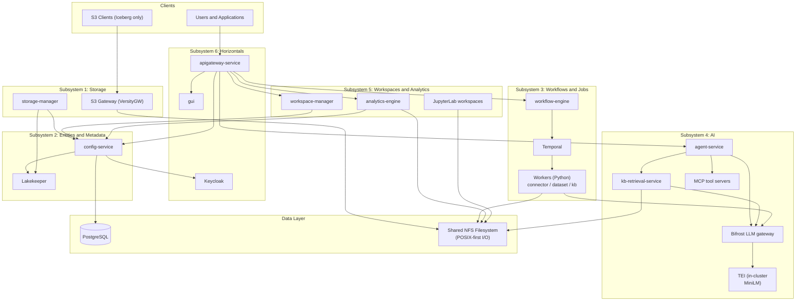

---

## Subsystem 1: Storage / S3 Abstraction Layer

### Overview
The Storage/S3 Abstraction Layer provides a unified interface to access heterogeneous storage backends (NFS, SMB, S3). The platform uses a POSIX-first I/O model where all data plane pods mount the shared NFS PVC directly. The S3 gateway is retained for Iceberg/Lakekeeper catalog operations. This subsystem manages volume mounting, storage root routing, and protocol translation.

### Components

#### 1.1 S3 Gateway (versityGW)
**Role**: S3 protocol implementation layer that translates S3 API calls to filesystem operations.

**Responsibilities**:
- Implements S3-compatible API (GET, PUT, DELETE, LIST operations)
- Translates S3 requests to filesystem operations on mounted volumes
- Handles multipart uploads, range requests, and metadata operations
- Provides S3 authentication and authorization integration

**Scaling & Operations**:
- **Scaling**: Stateless service, can scale horizontally based on S3 request load
- **Resource Requirements**: Moderate CPU (500m-1000m), low memory (512Mi-1Gi)
- **High Availability**: Multiple replicas behind load balancer
- **Dependencies**: Requires mounted volumes via PVCs managed by Storage Manager

#### 1.2 Storage Manager
**Role**: Central coordinator for storage configuration, volume lifecycle, and storage root routing in regional deployments.

**Responsibilities**:
- **Configuration Synchronization**: Periodically syncs storage root assignments from Config Service
- **Volume Management**: Creates and manages Kubernetes StorageClasses, Secrets, and PVCs per storage root
- **Routing Coordination**: Maintains storage-root-to-deployment mappings and routing cache
- **Health Reporting**: Collects and reports metrics/health status to Config Service
- **StorageClass Management**: Creates StorageClasses for static/dynamic provisioning (NFS, SMB)

**Scaling & Operations**:
- **Scaling**: Single instance per deployment (stateful coordination role)
- **Resource Requirements**: Low CPU (200m-500m), moderate memory (512Mi-1Gi)
- **High Availability**: Can run as singleton with leader election if needed
- **Dependencies**: Requires Kubernetes API access, Config Service connectivity

### Architecture Diagram

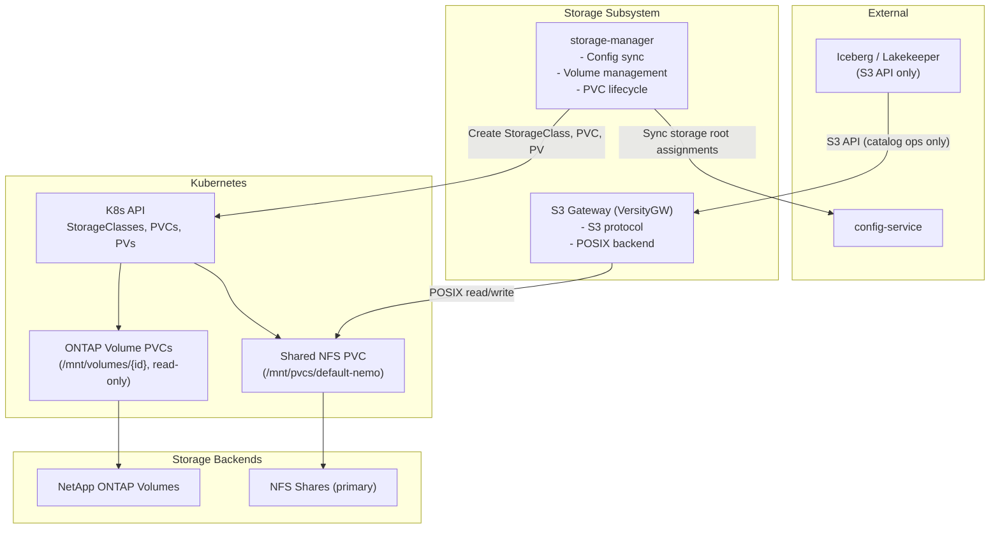

### Data Flow

1. **Storage Root Registration**: Config Service registers storage root with deployment assignment
2. **Config Sync**: Storage Manager pulls storage root assignments from Config Service
3. **Volume Provisioning**: Storage Manager creates StorageClass, Secret, and PVC for storage root
4. **Volume Mounting**: Kubernetes mounts volume to data plane pods
5. **Data Access**: Workers access data via POSIX I/O on the shared NFS mount; S3 API available for catalog operations

---

## Subsystem 2: Entities and Metadata

### Overview
The Entities and Metadata subsystem is the **source of truth** for all platform entities (projects, storage roots, datasets, pipelines, workspaces) and their relationships. It manages metadata persistence, catalog integration, and provides REST APIs for entity lifecycle management.

### Components

#### 2.1 Config Service
**Role**: Central metadata and configuration management service for all platform entities.

**Responsibilities**:
- **Entity Management**: CRUD operations for Projects, storage roots, Datasets, Pipelines, Workspaces, Connectors, Models, Knowledge Bases
- **Project Lifecycle**: Project creation, initialization, deletion workflows
- **Storage Root Management**: Storage root registration, deployment assignment, health tracking
- **Dataset Management**: Dataset creation with catalog integration, schema management, status tracking
- **Pipeline Management**: Pipeline definitions, execution tracking, history
- **Workspace Management**: Workspace metadata, template management, lifecycle state
- **Catalog Integration**: Orchestrates warehouse, namespace, and table creation in Lakekeeper catalog
- **Service Account Management**: Project-level service accounts for service-to-service authentication
- **Deployment Management**: Deployment registration, endpoint management, storage root assignments

**Scaling & Operations**:
- **Scaling**: Stateless service, can scale horizontally (typically 2-3 replicas for HA)
- **Resource Requirements**: Moderate CPU (500m-1000m), moderate memory (1Gi-2Gi)
- **High Availability**: Multiple replicas with shared PostgreSQL database
- **Dependencies**: PostgreSQL (primary), Lakekeeper Catalog (for dataset operations), Keycloak (for auth)

#### 2.2 Lakekeeper Catalog
**Role**: Apache Iceberg-based catalog service for structured data management and query optimization.

**Responsibilities**:
- **Warehouse Management**: S3-backed warehouses mapped to storage roots
- **Namespace Management**: Logical grouping of tables (typically per project)
- **Table Management**: Iceberg table creation, schema management, metadata operations
- **Query Optimization**: Provides table metadata for query engines (DuckDB, Spark, etc.)

**Scaling & Operations**:
- **Scaling**: Stateless service, can scale horizontally
- **Resource Requirements**: Moderate CPU (500m-1000m), moderate memory (1Gi-2Gi)
- **High Availability**: Multiple replicas
- **Dependencies**: S3 storage for table data, PostgreSQL for catalog metadata

### Architecture Diagram

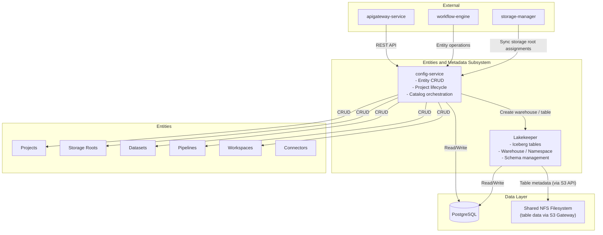

### Key Entities

- **Project**: Top-level container for all resources (storage roots, datasets, pipelines, workspaces)
- **Storage Root (Volume)**: Storage configuration representing a volume (NFS/SMB) or S3 endpoint; I/O is POSIX-first
- **Dataset**: Logical representation of data with catalog integration (Iceberg table)
- **Pipeline**: Directed acyclic graph (DAG) of processing steps for data transformation
- **Workspace**: Isolated environment for data science/analytics (JupyterLab, SQL Workbench)
- **Connector**: Configuration for external data sources (databases, APIs, etc.)

---

## Subsystem 3: Workflows and Jobs

### Overview
The Workflows and Jobs subsystem provides reliable, long-running workflow orchestration using Temporal. It executes complex data processing pipelines, project initialization workflows, and table processing jobs with built-in retry, observability, and state management.

### Components

#### 3.1 Workflow Engine
**Role**: Service that exposes REST APIs for workflow execution and manages Temporal workers.

**Responsibilities**:
- **Workflow Execution**: Starts and manages Temporal workflows (Pipeline, ProjectInit, ProjectDelete, TableProcessing)
- **Execution Tracking**: Maintains execution history and status in database
- **Workflow Workers**: Registers and runs Temporal workers that execute workflow activities
- **API Endpoints**: REST API for starting, canceling, and querying workflow executions

**Scaling & Operations**:
- **Scaling**: Stateless service, can scale horizontally (typically 1-2 replicas)
- **Resource Requirements**: Moderate CPU (500m-1000m), moderate memory (512Mi-1Gi)
- **High Availability**: Multiple replicas with shared Temporal cluster
- **Dependencies**: Temporal server, Config Service (for entity operations)

#### 3.2 Temporal
**Role**: Workflow orchestration engine that provides durable execution, retry logic, and state management.

**Responsibilities**:
- **Workflow Execution**: Executes workflow definitions with guaranteed execution
- **Activity Scheduling**: Schedules and retries activities (with configurable retry policies)
- **State Management**: Maintains workflow state durably
- **History**: Stores complete execution history for debugging and replay

**Scaling & Operations**:
- **Scaling**: Temporal cluster (typically 3-5 nodes for HA)
- **Resource Requirements**: High CPU (1000m-2000m per node), high memory (2Gi-4Gi per node)
- **High Availability**: Multi-node cluster with PostgreSQL backend
- **Dependencies**: PostgreSQL (for workflow history), Elasticsearch (optional, for advanced search)

#### 3.3 Temporal UI
**Role**: Web-based user interface for monitoring and debugging Temporal workflows.

**Responsibilities**:
- **Workflow Visualization**: Visual representation of workflow execution
- **History Viewing**: Browse workflow execution history
- **Debugging**: Inspect workflow state, activities, and failures
- **Search**: Search workflows by name, status, time range

**Scaling & Operations**:
- **Scaling**: Single instance (low traffic)
- **Resource Requirements**: Low CPU (100m-200m), low memory (256Mi-512Mi)
- **High Availability**: Optional, can run multiple instances
- **Dependencies**: Temporal server

#### 3.4 Python Workers
**Role**: Activity workers on Temporal task queues that execute data-intensive operations. Each worker mounts the shared NFS filesystem for direct POSIX I/O. Workers are pure Temporal activity executors with no HTTP API.

**Workers**:

| Worker | Task Queue | Responsibilities | Key Dependencies |
|--------|-----------|-----------------|-----------------|
| **connector-worker** | `connector-operations` | Data acquisition from external sources (S3, databases, ONTAP, GCNV, Redash); streaming pipeline discovery and registration; explorer actions; connector tests | Source system drivers, Redis (streaming), config-service |
| **dataset-processor** | `dataset-processing` | Dataset import (scatter-gather), column stats, PII detection (Presidio/GLiNER), Iceberg write/merge | PII models (Presidio, GLiNER, OCR, CLIP), Lakekeeper, shared FS |
| **kb-processor** | `kb-processing` | Document extraction, chunking, embedding (via Bifrost gateway), LanceDB index creation and merge | Bifrost gateway, shared FS, config-service |

**Resource Profiles**:

| Worker | CPU Request | CPU Limit | Memory Request | Memory Limit | Rationale |
|--------|-----------|---------|--------------|------------|-----------|
| kb-processor | 2 | 4 | 3Gi | 4Gi | Document parsing + chunking + LanceDB merge are CPU-intensive; embeddings themselves now run remotely on TEI / hosted providers via Bifrost (no in-process model load) |
| dataset-processor | 1 | 2 | 2Gi | 4Gi | PII model inference is moderate |
| connector-worker | 500m | 1 | 512Mi | 1Gi | I/O-bound, lightweight compute |

**Startup and Warm-Up**:
- All workers use an init container that waits for Temporal availability (`nc -z temporal 7233`) before starting.
- **dataset-processor** pre-loads PII models (Presidio, GLiNER, OCR, CLIP) at startup before entering the Temporal worker loop. Cold start: ~30-60s depending on model size.
- **kb-processor** has no embedding-model warm-up — embedding calls are HTTP POSTs to the Bifrost gateway, which dispatches to the in-cluster TEI Service for local MiniLM or to a hosted provider for remote models. The TEI pod owns the model-load cost (~30s for MiniLM), not the kb-processor pod. See [unified-embedding-models.md](design/unified-embedding-models.md) for the routing architecture.
- **connector-worker** has no warm-up phase (drivers are loaded per-activity).
- Kubernetes readiness probes should gate traffic until warm-up completes.

**Concurrency Control**:
- `MAX_CONCURRENT_ACTIVITIES` (env, default 2) caps per-pod parallelism via `ThreadPoolExecutor` and Temporal's `max_concurrent_activities`.
- Effective cluster concurrency = `replicas × MAX_CONCURRENT_ACTIVITIES`.
- Each worker type is a separate Kubernetes Deployment with independent replica count and scaling.

**Heartbeat Patterns**:

| Worker | Heartbeat Trigger | Heartbeat Timeout |
|--------|------------------|-------------------|
| kb-processor | Per-file in document processing loop, per-batch during embedding | 5m |
| dataset-processor | Per-file in processing loop, per-batch during analysis | 5m |
| connector-worker | Per-page during DB query or object-store listing; per-5000 files during volume BFS discovery | 5m (acquisition), 45s (explorer) |

#### 3.5 Go Activities (in workflow-engine)
**Role**: Lightweight activities implemented in the workflow-engine process.

**Key Activities**:
- **Project Initialization**: Creates project resources (storage roots, service accounts, catalog setup)
- **Config Service Operations**: Entity CRUD operations via Config Service API
- **Lakekeeper Operations**: Catalog operations (warehouse, table creation)

### Architecture Diagram

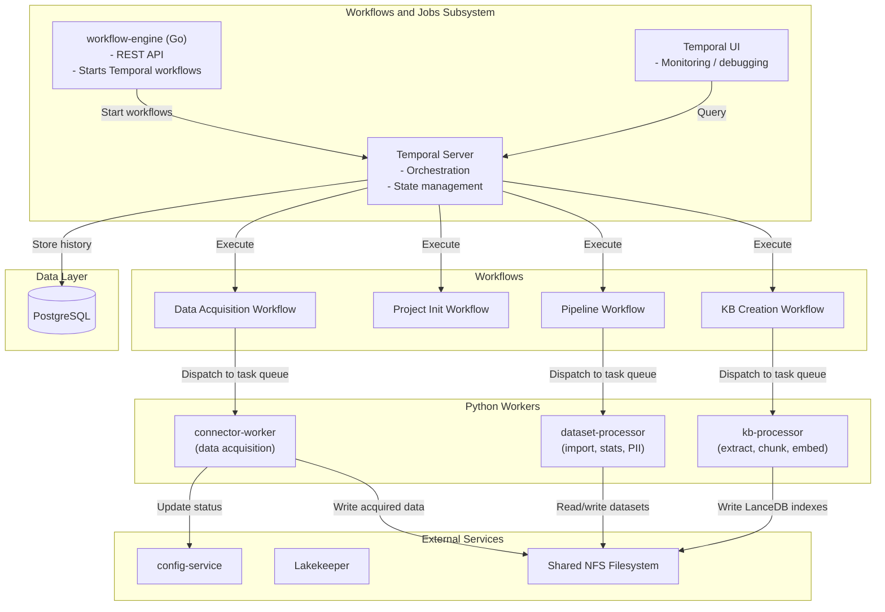

### Workflow Types

1. **Pipeline Workflow**: Executes data processing pipelines defined as DAGs
2. **Project Init Workflow**: Initializes new projects (creates storage roots, service accounts, catalog setup)
3. **Project Delete Workflow**: Cleans up project resources
4. **Table Processing Workflow**: Processes datasets into LanceDB format for analytics

### Workflow Patterns

The platform uses five workflow patterns, chosen based on the operation's complexity and duration:

**Sequential** — Activities run one after another. Used by `ProjectInitWorkflow`, `ProjectDeleteWorkflow`, `DatasetDeleteWorkflow`, `KnowledgeBaseDeleteWorkflow`.

**Scatter-Gather** — Fan-out N parallel activities, gather results, then run an optional merge activity. Used by `DatasetImportWorkflow` and `KnowledgeBaseCreationWorkflow`. Python `CreateWorkPlanActivity` derives a shard count `K_clamped` from total acquired bytes and `WORK_UNIT_MAX_MB`, clamps it with `MAX_WORK_UNITS` (minimum parallelism floor) and `SCATTER_MAX_UNITS_CEILING` (default **2000**, hard max fan-out), then sets `K_eff = max(1, min(K_clamped, n))` so every manifest is non-empty. Files are distributed across `K_eff` shards (largest files spread first, then shuffled round-robin); **per-shard byte and file caps are not enforced** after assignment. Each unit runs independently; a `MergeActivity` combines the results.

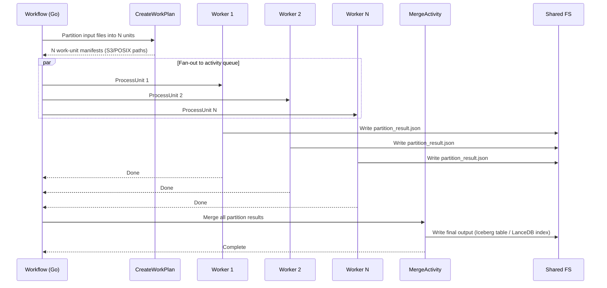

Key scatter-gather behaviors:
- **Partial failure tolerance**: `MaxFailureRate` (default 10%) allows a configurable fraction of work units to fail before the entire workflow fails. Failed units are recorded with error details; the merge runs only if the failure rate is acceptable.
- **File thresholds**: `KB_FILE_THRESHOLD` (default 25) and `DATASET_FILE_THRESHOLD` (default 20) control when scatter engages vs running as a single activity. For clusters with limited worker capacity, raising these avoids scatter overhead.
- **Shard count**: `MAX_WORK_UNITS` (default 10) is the **floor** on partition count when byte-derived `K_raw` would be smaller. `SCATTER_MAX_UNITS_CEILING` (default **2000**) is the hard upper bound. If manifest sizes are all zero, `MAX_FILES_PER_UNIT` is used only as a divisor to estimate `K_raw` (`ceil(n / MAX_FILES_PER_UNIT)`), not as a per-manifest file cap. `MIN_FILES_PER_UNIT` applies only when `WORK_UNIT_MAX_MB=0` (legacy coarse K from file count).
- **Retry**: Default 3 attempts per unit with exponential backoff (10s initial, 2.0 coefficient, 5m max interval).

**DAG (Topological)** — Used by `PipelineWorkflow`. Steps run in topological order; each node executes when all predecessors complete. Steps can be agent invocations (async invoke+poll), human-in-the-loop (Temporal signal/wait), or compute tasks. Data passes between steps via `previousOutputs` with `{{nodeId.field}}` variable interpolation.

**Child Workflow** — A workflow spawns another as a child with its own execution history. `DataAcquisitionWorkflow` spawns `DatasetImportWorkflow` as a child. Parent and child survive independently.

**Streaming (Redis-backed)** — Used by the acquisition pipeline for high-volume file discovery. Discovery activities produce records to a Redis Stream; registration activities consume via `XREADGROUP` consumer groups. See §Streaming Acquisition Pipeline below.

### Streaming Acquisition Pipeline (Redis)

For high-volume data acquisition (millions of files from volumes or object stores), the platform uses a **streaming pipeline** backed by Redis Streams for backpressure-controlled concurrent discovery and registration. This replaces the monolithic single-activity acquisition path.

**Design tenet**: Zero-copy, URI-only dataset creation. Acquisition discovers file metadata (URIs, sizes, timestamps) without reading or copying data content. Data is read only when consumed downstream (KB creation, processing workflow, etc.).

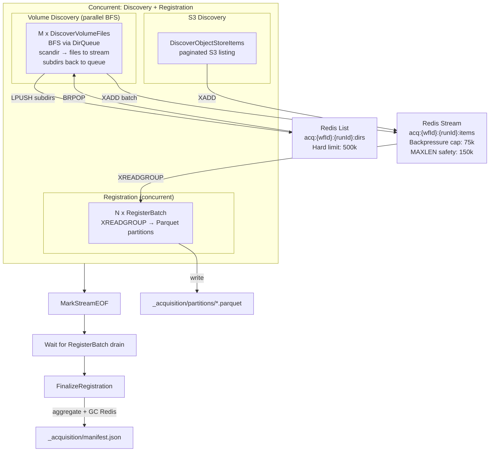

**Redis data structures per job** (keyed by `workflowId` + Temporal `runId` for idempotent retries):
- **Items Stream** (`acq:{wfId}:{runId}:items`): Discovery records with fields `uri`, `relative_path`, `size`, `last_modified`, `metadata`. Unified schema for both volume and S3 sources.
- **State Hash** (`acq:{wfId}:{runId}:state`): Counters for produced/consumed/errors/eofSeen.
- **DirQueue** (`acq:{wfId}:{runId}:dirs`): Redis List for BFS directory traversal (volume path only). Workers self-seed via `HSETNX` + `LPUSH`; idle detection via active-worker counter.
- All keys carry `EXPIRE 86400` as a GC safety net.

**Redis memory safety**:
- **Backpressure cap** (75k entries): Producers block when the stream exceeds 1.5× `ACQ_STREAM_MAXLEN` (default 50k), preventing unbounded growth.
- **XADD MAXLEN** (~150k): Approximate trim on write as a safety net. Consumers drain faster than producers in normal operation.
- **DirQueue hard limit** (500k): Non-blocking; workers raise `RuntimeError` if exceeded (normal filesystems never hit this — BFS frontier is typically a few thousand entries).
- **Redis pod resources**: 512Mi request / 2Gi limit (default); 128Mi / 512Mi for resource-constrained deployments.

**Failure handling**:
- **Discovery worker crash**: Temporal retries; new instance joins the BFS via DirQueue. One directory's files may be lost (BRPOP is destructive — Phase 3 upgrades to Redis Stream-based DirQueue for crash-safe reclaim).
- **RegisterBatch crash**: Temporal retries; `XAUTOCLAIM` reclaims idle entries from dead consumers. Partial Parquet files are orphaned (not referenced in any manifest).
- **Redis unavailable**: `ping()` check fails, activity raises. Fallback: `ACQ_USE_PIPELINE=false` reverts to legacy single-activity path.
- **Workflow cancelled/timed out**: Cleanup goroutine GCs all Redis keys + DirQueue.

**Configuration** (Workflow Engine envs):

| Env | Default | Purpose |
|-----|---------|---------|
| `ACQ_USE_PIPELINE` | `true` | Enable streaming pipeline (false = legacy single-activity) |
| `ACQ_MAX_DISCOVER_WORKERS` | `2` | Parallel BFS discovery activities (M) |
| `ACQ_MAX_REGISTER_CONSUMERS` | `2` | Parallel RegisterBatch consumers (N) |

**Configuration** (connector-worker envs):

| Env | Default | Purpose |
|-----|---------|---------|
| `ACQ_REDIS_URL` | `redis://redis-master:6379/3` | Standalone Redis URL |
| `ACQ_REDIS_SENTINEL_URL` | *(empty)* | Preferred HA path |
| `ACQ_STREAM_MAXLEN` | `50000` | Approximate XADD MAXLEN cap |
| `ACQ_BATCH_SIZE` | `64` | Items per XREADGROUP call |
| `ACQ_BLOCK_MS` | `2000` | XREADGROUP block timeout |
| `ACQ_RECLAIM_IDLE_MS` | `300000` | XAUTOCLAIM idle threshold for dead consumer reclaim |

### Inter-Activity Data Flow

Activities do not pass large payloads through Temporal. Instead, upstream activities write results to deterministic filesystem paths, and downstream activities read from those paths. Temporal payloads carry only small metadata (file lists, paths, configuration).

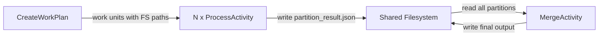

Key mechanisms:
- **FileListKey**: Acquisition workflows write handoff metadata under `projects/<projectId>/datasets/<datasetId>/_acquisition/` (`filelist.json` for streaming object store finalize, `manifest.json` for volume registration). The POSIX key is propagated as `FileListKey` through `DatasetImportWorkflowInput` → `CreateWorkPlanInput`. When empty, `CreateWorkPlanActivity` probes those files under `_acquisition/` before listing `data_files/`.
- **Deterministic paths**: Activities write to predictable paths (e.g. `partition_result.json` per unit), so re-execution on retry safely overwrites the same keys.
- **Blue-green writes (KB)**: KB creation writes embeddings and LanceDB tables to a new prefix (e.g. `lancedb-{timestamp}/`) and atomically updates `metadata.json` to point at the new path. Partial writes never corrupt the live KB; retrieval follows the pointer in `metadata.json`.

### Progress Tracking

Progress is a best-effort, non-blocking channel distinct from heartbeats. Workers POST to the Workflow Engine's in-memory `ProgressStore` (keyed by workflow ID) every ~5 seconds. Config Service enriches entity responses (datasets, KBs) by fetching live progress from the ProgressStore so the GUI shows real-time status (phase, percentage, per-unit breakdown with up to 200 units).

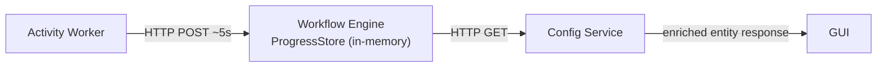

**Limitation**: ProgressStore is in-memory and lost on workflow-engine restart. This also blocks workflow-engine HPA — multiple replicas would have inconsistent progress state. Prerequisite for HA: migrate to a shared backend (Redis).

### Graceful Shutdown

Volume mount changes (via `VolumeMountSet` CRs) and Helm upgrades trigger rolling restarts of worker Deployments. Three coordinated layers ensure in-flight activities are not killed:

| Layer | Component | Value | Purpose |
|-------|-----------|-------|---------|
| 1 | Helm `maxUnavailable` | 0, `maxSurge: 1` | No capacity drop during rollout; new pod must pass readiness before old pod terminates |
| 2 | Temporal `graceful_shutdown_timeout` | 90s | On SIGTERM, stop polling for new tasks; wait for in-flight activities to complete |
| 3 | K8s `terminationGracePeriodSeconds` | 120s | Longer than Layer 2; gives SDK time to drain before kubelet sends SIGKILL |

**Activity takeover on restart**: Temporal does not pin activity tasks to specific workers. When a pod dies, the server detects the loss via heartbeat timeout. After `HeartbeatTimeout` elapses with no heartbeats, the activity is retried and dispatched to any available worker on the same queue. Delay: up to `HeartbeatTimeout` (e.g. 5 minutes for KB/dataset activities).

---

## Subsystem 4: AI

### Overview
The AI subsystem provides infrastructure and services for integrating Large Language Models (LLMs), building AI agents, managing knowledge bases, and enabling Model Context Protocol (MCP) integrations.

### Components

#### 4.1 Bifrost LLM Gateway
**Role**: The sole LLM gateway. All chat-completion **and** all embedding traffic (built-in MiniLM via TEI, registered OpenAI / Cohere / Voyage / Azure / Bedrock) flows through Bifrost. There is no parallel LiteLLM proxy; Agno's `litellm.LiteLLM` class is used only as a transport SDK to reach the Bifrost endpoint.

**Responsibilities**:
- **Provider Abstraction**: Unified OpenAI-compatible API for chat completions, embeddings, and MCP tool dispatch.
- **Per-Project Governance**: 1 project ↔ 1 Bifrost team ↔ 1 virtual key (`as-proj-{projectId}-vk`). Allowed-model lists, rate limits, and spend tracking attach to the VK; see [bifrost-migration.md](design/bifrost-migration.md).
- **Per-Credential Provider Keys**: Per AgentStudio credential, Bifrost holds one key named `as-cred-{credentialId}` so different OpenAI organisations / API keys don't collide in a shared namespace. For `openai_compatible` upstreams (the only case where Bifrost's native provider can't be used because its base URL is hardcoded), AgentStudio additionally creates a per-credential custom Bifrost provider named `as-openai-compat-{credentialShortId}` so each credential's `endpoint` becomes a distinct provider `base_url`.
- **MCP Routing**: Each registered MCP server is a Bifrost MCP client; tools are dispatched through a single aggregated endpoint.

**Embedding routing**:
- **Local**: `sentence-transformers/all-MiniLM-L6-v2` hosted by an in-cluster TEI deployment (`tei-minilm:80`), registered with Bifrost as the `as-tei-minilm` provider. kb-processor and kb-retrieval-service both call Bifrost; Bifrost dispatches to TEI.
- **Remote**: Hosted providers reached via per-credential provider keys.
- **Identity**: kb-processor stamps the Bifrost wire identifier (`embeddingGatewayModelId`) in the KB's `metadata.json` at index time; kb-retrieval-service reads the same field at query time. Full schema + identity flow in [unified-embedding-models.md](design/unified-embedding-models.md).

**Scaling & Operations**:
- **Scaling**: Stateless; scale horizontally on request volume.
- **Resource Requirements**: Moderate CPU (500m-1000m), moderate memory (1Gi-2Gi).
- **High Availability**: Multiple replicas behind a ClusterIP Service; the chart supports an `external-bifrost` overlay for Azure-hosted Bifrost.
- **Dependencies**: External LLM provider APIs; in-cluster TEI (for local embeddings); PostgreSQL `config_store` for VK / team state.

#### 4.2 MCP Tool Servers
**Role**: Containerized Model Context Protocol servers that expose domain-specific tools to agents (ONTAP, Kubernetes, PostgreSQL, DuckDB, GitHub, Prometheus, web search, filesystem, and more).

**Responsibilities**:
- **Tool Exposure**: Each server implements the MCP protocol for a specific domain
- **Lifecycle**: Managed as sidecar containers or standalone deployments via the MCP server catalog in Config Service

**Scaling & Operations**:
- **Scaling**: Each MCP server is independently scalable
- **Resource Requirements**: Varies by server (typically low CPU/memory)
- **Dependencies**: Domain-specific backends (databases, APIs, etc.)

#### 4.3 Agent Service
**Role**: Service for building and managing AI agents that can perform complex tasks using LLMs and tools.

**Responsibilities**:
- **Agent Orchestration**: Manages agent execution and tool usage
- **Task Planning**: Breaks down complex tasks into subtasks
- **Tool Integration**: Calls MCP tool servers for domain-specific actions
- **State Management**: Maintains agent state and conversation history
- **LLM Integration**: Calls Bifrost's OpenAI-compatible `/litellm/v1/chat/completions` endpoint via Agno's `agno.models.litellm.LiteLLM` class (transport-only SDK, not a separate gateway).

**Scaling & Operations**:
- **Scaling**: Stateless service, can scale horizontally
- **Resource Requirements**: Moderate CPU (500m-1000m), moderate memory (1Gi-2Gi)
- **High Availability**: Multiple replicas
- **Dependencies**: Bifrost gateway, MCP tool servers, kb-retrieval-service, Config Service

#### 4.4 kb-retrieval-service
**Role**: Service for knowledge base search (vector, FTS, hybrid, rerank) used by AI agents for RAG (Retrieval-Augmented Generation).

**Responsibilities**:
- **Knowledge Base Search**: Vector, full-text, and hybrid search over knowledge base content
- **Document Ingestion**: Processes and indexes documents for retrieval
- **Reranking**: Reranks search results for improved relevance
- **RAG Integration**: Integrates with Agent Service for RAG workflows

**Scaling & Operations**:
- **Scaling**: Stateless service, can scale horizontally
- **Resource Requirements**: Moderate CPU (500m-1000m), high memory (2Gi-4Gi) for vector indexes
- **High Availability**: Multiple replicas with shared vector database
- **Dependencies**: LanceDB tables on shared filesystem, Config Service

### Architecture Diagram

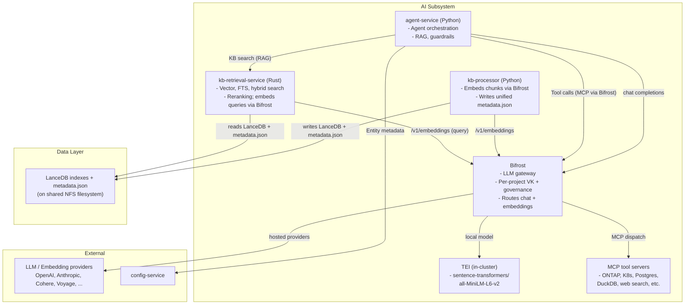

---

## Subsystem 5: Workspaces & Analytics

### Overview
The Workspaces & Analytics subsystem provides isolated environments for data science and analytics work, along with interactive SQL query capabilities and analytics engines.

### Components

#### 5.1 Workspace Manager
**Role**: Orchestrates Kubernetes resources for workspace lifecycle management.

**Responsibilities**:
- **Workspace Lifecycle**: Creates, updates, deletes workspace Kubernetes resources (Pods, Services, PVCs)
- **Resource Management**: Manages CPU, memory, and storage resources per workspace
- **Status Monitoring**: Polls Kubernetes API to track workspace status
- **Token Generation**: Generates authentication tokens for workspace access
- **CRD Management**: Manages Workspace CRDs for declarative workspace management

**Scaling & Operations**:
- **Scaling**: Stateless service, can scale horizontally (typically 1-2 replicas)
- **Resource Requirements**: Low CPU (200m-500m), low memory (512Mi-1Gi)
- **High Availability**: Multiple replicas
- **Dependencies**: Kubernetes API, Config Service (for workspace metadata)

#### 5.2 Analytics Engine
**Role**: Provides Arrow Flight SQL interface for interactive analytics on datasets.

**Responsibilities**:
- **Arrow Flight SQL**: Implements Arrow Flight SQL protocol for query execution
- **Query Execution**: Executes SQL queries on LanceDB tables
- **Result Streaming**: Streams query results in Arrow format
- **Connection Management**: Manages client connections and sessions
- **Query Caching**: Caches query results for performance

**Scaling & Operations**:
- **Scaling**: Stateless service, can scale horizontally based on query load
- **Resource Requirements**: High CPU (1000m-2000m), high memory (2Gi-4Gi) for query execution
- **High Availability**: Multiple replicas behind load balancer
- **Dependencies**: LanceDB tables on shared filesystem, Config Service (for dataset metadata)

#### 5.3 SQL Workbench
**Role**: Interactive SQL query interface for ad-hoc analytics.

**Responsibilities**:
- **SQL Editor**: Provides web-based SQL editor
- **Query Execution**: Executes queries via Analytics Engine
- **Result Visualization**: Displays query results in tables/charts
- **Query History**: Maintains history of executed queries
- **Connection Management**: Manages connections to Analytics Engine

**Scaling & Operations**:
- **Scaling**: Stateless service, can scale horizontally
- **Resource Requirements**: Low CPU (200m-500m), low memory (512Mi-1Gi)
- **High Availability**: Multiple replicas
- **Dependencies**: Analytics Engine

#### 5.4 JupyterLab
**Role**: Interactive data science workspace with notebook support.

**Responsibilities**:
- **Notebook Execution**: Runs Jupyter notebooks with Python/R kernels
- **Data Access**: Provides access to datasets via shared NFS filesystem (POSIX)
- **Library Management**: Manages Python/R package installations
- **File Management**: File browser and editor for workspace files
- **Terminal Access**: Provides terminal access for command-line operations

**Scaling & Operations**:
- **Scaling**: One pod per workspace (user-specific)
- **Resource Requirements**: Variable (user-configurable, typically 2-4 CPU, 4-8Gi memory)
- **High Availability**: Not applicable (user-specific pods)
- **Dependencies**: Shared NFS filesystem (for workspace files and datasets), Config Service (for workspace metadata)

### Architecture Diagram

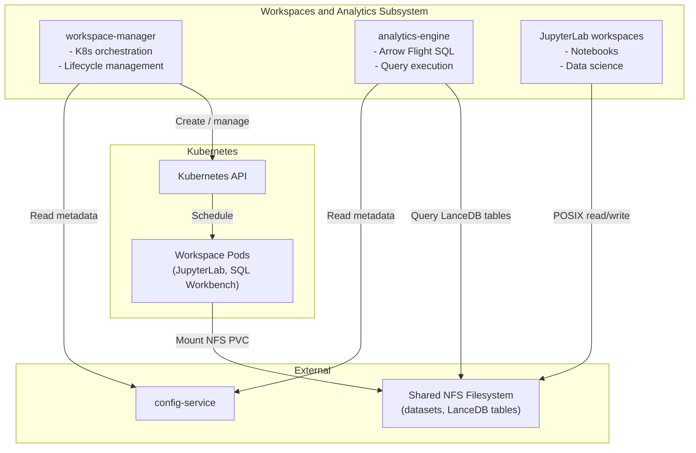

---

## Subsystem 6: Horizontals

### Overview
The Horizontals subsystem provides cross-cutting concerns that are used by all other subsystems: API gateway/routing, user interface, and authentication/authorization.

### Components

#### 6.1 API Gateway
**Role**: Entry point for all external requests, handles routing, proxying, and authentication.

**Responsibilities**:
- **Request Routing**: Routes requests to appropriate backend services based on path/domain
- **Workspace Subdomain Routing**: Routes workspace subdomains (ws-{workspaceId}.domain) to workspace pods
- **S3 Proxy**: Proxies S3 requests to Storage Manager/S3 Gateway
- **Keycloak Proxy**: Proxies authentication requests to Keycloak
- **Workspace Proxy**: Proxies requests to workspace services (JupyterLab, SQL Workbench)
- **Load Balancing**: Distributes requests across service replicas
- **SSL/TLS Termination**: Handles HTTPS termination

**Scaling & Operations**:
- **Scaling**: Stateless service, can scale horizontally (typically 2-3 replicas for HA)
- **Resource Requirements**: Moderate CPU (500m-1000m), moderate memory (512Mi-1Gi)
- **High Availability**: Multiple replicas behind load balancer (Ingress/LoadBalancer)
- **Dependencies**: All backend services, Keycloak (for auth)

#### 6.2 GUI
**Role**: Web-based user interface for platform interaction.

**Responsibilities**:
- **Project Management**: UI for creating/managing projects
- **Dataset Management**: UI for creating/managing datasets
- **Pipeline Editor**: Visual pipeline editor for creating data pipelines
- **Workspace Management**: UI for launching/managing workspaces
- **Analytics Interface**: UI for SQL Workbench and analytics
- **Authentication UI**: Login/logout interface

**Scaling & Operations**:
- **Scaling**: Stateless service, can scale horizontally (typically 2-3 replicas)
- **Resource Requirements**: Low CPU (200m-500m), low memory (512Mi-1Gi)
- **High Availability**: Multiple replicas
- **Dependencies**: API Gateway (for backend API access), Keycloak (for auth)

#### 6.3 Keycloak
**Role**: Identity and Access Management (IAM) service for authentication and authorization.

**Responsibilities**:
- **Authentication**: User login, OAuth2/OIDC flows
- **Authorization**: Role-based access control (RBAC)
- **User Management**: User CRUD operations
- **Service Accounts**: Service account management for service-to-service auth
- **Token Management**: Issues and validates JWT tokens
- **Realm Management**: Multi-tenant realm support

**Scaling & Operations**:
- **Scaling**: Can scale horizontally (typically 2-3 replicas for HA)
- **Resource Requirements**: Moderate CPU (500m-1000m), moderate memory (1Gi-2Gi)
- **High Availability**: Multiple replicas with shared database
- **Dependencies**: PostgreSQL (for user/role data), LDAP (optional, for external user directory)

### Architecture Diagram

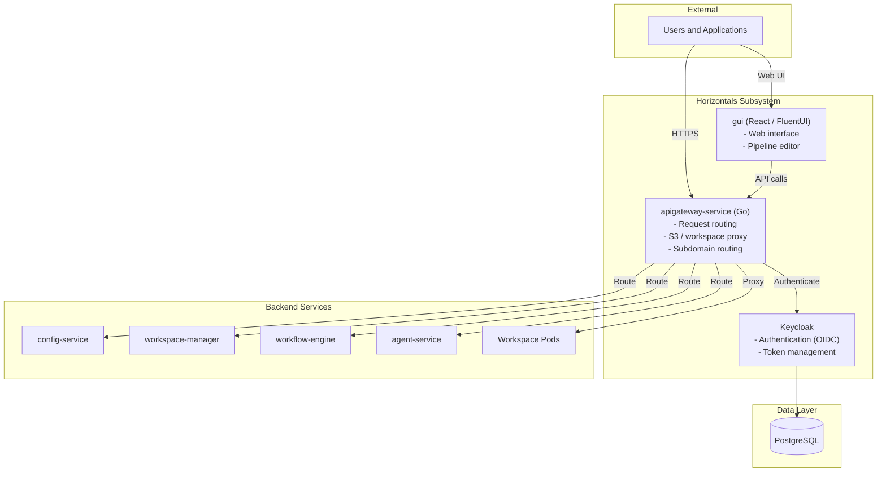

---

## Scaling and Operational Considerations

### Horizontal Scaling Strategy

#### Stateless Services (Scale Horizontally)
- **API Gateway**: 2-3 replicas (load-based scaling)
- **Config Service**: 2-3 replicas (HA requirement)
- **Workflow Engine**: 1-2 replicas (low traffic; HA currently blocked by in-memory ProgressStore — see below)
- **Analytics Engine**: 2-5 replicas (query load-based)
- **Agent Service**: 2-5 replicas (LLM request concurrency)
- **GUI**: 2-3 replicas (user load-based)
- **Keycloak**: 2-3 replicas (HA requirement)
- **S3 Gateway**: 3-10 replicas (S3 request load-based)
- **Storage Manager**: 1 replica per deployment (coordination role)

#### Stateful Services (Single Instance or Clustered)
- **Temporal**: 3-5 node cluster (HA requirement)
- **PostgreSQL**: Primary-replica setup (HA requirement)
- **Redis**: Sentinel-based HA (used by agent session store and streaming pipeline)
- **Lakekeeper Catalog**: 2-3 replicas (stateless, can scale)

#### User-Specific Services (One Per User)
- **JupyterLab Workspaces**: One pod per workspace (user-specific)
- **SQL Workbench Workspaces**: One pod per workspace (user-specific)

### Worker Scaling

Worker scaling is the most operationally significant scaling dimension because processing workloads (KB creation, dataset import, data acquisition) can be both bursty and long-running.

#### Task Queue Architecture

Each worker type polls a dedicated Temporal task queue, providing resource and fault isolation:

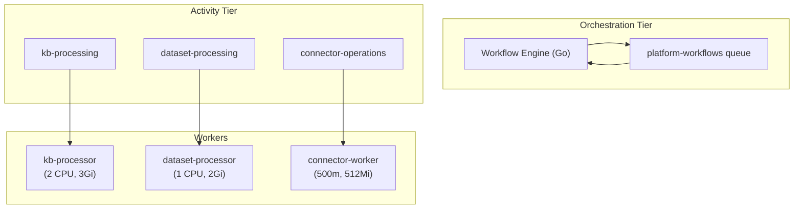

Queue isolation means a misbehaving KB worker cannot starve connector operations, and each worker type scales independently based on its own workload.

#### Horizontal Pod Autoscaling (HPA)

HPA templates exist for all three worker types. Two scaling signals are used:

| Signal | Metric | Source |
|--------|--------|--------|
| CPU-based | `targetCPUUtilizationPercentage` | Standard Kubernetes metrics |
| Queue backlog | `temporal_queue_backlog_{type}` | Temporal server → Prometheus → Prometheus Adapter |

Custom-metric (backlog-based) scaling is the preferred signal because it reacts to *queued work* rather than *current load*, enabling proactive scale-up before workers saturate. It requires deploying the Prometheus adapter to expose Temporal queue depth as a Kubernetes custom metric.

**Key Temporal scaling metrics**:
- `temporal_worker_task_slots_available`: Free activity slots across all worker pods. When zero, all workers are saturated and new activities queue.
- `schedule_to_start_latency`: Time activities spend waiting in queue before a worker picks them up. The best lagging indicator for insufficient capacity.
- `ScheduleToStartTimeout` (15m for dataset import): Acts as a backpressure signal — if activities wait longer than this, they fail, surfacing a scaling problem to operators.

#### Concurrency Tuning (Scatter-Gather)

Scatter-gather workflows dispatch N work units to the activity queue, but units execute only as fast as worker capacity allows:

| Tuning Lever | Default | Effect |
|-------------|---------|--------|
| `replicas` | 1 | More pods = more parallel activity slots |
| `MAX_CONCURRENT_ACTIVITIES` | 2 | More slots per pod (needs more CPU/memory per pod) |
| `KB_FILE_THRESHOLD` | 25 | Higher = fewer scatters, less overhead for small KBs |
| `DATASET_FILE_THRESHOLD` | 20 | Higher = fewer scatters, less overhead for small datasets |
| `MAX_WORK_UNITS` | 10 | Minimum scatter shard count when sizing from bytes |
| `SCATTER_MAX_UNITS_CEILING` | 2000 | Hard maximum shard count (`K_clamped` upper bound) |
| `WORK_UNIT_MAX_MB` | 5 | Target MiB per shard for **K sizing only** (not a per-shard cap after assignment) |
| `MAX_FILES_PER_UNIT` | 100 | Divisor for `K_raw` when `total_bytes=0` only |

With `replicas: 1` and `MAX_CONCURRENT_ACTIVITIES: 2`, a 7-unit KB scatter runs in waves of 2 — roughly 4× the single-unit duration. Increasing either lever improves parallelism; the optimal setting depends on cluster capacity and workload mix. Very large `K_eff` increases Temporal child activity count and worker load.

**Scale-to-zero**: Workers can scale to zero replicas when idle. Activities dispatched while no workers are running queue in Temporal until workers scale up, subject to `ScheduleToStartTimeout`.

#### Workflow Engine HA Limitation

Workflow Engine HPA is currently blocked by the in-memory `ProgressStore` — multiple replicas would have inconsistent progress state. Prerequisite for HA: migrate ProgressStore to a shared Redis backend, then add HPA for the workflow-engine Deployment.

### Resource Requirements Summary

| Service | CPU (requests) | Memory (requests) | CPU (limits) | Memory (limits) | Scaling |
| ------- | -------------- | ----------------- | ------------ | ---------------- | ------- |
| API Gateway | 500m | 512Mi | 1000m | 1Gi | Horizontal (2-3) |
| Config Service | 500m | 1Gi | 1000m | 2Gi | Horizontal (2-3) |
| Storage Manager | 200m | 512Mi | 500m | 1Gi | Single (1) |
| S3 Gateway | 500m | 512Mi | 1000m | 1Gi | Horizontal (3-10) |
| Workflow Engine | 500m | 512Mi | 1000m | 1Gi | Single (1-2) |
| Temporal | 1000m | 2Gi | 2000m | 4Gi | Cluster (3-5) |
| Analytics Engine | 1000m | 2Gi | 2000m | 4Gi | Horizontal (2-5) |
| Agent Service | 500m | 1Gi | 1000m | 2Gi | Horizontal (2-5) |
| kb-processor | 2 | 3Gi | 4 | 4Gi | HPA (1-5) |
| dataset-processor | 1 | 2Gi | 2 | 4Gi | HPA (1-3) |
| connector-worker | 500m | 512Mi | 1 | 1Gi | HPA (1-3) |
| Workspace Manager | 200m | 512Mi | 500m | 1Gi | Horizontal (1-2) |
| GUI | 200m | 512Mi | 500m | 1Gi | Horizontal (2-3) |
| Keycloak | 500m | 1Gi | 1000m | 2Gi | Horizontal (2-3) |
| Redis | 256m | 512Mi | 500m | 2Gi | Sentinel HA |

### High Availability Considerations

1. **Database**: PostgreSQL primary-replica setup with automatic failover
2. **Temporal**: Multi-node cluster with shared PostgreSQL backend
3. **Redis**: Sentinel-based HA for agent sessions and streaming pipeline; fallback to standalone for development
4. **Stateless Services**: Multiple replicas behind load balancer
5. **Storage**: Persistent volumes with replication (if supported by storage backend)
6. **Regional Deployments**: Multiple regional deployments for geographic redundancy
7. **Workflow Engine**: Single instance until ProgressStore is externalized to Redis

### Monitoring and Observability

1. **Metrics**: Every AgentStudio service exposes `GET /metrics` in Prometheus exposition format (request count, latency by route/method/status). ServiceMonitor CRDs in the AgentStudio Helm chart enable Prometheus scraping.
2. **Logging**: Structured JSON logs to stdout with correlation ID (`X-Request-Id`) and optional trace ID (`traceparent`). The API Gateway generates or forwards the request ID to all backends.
3. **Tracing**: OpenTelemetry (OTLP) distributed tracing with W3C Trace Context propagation. Enabled per-service via `OTEL_EXPORTER_OTLP_ENDPOINT`. Trace backend: Jaeger (or Tempo). **LLM/agent-level traces** from **agent-service** are exported to **Arize Phoenix** (in `monitoring`) via `PHOENIX_COLLECTOR_ENDPOINT`; Phoenix UI is served at `phoenix.{endpoint}` through the API Gateway.
4. **Health Checks**: Kubernetes liveness (`/health`) and readiness (`/ready`) probes on all services.
5. **Workflow Monitoring**: Temporal UI for workflow execution monitoring.
6. **Observability Stack**: Prometheus, Grafana, **Arize Phoenix** (LLM traces), and optional Jaeger deployed separately (see `make helm-observability-upgrade`, [KIND_METRICS_SETUP.md](observability/KIND_METRICS_SETUP.md), and [phoenix-runbook.md](observability/phoenix-runbook.md)).

### Disaster Recovery

1. **Database Backups**: Regular PostgreSQL backups
2. **Temporal History**: Temporal workflow history in PostgreSQL (backed up)
3. **Config Service State**: PostgreSQL backups include all entity metadata
4. **Storage Backups**: Depends on underlying storage backend (NFS/SMB/S3)
5. **Recovery Procedures**: Documented procedures for restoring from backups

### Operational Runbooks

1. **Service Restart**: Procedures for restarting services
2. **Scaling**: Procedures for scaling services up/down
3. **Database Maintenance**: Procedures for database backups, restores, migrations
4. **Troubleshooting**: Common issues and resolution procedures
5. **Incident Response**: Procedures for handling incidents

---

## Conclusion

This High-Level Design document provides a comprehensive overview of the AgentStudio platform architecture, organized into six major subsystems:

1. **Storage**: POSIX-first I/O on shared NFS filesystem; S3 compatibility for Iceberg catalog
2. **Entities and Metadata**: Central metadata management and catalog integration
3. **Workflows and Jobs**: Reliable workflow orchestration with Temporal; scatter-gather and streaming (Redis-backed) patterns for high-volume processing; dedicated Python workers with HPA scaling; graceful shutdown for rolling updates
4. **AI**: LLM integration + embeddings + MCP routing all via the Bifrost gateway (per-project virtual keys for governance); agents and teams (Agno); RAG via kb-retrieval-service; in-cluster TEI for built-in MiniLM embeddings; Phoenix tracing
5. **Workspaces & Analytics**: Isolated environments and interactive analytics via Arrow Flight SQL
6. **Horizontals**: Cross-cutting concerns (gateway, UI, auth)

Each subsystem is designed to scale independently and operate reliably in a Kubernetes environment, with clear separation of concerns and well-defined interfaces between components. The workflow system in particular uses multiple orchestration patterns (sequential, scatter-gather, DAG, streaming) to handle workloads ranging from seconds-long interactive operations to hours-long batch processing with millions of files.
