# AgentStudio Architecture Diagrams

Mermaid source for platform architecture diagrams. For prose context see [HLD.md](HLD.md) and [design/platform-hld.md](design/platform-hld.md).

> **Gateway rename.** Diagrams below label the LLM gateway as **Bifrost** (formerly LiteLLM). The transport SDK Agno uses to reach Bifrost is still named `agno.models.litellm.LiteLLM`, but it is not a separate gateway — see [bifrost-migration.md](design/bifrost-migration.md). All embedding traffic (built-in MiniLM via in-cluster TEI, and remote OpenAI / Cohere / Voyage / etc.) also flows through Bifrost; see [unified-embedding-models.md](design/unified-embedding-models.md).

## 1. Overall System Architecture

All services run in a single Kubernetes deployment. Storage is POSIX-first: every data plane pod mounts the shared NFS PVC. The S3 Gateway is retained only for Iceberg/Lakekeeper catalog operations.

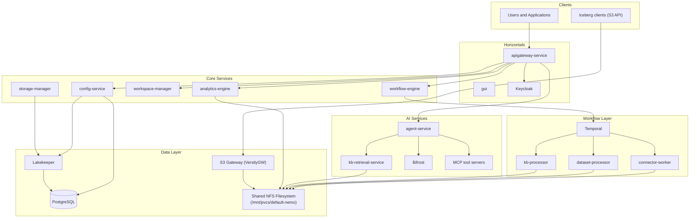

## 2. Service Interaction Overview

Simplified view of how services call each other.

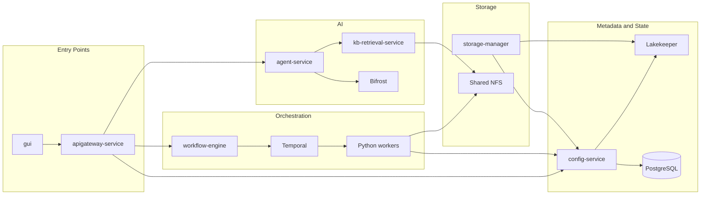

## 3. Storage and I/O Model

The platform uses POSIX-first I/O. All data plane pods mount the shared NFS PVC at `/mnt/pvcs/default-nemo`. VersityGW exposes this as an S3-compatible API only for Iceberg/Lakekeeper.

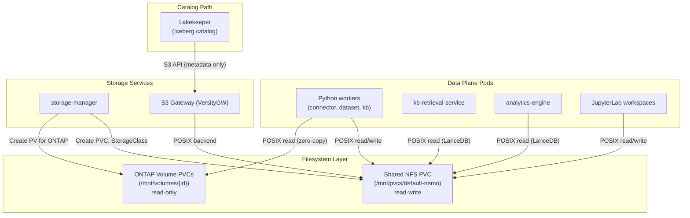

## 4. Request Flow: Data Acquisition

How data flows from an external source into the platform.

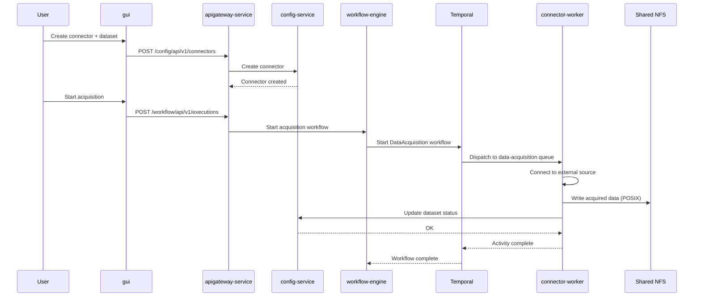

## 5. Request Flow: KB Creation and RAG Query

How a knowledge base is built and queried.

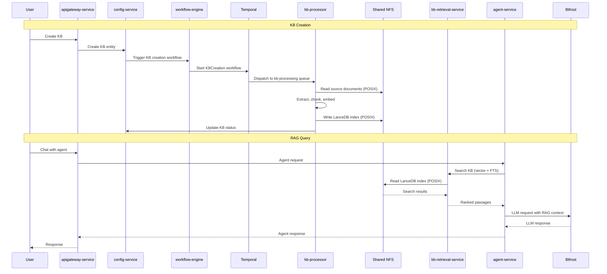

## 6. Request Flow: Connector Acquisition (Streaming Pipeline)

How the streaming acquisition pipeline pulls data from an S3-compatible object store. Database and volume acquisition use simpler single-activity paths (see [connectors.md](design/connectors.md)).

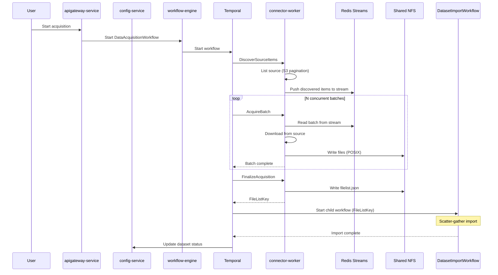

## 7. Request Flow: Pipeline Execution (DAG)

How a pipeline runs nodes in topological order, including agent blocks and human-in-the-loop.

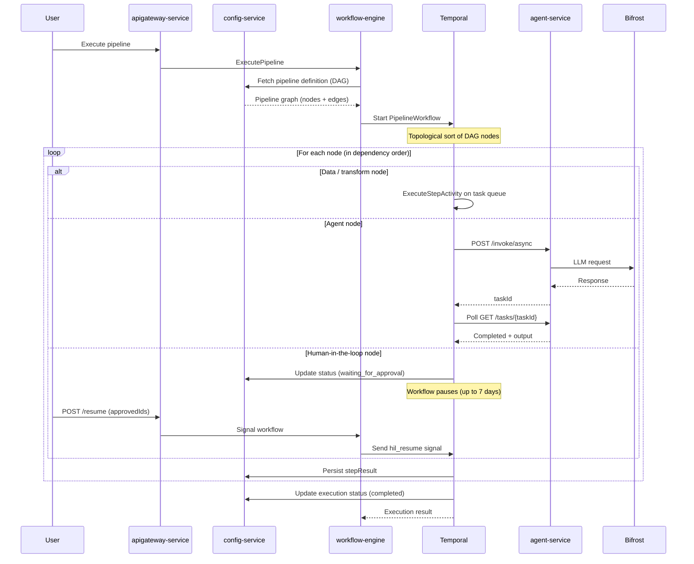

## 8. Request Flow: Dataset Import (Scatter-Gather)

How acquired or uploaded data is processed into a dataset with stats and PII detection.

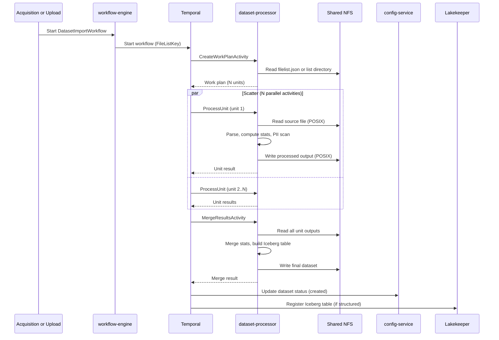

## 9. Request Flow: Project Initialization

How a new project is set up.

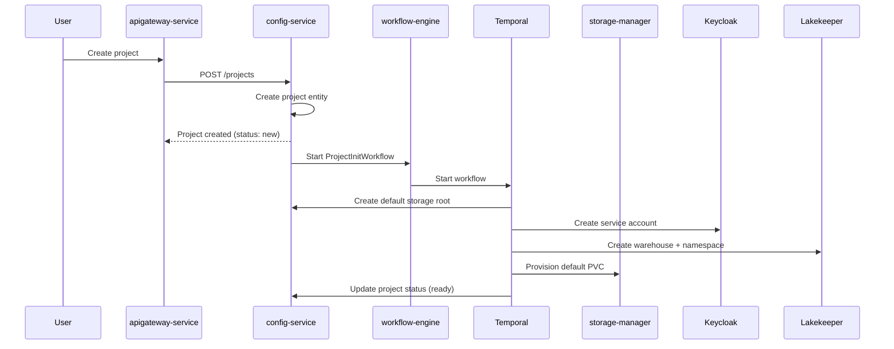

## 10. Agent Invocation (Single Agent)

How a single agent processes a user message: config lookup, RAG retrieval, LLM call via Bifrost, MCP tool execution, session memory, and tracing.

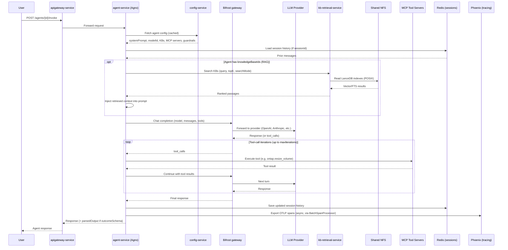

## 11. Agent Team Invocation

How an agent team (manager + member agents) handles a request. The manager agent coordinates member agents using one of three orchestration modes: **coordinate** (manager delegates and synthesizes), **route** (manager picks one member), or **collaborate** (members work in sequence). Teams can nest (a team member can itself be a team).

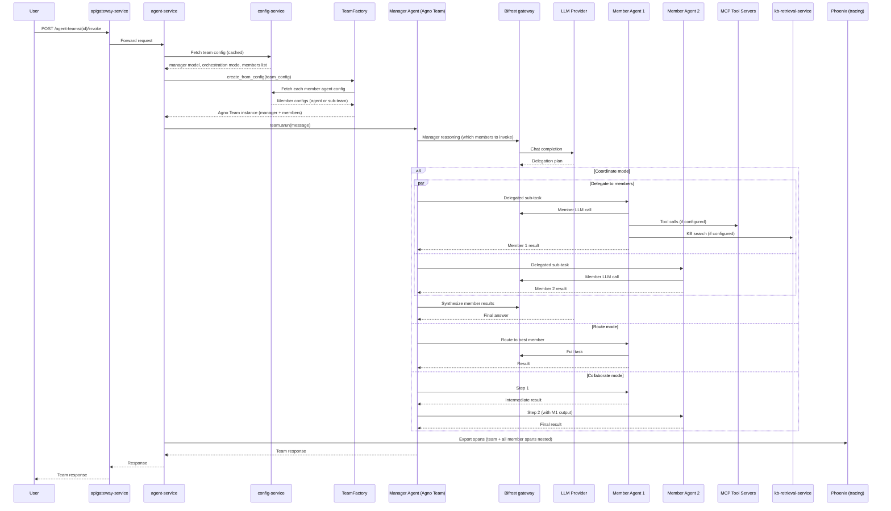

## 12. Agent Service Internal Architecture

Component-level view of agent-service showing how the pieces fit together.

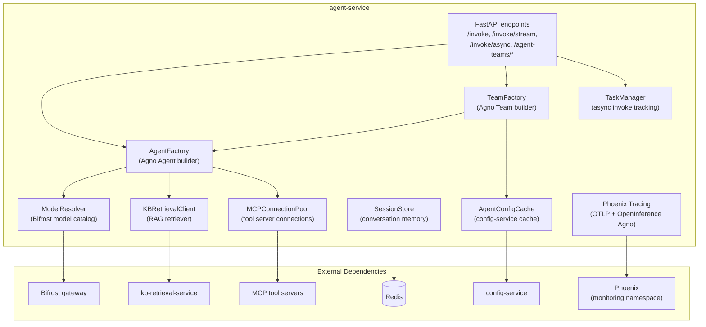

## 13. Memory Management (Conversation Memory & Context)

How conversation memory flows from the UI form to runtime buffer trimming. The
locked schema lives in `memoryContext` (jsonb) on `agents` and `agent_teams`;
config-service derives the legacy `memoryType` + `memoryConfig` columns on save
for agent-service back-compat; MAF reads `memoryContext` directly at bundle
load and constructs the right buffer.

### 13.1 Schema, Storage & Source-of-Truth

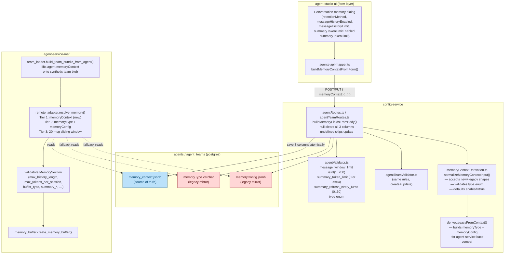

**Locked defaults** (constants kept in both `MemoryContextDerivation.ts` and
`remote_adapter._DEFAULT_*`):

- `message_window_limit` → 20 messages
- `summary_token_limit` → 2000 tokens
- `summary_refresh_every_turns` → 0 (always summarize on overflow)
- `enabled` → true when absent (a missing field must NOT silently disable memory)
- `type` → `'window'` when enabled and unset; `'none'` when explicitly disabled

### 13.2 Runtime Flow per Invocation

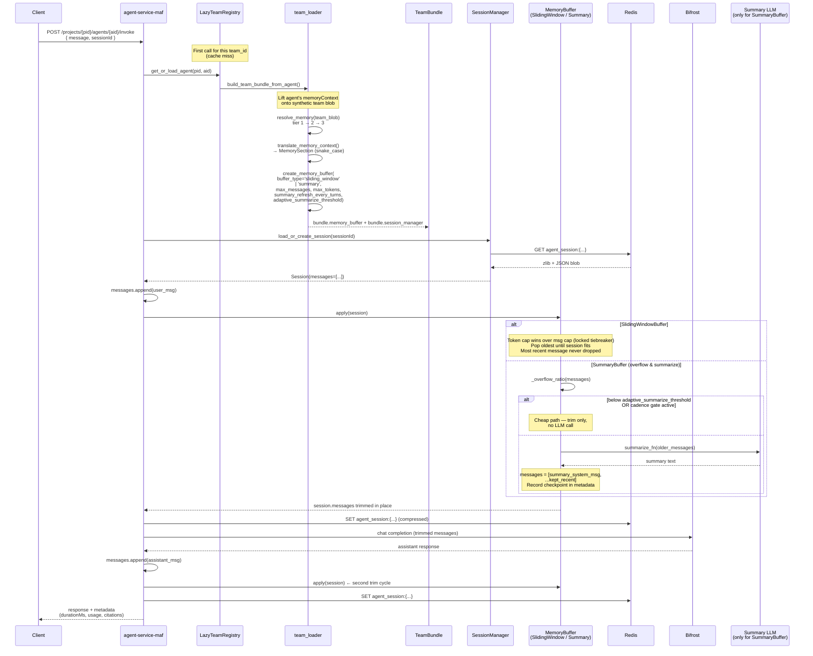

### 13.3 Why Two Trim Cycles Per Turn

Each invocation triggers `apply(session)` twice — once after appending the
incoming user message, once after appending the assistant response. This
preserves durability: if the LLM call dies between the two saves the user's
message is already persisted, and the conversation can be resumed without
having to re-send. For `summary_buffer` it also means the summary LLM call
fires at most once per turn (the second `apply` is usually a no-op because the
session is already at the limit).

### 13.4 Type → Buffer Mapping

| `memoryContext.type` (UI / API) | MAF `buffer_type` | Class | Trim behavior |
|---|---|---|---|
| `none` (or `enabled: false`) | n/a | — | History never sent to model |
| `window` | `sliding_window` | `SlidingWindowBuffer` | Drop oldest messages above cap; token cap wins over message cap when both set |
| `summary` | `summary` | `SummaryBuffer` (min verbatim tail) | Summarize older into one system message; default summary_token_limit = 2000 |
| `summary_buffer` | `summary` | `SummaryBuffer` (configurable tail) | Same engine but verbatim tail = `message_window_limit` (default 20) |

### 13.5 Defensive Properties Pinned by Tests

| Property | Test (config-service / MAF) |
|---|---|
| `{ type: 'window' }` alone accepted, `enabled` defaults to true | `MemoryContextDerivation.unit.test.ts: normalize: missing enabled does NOT silently disable memory` |
| Garbage `type` string never persisted | `normalize: garbage type returns undefined` + `garbage type with explicit enabled drops the bad type` |
| `summary_token_limit: "0"` (string) passes validator | `validators.unit.test.ts: summary_token_limit string-"0" and "64" pass` |
| `message_window_limit: 0` rejected at API edge | `message_window_limit rejects 0 (UI/API alignment)` |
| Tier-3 fallback emits 20-message default | `resolve_memory: tier 3 default when nothing present` |
| Single-agent invoke lifts agent's `memoryContext` onto synthetic team blob | `test_config_service_migration.test_get_or_load_agent_lifts_memory_context_onto_synthetic_team` |
| SummaryBuffer preserves the summary message when post-summary trim runs | `test_memory_buffer.test_post_summary_still_over_limit_drops_oldest_verbatim` |

---

## 14. Workspace Lifecycle

How workspaces are created and accessed.

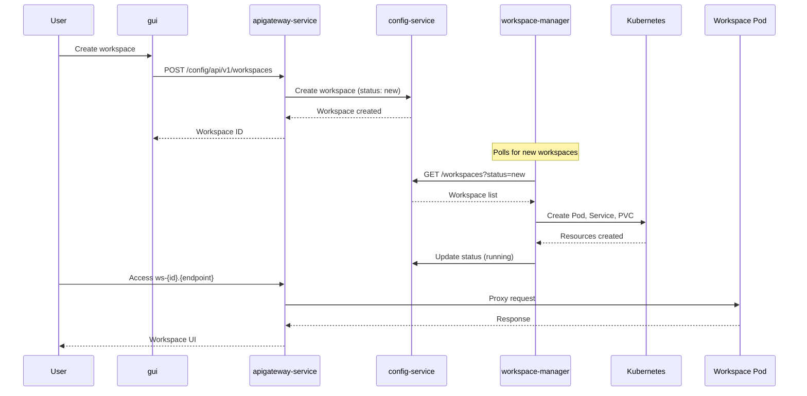

## 15. Deployment Phases

The platform deploys in four phases, each idempotent.

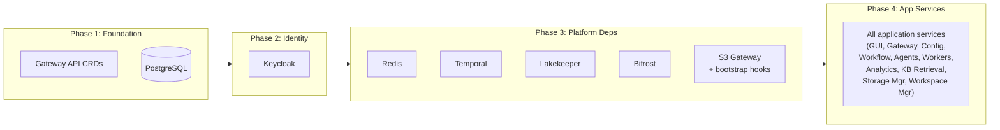

## Key Components Summary

### Application Services
- **apigateway-service** (Go): Routes requests, proxies S3 and workspaces, handles auth
- **config-service** (TypeScript): CRUD for all entities, catalog integration, backed by PostgreSQL
- **workflow-engine** (Go): Stateless orchestrator, starts Temporal workflows
- **agent-service** (Python): LLM agents with RAG, MCP tools, guardrails
- **kb-retrieval-service** (Rust): Vector, FTS, and hybrid search over LanceDB on shared filesystem
- **analytics-engine** (Go): Arrow Flight SQL query execution over LanceDB tables
- **storage-manager** (TypeScript): PVC lifecycle, dynamic provisioning, volume mounts
- **workspace-manager** (TypeScript): Orchestrates K8s resources for isolated workspaces
- **gui** (React / FluentUI): Web-based project, data, pipeline, and agent management

### Workers (Python, on Temporal task queues)
- **connector-worker**: Data acquisition from S3, databases, ONTAP, GCNV, Redash
- **dataset-processor**: Import, column stats, PII detection
- **kb-processor**: Document extraction, chunking, embedding, LanceDB index creation

### Infrastructure
- **PostgreSQL**: Metadata, entity state, workflow history
- **Temporal**: Durable workflow orchestration
- **Lakekeeper**: Apache Iceberg catalog for structured data
- **Bifrost**: Unified LLM provider gateway
- **S3 Gateway (VersityGW)**: S3 compatibility layer over NFS (Iceberg/Lakekeeper only)
- **Keycloak**: OIDC authentication and authorization
- **Redis**: Caching
- **Shared NFS Filesystem**: Primary data store, POSIX-first I/O for all data plane pods
