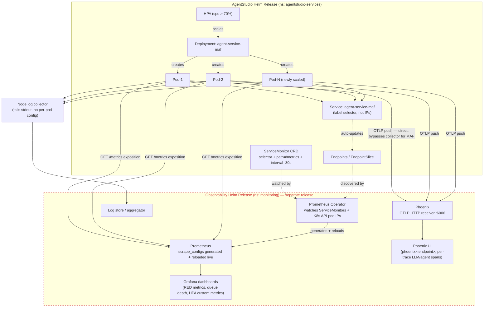

# AgentStudio Architecture Overview

> **Interview Reference** — A concise guide to AgentStudio's architecture, key flows, and talking points.

---

## 1. High-Level Architecture

```
┌─────────────────────────────────────────────────────────────────────────┐
│                          USERS / CLIENTS                                │
│                (Browser, CLI, External Systems)                         │
└──────────────────────────────┬──────────────────────────────────────────┘
                               │ HTTPS
┌──────────────────────────────▼──────────────────────────────────────────┐
│                    KUBERNETES GATEWAY API                               │
│         (Envoy-based ingress, TLS termination, routing)                 │
└──────┬──────────┬──────────┬────────────┬───────────┬───────────────────┘
       │          │          │            │           │
  ┌────▼────┐ ┌───▼───┐ ┌───▼────┐ ┌────▼────┐ ┌────▼──────┐
  │ Console │ │Config │ │Workflow│ │  Agent  │ │    KB     │
  │ (React/ │ │Service│ │Engine  │ │ Service │ │ Retrieval │
  │Fluent UI│ │Node.js│ │  (Go)  │ │(Python) │ │  (Rust)   │
  └────┬────┘ └───┬───┘ └───┬────┘ └────┬────┘ └────┬──────┘
       │          │          │            │           │
       └──────────┴──────────┴─────┬──────┴───────────┘
                                   │
┌──────────────────────────────────▼──────────────────────────────────────┐
│                        SHARED INFRASTRUCTURE                            │
│                                                                         │
│  ┌──────────┐  ┌─────────┐  ┌──────────┐  ┌──────────┐  ┌──────────┐  │
│  │PostgreSQL│  │  Redis  │  │ Temporal │  │Lakekeeper│  │S3 Gateway│  │
│  │(metadata)│  │(cache/  │  │(workflow │  │(Iceberg  │  │(VersityGW│  │
│  │ 50+tables│  │ pub-sub)│  │ engine)  │  │ catalog) │  │  store)  │  │
│  └──────────┘  └─────────┘  └──────────┘  └──────────┘  └──────────┘  │
│                                                                         │
│  ┌──────────┐  ┌─────────┐  ┌──────────┐                               │
│  │ Keycloak │  │ Bifrost │  │ LanceDB  │                               │
│  │  (OIDC)  │  │  (LLM   │  │ (vector  │                               │
│  │   auth)  │  │gateway) │  │  store)  │                               │
│  └──────────┘  └─────────┘  └──────────┘                               │
└──────────────────────────────────┬──────────────────────────────────────┘
                                   │
┌──────────────────────────────────▼──────────────────────────────────────┐
│                           WORKER LAYER                                  │
│                                                                         │
│  ┌──────────────────┐  ┌──────────────────┐  ┌──────────────────┐      │
│  │ connector-worker │  │dataset-processor │  │  kb-processor    │      │
│  │  (data ingest)   │  │ (ETL/Parquet/    │  │(doc→chunks→      │      │
│  │  task queue:     │  │   Iceberg)       │  │  embeddings→     │      │
│  │connector-ops     │  │ task queue:      │  │  LanceDB)        │      │
│  │  HPA: 1-5        │  │dataset-processing│  │ task queue:      │      │
│  └──────────────────┘  │  HPA: 1-5        │  │ kb-processing    │      │
│                        └──────────────────┘  │  HPA: 1-5        │      │
│                                              └──────────────────┘      │
└─────────────────────────────────────────────────────────────────────────┘
```

---

## 2. Core Services

| Service | Language | Responsibility |
|---------|----------|---------------|
| **Console** | React / FluentUI | Single-page app, all UI interactions |
| **Config Service** | Node.js / TypeScript | CRUD for all entities (projects, datasets, agents, pipelines, KBs, MCP servers, credentials) backed by PostgreSQL |
| **Workflow Engine** | Go | Stateless orchestrator; starts Temporal workflows for data ingestion and KB indexing |
| **Agent Service** | Python | Runs LLM agents with RAG, MCP tool calls, guardrails |
| **KB Retrieval Service** | Rust | Vector, full-text, and hybrid search over LanceDB indexes |
| **Analytics Engine** | Go | Analytics processing and query execution |
| **Storage Manager** | Node.js / TypeScript | PVC lifecycle management, dynamic provisioning |
| **MCP Runtime Manager** | Go (client-go) | Dynamically provisions Kubernetes Deployments for MCP server pods |

---

## 3. Key Flows

### 3.1 Data Ingestion Flow

```
User registers Connector (Config Service → PostgreSQL)
         │
         ▼
User triggers Dataset acquisition (Console → Workflow Engine)
         │
         ▼
Workflow Engine starts Temporal workflow
         │
         ▼
Temporal schedules Activities on connector-worker
         │
         ▼
connector-worker runs:
  acquire_from_database / list_objectstore_files / scan_volume / call_api
         │
         ▼
Raw files written to S3 Gateway (VersityGW)
         │
         ▼
Workflow Engine triggers dataset-processor
         │
         ▼
dataset-processor runs scatter/gather:
  create_work_plan() → 2000+ work units
  ProcessDatasetFiles (CSV → Parquet)
  MergeDatasetResults → Iceberg table in Lakekeeper
         │
         ▼
Dataset ready — metadata updated in PostgreSQL
```

### 3.2 Knowledge Base Creation Flow

```
User creates KB (Config Service → PostgreSQL)
         │
         ▼
User triggers indexing (Console → Workflow Engine)
         │
         ▼
Temporal workflow → kb-processor
         │
         ▼
kb-processor runs:
  ProcessKBDocuments (PDF/DOCX → chunks)
  Generate embeddings (OpenAI / Azure OpenAI)
  MergeKBResults → write vectors to LanceDB
         │
         ▼
KB Retrieval Service indexes LanceDB for search
KB ready for agent queries
```

### 3.3 Agent Execution Flow

```
User sends query (Console → Agent Service)
         │
         ▼
Agent Service validates JWT (Keycloak OIDC)
         │
         ▼
RAG retrieval → KB Retrieval Service
  (vector search + FTS hybrid in LanceDB)
         │
         ▼
Context assembled → LLM call via Bifrost Gateway
  (Bifrost routes to OpenAI / Azure / local model)
         │
         ▼
If MCP tools needed:
  MCP Runtime Manager → Kubernetes Deployment (dynamic pod)
  Agent calls MCP server tools (ONTAP, custom connectors)
         │
         ▼
Guardrails applied (input/output scanning)
         │
         ▼
Response streamed back to user
```

### 3.4 Authentication Flow

```
User login → Keycloak (OIDC)
  Returns JWT (access token + refresh token)
         │
         ▼
Request hits Kubernetes Gateway
  Sidecar validates JWT signature
         │
         ▼
Context Guard: extracts claims → req.user (typed)
         │
         ▼
Scope Guard: checks token scopes (read/write/admin)
         │
         ▼
RBAC Guard: checks Keycloak role mappings (project owner / member / viewer)
         │
         ▼
Service handles request with full user context
```

### 3.5 MCP Server Lifecycle Flow

Every MCP server record (Config Service, Postgres) has a `deploymentType`:
`remote` (default, user-hosted), `managed` (AgentStudio-provisioned pod), or
`platform` (shared, bootstrapped once for all projects).

```
User registers MCP Server (Config Service API)
         │
         ├─ deploymentType = "remote"
         │    User supplies url (http/sse) or command (stdio) for a
         │    server that already runs elsewhere. Config Service connects
         │    now to validate reachability + discover tools.
         │    No pod is provisioned.
         │
         ├─ deploymentType = "managed"
         │    User picks a catalogId (web_search_mcp, memory_mcp,
         │    ontap_mcp, ...) + resource preset.
         │    MCPRuntimeManager (TypeScript, config-service):
         │      - splits env overrides into secret/non-secret;
         │        secrets → K8s Secret (`{resource}-env`), DB keeps only "***"
         │      - credential-mapped secrets materialized into their own
         │        Secret (`mcp-runtime-cred-{serverId}`)
         │      - creates Deployment + Service in agentstudio-services
         │        namespace (same ns as config-service itself)
         │      - polls pod readiness
         │
         └─ deploymentType = "platform"
              Same pod-provisioning path as managed, but bootstrapped
              once (PlatformMCPBootstrap) and shared across all projects
         │
         ▼
BifrostGatewayClient.addMCPServer() → POST /api/mcp/client
  registers server_name = `${projectId}_${serverName}` with the
  Bifrost LLM Gateway; MCPServer row updated with
  llmproxyGatewayServerId/Name, runtimeStatus="running"
         │
         ▼
Agent Service (agent-service-maf) resolves the MCP server ID → inline
config, then MCPManager.connect_all() connects through Bifrost's
aggregated /mcp endpoint (dedupes servers sharing one physical
endpoint, attaches a static service-token Authorization header)
         │
         ▼
Tools discovered → ToolRegistry. LLM calls a tool → call_tool()
attaches per-call identity via MCP `_meta` (user/project ids, never
the JWT); Bifrost routes to the right upstream — managed pod or the
external remote URL
         │
         ▼
On idle/delete (managed/platform only): Deployment + Secret(s) torn down
```

---

## 4. Deployment Architecture

### Kubernetes Namespaces

```
agentstudio-services    → Config, Workflow Engine, Agent, KB Retrieval, Analytics
agentstudio-workers     → connector-worker, dataset-processor, kb-processor, MCP pods
agentstudio-platform    → Keycloak, Temporal, S3 Gateway, Lakekeeper, Bifrost
monitoring              → Prometheus, Grafana, Phoenix (LLM tracing), OTEL Collector
```

### Deployment Tiers (install order)

```
Tier 1: Database       → PostgreSQL, Redis
Tier 2: Identity       → Keycloak (OIDC)
Tier 3: Orchestration  → Temporal
Tier 4: Storage        → S3 Gateway (VersityGW), Lakekeeper
Tier 5: LLM Gateway    → Bifrost
Tier 6: Workers        → connector-worker, dataset-processor, kb-processor
Tier 7: Services       → Config, Workflow Engine, Agent, KB Retrieval
Tier 8: Console        → React UI
Tier 9: Observability  → Prometheus, Phoenix, OTEL Collector, Grafana
```

### HPA (Autoscaling)

```
Worker pods scale 1→5 replicas based on Temporal queue backlog metrics
  temporal_queue_backlog_connector  (custom metric via prometheus-adapter)
  temporal_queue_backlog_dataset
  temporal_queue_backlog_kb

MaxConcurrentActivities=3 per worker pod (concurrency at activity level)
```

---

## 5. Observability Stack

```
Services / Workers
      │  (structured JSON logs to stdout)
      │  (Prometheus /metrics:9090)
      │  (OTLP traces gRPC:4317)
      ▼
OTEL Collector
  receivers:  otlp (gRPC + HTTP)
  processors: batch, memory_limiter
  exporters:  Phoenix (LLM traces), Prometheus (metrics)
      │
      ├──▶ Phoenix  (LLM trace backend, 30-day retention, OpenInference conventions)
      ├──▶ Prometheus (metrics + HPA custom metrics via prometheus-adapter)
      └──▶ Grafana (dashboards: RED metrics, queue depth, worker throughput)
```

**Three Pillars:**
- **Logs** — Structured JSON via stdout; scraped by log aggregator
- **Metrics** — Prometheus; ServiceMonitor CRDs for auto-discovery; custom metrics for HPA
- **Traces** — Phoenix (specialized LLM tracing); OTLP pipeline; OpenInference semantic conventions

### Detailed E2E Flow: How a New Pod Gets Monitored Automatically

The AgentStudio chart and the observability stack are **separate Helm releases**
(`monitoring` namespace, deployed via `make deploy-observability`). The app side
only ever declares *intent* (labels + a `ServiceMonitor` manifest, shipped once);
everything downstream is continuously reconciled by controllers watching the K8s
API, so a newly-scaled pod needs zero manual wiring to show up in metrics.
Traces skip discovery entirely — they're push-based, not pulled.



> **Verified against a live dev cluster**: the dashed `OBS` box above (Prometheus
> Operator, Prometheus, Phoenix, Grafana) was entirely absent — `monitoring`
> namespace existed but had zero pods, and the `ServiceMonitor` CRD itself wasn't
> installed. In that state, a newly-scaled pod is only monitored by Kubernetes'
> own liveness/readiness probes; metrics scraping and trace collection both no-op
> until `make deploy-observability` is actually run.

---

## 6. Data Layer

| Store | Purpose |
|-------|---------|
| **PostgreSQL** | All metadata (50+ tables, JSONB columns); projects, datasets, connectors, agents, pipelines, credentials, MCP servers |
| **Redis** | Caching, pub/sub for progress events |
| **Temporal** | Durable workflow execution state, activity history, retry state |
| **S3 Gateway (VersityGW)** | Raw files, processed Parquet files, documents |
| **Lakekeeper** | Apache Iceberg REST catalog; table snapshots, schema evolution |
| **LanceDB** | Vector store for KB embeddings; supports vector + FTS hybrid search |

---

## 7. Interview Talking Points

### "Tell me about AgentStudio's architecture"

> AgentStudio is a multi-tenant AI platform deployed on Kubernetes with a clear separation between the control plane and data plane. The control plane consists of 8 microservices — Config, Workflow Engine, Agent Service, KB Retrieval, Analytics, Storage Manager, Console, and MCP Runtime Manager. The data plane is three specialized Temporal workers that handle data acquisition, ETL processing, and document vectorization. Everything is wired through PostgreSQL for metadata, Redis for caching, Temporal for durable orchestration, and Keycloak for OIDC-based auth.

### "How does job scheduling work?"

> We use Temporal as the durable workflow engine. The Workflow Engine service (Go) is a stateless orchestrator that submits workflows to Temporal. Workers poll task queues (`connector-operations`, `dataset-processing`, `kb-processing`). For large jobs we use a scatter/gather pattern — `create_work_plan()` splits a job into up to 2000 work units (5MB/100 files max each), child workflows run in parallel, then results merge. HPA scales workers 1→5 replicas based on Temporal queue backlog exposed as custom Kubernetes metrics via prometheus-adapter.

### "How do you handle credential security?"

> Credentials are never stored in plaintext. The MCP Runtime Manager materializes user credentials from the secrets store into Kubernetes Secrets at pod creation time. Files are mounted with mode 0400, env vars are injected. On pod teardown, the K8s Secret is deleted. This pattern means credentials exist only in-memory for the lifetime of the workload.

### "What's your observability strategy?"

> Three pillars: structured JSON logs, Prometheus metrics, and OTLP traces. All services use our internal `observability-client-runtime` Python SDK which provides auto-instrumented RED metrics (rate, errors, duration) via HTTP middleware, structured logging, and OTLP trace export. For LLM traces specifically we use Phoenix which understands OpenInference semantic conventions — so we can trace prompt/response, token counts, latency per LLM call. Prometheus adapter bridges queue-depth metrics into the K8s custom metrics API for HPA.

---

## 8. System Design Q&A

**Q: How does AgentStudio ensure no data loss if a worker crashes mid-job?**

A: Temporal activities are retried automatically (configurable retry policy). Each activity is atomic — if it fails, Temporal retries it from the last checkpoint. The workflow history is persisted in Temporal's PostgreSQL backend. Workers are stateless — they read from S3, process, write back to S3/LanceDB, and report completion. A crash just means the activity retries on the next available worker.

**Q: How does the platform handle multi-tenancy?**

A: Project-based isolation enforced at three levels: (1) Keycloak RBAC with project-scoped roles (owner/member/viewer), (2) Config Service enforces project_id filtering on all queries, (3) K8s namespace isolation for worker pods. Credentials are scoped per project and materialized only into pods belonging to that project.

**Q: How do you scale the KB Retrieval Service under high query load?**

A: KB Retrieval (Rust) is stateless and horizontally scalable behind the Gateway. LanceDB indexes are stored on shared PVCs (Azure NetApp Files with RWX). Multiple retrieval pods can read the same index concurrently. For write-heavy indexing, the kb-processor uses LanceDB's append-optimized write path and periodic compaction.

---

## 9. Tech Stack Summary

| Layer | Technologies |
|-------|-------------|
| **Frontend** | React, FluentUI, TypeScript |
| **API / Services** | Go, Node.js/TypeScript, Python, Rust |
| **Orchestration** | Temporal (durable workflows), Kubernetes (container orchestration) |
| **Databases** | PostgreSQL, Redis, LanceDB, Apache Iceberg (Lakekeeper) |
| **Storage** | S3-compatible (VersityGW), Azure NetApp Files (RWX PVCs) |
| **Auth** | Keycloak (OIDC/OAuth2), JWT, Kubernetes RBAC |
| **LLM** | Bifrost gateway, OpenAI, Azure OpenAI |
| **Observability** | Prometheus, Grafana, Phoenix, OTEL Collector, OpenInference |
| **Deployment** | Helm charts (tiered), Kubernetes Gateway API, HPA |

---

## 10. Temporal KB Worker — Detailed Interaction Flow with Kubernetes Namespaces

```
┌─────────────────────────────────────────────────────────────────────────────────────────┐
│  NAMESPACE: agentstudio-services                                                        │
│                                                                                         │
│  ┌────────────┐    ① trigger KB      ┌──────────────────────────────────────────────┐  │
│  │  Console   │ ─────────────────▶  │         Workflow Engine (Go)                  │  │
│  │  (React)   │                      │                                               │  │
│  │            │ ◀────────────────── │  GET /api/v1/workflows/:id/progress (polling) │  │
│  └────────────┘    ⑩ progress UI    │  POST /api/v1/workflows/:id/progress          │  │
│                                      └──────────────────┬────────────────────────────┘  │
└─────────────────────────────────────────────────────────┼───────────────────────────────┘
                                                           │ ② StartWorkflow(KnowledgeBaseCreationWorkflow)
                                                           ▼
┌─────────────────────────────────────────────────────────────────────────────────────────┐
│  NAMESPACE: agentstudio-platform                                                        │
│                                                                                         │
│  ┌────────────────────────────────────────────────────────────────────────────────────┐ │
│  │                         Temporal Server                                            │ │
│  │                                                                                    │ │
│  │  Workflow History (durable, PostgreSQL-backed)                                     │ │
│  │                                                                                    │ │
│  │  KnowledgeBaseCreationWorkflow                                                     │ │
│  │    Step 0 ──▶ [ClearStaleProgressActivity]     task queue: default                │ │
│  │    Step 1 ──▶ [FetchProjectCredentialsActivity] task queue: default               │ │
│  │    Step 3 ──▶ [CreateWorkPlanActivity]          task queue: kb-processing ─────┐  │ │
│  │    Step 5 ──▶ [ScatterGather Fan-Out]           task queue: kb-processing ─────┤  │ │
│  │                 ├─ ProcessKBDocuments (unit-0)                              ─────┤  │ │
│  │                 ├─ ProcessKBDocuments (unit-1)                              ─────┤  │ │
│  │                 └─ ProcessKBDocuments (unit-N, up to 2000)                  ─────┤  │ │
│  │    Step 6 ──▶ [MergeKBResults]                  task queue: kb-processing ─────┘  │ │
│  │                                                                                    │ │
│  └────────────────────────────────────────────────────────────────────────────────────┘ │
│                                                │ ③ activity tasks scheduled             │
└────────────────────────────────────────────────┼────────────────────────────────────────┘
                                                 │
                                                 ▼ poll task queue: kb-processing
┌─────────────────────────────────────────────────────────────────────────────────────────┐
│  NAMESPACE: agentstudio-workers                                                         │
│                                                                                         │
│  ┌─────────────────────────────────────────────────────────────────────────────────┐    │
│  │  kb-processor  Pod-0          (HPA: 1 → 5 replicas)                            │    │
│  │  ─────────────────────────────────────────────────────────────────────────────  │    │
│  │  MaxConcurrentActivities = 3  (3 activities running in parallel per pod)        │    │
│  │                                                                                  │    │
│  │  ┌─── CreateWorkPlanActivity ─────────────────────────────────────────────┐     │    │
│  │  │  • List documents from S3 (path: knowledgebases/{kb_id}/)              │     │    │
│  │  │  • Split into file sets (≤ 100 files / ≤ 5 MB per set)                 │     │    │
│  │  │  • Return WorkPlan{fileSets, totalFiles, jobOutputPrefix}               │     │    │
│  │  └─────────────────────────────────────────────────────────────────────────┘     │    │
│  │                                                                                  │    │
│  │  ┌─── ProcessKBDocuments (per work unit) ─────────────────────────────────┐     │    │
│  │  │                                                                          │    │    │
│  │  │  ④ Pull documents from S3 Gateway                                        │    │    │
│  │  │      PDF / DOCX / TXT / MD                                               │    │    │
│  │  │           │                                                               │    │    │
│  │  │           ▼                                                               │    │    │
│  │  │  ⑤ Chunker (sliding window / sentence / fixed)                           │    │    │
│  │  │      chunk_size, overlap configurable per KB                             │    │    │
│  │  │           │                                                               │    │    │
│  │  │           ▼                                                               │    │    │
│  │  │  ⑥ EmbeddingGenerator                                                    │    │    │
│  │  │      → OpenAI text-embedding-3-small                                     │    │    │
│  │  │      → Azure OpenAI (configurable per project credentials)               │    │    │
│  │  │           │                                                               │    │    │
│  │  │           ▼                                                               │    │    │
│  │  │  ⑦ LanceDBWriter → write vectors to LanceDB (shared PVC / RWX)          │    │    │
│  │  │           │                                                               │    │    │
│  │  │           ▼                                                               │    │    │
│  │  │  ⑧ POST progress to Workflow Engine every 5s                             │    │    │
│  │  │      phase, percentage, current, total                                   │    │    │
│  │  │  ⑨ Heartbeat to Temporal (prevent timeout)                               │    │    │
│  │  └─────────────────────────────────────────────────────────────────────────┘     │    │
│  │                                                                                  │    │
│  │  ┌─── MergeKBResults ─────────────────────────────────────────────────────┐     │    │
│  │  │  • Collect result JSONs from all units (S3)                             │    │    │
│  │  │  • Aggregate: totalDocs, totalChunks, errors                            │    │    │
│  │  │  • Write kb_processing_results.json to S3                               │    │    │
│  │  │  • Update KB status: "ready" in PostgreSQL via Config Service           │    │    │
│  │  └─────────────────────────────────────────────────────────────────────────┘     │    │
│  └─────────────────────────────────────────────────────────────────────────────────┘    │
│                                                                                         │
│  ┌─────────────┐  ┌─────────────┐  ┌─────────────┐  ┌─────────────┐  ┌─────────────┐  │
│  │kb-processor │  │kb-processor │  │kb-processor │  │kb-processor │  │kb-processor │  │
│  │  Pod-1      │  │  Pod-2      │  │  Pod-3      │  │  Pod-4      │  │  Pod-5      │  │
│  │(HPA scales) │  │(HPA scales) │  │(HPA scales) │  │(HPA scales) │  │(HPA scales) │  │
│  └─────────────┘  └─────────────┘  └─────────────┘  └─────────────┘  └─────────────┘  │
└─────────────────────────────────────────────────────────────────────────────────────────┘
         │ read/write docs & results                          │ write vectors
         ▼                                                    ▼
┌─────────────────────────────────┐         ┌─────────────────────────────────────────────┐
│  agentstudio-platform           │         │  agentstudio-platform                       │
│  S3 Gateway (VersityGW)         │         │  LanceDB (shared PVC — Azure NetApp RWX)    │
│  knowledgebases/{kb_id}/        │         │  kb_{kb_id} table                           │
│  ├── documents/                 │         │  ├── vector index                           │
│  ├── chunks/                    │         │  ├── full-text index (FTS)                  │
│  └── kb_processing_results.json │         │  └── metadata columns                       │
└─────────────────────────────────┘         └─────────────────────────────────────────────┘
                                                         │
                                                         │ hybrid search (vector + FTS)
                                                         ▼
                                        ┌────────────────────────────┐
                                        │  agentstudio-services      │
                                        │  KB Retrieval Service (Rust)│
                                        │  ← Agent Service queries   │
                                        └────────────────────────────┘
```

### HPA Trigger (Kubernetes Custom Metrics)

```
monitoring namespace
  Prometheus scrapes Temporal metrics
        │
        ▼
  prometheus-adapter exposes:
    temporal_queue_backlog_kb  (custom K8s metric)
        │
        ▼
  HPA watches custom metric
    targetValue: 5 pending tasks per replica
        │
  queue depth rises ──▶ HPA scales kb-processor: 1 → 5 pods
  queue drains     ──▶ HPA scales down after cooldown (5 min)
```

### Activity Retry Policy

```
ProcessKBDocuments:
  StartToCloseTimeout:    6 hours    (large document sets)
  HeartbeatTimeout:       5 minutes  (detect hung activities)
  RetryPolicy:
    InitialInterval:      1s
    BackoffCoefficient:   2.0
    MaximumAttempts:      3

MergeKBResults:
  StartToCloseTimeout:    2 hours
  RetryPolicy:
    MaximumAttempts:      3

On crash/timeout:  Temporal reschedules on next available pod.
State preserved:   S3 object writes are idempotent (overwrite safe).
```

### Key Design Decisions

| Decision | Rationale |
|----------|-----------|
| Scatter/gather (N activities per KB job) | Parallelise work across all available worker pods |
| S3 as intermediate store | Workers are stateless — crash-safe, no in-memory coupling |
| Heartbeat to Temporal every 60s | Temporal detects hung pod and reschedules activity |
| Progress POST to Workflow Engine every 5s | Real-time UI updates without polling Temporal directly |
| RWX PVC (Azure NetApp Files) for LanceDB | Multiple writer pods can append to the same index concurrently |
| HPA on `temporal_queue_backlog_kb` metric | Autoscale based on actual pending work, not CPU |
