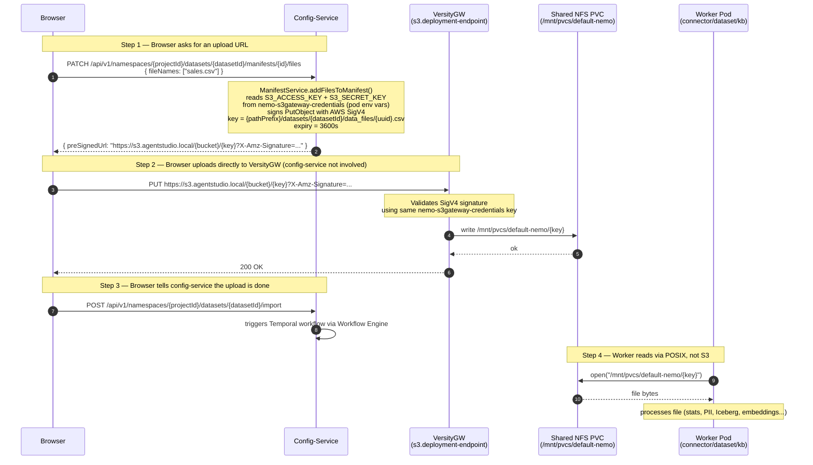

# File Upload Flow — Browser to NFS via VersityGW

How a user-uploaded file travels from the browser to the shared NFS PVC,
and how workers subsequently read it.

## Key components

| Component | Role |
|---|---|
| **Config-Service** | Issues presigned S3 URL (never touches file bytes) |
| **VersityGW** | S3-compatible API gateway over the shared NFS PVC |
| **NFS PVC** | Shared filesystem (`/mnt/pvcs/default-nemo`) — the actual storage |
| **Worker pod** | Reads files via POSIX mount, not via S3 API |
| **nemo-s3gateway-credentials** | K8s Secret holding VersityGW's `access-key` / `secret-key` |

## Flow



## Why config-service can sign the URL

Config-service has `S3_ACCESS_KEY` / `S3_SECRET_KEY` mounted from the same
`nemo-s3gateway-credentials` K8s Secret that VersityGW uses to validate
incoming requests. This means config-service can produce a SigV4 signature
that VersityGW will accept — without ever proxying the file bytes itself.

```
nemo-s3gateway-credentials  (K8s Secret)
  access-key: "testuser"
  secret-key: "secret"
       │
       ├──▶  VersityGW pod     (uses to verify incoming SigV4)
       │
       └──▶  Config-Service pod (uses to sign presigned URLs)
             via env vars S3_ACCESS_KEY / S3_SECRET_KEY
```

## Why workers read via POSIX, not S3

Workers mount the same NFS PVC directly at `/mnt/pvcs/default-nemo`.
Reading via POSIX `open()` / `read()` is faster and simpler than going
through the S3 API — no HTTP overhead, no signature validation, no
VersityGW pod in the path. VersityGW's only job is to let
**external clients** (browsers, CLI tools) that cannot mount NFS directly
write files onto it.

```
Browser  →  S3 API (VersityGW)  →  NFS PVC  ←  POSIX mount  ←  Worker
           (can't mount NFS)       (storage)    (no S3 needed)
```

## datasetId lifecycle

`datasetId` is generated **at dataset creation time** — before any file
upload — by `DataSetIdGenerator` in config-service:

```
POST /api/v1/namespaces/{projectId}/datasets
  → DataSetIdGenerator.generate()
  → "dset" + 8 random base36 chars  e.g. "dsetk7m2p9xq"
  → saved to PostgreSQL
  → returned to browser

Browser then uses this datasetId in:
  PATCH /manifests/{id}/files          (get presigned URLs)
  PUT   https://s3.../{datasetId}/...  (upload file)
  POST  /datasets/{datasetId}/import   (trigger processing)
```
