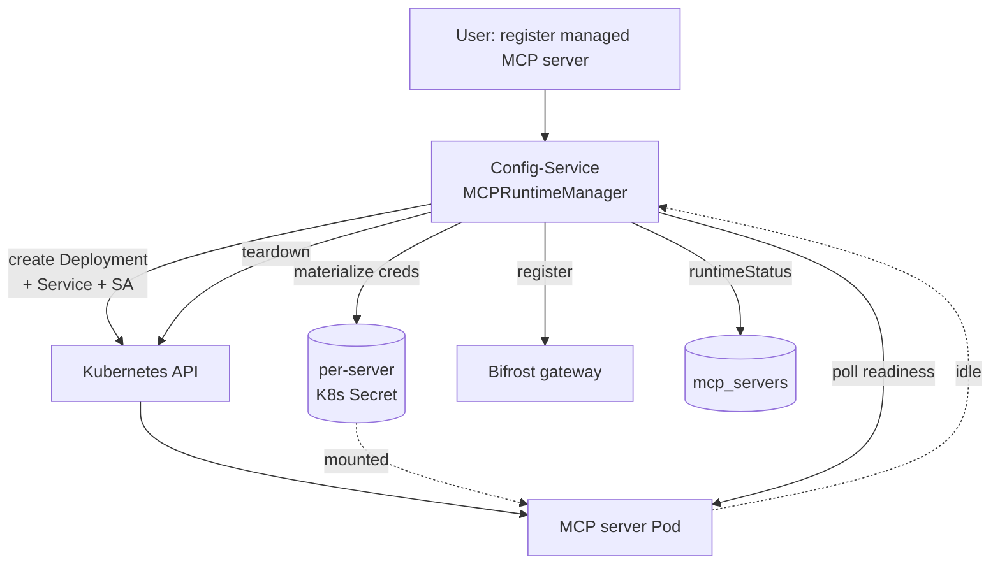
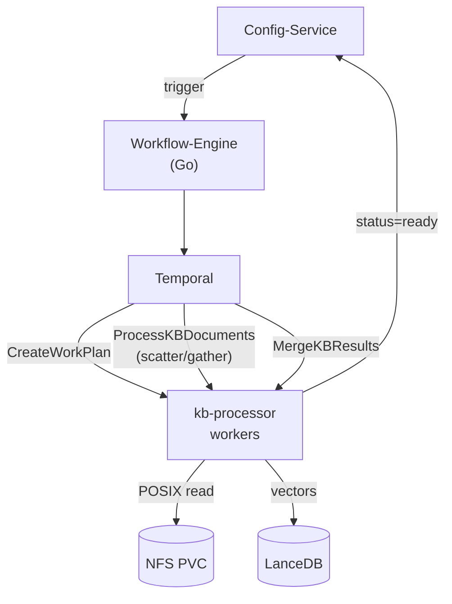
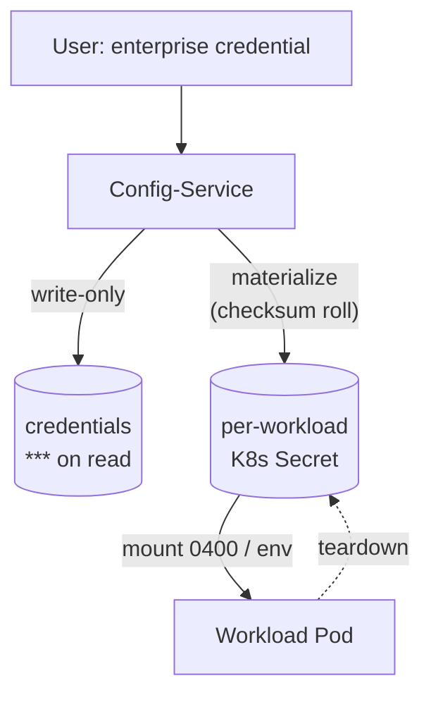

# Areas of Ownership — Interview Deep-Dive Kit

Systems I owned in AgentStudio, framed for interviews. Each entry has a 10-second elevator, why it's technically hard, the depth to drop when drilled, the design decision (the "I made a judgment call" story), and the impact.

**How to use this:** lead with **MCP Runtime** and **KB Ingestion** (most unique + most role-relevant). Keep **Credential Pipeline** as the security-depth pick. Add a secondary only if it's genuinely yours. 3–4 deep areas beat 10 shallow ones — only claim what you can defend under drilling.

---

## 1. MCP Runtime — dynamic Kubernetes provisioning ⭐ lead with this

**Elevator:** "I owned the MCP Runtime Manager — the system that turns a user registering a tool server into a live, isolated Kubernetes workload. When a user picks a managed MCP server, it programmatically provisions a Deployment, Service, and ServiceAccount, materializes its credentials into a dedicated Secret, polls for readiness, and registers it with the LLM gateway — then tears it all down on idle or delete."

**HLD:**

**Why it's hard / impressive:** this isn't a static Helm deploy — it's an application-level control loop driving the Kubernetes API *at runtime*, with multi-tenant isolation, secret lifecycle, garbage collection, readiness/health, and idempotency across retries.

**If they drill (depth):**
- TypeScript in config-service, using the Kubernetes client (`@kubernetes/client-node` — `AppsV1Api` / `CoreV1Api` via `makeApiClient`).
- Creates `Deployment` + `Service` + `ServiceAccount` on demand in the services namespace; polls `readNamespacedDeployment` for readiness before wiring the server into the gateway.
- Splits env into secret vs non-secret; secrets go into a per-server K8s `Secret`, DB keeps only redacted values.
- **Checksum-based credential rolling** — the pod only redeploys when the credential actually changes, so rotation is clean and restarts aren't gratuitous.
- Three deployment types: `remote` (user-hosted, just validate + discover tools), `managed` (provision a pod), `platform` (provisioned once, shared across projects).
- Teardown removes the Deployment + Secret(s) on idle/delete.

**Design decision / tradeoff:** provision in config-service's own namespace for a tight trust boundary; checksum-roll instead of always-restart to avoid churn; keep secret material out of the DB entirely (write-only + K8s Secret) rather than encrypt-at-rest in Postgres.

**Impact:** self-service tool servers with zero manual Kubernetes work; on the order of 100+ ephemeral pods provisioned per day.

**Scalability & fault tolerance:**
- Provisioning is a **reconcile-style control loop** — create is idempotent (`CREATE`/`readNamespacedDeployment` before wiring in), so a retried request never double-provisions.
- **Checksum-based credential rolling** means a rotation redeploys the pod cleanly instead of leaving stale creds — no manual restart.
- Servers are torn down on idle/delete, so **capacity is reclaimed automatically** rather than leaking pods.

**Maps to:** "Kubernetes at the workload/scheduling layer (not just operations)," dynamic resource lifecycle, multi-tenant isolation.

---

## 2. Knowledge Base ingestion — Temporal scatter/gather at scale ⭐ lead with this

**Elevator:** "I owned the knowledge-base ingestion pipeline — turning raw documents into a searchable vector index, durably and at scale, on Temporal. A workflow shards the documents, fans embedding work out across worker pods, and merges the results into LanceDB."

**HLD:**

**Why it's hard / impressive:** long-running (thousands of documents, hours of compute) work that must survive worker crashes *without* duplicating vectors, parallelize across pods, and apply backpressure — the reason these are Temporal workers, not cron jobs.

**If they drill (depth):**
- Temporal **scatter/gather**: `CreateWorkPlan` shards documents by size and file count (`MAX_FILES_PER_UNIT=100`, unit ceiling `2000`), `ProcessKBDocuments` runs per shard in parallel, `MergeKBResults` aggregates.
- Each activity `heartbeat()`s per batch so Temporal can detect a hung pod and reschedule.
- **Durable execution**: a crash mid-embedding replays from the last *completed* activity — no duplicate vectors on retry (writes are idempotent).
- Workers read source files via **POSIX** off a shared RWX NFS PVC (no S3/HTTP on the hot path); write vectors + chunk text + metadata to **LanceDB**.
- Retry policy with exponential backoff; long `StartToClose` timeouts for big document sets.

**Design decision / tradeoff:** Temporal over a queue+cron because durable execution gives crash-safety and exactly-the-right replay semantics for free; scatter/gather sizing balances parallelism against per-activity overhead; idempotent writes make at-least-once retries safe.

**Impact:** 2000+ parallel work units per job; processing time cut from hours to minutes; high success rate because transient failures self-heal via retry.

**Scalability & fault tolerance:**
- **Horizontally scalable by design** — a job shards into **up to 2,000 independent work units** (≤100 files / ~5 MB each), so throughput scales with worker pods, not a single process.
- **Stateless workers + HPA**: pods read from a shared RWX volume and scale **1→5 automatically off Temporal queue backlog** (custom Prometheus metric), then back down after the queue drains. Per-pod concurrency is bounded (`MaxConcurrentActivities`) so one pod can't exhaust memory during embedding.
- **Crash-safe, exactly-once effect**: activities heartbeat and writes are idempotent, so a pod dying mid-embedding **replays from the last completed activity with no duplicate vectors** — not a full restart.
- **Durable retries**: Temporal persists workflow state and retries activities with exponential backoff (3 attempts, 2×); **hung pods are caught by heartbeat timeout and rescheduled** on another node.
- **Benchmarked the store before choosing it** — LanceDB vs pgvector: **~104K vector inserts/sec (≈55×)** at **~2.5 ms p50 query latency**, which is why the KB path runs on LanceDB. *(dev harness, 100K×384-d vectors — details if drilled)*

**Maps to:** "job scheduling & workflow orchestration," "fault-tolerant worker / supervisor patterns," "long-running compute lifecycle."

---

## 3. Credential materialization pipeline (security depth)

**Elevator:** "I owned the pipeline that gets enterprise secrets from the config store into running workloads — without ever persisting them in plaintext or leaking them into logs."

**HLD:**

**Why it's hard / impressive:** it's security-critical and multi-tenant — credentials for ONTAP, databases, and external APIs must be usable by a pod but never recoverable from the database, the API, or logs, and must rotate cleanly.

**If they drill (depth):**
- Credentials are **write-only**: stored so reads return redacted values (`***`), never the secret back out.
- Materialized into **per-server / per-project Kubernetes Secrets** at pod-creation time; mounted as files (mode `0400`) or injected as env vars.
- Enterprise field names are translated into the tool's expected form (e.g., `username` → `ONTAP_USERNAME`, cert PEM → `/etc/ontap/client.crt`).
- **Checksum-based rolling** so a rotated credential redeploys the consumer cleanly; secrets are torn down with the workload.

**Design decision / tradeoff:** materialize-at-runtime into K8s Secrets rather than store encrypted in Postgres — narrower blast radius (secret exists only for the workload's lifetime), and the DB is never a secret store. Write-only API so a compromised read path can't exfiltrate credentials.

**Impact:** lets customers bring their own enterprise credentials with a security posture their security team will actually approve — which is the whole BYOC premise.

**Maps to:** "credential security," "Kubernetes secrets management," security-by-design.

---

## Secondary areas — include the ones that are genuinely yours

Pick at most one or two so the doc stays deep, not broad.

- **RAG / inference path (agent-service, Python).** Orchestrates each chat query: fetch agent config (LRU+TTL cache so config-service isn't hit per query), vector search via KB-Retrieval, prompt assembly, call Bifrost with a **project-scoped virtual key** (cost + rate isolation per tenant), stream back with citations. *Maps to: applied RAG, caching, multi-tenant cost control.*
- **ProjectInitWorkflow saga (workflow-engine, Go).** Multi-system orchestration across Keycloak, Bifrost, Lakekeeper, and PostgreSQL with a deliberate ordering (Keycloak-admin first so a failed init stays owner-manageable), durable retries, and a considered no-init-rollback stance. *Maps to: distributed systems, saga/ordering judgment.*
- **Observability SDK (observability-client-runtime, Python).** Shared client giving every service auto-instrumented RED metrics, structured logging, and OTLP traces (into Phoenix for LLM tracing) with minimal boilerplate. *Maps to: "Python SDKs," "observability standards."*

---

## Delivery notes

- **Lead with #1 and #2.** They're the most differentiated and the most on-target for a platform / AI-infra role.
- **One story per area:** elevator → let them pick the thread → go deep → land the design decision and the tradeoff. The *tradeoff* is what signals ownership vs implementation.
- **Only claim what you can defend.** If you contributed rather than owned, say "I owned X within a system a few of us built."
- **Impact numbers** (100+ pods/day, 2000 units, hours→minutes) — use only if you can stand behind them; otherwise drop the number and keep the shape.
