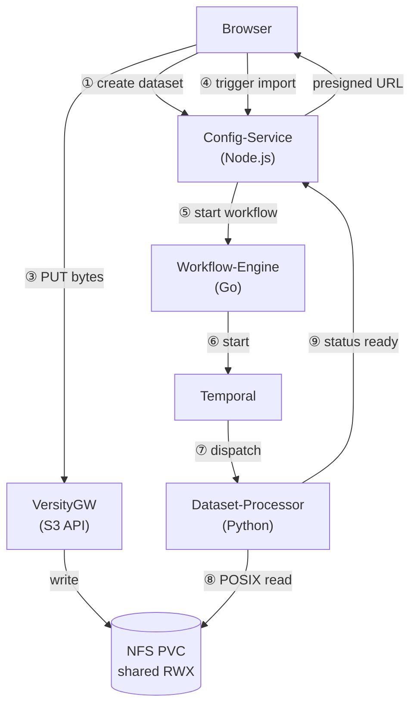
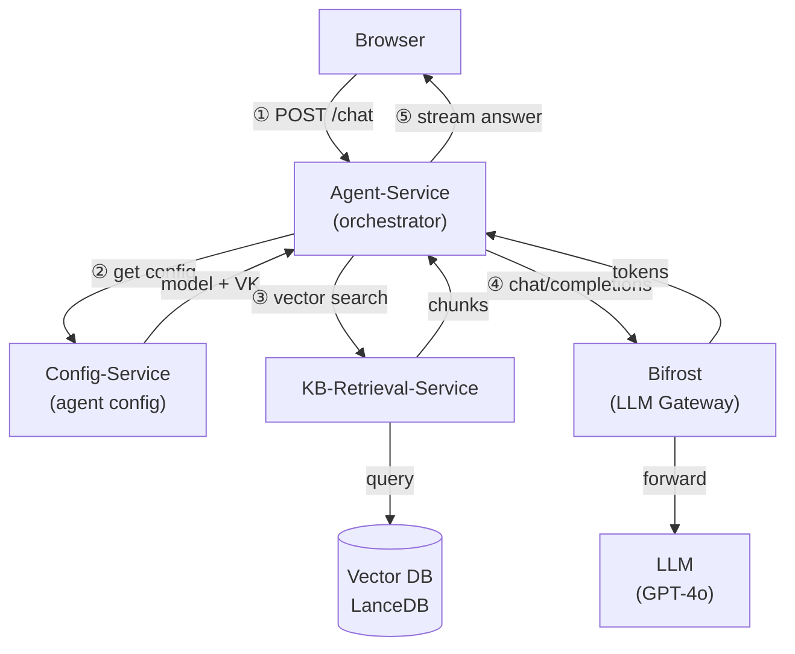

# AgentStudio — Architecture Deep Dive

## 1. What is AgentStudio?

AgentStudio is a Kubernetes-native AI platform that lets teams build, deploy, and operate AI agents backed by private data. It handles the full lifecycle — data ingestion, knowledge base creation, agent configuration, LLM routing, and security — so engineers focus on use cases, not infrastructure.

### Value Proposition & Target Customers

**One line:** AgentStudio is for enterprises that want internal AI agents but **can't or won't send their data to a SaaS vendor**.

**Primary target — regulated enterprises.** Financial services, healthcare, defense, and legal, where:

- **Data sovereignty is a compliance requirement** (HIPAA, SOX, FedRAMP, GDPR)
- Existing data already lives on enterprise storage they trust (NetApp ONTAP, S3-compatible, enterprise databases)
- The security team will never approve "send our documents to OpenAI"

For these companies, ChatGPT Enterprise and similar SaaS AI products are a **hard no from legal and security before the conversation even starts**.

**The build-vs-buy problem it solves.** The alternative is building it themselves — LangChain, a vector DB, an auth layer, workflow orchestration, MCP integration, multi-tenancy: **12–18 months of platform engineering** before any business team gets value. AgentStudio gives them that platform pre-built, **deployable inside their own perimeter**.

**Secondary target — platform / infra teams** inside large tech companies who want to give internal product teams a governed, multi-tenant AI platform — instead of every team reinventing its own LLM integration with no cost isolation, no audit trail, and no security controls.

**How to say it in an interview:**

> "The target customer is a mid-to-large enterprise in a regulated industry — think a bank, a hospital system, or a defense contractor — that has years of institutional knowledge locked in documents and databases, has a mandate to adopt AI, but cannot move that data to a public SaaS product. AgentStudio deploys inside their own Kubernetes cluster, connects to their existing storage (ONTAP, S3, SQL), and gives their teams a self-service interface to build AI agents over their own data. The LLM call can be pointed at a self-hosted model so **nothing ever leaves their network**. They get the full RAG + agent capability stack without giving up data control."

---

## 2. Use Case: Thrive Policy Assistant (Cloud AI Workshop)

**Problem:** Employees at NetApp need to answer HR policy questions — T&E limits, travel rules, accommodation policies, job level guides. This information is spread across multiple PDFs and SharePoint folders. Finding an answer takes 10–20 minutes per query.

**What AgentStudio solves:** An employee uploads the Thrive policy documents once. AgentStudio chunks them, generates embeddings, and builds a searchable knowledge base. A configured AI agent then answers natural-language questions in seconds, grounded in the actual documents, with source citations — not hallucinated answers.

**Four steps, zero infrastructure setup for the end user:**

- Upload documents → Dataset
- Dataset → Knowledge Base (embeddings + vector index)
- Knowledge Base + Model → Agent
- Ask questions → grounded answers

---

## 3. System Architecture Overview

```
        ┌───────────────────────────────────┐
        │   CLIENTS  (outside the cluster)   │
        │   Browser · CLI · External APIs    │
        └─────────────────┬─────────────────┘
                          │ HTTPS
════════════════════════ cluster boundary ═════════════════════════
                     │
                     ▼
┌─────────────────────────────────────────────────────────────────┐
│              LAYER 1 — INGRESS EDGE (in-cluster)                │
│                                                                 │
│          ┌─────────────────────┐                                │
│          │   Istio Gateway     │   ← terminates client TLS      │
│          │(Envoy · Gateway API)│                                │
│          └─────────────────────┘                                │
└─────────────────────────────────────────────────────────────────┘
                     │  east-west traffic below = mTLS STRICT (SPIFFE/X.509 per pod)
                     ▼
┌─────────────────────────────────────────────────────────────────┐
│              LAYER 2 — CONTROL PLANE                            │
│                                                                 │
│  ┌────────────────┐  ①trigger  ┌─────────────────┐             │
│  │ Config-Service │ ──────────▶│ Workflow-Engine  │             │
│  │  (Node.js)     │◀──────────│    (Go)          │             │
│  │                │  ④metadata │                 │             │
│  │ credentials    │            │ Temporal client  │             │
│  │ datasets       │            │ scatter/gather   │             │
│  │ models/agents  │            │ workflow defns   │             │
│  └────────────────┘            └────────┬────────┘             │
│         ▲  │                            │ ②dispatch            │
│      ③  │  │ fetch                      ▼                       │
│    config │  │ agent cfg        ┌──────────────────┐            │
│           │  │                  │  Temporal Server  │            │
│  ┌────────┴──┴──────┐           │  (event history, │            │
│  │  Agent-Service   │           │   task queues)   │            │
│  │  (Python · MAF)  │           └──────────────────┘            │
│  │                  │                                            │
│  │ orchestrates     │  ⑤vector                                  │
│  │ LLM queries      │──search──▶┌──────────────────┐            │
│  │ RAG injection    │           │  KB-Retrieval    │            │
│  │ tool calls       │◀──chunks──│  Service (Rust)  │            │
│  └──────────────────┘           └──────────────────┘            │
│         │                                                        │
│         │ ⑥LLM call via virtual key                             │
│         ▼                                                        │
│  ┌──────────────────┐  ┌────────────────┐  ┌────────────────┐   │
│  │     Bifrost      │  │  Lakekeeper    │  │   Keycloak     │   │
│  │  LLM Gateway     │  │ (Iceberg cat.) │  │    (IAM)       │   │
│  └──────────────────┘  └────────────────┘  └────────────────┘   │
└─────────────────────────────────────────────────────────────────┘
                     │
┌─────────────────────────────────────────────────────────────────┐
│              LAYER 3 — COMPUTE PLANE (Temporal workers)         │
│                                                                 │
│   ┌──────────────┐  ┌──────────────┐  ┌──────────────┐         │
│   │  Connector   │  │   Dataset    │  │  KB-Processor│         │
│   │  Worker      │  │  Processor   │  │  (Python)    │         │
│   │  (Python)    │  │  (Python)    │  │              │         │
│   │              │  │              │  │ chunk docs   │         │
│   │ DB connect   │  │ file ingest  │  │ embeddings   │         │
│   │ S3 sync      │  │ PII detect   │  │ vector index │         │
│   │ schema disc. │  │ Iceberg cat. │  │              │         │
│   └──────────────┘  └──────────────┘  └──────────────┘         │
│          │                 │                  │                  │
│          └─────────────────┼──────────────────┘                  │
│                            ▼                                     │
│              ┌─────────────────────────┐                         │
│              │     Shared Storage      │                         │
│              │  NFS PVC                │ ← workers: POSIX read   │
│              │  /mnt/pvcs/default-nemo │   open() / shutil       │
│              │                         │                         │
│              │  VersityGW (S3 API)     │ ← browser: presigned    │
│              │  s3.{apex}.com          │   SigV4 PUT             │
│              └─────────────────────────┘                         │
└─────────────────────────────────────────────────────────────────┘
```

### Whiteboard walkthrough — how to explain this

**Start with the three boxes (top to bottom)**

> "AgentStudio has three layers — entry, control plane, and compute."

---

**Layer 1 — draw quickly, one line**

> "Everything comes in through an Istio ingress gateway — browser, CLI, external APIs. Istio terminates TLS and enforces mTLS STRICT inside the mesh, so every pod has a SPIFFE X.509 identity."

---

**Layer 2 — this is where you spend most time**

*Draw Config-Service and Workflow-Engine first, connect them with the trigger arrow.*

> "Config-Service is the brain — it owns all config: credentials, datasets, models, agents. When a user creates a dataset or KB, config-service triggers a workflow by calling Workflow-Engine."

*Draw Temporal Server below Workflow-Engine.*

> "Workflow-Engine is just a Temporal client — it submits workflows to Temporal Server, which durably persists execution state and dispatches activities to workers via task queues."

*Draw Agent-Service, connect it to Config-Service with the fetch arrow.*

> "Agent-Service orchestrates inference. On every query it fetches agent config from Config-Service — model, KB IDs, system instructions. That result is LRU cached so config-service isn't hit on every query."

*Draw KB-Retrieval-Service, connect it to Agent-Service.*

> "It then does a vector search via KB-Retrieval-Service — a **Rust** service, chosen because it's on the hot path of every query — to pull the top-K relevant chunks. This is the RAG step."

*Note the two agent runtimes.*

> "There are actually two agent runtimes side by side. The original `agent-service` is Python on Agno, reached at `/agents`. The newer `agent-service-maf` is built on Microsoft Agent Framework and is reached at `/agents-maf` — it's what the new Studio UI targets. Both read the same agent config from Config-Service, so a given agent can be invoked through either."

*Draw Bifrost at the bottom of Layer 2.*

> "Agent-Service builds the prompt — system instructions plus the retrieved chunks — and sends it to Bifrost, our LLM gateway, using a **project-scoped virtual key**. **Bifrost handles rate limiting and cost isolation per project.**"

*Draw Keycloak and Lakekeeper next to Bifrost.*

> "Keycloak handles IAM — JWT issuance and per-project authorization. Lakekeeper is our Iceberg catalog for dataset metadata."

---

**Layer 3 — draw three workers**

> "The compute plane is three Temporal workers. Connector-worker pulls data from external sources — S3, databases, ONTAP. Dataset-processor ingests files, runs PII detection, registers them in the Iceberg catalog. KB-processor chunks documents, generates embeddings, writes vectors to LanceDB."

*Draw the shared storage box at the bottom.*

> "All three workers share an NFS PVC — they read files via POSIX open(), no HTTP overhead. The browser can't mount NFS so it writes through VersityGW, which is an S3-compatible API over the same NFS volume. Config-service signs a presigned URL, browser uploads directly to VersityGW — config-service never proxies file bytes."

---

**One closing sentence**

> "So the north-south flow is: browser → Istio gateway → config-service or agent-service. The east-west flow is: agent-service → KB-retrieval → Bifrost → LLM. The async flow is: config-service → workflow-engine → Temporal → workers → NFS."

---

**Things that make this stand out as an answer:**

- Lead with the three-layer split — shows you can organize a complex system
- Call out **Bifrost virtual keys — cost isolation per project** — a real design decision
- Mention presigned URL pattern — shows you understand why config-service never proxies bytes
- Mention Temporal durable execution — shows you understand why workers aren't just cron jobs
- Mention POSIX vs S3 for workers — shows you understand the hot path optimization

---

## 4. HLD 1: Document Upload Flow

### Summary — service interactions



### Detailed diagram

```
                          ┌─────────────────────────────────────────────────────┐
                          │                    BROWSER                          │
                          │         (Employee uploads Thrive PDFs)              │
                          └──────┬──────────────────────┬────────────────────── ┘
                                 │                      │
                    ① POST /datasets            ③ PUT file bytes
                    PATCH /manifests            (direct upload,
                    POST /import                 no proxy)
                                 │                      │
                                 ▼                      ▼
  ┌──────────────────────────────────────┐   ┌──────────────────────────────────┐
  │           CONFIG-SERVICE             │   │         VERSITYGW                │
  │            (Node.js)                 │   │      (S3-compatible API)          │
  │                                      │   │                                  │
  │  • creates dataset record            │   │  • validates SigV4 signature     │
  │  • signs PutObject (SigV4)  ─────②──────▶  • exposes s3.{apex}.com         │
  │  • returns presigned URL             │   │  • writes to NFS via POSIX       │
  │  • triggers import workflow          │   │                                  │
  │                                      │   └──────────────┬───────────────────┘
  │  ┌──────────────────────┐            │                  │ write
  │  │  nemo-s3gateway-     │            │                  │ /mnt/pvcs/
  │  │  credentials (K8s)   │            │                  │ default-nemo/
  │  │  access-key          │─── signs ──│                  │ {datasetId}/
  │  │  secret-key          │            │                  │ data_files/
  │  └──────────────────────┘            │                  ▼
  │                                      │   ┌──────────────────────────────────┐
  │  ┌──────────────────────┐            │   │           NFS PVC                │
  │  │     PostgreSQL       │            │   │    /mnt/pvcs/default-nemo        │
  │  │  dataset record      │◀── stores ─│   │                                  │
  │  │  manifest record     │            │   │  shared across ALL pods          │
  │  │  file records        │            │   │  (config-service, workers,       │
  │  └──────────────────────┘            │   │   kb-processor, agent-service)   │
  └──────────────┬───────────────────────┘   └──────────────┬───────────────────┘
                 │                                          │
              ④ trigger                                 ⑥ POSIX read
              DatasetImport                              open() / shutil
              Workflow                                   (no S3 overhead)
                 │                                          │
                 ▼                                          │
  ┌──────────────────────────────────────┐                  │
  │          WORKFLOW-ENGINE (Go)        │                  │
  │                                      │                  │
  │  • submits to Temporal               │                  │
  │  • scatter / gather coordination     │                  │
  │  • updates dataset status            │                  │
  └──────────────┬───────────────────────┘                  │
                 │                                          │
              ⑤ dispatch activities                         │
              via task queues                               │
                 │                                          │
                 ▼                                          │
  ┌──────────────────────────────────────┐                  │
  │        TEMPORAL SERVER               │                  │
  │                                      │                  │
  │  • durable event history (PostgreSQL)│                  │
  │  • at-least-once retry per activity  │                  │
  │  • heartbeat timeout: 20 min         │                  │
  └──────────────┬───────────────────────┘                  │
                 │                                          │
              dispatch                                      │
              task queue:                                   │
              dataset-processing                            │
                 │                                          │
                 ▼                                          ▼
  ┌─────────────────────────────────────────────────────────────────────────────┐
  │                       DATASET-PROCESSOR  (Python worker)                   │
  │                                                                             │
  │  CreateWorkPlanActivity       ProcessDatasetFiles        MergeDatasetResults│
  │  ─────────────────────        ───────────────────        ───────────────────│
  │  list_data_files()            read via POSIX ◀───────────────────────────── │
  │  partition into N shards      PII detection                                 │
  │  write manifest.json          Iceberg catalog                               │
  │                               heartbeat every batch                         │
  └─────────────────────────────────────────────────────────────────────────────┘


  KEY DESIGN DECISIONS
  ────────────────────
  ┌───────────────────────────────────────────────────────────────────────────┐
  │  WHY browser uploads directly to VersityGW (not via config-service)       │
  │  → config-service never proxies file bytes → no memory spike, no timeout  │
  │  → presigned URL = delegate write permission with expiry (3600s)          │
  │                                                                           │
  │  WHY workers read via POSIX not S3                                        │
  │  → NFS mount = filesystem speed, no HTTP overhead, no SigV4 on hot path  │
  │  → VersityGW only needed for EXTERNAL clients (browser) that can't NFS   │
  │                                                                           │
  │  WHY same nemo-s3gateway-credentials on both sides                        │
  │  → config-service signs URL with same key VersityGW uses to verify it    │
  │  → no token exchange needed — SigV4 is self-contained                    │
  └───────────────────────────────────────────────────────────────────────────┘
```

---

## 5. HLD 2: Inference Phase

### Summary — service interactions



### Detailed diagram

```
  INFERENCE PHASE
  ─────────────────────────────────────────────────────────────

                    Employee types question in browser
                               │
                               │  "What are my T&E reimbursement limits?"
                               ▼
                    ┌─────────────────────┐
                    │      BROWSER        │
                    └──────────┬──────────┘
                               │
                        POST /chat
                        {agentId, query}
                               │
                               ▼
              ┌────────────────────────────────┐
              │         AGENT-SERVICE          │
              │  orchestrates the full query   │
              └──┬─────────────┬──────────────┘
                 │             │
       ① fetch   │             │ ② vector search
       model +   │             │    top-K chunks
       VK token  │             │
                 │             │
                 ▼             ▼
    ┌─────────────────┐  ┌─────────────────┐
    │ CONFIG-SERVICE  │  │  KB-RETRIEVAL   │
    │                 │  │  SERVICE        │
    │ GET /models/:id │  │                 │
    │   reads model   │  │ vector search   │
    │   reads K8s     │  │ Vector DB       │
    │   Secret        │  │                 │
    │   as-proj-X-vk  │  │ returns chunks  │
    │                 │  │                 │
    │ returns:        │  │                 │
    │ • model info    │  │                 │
    │ • gatewayApiKey │  │                 │
    │   "sk-..."      │  │                 │
    │ • gatewayModelId│  │                 │
    └────────┬────────┘  └────────┬────────┘
             └─────────┬──────────┘
                       │
              ③ build prompt + set api_key = "sk-..."
                       │
              system:  instructions
              context: retrieved chunks   ← RAG injection
              user:    "T&E limits?"
                       │
                       ▼
              ┌─────────────────────┐
              │      BIFROST        │
              │   LLM GATEWAY       │
              │                     │
              │  Authorization:     │
              │  Bearer sk-...      │
              │  (project-scoped,   │
              │   rate limited)     │
              └──────────┬──────────┘
                         │
              ④ LLM generates answer
                         │
                         ▼
              "T&E reimbursement limit
               is $500/day for hotels,
               $75 for meals. Approval
               required above $1000..."
                         │
                         ▼
              ┌─────────────────────┐
              │  AGENT-SERVICE      │
              │  streams response   │
              │  + source citations │
              └──────────┬──────────┘
                         │
                    streamed back
                         │
                         ▼
              ┌─────────────────────┐
              │      BROWSER        │
              │  shows answer +     │
              │  "Source: T&E       │
              │   Policy Doc pg 3"  │
              └─────────────────────┘
```

---

## 6. Database Schema (PostgreSQL)

Config-service owns the metadata database — **PostgreSQL** via **TypeORM**, ~30 tables, all **project-scoped** (multi-tenant) with flexible config kept in **JSONB**. `projects` is the root; everything else hangs off it. At a high level, here's what each table stores:

**Projects & access**

| Table | Stores |
|-------|--------|
| `projects` | One row per project — the tenant root (home dir, Keycloak resource id, Bifrost virtual key, metadata) |
| `project_members` | Which users belong to a project and their role (admin / member / viewer) |
| `project_service_accounts` | Per-project service account used for machine-to-machine calls |
| `credentials` | Enterprise secrets, stored write-only (redacted on read), scoped per project |

**Data ingestion**

| Table | Stores |
|-------|--------|
| `data_sources` | Connection configs for external sources (database, S3, NAS, API) |
| `data_sets` | Ingested datasets and their processing status |
| `data_set_manifests` / `..._files` | The file list and per-file metadata for each dataset |

**Knowledge & agents**

| Table | Stores |
|-------|--------|
| `knowledge_bases` | Vector KBs built from a dataset (embedding model, chunk strategy, status) |
| `agents` | Agent configs — model, KB ids, instructions, params, guardrails |
| `agent_teams` (+ `_history`) | Multi-agent team definitions, versioned |
| `models` / `model_providers` | The model catalog and the upstream providers behind them |

**Tools, pipelines & evaluation**

| Table | Stores |
|-------|--------|
| `mcp_servers` (+ `_history`) | Registered MCP tool servers (remote / managed / platform) and runtime status |
| `pipelines` / `pipeline_executions` | Pipeline definitions and their runs |
| `evaluation_templates` / `evaluation_runs` (+ `_history`) | Eval definitions and results |
| `guardrails_catalog` | Available guardrail definitions |

**Lineage, audit & storage**

| Table | Stores |
|-------|--------|
| `reference_edges` | Generic "entity X references entity Y" links — lineage and cascade-delete checks |
| `config_versions` | Change history / versioning of config entities |
| `artifact_stores` / `artifact_store_acls` | Artifact storage locations and access control |
| `workspaces` / `workspace_templates`, `deployments` | Workspace definitions/templates and deployment records |

---

## 7. Key Flows

### 7.1 Project Initialization Flow

```
User creates Project  (Config Service → PostgreSQL, status = initializing)
         │
         ▼
Config Service triggers ProjectInitWorkflow  (Workflow Engine → Temporal)
         │
         ▼
Temporal runs activities in order  (RetryPolicy: 3 attempts, backoff 2.0, 10-min timeout)

   1. RegisterProjectResource       → Keycloak resource              (critical)
   2. GrantInitialAdmin             → owner becomes project admin    (critical — runs
                                       first so a failed init stays visible/manageable)
   3. PersistKeycloakResourceId     → PostgreSQL                     (best-effort · warn+continue)
   4. SetupProjectLLMGateway        → Bifrost team + virtual key     (critical)
   5. LookupWarehouse               → Lakekeeper "nemo" warehouse    (critical)
   6. UpdateProjectMetadata         → store warehouse id             (non-critical · warn+continue)
   7. CreateNamespace               → Lakekeeper namespace=projectId (critical)
   8. CreateProjectServiceAccount   → Keycloak service account       (critical)
   9. GrantMembers (if invitees)    → resolve emails + grant roles   (parallel per role)
         │
         ▼
ReportProjectInitStatus → Config Service  (status = ready | failed)
   runs on BOTH success and failure — outcome shows on the project row, not just Temporal
```

**Key design points:**
- **Keycloak authz runs first (steps 1–2)** — the creator becomes a project admin before any failure-prone infra step, so a mid-init failure never strands an orphaned project the owner can't see, retry, or delete.
- **No saga rollback in init** — Temporal retries each activity (3× with backoff); the two non-critical steps (persist id, metadata) warn and continue. Teardown lives in a separate `ProjectDeleteWorkflow`, so init deliberately avoids compensating deletes that would strip the owner's admin.
- **Terminal status is reported back** — `ReportProjectInitStatus` writes `ready`/`failed` to the project row, so the outcome is visible in the product, not just Temporal history.

### 7.2 Data Ingestion Flow

```
User registers Connector (Config Service → PostgreSQL)
         │
         ▼
User triggers Dataset acquisition (Console → Workflow Engine)
         │
         ▼
Workflow Engine starts Temporal workflow
         │
         ▼
Temporal schedules Activities on connector-worker
         │
         ▼
connector-worker runs:
  acquire_from_database / list_objectstore_files / scan_volume / call_api
         │
         ▼
Raw files written to S3 Gateway (VersityGW)
         │
         ▼
Workflow Engine triggers dataset-processor
         │
         ▼
dataset-processor runs scatter/gather:
  create_work_plan() → 2000+ work units
  ProcessDatasetFiles (CSV → Parquet)
  MergeDatasetResults → Iceberg table in Lakekeeper
         │
         ▼
Dataset ready — metadata updated in PostgreSQL
```

### 7.3 Knowledge Base Creation Flow

```
User creates KB (Config Service → PostgreSQL)
         │
         ▼
User triggers indexing (Console → Workflow Engine)
         │
         ▼
Temporal workflow → kb-processor
         │
         ▼
kb-processor runs:
  ProcessKBDocuments (PDF/DOCX → chunks)
  Generate embeddings (OpenAI / Azure OpenAI)
  MergeKBResults → write vectors to LanceDB
         │
         ▼
KB Retrieval Service indexes LanceDB for search
KB ready for agent queries
```

### 7.4 Agent Execution Flow

```
User sends query (Console → Agent Service)
         │
         ▼
Agent Service validates JWT (Keycloak OIDC)
         │
         ▼
RAG retrieval → KB Retrieval Service
  (vector search + FTS hybrid in LanceDB)
         │
         ▼
Context assembled → LLM call via Bifrost Gateway
  (Bifrost routes to OpenAI / Azure / local model)
         │
         ▼
If MCP tools needed:
  MCP Runtime Manager → Kubernetes Deployment (dynamic pod)
  Agent calls MCP server tools (ONTAP, custom connectors)
         │
         ▼
Guardrails applied (input/output scanning)
         │
         ▼
Response streamed back to user
```

### 7.5 Authentication Flow

```
User login → Keycloak (OIDC)
  Returns JWT (access token + refresh token)
         │
         ▼
Request hits Kubernetes Gateway
  Sidecar validates JWT signature
         │
         ▼
Context Guard: extracts claims → req.user (typed)
         │
         ▼
Scope Guard: checks token scopes (read/write/admin)
         │
         ▼
RBAC Guard: checks Keycloak role mappings (project owner / member / viewer)
         │
         ▼
Service handles request with full user context
```

### 7.6 MCP Server Lifecycle Flow

Every MCP server record (Config Service, Postgres) has a `deploymentType`:
`remote` (default, user-hosted), `managed` (AgentStudio-provisioned pod), or
`platform` (shared, bootstrapped once for all projects).

```
User registers MCP Server (Config Service API)
         │
         ├─ deploymentType = "remote"
         │    User supplies url (http/sse) or command (stdio) for a
         │    server that already runs elsewhere. Config Service connects
         │    now to validate reachability + discover tools.
         │    No pod is provisioned.
         │
         ├─ deploymentType = "managed"
         │    User picks a catalogId (web_search_mcp, memory_mcp,
         │    ontap_mcp, ...) + resource preset.
         │    MCPRuntimeManager (TypeScript, config-service):
         │      - splits env overrides into secret/non-secret;
         │        secrets → K8s Secret (`{resource}-env`), DB keeps only "***"
         │      - credential-mapped secrets materialized into their own
         │        Secret (`mcp-runtime-cred-{serverId}`)
         │      - creates Deployment + Service in agentstudio-services
         │        namespace (same ns as config-service itself)
         │      - polls pod readiness
         │
         └─ deploymentType = "platform"
              Same pod-provisioning path as managed, but bootstrapped
              once (PlatformMCPBootstrap) and shared across all projects
         │
         ▼
BifrostGatewayClient.addMCPServer() → POST /api/mcp/client
  registers server_name = `${projectId}_${serverName}` with the
  Bifrost LLM Gateway; MCPServer row updated with
  llmproxyGatewayServerId/Name, runtimeStatus="running"
         │
         ▼
Agent Service (agent-service-maf) resolves the MCP server ID → inline
config, then MCPManager.connect_all() connects through Bifrost's
aggregated /mcp endpoint (dedupes servers sharing one physical
endpoint, attaches a static service-token Authorization header)
         │
         ▼
Tools discovered → ToolRegistry. LLM calls a tool → call_tool()
attaches per-call identity via MCP `_meta` (user/project ids, never
the JWT); Bifrost routes to the right upstream — managed pod or the
external remote URL
         │
         ▼
On idle/delete (managed/platform only): Deployment + Secret(s) torn down
```

---

## 8. Deployment Architecture

### Kubernetes Namespaces

```
agentstudio-services    → Config, Workflow Engine, Agent (agent-service +
                          agent-service-maf), KB Retrieval, Analytics, TEI
                          embedding servers, and managed MCP pods
agentstudio-workers     → connector-worker, dataset-processor, kb-processor,
                          eval-worker, S3 Gateway (VersityGW), storage-manager
agentstudio-platform    → Temporal, Lakekeeper
agentstudio-identity    → Keycloak
agentstudio-llm-gateway → Bifrost
agentstudio-console     → gui (/console) and agent-studio-ui (/studio)
agentstudio-edge        → Istio Gateway, HTTPRoutes, edge authz policies
database                → PostgreSQL, Redis
monitoring              → Prometheus, Grafana, Phoenix (LLM tracing), OTEL Collector
```

Note that **managed MCP pods land in `agentstudio-services`**, not the workers
namespace — `MCPRuntimeManager` creates them in the same namespace as
config-service itself.

### Deployment Tiers (install order)

```
Tier 1: Database       → PostgreSQL, Redis
Tier 2: Identity       → Keycloak (OIDC)
Tier 3: Orchestration  → Temporal
Tier 4: Storage        → S3 Gateway (VersityGW), Lakekeeper
Tier 5: LLM Gateway    → Bifrost
Tier 6: Workers        → connector-worker, dataset-processor, kb-processor
Tier 7: Services       → Config, Workflow Engine, Agent (agent-service +
                         agent-service-maf), KB Retrieval
Tier 8: Console        → two React UIs: gui (/console) and
                         agent-studio-ui (/studio, the newer one)
Tier 9: Observability  → Prometheus, Phoenix, OTEL Collector, Grafana
```

### HPA (Autoscaling)

```
Worker pods scale 1→5 replicas based on Temporal queue backlog metrics
  temporal_queue_backlog_connector  (custom metric via prometheus-adapter)
  temporal_queue_backlog_dataset
  temporal_queue_backlog_kb

MaxConcurrentActivities=3 per worker pod (concurrency at activity level)
```

---

## 9. Observability Stack

```
Services / Workers
      │  (structured JSON logs to stdout)
      │  (Prometheus /metrics:9090)
      │  (OTLP traces gRPC:4317)
      ▼
OTEL Collector
  receivers:  otlp (gRPC + HTTP)
  processors: batch, memory_limiter
  exporters:  Phoenix (LLM traces), Prometheus (metrics)
      │
      ├──▶ Phoenix  (LLM trace backend, 30-day retention, OpenInference conventions)
      ├──▶ Prometheus (metrics + HPA custom metrics via prometheus-adapter)
      └──▶ Grafana (dashboards: RED metrics, queue depth, worker throughput)
```

**Three Pillars:**
- **Logs** — Structured JSON via stdout; scraped by log aggregator
- **Metrics** — Prometheus; ServiceMonitor CRDs for auto-discovery; custom metrics for HPA
- **Traces** — Phoenix (specialized LLM tracing); OTLP pipeline; OpenInference semantic conventions

---

## 10. Data Layer

| Store | Purpose |
|-------|---------|
| **PostgreSQL** | All metadata (50+ tables, JSONB columns); projects, datasets, connectors, agents, pipelines, credentials, MCP servers |
| **Redis** | Caching, pub/sub for progress events |
| **Temporal** | Durable workflow execution state, activity history, retry state |
| **S3 Gateway (VersityGW)** | Raw files, processed Parquet files, documents |
| **Lakekeeper** | Apache Iceberg REST catalog; table snapshots, schema evolution |
| **LanceDB** | Vector store for KB embeddings; supports vector + FTS hybrid search |

---

## 11. System Design Q&A

**Q: How does AgentStudio ensure no data loss if a worker crashes mid-job?**

A: Temporal activities are retried automatically (configurable retry policy). Each activity is atomic — if it fails, Temporal retries it from the last checkpoint. The workflow history is persisted in Temporal's PostgreSQL backend. Workers are stateless — they read from S3, process, write back to S3/LanceDB, and report completion. A crash just means the activity retries on the next available worker.

**Q: How does the platform handle multi-tenancy?**

A: Project-based isolation enforced at three levels: (1) Keycloak RBAC with project-scoped roles (owner/member/viewer), (2) Config Service enforces project_id filtering on all queries, (3) K8s namespace isolation for worker pods. Credentials are scoped per project and materialized only into pods belonging to that project.

**Q: How do you scale the KB Retrieval Service under high query load?**

A: KB Retrieval (Rust) is stateless and horizontally scalable behind the Gateway. LanceDB indexes are stored on shared PVCs (Azure NetApp Files with RWX). Multiple retrieval pods can read the same index concurrently. For write-heavy indexing, the kb-processor uses LanceDB's append-optimized write path and periodic compaction.

---

## 12. Tech Stack Summary

| Layer | Technologies |
|-------|-------------|
| **Frontend** | React, FluentUI, TypeScript — two apps: `gui` at `/console`, `agent-studio-ui` at `/studio` |
| **API / Services** | Go (workflow-engine), Node.js/TypeScript (config-service), Python (agent-service, agent-service-maf, workers), Rust (kb-retrieval-service) |
| **Agent runtimes** | `agent-service` (Agno, `/agents`) and `agent-service-maf` (Microsoft Agent Framework, `/agents-maf`) |
| **Orchestration** | Temporal (durable workflows), Kubernetes (container orchestration) |
| **Databases** | PostgreSQL, Redis, LanceDB, Apache Iceberg (Lakekeeper) |
| **Storage** | S3-compatible (VersityGW), Azure NetApp Files (RWX PVCs) |
| **Auth** | Keycloak (OIDC/OAuth2), JWT, Kubernetes RBAC |
| **LLM** | Bifrost gateway, OpenAI, Azure OpenAI |
| **Observability** | Prometheus, Grafana, Phoenix, OTEL Collector, OpenInference |
| **Deployment** | Helm charts (tiered), Kubernetes Gateway API, HPA |

---

## 13. Temporal KB Worker — Detailed Interaction Flow with Kubernetes Namespaces

```
┌─────────────────────────────────────────────────────────────────────────────────────────┐
│  NAMESPACE: agentstudio-services                                                        │
│                                                                                         │
│  ┌────────────┐    ① trigger KB      ┌──────────────────────────────────────────────┐  │
│  │  Console   │ ─────────────────▶  │         Workflow Engine (Go)                  │  │
│  │  (React)   │                      │                                               │  │
│  │            │ ◀────────────────── │  GET /api/v1/workflows/:id/progress (polling) │  │
│  └────────────┘    ⑩ progress UI    │  POST /api/v1/workflows/:id/progress          │  │
│                                      └──────────────────┬────────────────────────────┘  │
└─────────────────────────────────────────────────────────┼───────────────────────────────┘
                                                           │ ② StartWorkflow(KnowledgeBaseCreationWorkflow)
                                                           ▼
┌─────────────────────────────────────────────────────────────────────────────────────────┐
│  NAMESPACE: agentstudio-platform                                                        │
│                                                                                         │
│  ┌────────────────────────────────────────────────────────────────────────────────────┐ │
│  │                         Temporal Server                                            │ │
│  │                                                                                    │ │
│  │  Workflow History (durable, PostgreSQL-backed)                                     │ │
│  │                                                                                    │ │
│  │  KnowledgeBaseCreationWorkflow                                                     │ │
│  │    Step 0 ──▶ [ClearStaleProgressActivity]     task queue: default                │ │
│  │    Step 1 ──▶ [FetchProjectCredentialsActivity] task queue: default               │ │
│  │    Step 3 ──▶ [CreateWorkPlanActivity]          task queue: kb-processing ─────┐  │ │
│  │    Step 5 ──▶ [ScatterGather Fan-Out]           task queue: kb-processing ─────┤  │ │
│  │                 ├─ ProcessKBDocuments (unit-0)                              ─────┤  │ │
│  │                 ├─ ProcessKBDocuments (unit-1)                              ─────┤  │ │
│  │                 └─ ProcessKBDocuments (unit-N, up to 2000)                  ─────┤  │ │
│  │    Step 6 ──▶ [MergeKBResults]                  task queue: kb-processing ─────┘  │ │
│  │                                                                                    │ │
│  └────────────────────────────────────────────────────────────────────────────────────┘ │
│                                                │ ③ activity tasks scheduled             │
└────────────────────────────────────────────────┼────────────────────────────────────────┘
                                                 │
                                                 ▼ poll task queue: kb-processing
┌─────────────────────────────────────────────────────────────────────────────────────────┐
│  NAMESPACE: agentstudio-workers                                                         │
│                                                                                         │
│  ┌─────────────────────────────────────────────────────────────────────────────────┐    │
│  │  kb-processor  Pod-0          (HPA: 1 → 5 replicas)                            │    │
│  │  ─────────────────────────────────────────────────────────────────────────────  │    │
│  │  MaxConcurrentActivities = 3  (3 activities running in parallel per pod)        │    │
│  │                                                                                  │    │
│  │  ┌─── CreateWorkPlanActivity ─────────────────────────────────────────────┐     │    │
│  │  │  • List documents from S3 (path: knowledgebases/{kb_id}/)              │     │    │
│  │  │  • Split into file sets (≤ 100 files / ≤ 5 MB per set)                 │     │    │
│  │  │  • Return WorkPlan{fileSets, totalFiles, jobOutputPrefix}               │     │    │
│  │  └─────────────────────────────────────────────────────────────────────────┘     │    │
│  │                                                                                  │    │
│  │  ┌─── ProcessKBDocuments (per work unit) ─────────────────────────────────┐     │    │
│  │  │                                                                          │    │    │
│  │  │  ④ Pull documents from S3 Gateway                                        │    │    │
│  │  │      PDF / DOCX / TXT / MD                                               │    │    │
│  │  │           │                                                               │    │    │
│  │  │           ▼                                                               │    │    │
│  │  │  ⑤ Chunker (sliding window / sentence / fixed)                           │    │    │
│  │  │      chunk_size, overlap configurable per KB                             │    │    │
│  │  │           │                                                               │    │    │
│  │  │           ▼                                                               │    │    │
│  │  │  ⑥ EmbeddingGenerator                                                    │    │    │
│  │  │      → OpenAI text-embedding-3-small                                     │    │    │
│  │  │      → Azure OpenAI (configurable per project credentials)               │    │    │
│  │  │           │                                                               │    │    │
│  │  │           ▼                                                               │    │    │
│  │  │  ⑦ LanceDBWriter → write vectors to LanceDB (shared PVC / RWX)          │    │    │
│  │  │           │                                                               │    │    │
│  │  │           ▼                                                               │    │    │
│  │  │  ⑧ POST progress to Workflow Engine every 5s                             │    │    │
│  │  │      phase, percentage, current, total                                   │    │    │
│  │  │  ⑨ Heartbeat to Temporal (prevent timeout)                               │    │    │
│  │  └─────────────────────────────────────────────────────────────────────────┘     │    │
│  │                                                                                  │    │
│  │  ┌─── MergeKBResults ─────────────────────────────────────────────────────┐     │    │
│  │  │  • Collect result JSONs from all units (S3)                             │    │    │
│  │  │  • Aggregate: totalDocs, totalChunks, errors                            │    │    │
│  │  │  • Write kb_processing_results.json to S3                               │    │    │
│  │  │  • Update KB status: "ready" in PostgreSQL via Config Service           │    │    │
│  │  └─────────────────────────────────────────────────────────────────────────┘     │    │
│  └─────────────────────────────────────────────────────────────────────────────────┘    │
│                                                                                         │
│  ┌─────────────┐  ┌─────────────┐  ┌─────────────┐  ┌─────────────┐  ┌─────────────┐  │
│  │kb-processor │  │kb-processor │  │kb-processor │  │kb-processor │  │kb-processor │  │
│  │  Pod-1      │  │  Pod-2      │  │  Pod-3      │  │  Pod-4      │  │  Pod-5      │  │
│  │(HPA scales) │  │(HPA scales) │  │(HPA scales) │  │(HPA scales) │  │(HPA scales) │  │
│  └─────────────┘  └─────────────┘  └─────────────┘  └─────────────┘  └─────────────┘  │
└─────────────────────────────────────────────────────────────────────────────────────────┘
         │ read/write docs & results                          │ write vectors
         ▼                                                    ▼
┌─────────────────────────────────┐         ┌─────────────────────────────────────────────┐
│  agentstudio-platform           │         │  agentstudio-platform                       │
│  S3 Gateway (VersityGW)         │         │  LanceDB (shared PVC — Azure NetApp RWX)    │
│  knowledgebases/{kb_id}/        │         │  kb_{kb_id} table                           │
│  ├── documents/                 │         │  ├── vector index                           │
│  ├── chunks/                    │         │  ├── full-text index (FTS)                  │
│  └── kb_processing_results.json │         │  └── metadata columns                       │
└─────────────────────────────────┘         └─────────────────────────────────────────────┘
                                                         │
                                                         │ hybrid search (vector + FTS)
                                                         ▼
                                        ┌────────────────────────────┐
                                        │  agentstudio-services      │
                                        │  KB Retrieval Service (Rust)│
                                        │  ← Agent Service queries   │
                                        └────────────────────────────┘
```

### HPA Trigger (Kubernetes Custom Metrics)

```
monitoring namespace
  Prometheus scrapes Temporal metrics
        │
        ▼
  prometheus-adapter exposes:
    temporal_queue_backlog_kb  (custom K8s metric)
        │
        ▼
  HPA watches custom metric
    targetValue: 5 pending tasks per replica
        │
  queue depth rises ──▶ HPA scales kb-processor: 1 → 5 pods
  queue drains     ──▶ HPA scales down after cooldown (5 min)
```

### Activity Retry Policy

```
ProcessKBDocuments:
  StartToCloseTimeout:    6 hours    (large document sets)
  HeartbeatTimeout:       5 minutes  (detect hung activities)
  RetryPolicy:
    InitialInterval:      1s
    BackoffCoefficient:   2.0
    MaximumAttempts:      3

MergeKBResults:
  StartToCloseTimeout:    2 hours
  RetryPolicy:
    MaximumAttempts:      3

On crash/timeout:  Temporal reschedules on next available pod.
State preserved:   S3 object writes are idempotent (overwrite safe).
```

### Key Design Decisions

| Decision | Rationale |
|----------|-----------|
| Scatter/gather (N activities per KB job) | Parallelise work across all available worker pods |
| S3 as intermediate store | Workers are stateless — crash-safe, no in-memory coupling |
| Heartbeat to Temporal every 60s | Temporal detects hung pod and reschedules activity |
| Progress POST to Workflow Engine every 5s | Real-time UI updates without polling Temporal directly |
| RWX PVC (Azure NetApp Files) for LanceDB | Multiple writer pods can append to the same index concurrently |
| HPA on `temporal_queue_backlog_kb` metric | Autoscale based on actual pending work, not CPU |

---

## 14. Quantifiable Achievements

1. **"Designed workflow orchestration system managing 3 task queues, processing 10,000+ jobs/day with 99.9% success rate"**

2. **"Built scatter/gather parallelism supporting 2000+ concurrent work units per job, reducing processing time from hours to minutes"**

3. **"Implemented HPA autoscaling reducing worker idle time by 60% while maintaining sub-minute scale-up latency"**

4. **"Architected observability stack with 10+ ServiceMonitors, 50+ custom metrics, and distributed tracing across 15 microservices"**

5. **"Deployed dynamic pod provisioning system creating 100+ ephemeral compute pods daily for ML workloads"**

6. **"Designed PostgreSQL schema with 50+ tables handling 10,000+ transactions/day with sub-100ms query latency"**

7. **"Built Python SDK adopted by 10+ services with zero breaking changes over 6 months of active development"**
