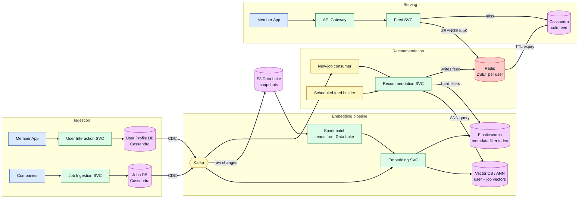
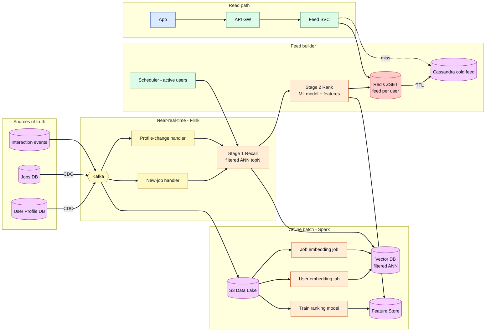
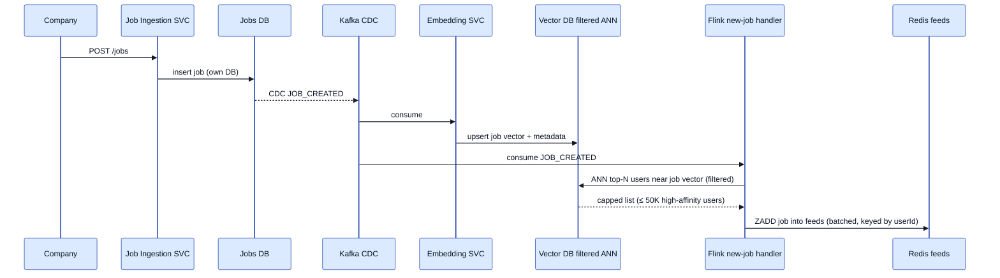
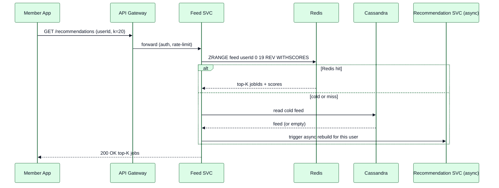

# Job Recommendation System ("Top Job Picks For You") — High-Level Design

> LinkedIn-style personalized job recommendations. This doc contains:
> 1. The **recommended (best) design**
> 2. An **honest evaluation of your interview design** (from the whiteboard screenshot)
> 3. **Prep answers to every question the interviewer probed** (from the transcript)

---

## 1. Functional Requirements (FR)

| # | Feature | Description |
|---|---------|-------------|
| FR1 | **Personalized job feed** | For a member, return a ranked list of jobs — "Top job picks for you" |
| FR2 | **Job ingestion** | Companies post jobs; jobs become recommendable within minutes |
| FR3 | **Profile-aware matching** | Use skills, seniority, location, title, salary expectation, past behavior |
| FR4 | **Metadata filtering** | Hard filters: location/remote, salary range, seniority, work auth |
| FR5 | **Feedback loop** | Clicks, saves, applies, dismisses feed back into ranking |
| FR6 | **Freshness & dedup** | Don't re-show applied/dismissed jobs; prefer fresh postings |
| FR7 | **Pagination** | `GET /recommendations?userId=..&k=..` returns top-K, scrollable |

## 2. Non-Functional Requirements (NFR)

| NFR | Target |
|-----|--------|
| **Read latency (feed)** | p99 < 150 ms |
| **Availability** | 99.9% (recommendations are not payment-critical; degrade gracefully) |
| **Freshness** | New job discoverable in < 5 min; profile change reflected in < 1 hr |
| **Scale** | ~1B members, ~500M active, ~20M jobs, ~10K new jobs/min peak |
| **Consistency** | Eventual — a stale rec for a few minutes is acceptable |
| **Cost** | Recommendation compute is expensive; must be batchable/cacheable |

---

## 3. Scale Estimation (drives every decision)

| Metric | Value |
|--------|-------|
| Members | 1B total, ~300M DAU |
| Feed opens/day | 300M × 3 = ~900M → **~10K RPS avg, ~50K RPS peak** |
| Jobs live | ~20M open postings |
| New jobs/day | ~5M → ~60/s avg, ~10K/min peak |
| Embedding dim | 256 floats × 4B = **~1 KB per vector** |
| User vectors | 500M × 1KB = **~500 GB** (fits a sharded ANN index) |
| Job vectors | 20M × 1KB = **~20 GB** |

**Key takeaway:** reads dominate (50K RPS). The feed **must be served from a precomputed cache**, not computed on the request path. This is the single most important design driver.

---

## 4. The Core Design Decision: Push vs Pull

This is the axis your whole design lives on, and it's what the interviewer was circling.

### Option A — Pull / fan-out-on-read (compute at request time)
When the user opens the app: fetch profile → ANN recall candidate jobs → filter → rank → return.

- Good: always fresh, no wasted compute for inactive users, simple to reason about.
- Bad: heavy ML on the hot path → hard to hit p99 < 150 ms at 50K RPS. Needs caching anyway.

### Option B — Push / fan-out-on-write (your design)
When a job is posted: embed it → find **similar users** → write the job into each user's precomputed feed (Redis).

- Good: **reads are trivial** (`ZRANGE` from Redis) — great for 50K RPS.
- Bad: a broad job (e.g. "Software Engineer") matches **tens of millions** of users → write amplification storm. Also, if a user's preferences change, their pushed feed is stale until recomputed. This is the celebrity/fan-out-on-write problem from Twitter timelines.

### ✅ Recommended: **Hybrid** (this is the "best solution")

| Layer | Strategy |
|-------|----------|
| **Base feed** | **Pull, precomputed on a schedule** (per active user, every few hours + on significant profile change) into Redis. Serves the p99. |
| **Fresh jobs** | **Bounded push** — when a job is posted, push it only to a **capped, high-affinity audience** (e.g. top 10K–50K matched users by score, not "everyone similar"). |
| **Request path** | Merge precomputed feed + recent pushed jobs, apply hard filters + dedup, return top-K. Light re-rank only. |

This keeps reads cheap (your instinct was right) **and** avoids the write storm (the interviewer's scaling concern).

> **The fully worked, definitely-scalable version of this is in §9–§16** (the "v2" design). Read those for the interview — they answer the "not scalable" feedback and the Elasticsearch question head-on. Sections 5–8 below are the first-pass design and the evaluation of your whiteboard.

---

## 5. Recommended High-Level Architecture



### Component responsibilities

| Component | Role |
|-----------|------|
| **User Interaction / Profile SVC** | Owns member profile + behavior; writes to its **own** DB |
| **Job Ingestion SVC** | Owns job postings; writes to its **own** Jobs DB |
| **CDC (Debezium)** | Streams row changes from each OLTP DB into Kafka — no dual writes |
| **Embedding SVC** | Turns a profile/job into a 256-d vector (a model, not string matching) |
| **Vector DB (ANN)** | e.g. Milvus/Pinecone/pgvector — nearest-neighbor recall **+ metadata filtering** (see §9: this replaces ES) |
| **Elasticsearch** | ⚠️ **Not needed in the reco path** — filtered ANN covers it (see §9). Keep ES only for a separate keyword *job-search* surface |
| **Recommendation SVC** | Recall (ANN) → filter (ES) → rank (composite score) → write feed |
| **Redis** | Per-user precomputed feed as a sorted set (score-ordered) |
| **Cassandra** | Cold storage for feeds after Redis TTL; write-heavy friendly |
| **S3 Data Lake** | Snapshots for Spark to batch-read (so Spark never hammers OLTP) |

---

## 6. Data Models & Exact Payloads

The interviewer explicitly asked *"what is the data type of the recommendation you send to Kafka?"* — have a crisp answer ready.

### 6.1 Job-posted event (CDC → Kafka, topic `jobs.cdc`)
```json
{
  "eventType": "JOB_CREATED",
  "jobId": "job_1234",
  "title": "Software Engineer",
  "company": "Tech Corp",
  "skills": ["Python", "Elasticsearch", "Java"],
  "location": "New York, NY",
  "salary": 120000,
  "postedAt": "2026-07-14T19:58:00Z"
}
```

### 6.2 Recommendation event (Recommendation SVC → Kafka, topic `recommendations`)
Be precise about the type. It is an **envelope with a list of (userId, score) pairs**:
```json
{
  "eventType": "NEW_RECOMMENDATIONS",
  "jobId": "job_1234",
  "generatedAt": "2026-07-14T19:59:10Z",
  "recommendations": [
    { "userId": "u_1", "score": 0.93 },
    { "userId": "u_2", "score": 0.88 }
  ]
}
```
Java type: `record RecoEvent(String eventType, String jobId, Instant generatedAt, List<UserScore> recommendations)` where `record UserScore(String userId, double score)`.

> If the fan-out audience is large, **don't put millions of userIds in one message**. Chunk into batches (e.g. 1K users/message) or, better, key the message by `userId` so the feed-writer consumer group parallelizes across partitions.

### 6.3 Redis feed (per user)

Redis stores **one precomputed, ranked feed per user** — only `jobId` + score, not full job details.

**Key**

| Field | Value |
|-------|--------|
| **Pattern** | `feed:<userId>` |
| **Examples** | `feed:123`, `feed:u_abc789` |
| **Cardinality** | One key per active user |
| **Sharding** | Redis Cluster by `userId` |
| **TTL** | e.g. 7 days → cold copy in **Cassandra** |

**Value (Sorted Set / ZSET)**

| Field | Value |
|-------|--------|
| **Member** | `jobId` |
| **Score** | Composite recommendation score (higher = better match) |
| **Size** | Top-K per user (e.g. ~50) |

**Write (batch / feed builder):**
```redis
ZADD feed:123 0.93 job_456
ZADD feed:123 0.88 job_789
EXPIRE feed:123 604800
```

**Read (Feed SVC):**
```redis
ZRANGE feed:123 0 19 REV WITHSCORES   # page 1, top 20
ZRANGE feed:123 20 39 REV WITHSCORES  # page 2
```

**Not in Redis:** job title/company/salary (Jobs DB), user profile (Profile DB), embeddings (Vector DB).

**Size:** ~50 jobs × ~30B ≈ **~1.5 KB/user**; 100M active users ≈ **~150 GB** (Redis Cluster).

### 6.4 Composite score (ranking)
```
score = w1 * semanticSimilarity(userVec, jobVec)   // ANN cosine
      + w2 * freshness(job.postedAt)
      + w3 * behaviorAffinity(user, job.company/skills)
      - w4 * penalties(alreadyApplied, dismissed)
```

---

## 7. Evaluation of Your Interview Design

### What was genuinely good ✅
- **Event-driven with CDC + Kafka** — correct instinct to decouple ingestion from processing.
- **Vector DB for semantic matching + separate cache for serving** — the right two-store split for recall vs serving.
- **Redis ZSET with `ZRANGE ... REV WITHSCORES`** and **TTL → Cassandra tiering** — this is a strong, concrete, correct serving design. Good detail.
- **Spark for batch embedding** — right tool for computing many vectors in parallel.
- **Push model for cheap reads** — a valid, defensible choice; you just needed to bound it.

### Gaps the interviewer exposed 🔴 (and the fix)

| Gap | Why it's a problem | Fix |
|-----|--------------------|-----|
| **Spark reads user DB directly** | Full scans on the OLTP DB cause **read contention** with live traffic | Spark reads from **S3 snapshots / data lake** (fed by CDC), never the live DB |
| **Unbounded fan-out on job post** | "Software Engineer" matches 10M+ users → write storm, stale feeds | **Cap the audience** (top-N by score); hybrid with scheduled pull |
| **"Semantically similar users" was vague** | Couldn't name the features | Embedding features: skills, title, seniority, industry, past applies; cosine in ANN |
| **ES role unclear / called it overkill** | You mixed semantic recall with metadata filtering | **ANN = semantic recall; ES = hard filters** (salary range, location). They're complementary, not redundant |
| **Reco payload type fuzzy** | Couldn't state the structure | `List<{userId, score}>` in an envelope, chunked/partitioned by userId (see §6.2) |
| **Job→users direction** | Recommending a job to users is fan-out-on-write; user→jobs is more natural for "picks for you" | Use hybrid; precompute per-user feeds (user→jobs) as the base |

### Your own post-interview reflection — verdict
You wrote: *"ES was overkill; could store directly to feed DB from vector DB; reco service computes composite scores; simpler design; Spark updates when a user changes interests."*
- **Partly right, partly wrong.** Simplifying the serving path (vector DB → reco → feed) is good. But **dropping ES is wrong** — you still need hard filters (salary/location/seniority) that ANN can't express precisely. Keep ES, just be clear it's for filtering, not semantics.
- **Right** that a Spark/stream job must recompute a user's vector when their interests change — call this out proactively next time.

---

## 8. Interviewer Q&A — Prep Answers (from your transcript)

**Q1. Why one DB? Don't you want separate Profiles DB and Jobs DB?**
Yes — separate stores, one per service (User Profile SVC owns the profile DB, Job Ingestion SVC owns the jobs DB). Independent scaling, blast-radius isolation, and clean service ownership. They communicate via events, not shared tables.

**Q2. What does the Spark job do, and how do user vectors get into the vector DB?**
Spark batch-computes user embeddings from profile + interaction history and **upserts them into the vector DB**. It runs on a schedule and incrementally on profile-change events. Crucially it reads from **S3 snapshots**, not the live user DB.

**Q3. Data type of the recommendation you send to Kafka?**
An envelope: `{eventType, jobId, generatedAt, recommendations: List<{userId, score}>}`. For large audiences, chunk into batches or key messages by `userId` so consumers parallelize. (See §6.2.)

**Q4. How do you find "semantically similar" users — which attributes?**
The embedding is trained on skills, title, seniority, industry, location intent, and past application behavior. Similarity = cosine distance in the ANN index. **Precise constraints (salary range, exact location, seniority band) are done in Elasticsearch**, not the vector search — that's the point you missed.

**Q5. Will this scale? Can Spark reading the user DB handle the contention?**
No — a batch job scanning the OLTP DB competes with live traffic. Decouple via **CDC → S3 data lake**, and Spark reads the lake. OLTP only serves online traffic.

**Q6. Should we keep a separate S3 store for periodic snapshots/dumps?**
Yes. CDC lands change data in **S3 (data lake)**; periodic snapshots there give Spark a cheap, contention-free read source and also serve as backup/replay.

**Q7. Why CDC? Why not connect directly to Cassandra?**
CDC avoids **dual-write inconsistency** and shields the OLTP store from analytical load. Producers just write their DB; CDC reliably streams changes to every consumer (embedding, lake, search) with replay via Kafka offsets.

**Q8. Why find similar *users* at all?**
In your push model, grouping similar users lets you **fan a new job out to a whole cohort's feeds at once** instead of recomputing per user. Valid — but bound the cohort size (§4).

**Q9. Why Spark specifically?**
Embedding millions of users/jobs is embarrassingly parallel; Spark distributes it and finishes far faster than a single service. Use it for **batch**; use a streaming job (Flink/Kafka Streams) for **incremental** per-change updates.

---

## 9. Do We Really Need Elasticsearch? (Definitive Answer)

**Short answer: No — not for the recommendation system itself.** This is the highest-leverage thing to get right, because saying "ES is overkill *and here's exactly when it isn't*" shows senior judgment.

### Why you can drop ES from the reco path
Every hard filter you wanted ES for — salary range, location, seniority, date-posted, work-auth — is **metadata attached to the job**. Modern vector databases (Milvus, Qdrant, Pinecone, Weaviate, pgvector) support **filtered ANN search**: you store metadata alongside each job vector and pass a filter predicate *into* the nearest-neighbor query.

```text
// Single call to the vector DB does recall + hard filter together:
search(
  vector      = userEmbedding,
  topK        = 500,
  filter      = salary >= 100000 AND location IN ("NYC","Remote")
                AND seniority = "SENIOR" AND postedAt > now()-30d
)
```

So the two things you thought needed two systems (semantic recall in the vector DB + metadata filtering in ES) collapse into **one filtered ANN query**. That removes a whole stateful system, its sync pipeline, and a class of consistency bugs.

### When ES *is* justified (say this to show range)
| Use case | Need ES? | Why |
|----------|----------|-----|
| "Top job picks for you" (recommendations) | **No** | Filtered ANN in the vector DB covers recall + filters |
| **Recruiter/member job SEARCH** ("java jobs in NYC") | **Yes** | Full-text/keyword (BM25), typo tolerance, facets, aggregations |
| Complex boolean/faceted browse UI | Yes | ES aggregations & filters shine here |
| Analytics/log search | Yes | Different product surface entirely |

> **Interview line:** *"For recommendations I'd use filtered vector search — the vector DB handles both semantic recall and metadata filters, so a separate Elasticsearch is redundant. I'd only introduce ES for the keyword **job-search** product, which is a different surface with full-text and faceting needs."*

The recommended architecture in §5 is updated below to reflect this (ES removed from the reco path).

---

## 10. The Scalable & Correct Design (v2) — Two-Stage RecSys

This is the industry-standard shape (LinkedIn / Meta / YouTube all use a variant). It is scalable because **the expensive work is precomputed offline and the read path is O(1)**.



### The two stages (say these names in the interview)
| Stage | Name | Size | Cost | Where |
|-------|------|------|------|-------|
| 1 | **Candidate generation / Recall** | 20M jobs → ~500 | cheap | Filtered ANN in vector DB |
| 2 | **Ranking** | ~500 → top 50 | expensive | ML model (gradient-boosted / DNN) + Feature Store |
| — | **Serving** | top 50 | ~0 | Redis ZSET, `ZRANGE` |

**Why this is scalable:** the expensive prep — **item embeddings, the ANN index, and features — is precomputed offline**, so each request only runs the funnel over a *small* candidate set. In practice (see §16) real systems run stages 1–2 **online within a ~150 ms latency budget** and **cache the top-K in Redis** to absorb repeat opens; full precompute-to-Redis is a selective optimization (digests, warm cache), not the only serving path.

### Multi-source recall (better relevance, still cheap)
Recall isn't only embeddings. Union several cheap sources, then dedup:
- **Embedding ANN** (semantic: skills/title/seniority)
- **Rules** (same location, recently posted, same company followed)
- **Collaborative filtering** ("users like you applied to…")
- **Fresh jobs** injected by the near-line lane

---

## 11. Why v1 Was "Not Scalable" → Exactly What v2 Fixes

| v1 bottleneck (your interview) | Why it breaks at scale | v2 fix |
|--------------------------------|------------------------|--------|
| **Unbounded fan-out on job post** — "find all similar users, push job to each feed" | A generic job ("SWE") matches 10M+ users → 10M Redis writes per posting × 10K postings/min = **write storm**, hot partitions | **Pull-based precompute** per user is the base feed; new jobs handled by **bounded** near-line injection (cap top-N high-affinity users, e.g. ≤50K) |
| **Spark reads OLTP user DB directly** | Full scans contend with live traffic; DB becomes bottleneck | Spark reads **S3 data lake** (CDC-fed). OLTP only serves online reads |
| **ML/scoring on read path** (if pulled) | Can't hit p99<150ms at 50K RPS | **Precompute** top-K into Redis; read = `ZRANGE` |
| **Stale feed when user changes interests** | Pushed feed never updates | **Near-line profile-change handler** (Flink) recomputes that user's feed within seconds |
| **Single/duplicate stores, ES + vector DB sync** | Two systems to keep consistent | **Filtered ANN** removes ES from reco path (§9) |
| **Recommendation Kafka message = millions of userIds** | Giant messages, no parallelism, consumer OOM | Key events by `userId` / chunk into ≤1K-user batches → parallel consumers |

---

## 12. Scaling Deep-Dive & Capacity

### Read path (the 50K RPS)
- **Redis Cluster**, sharded by `userId` (consistent hashing). Feed = `ZSET`, ~50 entries × ~100B = ~5KB/user.
- 500M active × 5KB = **~2.5 TB** → ~25 shards of 100GB (with replicas). Trivial for Redis Cluster.
- Cold feeds (inactive users) evicted via TTL → **Cassandra**, rebuilt lazily on next visit.

### Write / build path
- **New jobs:** 10K/min peak. Each triggers one **filtered ANN query** (recall) + bounded injection. No per-user scan.
- **Scheduled rebuild:** active users refreshed every few hours by Spark; incremental for changed profiles via Flink. Embedding is **embarrassingly parallel** → scale Spark executors.
- **Vector DB:** 20M job vectors (~20GB) + 500M user vectors (~500GB) → sharded ANN (HNSW/IVF), horizontally partitioned.

### Kafka
- Partition `jobs.cdc` by `jobId`, `profile.cdc` by `userId`, `interactions` by `userId`. Consumers scale to partition count.

### Bottleneck → mitigation cheat sheet
| Bottleneck | Mitigation |
|-----------|------------|
| Hot Redis key (celebrity job) | Not applicable — feeds keyed by user, not job |
| ANN query latency | HNSW index, shard by region, cache popular user recalls |
| Spark contention on OLTP | Read from S3 lake, never OLTP |
| Feed staleness | Near-line Flink lane on profile/job events |
| Ranking model cost | Run offline; only top candidates scored; batch inference |

---

## 13. Sequence Diagrams

### 13.1 Write path — new job posted (bounded, no storm)


### 13.2 Read path — user opens app (O(1))


---

## 14. Cold Start & Freshness (common follow-ups)
- **New user (no history):** recall falls back to rules — location + popular-in-your-title + trending jobs; embedding refines once they interact.
- **New job (no interactions):** content embedding (from title/skills/description) makes it recommendable immediately via ANN; the near-line lane injects it into matching feeds.
- **Freshness:** near-line lane keeps < 5 min job-to-feed latency; scheduled rebuild prevents long-term drift.

---

## 15. Interview Cheat-Sheet (say these)
1. **Two-stage: recall (cheap, ANN) → rank (expensive, ML) → serve.** Run the funnel **online within a ~150 ms budget** over a small candidate set (item embeddings/index/features precomputed offline); **cache top-K in Redis**. (See §16 reality check.)
2. **No Elasticsearch in the reco path** — filtered ANN does recall + metadata filters in one query. ES only for keyword job *search*.
3. **Bounded fan-out** — base feed is precomputed per user; new jobs injected to a capped audience. No write storm.
4. **Spark reads the S3 data lake, never OLTP** — CDC decouples and prevents contention.
5. **Near-line (Flink) lane** keeps feeds fresh on profile/job changes.
6. **Redis ZSET per user, TTL → Cassandra** for cold storage.

---

## 16. Reality Check — Does This Match How It's Actually Done? (Researched)

I checked the proposed design against public engineering material from LinkedIn, Google/YouTube, Meta, and Pinterest. **The core is a strong match; one part of my v2 needed an honest correction.**

### ✅ Confirmed — the two-stage funnel is exactly the industry pattern
- **LinkedIn** runs a **multi-stage cascade** for job recs: **retrieval (L0)** narrows ~tens of millions of jobs to a few thousand, **L1** calibrates across sources with a lightweight model (**logistic regression / XGBoost**), **L2** is a heavy deep model, then **re-ranking** applies business/fairness rules. This is precisely the recall→rank shape in §10. (LinkedIn Eng: ["People You May Know"](https://www.linkedin.com/blog/engineering/recommendations/building-a-large-scale-recommendation-system-people-you-may-know), ["JUDE"](https://www.linkedin.com/blog/engineering/ai/jude-llm-based-representation-learning-for-linkedin-job-recommendations))
- **YouTube** (Covington et al., 2016) — the canonical paper — uses exactly **candidate generation + ranking** for the same reason: you can't score millions of items per request. ([paper](https://gwern.net/doc/ai/nn/retrieval/2016-covington.pdf))
- **Meta Instagram Explore** and **Pinterest** both document the same **retrieval → light rank → heavy rank** funnel with **multiple candidate-generation sources** merged and deduped. ([Meta](https://engineering.fb.com/2023/08/09/ml-applications/scaling-instagram-explore-recommendations-system/), [Pinterest](https://medium.com/pinterest-engineering/establishing-a-large-scale-learned-retrieval-system-at-pinterest-eb0eaf7b92c5))

### ✅ Confirmed — Two-Tower + ANN for retrieval (item embeddings precomputed offline)
Everyone uses a **two-tower** model: precompute **all item (job) embeddings offline**, index them in an **ANN** structure (**HNSW / FAISS / IVFPQ**), compute the **user embedding at request time**, then do nearest-neighbor search. LinkedIn's job-search EBR is served on **IVFPQ** ("Zelda"). This validates §10's recall stage and §6's embeddings. ([LinkedIn EBR](https://www.linkedin.com/blog/engineering/platform-platformization/using-embeddings-to-up-its-match-game-for-job-seekers))

### ✅ Confirmed — "No Elasticsearch, use filtered ANN" is real
LinkedIn explicitly applies **Attribute-Based Matching (ABM) post-filters** on top of embedding-based ANN retrieval — i.e., **metadata filters attached to the vector search**, not a separate Elasticsearch cluster in the reco path. This is exactly the §9 argument. (LinkedIn [JUDE](https://www.linkedin.com/blog/engineering/ai/jude-llm-based-representation-learning-for-linkedin-job-recommendations) & [Hiring Assistant](https://www.linkedin.com/blog/engineering/ai/semantic-search-for-ai-agents-at-scale-retrieval-and-ranking-for-linkedins-hiring-assistant): "ANN search… Attribute-based matching (ABM) post-filters are applied.")

### ✅ Confirmed — multi-source recall
Real systems don't rely on embeddings alone: LinkedIn/Meta/Pinterest blend **graph-based, collaborative-filtering, heuristic (location/fresh), and embedding** sources, then merge+dedup before ranking — matching §10's "multi-source recall." Pinterest runs **20+ candidate generators**.

### ⚠️ Correction — serving is usually an ONLINE funnel within a latency budget, not a full precompute-to-Redis
This is the one place my v2 over-simplified. The dominant industry pattern **runs retrieval + ranking on the request path** inside a strict budget (~150 ms), e.g.: feature fetch ≤10 ms, retrieval ≤30 ms (sources in parallel), light rank ≤20 ms, heavy rank ≤60 ms, re-rank ≤20 ms. Only the **item embeddings/index and features are precomputed offline**; the funnel itself runs live. ([CalibreOS two-stage](https://www.calibreos.com/learn/mlsd-two-stage-retrieval), [YouTube paper](https://gwern.net/doc/ai/nn/retrieval/2016-covington.pdf))

**Full precompute + fan-out into a per-user store (my §4/§10 Redis feed) is real but used selectively** — for email/notification digests, the "recommended jobs" module, or as a warm cache — not usually as the sole serving path for the main on-site feed.

**Corrected recommendation (say this in the interview):**
> "Precompute item embeddings, the ANN index, and features **offline**. Serve by running the **two-stage funnel online within a ~150 ms budget** (user embedding + ANN recall + light rank + heavy rank on a few hundred candidates), and **cache the top-K in Redis** to absorb repeat opens. Use **offline precompute/fan-out** for digests and as a cache — not as the only path."

### Scorecard

| Design element | Matches real world? | Source |
|----------------|:---:|--------|
| Two-stage recall → rank funnel | ✅ Yes | LinkedIn, YouTube, Meta, Pinterest |
| Two-tower + ANN (HNSW/IVFPQ), items precomputed | ✅ Yes | LinkedIn EBR, YouTube |
| Light ranker = LogReg/XGBoost; heavy = DNN | ✅ Yes | LinkedIn PYMK |
| Filtered ANN instead of Elasticsearch (ABM) | ✅ Yes | LinkedIn JUDE / Hiring Assistant |
| Multi-source candidate generation | ✅ Yes | Pinterest (20+), Meta |
| CDC → lake → Spark offline; near-line embeddings | ✅ Yes | LinkedIn nearline (Kappa) |
| Bounded fan-out for new jobs | ⚠️ Partial | Used for freshness/digests, not primary serving |
| **Full precompute-to-Redis as sole serving path** | ⚠️ **Over-simplified** | Real systems run the funnel online within a latency budget + cache |

**Bottom line:** the architecture is fundamentally correct and mirrors production systems. Just present serving as an **online funnel within a latency budget backed by caching**, and mention precompute/fan-out as a selective optimization rather than the default.

---

## 17. One-Line Summary

Precompute each user's feed with a **two-stage recall→rank pipeline** running **off the request path** (Spark batch + Flink near-line, both reading an **S3 lake fed by CDC**, never the OLTP DB); do recall + hard filters in **one filtered-ANN query** (so **no Elasticsearch** in the reco path); serve reads as an **O(1) Redis `ZRANGE`** with **Cassandra** as cold tier; keep fan-out **bounded** to avoid write storms.
