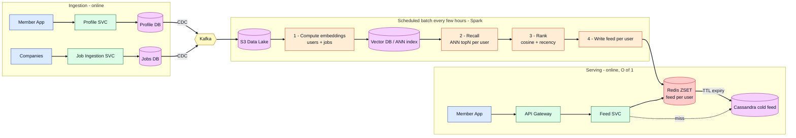
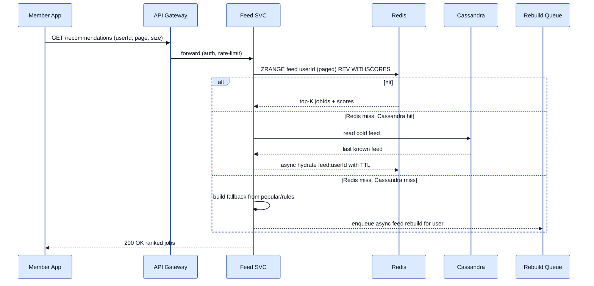
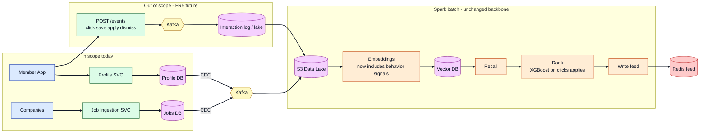
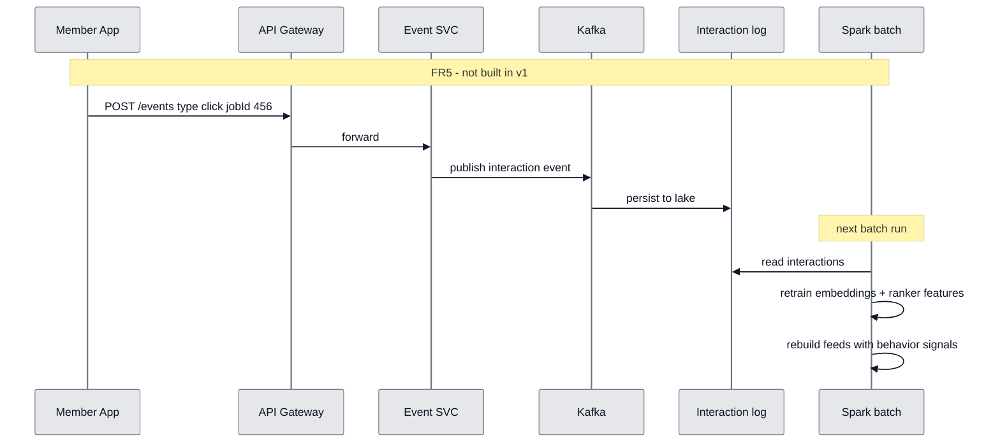

# Job Recommendation System — Simplified (Batch-First) Design

> Companion to `job-recommendation-hld.md`. This version answers one question:
> **"If we're allowed some latency between a job being posted and it appearing in a user's feed, how does the architecture simplify?"**
>
> **Answer: the near-real-time (Flink) lane disappears** — recommendations are still built by a **scheduled Spark batch**. **CDC stays** to stream Profile/Jobs changes into Kafka → S3 lake (Spark never reads OLTP). FR5 feedback loop is **out of scope** for v1 (see §14).

---

## 1. The One Assumption That Simplifies Everything

> **Freshness SLA:** a newly posted job may take up to **~1–6 hours** to appear in a member's "Top job picks." A profile change may take similarly long to reflect.

This is realistic — job hunting is not Twitter. You don't need sub-minute freshness. Once you accept this, **Flink / near-real-time feed building** is not justified — but **CDC** still is, to feed the lake incrementally without Spark scanning OLTP.

---

## 2. What We Can Drop (and Why)

| Component (in the full design) | Keep? | Why |
|--------------------------------|:-----:|-----|
| **Interaction loop (FR5)** | ❌ Out of scope v1 | Clicks/applies/dismisses not collected; content-based matching is enough to ship. Add later via §14. |
| **CDC (Debezium) → Kafka → S3** | ✅ Keep | Incremental change capture into the **data lake**; Spark reads S3 only — no OLTP contention, replay on failure, ready for FR5 later. |
| **Flink / near-real-time lane** | ❌ Drop | Only existed to push fresh jobs/profile changes within seconds. Batch cadence covers our hours-level SLA. |
| **Bounded fan-out on job post** | ❌ Drop | No per-event fan-out at all now; the batch recomputes feeds wholesale. Eliminates the write-storm problem entirely. |
| **Elasticsearch (reco path)** | ❌ Drop | Metadata filters (salary/location/seniority) are done as **filtered ANN** inside the vector search. (Same argument as the full doc.) |
| **Vector DB / ANN index** | ✅ Keep | Still the cheapest way to recall ~hundreds of relevant jobs out of millions. |
| **Spark (batch)** | ✅ Keep | Now the *core* of the system — embeddings + recall + ranking + feed write. |
| **Redis (per-user feed)** | ✅ Keep | O(1) reads for the serving path. Batch precompute → Redis is the natural fit here. |
| **Cassandra (cold feed)** | ✅ Keep | Cheap cold storage for inactive users after Redis TTL. |

**Net effect:** Flink and fan-out-on-write removed; **CDC + batch + O(1) serving** remains. OLTP is isolated from analytics.

---

## 3. Simplified Architecture (v1 — in scope)



Two planes:
- **Change capture (CDC):** Profile DB + Jobs DB → **Debezium CDC** → **Kafka** → **S3 data lake** (incremental, replayable). Services only write their OLTP DB — no dual writes.
- **Offline plane (Spark, scheduled):** reads the **lake** (never OLTP) → embeddings → recall → rank → writes each active user's top-K feed.
- **Online plane (serving):** `Feed SVC` reads the precomputed feed from Redis. No ML on the request path.

> **Not in v1:** interaction/feedback loop (FR5). See **§14**.  
> **Feed freshness** is bounded by **batch cadence** (hours), not CDC latency — CDC feeds the lake; batch builds the feed.

---

## 4. How Each Functional Requirement Is Met (in scope)

| FR | Requirement | In scope? | How this design satisfies it |
|----|-------------|:---------:|------------------------------|
| **FR1** | Personalized "Top job picks" | ✅ v1 | Batch computes a ranked top-K per user and stores it in **Redis**; `Feed SVC` returns it in one `ZRANGE`. |
| **FR2** | Job ingestion | ✅ v1 | `Job Ingestion SVC` writes to **Jobs DB**; **CDC** streams the change to Kafka → lake; next Spark batch embeds the job and it becomes recommendable. |
| **FR3** | Profile-aware matching | ✅ v1 | Batch builds a **user embedding** from profile fields (skills, seniority, location, title); recall = ANN similarity between user and job vectors. |
| **FR7** | Pagination | ✅ v1 | Redis **ZSET** supports `ZRANGE start stop` — natural offset/limit paging over the stored top-K. |
| **FR6a** | Dedup (hide already-applied) | ⚠️ optional v1 | If an Applications table exists, batch excludes those `jobId`s before write. No dismiss/hide without FR5. |
| **FR4** | Hard metadata filtering | ❌ v2 | Deferred — location/seniority captured softly in embeddings first. |
| **FR5** | **Feedback loop** | ❌ **out of scope** | Clicks/saves/applies/dismisses **not collected** in v1. See **§14** for future design. |
| **FR6b** | Freshness weighting | ❌ v2 | v1 rank = `cosine + recency` only; full freshness tuning later. |

> v1 meets the **core** FRs (FR1, FR2, FR3, FR7) with **CDC → lake → batch** and **no Flink / no FR5 interaction loop**.

---

## 5. The Batch Pipeline (what Spark actually does each run)

1. **Read lake** — Spark reads **Profile** and **Jobs** from S3 (materialized from **CDC → Kafka**). Never the live OLTP DBs. No interaction data in v1.
2. **Embed** — compute/refresh **job vectors** (title, skills, description) and **user vectors** (skills, seniority, location from profile), upsert into the **Vector DB**.
3. **Recall** — for each active user, ANN query → ~hundreds of candidate jobs.
4. **Rank** — score = `cosine_similarity(userVec, jobVec) + recency(job.postedAt)` → top-K.
5. **Write** — `ZADD` the top-K into `feed:<userId>` in Redis (TTL); cold users spill to Cassandra.

Because steps 2–4 are embarrassingly parallel across users/jobs, Spark scales horizontally — this is exactly why the batch approach is cheap at scale.

### 5.1 Deep Dive — How a Recommended Job Is Found (worked example)

We'll follow **one user (`u_123`)** and **one job (`job_456`)** through every stage to show exactly how the job ends up at the top of the user's feed.

#### Setup — the raw material

**A job (Jobs DB → lake):**
```json
{
  "jobId": "job_456",
  "title": "Senior Backend Engineer",
  "skills": ["Java", "Kafka", "Distributed Systems"],
  "location": "New York, NY",
  "seniority": "SENIOR",
  "postedAt": "2026-07-14T09:00:00Z"
}
```

**A user (Profile DB → lake):**
```json
{
  "userId": "u_123",
  "skills": ["Java", "Spring", "Microservices"],
  "title": "Backend Engineer",
  "seniority": "SENIOR",
  "location": "New York, NY"
}
```

Goal: recognize that `job_456` matches `u_123` and place it near the top of `feed:u_123`.

#### Stage 1 — Read lake (load the changed set)

Spark reads the latest lake partitions (changed jobs/users since last run, via CDC):
```text
s3://lake/jobs/dt=2026-07-14/hour=10/       -> DataFrame of changed jobs
s3://lake/profiles/dt=2026-07-14/hour=10/   -> DataFrame of changed users
```
Loaded as distributed DataFrames across executors. Nothing touches OLTP.

#### Stage 2 — Embed (attributes -> vector)

An embedding model maps each job and user into a fixed-length vector (e.g. 256 floats) where **semantically similar things land close together**:
```text
embed("Senior Backend Engineer, Java, Kafka, Distributed Systems, NYC")
   -> [0.12, -0.44, 0.91, ...]   = jobVec(job_456)

embed("Backend Engineer, Java, Spring, Microservices, Senior, NYC")
   -> [0.14, -0.40, 0.88, ...]   = userVec(u_123)
```
The two vectors are **numerically close** because the concepts overlap (Java, backend, senior, NYC). Each vector is upserted **by key** (point write, not a scan):
```text
vectorDB.upsert("job_456", jobVec)
vectorDB.upsert("u_123",  userVec)
```

#### Stage 3 — Recall (find candidate jobs via nearest neighbors)

For `u_123`, we do **not** score all 20M jobs. We ask the ANN index for the nearest neighbors of the user's vector. Similarity is **cosine similarity**:
```text
sim(u, j) = dot(userVec, jobVec) / (norm(userVec) * norm(jobVec))
```
Higher = more aligned in meaning. Because the two vectors are close, their cosine is high (e.g. `0.93`).

Brute-forcing all 20M is too slow, so the Vector DB uses an **Approximate Nearest Neighbor** index (e.g. **HNSW**, a navigable graph) to return the top few hundred in near-log time:
```text
candidates = vectorDB.search(query = userVec(u_123), topN = 500)
# -> [job_456 (0.93), job_789 (0.90), job_012 (0.87), ... 500 items]
```
That ~500 list is the **recall set** — a cheap, high-recall shortlist. `job_456` is in it.

> Core idea: **recommendation = nearest-neighbor search in embedding space.** Recall narrows 20M -> ~500 fast.

#### Stage 4 — Rank (order the shortlist precisely)

Ranking decides the final order using a richer score. In v1:
```text
score(u, j) = cosine_similarity(userVec, jobVec)   # semantic match
            + w * recency(job.postedAt)             # prefer fresh jobs
```

| jobId | cosine | recency boost | final score |
|-------|--------|---------------|-------------|
| job_456 | 0.93 | +0.04 (posted today) | **0.97** |
| job_789 | 0.90 | +0.01 (5 days old) | 0.91 |
| job_012 | 0.87 | +0.02 | 0.89 |

Sort descending -> `job_456` is #1. Also here: **dedup** (drop already-applied jobs) and truncate to **top-K** (e.g. 50).

**Why two stages?** Recall is cheap and optimizes "don't miss anything good" over 20M; ranking is costlier per item so it runs only on the ~500 survivors, optimizing "best on top." (In v2 ranking becomes an ML model on clicks/applies — the two-stage shape stays.)

#### Stage 5 — Write (materialize the feed)

```redis
ZADD feed:u_123 0.97 job_456
ZADD feed:u_123 0.91 job_789
ZADD feed:u_123 0.89 job_012
EXPIRE feed:u_123 86400
```
Cold/inactive users spill to **Cassandra**. When `u_123` opens the app, serving is just `ZRANGE feed:u_123 0 19 REV WITHSCORES` — `job_456` on top, **no ML at read time**.

#### How Spark parallelizes it (why it scales)

Each stage is data-parallel across executors:
```text
Executor 1: users u_1..u_100k     -> recall -> rank -> ZADD
Executor 2: users u_100k..u_200k  -> recall -> rank -> ZADD
...                                (embarrassingly parallel)
```
- **Embed:** partition users/jobs across executors; each embeds its slice.
- **Recall + Rank:** partition **users** across executors; users are independent -> linear scaling.

#### The subtlety worth saying out loud

**Embedding refresh is incremental (only changed items), but recall/feed rebuild is broader.** Even if `u_123`'s vector didn't change, **new jobs** appeared since the last run, so recall must re-run to surface them. So:
- Stage 2 (embed) scales with **changes**.
- Stages 3–4 (recall + rank) scale with **users whose feed you rebuild** — which is why tiering (precompute for active users, on-demand for the long tail) matters for scale.

---

## 6. Redis: Key and Value

Redis stores **one precomputed, ranked feed per user**. It does **not** store job details, embeddings, or user profiles — only `jobId` + score.

### Key

| Field | Value |
|-------|--------|
| **Pattern** | `feed:<userId>` |
| **Examples** | `feed:123`, `feed:u_abc789`, `feed:member_456` |
| **Cardinality** | One key per active user |
| **Sharding** | Redis Cluster shards by `userId` (consistent hashing) |
| **TTL** | **24 hours for hot active users**; refreshed by each successful batch. Cold copy lives in **Cassandra** |

### TTL choice

Use a TTL slightly longer than the batch cadence, so a user can still read the last good feed if one batch fails.

| User segment | Batch cadence | Redis TTL | Why |
|--------------|---------------|-----------|-----|
| **Highly active users** | every 1-3 hours | **24 hours** | Keeps hot feeds in memory; survives several failed/delayed batches |
| **Normal active users** | every 6-12 hours | **2-3 days** | Avoids rebuilding too often for occasional visits |
| **Inactive / cold users** | daily or weekly | Not kept hot | Store in Cassandra; hydrate Redis on access if needed |

**Interview line:**  
> "I don't make TTL equal to batch cadence. If the batch runs every 2 hours, Redis TTL can be 24 hours so the user sees the last successful feed even if one batch fails. Batch refreshes the TTL whenever it rewrites the feed."

### Value (type: Sorted Set / ZSET)

| Field | Value |
|-------|--------|
| **Member** | `jobId` (e.g. `job_456`) |
| **Score** | Composite recommendation score (e.g. `0.93`) — higher = better match |
| **Size** | Top-K per user (e.g. ~50 jobs) |

### Example — write (batch pipeline)

```redis
ZADD feed:123 0.93 job_456
ZADD feed:123 0.88 job_789
ZADD feed:123 0.85 job_101
EXPIRE feed:123 86400
```

Logical view:

```text
feed:123  (ZSET)
┌──────────┬───────┐
│  member  │ score │
├──────────┼───────┤
│ job_456  │ 0.93  │  ← best match
│ job_789  │ 0.88  │
│ job_101  │ 0.85  │
│   ...    │  ...  │
└──────────┴───────┘
```

### Example — read (Feed SVC)

```redis
# Page 1 (top 20)
ZRANGE feed:123 0 19 REV WITHSCORES

# Page 2
ZRANGE feed:123 20 39 REV WITHSCORES
```

Returns: `jobId` + score pairs, highest score first.

### Cache miss behavior

A Redis miss means one of three things:

1. **Cold user** — the user was inactive, so their feed aged out of Redis.
2. **First-time user** — no batch has built their feed yet.
3. **Redis eviction/failure** — memory pressure or node failover removed the key.

Feed SVC handles misses in this order:

| Step | Action | Why |
|------|--------|-----|
| 1 | Read `feed:<userId>` from Redis | Fast path |
| 2 | If missing, read **Cassandra cold feed** by `userId` | Last known ranked feed; cheaper than recomputing online |
| 3 | If Cassandra has feed, return it and optionally **hydrate Redis** with `ZADD` + TTL | Warms cache for next request |
| 4 | If Cassandra also misses, return **fallback jobs** | New user / no feed yet |
| 5 | Publish async rebuild request (optional) | Next batch or worker can prioritize this user |

Fallback jobs are simple and explainable: popular recent jobs for the user's location/title/skills from the Jobs DB or a small precomputed `popular:<location>:<title>` list.

```text
Redis hit:
  Feed SVC -> Redis -> return top-K

Redis miss, Cassandra hit:
  Feed SVC -> Cassandra -> return old feed
  Feed SVC -> Redis     -> hydrate key asynchronously

Redis miss, Cassandra miss:
  Feed SVC -> fallback popular/rules list
  Feed SVC -> async rebuild request
```

Do **not** run ANN recall or ranking synchronously on a cache miss in v1. That would move expensive recommendation work back onto the read path and hurt p99 latency.

### What is NOT stored in Redis

| Data | Where it lives |
|------|----------------|
| Job title, company, salary, description | **Jobs DB** / Job Service (fetched on read for API response) |
| User skills, profile, preferences | **Profile DB** |
| Embeddings / vectors | **Vector DB** |
| Ranking model / features | **Feature Store** (offline) |

### Size estimate

~50 jobs × ~30 bytes (jobId + score) ≈ **~1.5 KB per user**.  
100M active users ≈ **~150 GB** → fits in a Redis Cluster with sharding.

---

## 7. Why S3 Data Lake? Why Cassandra?

Each store has a **distinct job**. Neither is interchangeable with Redis or the OLTP DBs.

### Storage roles at a glance

| Store | Role | Read pattern | Write pattern |
|-------|------|--------------|---------------|
| **Profile DB / Jobs DB** | Source of truth (OLTP) | Point lookups by key | Online writes from services |
| **Kafka** | Change transport | Stream consume | CDC append |
| **S3 data lake** | Batch input for Spark | Large scans (Parquet) | Kafka Connect / batch landing |
| **Vector DB** | Embeddings + ANN recall | Nearest-neighbor search | Batch upsert |
| **Redis** | Hot precomputed feed | O(1) `ZRANGE` per user | Batch `ZADD` |
| **Cassandra** | Cold precomputed feed | Key lookup by `userId` | Batch write on feed build |

---

### Why S3 / data lake?

S3 is **not** the serving cache. It is the **durable batch input** between CDC and Spark.

```text
Profile DB / Jobs DB
      ↓ CDC
   Kafka
      ↓ materialize
   S3 data lake   ← Spark reads here (never OLTP)
      ↓
   Spark batch → Redis feed
```

**What problem it solves**

| Problem | Why S3 |
|---------|--------|
| Spark must not scan OLTP | Immutable Parquet files on object storage |
| CDC produces a stream | Kafka is for transport; S3 is for **durable history** |
| Replay after batch failure | Re-run Spark on same S3 partition / offset range |
| Cost at scale | Cheaper than keeping all history in Kafka or DB |
| Columnar batch reads | Parquet + partition by `dt/hour` = fast Spark scans |

**Why “data lake” and not just “S3”?**  
S3 is storage; **data lake** is the pattern — raw/curated datasets landed in object storage, partitioned by time, consumed by batch jobs:

```text
s3://lake/profiles/dt=2026-07-14/hour=20/
s3://lake/jobs/dt=2026-07-14/hour=20/
```

**Why not only Kafka?** Kafka retention is limited (days/weeks); reprocessing huge history is expensive; Spark works best on object files. **Kafka → S3** = stream now, store cheaply forever.

**Why not read the DB directly?** Full scans contend with online traffic and are hard to replay — the scalability issue from the original interview feedback.

**Interview line:**  
> “Kafka handles change transport; S3 is the durable lake where Spark reads incremental history as Parquet. CDC → Kafka → S3 keeps OLTP isolated from batch compute.”

**Alternatives:** GCS, Azure Blob, HDFS — same pattern; S3 is the common default on AWS.

---

### Why Cassandra?

Cassandra is the **cold feed tier** — not the recommendation engine, not the lake, not OLTP.

```text
Spark batch writes feed
      ↓
   Redis  (hot — active users, sub-ms reads)
      ↓ TTL / eviction
 Cassandra (cold — inactive users, durable fallback)
```

**What it stores:** same logical data as Redis — `userId` → ranked list of `(jobId, score)` + `updatedAt`. Not embeddings, not full job docs.

**Why Cassandra for cold feeds**

| Need | Cassandra fit |
|------|----------------|
| Write-heavy batch updates | High write throughput across nodes |
| Simple key-based reads | `userId` → feed lookup on cache miss |
| Cheap long-term retention | Keep inactive-user feeds without filling Redis RAM |
| Wide rows / TTL | Store top-K or modest feed history per user |
| Availability | Multi-region fallback if Redis shard is down |

**Why not keep everything in Redis?** Memory is expensive. ~150 GB for 100M **active** users is fine; you do not want 500M–1B **inactive** users in Redis. Redis = hot active users; Cassandra = everyone else + fallback.

**Cache miss without Cassandra:** every Redis miss forces either expensive online recompute (bad for p99) or an empty feed (bad UX). Cassandra returns the **last known good feed** (see §6 cache miss flow).

**Interview line:**  
> “Redis serves hot feeds for active users. Cassandra stores cold feeds after TTL or eviction so cache misses still return a reasonable last-known feed without running ANN/ranking on the request path.”

**Alternatives:** DynamoDB, ScyllaDB, PostgreSQL with partitioning — same role; Cassandra is a strong fit for write-heavy, key-based feed storage at scale.

---

## 8. Serving Path (unchanged, always fast)



Serving is **identical** to the full design and never depends on the batch being mid-run — users read Redis, fall back to Cassandra, or get a simple popular/rules fallback. Heavy recommendation work stays off the synchronous request path.

---

## 9. Handling Read Load (Scaling Reads)

**Read workload (from scale estimate):** ~300M DAU × ~3 feed opens ≈ **900M reads/day → ~10K RPS average, ~50K RPS peak**. Each read is a **single paged `ZRANGE`** — no ML, no vector search, no DB join on the request path.

### Why reads are easy here
The expensive work already happened in the batch. At read time the feed is a ready-made, score-sorted list. That is the entire reason for precomputation.

### Techniques

| Technique | How it scales reads |
|-----------|---------------------|
| **Precomputed feed** | Read = `O(1)` `ZRANGE`; no recall/rank at request time |
| **Redis Cluster, sharded by `userId`** | 50K RPS spread across shards (consistent hashing); no single hot node |
| **No hot-key problem** | Feeds are keyed by **user**, not job — a viral job does not create a celebrity read key |
| **Read replicas per shard** | Extra read throughput + HA; reads can fan to replicas |
| **Stateless Feed SVC** | Autoscale pods behind a load balancer for RPS spikes |
| **Pagination via ZSET** | `ZRANGE start stop` for page N — no re-scan, no offset table |
| **Cassandra fallback tier** | Cold/miss reads served from Cassandra, never from live recompute |
| **Job-detail hydration cached** | `jobId → details` from Job SVC behind its own cache/CDN; details are shared across users |
| **API Gateway rate limiting** | Shields backend from abusive/bursty clients |

### Capacity check

```text
50K RPS peak / ~25 Redis shards  ≈  2K RPS per shard
Redis handles 100K+ ops/sec/node → ~2% utilization per shard
p99 feed read: a few milliseconds
```

**Interview line:**
> "Reads scale because the feed is precomputed: each request is one `ZRANGE` on a Redis cluster sharded by userId. Feeds are keyed by user, so there is no celebrity hot key. Feed SVC is stateless and autoscales; misses fall back to Cassandra, never to synchronous recompute."

---

## 10. Handling Write Scale (Scaling Writes)

Writes come from four places. The **feed writes from the batch** are by far the largest and the real pressure point.

| Write source | Rough volume | Where it lands |
|--------------|--------------|----------------|
| Profile updates (users) | fraction of 300M DAU | Profile DB (OLTP) |
| New jobs (companies) | ~5M/day ≈ **60/s avg** | Jobs DB (OLTP) |
| CDC change events | = above two combined | Kafka → S3 |
| **Batch feed writes** | **the big one (below)** | Redis `ZADD` + Cassandra |

### The pressure point: feed writes

```text
If we precompute for 100M active users, 50 jobs each, every 6h (4 runs/day):
  100M users × 4 runs            = 400M feed rebuilds/day
  400M × 50 jobs                 = 20B job-writes/day
                                 ≈ 230K job-writes/sec (averaged over the day)
```

That is a lot — so we **do not** write naively. Mitigations:

| Technique | Effect on write scale |
|-----------|-----------------------|
| **One `ZADD` per user, many members** | `ZADD feed:u j1 s1 j2 s2 ...` = 1 network op per user (not 50) → ~8M user-writes/day, not 20B ops |
| **Redis pipelining** | Executors batch many users' `ZADD`s per round-trip |
| **Spark write parallelism** | Feed writes partitioned by `userId` across executors → spread over all Redis shards evenly |
| **Tiering (biggest lever)** | Precompute only **active** users; long tail built **on-demand + cached** → cuts total feed writes by 5–10× |
| **Sharded, uniform keys** | `feed:<userId>` hashes uniformly → no hot write partition |
| **Cassandra for cold writes** | Write-heavy friendly (LSM); absorbs cold-feed persistence at high throughput |
| **CDC append-only** | Kafka absorbs change firehose (millions/sec capable), partitioned by id |
| **S3 append** | Effectively unlimited write bandwidth for lake partitions |

### Why OLTP writes are fine
Profile/job writes are normal app traffic (~60 new jobs/sec + profile edits) against **sharded** OLTP stores. CDC reads the commit log, so capturing changes adds **no query load** to the DBs.

### Bottleneck → mitigation summary

| Bottleneck | Mitigation |
|-----------|------------|
| 20B naive job-writes/day to Redis | Batch members into 1 `ZADD` per user + pipeline |
| Rebuilding 300M+ feeds every cycle | **Tier**: active precompute + long-tail on-demand |
| Hot write partition | Keys are per-user, hash uniformly across shards |
| OLTP contention from analytics | CDC → S3; Spark never writes/reads OLTP |
| Cold-feed persistence volume | Cassandra (LSM, high write throughput) |

**Interview line:**
> "The heavy write path is the batch writing feeds. I keep it cheap with one pipelined `ZADD` per user, Spark write-parallelism partitioned by userId across Redis shards, and — the biggest lever — tiering so I only precompute active users and build the long tail on demand. Ingestion writes are modest and isolated from analytics by CDC."

---

## 11. Trade-off: What You Give Up, and When to Add Complexity Back

| Concern | Batch-first (this doc) | If it becomes a real requirement |
|---------|------------------------|----------------------------------|
| New job visible in feed | Up to one **batch** cycle (hrs) — CDC is fast, batch is not | Add **Flink near-line** lane to inject high-affinity users within minutes |
| Profile change reflected | Up to one batch cycle | Same Flink lane on profile-change events |
| Sub-minute lake freshness | CDC already gives seconds-level lake updates | Tighten **batch schedule** first; Flink only if feed must be minutes-fresh |
| Wasted compute for inactive users | Only build feeds for **active** users | Tier users; build daily for casual, hourly for power users |

**Interview line:**
> "CDC streams Profile and Jobs changes into Kafka and S3 so Spark never touches OLTP. Recommendations are still built by a scheduled Spark batch into Redis — feed freshness is hours, matching our SLA. Flink is out of scope until we need minute-level feed updates."

---

## 12. Realistic FR Scoping — Build the Core First, Add On Later

Not all "requirements" are equal. Trying to build all seven at once is what makes a design look bloated. Scope them honestly:

| FR | Requirement | Priority | Phase |
|----|-------------|:--------:|:-----:|
| **FR1** | Personalized feed | **MUST** — this *is* the product | v1 |
| **FR3** | Profile-aware matching | **MUST** — without it there is no "recommendation" | v1 |
| **FR2** | Job ingestion | **MUST** — need jobs to recommend | v1 |
| **FR7** | Pagination | **MUST** — trivial (`ZRANGE`) | v1 |
| **FR6a** | **Dedup** (hide applied/dismissed) | **SHOULD** — cheap, big UX win | v1 |
| **FR4** | Hard metadata filtering (salary/remote/work-auth) | **COULD** — defer; soft-covered by embeddings first | v2 |
| **FR5** | **Feedback loop** | ❌ **OUT OF SCOPE** | Not in v1 architecture — see **§14** |
| **FR6b** | Freshness weighting in ranking | **COULD** — a scoring tweak, add later | v2 |

### Is metadata filtering really needed in v1? — No (with a caveat)
- **Soft constraints (location, seniority, title):** put them **into the embedding**. A "senior / NYC / backend" user vector already ranks matching jobs higher — **no filtering component required**.
- **Hard constraints (salary floor, remote-only, work authorization):** embeddings can't *guarantee* these. Add **filtered-ANN** in v2 once users actually hit constraint violations.

So your instinct is correct: **skip the filtering subsystem in v1**, rely on embeddings, add hard filters when the data says you need them.

### The phased build

**v0 — Rules (days, validates plumbing & UX)**
Keyword match on skills/title + location, sort by recency. No ML. Proves ingestion → serving end-to-end. *Covers FR1(basic), FR2, FR7.*

**v1 — Content-based recommender (the real core)**
Embed jobs + profiles → ANN recall → score = `cosine + recency` → dedup applied jobs → write top-K to Redis. Location/seniority folded into the embedding. *Covers FR1, FR2, FR3, FR7, FR6a.*

**v2 — Quality + feedback**
Add hard **metadata filters** (FR4), **interaction loop + learned ranker** (FR5), and **freshness weighting** (FR6b). See **§14**.

**v3 — Scale & freshness**
Near-real-time lane (Flink) for fresh jobs, collaborative filtering, multi-source recall, two-stage heavy ranker.

> **Interview line:** *"For v1 I'd solve the core — personalized matching (FR1+FR3) via content embeddings and ANN recall. Profile and Jobs changes flow through CDC → Kafka → S3; Spark reads the lake, never OLTP. FR5 is out of scope. When we add interactions later, they use the same Kafka → lake path."*

---

## 13. CDC — How Change Capture Works

CDC is **in scope for v1**. It does **not** make recommendations real-time — it **feeds the data lake** so Spark stays off the OLTP DB.

### Flow

```text
Profile SVC writes row  →  Profile DB  →  Debezium CDC  →  Kafka topic profiles.cdc
Job Ingestion writes row →  Jobs DB     →  Debezium CDC  →  Kafka topic jobs.cdc
                                                              ↓
                                                    Kafka Connect → S3 (Parquet)
                                                              ↓
                                                    Spark batch (scheduled)
```

### Why CDC (vs periodic full export)

| | Periodic export | CDC (this design) |
|--|-----------------|-------------------|
| OLTP load | Full table scan each run | Read commit log only |
| Incremental | Manual watermarks | Built-in |
| Replay on batch failure | Re-export | Re-read Kafka offsets / S3 partition |
| Interview defense | OK | Stronger at scale |

### What CDC does **not** do here

- Does **not** trigger feed updates immediately — **Spark batch cadence** sets feed freshness (hours).
- Does **not** replace domain events for FR5 — when FR5 is added, interaction events also land in Kafka → lake (§14).

### Kafka topics (v1)

| Topic | Partition key | Payload |
|-------|---------------|---------|
| `profiles.cdc` | `userId` | row change (insert/update/delete) |
| `jobs.cdc` | `jobId` | row change |

### S3 layout

```text
s3://lake/profiles/dt=2026-07-14/hour=20/   (Parquet)
s3://lake/jobs/dt=2026-07-14/hour=20/
```

Spark reads the **latest complete partition** (manifest / `_SUCCESS` file).

### Common interviewer Q&A

**Why CDC if batch is every few hours?**  
> "CDC keeps the **lake** fresh incrementally and isolates OLTP from Spark. Feed freshness is still batch-bound, but we avoid full exports and can replay."

**Why not Spark reading the DB directly?**  
> "Full scans contend with online traffic. CDC → lake is the standard pattern."

**Dual-write risk?**  
> "Services write only their DB. CDC is the single publisher to Kafka — no app-level dual write."

**Job posted at 10:05, CDC at 10:05, batch at 12:00?**  
> "Job is in the lake within seconds; user sees it in feed after the **12:00 batch** — within our hours SLA."

---

## 14. Interaction Loop — Out of Scope (Future Phase)

**FR5 is not part of the v1 architecture above.** This section documents how it would be added later without changing the core batch + serving design.

### What FR5 adds when in scope
- User actions: **click**, **save**, **apply**, **dismiss** on recommended jobs
- Events feed back into **embeddings** and **ranking model** so recommendations improve from behavior

### Future architecture (add-on to §3)



### Future flow (sequence)



### What changes when FR5 is enabled
| Layer | v1 (no FR5) | With FR5 |
|-------|-------------|----------|
| **Ingestion** | Profile + Jobs only | + Event SVC, Kafka, interaction log |
| **Lake** | Profile + Jobs via CDC | + interaction events on same Kafka → lake path |
| **Embeddings** | Profile + job content only | + click/apply history as signals |
| **Ranking** | `cosine + recency` | + learned model (e.g. XGBoost on engagement) |
| **Dedup** | optional applied-jobs only | + hide dismissed jobs |

> **Interview line:** *"FR5 is out of scope for v1 — we don't need click/apply telemetry to ship a working content-based recommender. When we add it, it's a clean add-on: events → Kafka → lake → next Spark run picks them up. The serving path stays the same."*

---

## 15. One-Line Summary

**CDC (Profile + Jobs) → Kafka → S3 lake → scheduled Spark batch (embed → ANN recall → rank → write) → Redis feed → O(1) serving.** Flink and **FR5** are out of scope; feed freshness is **hours** (batch cadence), not seconds (CDC only feeds the lake).
