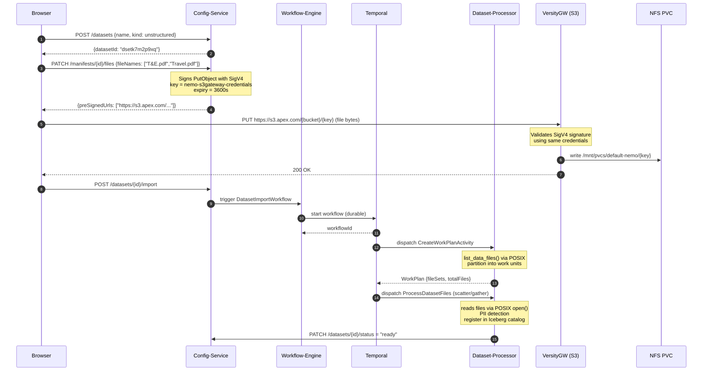
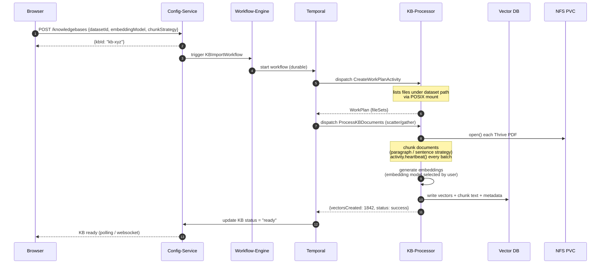
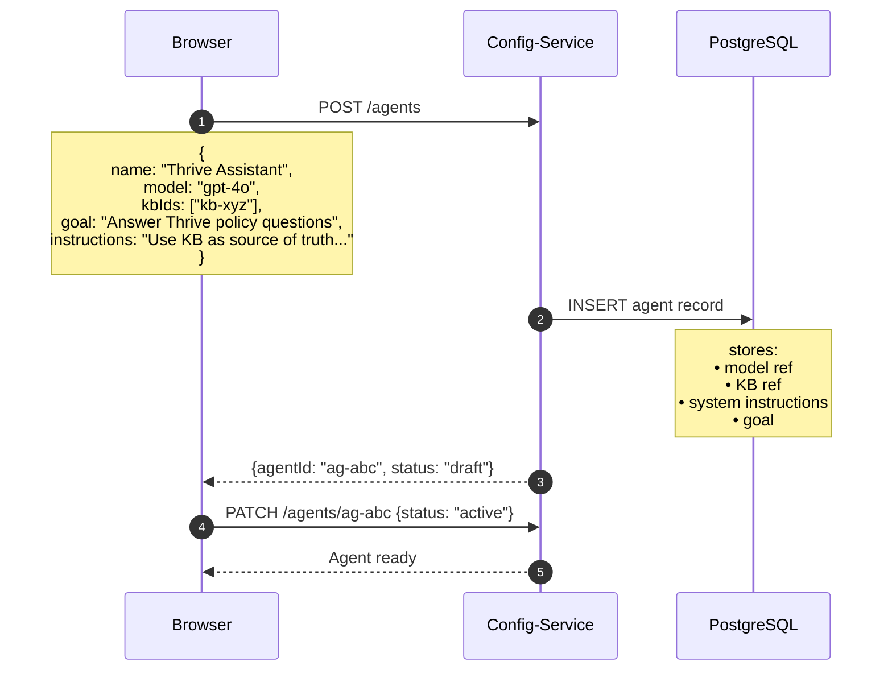
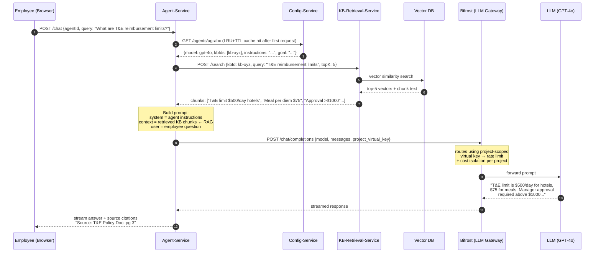
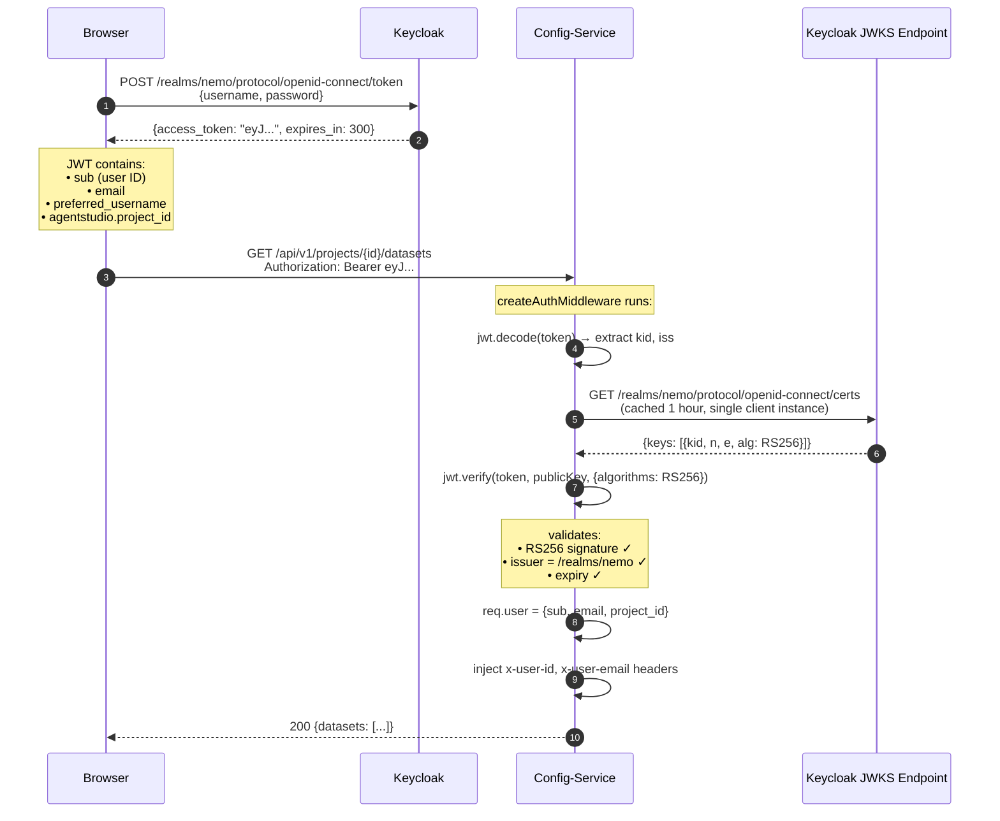
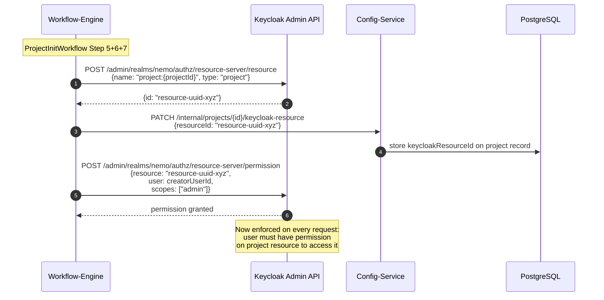

# AgentStudio — Sequence Diagrams

> All mermaid `sequenceDiagram` blocks from the architecture deep dive, extracted for quick reference.

## 1. Document Upload Flow

---

## 2. Knowledge Base Creation

---

## 3. Agent Creation

---

## 4. Inference Phase (RAG Query)

---

## 5. JWT Auth Flow

---

## 6. Keycloak Resource Authorization

