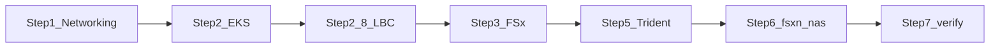

# AgentStudio on AWS: complete manual runbook

End-to-end guide to stand up AgentStudio infrastructure on AWS — VPC, EKS, FSx for NetApp ONTAP (Trident), and AWS Load Balancer Controller.

**Related repo docs:**

- [Trident storage configuration](../storage/README.md) · [deployments/storage/README.md](../../deployments/storage/README.md)
- [configure-ontap-storage.sh](../../scripts/configure-ontap-storage.sh) — FSxN backend + StorageClass
- [edge/values-eks.yaml](../../deployments/helm/edge/values-eks.yaml) — internet-facing Istio Gateway NLB (EIP annotations); requires [AWS Load Balancer Controller (§2.8)](#28-aws-load-balancer-controller-kube-system) in `kube-system`
- [deploy-eks.yml](../../.github/workflows/deploy-eks.yml) — GitHub Actions deployment workflow reference
- Azure Trident analogue: [setup-anf-trident.sh](../../scripts/setup-anf-trident.sh)

---

## Overview

| Step | What you create                                         | Console / CLI                                                |
| ---- | ------------------------------------------------------- | ------------------------------------------------------------ |
| 1    | VPC, subnets, IGW, NAT, tags                            | VPC, EC2 or [networking.sh](../../deployments/aws/scripts/networking.sh) |
| 2    | EKS cluster, node group (or Auto Mode), OIDC, IAM roles | IAM, EKS                                                     |
| 2.8  | AWS Load Balancer Controller (IRSA) in `kube-system`    | IAM, Helm                                                    |
| 3    | Secrets Manager, FSx ONTAP file system + SVM, node IAM  | Secrets Manager, FSx, IAM                                    |
| 5    | Trident CSI operator                                    | EKS / Helm locally                                           |
| 6    | TridentBackendConfig + `fsxn-nas` StorageClass          | Terminal (`make` or script)                                  |
| 7    | Verify backend                                          | Terminal (`kubectl`)                                         |
| 8    | Reserved for application deployment (not covered here)  | —                                                            |

**Storage (FSx ONTAP + Trident only):**

- **Step 3** — FSx **file system + SVM** (platform).
- **Step 6** — creates Kubernetes **StorageClass** `fsxn-nas`. Application charts consume this class through their PVCs.
- Steps 1–7 in this runbook cover one-time infrastructure and storage bootstrap only.




---

## Prerequisites

- AWS account access via **IAM Identity Center (SSO)** or an approved admin role. Org SCPs may block IAM **user** policy attachment; use SSO roles instead of long-lived IAM users.
- Tools on your workstation: `aws` CLI v2, `kubectl`, `helm`, `make`, `docker` (or `podman`), `dig`, `openssl` (optional)
- Clone this repository for Steps 1–7

### Variables (set once, reuse every step)

Edit placeholders to match your environment:

```bash
export AWS_REGION=us-east-1
export CLUSTER_NAME=agentstudio-eks
export K8S_VERSION=1.33   # pick from describe-cluster-versions (see Step 2.3); 1.29 is not offered in most regions

# Step 1 — CIDR plan (required before deployments/aws/scripts/networking.sh; example /22 layout):
#   VPC_CIDR=10.1.0.0/22
#   VPC_NAME=agentstudio-vpc
#   PUBLIC_1_CIDR=10.1.0.0/26
#   PUBLIC_2_CIDR=10.1.0.64/26
#   PRIVATE_SUBNET_1_CIDR=10.1.1.0/24
#   PRIVATE_SUBNET_2_CIDR=10.1.2.0/24
#   FSX_SUBNET_CIDR=10.1.3.0/24
# Uses the CIDR exports defined in "Variables (set once, reuse every step)".

# Networking (Step 1) — subnet IDs from eval "$(./deployments/aws/scripts/networking.sh)" or console
export VPC_ID=
export PRIVATE_SUBNET_1=   # AZ-a private — EKS nodes only
export PRIVATE_SUBNET_2=   # AZ-b private — EKS nodes only
export FSX_SUBNET_ID=      # Dedicated private subnet for FSx — NOT an EKS node subnet

# FSx / Trident (Steps 3, 6)
export FSX_SVM_NAME=fsx_svm1
export ONTAP_SVM=fsx_svm1
export FSX_SECRET_NAME=agentstudio-fsxn-admin   # no slash if using Secrets Manager + awsarn
export FSX_STORAGE_GIB=1024
export FSX_THROUGHPUT_CAPACITY=384   # MB/s; minimum 384 for SINGLE_AZ_2 in most regions

# Deployment variables are intentionally omitted in this one-time infrastructure runbook.
```

Confirm FSx ONTAP is available in your region:

```bash
aws fsx describe-file-system-types --region "$AWS_REGION" \
  --query "FileSystemTypes[?Type==\`ONTAP\`].StorageType"
```

---

## Step 1 — Networking

### What to create


| Resource              | Typical count         | Purpose                                |
| --------------------- | --------------------- | -------------------------------------- |
| VPC                   | 1                     | Isolated network                       |
| Public subnets        | 2 (2 AZs) or 1 (lab)  | NAT gateway, **public load balancers** |
| Private subnets (EKS) | 2 (2 AZs)             | EKS managed node group                 |
| Private subnet (FSx)  | 1                     | FSx for ONTAP ENIs only                |
| Internet Gateway      | 1                     | Public subnet internet                 |
| NAT Gateway           | 1 (dev) or 2 (HA)     | Outbound internet from private subnets |
| Route tables          | 1 public + 1+ private | Route `0.0.0.0/0` appropriately        |


### Console: VPC

1. **VPC** → **Create VPC** → **VPC and more** (or create VPC then subnets manually).
2. Name: e.g. `agentstudio-vpc`.
3. IPv4 CIDR: choose a block large enough for three `/24` privates + two `/26` publics (example: `/22` such as `10.1.0.0/22`; avoid `/23` with `/25` EKS subnets — see below).
4. **2 Availability Zones**, 2 public + **3 private** subnets (2 for EKS, 1 dedicated for FSx).
5. Create NAT gateway in public subnets (one NAT is enough for dev).
6. Note IDs: **VPC ID**, **private subnet IDs**, **public subnet IDs**, and **real CIDR** for each.

### CLI: recommended `/22` layout (after Step 0)

Set `VPC_CIDR` and the subnet `*_CIDR` vars from your IPAM before running [networking.sh](../../deployments/aws/scripts/networking.sh). Example layout inside one `/22` VPC block:

```
# Example:
#   VPC_CIDR=10.1.0.0/22
#   PUBLIC_1_CIDR=10.1.0.0/26   PUBLIC_2_CIDR=10.1.0.64/26
#   PRIVATE_SUBNET_1_CIDR=10.1.1.0/24   PRIVATE_SUBNET_2_CIDR=10.1.2.0/24
#   FSX_SUBNET_CIDR=10.1.3.0/24
```


| Subnet       | Variable / mask                 | Use                            |
| ------------ | ------------------------------- | ------------------------------ |
| public AZ-a  | `PUBLIC_1_CIDR` (`/26`)         | NAT, public LB                 |
| public AZ-b  | `PUBLIC_2_CIDR` (`/26`)         | public LB (2 AZ)               |
| private AZ-a | `PRIVATE_SUBNET_1_CIDR` (`/24`) | EKS nodes (`PRIVATE_SUBNET_1`) |
| private AZ-b | `PRIVATE_SUBNET_2_CIDR` (`/24`) | EKS nodes (`PRIVATE_SUBNET_2`) |
| private AZ-a | `FSX_SUBNET_CIDR` (`/24`)       | FSx only (`FSX_SUBNET_ID`)     |


If NetApp IPAM assigns a different block, set `VPC_CIDR` and the `*_CIDR` vars before running the script.

> **Note:** `[networking.sh](../../deployments/aws/scripts/networking.sh)` is **not idempotent** — each run creates a new VPC, subnets, internet gateway, and NAT gateway. Run it **once per cluster** (or build the layout manually in the console). Re-running without teardown leaves duplicate AWS resources and conflicting CIDR allocations.

```bash
# Example CIDR plan (set yours from IPAM — see table above):
# export VPC_CIDR=10.1.0.0/22
# export VPC_NAME=agentstudio-vpc
# export PUBLIC_1_CIDR=10.1.0.0/26
# export PUBLIC_2_CIDR=10.1.0.64/26
# export PRIVATE_SUBNET_1_CIDR=10.1.1.0/24
# export PRIVATE_SUBNET_2_CIDR=10.1.2.0/24
# export FSX_SUBNET_CIDR=10.1.3.0/24
# Uses the CIDR exports defined in "Variables (set once, reuse every step)".

chmod +x deployments/aws/scripts/networking.sh
eval "$(./deployments/aws/scripts/networking.sh)"

# Confirm free IPs (each should show AvailableIPs well above 16)
for s in "$PRIVATE_SUBNET_1" "$PRIVATE_SUBNET_2" "$FSX_SUBNET_ID"; do
  aws ec2 describe-subnets --region "$AWS_REGION" --subnet-ids "$s" \
    --query 'Subnets[0].{SubnetId:SubnetId,CIDR:CidrBlock,AZ:AvailabilityZone,AvailableIPs:AvailableIpAddressCount}' \
    --output table
done
```

Record the printed `export` lines — they match the [Variables](#variables-set-once-reuse-every-step) block above.

### EKS vs FSx subnets (do not share a small subnet)

**EKS and FSx must not share the same private subnet** when that subnet is small (e.g. `/27` or `/28`).


| Consumer          | Why it needs IP addresses                                                                                                                                                                               |
| ----------------- | ------------------------------------------------------------------------------------------------------------------------------------------------------------------------------------------------------- |
| **EKS nodes**     | Each worker gets a primary ENI; the **vpc-cni** add-on pre-allocates **secondary IPs** on that ENI for pod networking. Three `m5.xlarge` nodes in a `/27` subnet (~27 usable IPs) can exhaust the pool. |
| **FSx for ONTAP** | File-system creation attaches **multiple ENIs** in the subnet you select. If **AvailableIpAddressCount** is 0, create fails with: *"The selected subnet does not have any available IP addresses."*     |


**Recommended layout (production or lab):**


| Subnet             | Typical size      | Use                                                      |
| ------------------ | ----------------- | -------------------------------------------------------- |
| `PRIVATE_SUBNET_1` | `/24` per AZ      | EKS node group (AZ-a)                                    |
| `PRIVATE_SUBNET_2` | `/24` per AZ      | EKS node group (AZ-b)                                    |
| `FSX_SUBNET_ID`    | `/24` (dedicated) | FSx ONTAP only — same VPC, **different subnet** from EKS |


FSx does **not** need to be in the same AZ as every EKS node; it must reach nodes over the VPC (NFS + TCP 443). Pick any private subnet with **enough free IPs** (check before create).

**Minimum sizes:** AWS requires at least a **`/28`** subnet for FSx ONTAP; in practice use a **`/24`** dedicated to FSx. EKS private subnets should also be **`/24` or larger** per AZ.

**Verify free IPs before FSx create:**

```bash
aws ec2 describe-subnets --region "$AWS_REGION" \
  --subnet-ids "$FSX_SUBNET_ID" \
  --query 'Subnets[0].{SubnetId:SubnetId,CIDR:CidrBlock,AZ:AvailabilityZone,AvailableIPs:AvailableIpAddressCount}' \
  --output table
```

Require **AvailableIPs ≥ 16** (more is safer). If the only free subnet is an EKS node subnet, add a secondary VPC CIDR and a new `/24` for FSx instead of colocating.

**Do not use `/23` + `/25` for AgentStudio** — EKS reports **`InsufficientFreeAddresses`** once control-plane ENIs, nodes, and **`vpc-cni`** warm IPs fill the pool. Prefer a **`/22` VPC with three `/24` privates** (CLI script above) instead of patching subnets.

### Subnet tags (required for EKS load balancers)

For each **private** subnet used by EKS:


| Key                               | Value |
| --------------------------------- | ----- |
| `kubernetes.io/role/internal-elb` | `1`   |


For each **public** subnet (required for internet-facing gateway LB — AKS-style laptop access):


| Key                      | Value |
| ------------------------ | ----- |
| `kubernetes.io/role/elb` | `1`   |


Also tag subnets with `kubernetes.io/cluster/${CLUSTER_NAME}=shared` or `owned` (EKS requirement).

**Console:** VPC → Subnets → select subnet → **Tags** → Add tag.

### Step 1 checklist

- VPC, public + private subnets, IGW, NAT, route tables
- **Separate** EKS subnets (`PRIVATE_SUBNET_1/2`) and FSx subnet (`FSX_SUBNET_ID`); record **real CIDRs**
- Private EKS subnets tagged `kubernetes.io/role/internal-elb=1`
- Public subnets tagged `kubernetes.io/role/elb=1` (for public gateway)
- `FSX_SUBNET_ID` has **AvailableIPs ≥ 16** before Step 3.3
- `VPC_ID`, `PRIVATE_SUBNET_1/2`, `FSX_SUBNET_ID`, `PRIVATE_SUBNET_*_CIDR` recorded

---

## Step 2 — EKS cluster

### 2.1 IAM — cluster role

**Console:** IAM → **Roles** → **Create role** → **AWS service** → **EKS** → **EKS - Cluster** → attach **AmazonEKSClusterPolicy** → name `${CLUSTER_NAME}-cluster-role`.

**CLI:**

```bash
cat > /tmp/trust-eks-cluster.json <<'EOF'
{
  "Version": "2012-10-17",
  "Statement": [{
    "Effect": "Allow",
    "Principal": { "Service": "eks.amazonaws.com" },
    "Action": "sts:AssumeRole"
  }]
}
EOF

aws iam create-role --role-name "${CLUSTER_NAME}-cluster-role" \
  --assume-role-policy-document file:///tmp/trust-eks-cluster.json

aws iam attach-role-policy --role-name "${CLUSTER_NAME}-cluster-role" \
  --policy-arn arn:aws:iam::aws:policy/AmazonEKSClusterPolicy

export CLUSTER_ROLE_ARN=$(aws iam get-role --role-name "${CLUSTER_NAME}-cluster-role" \
  --query Role.Arn --output text)
```

**Important:** Managed policy ARNs use a **slash**: `arn:aws:iam::aws:policy/AmazonEKSClusterPolicy` — not `...policy:AmazonEKSClusterPolicy`.

### 2.2 IAM — node (worker) role

**Console:** IAM → **Roles** → **Create role** → **AWS service** → **EC2** → attach:

- AmazonEKSWorkerNodePolicy
- AmazonEKS_CNI_Policy
- AmazonEC2ContainerRegistryReadOnly

Name: `${CLUSTER_NAME}-node-role`.

**CLI:**

```bash
cat > /tmp/trust-ec2.json <<'EOF'
{
  "Version": "2012-10-17",
  "Statement": [{
    "Effect": "Allow",
    "Principal": { "Service": "ec2.amazonaws.com" },
    "Action": "sts:AssumeRole"
  }]
}
EOF

aws iam create-role --role-name "${CLUSTER_NAME}-node-role" \
  --assume-role-policy-document file:///tmp/trust-ec2.json

aws iam attach-role-policy --role-name "${CLUSTER_NAME}-node-role" \
  --policy-arn arn:aws:iam::aws:policy/AmazonEKSWorkerNodePolicy
aws iam attach-role-policy --role-name "${CLUSTER_NAME}-node-role" \
  --policy-arn arn:aws:iam::aws:policy/AmazonEKS_CNI_Policy
aws iam attach-role-policy --role-name "${CLUSTER_NAME}-node-role" \
  --policy-arn arn:aws:iam::aws:policy/AmazonEC2ContainerRegistryReadOnly

export NODE_ROLE_NAME="${CLUSTER_NAME}-node-role"
export NODE_ROLE_ARN=$(aws iam get-role --role-name "$NODE_ROLE_NAME" \
  --query Role.Arn --output text)
```

### 2.3 Create EKS cluster

**Console:** **Amazon EKS** → **Clusters** → **Create cluster**:

1. Name = `CLUSTER_NAME`, Kubernetes version supported in region.
2. Enable cluster creator admin (or plan access entries).
3. Select `VPC_ID`, **private subnets** `PRIVATE_SUBNET_1` and `PRIVATE_SUBNET_2`; enable **public API endpoint** if you need kubectl from outside the VPC.
4. Cluster IAM role: `${CLUSTER_NAME}-cluster-role`.
5. Wait until status **Active** (~10–15 minutes).

**CLI:**

```bash
# Pick a supported control plane version (STANDARD_SUPPORT or EXTENDED_SUPPORT)
aws eks describe-cluster-versions --region "$AWS_REGION" \
  --query 'clusterVersions[?status==`STANDARD_SUPPORT` || status==`EXTENDED_SUPPORT`].{version:clusterVersion,status:status}' \
  --output table

export AWS_PAGER=""

aws eks create-cluster --region "$AWS_REGION" --name "$CLUSTER_NAME" \
  --kubernetes-version "$K8S_VERSION" \
  --role-arn "$CLUSTER_ROLE_ARN" \
  --resources-vpc-config "subnetIds=${PRIVATE_SUBNET_1},${PRIVATE_SUBNET_2},endpointPublicAccess=true,endpointPrivateAccess=true" \
  --access-config authenticationMode=API_AND_CONFIG_MAP,bootstrapClusterCreatorAdminPermissions=true \
  --no-cli-pager

aws eks wait cluster-active --region "$AWS_REGION" --name "$CLUSTER_NAME"
```

### 2.4 EKS add-ons

**Order matters:** install **`vpc-cni`** before the node group ([2.6](#26-worker-compute-managed-node-group-or-eks-auto-mode)) so nodes get a CNI when they join. Install **`kube-proxy`** and **`coredns`** after at least one node is **Ready** — those add-ons schedule pods on workers; with zero nodes the add-on status stays **`DEGRADED`** and `aws eks wait addon-active` fails even though `create-addon` succeeded.

**Console:** EKS → cluster → **Add-ons** → install `vpc-cni` first, create the node group, then install `kube-proxy` and `coredns`.

**CLI helper** (install one add-on and optionally wait):

```bash
eks_install_addon() {
  local ADDON_NAME="$1"
  local WAIT="${2:-true}"   # pass "false" to create without waiting

  local ADDON_VERSION
  ADDON_VERSION=$(aws eks describe-addon-versions \
    --region "$AWS_REGION" \
    --addon-name "$ADDON_NAME" \
    --kubernetes-version "$K8S_VERSION" \
    --query 'addons[0].addonVersions[?compatibilities[?defaultVersion==`true`]].addonVersion | [0]' \
    --output text)

  echo "Installing ${ADDON_NAME}@${ADDON_VERSION} ..."
  aws eks create-addon \
    --region "$AWS_REGION" \
    --cluster-name "$CLUSTER_NAME" \
    --addon-name "$ADDON_NAME" \
    --addon-version "$ADDON_VERSION" \
    --resolve-conflicts OVERWRITE \
    --no-cli-pager 2>/dev/null || true

  if [ "$WAIT" = "true" ]; then
    aws eks wait addon-active \
      --region "$AWS_REGION" \
      --cluster-name "$CLUSTER_NAME" \
      --addon-name "$ADDON_NAME"
  fi
}
```

**Phase A — before node group (vpc-cni only):**

```bash
export AWS_PAGER=""

aws eks list-addons --region "$AWS_REGION" --cluster-name "$CLUSTER_NAME"

for ADDON_NAME in vpc-cni; do
  echo "=== $ADDON_NAME ==="
  aws eks describe-addon-versions \
    --region "$AWS_REGION" \
    --addon-name "$ADDON_NAME" \
    --kubernetes-version "$K8S_VERSION" \
    --query 'addons[0].addonVersions[?compatibilities[?defaultVersion==`true`]].{version:addonVersion}' \
    --output table
done

eks_install_addon vpc-cni true
```

Continue to [2.6](#26-worker-compute-managed-node-group-or-eks-auto-mode) and wait until nodes are **Ready**.

**Phase B — after node group is active (kube-proxy, coredns):**

```bash
aws eks update-kubeconfig --region "$AWS_REGION" --name "$CLUSTER_NAME"
kubectl get nodes   # expect Ready

for ADDON_NAME in kube-proxy coredns; do
  echo "=== $ADDON_NAME ==="
  aws eks describe-addon-versions \
    --region "$AWS_REGION" \
    --addon-name "$ADDON_NAME" \
    --kubernetes-version "$K8S_VERSION" \
    --query 'addons[0].addonVersions[?compatibilities[?defaultVersion==`true`]].{version:addonVersion}' \
    --output table
done

eks_install_addon kube-proxy true
eks_install_addon coredns true

# Confirm
for ADDON_NAME in vpc-cni kube-proxy coredns; do
  aws eks describe-addon \
    --region "$AWS_REGION" \
    --cluster-name "$CLUSTER_NAME" \
    --addon-name "$ADDON_NAME" \
    --query 'addon.{name:addonName,version:addonVersion,status:status,health:health.issues}' \
    --output table
done
kubectl get pods -n kube-system -l k8s-app=kube-dns
```

### 2.5 OIDC identity provider (for IRSA later)

```bash
export OIDC_ISSUER=$(aws eks describe-cluster --region "$AWS_REGION" --name "$CLUSTER_NAME" \
  --query 'cluster.identity.oidc.issuer' --output text)
echo "$OIDC_ISSUER"

aws iam create-open-id-connect-provider \
  --url "$OIDC_ISSUER" \
  --client-id-list sts.amazonaws.com \
  --thumbprint-list 9e99a48a9960b14926bb7f3b02e22da2b0ab7280
```

If the provider already exists, note its ARN from IAM → Identity providers.

### 2.6 Worker compute (managed node group or EKS Auto Mode)

> **EKS Auto Mode:** If the cluster was created with **EKS Auto Mode** (`computeConfig.enabled: true`), **do not** add a traditional managed node group. Auto Mode provisions nodes from `general-purpose` / `system` node pools when you schedule pods. Managed node groups on Auto Mode clusters can fail to join (node name mismatch). Skip to [2.7](#27-configure-kubectl).

**Console (traditional cluster only):** EKS → cluster → **Compute** → **Add node group**:

- Name: e.g. `agentstudio-ng-1`
- Node IAM role: `${CLUSTER_NAME}-node-role`
- Subnets: **private** subnets only
- Instance type: e.g. `m5.xlarge` (or `t3.xlarge` for dev)
- Desired: 3, min: 2, max: 5
- Disk: 100 GiB
- AMI: **Amazon Linux 2023** for Kubernetes **1.33+**; AL2 only for **1.32 and earlier**

**CLI (traditional cluster; AL2023 for K8s 1.33+):**

```bash
aws eks create-nodegroup --region "$AWS_REGION" \
  --cluster-name "$CLUSTER_NAME" \
  --nodegroup-name "${CLUSTER_NAME}-ng-1" \
  --subnets "$PRIVATE_SUBNET_1" "$PRIVATE_SUBNET_2" \
  --instance-types m5.xlarge \
  --ami-type AL2023_x86_64_STANDARD \
  --scaling-config minSize=2,maxSize=5,desiredSize=3 \
  --disk-size 100 \
  --node-role "$NODE_ROLE_ARN"

aws eks wait nodegroup-active --region "$AWS_REGION" \
  --cluster-name "$CLUSTER_NAME" --nodegroup-name "${CLUSTER_NAME}-ng-1"
```

### 2.7 Configure kubectl

```bash
aws eks update-kubeconfig --region "$AWS_REGION" --name "$CLUSTER_NAME"
kubectl get nodes
kubectl get pods -n kube-system
```

All nodes should be **Ready**.

### 2.8 AWS Load Balancer Controller (`kube-system`)

Required for internet-facing NLB provisioning when the edge tier uses [edge/values-eks.yaml](../../deployments/helm/edge/values-eks.yaml) (Istio Gateway `loadBalancerClass: service.k8s.aws/nlb`).

**Prerequisites:**

- [Step 2.5](#25-oidc-identity-provider-for-irsa-later) — OIDC provider associated with the cluster
- [Step 1](#step-1--networking) — at least one **public** subnet tagged `kubernetes.io/role/elb=1` and `kubernetes.io/cluster/${CLUSTER_NAME}=shared|owned`
- `kubectl` context pointed at the cluster ([2.7](#27-configure-kubectl))

The controller runs in **`kube-system`**. It watches `Service` objects with `loadBalancerClass: service.k8s.aws/nlb` and provisions AWS NLBs/ALBs.

#### 2.8.1 IAM policy

Download the current upstream IAM policy (LBC v2.13+ needs `elasticloadbalancing:DescribeListenerAttributes` and related actions — an older policy causes `AccessDenied` after IRSA is fixed):

```bash
export AWS_ACCOUNT_ID=$(aws sts get-caller-identity --query Account --output text)
export LBC_POLICY_NAME=AWSLoadBalancerControllerIAMPolicy

curl -sL https://raw.githubusercontent.com/kubernetes-sigs/aws-load-balancer-controller/v2.13.0/docs/install/iam_policy.json \
  -o /tmp/lbc-iam-policy.json

aws iam create-policy --policy-name "$LBC_POLICY_NAME" \
  --policy-document file:///tmp/lbc-iam-policy.json 2>/dev/null || \
  aws iam create-policy-version \
    --policy-arn "arn:aws:iam::${AWS_ACCOUNT_ID}:policy/${LBC_POLICY_NAME}" \
    --policy-document file:///tmp/lbc-iam-policy.json \
    --set-as-default

export LBC_POLICY_ARN="arn:aws:iam::${AWS_ACCOUNT_ID}:policy/${LBC_POLICY_NAME}"
```

#### 2.8.2 IAM role (IRSA)

Trust policy must match **this cluster’s** OIDC issuer and the controller ServiceAccount `system:serviceaccount:kube-system:aws-load-balancer-controller`:

```bash
export LBC_ROLE_NAME=AmazonEKSLoadBalancerControllerRole
export OIDC_PROVIDER=$(echo "$OIDC_ISSUER" | sed 's|https://||')

cat > /tmp/lbc-trust-policy.json <<EOF
{
  "Version": "2012-10-17",
  "Statement": [{
    "Effect": "Allow",
    "Principal": {
      "Federated": "arn:aws:iam::${AWS_ACCOUNT_ID}:oidc-provider/${OIDC_PROVIDER}"
    },
    "Action": "sts:AssumeRoleWithWebIdentity",
    "Condition": {
      "StringEquals": {
        "${OIDC_PROVIDER}:aud": "sts.amazonaws.com",
        "${OIDC_PROVIDER}:sub": "system:serviceaccount:kube-system:aws-load-balancer-controller"
      }
    }
  }]
}
EOF

aws iam create-role --role-name "$LBC_ROLE_NAME" \
  --assume-role-policy-document file:///tmp/lbc-trust-policy.json 2>/dev/null || \
aws iam update-assume-role-policy --role-name "$LBC_ROLE_NAME" \
  --policy-document file:///tmp/lbc-trust-policy.json

aws iam attach-role-policy --role-name "$LBC_ROLE_NAME" \
  --policy-arn "$LBC_POLICY_ARN" 2>/dev/null || true

export LBC_ROLE_ARN=$(aws iam get-role --role-name "$LBC_ROLE_NAME" --query Role.Arn --output text)
echo "LBC_ROLE_ARN=$LBC_ROLE_ARN"
```

#### 2.8.3 Helm install (namespace `kube-system`)

```bash
helm repo add eks https://aws.github.io/eks-charts
helm repo update eks

helm upgrade --install aws-load-balancer-controller eks/aws-load-balancer-controller \
  --namespace kube-system \
  --create-namespace \
  --set clusterName="$CLUSTER_NAME" \
  --set region="$AWS_REGION" \
  --set vpcId="$VPC_ID" \
  --set serviceAccount.create=true \
  --set serviceAccount.name=aws-load-balancer-controller \
  --set serviceAccount.annotations."eks\.amazonaws\.com/role-arn"="$LBC_ROLE_ARN" \
  --set rbac.create=true \
  --wait --timeout 5m

kubectl get deployment -n kube-system aws-load-balancer-controller
kubectl get pods -n kube-system -l app.kubernetes.io/name=aws-load-balancer-controller
```

#### 2.8.4 Verify IRSA and RBAC

New pods must mount a web-identity token (`AWS_WEB_IDENTITY_TOKEN_FILE`). If the ServiceAccount was created or annotated **after** the Deployment started, restart the controller:

```bash
kubectl rollout restart deployment/aws-load-balancer-controller -n kube-system
kubectl rollout status deployment/aws-load-balancer-controller -n kube-system --timeout=120s

POD=$(kubectl get pod -n kube-system -l app.kubernetes.io/name=aws-load-balancer-controller \
  -o jsonpath='{.items[0].metadata.name}')
kubectl get pod -n kube-system "$POD" -o yaml | grep -E 'AWS_ROLE_ARN|AWS_WEB_IDENTITY_TOKEN_FILE|sts.amazonaws.com'

kubectl auth can-i list customresourcedefinitions \
  --as=system:serviceaccount:kube-system:aws-load-balancer-controller
# expect: yes
```

Verification (infra-only — no application tiers required):

```bash
kubectl get deployment -n kube-system aws-load-balancer-controller
kubectl get pods -n kube-system -l app.kubernetes.io/name=aws-load-balancer-controller
kubectl logs -n kube-system deployment/aws-load-balancer-controller --tail=30
```

Optional — after deploying the **edge** tier (`make helm-edge-upgrade-eks` or full `deploy-eks`), confirm the Istio Gateway NLB:

```bash
kubectl get svc -n agentstudio-edge istio-gateway

export GW_HOST=$(kubectl get svc -n agentstudio-edge istio-gateway \
  -o jsonpath='{.status.loadBalancer.ingress[0].hostname}')
echo "$GW_HOST"
dig +short "$GW_HOST"

aws elbv2 describe-load-balancers --region "$AWS_REGION" \
  --query "LoadBalancers[?DNSName=='$GW_HOST'].{Scheme:Scheme,State:State.Code}" \
  --output table
```

When that service exists, target groups should show **healthy** pod IPs (`target-type: ip` from `edge/values-eks.yaml`).

### Step 2 checklist

- Cluster **Active**
- Add-ons **Active**
- Nodes **Ready** (or Auto Mode pools ready)
- OIDC provider exists ([2.5](#25-oidc-identity-provider-for-irsa-later))
- **AWS Load Balancer Controller** Running in `kube-system` (if using `edge/values-eks.yaml`)
- `CLUSTER_ROLE_ARN`, `NODE_ROLE_ARN`, `OIDC_ISSUER`, `NODE_ROLE_NAME`, `LBC_ROLE_ARN` recorded

---

## Step 3 — FSx for NetApp ONTAP (platform storage)

### 3.0 What you will create


| #   | AWS resource           | Purpose                                       |
| --- | ---------------------- | --------------------------------------------- |
| 1   | Secrets Manager secret | FSx ONTAP admin creds for Trident             |
| 2   | Security group         | NFS + management API from EKS nodes to FSx    |
| 3   | FSx file system        | `ONTAP` type, `SINGLE_AZ_2` typical for dev   |
| 4   | FSx SVM                | Trident `ONTAP_SVM`                           |
| 5   | IAM on node role       | FSx read + secret read (Secrets Manager path) |


### 3.1 Credentials (Secrets Manager)

**SVM admin username on FSx ONTAP is `vsadmin`** (not `fsxadmin`). Password must match what Trident reads and what you pass to `--svm-admin-password` in [Step 3.4](#34-create-storage-virtual-machine-svm).

Secret name must **not** contain `/` (use `agentstudio-fsxn-admin`, not `agentstudio/fsxn-admin`).

Write credentials to a file (avoids shell `$` expansion and keeps JSON valid), then create or update the secret:

```bash
export FSX_ADMIN_PASSWORD='your-strong-password'

printf '%s' "{\"username\":\"vsadmin\",\"password\":\"${FSX_ADMIN_PASSWORD}\"}" > /tmp/fsxn-secret.json

aws secretsmanager create-secret --region "$AWS_REGION" \
  --name "$FSX_SECRET_NAME" \
  --description "FSx ONTAP SVM admin for Trident" \
  --secret-string file:///tmp/fsxn-secret.json 2>/dev/null || \
aws secretsmanager put-secret-value --region "$AWS_REGION" \
  --secret-id "$FSX_SECRET_NAME" \
  --secret-string file:///tmp/fsxn-secret.json

rm -f /tmp/fsxn-secret.json

export FSXN_CREDENTIALS_ARN=$(aws secretsmanager describe-secret --region "$AWS_REGION" \
  --secret-id "$FSX_SECRET_NAME" --query ARN --output text)
echo "$FSXN_CREDENTIALS_ARN"
```

Use with [Step 6](#step-6--configure-fsxn-backend-and-storageclass) (Secrets Manager + EKS Pod Identity).

### 3.2 Security group for FSx

Allow NFS **and TCP 443** (Trident management API to SVM management LIF) from **real EKS node subnet CIDRs** (`PRIVATE_SUBNET_1_CIDR` and `PRIVATE_SUBNET_2_CIDR`). FSx can live in a third subnet; ingress is from **where nodes run**, not from the FSx subnet itself.

```bash
export FSX_SG_ID=$(aws ec2 create-security-group --region "$AWS_REGION" \
  --group-name "${CLUSTER_NAME}-fsx" \
  --description "FSx ONTAP NFS from EKS nodes" \
  --vpc-id "$VPC_ID" \
  --query GroupId --output text)

# NFS + portmapper + ONTAP management API (Trident needs TCP 443 to SVM management LIF)
for CIDR in "$PRIVATE_SUBNET_1_CIDR" "$PRIVATE_SUBNET_2_CIDR"; do
  for PORT in 111 635 2049 4045 4046 443; do
    aws ec2 authorize-security-group-ingress --region "$AWS_REGION" \
      --group-id "$FSX_SG_ID" \
      --protocol tcp --port "$PORT" \
      --cidr "$CIDR" 2>/dev/null || echo "  (exists) $PORT from $CIDR"
  done
done
# Lab shortcut: --cidr "$VPC_CIDR" instead of per-subnet loops
echo "FSX_SG_ID=$FSX_SG_ID"
```

**Wrong CIDR (EKS node subnet CIDR that does not match your actual private subnets) causes Trident timeout to the management LIF.**

```bash
export SVM_MGMT_IP=   # SVM management LIF — example: 10.1.x.x; not file-system cluster IP

NODE=$(kubectl get pods -n trident -l app=controller -o jsonpath='{.items[0].spec.nodeName}')
kubectl run nettest-fsx --rm -i --restart=Never --image=nicolaka/netshoot \
  --overrides="{\"spec\":{\"nodeName\":\"$NODE\"}}" -- \
  sh -c "timeout 5 bash -c 'echo >/dev/tcp/$SVM_MGMT_IP/443' && echo OK || echo FAIL"
```

### 3.3 Create FSx ONTAP file system

Use **`FSX_SUBNET_ID`** — the **dedicated FSx private subnet** from [Step 1](#eks-vs-fsx-subnets-do-not-share-a-small-subnet), not a subnet where EKS nodes run.

**Console:** **Amazon FSx** → **Create file system** → **Amazon FSx for NetApp ONTAP** → Single-AZ → capacity/throughput → VPC + `FSX_SUBNET_ID` + `FSX_SG_ID`.

**CLI:**

```bash
# Pre-check: subnet must have free IPs (see Step 1)
aws ec2 describe-subnets --region "$AWS_REGION" \
  --subnet-ids "$FSX_SUBNET_ID" \
  --query 'Subnets[0].{SubnetId:SubnetId,CIDR:CidrBlock,AvailableIPs:AvailableIpAddressCount}' \
  --output table

aws fsx create-file-system --region "$AWS_REGION" \
  --file-system-type ONTAP \
  --storage-capacity "$FSX_STORAGE_GIB" \
  --subnet-ids "$FSX_SUBNET_ID" \
  --security-group-ids "$FSX_SG_ID" \
  --tags Key=Name,Value="${CLUSTER_NAME}-fsx" \
  --ontap-configuration "{
    \"DeploymentType\": \"SINGLE_AZ_2\",
    \"ThroughputCapacity\": ${FSX_THROUGHPUT_CAPACITY},
    \"PreferredSubnetId\": \"${FSX_SUBNET_ID}\"
  }"

export FSX_FILESYSTEM_ID=fs-xxxxxxxx   # from output

watch -n 30 "aws fsx describe-file-systems --region $AWS_REGION \
  --file-system-ids $FSX_FILESYSTEM_ID --query 'FileSystems[0].Lifecycle' --output text"
```

Wait until lifecycle **AVAILABLE** (often 15–30+ minutes).

### 3.4 Create storage virtual machine (SVM)

Use the **same** `FSX_ADMIN_PASSWORD` everywhere (SVM create, [Step 3.1](#31-credentials-secrets-manager) secret, [Step 6](#step-6--configure-fsxn-backend-and-storageclass) SVM sync). Quote passwords that contain `$` (e.g. `'vana$$123'`).

**CLI:**

```bash
# Reuse FSX_ADMIN_PASSWORD from Step 3.1.

aws fsx create-storage-virtual-machine --region "$AWS_REGION" \
  --file-system-id "$FSX_FILESYSTEM_ID" \
  --name "$FSX_SVM_NAME" \
  --svm-admin-password "$FSX_ADMIN_PASSWORD" \
  --root-volume-security-style UNIX

export ONTAP_SVM="$FSX_SVM_NAME"

aws fsx describe-storage-virtual-machines --region "$AWS_REGION" \
  --filters Name=file-system-id,Values="$FSX_FILESYSTEM_ID" \
  --query 'StorageVirtualMachines[*].{Name:Name,Lifecycle:Lifecycle}' --output table
```

### 3.5 Credentials for Trident (Step 6)

Use **one** password string everywhere: `export FSX_ADMIN_PASSWORD='...'` at SVM create (Step 3.4), in the Secrets Manager secret ([Step 3.1](#31-credentials-secrets-manager)), and when syncing the SVM in [Step 6](#step-6--configure-fsxn-backend-and-storageclass).

> **Shell `$` pitfall:** In bash, `vana$$123` in **double quotes** becomes `vana$<pid>123`. Use **single quotes** (`'vana$$123'`) or write JSON via `printf` to a file ([Step 3.1](#31-credentials-secrets-manager)) so the SVM password and Secrets Manager secret match exactly.

Trident reads credentials via **Secrets Manager + EKS Pod Identity** ([Step 6](#step-6--configure-fsxn-backend-and-storageclass)). Node IAM role alone is **not** enough.

### 3.6 FSx SG fix (if Trident times out to management LIF)

Symptom: `Post "https://<SVM_MGMT_IP>/...": context deadline exceeded`

```bash
for CIDR in "$PRIVATE_SUBNET_1_CIDR" "$PRIVATE_SUBNET_2_CIDR"; do   # replace with your real EKS node subnet CIDRs
  for PORT in 443 111 2049 4045 4046; do
    aws ec2 authorize-security-group-ingress --region "$AWS_REGION" \
      --group-id "$FSX_SG_ID" --protocol tcp --port "$PORT" --cidr "$CIDR" \
      2>/dev/null || true
  done
done
```

### Step 3 checklist

- FSx file system **AVAILABLE**
- SVM created (`ONTAP_SVM`)
- FSx SG allows **443** + NFS from **real** node subnet CIDRs
- Secrets Manager secret created; `FSXN_CREDENTIALS_ARN` recorded
- TCP test to `$SVM_MGMT_IP:443` from a pod → **OK**

---

## Step 5 — Install Trident on EKS

From a machine with `helm` and `kubectl` pointed at the cluster:

```bash
helm repo add netapp-trident https://netapp.github.io/trident-helm-chart
helm repo update netapp-trident

kubectl create namespace trident 2>/dev/null || true

helm upgrade --install trident netapp-trident/trident-operator \
  --namespace trident \
  --version 100.2410.0 \
  --wait --timeout 10m

kubectl get crd tridentbackendconfigs.trident.netapp.io
kubectl get pods -n trident
```

### Step 5 checklist

- Trident operator pods **Running**
- CRD `tridentbackendconfigs.trident.netapp.io` exists

---

## Step 6 — Configure FSxN backend and StorageClass

From the **AgentStudio repository root**. This step creates the StorageClass consumed by application PVCs.

Creates:

- `TridentBackendConfig` **`fsxn-nas-backend`** in namespace `trident`
- StorageClass **`fsxn-nas`** (provisioner `csi.trident.netapp.io`)

Uses [Secrets Manager](#31-credentials-secrets-manager) + **EKS Pod Identity** for Trident credentials. This matches [NetApp’s FSx backend docs](https://docs.netapp.com/us-en/trident/trident-use/trident-fsx-storage-backend.html): `aws.fsxFilesystemID` + `credentials.type: awsarn`.

**1) Secrets Manager secret** — if not already created in [Step 3.1](#31-credentials-secrets-manager), run the same `printf` + `create-secret` / `put-secret-value` block there. Then keep the SVM password in sync:

```bash
# Uses FSXN_CREDENTIALS_ARN from Step 3.1.

export FSX_SVM_ID=$(aws fsx describe-storage-virtual-machines --region "$AWS_REGION" \
  --filters "Name=file-system-id,Values=${FSX_FILESYSTEM_ID}" \
  --query "StorageVirtualMachines[?Name==\`${ONTAP_SVM}\`].StorageVirtualMachineId | [0]" --output text)

# Keep SVM password in sync with FSX_ADMIN_PASSWORD / the secret
aws fsx update-storage-virtual-machine --region "$AWS_REGION" \
  --storage-virtual-machine-id "$FSX_SVM_ID" \
  --svm-admin-password "$FSX_ADMIN_PASSWORD"
```

**2) EKS Pod Identity agent** (required; once per cluster):

```bash
aws eks create-addon --region "$AWS_REGION" \
  --cluster-name "$CLUSTER_NAME" \
  --addon-name eks-pod-identity-agent \
  --resolve-conflicts OVERWRITE

aws eks wait addon-active --region "$AWS_REGION" \
  --cluster-name "$CLUSTER_NAME" --addon-name eks-pod-identity-agent
```

**3) IAM role + association** for `trident/trident-controller`:

```bash
cat > /tmp/trident-pod-id-trust.json <<'EOF'
{
  "Version": "2012-10-17",
  "Statement": [{
    "Effect": "Allow",
    "Principal": { "Service": "pods.eks.amazonaws.com" },
    "Action": ["sts:AssumeRole", "sts:TagSession"]
  }]
}
EOF

aws iam create-role --role-name "${CLUSTER_NAME}-trident-fsx-pod-id" \
  --assume-role-policy-document file:///tmp/trident-pod-id-trust.json 2>/dev/null || true

aws iam attach-role-policy --role-name "${CLUSTER_NAME}-trident-fsx-pod-id" \
  --policy-arn arn:aws:iam::aws:policy/AmazonFSxReadOnlyAccess

cat > /tmp/trident-fsxn-secret-policy.json <<EOF
{
  "Version": "2012-10-17",
  "Statement": [{
    "Effect": "Allow",
    "Action": ["secretsmanager:GetSecretValue", "secretsmanager:DescribeSecret"],
    "Resource": "${FSXN_CREDENTIALS_ARN}"
  }]
}
EOF

aws iam put-role-policy --role-name "${CLUSTER_NAME}-trident-fsx-pod-id" \
  --policy-name fsxn-secret-read \
  --policy-document file:///tmp/trident-fsxn-secret-policy.json

export TRIDENT_POD_ID_ROLE_ARN=$(aws iam get-role --role-name "${CLUSTER_NAME}-trident-fsx-pod-id" \
  --query Role.Arn --output text)

aws eks create-pod-identity-association --region "$AWS_REGION" \
  --cluster-name "$CLUSTER_NAME" \
  --namespace trident \
  --service-account trident-controller \
  --role-arn "$TRIDENT_POD_ID_ROLE_ARN"

kubectl rollout restart deployment trident-controller -n trident
kubectl rollout status deployment trident-controller -n trident --timeout=120s
```

**4) Create backend** (credentials only via ARN — no `ONTAP_PASSWORD` on `make`):

```bash
cd /path/to/AgentStudio

kubectl delete tridentbackendconfig fsxn-nas-backend -n trident --ignore-not-found
kubectl delete tridentbackend fsxn-nas-backend -n trident --ignore-not-found

make configure-ontap-storage \
  BACKEND_TYPE=fsxn \
  FSX_FILESYSTEM_ID="$FSX_FILESYSTEM_ID" \
  ONTAP_SVM="$ONTAP_SVM" \
  FSXN_CREDENTIALS_ARN="$FSXN_CREDENTIALS_ARN" \
  ONTAP_STORAGE_TYPES=nas \
  TRIDENT_INSTALL=0 \
  TRIDENT_NAMESPACE=trident
```

**5) Verify** (`STATUS` = **Success**; spec has `aws.fsxFilesystemID` + `credentials.type: awsarn`):

```bash
kubectl get tridentbackendconfig fsxn-nas-backend -n trident -o wide
```


| Symptom                           | Fix                                                                                                                                              |
| --------------------------------- | ------------------------------------------------------------------------------------------------------------------------------------------------ |
| `i/o timeout` to `169.254.170.23` | Install `eks-pod-identity-agent` addon; create pod identity association; restart `trident-controller`                                            |
| `401 Unauthorized`                | `FSX_ADMIN_PASSWORD` must match SVM `--svm-admin-password`; fix `$` quoting (Step 3.5); `aws fsx update-storage-virtual-machine` + update secret |
| `backend credentials not found`   | Wrong ARN or Pod Identity role missing `secretsmanager:GetSecretValue`                                                                           |


**Retry after fixing SG or credentials:**

```bash
kubectl delete tridentbackendconfig fsxn-nas-backend -n trident --ignore-not-found
# re-run make configure-ontap-storage (Step 6)
```

**Helm overlay:** set `storageClass: "fsxn-nas"` in each tier's `values-eks.yaml` overlay (e.g. [database/values-eks.yaml](../../deployments/helm/database/values-eks.yaml), [services/values-eks.yaml](../../deployments/helm/services/values-eks.yaml)).

**Alternative** (same script, no Make):

```bash
BACKEND_TYPE=fsxn \
FSX_FILESYSTEM_ID="$FSX_FILESYSTEM_ID" \
ONTAP_SVM="$ONTAP_SVM" \
FSXN_CREDENTIALS_ARN="$FSXN_CREDENTIALS_ARN" \
ONTAP_STORAGE_TYPES=nas \
TRIDENT_INSTALL=0 \
bash scripts/configure-ontap-storage.sh
```

### Step 6 checklist

- `kubectl get storageclass fsxn-nas` shows the class
- Backend config applied

---

## Step 7 — Verify storage

```bash
for i in $(seq 1 24); do
  kubectl get tridentbackendconfig fsxn-nas-backend -n trident \
    -o jsonpath='{.status.lastOperationStatus}{"\n"}' 2>/dev/null || echo "missing"
  sleep 10
done

kubectl get tridentbackendconfig -n trident -o wide
kubectl describe tridentbackendconfig fsxn-nas-backend -n trident
kubectl get storageclass fsxn-nas
```

### Step 7 checklist

- `lastOperationStatus` = **Success**
- `fsxn-nas` StorageClass present

---

## Storage on AWS (FSx ONTAP + Trident)

AgentStudio persistent data lives in **Kubernetes PersistentVolumeClaims**. On this runbook path, every PVC is backed by **Amazon FSx for NetApp ONTAP** via Trident and StorageClass **`fsxn-nas`**:


| Property      | FSx ONTAP + Trident (`fsxn-nas`)                     |
| ------------- | ---------------------------------------------------- |
| AWS backing   | Managed NetApp ONTAP file service                    |
| Access mode   | **ReadWriteMany** (shared NFS)                       |
| Provisioning  | Trident creates a volume per PVC at deploy time      |
| Runbook steps | Steps 3, 5–7                                         |


Final storage confirmation:

```bash
kubectl get storageclass fsxn-nas
kubectl get tridentbackendconfig fsxn-nas-backend -n trident -o wide
```

---

## Values to record (handoff)


| Name                    | Example                                                      | Used by                                           |
| ----------------------- | ------------------------------------------------------------ | ------------------------------------------------- |
| `VPC_ID`                | `vpc-...`                                                    | EKS, FSx                                          |
| `PRIVATE_SUBNET_1/2`    | `subnet-...`                                                 | EKS nodes (managed node group)                    |
| `FSX_SUBNET_ID`         | `subnet-...` (≠ EKS subnets)                                 | FSx ONTAP ENIs only                               |
| `PRIVATE_SUBNET_1_CIDR` | `/24` (EKS AZ-a)                                             | FSx SG ingress (EKS AZ-a)                         |
| `PRIVATE_SUBNET_2_CIDR` | `/24` (EKS AZ-b)                                             | FSx SG ingress (EKS AZ-b)                         |
| `FSX_SUBNET_CIDR`       | `/24` (dedicated FSx subnet)                                 | FSx subnet (for planning; not used in SG ingress) |
| `CLUSTER_NAME`          | `agentstudio-eks`                                            | EKS, kubectl                                      |
| `CLUSTER_ROLE_ARN`      | `arn:aws:iam::...:role/...-cluster-role`                     | EKS                                               |
| `NODE_ROLE_NAME`        | `agentstudio-eks-node-role`                                  | Node group IAM role name                          |
| `NODE_ROLE_ARN`         | `arn:aws:iam::...:role/...-node-role`                        | Nodes, Trident                                    |
| `OIDC_ISSUER`           | `https://oidc.eks...`                                        | IRSA                                              |
| `LBC_ROLE_ARN`          | `arn:aws:iam::...:role/AmazonEKSLoadBalancerControllerRole`  | AWS Load Balancer Controller (§2.8)               |
| `LBC_POLICY_ARN`        | `arn:aws:iam::...:policy/AWSLoadBalancerControllerIAMPolicy` | AWS Load Balancer Controller (§2.8)               |
| `FSX_FILESYSTEM_ID`     | `fs-...`                                                     | Trident                                           |
| `ONTAP_SVM`             | `fsx_svm1`                                                   | Trident                                           |
| `FSXN_CREDENTIALS_ARN`  | `arn:aws:secretsmanager:...`                                 | Trident                                           |


---

## Optional next steps


| Item                                                                            | When                                                         |
| ------------------------------------------------------------------------------- | ------------------------------------------------------------ |
| Route53 hosted zone + wildcard DNS                                              | Replace `/etc/hosts` for team access                         |
| `CERT_MANAGER_GATEWAY_TLS=1`                                                    | Real domain TLS                                              |
| App Secrets Manager secrets                                                     | Before production Helm                                       |
| EKS OIDC + IRSA per service                                                     | App pods reading secrets                                     |
| [Additional instance runbook](./aws-agentstudio-additional-instance-runbook.md) | Second EKS cluster reusing ECR + GitHub OIDC                 |
| CloudFormation under `deployments/aws/`                                         | Codify manual steps                                          |
| `scripts/setup-fsx-trident.sh`                                                  | Planned wrapper for Steps 5–7                                |


