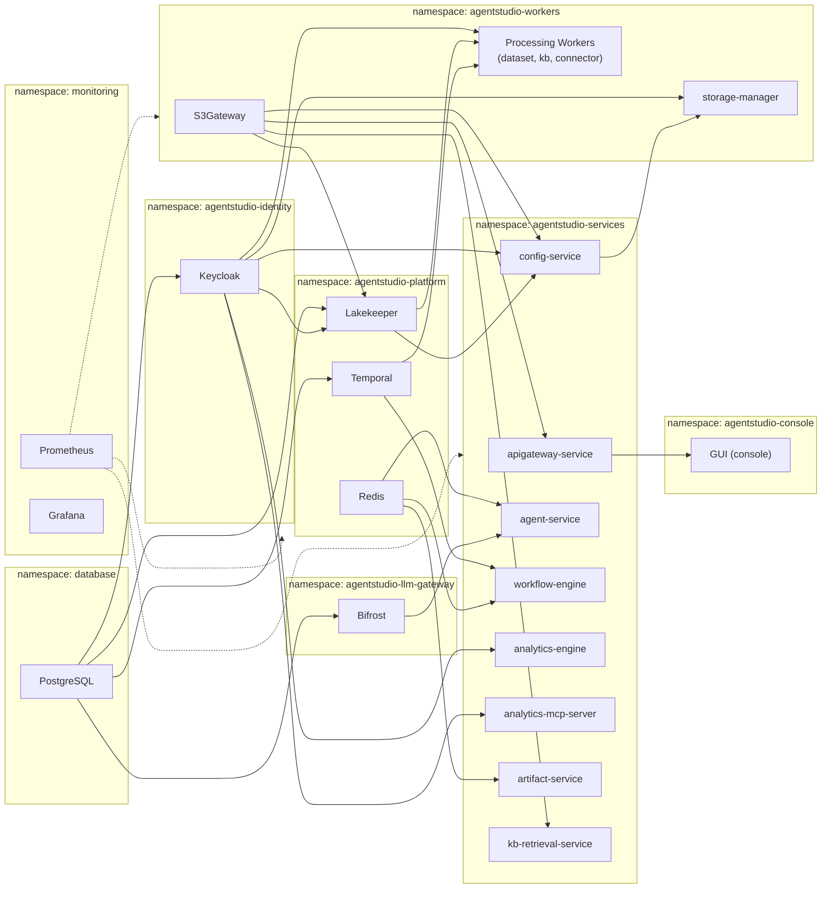

# Deployment Design

This document is the single source of truth for the AgentStudio deployment architecture, Makefile targets, and operational procedures.

## Overview

AgentStudio deploys to Kubernetes via per-tier Helm releases, each in its own namespace.

**Target audience**: Developers deploying locally (KIND, minikube) and CI/CD pipelines.

## Architecture



| Helm Release     | Namespace                  | Chart Path                          | Key Resources                                          |
| ---------------- | -------------------------- | ----------------------------------- | ------------------------------------------------------ |
| `database`       | `database`                 | `deployments/helm/database`         | PostgreSQL StatefulSet (Bitnami)                        |
| `identity`       | `agentstudio-identity`     | `deployments/helm/identity`         | Keycloak                                               |
| `platform`       | `agentstudio-platform`     | `deployments/helm/platform`         | Redis, Temporal, Lakekeeper + Lakekeeper hook jobs      |
| `llm-gateway`    | `agentstudio-llm-gateway`  | `deployments/helm/llm-gateway`      | Bifrost LLM gateway                                    |
| `services`       | `agentstudio-services`     | `deployments/helm/services`         | 8 app microservices (apigateway, config, agents, workflow, analytics, analytics-mcp, artifact, kb-retrieval), Gateway HTTPRoutes |
| `workers`        | `agentstudio-workers`      | `deployments/helm/workers`          | Processing workers (dataset, KB, connector), S3Gateway, storage-manager |
| `console`        | `agentstudio-console`      | `deployments/helm/console`          | GUI (React)                                            |
| `observability`  | `monitoring`               | `deployments/helm/observability`    | Prometheus, Grafana                                    |

## Deployment Phases

All phases are idempotent and safe to re-run. The order below matches the actual execution order of `make deploy-all-tiers-aks` (`database → identity → workers → platform → llm-gateway → services → console`).

| Phase | Name           | Makefile Target                   | Release       | Deploys                                                | Prerequisites         |
| ----- | -------------- | --------------------------------- | ------------- | ------------------------------------------------------ | --------------------- |
| 0     | Observability  | `deploy-observability`            | observability | Prometheus, Grafana                                    | None                  |
| 1     | Foundation     | `deploy-foundation`               | database      | Gateway API CRDs + NGF, PostgreSQL                     | None                  |
| 2     | Identity       | `deploy-identity`                 | identity      | Keycloak                                               | Phase 1               |
| 3     | Workers        | `helm-workers-upgrade-aks`        | workers       | Processing workers, S3Gateway, storage-manager         | Phase 1               |
| 4     | Platform Infra | `helm-platform-upgrade-aks`       | platform      | Redis, Temporal, Lakekeeper + Lakekeeper hook jobs     | Phase 2 + Phase 3     |
| 5     | LLM Gateway    | `helm-llm-gateway-upgrade-aks`    | llm-gateway   | Bifrost                                                | Phase 1               |
| 6     | App Services   | `helm-services-upgrade-aks`       | services      | API Gateway, Config, agents, etc.                      | Phase 4 + Phase 5     |
| 7     | Console        | `helm-console-upgrade-aks`        | console       | GUI                                                    | Phase 6               |

## Makefile Targets Reference

### Canonical Deployment Targets

```bash
# Full AKS deployment (all tiers in order)
make deploy-all-tiers-aks

# Full GKE deployment (derives auth hostname from ENDPOINT)
make deploy-gke ENDPOINT=studio.example.com IMAGE_TAG=v2.1.0 CONTAINER_IMAGE_REPO=<repo>

# Full local deployment (KIND / Docker Desktop / k3d / minikube)
make deploy-local

# Individual phases (in deployment order)
make deploy-observability          # Phase 0: Prometheus + Grafana (optional)
make deploy-foundation             # Phase 1: Gateway API + PostgreSQL
make deploy-identity               # Phase 2: Keycloak
make helm-workers-upgrade-aks      # Phase 3: workers + S3Gateway
make helm-platform-upgrade-aks     # Phase 4: Redis, Temporal, Lakekeeper
make helm-llm-gateway-upgrade-aks  # Phase 5: LLM gateway (Bifrost)
make helm-services-upgrade-aks     # Phase 6: application services
make helm-console-upgrade-aks      # Phase 7: console (GUI)
```

### Supported Variables

| Variable               | Default                                 | Description                                      |
| ---------------------- | --------------------------------------- | ------------------------------------------------ |
| `IMAGE_TAG`            | (none)                                  | Override image tag for project-built services    |
| `FORCE_PULL`           | (unset)                                 | Set to `1` to force `imagePullPolicy=Always`    |
| `CONTAINER_IMAGE_REPO` | `docker.repo.eng.netapp.com/user/$USER` | Container registry repository base               |
| `GHCR_PAT`             | (none)                                  | GitHub Personal Access Token for GHCR            |
| `HELM_EXTRA_ARGS`      | (empty)                                 | Additional Helm arguments forwarded to all tiers |
| `ENDPOINT`             | `agentstudio.local`                     | Domain for TLS certs and all subdomains          |
| `HELM_NS_*`            | see Makefile                            | Per-tier namespace overrides                     |

### Usage Examples

```bash
# Full AKS deployment
make deploy-all-tiers-aks IMAGE_TAG=v2.1.0

# Full GKE deployment (derive auth hostname from ENDPOINT)
make deploy-gke ENDPOINT=studio.example.com IMAGE_TAG=v2.1.0 CONTAINER_IMAGE_REPO=<repo>

# Full GKE deployment (explicit auth hostname)
make deploy-gke ENDPOINT=studio.example.com KEYCLOAK_HOSTNAME=https://auth.studio.example.com:8443 \
  IMAGE_TAG=v2.1.0 CONTAINER_IMAGE_REPO=<repo>

# GKE automated deploy via config file (provisions infra + deploys)
scripts/gcp-deploy.sh --all

# Deploy with forced image pull (AKS)
make deploy-all-tiers-aks IMAGE_TAG=v2.1.0 FORCE_PULL=1

# Deploy from GHCR
make deploy-all-tiers-aks CONTAINER_IMAGE_REPO=ghcr.io/myorg/agentstudio GHCR_PAT=ghp_xxx

# Local deploy
make deploy-local CONTAINER_IMAGE_REPO=docker.repo.eng.netapp.com/user/me
```

### Utility Targets

| Target                       | Purpose                                              |
| ---------------------------- | ---------------------------------------------------- |
| `helm-database-upgrade`      | Upgrade database chart                               |
| `helm-wait-keycloak`         | Wait for Keycloak readiness                          |
| `helm-wait-database`         | Wait for PostgreSQL readiness                        |
| `helm-database-status`       | Check database release status                        |
| `helm-observability-upgrade` | Upgrade observability stack                          |
| `helm-tier-template-aks`     | Smoke-test all AKS tier charts (no cluster contact)  |
| `helm-tier-template-local`   | Smoke-test all local tier charts                     |
| `helm-tier-namespaces`       | Create all AKS tier namespaces (idempotent)          |

## GHCR Credential Flow

When `CONTAINER_IMAGE_REPO` starts with `ghcr.io`, a 3-stage credential flow activates:

```
┌─────────────────────┐     ┌─────────────────────┐     ┌──────────────────────────┐
│ Stage 1: Pre-Helm   │     │ Stage 2: Helm       │     │ Stage 3: Post-Helm       │
│ setup_ghcr_secret   │────▶│ --set imagePull...   │────▶│ setup_ghcr_credentials   │
│ (creates K8s secret)│     │ (pods reference it)  │     │ _post (patches all SAs)  │
└─────────────────────┘     └─────────────────────┘     └──────────────────────────┘
```

1. **Pre-Helm**: `setup_ghcr_secret` creates a `docker-registry` Secret named `gh-regcred` in the target namespace.
2. **Helm**: tier upgrade targets add `--set global.imagePullSecrets[0].name=gh-regcred` so pods/jobs reference the pull secret.
3. **Post-Helm**: `setup_ghcr_credentials_post` patches all ServiceAccounts in the namespace with `imagePullSecrets: gh-regcred`.

All three stages are implemented in `scripts/helm-common.sh`.

## Helm Hooks

| Job Name                        | Chart    | Type                       | Weight | Delete Policy                        | Idempotent | Purpose                              |
| ------------------------------- | -------- | -------------------------- | ------ | ------------------------------------ | ---------- | ------------------------------------ |
| `platform-lakekeeper-db-init`   | platform | pre-install, pre-upgrade   | -5     | before-hook-creation, hook-succeeded | Yes        | Create Lakekeeper DB if not exists   |
| `platform-lakekeeper-bootstrap` | platform | post-install, post-upgrade | 10     | before-hook-creation, hook-succeeded | Yes        | Accept EULA, create default warehouse |
| `workers-s3-bucket-init`        | workers  | post-install, post-upgrade | 4      | before-hook-creation, hook-succeeded | Yes        | Create default S3 bucket in S3Gateway |

## Failure Recovery

Each tier is independently re-runnable because:

- `helm upgrade --install` is idempotent (no-op when no changes detected)
- All hooks have `before-hook-creation` delete policy
- All hooks are idempotent (guard checks for existing resources)
- StatefulSet PVCs survive any failure scenario

### Failure Scenarios

| Phase   | Failure Scenario                      | State After Failure                                         | Resume Action                                                    |
| ------- | ------------------------------------- | ----------------------------------------------------------- | ---------------------------------------------------------------- |
| Phase 1 | PostgreSQL pod fails to start         | Release `failed`; PVC exists, data intact                  | Fix values, run `make deploy-foundation`                         |
| Phase 1 | Gateway CRD install fails             | Partial CRDs installed                                     | Run `make deploy-foundation` (idempotent)                        |
| Phase 2 | Keycloak fails (bad config)           | Release `failed`; PVC exists                               | Fix config, run `make deploy-identity`                           |
| Phase 3 | S3Gateway bucket-init hook fails      | Release `failed`; hook job pod in `Error` state            | Inspect pod logs, fix, run `make helm-workers-upgrade-aks`       |
| Phase 4 | Hook job fails                        | Release `failed`; hook job pod in `Error` state            | Inspect pod logs, fix, run `make helm-platform-upgrade-aks`      |
| Phase 4 | Lakekeeper fails to connect to PG     | Lakekeeper pod in `CrashLoopBackOff`                       | Check PG connectivity, re-run `make helm-platform-upgrade-aks`   |
| Phase 6 | App service image pull fails          | Deployment pod in `ImagePullBackOff`                       | Fix image tag/registry, re-run `make helm-services-upgrade-aks`  |

## Data Safety

### StatefulSet PVC Behavior

- **PVCs survive pod deletion**: `volumeClaimTemplates` PVCs are managed by the StatefulSet controller. Deleting the pod, StatefulSet, or even `helm uninstall` does NOT delete the PVC.
- **PVCs survive failed upgrades**: A failed `helm upgrade` marks the release as "failed" but does not touch existing PVCs.
- **No `--atomic` flag**: We deliberately avoid `--atomic` because it would auto-delete newly created resources on failure, including PVCs on first install.
- **PVCs are not deleted by helm uninstall**: Remove them manually if a clean slate is needed.

## Observability Integration

### Automatic Detection

The `deploy-foundation` target auto-detects the Prometheus Operator CRDs and enables PostgreSQL metrics if present:

```bash
kubectl get crd servicemonitors.monitoring.coreos.com
```

### Manual Overlay

ServiceMonitors in each tier chart are controlled by the `serviceMonitor.enabled` Helm value (defaults vary by chart). Pass `--set` flags via `HELM_EXTRA_ARGS` to enable them per tier:

```bash
# Enable ServiceMonitors on the services tier
make helm-services-upgrade-aks \
  HELM_EXTRA_ARGS="--set global.serviceMonitor.enabled=true"

# Enable ServiceMonitors on the platform tier (Temporal, Lakekeeper)
make helm-platform-upgrade-aks \
  HELM_EXTRA_ARGS="--set temporal.serviceMonitor.enabled=true"

# Enable ServiceMonitors on the workers tier
make helm-workers-upgrade-aks \
  HELM_EXTRA_ARGS="--set global.serviceMonitor.enabled=true"
```

## Removed Targets

The following targets have been removed. Use the replacements:

| Removed Target          | Replacement                                      |
| ----------------------- | ------------------------------------------------ |
| `deploy-all`            | `deploy-all-tiers-aks` / `deploy-local`          |
| `deploy-aks`            | `deploy-all-tiers-aks`                           |
| `deploy-platform-deps`  | `helm-platform-upgrade-aks`                      |
| `deploy-platform`       | `helm-services-upgrade-aks` + `helm-console-upgrade-aks` |
| `undeploy-all`          | `helm uninstall` each tier, or `undeploy-local`  |
| `helm-nemo-uninstall`   | `helm uninstall` the individual tier release     |
| `helm-nemo-template`    | `helm-tier-template-aks` / `helm-tier-template-local` |
| `helm-nemo-status`      | `helm status <release> -n <namespace>`           |
| `helm-nemo-prepare`     | (inline in each tier upgrade target)             |
| `helm-deps`             | `deploy-foundation` + `deploy-identity`          |
