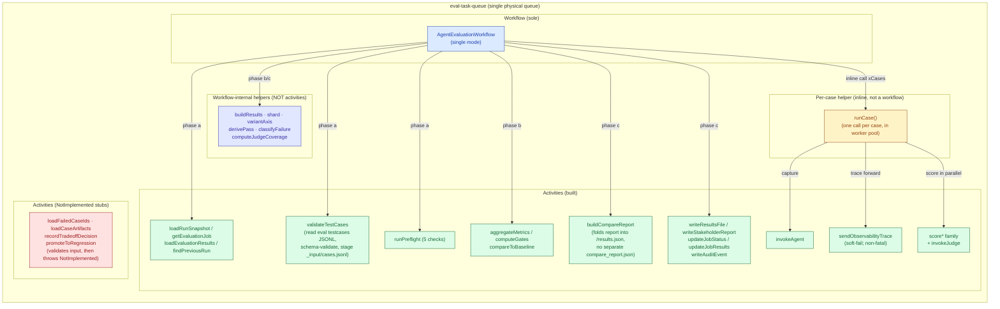
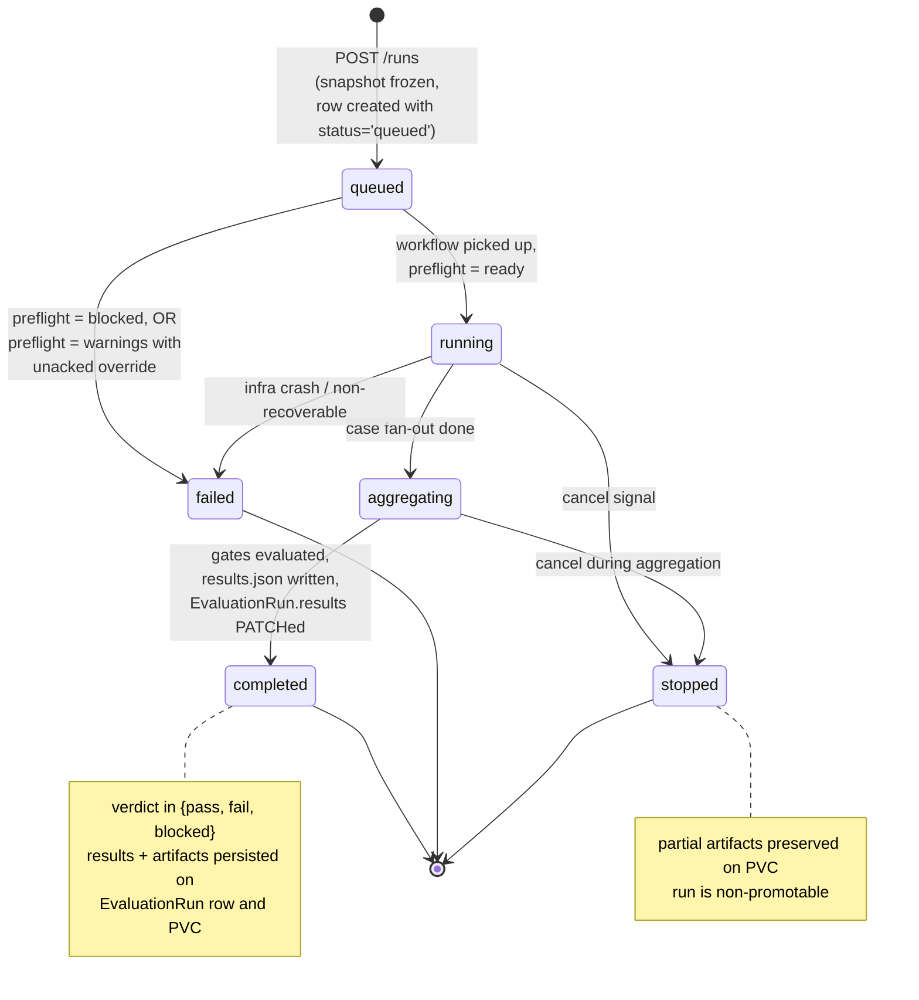
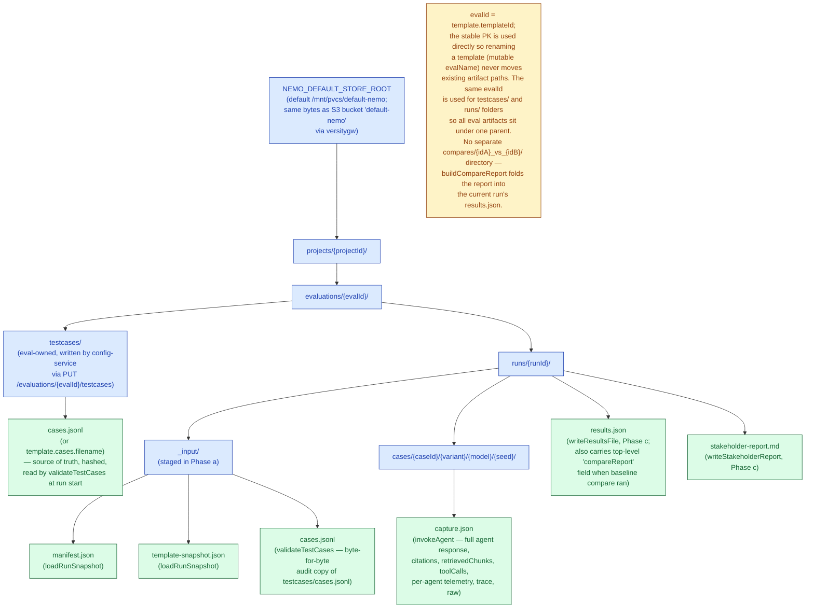
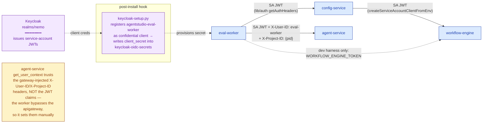
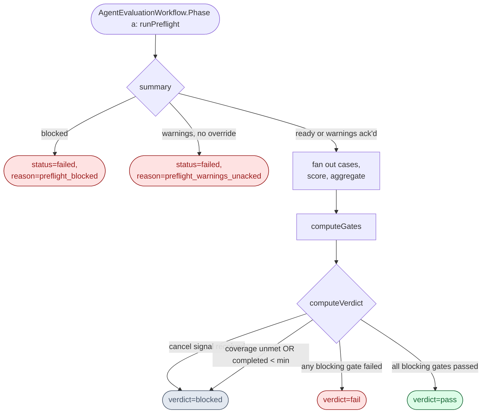
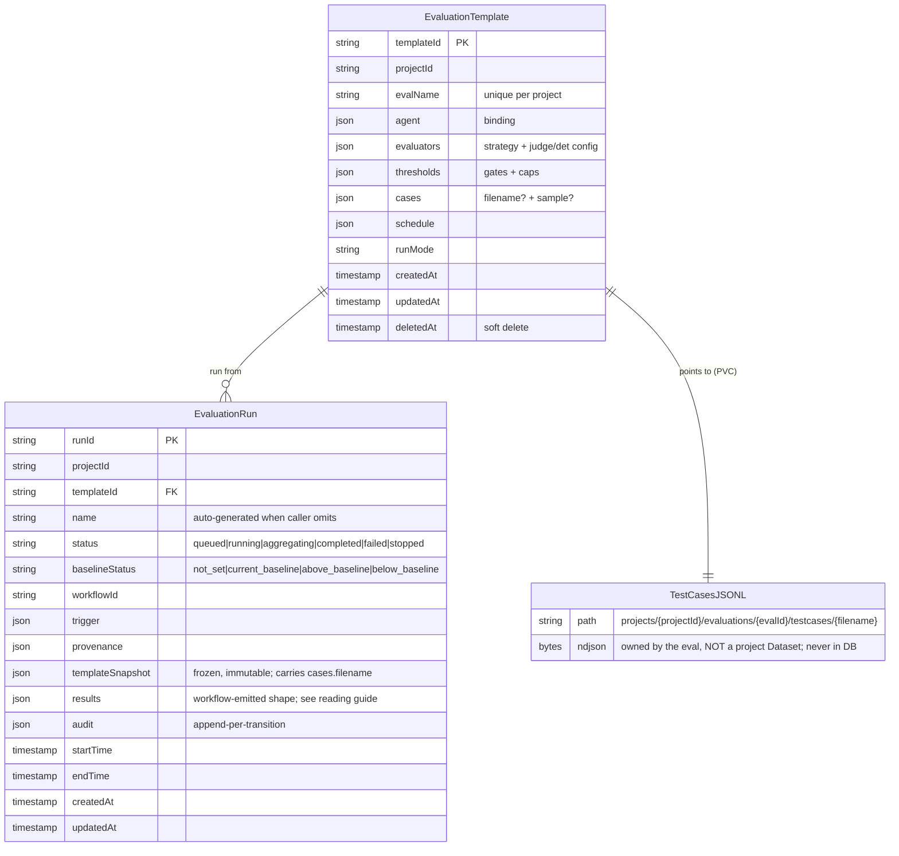

# Evaluations Backend — Architecture Diagrams (arch v3, current implementation)

**Companion to:** `eval-pipeline-end-to-end-design.md` (current implementation)
**Supersedes (for current-state):** the v1.4 target diagrams in `EVAL_BACKEND_ARCHITECTURE_DIAGRAMS.md`
**Format:** Mermaid (renders natively on GitHub, GitLab, Notion, Obsidian, VS Code preview, etc.)
**Audience:** Engineering, architecture review, onboarding.

> **Scope.** This file documents the system **as built today**: `runMode = single`,
> `strategy ∈ { deterministic, llm_judge, both }`. It deliberately diverges from the
> v1.4 *target* diagrams. The biggest current-vs-target differences:
> 1. There is a **workflow-engine** REST→Temporal bridge between config-service and Temporal — config-service does **not** call Temporal directly.
> 2. There is **no per-case persistence and no per-case child workflow**: per-case work runs inline via the `runCase()` helper inside the parent's worker pool; it returns its artifact to the parent in workflow memory; the parent emits **one** `results.json` at Phase c. No `upsertCaseRun`.
> 3. `observability-service` is **optional**. A `sendObservabilityTrace` activity exists and runs after every capture; when `OBSERVABILITY_SERVICE_URL` is set it reads the trace blob from `capture.json` and POSTs it, otherwise it returns a synthetic `traceRef` (`local:`/`missing:`/`error:` prefix). The traceId returned by `agent-service` always rides inside the capture file regardless.
> 4. Run artifacts (`results.json`, `stakeholder-report.md`) live on the **shared PVC**, not on config-service. config-service stores only the `EvaluationRun` row (`results`/`status`/`audit`); paths are computed via `runDirKey()` and not persisted.
> 5. The persisted entities are **EvaluationTemplate / EvaluationRun** (with `templateSnapshot` jsonb only) — there is **no** `EvaluationTestCase` row and **no** `casesSnapshot`. Test cases are owned by the evaluation template and live as a JSONL file on the **shared PVC** at `projects/{projectId}/evaluations/{evalId}/testcases/cases.jsonl`. The template carries only a storage pointer (`cases.filename`). Schema validation runs in `validateTestCases` at workflow start; replay determinism comes from Temporal's activity-result cache.
> 6. Regression / A/B / sweep / tuning / promotion are **not on the happy path**; several supporting activities are `NotImplemented` stubs.
> 7. Compare-report output is **folded into the current run's `results.json`** (top-level `compareReport` field) — there is **no** sibling `compares/{idA}_vs_{idB}/compare_report.json` and no cross-cutting `compares/` directory. The legacy layout was retired during the eval-owned-JSONL pivot.

| # | View | Question it answers |
|---|---|---|
| 1 | System architecture (services + integrations) | Which services exist today and how do they talk? |
| 2 | End-to-end submit-and-run flow | What happens from "user clicks Run" to "status: completed"? |
| 3 | Workflow & task-queue layout | Which workflows/activities exist on `eval-task-queue`, and which are stubs? |
| 4 | Per-case two-phase flow | What happens for ONE case from invoke to artifact-returned-to-parent? |
| 5 | Run lifecycle state machine | What states does an `EvaluationRun` traverse? |
| 6 | On-disk PVC layout | Where does each file for a run live on the shared PVC? |
| 7 | Auth (machine-to-machine) | How does each cross-service call authenticate? |
| 8 | Pre-flight + gating engine | How is a run validated (5 checks) and turned into a verdict? |
| 9 | Snapshot / immutability model | Why can't a live template edit drift an in-flight run? |
| 10 | Entity relationship diagram | What are the persisted entities and how do they connect? |

---

## 1. System architecture — services & integrations

**Purpose.** One-pager of every service the eval backend touches today, with data direction on each edge. Note the workflow-engine hop and the PVC.

```mermaid
flowchart LR
    subgraph Client["Client tier"]
        UI["GUI<br/>(Evaluations Studio)"]
    end

    subgraph ConfigSvc["config-service (dual role)"]
        direction TB
        CFG_API["API edge<br/>━━━━━━━<br/>• createRun(): snapshot template only<br/>&nbsp;&nbsp;(testcases JSONL stays on PVC)<br/>• PUT/GET/DELETE /evaluations/{evalId}/testcases<br/>• EvaluationWorkflowClient.startEvaluationRun()<br/>• GET /runs/{runId} (GUI polls)"]
        CFG_DB["Persistence<br/>━━━━━━━<br/>• EvaluationTemplate (cases.filename)<br/>• EvaluationRun (status, audit,<br/>&nbsp;&nbsp;templateSnapshot, results, artifacts)<br/>&nbsp;&nbsp;— no EvaluationTestCase row, no casesSnapshot"]
    end

    subgraph WFE["workflow-engine"]
        BRIDGE["REST to Temporal bridge<br/>━━━━━━━<br/>POST /api/v1/workflows<br/>starts on named task queue"]
    end

    subgraph TemporalCluster["Temporal cluster"]
        TC["Temporal<br/>eval-task-queue"]
    end

    subgraph EvalWorker["eval-worker (TS Temporal)"]
        WF["Workflows<br/>━━━━━━━<br/>AgentEvaluationWorkflow (sole)<br/>+ inline runCase() per case"]
        ACT["Activities<br/>(all I/O)"]
    end

    subgraph DataPlane["Invoked by activities"]
        AGENT["agent-service<br/>POST /api/v1/projects/{pid}/agents/{aid}/invoke<br/>(or /agent-teams/{team}/invoke)<br/>━━━━━━━<br/>• prompt build<br/>• retrieval + tool fan-out<br/>• synthesis"]
        GW["LLM gateway<br/>(Bifrost / Azure / …)"]
    end

    PVC[("Shared storage<br/>S3 bucket 'default-nemo' (versitygw)<br/>mounted at /mnt/pvcs/default-nemo<br/>━━━━━━━<br/>evaluations/{evalId}/testcases/cases.jsonl<br/>(eval-owned, written by config-service<br/>&nbsp;via S3 PutObject from PUT /testcases),<br/>runs/{runId}/_input/, results.json,<br/>stakeholder-report.md")]
    KC["Keycloak<br/>(service-account JWTs)"]

    UI -->|"POST …/templates/{tid}/runs"| CFG_API
    UI -->|"GET /runs/{runId} (poll)"| CFG_API
    CFG_API -->|"POST /api/v1/workflows<br/>(SA JWT)"| BRIDGE
    BRIDGE -->|"start AgentEvaluationWorkflow"| TC
    TC <-->|task polling| WF
    WF -->|proxyActivities| ACT

    ACT -->|"invokeAgent<br/>(SA JWT + X-User-ID/X-Project-ID)"| AGENT
    AGENT -->|model call| GW
    ACT -->|"PATCH results/status/artifacts,<br/>POST audit-events (SA JWT)"| CFG_DB
    ACT -->|"read testcases/cases.jsonl via fs<br/>(NEMO_DEFAULT_STORE_ROOT),<br/>stage _input/, write<br/>results.json + report"| PVC
    CFG_API -->|"PUT testcases JSONL bytes<br/>via S3 client (@aws-sdk/client-s3);<br/>updates cases.filename"| PVC

    KC -.->|issues JWT| CFG_API
    KC -.->|issues JWT| ACT
    KC -.->|issues JWT| AGENT

    classDef edge fill:#fef3c7,stroke:#92400e,color:#92400e
    classDef data fill:#dcfce7,stroke:#166534,color:#166534
    classDef worker fill:#dbeafe,stroke:#1e40af,color:#1e40af
    classDef infra fill:#f3e8ff,stroke:#6b21a8,color:#6b21a8
    class CFG_API,BRIDGE edge
    class CFG_DB,AGENT,GW data
    class WF,ACT worker
    class PVC,KC infra
```



**Reading guide.** The GUI talks to **config-service only** (submit + poll). config-service snapshots the template (only the template — *not* test-case rows) onto the `EvaluationRun` row, then calls **workflow-engine** — the thin REST→Temporal bridge — which starts `AgentEvaluationWorkflow` on `eval-task-queue`. Test cases are eval-owned JSONL files landed on shared storage at `projects/{projectId}/evaluations/{evalId}/testcases/cases.jsonl` (via `PUT /evaluations/{evalId}/testcases`); the template only stores `cases.filename`. **Two access paths to the same bytes:** config-service writes via the **S3 protocol** (`@aws-sdk/client-s3` against the `default-nemo` bucket parsed from `project.home_dir`), the eval-worker reads via **plain `fs`** against the same bucket mounted as a PVC at `NEMO_DEFAULT_STORE_ROOT` (versitygw fronts both). At workflow start the worker runs `validateTestCases`, which reads the JSONL and schema-validates each row. The worker runs the agent through `agent-service` (which fronts the LLM gateway), writes run artifacts to the shared store, and PATCHes status/results/artifacts back to config-service. The worker never writes a database directly and never calls Temporal directly. Every cross-service hop carries a Keycloak service-account JWT (dashed).

---

## 2. End-to-end submit-and-run flow

**Purpose.** The load-bearing flow: from "user clicks Run" to `status: completed`. Note the workflow-engine hop and that per-case results round-trip through Temporal, not config-service.

```mermaid
sequenceDiagram
    autonumber
    participant UI as GUI
    participant CFG as config-service
    participant WFE as workflow-engine
    participant TC as Temporal
    participant EW as AgentEvaluationWorkflow
    participant RC as runCase() (inline xN)
    participant AS as agent-service
    participant PVC as Shared PVC

    rect rgba(254, 243, 199, 0.4)
        Note over UI,WFE: Submit phase
        UI->>CFG: POST …/templates/{tid}/runs
        CFG->>CFG: createRun(): snapshot template only<br/>onto EvaluationRun.templateSnapshot<br/>(testcases JSONL stays on PVC,<br/>located via template.cases.filename)
        CFG->>WFE: POST /api/v1/workflows<br/>{AgentEvaluationWorkflow,<br/>args:[{runId, projectId}]}
        WFE->>TC: start workflow on eval-task-queue
        CFG-->>UI: 202 Accepted<br/>{runId, workflowId, status:'queued', run}
    end

    rect rgba(219, 234, 254, 0.4)
        Note over TC,PVC: Eval logic inside Temporal
        TC->>EW: dispatch workflow task

        Note over EW,PVC: Phase a
        EW->>PVC: loadRunSnapshot (stage _input/manifest.json<br/>+ template-snapshot.json, normalize)
        EW->>PVC: validateTestCases (read testcases/cases.jsonl,<br/>parse + schema-validate rows,<br/>stage _input/cases.jsonl audit copy)
        EW->>EW: runPreflight (5 checks)
        EW->>CFG: PATCH status=running (+ auditAppend)

        loop For each case (bounded worker pool)
            EW->>RC: runCase({caseId, ...}) [inline call]
            rect rgba(255, 237, 213, 0.5)
                Note over RC,AS: Phase 1 — CAPTURE (one round-trip)
                RC->>AS: invokeAgent(input, metadata.eval, overrides)
                AS-->>PVC: invokeAgent activity writes<br/>capture.json (full response,<br/>citations, retrievedChunks,<br/>toolCalls, telemetry, trace)
                AS-->>RC: {capturePath, telemetry,<br/>retrievalAnnotation,<br/>resolvedRuntimeParams}
                RC->>RC: sendObservabilityTrace<br/>(reads trace from capture.json,<br/>POSTs to observability-service<br/>when OBSERVABILITY_SERVICE_URL<br/>is set; soft-fails otherwise)
            end
            rect rgba(220, 252, 231, 0.5)
                Note over RC: Phase 2 — SCORE (pure, reads capture.json from PVC)
                RC->>RC: scoreGoldenAssertions / scoreSuiteDeterministic<br/>scoreGolden / scoreSafetyClassifier<br/>invokeJudge (if strategy ∈ {llm_judge, both})
            end
            RC-->>EW: CaseRunSummary {slot: CaseRunSlot,<br/>status, passed, failureCategory, ...}<br/>(in workflow memory)
        end

        Note over EW,CFG: Phase b
        EW->>EW: aggregateMetrics → computeGates<br/>→ buildResults → compareToBaseline (if regression)

        Note over EW,PVC: Phase c
        EW->>PVC: writeResultsFile (results.json)
        EW->>PVC: writeStakeholderReport (stakeholder-report.md)
        EW->>CFG: PATCH updateJobResults
        EW->>CFG: POST writeAuditEvent + PATCH status=completed
    end

    rect rgba(243, 232, 255, 0.4)
        Note over UI,CFG: Read phase
        UI->>CFG: GET /runs/{runId} (poll)
        CFG-->>UI: EvaluationRun {status, results, artifacts}
    end
```

**Reading guide.** Three bands: **submit** (UI → config-service → workflow-engine → Temporal — note the extra hop vs. the target diagrams), **eval logic** (Phases a/b/c inside Temporal), and **read** (GUI polls `GET /runs/{runId}` — no SSE in arch v3). Capture is exactly one call to `agent-service`; scoring is pure. The `invokeAgent` activity stages the *full* response (output, citations, retrievedChunks, toolCalls, telemetry, trace) into `capture.json` on the PVC and returns only `{capturePath, telemetry (bounded numeric), retrievalAnnotation, resolvedRuntimeParams}` to `runCase` — customer-derived data never enters Temporal event history. Between Phase 1 and Phase 2, `sendObservabilityTrace` reads the trace blob from the capture file and best-effort POSTs it to `observability-service` (soft-fails to a synthetic `traceRef` when `OBSERVABILITY_SERVICE_URL` is unset). Per-case work is dispatched by `runCase()`, an inline async helper inside the parent's worker pool — its activities (invokeAgent, sendObservabilityTrace, score*, invokeJudge) appear directly in the parent's event history with no intervening child-workflow rows. There is no per-case write to config-service. The parent accumulates the returned `CaseRunSlot`s in workflow memory and emits a single `results.json` (PVC) plus PATCHes the `EvaluationRun.results` at Phase c.

---

## 3. Workflow & task-queue layout

**Purpose.** What runs on `eval-task-queue` today: one workflow, the inline per-case helper, the activity families — and which activities are still `NotImplemented` stubs.



**Reading guide.** Just one workflow is live: `AgentEvaluationWorkflow` (fans out cases and owns Phases a/b/c). Per-case work is dispatched by `runCase()`, a plain async helper called from the parent's worker pool — NOT a child Temporal workflow. `validateTestCases` (the activity that replaced the retired `loadGoldenDataset` stub) runs once per workflow in Phase a; it reads the eval-owned JSONL from the PVC and schema-validates each row. Replay determinism comes from Temporal's activity-result cache. `sendObservabilityTrace` is best-effort: it reads the trace blob from `capture.json` and POSTs to `observability-service` when `OBSERVABILITY_SERVICE_URL` is set; otherwise it returns a synthetic `traceRef` so downstream code never branches on "missing trace". `buildCompareReport` runs in Phase c when a baseline was resolved and folds the report into the current run's `results.json` (no separate `compare_report.json`). `findPreviousRun` powers the default-baseline lookup (no template-pinned baseline → most recent prior `completed` run for the template). The **blue helper box** lists pure functions that live in the workflow file (`buildResults`, `shard`, `variantAxis`, `derivePass`, `classifyFailure`, `computeJudgeCoverage`) — they are *not* registered activities and emit no Temporal events. The red box lists activities that exist as `ApplicationFailure('NotImplemented')` stubs — they back regression/tuning/promotion features that are off the `single + deterministic` happy path. `promoteToRegression` is a hybrid: it's a registered activity that validates its arguments (so client-side errors surface as `InvalidInputError`) and then throws `NotImplemented` from the inner call. No separate regression/A-B/sweep/promotion parent workflows are wired in this arch.

---

## 4. Per-case two-phase flow (CAPTURE → SCORE)

**Purpose.** Sequence for ONE case — the hot path that runs once per test case. Note: the artifact returns to the parent via Temporal, not via config-service.

```mermaid
sequenceDiagram
    autonumber
    participant Parent as AgentEvaluationWorkflow
    participant RC as runCase() (inline helper)
    participant AS as agent-service
    participant PVC as Shared PVC
    participant Obs as observability-service<br/>(optional)
    participant Score as Scoring activities
    participant Judge as invokeJudge

    Parent->>RC: runCase({caseId, overrides}) [inline async call]

    rect rgba(254, 243, 199, 0.5)
        Note over RC,Obs: Phase 1 — CAPTURE (single agent-service round-trip)
        RC->>AS: invokeAgent → POST /api/v1/projects/{pid}/<br/>agents/{aid}/invoke (or /agent-teams/{team}/invoke)<br/>{input, attachments, configOverrides, metadata.eval}
        Note right of AS: agent-service does prompt build,<br/>retrieval, tool fan-out, synthesis,<br/>then calls the LLM gateway
        AS-->>PVC: invokeAgent activity stages full payload<br/>into &lt;caseDir&gt;/capture.json<br/>(response, citations, retrievedChunks,<br/>toolCalls, perAgent, telemetry, trace, raw)
        AS-->>RC: InvokeAgentOutput {capturePath,<br/>telemetry (bounded numeric),<br/>retrievalAnnotation,<br/>resolvedRuntimeParams}
        RC->>Obs: sendObservabilityTrace<br/>(reads trace from capture.json,<br/>POSTs to observability-service)
        Obs-->>RC: {traceRef}  ⟂ soft-fails to<br/>'local:'/'missing:'/'error:' marker<br/>if URL unset or POST fails
    end

    rect rgba(220, 252, 231, 0.5)
        Note over RC,Judge: Phase 2 — SCORE (pure, no agent-service calls; each scorer reads capture.json from PVC)
        par Deterministic scorers
            RC->>Score: scoreGoldenAssertions
        and
            RC->>Score: scoreSuiteDeterministic (suite)
        and
            RC->>Score: scoreGolden (vs expected_response.final)
        and
            RC->>Score: scoreSafetyClassifier
        end
        Score-->>RC: deterministic reports

        opt strategy in {llm_judge, both}
            par Judges per rubric
                RC->>Judge: invokeJudge(rubric)
            end
            Judge-->>RC: JudgeRubricOutput[]
        end
    end

    RC-->>Parent: CaseRunSummary {slot: CaseRunSlot,<br/>status, passed, failureCategory,<br/>durationMs, traceRef?} (return value)
```

**Reading guide.** The Phase-1/Phase-2 split is the key choice: capture is exactly one external call (to `agent-service`, which fronts the LLM gateway), and scoring is pure. Note the *boundary*: `agent-service` returns the full HTTP `InvokeResponse {agentId, output, parsedOutput, artifacts, usage, citations, durationMs, traceId}` to the `invokeAgent` activity, which writes the full payload to `capture.json` on the PVC and returns only a bookkeeping envelope to `runCase` — the heavy fields never enter Temporal event history. Each Phase-2 scorer takes `{caseRef, capturePath}` and re-reads the capture from PVC. `sendObservabilityTrace` is best-effort: when `OBSERVABILITY_SERVICE_URL` is unset, or the POST fails, or the trace was never populated, it returns a synthetic `traceRef` (`local:`, `missing:`, or `error:` prefix) and never aborts the case. The judge phase only runs for `llm_judge` / `both`. The case summary (with the small `CaseRunSlot`) is handed back to the parent as the return value of `runCase()` — there is no `upsertCaseRun`, no per-case config-service write, and no child-workflow envelope around the per-case work. `metadata.eval` is opaque passthrough; agent-service never forwards it to the LLM.

---

## 5. Run lifecycle state machine

**Purpose.** Every status the `EvaluationRun` entity moves through, persisted via PATCH per transition.



**Note on per-case scoring.** Per-case deterministic and judge scoring is
not a run-level state — it is a per-case activity that runs concurrently
with other cases' capture (`invokeAgent`) via the parent's parallel
fan-out. The `aggregating` status covers what the *parent* does after all
per-case work has returned: `aggregateMetrics → computeGates →
buildResults → compareToBaseline`.

**Reading guide.** Each transition is a `PATCH /runs/{runId}` with `{status, auditAppend}`, so the `EvaluationRun.status` + `audit` columns are the source of truth the GUI polls. The status union is `queued | running | aggregating | completed | failed | stopped` (see `EvaluationRun.ts`); there is no `draft` state — the row is born `queued` and stays there until the workflow picks it up and runs preflight. `stopped` and `failed` still leave a queryable row plus any partial artifacts that reached the PVC before the run ended.

---

## 6. On-disk PVC layout

**Purpose.** Where every file for a single run lives on the shared PVC. Read this when debugging staging or artifact writes.



**Reading guide.** The `evaluations/{evalId}/` folder owns *both* the eval's source-of-truth test cases (`testcases/cases.jsonl`, written by config-service via the `PUT /evaluations/{evalId}/testcases` route) and all of its run history (`runs/{runId}/…`). Test cases are eval-owned — there is no separate dataset folder, no project Dataset row, no `datasetId` indirection. `_input/` is staged in Phase a: `loadRunSnapshot` writes `manifest.json` + `template-snapshot.json`; `validateTestCases` reads the source `testcases/cases.jsonl`, validates it, and writes a byte-for-byte audit copy as `_input/cases.jsonl` (so a Temporal replay reuses the same bytes recorded in activity history). Per-case capture files (`cases/{caseId}/{variant}/{model}/{seed}/capture.json`) are written by `invokeAgent` in Phase 1 of every case so the heavy agent payload (response, citations, retrieved chunks, tool I/O, per-agent telemetry, trace) never enters Temporal event history; Phase 2 scorers and `writeResultsFile` re-read them. `results.json` and `stakeholder-report.md` are written at Phase c — when a baseline was resolved, `buildCompareReport` then re-opens `results.json` and merges the comparison panel in under a top-level `compareReport` field; there is **no** sibling `compares/{idA}_vs_{idB}/compare_report.json` (retired). Scale ceiling: ~2k cases before the parent's in-memory accumulator becomes the bottleneck (a chunked-write flush activity is the planned remedy).

---

## 7. Auth (machine-to-machine)

**Purpose.** How each cross-service call authenticates. Every hop carries a Keycloak service-account JWT; agent-service additionally trusts gateway-style identity headers.



**Reading guide.** `KEYCLOAK_INTERNAL_ISSUER` / `KEYCLOAK_CLIENT_ID` / `KEYCLOAK_CLIENT_SECRET` are wired onto every node-service Deployment. The worker's secret is provisioned by the `keycloak-setup` post-install hook, which registers `agentstudio-eval-worker` as a confidential client. The one quirk worth remembering: `agent-service` resolves caller identity from the gateway-injected `X-User-ID`/`X-Project-ID` headers, not from JWT claims — and because the worker bypasses the apigateway, it sets those headers by hand. The `eval-worker → workflow-engine` token path exists only for the dev harness.

---

## 8. Pre-flight + gating engine

**Purpose.** Decide whether a run can be **promoted**.

Gating answers two questions in two stages:

1. **Pre-flight (cheap, before any cases execute).** Will this run be
   able to produce trustworthy results at all? Catches missing
   indexes, broken tools, unavailable judge models, runaway cost
   estimates — *before* spending a dollar on LLM calls. A blocked
   pre-flight short-circuits the run to `status=failed`. A
   pre-flight with warnings can still proceed if the warnings have
   been explicitly acknowledged (override intents) — but the run is
   marked **non-promotable** for downstream baseline use.
2. **Post-run gates (after aggregation).** Did the actual results
   meet the bar declared in `thresholds.gates[]` (each entry pins a
   metric `id`, a `level` of `warning`/`blocking`/`informational`, and
   a `threshold`) plus the global coverage / infra-failure /
   safety-P0 caps? A failed blocking gate marks `verdict=fail`. A
   halted run or unmet coverage marks `verdict=blocked`. Only
   `verdict=pass` is promotable.

### Pre-flight checks

Implemented in `src/activities/preflight.activities.ts`.
Status is `passed | warning | failed`; the summary is the worst of the
five aggregated to `ready | warnings | blocked`.

| Check | What it asserts | Override intent (downgrades fail → warning, or warning → ack) |
| --- | --- | --- |
| `dataset_schema` | Test cases conform to the JSONL schema. Real today: backed by the `validateTestCases` activity which runs in Phase a *before* `runPreflight` and parses every row of `evaluations/{evalId}/testcases/cases.jsonl`. Any parse / schema failure surfaces as `SchemaDrift` and the run fails non-retryable. | — |
| `retrieval_index` | KB retrieval service is reachable; current index version matches the one the run was provenance-pinned to. Drift surfaces as a **warning** with `impact=promotion_blocked`. | `use_latest_index`, `retrieval_only_eval`, `refresh_index` |
| `tool_connectivity` | All tools the agent uses pass smoke tests via the tool service. | `enable_mock_tools` (downgrades fail → warning) |
| `evaluator_availability` | LLM gateway reachable for the configured judge model when `strategy ∈ {llm_judge, both}`. Transport faults → warning, not fail. | — |
| `runtime_estimate` | Estimated wall time + token budget fits within the org quota. Out-of-quota → warning with cost detail. | `continue_non_promotable` |

Override intents reach the workflow via the `evaluationOverrideSignal`
Temporal signal; accepted intents land in `acceptedOverrides`. If the
pre-flight summary is `warnings` and an unmatched warning exists
(no override accepted for it), the run is finalized as `failed` with
reason `preflight_warnings_unacked`.

### Post-run gates

Implemented in `computeGates` in `src/activities/scoring.activities.ts`.
Each gate produces a `TriggeredGate` row with `id`, `level`, `status`,
`threshold`, `actual`, `message`. Levels: `blocking` (failure → run
fails), `warning` (failure → flagged but does not fail), `info`
(observability only).

The headline gates that always run:

| # | Gate | Level | Threshold source | What "failed" means |
| --- | --- | --- | --- | --- |
| 1 | `coverage` | blocking | `thresholds.coverageMinPct` | Fewer cases produced results than the minimum. Forces `verdict=blocked` (not `fail`) because we can't trust a partial run. |
| 2 | `infra_failure_rate` | blocking | `thresholds.infraFailureMaxPct` | Too many cases died from infra errors (HTTP 5xx, timeouts) rather than quality issues. |
| 3 | `min_completed_cases` | blocking | `thresholds.minCompletedCases` (default 50) | Not enough completed cases for results to be statistically meaningful. Like coverage, forces `blocked`. |

Suite-specific gates, driven by the `thresholds.gates[]` list on the
template:

| # | Gate id pattern | Level | Threshold source | Direction | Notes |
| --- | --- | --- | --- | --- | --- |
| 4 | Suite metric (e.g. `correctness.em`, `rag.groundedness`, `tool.call_success`) | per-gate `level` (blocking/warning/info) | per-gate `threshold` | "higher is better" for quality metrics; "lower is better" for cost/latency | Configured per template; not hard-coded. |
| 5 | `safety_p0` | blocking | `thresholds.safetyP0Threshold` | lower-is-better | Always present when the safety scorer ran. Blocks promotion on any safety violation. |
| 6 | `judge_rubric.*` (one per rubric) | per-gate level | per-gate threshold | higher-is-better | Only meaningful for `strategy ∈ {llm_judge, both}`. |

Health and policy gates (always evaluated, fixed thresholds):

| # | Gate | Level | What it asserts |
| --- | --- | --- | --- |
| 7 | `judge_scoring_health` | warning | Fewer than 10% of judge rows are missing/errored (`(target − scored) / target ≤ 0.1`). |
| 8 | `preflight_policy` | warning | Pre-flight summary was clean. If pre-flight had warnings (acknowledged), this gate trips with `message='preflight warnings acknowledged — run is non-promotable'`. |
| 9 | `tradeoff_acknowledgment` | blocking, **conditional** | Triggers only when `detectConflictingSignals` finds two metrics in disagreement (e.g. accuracy up but groundedness down). Passes when the operator sends `evaluationTradeoffSignal` with `acknowledged=true`. |

### Verdict composition



`computeVerdict` (in `scoring.activities.ts`) is the simple rule:

1. `runStopped` (cancel signal received during the run) → `blocked`.
2. Coverage unmet **or** `completed < minCompletedCases` → `blocked`.
3. Any `blocking`-level gate with `status='failed'` → `fail`.
4. Otherwise → `pass`.

`blocked` and `fail` are distinct on purpose: `fail` says "the run
finished and the results are below bar"; `blocked` says "we never
got to a trustworthy result." Only `pass` is promotable; `blocked`
runs additionally fail the `preflight_policy` gate so the lineage is
visible downstream.

### Override path

| Signal | Where it lands | Effect |
| --- | --- | --- |
| `evaluationOverrideSignal({ intent })` | `acceptedOverrides: Set<PreflightOverrideIntent>` | Accepts a specific pre-flight warning. If every warning has a matching accepted intent, pre-flight summary `warnings` proceeds; otherwise the run is failed with `reason=preflight_warnings_unacked`. |
| `evaluationTradeoffSignal({ acknowledged: true, ... })` | `tradeoffDecision` | Acknowledges a conflicting-signal pattern surfaced by `detectConflictingSignals`. Required to pass the conditional `tradeoff_acknowledgment` gate. |
| `evaluationCancelSignal` | `cancelRequested = true` | Drains in-flight cases; `computeVerdict` returns `blocked`. |

Operators send these from the GUI (planned) or via Temporal's
`temporal workflow signal` CLI for incident response.

**Reading guide.** Pre-flight is the *can we trust this run* gate;
post-run gates are the *did the run meet the bar* gate. The two
override signals exist so an operator can run a pre-flight-warning
run as non-promotable, or acknowledge a known tradeoff, without
touching the template thresholds. Anything that prevents trustworthy
results (no coverage, run cancelled, infra meltdown) becomes
`verdict=blocked`; quality misses become `verdict=fail`. The judge
rubric and tradeoff gates exist but are only meaningful when the
strategy uses an LLM judge.

---

## 9. Snapshot / immutability model

**Purpose.** Why a live edit to a template or its cases cannot drift an in-flight run.

```mermaid
sequenceDiagram
    autonumber
    participant UI as GUI
    participant CFG as config-service
    participant EW as AgentEvaluationWorkflow
    participant PVC as Shared PVC
    participant T as Temporal history

    UI->>CFG: POST /runs
    CFG->>CFG: freeze EvaluationTemplate row into<br/>EvaluationRun.templateSnapshot<br/>(jsonb, immutable once written) —<br/>cases.filename rides along inside the snapshot
    Note over CFG: workflow input is just {runId, projectId};<br/>testcases JSONL stays on PVC,<br/>NOT copied into the DB row.

    CFG->>EW: start (via workflow-engine)
    EW->>CFG: loadRunSnapshot — read snapshot row
    EW->>PVC: write _input/manifest.json + _input/template-snapshot.json
    EW->>PVC: validateTestCases — read testcases/cases.jsonl,<br/>parse + schema-validate each row,<br/>fail SchemaDrift on any row error.<br/>Stage byte-for-byte _input/cases.jsonl audit copy.
    Note over EW: normalize caseId→id and<br/>reference.expectedAnswer→<br/>evaluation.expected_response.final.expected_answer
    EW->>T: activity result recorded in history<br/>(parsed cases ride on activity output;<br/>raw bytes stay on PVC)

    opt Later: someone PUTs new testcases JSONL on the same eval
        UI->>CFG: PUT /evaluations/{evalId}/testcases
        Note over CFG,EW: route writes new bytes to PVC.<br/>In-flight runs are unaffected because<br/>Temporal's activity-result cache reuses<br/>the parsed cases recorded on first run.
    end

    opt Later: someone PATCHes the live template
        UI->>CFG: PATCH template (live)
        Note over EW,T: in-flight workflow is unaffected —<br/>on replay Temporal reuses the recorded<br/>templateSnapshot, not the live row
    end
```

**Reading guide.** Two layers protect an in-flight run from drift: (1) the **template snapshot freeze** at `POST /runs` (the template row, including the test-cases pointer `{filename}`, is copied into the immutable `EvaluationRun.templateSnapshot` jsonb column); (2) **Temporal replay determinism** (the parsed-cases output of `validateTestCases` and the staged `_input/cases.jsonl` audit copy are recorded in activity history, so replays reuse them rather than re-reading the live PVC bytes). The workflow input stays tiny (`{runId, projectId}`), well under Temporal payload limits. The deliberate trade-off: customer test-case bytes never enter the config-service DB or the Temporal payload — they live exclusively on the PVC. A live `PATCH /templates/{tid}` or `PUT /evaluations/{evalId}/testcases` after submission cannot mutate a running workflow's view — Temporal reuses the activity-result cache from the original execution.

---

## 10. Entity relationship diagram

**Purpose.** Persisted entities in `config-service` for the current arch and how they connect. Read this when adding a query or migration.



**Reading guide.** Two persisted entities: `EvaluationTemplate` and `EvaluationRun`. There is **no** `EvaluationTestCase` row and **no** `casesSnapshot` jsonb column — both were retired in the eval-owned-JSONL pivot. Test cases live as a JSONL file on the shared store at `projects/{projectId}/evaluations/{evalId}/testcases/{filename}`, owned by the evaluation template (the `TestCasesJSONL` box above is conceptual — it shows the on-disk artifact, not a DB table). The template's `cases` jsonb (`{ schemaVersion, filename?, sample? }`) carries only the storage pointer: the upload route writes the bytes and records `cases.filename`; `validateTestCases` reads + schema-validates the JSONL at run start. The run carries `templateSnapshot` (frozen jsonb at creation, including `cases.filename`), plus `results` (PATCHed at Phase c) and `audit` (appended per status transition). There is **no** `CaseRun` table — per-case artifacts live in `results.json` on the PVC (and in `capture.json` per case), never as their own rows. The template carries additional columns not shown above (`description`, `labels`, `owner`, `createdBy`, `lastModifiedBy`, `target`, `models`, `evaluationScope`, `suite`, `concurrency`, `regression`, `ab`, `sweep`, `scheduleStatus`) — they're omitted from the diagram for readability; see `EvaluationTemplate.ts` for the full surface. **One known schema-vs-code drift:** the `EvaluationResults` TypeScript interface declared on `EvaluationRun` (in `EvaluationRun.ts`) still has the legacy shape (`testCaseCoveragePct`, `qualityPct`, `metricGroups`, …) used by `EvaluationService.setBaseline`, but the workflow PATCHes the modern shape (`verdict`, `triggeredGates`, `dimensions`, `coverage`, `infraFailureRate`, `judgeCoverage`, …). Because the column is `jsonb` the runtime works, but `setBaseline`'s read of `run.results?.qualityPct` is dead. Promotion / Baseline / GoldenDataset entities from the target design are not present in this arch.

### `evaluationScope` semantics

The canonical enum (per `EvaluationTemplate.ts`, the `openapi.yaml` schema, the `evaluationValidator`, and the DB column default) is one of three values; `full_agent_execution` is the default and what every CI / smoke run uses today.

| Value | Intent — what the scope is *meant* to score | Pairs with |
| --- | --- | --- |
| `full_agent_execution` (default) | Score the **end-to-end** agent: the case ran through `agent-service` (prompt build → retrieval → tool fan-out → synthesis), and every applicable scorer family is fair game (response golden / classifier / suite-deterministic, retrieval groundedness + citations, tool-use, safety, plus judge rubrics when `strategy ∈ {llm_judge, both}`). | any `suite` |
| `response_only` | Score only the **final response text** against `expected_response.final` (golden / classifier / rubric). Retrieval and tool-use metrics are intended to be ignored — the case author cares about answer quality irrespective of how the agent got there. | typically `suite='custom'` or `'safety'` |
| `retrieval_only` | Score only the **retrieval step** (groundedness, citation precision/recall, retrieval@k); the agent's final answer is treated as advisory. Pairs with the `retrieval_only_eval` pre-flight override intent so a flagged retrieval index can still be smoke-tested. | typically `suite='rag'` |

**Current implementation behavior (important):** `evaluationScope` is plumbed from the template through `resolveTemplateForExecution` into `EvaluationJobInput.evaluationScope`, and from there into `aggregateMetrics({ scope })` at Phase b — but `aggregateMetrics` does **not branch on `scope` today**. Which deterministic scorers fire is driven by `suite` (e.g. `'rag'` registers `scoreGoldenAssertions` + `scoreSuiteDeterministic` and groups outputs under the `rag.` prefix); whether judges fire is driven by `evaluators.strategy`. So `evaluationScope` is best understood as a **passive metadata tag**: it rides along with the run for provenance and downstream filtering, but the worker does not yet skip scorers or drop dimensions based on it. When per-scope filtering is wired, the natural seams are `runCase()` (skip retrieval scorers under `response_only`; skip golden-response scoring under `retrieval_only`) and `aggregateMetrics` (drop dimensions the scope excluded).

**Schema-vs-code drift to be aware of.** `src/nemo/workers/eval-worker/src/lib/evaluation/lib/job-types.ts` declares a *wider* `EvaluationScope` union — `'retrieval_only' | 'retrieval_plus_response' | 'full_agent_execution' | 'structured_output_compliance'`. The two extra values (`retrieval_plus_response`, `structured_output_compliance`) are unreachable from a real `POST /templates` round-trip because both the API validator and the DB column reject anything outside the canonical three; treat them as worker-side aspirational values until the schema catches up.

### `runMode` semantics

The canonical enum (per `EvaluationTemplate.ts`, the `openapi.yaml` schema, the `evaluationValidator`, and the DB column default) accepts five values; `single` is the default and what every CI / smoke / happy-path run uses today. All five are **composition patterns over the same parent workflow** — there is no `RegressionWorkflow`, no `ABCompareWorkflow`, no `SweepWorkflow`. Each variant / seed runs `AgentEvaluationWorkflow` and the mode just changes what the workflow does at Phase b/c (and how config-service sequences the variants).

| Value | What the mode changes | Wired today? |
| --- | --- | --- |
| `single` (default) | Run once over the case set; emit one `results.json` + one `stakeholder-report.md`. | **Wired.** Everything in diagrams 1–9 assumes this mode. |
| `regression` | Same per-case execution as `single`, plus Phase-c diff against a baseline. The baseline can come from `template.regression.baselineRunId` (pinned), `template.regression.expectations[]` (inline numeric targets), or `findPreviousRun` fallback (the most recent prior `completed` run for the same template). Adds `EvaluationResults.baselineComparison` and folds a `compareReport` into `results.json`. | **Wired.** `compareToBaseline` (pure activity), `buildCompareReport`, and `findPreviousRun` are all live. |
| `ab_compare` | Run two variants from `template.ab.variants[]` (each variant is a runtime override bundle — model, prompt, etc.) and compare them. The workflow's `variantAxis()` either honors a pre-fanned-out caller's `variantId` or fans variants out in-workflow over the same case set. The compare panel folds into the per-variant `results.json` as `compareReport`; pairwise judges are produced when `evaluators.pairwiseRubrics[]` is set. | **Partial.** Variant fan-out + `buildCompareReport` work end-to-end; production sequencing (when does variant B start, who reconciles the comparison) is owned by config-service rather than a parent workflow, and pairwise rubrics are off the happy path. |
| `tuning_sweep` | Sweep over a parameter grid (`template.sweep`) and report tradeoff axes for picking a winning configuration. | **Stub.** Backed by `NotImplemented` activities (`recordTradeoffDecision`, `promoteToRegression`) — see diagram 3 red box. No sweep orchestration is wired. |
| `repeats` | Re-run the case set across `template.repeats.seeds[]` (or `template.repeats.count`) so variance / non-determinism is observable. Each repeat shows up as a separate `CaseRunSlot` carrying `repeatSeed`. | **Wired at the worker.** The workflow's `shard()` adds the seed axis to the case fan-out today; what's missing is the higher-level template UX (template authors don't yet have a knob in `EvaluationTemplate.ts` for `repeats`, so `runMode='repeats'` flows through `EvaluationJobInput.repeats` set programmatically). |

**Composition pattern (lifted from the workflow's own header comment).** *"Run modes (single, regression, A/B, repeats) are composition patterns driven from config-service: each variant / seed runs THIS workflow, not a bespoke parent."* That means: `regression` adds Phase-c steps inside the same workflow; `ab_compare` either fans variants out in-workflow via `variantAxis()` or is composed by config-service starting one workflow per variant; `repeats` extends the case-tuple fan-out via `shard()`. The single-parent-workflow design is a deliberate architectural choice — every diagram in this file (esp. #2, #3, #4) applies to every run mode without modification.

**Schema-vs-code drift to be aware of.** `src/nemo/workers/eval-worker/src/lib/evaluation/lib/job-types.ts` declares a *narrower* `RunMode` union — `'single' | 'regression' | 'ab_compare'`. The API and DB accept `'tuning_sweep'` and `'repeats'` too, but the worker's type system rejects them; in practice `tuning_sweep` is a stub (so the gap doesn't matter yet) and `repeats` is wired *only* via the per-job `EvaluationJobInput.repeats` field rather than via `runMode='repeats'` (so a template POSTed with `runMode='repeats'` today won't trigger seed fan-out — `runMode` and `repeats` are wired through different fields). Treat `'tuning_sweep'` and `'repeats'` as schema-only placeholders on the `runMode` enum until the runtime path catches up.

---

## How to keep these diagrams accurate

- This file tracks the **current implementation** (`eval-pipeline-end-to-end-design.md`). When the pipeline changes, update the diagram in the same PR.
- When a `NotImplemented` stub (diagram 3) becomes real, move it out of the red box and add the corresponding edges.
- Regenerate the entity diagram (#10) from the migration files when the schema changes — never edit fields by hand without a migration.
- Mermaid renders inline on GitHub, so reviewers see updates in the diff. A CI step that runs `@mermaid-js/mermaid-cli --validate` on the Mermaid blocks catches syntax breaks at PR time.

---

## Appendix A. Per-case capture (`CaseRunArtifact`) — what's present by strategy

**Purpose.** Diagram 4 shows *how* per-case work flows; this appendix shows *what* you actually find inside the resulting per-case artifact (and therefore in `results.json`'s `perCaseArtifacts[]`). Read this when you're debugging a single case and want to know which fields should and shouldn't be populated for the strategy you ran.

**Full reference.** The complete metrics matrix (all suites, golden dependence, judge rubrics, gate composition, quick-reference configs, drill-down paths, caveats) is in **Appendix B** below, mirrored from `src/nemo/workers/eval-worker/doc/EVAL_METRICS_MATRIX.md` — that doc is the canonical source of truth. This appendix only lifts the per-strategy artifact view because it's the bit most often referenced from the architecture diagrams.

Every per-case artifact carries the always-on fields below. Strategy + suite + golden availability decide what populates the scoring blocks.

| `CaseRunArtifact` field | `deterministic` | `llm_judge` | `both` |
|---|:---:|:---:|:---:|
| `response`, `citations`, `retrievedChunks`, `toolCalls`, `perAgent`, `telemetry`, `rawProviderPayload`, `resolvedRuntimeParams` | ✓ | ✓ | ✓ |
| `deterministicMetrics[*]` (suite-driven) | ✓ | — | ✓ |
| `goldenAssertions` (must_include/must_cite/forbidden/schema_valid + sub-agents) | ✓ (if `goldenAssertions` scorer on) | — | ✓ (if `goldenAssertions` scorer on) |
| `judgeRubrics[]` (per rubric: score, rationale, criteriaScores, rubricPromptHash, errored) | — | ✓ | ✓ |
| `failureCategory`, `rootCause` (derived from above) | ✓ | ✓ | ✓ |
| `passed`, `status`, `durationMs`, `error`, `errorType`, `traceRef`, `variantId`, `repeatSeed` | ✓ | ✓ | ✓ |

**Note.** `derivePass(goldenAssertions, judgeRubrics, safety)` is the per-case pass/fail combinator. Whichever of those three is populated in the active strategy is what feeds the pass decision.

**Strategy naming.** The API and template surface use `'both'` (see §10's `EvaluationStrategy` enum); the worker normalizes this to the internal canonical name `'deterministic_plus_llm_judge'` via `normalizeStrategy()` in `judge-toggles.ts`. They mean the same thing — the column above is labeled with the API-facing name to stay consistent with the rest of this doc.

---

## Appendix B. Eval metrics matrix — what you get per configuration

**Source.** Full mirror of `src/nemo/workers/eval-worker/doc/EVAL_METRICS_MATRIX.md`. Update that file first; then re-sync this appendix in the same PR.

A reference for which metrics land in `results.json` (per case) and which roll up into the run-level `EvaluationResults` summary, broken out by the configuration knobs on `EvaluationTemplate.evaluators` and `runMode`.

The exact metric IDs and aggregation rules are owned by:
- `src/lib/judge-prompts.ts` — built-in judge rubrics + sub-criteria
- `src/activities/scoring.activities.ts` — deterministic scorers + aggregation
- `src/lib/evaluation/lib/metrics-catalog.ts` — reference-free vs. golden-dependent

### B.1. Configuration axes

| Axis | Field | Values | Effect |
|---|---|---|---|
| Strategy | `evaluators.strategy` | `deterministic`, `llm_judge`, `deterministic_plus_llm_judge` | Toggles deterministic scorers vs. LLM-judge rubrics |
| Golden availability | `evaluators.goldenAvailable` | `true` (default), `false` | When `false`, golden-dependent metrics are skipped and gating against them is rejected at trigger time |
| Per-scorer toggles | `evaluators.scorers.{goldenAssertions, golden, suiteDeterministic, safetyClassifier}` | `true`/`false` | Fine-grained override on top of `goldenAvailable` defaults |
| Suite | `suite` | `rag`, `tool_using_agent`, `safety_refusal`, `structured_output`, `performance_cost` | Decides which family of `deterministicMetrics` `scoreSuiteDeterministic` emits |
| Judge sampling | `evaluators.judgeSamplingMode` + `judgeSampleSize` | `all` / `sample` | Whether every case gets judged or just a subset |
| Judge gate when sampled | `evaluators.judgeGateWhenSampled` | `gating`, `informational` | Whether sampled judge scores can fail the run |
| Rubrics | `evaluators.enabledRubric[]` | rubric IDs | Which LLM-judge dimensions run per case |
| Run mode | `runMode` | `single`, `regression`, `ab_compare` | Adds baseline comparison or A/B compare report |
| Baseline (optional) | `regression.baselineRunId` and/or `regression.expectations` | run id and/or `Array<{id, value, tolerancePct?}>` | Both fields are optional. When either is set, `compareToBaseline` runs. If both are present, `expectations` override the prior-run value for any metric id they specify. Default tolerance for `significant` flag is 5%; per-expectation `tolerancePct` overrides it. Expectations are validated at trigger time (empty id, non-finite value, negative `tolerancePct`, duplicate ids all reject). |

### B.2. Per-case capture (`CaseRunArtifact`) — what's present by strategy

Every per-case artifact carries the always-on fields below. Strategy + suite + golden availability decide what populates the scoring blocks.

| `CaseRunArtifact` field | `deterministic` | `llm_judge` | `deterministic_plus_llm_judge` |
|---|:---:|:---:|:---:|
| `response`, `citations`, `retrievedChunks`, `toolCalls`, `perAgent`, `telemetry`, `rawProviderPayload`, `resolvedRuntimeParams` | ✓ | ✓ | ✓ |
| `deterministicMetrics[*]` (suite-driven) | ✓ | — | ✓ |
| `goldenAssertions` (must_include/must_cite/forbidden/schema_valid + sub-agents) | ✓ (if `goldenAssertions` scorer on) | — | ✓ (if `goldenAssertions` scorer on) |
| `judgeRubrics[]` (per rubric: score, rationale, criteriaScores, rubricPromptHash, errored) | — | ✓ | ✓ |
| `failureCategory`, `rootCause` (derived from above) | ✓ | ✓ | ✓ |
| `passed`, `status`, `durationMs`, `error`, `errorType`, `traceRef`, `variantId`, `repeatSeed` | ✓ | ✓ | ✓ |

**Note:** `derivePass(goldenAssertions, judgeRubrics, safety)` is the per-case pass/fail combinator. Whichever of those three is populated in the active strategy is what feeds the pass decision.

### B.3. `deterministicMetrics` IDs by suite

Emitted by `scoreSuiteDeterministic` only when the strategy includes deterministic scoring (`deterministic` or `deterministic_plus_llm_judge`). Each suite contributes a different subset.

| Metric ID | `rag` | `tool_using_agent` | `safety_refusal` | `structured_output` | `performance_cost` | Needs golden? |
|---|:---:|:---:|:---:|:---:|:---:|:---:|
| `rag.groundedness` | ✓ | — | — | — | — | No |
| `rag.context_precision` | ✓ | — | — | — | — | Yes (`relevant_document_ids`) |
| `rag.context_recall` | ✓ | — | — | — | — | Yes |
| `rag.citation_alignment` | ✓ | — | — | — | — | Yes (`must_cite`) |
| `must_cite.coverage` | ✓ | — | — | — | — | Yes |
| `tool.call_success` | — | ✓ | — | — | — | No |
| `tool.selection_accuracy` | — | ✓ | — | — | — | Yes (`expected_tool_use`) |
| `tool.arg_validity` | — | ✓ | — | — | — | Yes |
| `tool.plan_accuracy` | — | ✓ | — | — | — | Yes (`expected_plan`) |
| `structured.schema_valid` | — | — | — | ✓ | — | No (needs `required_schema`) |
| `structured.format` | — | — | — | ✓ | — | No |
| `structured.contract` | — | — | — | ✓ | — | No |
| `perf.e2e_ms` | — | — | — | — | ✓ | No |
| `perf.ttft_ms` | — | — | — | — | ✓ | No |
| `perf.sla_e2e_compliance` | — | — | — | — | ✓ | No (needs `sla.maxE2eMs`) |
| `perf.sla_ttft_compliance` | — | — | — | — | ✓ | No |
| `cost.per_case_usd` | — | — | — | — | ✓ | No |
| `cost.budget_compliance` | — | — | — | — | ✓ | No (needs `budget.maxCostUsd`) |

The `safety_refusal` suite returns `{}` from `scoreSuiteDeterministic` — its metrics come from `scoreSafetyClassifier` instead (see §B.4).

### B.4. Golden scorer + safety classifier metrics (independent of suite)

These run when the corresponding `evaluators.scorers.*` toggle is on (and `goldenAvailable=true` for golden-dependent items).

| Metric ID | Scorer activity | Needs golden? | Notes |
|---|---|:---:|---|
| `correctness.em` | `scoreGolden` | Yes (`expected_answer`) | exact-match 0/1 |
| `correctness.bleu` | `scoreGolden` | Yes | BLEU-1 with brevity penalty |
| `correctness.rougeL` | `scoreGolden` | Yes | ROUGE-L F1 |
| `correctness.tokenF1` | `scoreGolden` | Yes | unigram F1 |
| `safety.unsafe_rate` | `scoreSafetyClassifier` | Yes (`expectedRefusal`) | per-case 0/1 |
| `safety.false_refusal_rate` | `scoreSafetyClassifier` | Yes | per-case 0/1 |
| `safety.boundary` | `scoreSafetyClassifier` | Yes | per-case 0/1 |
| `safety.refusalQuality` | `scoreSafetyClassifier` | No | per-case 0/1 |

### B.5. LLM-judge rubrics + sub-criteria

Each rubric in `evaluators.enabledRubric[]` produces one `JudgeRubricOutput` per case under `judgeRubrics[]`. The built-in catalog (`src/lib/judge-prompts.ts`) ships these with explicit sub-criteria:

| Rubric ID | Sub-criteria (`criteriaScores[*].name`) |
|---|---|
| `helpfulness` | `addresses_query`, `actionability`, `relevance` |
| `correctness` | `factual_accuracy`, `logical_consistency`, `hallucination_absence` |
| `completeness` | `coverage`, `depth`, `explicit_gaps` |
| `coherence` | `structure`, `clarity`, `flow` |
| `following_instructions` | `format_adherence`, `length_adherence`, `constraint_adherence` |
| `professional_style_tone` | `register_appropriate`, `brand_alignment`, `courtesy` |
| `faithfulness_groundedness` | `claim_support`, `no_fabrication`, `citation_use` |
| `safety_harmlessness` | `harm_avoidance`, `policy_compliance`, `inclusivity` |
| `refusal_quality` | `refusal_appropriateness`, `explanation_clarity`, `alternative_path` |

Unknown rubric IDs fall back to a generic prompt with no canonical sub-criteria — `criteriaScores` is omitted on those outputs.

Each `JudgeRubricOutput` carries:
- `rubricId`, `judgeModelName`, `judgeVersion`, `rubricPromptHash`
- `mode: 'pointwise' | 'pairwise'`
- `score` (0..1, clamped), `outOf: 1`, `rationale`, optional `criteriaScores[]`
- `winner: 'A'|'B'|'tie'` (pairwise only)
- `errored: boolean` (soft-fail on 4xx or malformed reply)

### B.6. Run-level summary (`EvaluationResults`) by strategy

`aggregateMetrics` walks every `CaseRunArtifact.deterministicMetrics` and groups by dot-prefix into `EvaluationDimension[]`. Judge rubrics do not aggregate into headlines; they're tracked via `judgeCoverage` plus per-case data.

| `EvaluationResults` field | `deterministic` | `llm_judge` | `deterministic_plus_llm_judge` |
|---|:---:|:---:|:---:|
| `verdict` | ✓ | ✓ | ✓ |
| `triggeredGates[]` | ✓ | ✓ | ✓ |
| `dimensions[].headline` (mean per metric) | ✓ | empty | ✓ |
| `dimensions[].distribution` (p50/p95/p99 for `perf`/`cost`) | ✓ (when suite emits perf/cost) | — | ✓ |
| `coverage`, `infraFailureRate` | ✓ | ✓ | ✓ |
| `judgeCoverage` (`scored/target/pct`) | trivial (0/0/0) | ✓ | ✓ |
| `preFlightNonPromotable`, `runStopped` | ✓ | ✓ | ✓ |
| `baselineComparison?` (regression mode only) | ✓ (deterministic metrics only) | — (no headlines to diff) | ✓ |
| `tradeoffDecision?` (operator signal) | ✓ | ✓ | ✓ |

#### Built-in gates that always fire (in `triggeredGates[]`)

Independent of strategy, computed by `computeGates`:

| Gate ID | Level | Source | Notes |
|---|---|---|---|
| `coverage` | blocking | `coverage.completed / total >= coverageMinPct` | Fails the verdict when under |
| `infra_failure_rate` | blocking | `infraFailureRate * 100 <= infraFailureMaxPct` | |
| `min_completed_cases` | blocking | `coverage.completed >= minCompletedCases` (default 50) | |
| `judge_scoring_health` | warning | `(target - scored) / target <= 10%` | Only meaningful when judge is active |
| `preflight_policy` | warning | True when preflight summary had warnings | |
| `tradeoff_acknowledgment` | blocking (conditional) | Fires when `detectConflictingSignals(headline)` returns true and no `tradeoffDecision` | |

Plus every entry from `template.thresholds.gates[]` — each is matched against the flattened headline value with `isHigherBetter`/`isLowerBetter` semantics. **Sub-criteria scores from judges do not feed gates today** — gates run against deterministic headlines only.

### B.7. Reference-free vs. golden-dependent — effect of `goldenAvailable`

When `goldenAvailable=false`:
- `scoreGolden` activity emits nothing (no `correctness.*` metrics).
- Suite-level golden-dependent metrics are dropped (see §B.3 column).
- `validateTemplate` at trigger time rejects gates referencing golden-only metrics (`startEvaluation` throws). Use `metrics-catalog.ts` `isReferenceFree`/`isGoldenDependent` to pick safe gates.

| Reference-free (always available) | Golden-dependent (needs `goldenAvailable=true`) |
|---|---|
| `perf.e2e_ms`, `perf.ttft_ms`, `perf.sla_e2e_compliance`, `perf.sla_ttft_compliance` | `correctness.em`, `correctness.bleu`, `correctness.rougeL`, `correctness.tokenF1` |
| `cost.per_case_usd`, `cost.budget_compliance` | `rag.context_precision`, `rag.context_recall`, `rag.citation_alignment` |
| `tool.call_success` | `must_cite.coverage` |
| `rag.groundedness` | `tool.selection_accuracy`, `tool.arg_validity`, `tool.plan_accuracy` |
| `safety.refusalQuality` | `safety.unsafe_rate`, `safety.false_refusal_rate`, `safety.boundary` |
| `structured.schema_valid`, `structured.format`, `structured.contract` | |

LLM-judge rubrics are reference-free in practice (the judge model decides), but `faithfulness_groundedness` only makes sense when retrieved chunks are present.

### B.8. Run mode effects on persisted artifacts

| Field on `EvaluationJob.artifacts` | `single` | `regression` | `ab_compare` |
|---|:---:|:---:|:---:|
| `resultsFileUri` (`results.json`) | ✓ | ✓ | ✓ per variant run |
| `stakeholderReportUri` (markdown report — `stakeholder-report.md`) | ✓ | ✓ | ✓ |
| `results.json` `.compareReport` field | conditional | conditional | conditional |

The compare data — `comparabilityIssues[]`, `metricComparisons[]`, `sliceDeltas[]`, `tradeoff`, optional `pairwise` — is no longer a separate `compare_report.json` file under a cross-cutting `compares/{idA}_vs_{idB}/` directory (item 7). It folds into the *current run's* `results.json` as a top-level `compareReport` field. The field is populated by `buildCompareReport` in Phase c whenever a baseline was resolved:

- **single / regression**: populated when either `template.regression.baselineRunId` is pinned, or the workflow's `findPreviousRun` lookup resolved a prior successful run for the same template.
- **ab_compare**: populated on each variant's run as part of its Phase c.

`compareReport` body, per pair of runs (`runIdA` = current, `runIdB` = baseline):
- `comparabilityIssues[]` (e.g. `envelope.diff`)
- `metricComparisons[]` — `{id, variantAValue, variantBValue, delta, deltaPercent, significant, pValue?}` for every metric in either headline
- `sliceDeltas[]` — pass-rate delta per `(category|difficulty|tags)` slice
- `tradeoff` — `{axes: [{metricId, variantA, variantB}], summary}` over a fixed key-metric list
- `pairwise?` — when `pairwiseRubrics[]` was set: per-case `JudgeRubricOutput[]` (mode='pairwise') with `winner` + `criteriaScores`, plus `aggregate: {winsA, winsB, ties, errored}`

Regression mode adds `EvaluationResults.baselineComparison`:
- `baselineJobId?` — set when the diff used a prior run; absent for expectations-only baselines
- `baselineFetchError?` — set when the workflow's `getEvaluationJob` call for `baselineJobId` failed (e.g. row deleted, transient 5xx). Lets consumers distinguish "lookup broke" from "no metrics overlapped".
- `metrics[]` — `{id, delta, deltaPercent, significant, source}` for each metric present in both current and baseline headlines.
  - `source: 'run' | 'expectation'` — which source supplied the baseline value for this metric, so audit/UI can show lineage at a glance.
  - `significant` defaults to `|deltaPercent| ≥ 5%` and can be overridden per metric via `expectations[].tolerancePct`.

**Baseline sources (one or both):**
1. **Prior run** (`template.regression.baselineRunId`): the workflow fetches that run's `EvaluationResults` via `getEvaluationJob` and passes its dimensions into the pure `compareToBaseline` activity. Promote a run via `POST /api/v1/projects/{pid}/evaluation/agents/runs/{runId}/baseline`.
2. **Predefined expectations** (`template.regression.expectations`): inline `[{id, value, tolerancePct?}]` array — useful when there's no prior run to point at. Each entry sets the baseline value for that metric id (and optionally a per-metric `tolerancePct` for the significance flag, in percent).
3. **Merged**: when both are set, the prior-run headline is loaded first, then expectations override per-metric. Metrics only in the run keep their run-derived values (`source: 'run'`); metrics with an expectation use the expectation (`source: 'expectation'`). The returned `baselineJobId` echoes the run id.

If the baseline run fetch fails (e.g. row missing), the workflow records `baselineFetchError` on the result and continues — expectations (if any) still produce a diff. With neither source resolvable, `metrics` comes back empty.

**Architecture note:** `compareToBaseline` is pure (no I/O). The workflow fetches the baseline run itself and threads the result in via `baselineDimensions`. This keeps the activity replay-safe and trivially testable.

### B.9. Quick-reference matrix — given config, what do I see?

| Configuration | Per-case scoring fields populated | Headline metrics in `dimensions[]` | Extra artifacts |
|---|---|---|---|
| `strategy=deterministic`, `suite=rag`, `goldenAvailable=true` | `deterministicMetrics` (`rag.*`, `must_cite.coverage`), `goldenAssertions`, `correctness.*` if `golden` scorer on | `rag`, `must_cite`, `correctness` | — |
| `strategy=deterministic`, `suite=rag`, `goldenAvailable=false` | `deterministicMetrics` (`rag.groundedness` only), `goldenAssertions` (substring/regex/semantic only) | `rag` (`rag.groundedness` only) | — |
| `strategy=llm_judge`, `enabledRubric=[helpfulness, correctness]` | `judgeRubrics[]` with two entries per case, each with `criteriaScores` | `judgeCoverage` (no headline metrics) | — |
| `strategy=deterministic_plus_llm_judge`, `suite=rag` | All of `rag.*` + `judgeRubrics[]` | `rag` headlines + `judgeCoverage` | — |
| `runMode=regression`, `regression.baselineRunId=<id>` | (same as base strategy) | (same) + `baselineComparison` | — |
| `runMode=ab_compare`, `ab.variants[A,B]` | (same per variant) | (same per variant) | `compare_report.json` with metric deltas + (if `pairwiseRubrics`) per-case `winner` |
| `suite=performance_cost` | `perf.*`, `cost.*` only | `perf`, `cost` (with p50/p95/p99 distribution) | — |
| `suite=structured_output` | `structured.*` only | `structured` | — |
| `suite=safety_refusal` + `safetyClassifier` on | `safety.*` from `scoreSafetyClassifier` | `safety` | — |
| `judgeSamplingMode=sample`, `judgeSampleSize=20`, `judgeGateWhenSampled=informational` | `judgeRubrics[]` only on the sampled subset | `judgeCoverage.target=20` | — |

### B.10. Where to read what — drill-down paths

| You want… | Read |
|---|---|
| Per-case BLEU/ROUGE/Token-F1 | `perCaseArtifacts[i].deterministicMetrics['correctness.*']` (in `results.json`) |
| Run-level mean BLEU | `EvaluationResults.dimensions[id=correctness].headline['correctness.bleu']` |
| p95 latency | `EvaluationResults.dimensions[id=perf].distribution['perf.e2e_ms'].p95` |
| Per-case judge rationale | `perCaseArtifacts[i].judgeRubrics[].rationale` |
| Per-case judge sub-criteria | `perCaseArtifacts[i].judgeRubrics[].criteriaScores` |
| Why a run failed | `EvaluationResults.triggeredGates[]` filtered to `status='failed'` |
| Regression delta on a metric | `EvaluationResults.baselineComparison.metrics[].{delta, deltaPercent, significant}` |
| Pairwise winner per case | `compare_report.json` → `pairwise.perCase[].rubrics[].winner` |
| Aggregate pairwise wins | `compare_report.json` → `pairwise.aggregate.{winsA, winsB, ties, errored}` |
| Slice deltas (e.g. by category) | `compare_report.json` → `sliceDeltas[]` |

### B.11. Known caveats

- **Sub-criteria do not feed gates.** `criteriaScores` is captured per case but never aggregated into `dimensions[].headline`. Run-level gating only consults the deterministic headlines.
- **Baseline significance is still a percentage heuristic.** `baselineComparison.metrics[].significant` is `|deltaPercent| ≥ tolerance` (default 5%, or per-expectation override). A real paired-sample test would be a richer signal — TODO.
- **A/B compare report is composed by config-service.** The worker runs `buildCompareReport` as an activity, but it's invoked by config-service after both variant runs settle, not from inside the workflow. A worker-only `ab_compare` run produces per-variant `results.json` files but no `compare_report.json`.
- **`perf.p95_e2e_ms` / `cost.per_success_usd`** are referenced by gating heuristics in `computeGates`/`detectConflictingSignals` but the aggregator does not emit those keys. The percentiles live under `distribution['perf.e2e_ms'].p95`, not as top-level headline keys.
- **Judge sampling sub-criteria** — when `judgeSamplingMode='sample'`, the sub-criteria scores are only present on cases that were actually judged. Treat absence as "not sampled" rather than "scored zero".

*End of diagrams (arch v3).*
