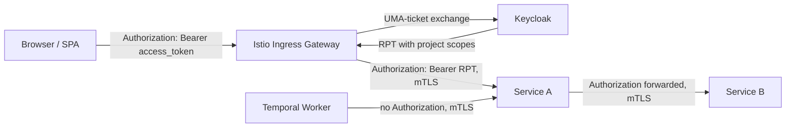
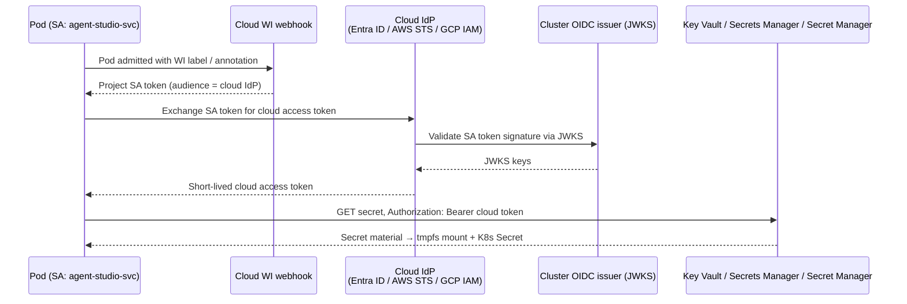
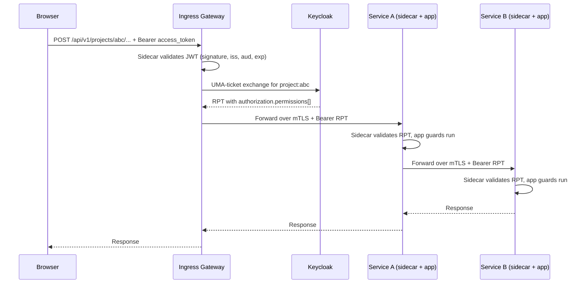

# Security design

This doc explains how identity is issued, how requests are authenticated and authorized end-to-end, and how the platform stays defensible if any single component is compromised.

## Doc map

- **Overview** — One-paragraph picture of the stack and the two identity questions every request has to answer.
- **Identity model** — Keycloak realm, brokered upstream IdP login, and the two confidential Keycloak clients that hold secrets.
- **Pod and workload identity** — How a running pod proves who it is (Kubernetes SA → SPIFFE mTLS → optional Keycloak OAuth).
- **Cloud workload identity** — How pods reach managed cloud services (Key Vault, Secrets Manager, Secret Manager, etc.) without static credentials.
- **Request path** — Where the user JWT comes from, how the gateway upgrades it to an RPT for project-scoped calls, and how every Envoy sidecar validates it.
- **Per-project authorization** — How `admin` / `member` / `viewer` per project is recorded in Keycloak and enforced in the app.
- **Application guards** — The three guards every service runs in order, and what they each reject.
- **Background workers** — How service-to-service calls without a user context work.

## When to read what

- **Adding a new microservice?** → Pod and workload identity, Application guards.
- **Wiring a new endpoint?** → Request path, Application guards (decorator conventions).
- **Handling per-project permissions?** → Per-project authorization.
- **Pulling a managed-cloud secret or calling a cloud API?** → Cloud workload identity.
- **Investigating an auth failure?** → Request path, Application guards.

---

## 1. Overview

Every request to Agent Studio answers two independent questions:


| Question                     | Answered by                                                                                     | Cryptographic root            |
| ---------------------------- | ----------------------------------------------------------------------------------------------- | ----------------------------- |
| *Which user is calling?*     | A Keycloak-signed JWT in the `Authorization: Bearer …` header, validated by Envoy at every hop. | Keycloak realm signing key    |
| *Which workload is calling?* | The pod's mTLS certificate carrying a SPIFFE identity, pinned by Istio at every hop.            | Istio CA private key (istiod) |


The two answers bind to independent keys, so compromise of one does not yield the other. The Keycloak-signed token validated at the edge (the original access token, or the gateway-minted RPT for project-scoped calls) is the token every service validates end-to-end.




---

## 2. Identity model

### 2.1 Keycloak as the only issuer

Keycloak runs in-cluster and is the **sole issuer** of every JWT consumed by Agent Studio components. Users authenticate against an upstream enterprise IdP (e.g. Entra ID, Okta, Ping, or any OIDC/SAML provider — configured per customer), reached as a brokered upstream — Keycloak handles First Broker Login, auto-provisions the user, maps upstream-IdP group claims to realm roles, and issues the token the SPA actually holds. Services reject any token whose issuer is not the Agent Studio realm.

### 2.2 Realm shape

A single realm `nemo` holds everything:


| Object                         | Purpose                                                                                                                                                 |
| ------------------------------ | ------------------------------------------------------------------------------------------------------------------------------------------------------- |
| `agent-studio-api`             | Resource-server client. Defines all user-facing roles and owns Authorization Services. Never authenticated *as* — tokens are issued *for* its audience. |
| `agent-studio-ui`              | Public PKCE client used by the SPA.                                                                                                                     |
| `agent-studio-svc-api-gateway` | Confidential client held by the ingress gateway, used only for UMA-ticket exchange against Keycloak's Protection API.                                   |
| `agent-studio-svc-config`      | Confidential client held by `config-service`, used to provision per-project authorization objects via the Protection API.                               |


Two realm roles cover all platform-wide capability: `platform-admin` (tenant administrator) and `platform-member` (default user). Everything that operates *inside* a project is governed by the per-project scope axis, not by realm roles.

An audience client scope adds `aud: "agent-studio-api"` to every access token issued by the three confidential and public clients — so every JWT validation point in the platform shares a single audience rule.

### 2.3 Lean OAuth client surface

Only the two backend components above hold a Keycloak client secret. All other services have no Keycloak client at all: no secret to rotate, no `client_credentials` round-trip on the request path. Service-to-service authentication is mTLS; user identity rides on the forwarded JWT.

---

## 3. Pod and workload identity

Every pod carries up to four layered identities, each independent in trust:


| Layer           | Identity                                                      | Issued by         | Used for                                                              |
| --------------- | ------------------------------------------------------------- | ----------------- | --------------------------------------------------------------------- |
| L1 — Kubernetes | `system:serviceaccount:<namespace>:<sa>`                      | K8s API server    | K8s API auth, Istio bootstrapping, federating to cloud identity       |
| L1.5 — Cloud    | Cloud-managed identity federated from the K8s SA              | Cloud IdP         | Pulling runtime secrets from the cloud key vault                      |
| L2 — Mesh       | `spiffe://<trust-domain>/ns/<namespace>/sa/<sa>` in mTLS cert | Istio CA (istiod) | mTLS handshakes, SPIFFE source pinning in `AuthorizationPolicy`       |
| L3 — Keycloak   | Confidential OAuth client                                     | Keycloak          | Calling Keycloak APIs only — held by the gateway and `config-service` |


The first three layers exist for **every** pod and are fully managed by infrastructure (kubelet, cloud workload identity, istiod) — no static credentials in pods. L3 exists only for the two services that need to talk to Keycloak.

Workload certificates auto-rotate roughly every 24 hours via Istio's Secret Discovery Service, with no pod restart. Strict mTLS is enforced mesh-wide: plaintext connections to any meshed pod are rejected at the connection level.

---

## 4. Cloud workload identity

Pods that need to reach managed cloud services — Key Vault / Secrets Manager / Secret Manager, managed databases, object storage, cloud KMS — authenticate as a **federated cloud identity**. No static cloud credential ever lives in a pod, image, or Kubernetes Secret; the federation is brokered by each cluster's OIDC issuer.

All three supported clouds follow the same pattern with a different primitive:


| Cloud       | Cloud-side primitive                                  | Pod-side wiring                                                                                |
| ----------- | ----------------------------------------------------- | ---------------------------------------------------------------------------------------------- |
| Azure (AKS) | User-Assigned Managed Identity + federated credential | SA + pod label `azure.workload.identity/use=true`; webhook injects a projected SA token        |
| AWS (EKS)   | IAM role with IRSA OIDC trust policy                  | SA annotated `eks.amazonaws.com/role-arn`; pod calls STS `AssumeRoleWithWebIdentity`           |
| GCP (GKE)   | GSA / Workload Identity Federation pool               | SA annotated `iam.gke.io/gcp-service-account` (or WIF principal mapping)                       |


The federation subject is always `system:serviceaccount:<namespace>:<sa>`. The cluster's OIDC issuer signs the projected SA token; the cloud IdP validates that signature against the cluster's published JWKS and returns a **short-lived** cloud access token (minutes-scale TTL, refreshed by the workload-identity SDK transparently).

At runtime, the **Secrets Store CSI driver** (Azure / AWS / GCP provider) uses the federated identity to fetch the configured secrets and projects them as a tmpfs volume (and optionally syncs them to a Kubernetes Secret when enabled). Application code reads secrets as files or env vars — no cloud SDK on the request path.



Revoking the federated credential on the cloud side — deleting the federated credential on the UAMI, removing the IRSA trust statement, or unbinding the WIF principal — stops new token issuance immediately. Pods lose cloud access at the next refresh without needing a restart or redeploy.

---

## 5. Request path

### 5.1 At the edge

The Istio ingress gateway's Envoy sidecar enforces a `RequestAuthentication` rule that validates every inbound JWT against Keycloak's JWKS — checking signature, issuer, audience, and expiry. Invalid tokens are rejected before any gateway application code runs. A matching `AuthorizationPolicy` requires an authenticated principal for `/api/v1/*` and additionally denies non-admin tokens on tenant-admin paths.

If the URL is project-scoped (`/api/v1/projects/:projectId/*`), the gateway performs a **UMA-ticket exchange** against Keycloak: it presents the user's access token and asks Keycloak for an RPT (Requesting Party Token) listing the scopes the user holds on that specific project. The result is cached for five minutes, keyed by `(userId, projectId)`. The gateway then **replaces** the `Authorization` header with the RPT and forwards the request over mTLS. Non-project requests forward the original access token unchanged.

The gateway asks Keycloak directly for the user's permissions on the requested resource:

```http
POST /realms/nemo/protocol/openid-connect/token
Host: keycloak.agentstudio-identity.svc.cluster.local:8080
Authorization: Bearer <user access_token>
Content-Type: application/x-www-form-urlencoded

grant_type=urn:ietf:params:oauth:grant-type:uma-ticket
&audience=agent-studio-api
&permission=project:{projectId}#admin,member,viewer
&response_mode=token
```

Keycloak returns only the intersection of requested and granted scopes. If the user holds nothing on that project, Keycloak responds `403 access_denied` and the gateway short-circuits before any upstream hop.

The RPT is a standard Keycloak-signed JWT with one additional top-level `authorization` claim:

```json
{
  "iss": "http://keycloak.agentstudio-identity.svc.cluster.local:8080/realms/nemo",
  "aud": "agent-studio-api",
  "sub": "<keycloak user uuid>",
  "exp": 1718456000,
  "iat": 1718455700,
  "azp": "agent-studio-ui",
  "realm_access":    { "roles": ["platform-member"] },
  "resource_access": { "agent-studio-api": { "roles": [] } },
  "preferred_username": "jane.doe",
  "email": "jane.doe@example.com",

  "authorization": {
    "permissions": [
      {
        "rsid":   "<resource uuid>",
        "rsname": "project:{projectId}",
        "scopes": ["member", "viewer"]
      }
    ]
  }
}
```

### 5.2 Inside the mesh

Every workload sidecar in the application namespace enforces the **same** `RequestAuthentication` rule as the edge — same issuer, audience, and JWKS. The RPT differs from a plain access token only in that it carries an additional `authorization.permissions[]` block; its signature, issuer, and audience are unchanged, so the same rule validates both.

Each service forwards the inbound `Authorization` header on its own outbound calls — but only to hosts in the in-mesh trust domain. Calls to external APIs never carry the user token.




---

## 6. Per-project authorization

A user can hold one of three personas — `admin`, `member`, `viewer` — **independently per project**. The model lives in Keycloak's Authorization Services:

- One **resource** `project:{projectId}` of type `project` per project, with default scopes `admin`, `member`, `viewer`.
- One **user-based policy** per `(userId, projectId, scope)` tuple.
- One **scope permission** per `(projectId, scope)` pair, binding the user policies to the resource. Decision strategy is `AFFIRMATIVE` — any positive policy grants the scope.

`config-service` owns the lifecycle: on project create / member add / role change / member remove / project delete it issues the corresponding Protection API calls. The creator of a project is automatically granted `admin` on that project; no other cross-axis grant happens automatically.

At request time, the gateway's UMA-ticket exchange returns only the scopes the user actually holds on the requested project (the intersection of requested and granted). If the user has nothing, Keycloak returns 403 and the gateway short-circuits before any upstream hop. When a membership changes, `config-service` pushes a cache-invalidation event to the gateway so the stale `(userId, projectId)` entry is evicted; otherwise it expires within the 5-minute RPT cache TTL.

The scope hierarchy `admin ⊇ member ⊇ viewer` is enforced in the application's permission guard, not in Keycloak policy logic.

---

## 7. Application guards

Each service runs three guards in a fixed order on every request:


| Guard             | Reads                                                                                                                        | Rejects                                    |
| ----------------- | ---------------------------------------------------------------------------------------------------------------------------- | ------------------------------------------ |
| Context guard     | Sidecar-validated JWT claims (signature already verified at the sidecar). Builds a typed user context exposed as `req.user`. | 401 — no JWT, or sidecar rejected the JWT. |
| Roles guard       | `req.user` realm-role and client-role claims against a `@Roles(...)` decorator.                                              | 403 — insufficient client roles.           |
| Permissions guard | `req.user` per-project scopes against a `@ProjectScope(...)` decorator, applying the hierarchy.                              | 403 — insufficient per-project scope.      |


Endpoints fall into one of four classes, each with a fixed decorator convention:


| Endpoint class                  | Path shape                                                               | Decorators                 |
| ------------------------------- | ------------------------------------------------------------------------ | -------------------------- |
| Public health / readiness       | `/health`, `/readyz`, `/metrics`                                         | `@Public()`                |
| Project / environment lifecycle | `/api/v1/projects` (list, create), `/api/v1/environments` (list, create) | `@Roles('platform-admin')` |
| Project-scoped                  | `/api/v1/projects/:projectId/*`                                          | `@ProjectScope(...)` only  |
| Internal service-only           | typically `/internal/*`                                                  | `@ServiceOnly()`           |


---

## 8. Background workers

Temporal-driven workers run with no user context. Their calls into application services carry no `Authorization` header at all; mTLS workload identity is the sole authenticator. The per-service `AuthorizationPolicy` opens worker-callable paths **only** to the worker's SPIFFE principal — for that source, no JWT is required; for every other source the policy still demands `requestPrincipals: ["*"]`, so token absence is never accepted from non-worker callers. The receiving controller is annotated `@ServiceOnly()`, which bypasses the context guard and instead asserts that the SPIFFE caller is on the allow-list.

For the rare workflow that needs to act on a real user's behalf long after the original request expired, the user's refresh token is persisted server-side (encrypted) and a workflow activity mints a fresh access token from Keycloak just before each user-attributed call. The refresh token never leaves the service that owns it.