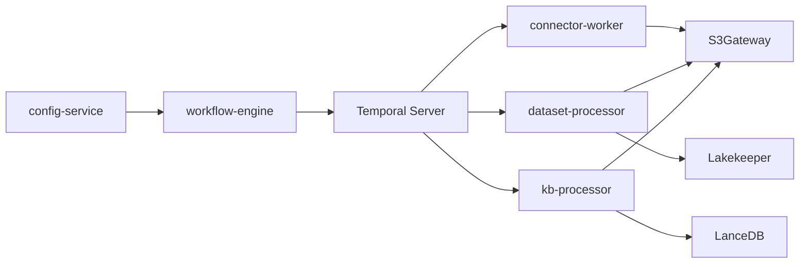

# AgentStudio Workers - Architecture Guide

## Overview

AgentStudio uses **Temporal** for workflow orchestration with three specialized worker types that process background tasks. This document explains the architecture, responsibilities, and implementation details of each worker type.

## Architecture Overview

```
User Action (UI) → config-service → workflow-engine (Go)
                                         ↓
                               Temporal Server
                                    ↓
                    ┌───────────────┼───────────────┐
                    ↓               ↓               ↓
            connector-worker  dataset-processor  kb-processor
            (Python)          (Python)           (Python)
                    ↓               ↓               ↓
            External Sources   S3 + Parquet      S3 + LanceDB
            (DB, Cloud, NAS)   (Iceberg Tables)  (Vector Store)
```

**Key Technology:**
- **Temporal**: Durable workflow orchestration (survives pod restarts)
- **Task Queues**: `connector-operations`, `dataset-processing`, `kb-processing`
- **Workers**: Python pods listening to Temporal task queues
- **Shared Storage**: S3gateway (RWX PVC) mounted by all workers

---

## 1. Connector Worker

### Purpose
Connects to external data sources and **acquires** (downloads/copies) data into AgentStudio's S3 storage.

### Task Queue
`connector-operations`

### What it does
- **Tests connections** to external sources (databases, object stores, NAS)
- **Discovers schemas** and available data
- **Acquires data** in streaming fashion (batch by batch)
- **Copies files** from external sources → S3gateway

### Supported Connectors

#### 1.1 Database Connectors
```python
# Activities:
- test_database_connection()      # Test PostgreSQL, MySQL, etc.
- discover_database_schema()      # List tables, columns
- acquire_from_database()         # Pull data via SQL queries
- preview_database()              # Sample data for UI preview
```

**Supported Databases:**
- PostgreSQL, MySQL, SQL Server
- Query-based acquisition with watermarks (incremental sync)

#### 1.2 Object Store Connectors
```python
# Activities:
- test_objectstore_connection()   # Test S3, Azure Blob, GCS
- list_objectstore_files()        # List available files
- acquire_from_objectstore()      # Download files
- preview_objectstore()           # Preview file contents
```

**Supported Object Stores:**
- AWS S3, Azure Blob Storage, Google Cloud Storage
- File pattern matching (*.csv, *.json, etc.)

#### 1.3 NAS/Volume Connectors
```python
# Activities:
- list_volume_directory()         # List files on mounted volumes
- scan_volume()                   # Recursive directory scan
- register_volume_files()         # Register files in catalog
```

**Supported Volumes:**
- NetApp ONTAP volumes (NFSv3/v4)
- Azure NetApp Files
- SMB/CIFS shares

#### 1.4 Cloud Connectors
```python
# Activities:
- test_cloud_connection()         # Test cloud provider APIs
- acquire_from_gcs()              # Google Cloud Storage
- acquire_from_api()              # Generic REST API (e.g., Redash)
- acquire_metrics()               # Metrics acquisition
```

### Example Flow

```
User creates Dataset → config-service starts DataAcquisitionWorkflow
    ↓
workflow-engine schedules acquire_from_database activity
    ↓
connector-worker picks up task from connector-operations queue
    ↓
Worker connects to PostgreSQL: SELECT * FROM users WHERE updated_at > '2024-01-01'
    ↓
Worker writes data to: s3://default-bucket/datasets/ds-123/batch-001.csv
    ↓
Worker reports completion → workflow continues
```

### Resource Configuration
```yaml
replicas: 1
resources:
  requests:
    cpu: "500m"
    memory: "1Gi"
  limits:
    cpu: "2"
    memory: "4Gi"
maxConcurrentActivities: 3
```

### Source Code Location
- **Worker**: `src/nemo/workers/connector-worker/temporal_worker.py`
- **Activities**: `src/nemo/workers/connector-worker/activities/`
- **Helm Chart**: `deployments/helm/workers/charts/connector-worker/`

---

## 2. Dataset Processor (dataset-worker)

### Purpose
Processes raw files acquired by connector-worker, converts them to **Parquet format**, and registers as **Iceberg tables** in the catalog.

### Task Queue
`dataset-processing`

### What it does
- **Reads raw files** from S3 (CSV, JSON, Excel, etc.)
- **Converts to Parquet** (columnar format for analytics)
- **Infers schema** (column types, nullability)
- **Registers Iceberg tables** in Lakekeeper catalog
- **PII detection** and masking (optional)

### Key Activities

#### 2.1 ProcessDatasetFiles
```python
def process_file_set(config: Config, set_id: str, file_paths: list) -> dict:
    """
    Process a batch of files:
    1. Read files (CSV/JSON/Excel) using pandas/polars
    2. Normalize schema (convert types)
    3. Write to Parquet format
    4. Return stats (row count, column count, size)
    """
```

#### 2.2 MergeDatasetResults
```python
def merge_results(dataset_id: str, set_results: list) -> dict:
    """
    Merge multiple parquet files into final dataset:
    1. Combine all processed batches
    2. Create Iceberg table metadata
    3. Register in Lakekeeper catalog
    4. Return final stats
    """
```

#### 2.3 ReprocessDatasetPii
```python
def reprocess_pii(dataset_id: str, pii_config: dict) -> dict:
    """
    Detect and mask PII:
    1. Scan parquet files for sensitive data
    2. Apply masking rules (hash, redact, tokenize)
    3. Write masked version
    """
```

### Example Flow

```
connector-worker finishes → writes s3://datasets/ds-123/*.csv
    ↓
workflow-engine schedules ProcessDatasetFiles activity
    ↓
dataset-processor picks up task from dataset-processing queue
    ↓
Worker reads CSV files, converts to Parquet
    ↓
Worker writes: s3://datasets/ds-123/data/part-0001.parquet
    ↓
Worker schedules MergeDatasetResults
    ↓
Worker registers Iceberg table in Lakekeeper catalog
    ↓
User can now query dataset via SQL (DuckDB/Spark)
```

### Work Planning (Scatter/Gather)
```python
# Large datasets split into work units
work_plan = create_work_plan(
    file_paths=["file1.csv", "file2.csv", ...],  # 1000 files
    max_mb_per_unit=5,                            # 5MB per batch
    max_files_per_unit=100,                       # Max 100 files per batch
    max_units=2000                                # Max 2000 parallel tasks
)
# Result: 10 work units → 10 parallel ProcessDatasetFiles activities
```

### Resource Configuration
```yaml
replicas: 1
resources:
  requests:
    cpu: "1"
    memory: "2Gi"
  limits:
    cpu: "2"
    memory: "4Gi"
maxConcurrentActivities: 3
workUnitMaxMB: 5
maxFilesPerUnit: 100
scatterMaxUnitsCeiling: 2000
```

### Source Code Location
- **Worker**: `src/nemo/workers/dataset-processor/temporal_worker.py`
- **Processing**: `src/nemo/workers/dataset-processor/processing/`
- **Helm Chart**: `deployments/helm/workers/charts/dataset-worker/`

---

## 3. KB Processor (kb-worker)

### Purpose
Processes documents for **Knowledge Bases** (RAG pipelines) - chunks text, generates embeddings, stores vectors in LanceDB.

### Task Queue
`kb-processing`

### What it does
- **Reads documents** from S3 (PDF, DOCX, TXT, Markdown, etc.)
- **Extracts text** (OCR for images if needed)
- **Chunks text** (splits into semantic units)
- **Generates embeddings** (via LLM embedding models)
- **Stores vectors** in LanceDB (vector database)
- **Builds index** for similarity search

### Key Activities

#### 3.1 ProcessKBDocuments
```python
def process_kb_documents(kb_id: str, file_set: list, config: dict) -> dict:
    """
    Process documents for RAG:
    1. Read document files (PDF, DOCX, TXT)
    2. Extract text (pypdf, python-docx)
    3. Chunk text (fixed-size, semantic, or sentence-based)
    4. Generate embeddings (OpenAI, Azure, local models)
    5. Write vectors to LanceDB
    6. Return stats (doc count, chunk count, vector count)
    """
```

#### 3.2 MergeKBResults
```python
def merge_kb_results(kb_id: str, set_results: list) -> dict:
    """
    Merge multiple processing batches:
    1. Consolidate LanceDB tables
    2. Build vector index (IVF_FLAT, HNSW)
    3. Update KB status to 'ready'
    4. Return final stats
    """
```

### Chunking Strategies

| Strategy | Description | Use Case |
|----------|-------------|----------|
| **fixed-size** | Fixed character count (e.g., 512 chars) | General purpose, consistent chunk size |
| **semantic** | Sentence/paragraph boundaries | Preserves meaning, better for Q&A |
| **recursive** | Hierarchical splitting | Large documents with structure |

**Configuration:**
- **Chunk Size**: 256-2048 characters (default: 512)
- **Chunk Overlap**: 0-200 characters (default: 50)
- **Chunk Strategy**: `fixed-size`, `semantic`, `recursive`

### Embedding Models

**Supported Providers:**
- **OpenAI**: `text-embedding-3-small`, `text-embedding-3-large`, `text-embedding-ada-002`
- **Azure OpenAI**: `text-embedding-ada-002`
- **Local Models**: `sentence-transformers` (e.g., `all-MiniLM-L6-v2`)

**Vector Dimensions:**
- `text-embedding-3-small`: 1536 dimensions
- `text-embedding-3-large`: 3072 dimensions
- `all-MiniLM-L6-v2`: 384 dimensions

### Example Flow

```
User creates Knowledge Base → uploads PDFs to S3
    ↓
workflow-engine starts KBCreationWorkflow
    ↓
workflow schedules ProcessKBDocuments activity
    ↓
kb-processor picks up task from kb-processing queue
    ↓
Worker reads PDF: s3://kb-files/kb-456/document.pdf
    ↓
Worker extracts text (pypdf2)
    ↓
Worker chunks text (512 chars, 50 char overlap)
    ↓
Worker calls embedding API: OpenAI text-embedding-3-small
    ↓
Worker writes vectors to: /lancedb/kb-456.lance
    ↓
Worker builds vector index
    ↓
User can now ask questions → kb-retrieval-service queries LanceDB
```

### Work Planning
```python
# Large knowledge bases split into document batches
work_plan = create_work_plan(
    file_paths=["doc1.pdf", "doc2.pdf", ...],  # 500 PDFs
    max_mb_per_unit=5,                          # 5MB per batch
    max_files_per_unit=100,                     # Max 100 files
    max_units=2000                              # Max 2000 parallel tasks
)
# Result: 5 work units → 5 parallel ProcessKBDocuments activities
```

### Resource Configuration
```yaml
replicas: 1
resources:
  requests:
    cpu: "1"
    memory: "2Gi"
  limits:
    cpu: "2"
    memory: "4Gi"
maxConcurrentActivities: 3
workUnitMaxMB: 5
maxFilesPerUnit: 100
scatterMaxUnitsCeiling: 2000
```

### Source Code Location
- **Worker**: `src/nemo/workers/kb-processor/temporal_worker.py`
- **Processor**: `src/nemo/workers/kb-processor/processor.py`
- **Processing**: `src/nemo/workers/kb-processor/processing/`
- **Helm Chart**: `deployments/helm/workers/charts/kb-worker/`

---

## Comparison Matrix

| Feature | Connector Worker | Dataset Processor | KB Processor |
|---------|-----------------|-------------------|--------------|
| **Purpose** | Data acquisition | Data transformation | Document vectorization |
| **Input** | External sources (DB, S3, NAS) | Raw files (CSV, JSON) | Documents (PDF, DOCX) |
| **Output** | Raw files in S3 | Parquet + Iceberg tables | Vectors in LanceDB |
| **Task Queue** | `connector-operations` | `dataset-processing` | `kb-processing` |
| **Language** | Python 3.11 | Python 3.11 | Python 3.11 |
| **Key Libraries** | psycopg2, boto3, pandas | pandas, polars, pyarrow | pypdf, sentence-transformers, lancedb |
| **Scalability** | Streaming acquisition | Scatter/gather (2000 units) | Scatter/gather (2000 units) |
| **Typical Duration** | Minutes to hours | Seconds to minutes | Minutes to hours |
| **Failure Mode** | Retry with backoff | Retry individual batches | Retry individual batches |
| **Max Concurrent** | 3 activities | 3 activities | 3 activities |

---

## Shared Components

### S3Gateway (Shared Storage)
All workers mount the same RWX PVC (`s3gateway-default-bucket`):
- **connector-worker**: Writes raw files
- **dataset-processor**: Reads raw files, writes parquet
- **kb-processor**: Reads documents, writes LanceDB tables

**Storage Path Structure:**
```
/s3-data/
  ├── datasets/
  │   ├── ds-123/
  │   │   ├── raw/           # Connector writes here
  │   │   └── data/          # Dataset processor writes parquet here
  │   └── ds-456/
  ├── knowledgebases/
  │   ├── kb-789/
  │   │   ├── documents/     # User uploads PDFs here
  │   │   ├── chunks/        # KB processor writes chunks here
  │   │   └── kb_processing_results.json
  └── lancedb/
      └── kb-789.lance/      # KB processor writes vectors here
```

### Temporal Orchestration
- **Durable execution**: Workflows survive pod restarts
- **Retry logic**: Automatic retries with exponential backoff
- **Visibility**: UI shows workflow progress in real-time
- **Timeouts**: Activities have configurable timeouts (default: 30min)
- **Versioning**: Workflow definitions are versioned for safe updates

**Temporal Configuration:**
```yaml
TEMPORAL_ADDRESS: "temporal.agentstudio-platform.svc.cluster.local:7233"
TEMPORAL_NAMESPACE: "default"
MAX_CONCURRENT_ACTIVITIES: 3
TEMPORAL_GRACEFUL_SHUTDOWN_TIMEOUT: "90s"
```

### Work Planning (Scatter/Gather)
Both dataset-processor and kb-processor use scatter/gather pattern:

```python
# Scatter: Split work into batches
work_units = create_work_plan(
    file_paths=files,
    max_mb_per_unit=5,
    max_files_per_unit=100,
    max_units=2000
)

# Execute in parallel
for unit in work_units:
    # Temporal dispatches to multiple workers
    result = await activity.execute(process_unit, unit)

# Gather: Merge results
final_result = merge_results(all_results)
```

**Benefits:**
- **Horizontal scaling**: Multiple workers process batches concurrently
- **Fault tolerance**: Failed batches retry independently
- **Progress tracking**: UI shows per-batch progress
- **Resource efficiency**: Small batches prevent memory exhaustion

### Progress Reporting
Workers POST progress to workflow-engine every 5 seconds:

```json
{
  "phase": "processing",
  "percentage": 45.5,
  "current": 455,
  "total": 1000,
  "message": "Processing batch 455 of 1000",
  "unitId": "unit-42"
}
```

UI polls workflow-engine (`GET /api/v1/workflows/{id}/progress`) to show real-time progress bars.

---

## Temporal Workflow Examples

### DataAcquisitionWorkflow (connector-worker)
```go
// workflow-engine/internal/workflows/data_acquisition.go
func DataAcquisitionWorkflow(ctx workflow.Context, req DataAcquisitionRequest) error {
    // Activity 1: Discover source data
    var items []SourceItem
    err := workflow.ExecuteActivity(ctx, activities.DiscoverSourceItems, req).Get(ctx, &items)
    
    // Activity 2: Connector worker acquires data (streaming batches)
    for _, batch := range items {
        err = workflow.ExecuteActivity(ctx, activities.AcquireBatch, batch).Get(ctx, nil)
    }
    
    // Activity 3: Dataset processor converts to parquet
    err = workflow.ExecuteActivity(ctx, activities.ProcessDatasetFiles, req.DatasetID).Get(ctx, nil)
    
    // Activity 4: Register in Lakekeeper catalog
    err = workflow.ExecuteActivity(ctx, activities.RegisterTableWithCatalog, req).Get(ctx, nil)
    
    return nil
}
```

### KBCreationWorkflow (kb-worker)
```go
// workflow-engine/internal/workflows/kb_creation.go
func KBCreationWorkflow(ctx workflow.Context, req KBCreationRequest) error {
    // Activity 1: KB processor chunks and embeds (scatter/gather)
    var workPlan WorkPlan
    err := workflow.ExecuteActivity(ctx, activities.PlanKBWork, req).Get(ctx, &workPlan)
    
    // Activity 2: Process document batches in parallel
    var results []ProcessingResult
    for _, unit := range workPlan.Units {
        var result ProcessingResult
        err = workflow.ExecuteActivity(ctx, activities.ProcessKBDocuments, unit).Get(ctx, &result)
        results = append(results, result)
    }
    
    // Activity 3: Merge results and build index
    err = workflow.ExecuteActivity(ctx, activities.MergeKBResults, req.KbID, results).Get(ctx, nil)
    
    // Activity 4: Update KB status to 'ready'
    err = workflow.ExecuteActivity(ctx, activities.UpdateKBStatus, req.KbID, "ready").Get(ctx, nil)
    
    return nil
}
```

---

## Deployment Architecture

### Kubernetes Namespace Layout
```
agentstudio-workers/
  ├── workers-connector (Deployment)
  ├── workers-dataset (Deployment)
  ├── workers-kb (Deployment)
  ├── s3gateway (StatefulSet)
  └── s3gateway-default-bucket (PVC - RWX)

agentstudio-platform/
  ├── temporal (StatefulSet)
  ├── lakekeeper (Deployment)
  └── workflow-engine (Deployment)

agentstudio-services/
  ├── config-service (Deployment)
  └── agent-service-maf (Deployment)
```

### Service Dependencies


### Autoscaling Configuration
Workers support Horizontal Pod Autoscaler (HPA) based on:
1. **CPU utilization** (default: 70%)
2. **Custom metrics** (Temporal queue backlog)

```yaml
autoscaling:
  enabled: false  # Disabled by default
  minReplicas: 1
  maxReplicas: 5
  targetCPUUtilizationPercentage: 70
  customMetric:
    enabled: false
    name: "temporal_queue_backlog_connector"
    target:
      averageValue: "10"
  behavior:
    scaleDown:
      stabilizationWindowSeconds: 300
      policies:
        - type: Pods
          value: 1
          periodSeconds: 120
    scaleUp:
      stabilizationWindowSeconds: 30
      policies:
        - type: Pods
          value: 2
          periodSeconds: 60
```

**Scale-up trigger**: When queue backlog > 10 tasks/pod for 30 seconds  
**Scale-down trigger**: When CPU < 70% for 5 minutes

---

## Error Handling & Retries

### Temporal Retry Policy
```python
@activity.defn(
    start_to_close_timeout=timedelta(minutes=30),
    retry_policy={
        "initial_interval": timedelta(seconds=5),
        "backoff_coefficient": 2.0,
        "maximum_interval": timedelta(minutes=10),
        "maximum_attempts": 5,
    }
)
async def process_dataset_files(request: ProcessRequest) -> ProcessResult:
    # Activity implementation
    pass
```

**Retry Strategy:**
- **Initial interval**: 5 seconds
- **Backoff**: Exponential (5s → 10s → 20s → 40s → 80s)
- **Max attempts**: 5
- **Non-retryable errors**: 
  - Invalid file format (user error)
  - Authentication failure (credential issue)
  - Schema validation errors

### Failure Scenarios

| Scenario | Behavior | Resolution |
|----------|----------|------------|
| **Worker pod crashes** | Temporal reschedules activity on another pod | Automatic retry |
| **S3 connection timeout** | Activity retries with exponential backoff | Retries up to 5 times |
| **Embedding API rate limit** | Activity sleeps and retries | Exponential backoff |
| **Out of memory** | Pod killed, activity retried with smaller batch | Reduce work unit size |
| **Invalid file format** | Activity fails immediately (no retry) | User must fix file |
| **Workflow timeout** | Entire workflow fails | Alert operator |

---

## Monitoring & Observability

### Metrics Exported
All workers export Prometheus metrics on port 9090:

```
# Activity execution
temporal_activity_execution_seconds{activity="acquire_from_database", status="success"}
temporal_activity_execution_seconds{activity="process_kb_documents", status="failure"}

# Queue backlog
temporal_queue_backlog{queue="connector-operations"}
temporal_queue_backlog{queue="dataset-processing"}
temporal_queue_backlog{queue="kb-processing"}

# Worker health
temporal_worker_tasks_completed_total{worker="connector-worker"}
temporal_worker_tasks_failed_total{worker="dataset-processor"}
```

### Logging
Structured JSON logs with observability context:

```json
{
  "timestamp": "2026-07-08T15:30:45.123Z",
  "level": "info",
  "message": "Processing batch completed",
  "workflow_id": "DataAcquisitionWorkflow-ds-123-20260708",
  "activity_id": "ProcessDatasetFiles-456",
  "activity_type": "ProcessDatasetFiles",
  "dataset_id": "ds-123",
  "set_id": "unit-42",
  "rows_processed": 10000,
  "duration_ms": 5432
}
```

### Health Checks
```yaml
livenessProbe:
  httpGet:
    path: /health
    port: 9090
  initialDelaySeconds: 30
  periodSeconds: 10

readinessProbe:
  httpGet:
    path: /ready
    port: 9090
  initialDelaySeconds: 10
  periodSeconds: 5
```

---

## Key Takeaways

1. **Connector Worker** = Data **acquisition** (external → S3)
2. **Dataset Processor** = Data **transformation** (raw files → Parquet/Iceberg)
3. **KB Processor** = Document **vectorization** (PDFs → embeddings → LanceDB)

All three:
- ✅ Run as Kubernetes Deployments
- ✅ Listen to Temporal task queues
- ✅ Mount shared S3gateway storage (RWX PVC)
- ✅ Support scatter/gather for parallelism
- ✅ Report progress to UI
- ✅ Auto-scale based on queue backlog (HPA)
- ✅ Export Prometheus metrics
- ✅ Structured JSON logging

This architecture allows AgentStudio to handle **large-scale data processing** (GBs of data, thousands of documents) with **fault tolerance** (Temporal retries) and **horizontal scaling** (multiple worker pods).

---

## Related Documentation
- [Agent Service MAF Architecture](./agent-service-maf-architecture.md) - Main architecture document
- [Kubernetes Knowledge Guide](../../kubernetes/kubernetes-knowledge-guide.md) - K8s deployment patterns
- Temporal Documentation: https://docs.temporal.io/
- LanceDB Documentation: https://lancedb.github.io/lancedb/
