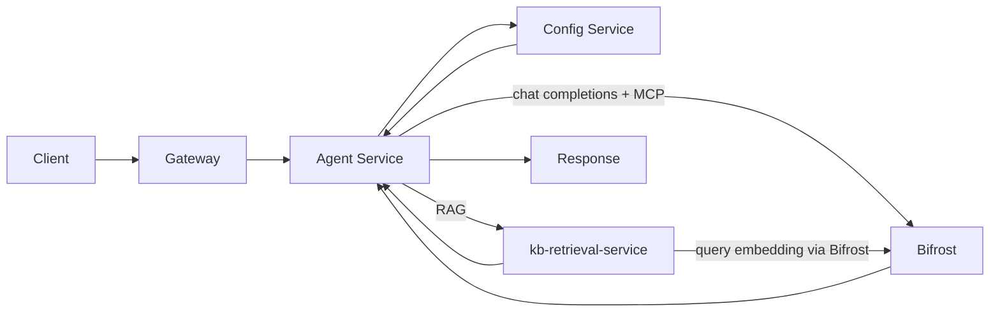

# Agent design

Agents use Config Service, [kb-retrieval-service](knowledge-base.md) (for RAG), the **[Bifrost](bifrost-migration.md) LLM gateway** (provider abstraction, per-project virtual keys, governance), and [MCP](https://modelcontextprotocol.io/) tools (also dispatched through Bifrost) as described in [Platform HLD](platform-hld.md). This doc describes the agent model, RAG integration, and execution.

> **Gateway note.** Earlier revisions of this doc described LiteLLM as the gateway. Bifrost has replaced LiteLLM in that role — agent-service now calls Bifrost's OpenAI-compatible endpoint via Agno's `agno.models.litellm.LiteLLM` class, which is a transport-only SDK (the name is misleading; it speaks the OpenAI wire protocol against Bifrost). Read every "LiteLLM gateway" reference as "Bifrost".

## Doc map

- **Overview and role** — What agents are and how they run.
- **Agent model** — Config fields (prompt, model, KBs, RAG, tools, guardrails).
- **RAG and KBs** — How the agent uses knowledge bases for retrieval-augmented generation.
- **Execution** — Agent Service, Bifrost gateway, MCP tools.
- **Implementation notes** — Key code.
- **References** — Internal and external links.

## When to read what

- **Implementing agent chat or RAG?** → §RAG and KBs and agent-service (kb_retrieval, agent_factory).
- **Configuring models or tools?** → §Agent model and Config Service Agent entity; [bifrost-migration.md](bifrost-migration.md) for gateway/VK governance; MCP docs.
- **Understanding retrieval semantics?** → [knowledge-base.md](knowledge-base.md) (search modes, rerank, multi-KB).

---

## Part A — Overview and role

### What agents are

An **agent** is an LLM-powered assistant configured per project: system prompt, model, optional [knowledge bases](knowledge-base.md) for **RAG**, optional tools via [MCP](https://modelcontextprotocol.io/), and guardrails (e.g. max iterations, timeout). Users send messages; the agent uses tools and KB context to produce responses. **RAG** (retrieval-augmented generation) means the agent augments its prompt with relevant chunks retrieved from knowledge bases so answers are grounded in project data. For how retrieval works (vector, hybrid, FTS, rerank), see [knowledge-base.md](knowledge-base.md).

---

## Part B — Agent model

The agent entity in Config Service defines identity, behavior, and integrations. See [Agent entity](../../src/nemo/config-service/models/Agent.ts):

- **Identity:** id, projectId, name, description, role.
- **LLM:** systemPrompt, modelId, temperature, maxTokens. The Model record holds the Bifrost wire identifier (`gatewayModelId`, of the form `<provider>/<bindingName>`) that agent-service sends as the `model` field on chat completions; Bifrost's per-project virtual key (`as-proj-{projectId}-vk`) carries the allowed-model list. See [bifrost-migration.md](bifrost-migration.md) for the team / VK governance model.
- **RAG:** knowledgeBaseIds (list of KB ids), ragConfig: topK, similarityThreshold, searchMode (`semantic` | `hybrid` | `fts`).
- **Tools:** mcpServerIds, optional mcpServerConfig (per server: permissions, rateLimit, allowedTools).
- **Data:** datasetIds (for context or tool access if applicable).
- **Output:** optional outcomeSchema, outcomeDescription (structured output).
- **Memory:** memoryType (`none` | `conversation` | `sliding_window`), memoryConfig (e.g. windowSize).
- **Guardrails:** guardrails: maxIterations, timeoutSeconds, optional contentFilters.

---

## Part C — RAG and KBs

When an agent has `knowledgeBaseIds`, the Agent Service calls **kb-retrieval-service** with the project id, list of KB ids, query (e.g. user message or derived query), and params from **ragConfig** (topK, minScore from similarityThreshold, searchMode). Retrieved chunks are sanitized and injected into the LLM context so the model can cite and use project data. Search mode maps to kb-retrieval-service: semantic → vector, hybrid → hybrid, fts → full-text. See [knowledge-base.md](knowledge-base.md) for retrieval API and semantics. Implementation: [kb_retrieval.py](../../src/nemo/agent-service/src/kb_retrieval.py) (KBRetrievalClient, make_kb_retriever), [agent_factory.py](../../src/nemo/agent-service/src/agent_factory.py) (building agent with retriever).

---

## Part D — Execution

1. Client sends a message to the agent (via Gateway).
2. Agent Service loads agent config from Config Service (project, agent id) and reads the project's Bifrost virtual-key bearer from K8s Secret `as-proj-{projectId}-vk`.
3. Model is resolved via the Bifrost gateway: agent-service POSTs `/litellm/v1/chat/completions` with `model: <gatewayModelId>` and the project VK as the Bearer token. Bifrost handles provider abstraction, allowed-model enforcement, rate limits, and cost tracking. (Embeddings for KB query go through the same gateway — see [unified-embedding-models.md](unified-embedding-models.md).)
4. Tools are dispatched through Bifrost's MCP routing — agent-service uses the Agno `MCPTools` integration that aggregates tools via `{LLM_GATEWAY_URL}/mcp`. Per-server allowlists / headers are enforced on the gateway side.
5. If the agent has knowledge bases, a retriever is created (see §RAG and KBs) and used to fetch context before or during the LLM call.
6. The agent runs (Agno + Bifrost); may call tools and use KB context; response is returned to the client.

---

## Implementation notes

- **Agent Service:** [agent-service](../../src/nemo/agent-service/) (Python): main API, [agent_factory.py](../../src/nemo/agent-service/src/agent_factory.py), [kb_retrieval.py](../../src/nemo/agent-service/src/kb_retrieval.py).
- **Config Service:** Agent CRUD, [Agent model](../../src/nemo/config-service/models/Agent.ts).
- **Bifrost:** The sole LLM gateway — chat completions, embeddings, and MCP tool dispatch all route through it. See [bifrost-migration.md](bifrost-migration.md) for the gateway architecture and [unified-embedding-models.md](unified-embedding-models.md) for how KB embedding identity flows. **MCP Gateway:** Tools/servers for agents are registered with Bifrost as MCP clients; the per-server allowlist + extra-headers live on the Bifrost side. Link to [knowledge-base.md](knowledge-base.md) for retrieval semantics.

---

## References

- **Internal:** [Platform HLD](platform-hld.md), [knowledge-base.md](knowledge-base.md), [bifrost-migration.md](bifrost-migration.md) (gateway architecture), [unified-embedding-models.md](unified-embedding-models.md) (embedding routing + KB metadata), [agent-service-hardening.md](agent-service-hardening.md) (structured output and guardrails for pipelines), [agent-code-sandbox-build-vs-buy.md](agent-code-sandbox-build-vs-buy.md) (untrusted code execution options), config-service (Agent), agent-service (Python).
- **External:** [Bifrost](https://github.com/maximhq/bifrost) (LLM gateway we run), [MCP (Model Context Protocol)](https://modelcontextprotocol.io/), [Agno](https://github.com/agno-agi/agno) (agent framework — note that `agno.models.litellm.LiteLLM` is a transport SDK, NOT a separate gateway). Optional: [RAG overview](https://python.langchain.com/docs/tutorials/rag/).
