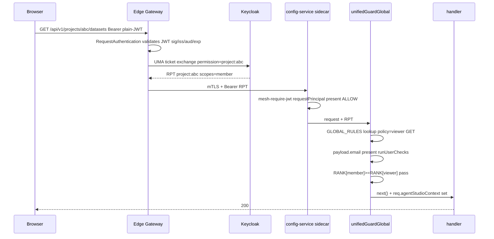
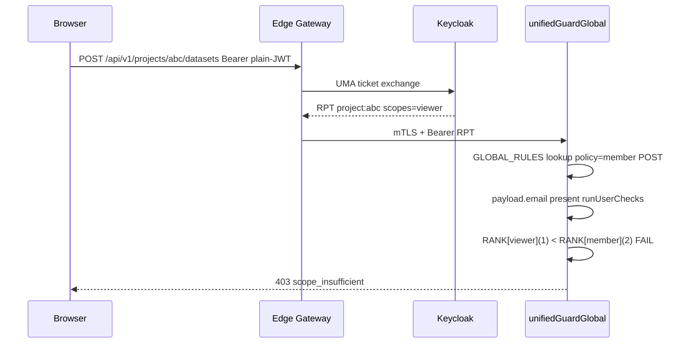
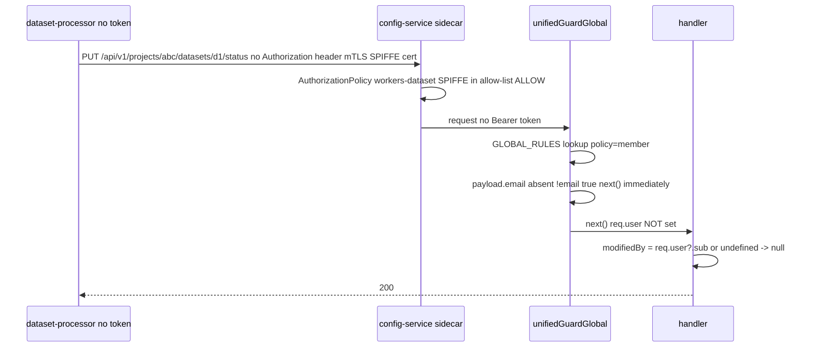
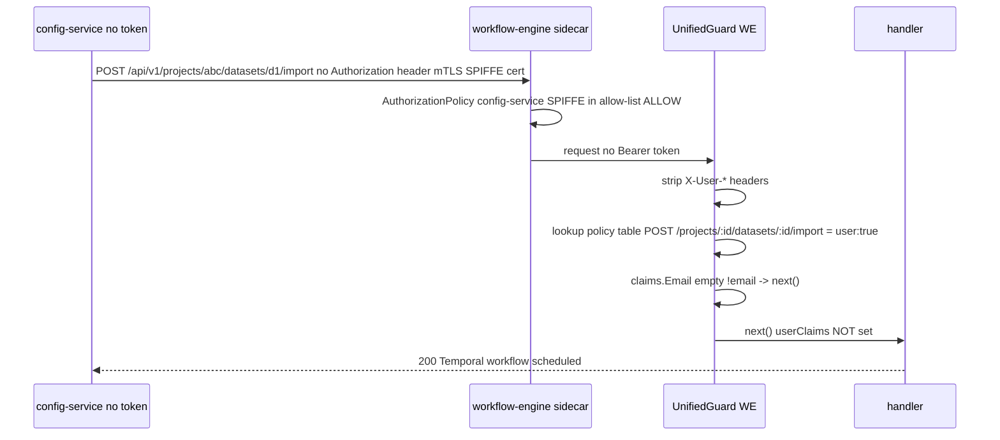
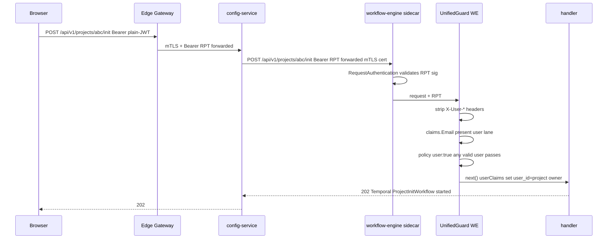

# AuthN + AuthZ End-State: config-service & workflow-engine

> **Scope:** the steady-state after PR #249 (mesh-delegated auth + SA token
> removal) and the unified guard rollout are merged.
> **Companion design:** `docs/design/single-guard-mesh-identity.md` — the
> engineering spec; this document is the *observable* end-state with worked
> examples.
>
> **AuthN** = *who are you?* (identity proof).
> **AuthZ** = *what may you do?* (permission decision).

---

## 1. The two identity carriers

| Caller | Identity carrier | Verified by |
| --- | --- | --- |
| Browser / UI user | Keycloak JWT / RPT (`Authorization: Bearer`) | Istio `RequestAuthentication` — JWKS once at the sidecar |
| Backend service / worker | mTLS SPIFFE cert (`X-Forwarded-Client-Cert`) | Istio STRICT `PeerAuthentication` — CA-issued, auto-rotated |

**Key rule:** AuthN happens at the **mesh layer (sidecar)** before any app code
runs. The app never verifies signatures.

---

## 2. The full stack per service

```
                 EDGE SIDECAR                   SERVICE SIDECAR              APP
              ┌─────────────────────┐       ┌──────────────────────┐  ┌────────────────────────┐
User JWT      │ [AuthN]             │       │ [AuthN]              │  │ unifiedGuardGlobal()    │
in Bearer     │  RequestAuthentication       │  RequestAuthentication  │                         │
             ─┤  verify sig/iss/exp │      ─┤  verify (if JWT      │  │  user lane:             │
              │                     │       │  present)            │  │   payload.email present │
              │ [AuthZ - UMA]       │       │                      │  │   decode RPT            │
              │  /projects/:id/* ?  │       │ [AuthZ]              │  │   scope check           │
              │  → swap JWT → RPT   │       │  AuthorizationPolicy │  │   sets req.agentStudio- │
              │  (Keycloak UMA)     │       │  SPIFFE allow-list   │  │   Context               │
              │                     │       │  → ALLOW or DENY     │  │                         │
              │ [parity-headers]    │       │                      │  │  service path:          │
              │  claims → headers   │       │                      │  │   !payload?.email       │
              │  X-User-Id          │       │                      │  │   → next() immediately  │
              │  X-User-Email       │       │                      │  │   (mesh is the gate)    │
              └─────────────────────┘       └──────────────────────┘  └────────────────────────┘
```

---

## 3. Flows — config-service

### Flow A — User reads datasets (north-south, project-scoped)

```
BROWSER ──Bearer JWT──► EDGE ──RPT + X-User-Id──► CONFIG-SERVICE
```

| Hop | What happens | AuthN | AuthZ |
| --- | --- | --- | --- |
| Browser → Edge | User presents plain JWT | Edge sidecar validates JWT (JWKS) | — |
| Edge: UMA filter | Path = `/projects/abc/*` → POST Keycloak UMA → swap JWT → **RPT** with `authorization.permissions[{rsname:"project:abc", scopes:["member"]}]` | — | Keycloak UMA decides project scope |
| Edge: parity-headers | Extract JWT claims → `X-User-Id: alice-uuid`, `X-User-Email: alice@netapp.com` | — | — |
| Edge → config-service | Forwards **RPT** + `X-User-*` headers over mTLS | config-service sidecar re-validates RPT | `mesh-require-jwt`: requestPrincipal present → ALLOW |
| config-service app | `createHeaderIdentityMiddleware`: reads `X-User-Id` → sets `req.user.sub, req.user.email` | — | `guard({ user:{ kind:'project', scope:'member' } })`: decode RPT → `authorization.permissions[]` → project:abc member ✓ → **200**; sets `req.agentStudioContext = { user_id, project_id:"abc", project_scopes:["member"] }` |

---

### Flow B — User creates a project (north-south, no projectId)

```
BROWSER ──Bearer plain JWT──► EDGE ──plain JWT + X-User-Id──► CONFIG-SERVICE
```

| Hop | What happens | AuthN | AuthZ |
| --- | --- | --- | --- |
| Browser → Edge | User presents plain JWT | Edge validates JWT | — |
| Edge: UMA filter | Path = `/api/v1/projects` — **no projectId** → UMA swap **skipped** → plain JWT forwarded | — | — |
| config-service app | `guard({ user:{ kind:'context' } })`: decode JWT → sub + email present → **200**; sets `req.agentStudioContext = { user_id }` | — | Any authenticated user may create a project |

---

### Flow C — Workflow-engine updates dataset status (east-west, service lane)

```
WORKFLOW-ENGINE ──mTLS, no token──► CONFIG-SERVICE
```

| Hop | What happens | AuthN | AuthZ |
| --- | --- | --- | --- |
| WE → config-service | No `Authorization` header (SA token dropped — `DISABLE_SA_TOKEN_INJECTION=true`) | config-service sidecar: mTLS handshake → verified SPIFFE = `.../sa/workflow-engine` | `AuthorizationPolicy`: principal in allow-list → ALLOW |
| config-service app | `unifiedGuardGlobal`: no JWT → `!payload?.email → next()` immediately | — | guard steps aside; mesh allow-list is the gate; `req.user` not set |

`req.agentStudioContext` is **not set** on the service path. Handler reads `:projectId`
directly from the URL.

---

### Flow D-UI — User on a platform route (north-south, roles) — *target state, not yet implemented*

```
BROWSER ──Bearer plain JWT──► EDGE ──plain JWT + X-User-Id──► CONFIG-SERVICE
```

| Hop | What happens | AuthN | AuthZ |
| --- | --- | --- | --- |
| Edge | Path = `/api/v1/platform/mcp-servers` → no UMA swap | Edge validates JWT | — |
| config-service app | **Today:** global `createAuthMiddleware` only — any authenticated user can call (no role check). **Target after guard conversion:** `guard({ user:{ kind:'roles', roles:['platform-member'] } })` — decode JWT → check `realm_access.roles` → has platform-member ✓ → **200** | — | Platform role check *(target only)* |

> **Current state:** `/api/v1/platform/mcp-servers` and `/api/v1/gateway` are
> protected by `createAuthMiddleware` (AuthN only — any valid JWT passes). The
> `platform-member` role check is defined in the §6.1 inventory but not yet
> wired via `guard()`. This will be enforced once the full route conversion is
> complete.

---

## 4. Flows — workflow-engine

### Flow D — User starts a workflow (config-service relays the user JWT)

```
BROWSER ──RPT──► EDGE ──RPT──► CONFIG-SERVICE ──RPT (forwarded)──► WORKFLOW-ENGINE
```

| Hop | What happens | AuthN | AuthZ |
| --- | --- | --- | --- |
| Edge → config-service | RPT validated (Flow A above) | ✅ | ✅ |
| config-service → WE | `ProjectInitService` forwards the original user RPT verbatim + mTLS | WE sidecar: verifies RPT (JWT authN) + mTLS (config-service SPIFFE authN) | — |
| WE app | `payload.email present` (RPT has sub + email) → user lane; WE sets `userClaims` | — | WE `guard({ user:true })`: RPT decoded, `userClaims.UserID` = project owner (Temporal workflow uses this sub) → **200** |

> **Why config-service is NOT treated as a service peer here:** the RPT carries
> sub + email → `payload.email present` → user lane wins. The
> mTLS peer identity is irrelevant when a real user token is present. This is
> intentional — WE must see the real user's `sub` to assign project ownership.

---

### Flow E — config-service polls workflow-engine for progress (east-west)

```
CONFIG-SERVICE ──mTLS, no token──► WORKFLOW-ENGINE
```

| Hop | What happens | AuthN | AuthZ |
| --- | --- | --- | --- |
| config-service → WE | No token (config-service acts on its own authority) | WE sidecar: mTLS → SPIFFE = `.../sa/config-service` | WE `AuthorizationPolicy`: config-service in WE's allow-list → ALLOW |
| WE app | `payload.email absent` (no token) → `!email → next()` immediately → **200** | — | guard steps aside; mesh allow-list is the gate |

---

## 5. The user-first rule — same caller, two lanes

config-service calls workflow-engine in two modes with the **same SPIFFE cert**:

```
config-service → WE   WITH   forwarded user RPT   (Flow D, /init)
  payload.email present (sub + email in RPT)
  → USER lane → userClaims set → req.agentStudioContext.user_id = project owner

config-service → WE   WITHOUT   token   (Flow E, /progress poll)
  payload = nil (no token)
  → !email → next() immediately
  → userClaims not set
```

Same caller SPIFFE. Different token. Different lane. The **token presence** determines
the lane — not the certificate. This is the "user-first" rule: a forwarding proxy
relaying a user JWT is treated as a user, not as a service, even if it is also an
allow-listed peer.

---

## 6. Async flow — dataset import (Temporal workflow)

The async flow is the most important to understand: **there is no live user JWT
once the workflow is running.** The user's request ended; the work runs
minutes/hours later inside a Temporal activity. Every config-service call from
this point is east-west (service lane).

> **Trigger note:** `DatasetImportService` calls workflow-engine with
> config-service's **own SA token** today — but after PR #249
> (`DISABLE_SA_TOKEN_INJECTION=true`), this becomes a **tokenless mTLS** call.
> Unlike `ProjectInitService` which always forwards the user's RPT (WE needs
> `jwt.sub` for project-owner assignment), dataset import never needs the user's
> identity. WE receives either the SA token or the tokenless call on the
> **service lane** (config-service SPIFFE in WE's allow-list) and starts the
> Temporal workflow.

```
TODAY (SA token still active):
BROWSER ──RPT──► EDGE ──RPT──► CONFIG-SERVICE ──SA token (own identity)──► WORKFLOW-ENGINE
                                                                                  │
                                                              payload.email absent (SA has no email)
                                                              → !email → next() → Temporal scheduled

AFTER PR #249 (SA tokens removed):
BROWSER ──RPT──► EDGE ──RPT──► CONFIG-SERVICE ──no token, mTLS cert──► WORKFLOW-ENGINE
                                                                               │
                                                           payload = nil (no JWT)
                                                           → !email → next() → Temporal scheduled
                                                           (mesh AuthorizationPolicy: config-service
                                                            SPIFFE in allow-list → ALLOW at sidecar)
                                                                               │
                                  ┌───────────────────────────────────────────────┘
                                  │          TEMPORAL SERVER
                                  │  (durable orchestration — no HTTP, no JWT)
                                  │
                          ┌───────▼────────────────────────────────────────────────┐
                          │  DatasetImportWorkflow  (runs inside workflow-engine)  │
                          │                                                        │
                          │  Step 1: FetchProjectCredentialsActivity               │
                          │     WE → config-service  (east-west, no token)        │
                          │     GET /api/v1/internal/projects/:id/service-account  │
                          │     service lane → returns project SA creds            │
                          │                    ↓                                   │
                          │  Step 2: CreateWorkPlanActivity                        │
                          │     WE → dataset-processor  (Temporal task queue)     │
                          │     passes SA creds as activity input                  │
                          │                    ↓                                   │
                          │  Step 3: ProcessDatasetFiles  (on dataset-processor)  │
                          │     dataset-processor does S3 + catalog work          │
                          │     NO direct config-service calls                    │
                          │     (SA creds injected as activity input by WE)       │
                          │                    ↓                                   │
                          │  Step 4: UpdateDatasetStatusActivity                   │
                          │     WE → config-service  (east-west, no token)        │
                          │     PUT /api/v1/internal/projects/:id/datasets/:id/   │
                          │         status                                         │
                          │     service lane → 200                                 │
                          └────────────────────────────────────────────────────────┘
```

### Auth state at each async step

| Step | Caller → Callee | Token | Lane | Auth |
| --- | --- | --- | --- | --- |
| User commits manifest | Browser → edge → config-service | RPT | USER | per-project scope check on config-service |
| Import trigger | config-service → WE | **SA token** today; **none** after PR #249 (mTLS cert only) | service path | WE: `!email → next()` (SA no email; or tokenless after PR #249); mesh allow-list gates |
| Temporal schedule | WE → Temporal server | Temporal gRPC (not JWT) | — | Temporal namespace auth (separate from Keycloak) |
| FetchProjectCredentials | WE → config-service | **none** (SA dropped after PR #249) | service path | mesh allow-list; `!email → next()`; no project scope check |
| ProcessDatasetFiles | Temporal → dataset-processor | Temporal task queue | — | Temporal worker poll; SA creds injected as activity input |
| UpdateDatasetStatus | WE → config-service | **none** (SA dropped) | service path | mesh allow-list; `!email → next()`; no project scope check |

### Why there is no user JWT in the async steps

The RPT from the user's browser request had a **short TTL** (minutes). By the time
a Temporal activity runs, that token is expired — and there is no human sitting
at a browser to re-authenticate. So async work **must** authenticate as a service
(SPIFFE cert), not as a user. This is the exact root cause of the original
`401 token_shape_invalid` bug: the worker tried to use a service-account token
on a user-guarded route.

The guard is correct: the mesh allows the call because
the worker's SPIFFE is in config-service's allow-list; `!payload?.email → next()`
passes it through; no user identity is required or expected.

---

## 6. Summary diagrams

### North-South: user reads datasets



### North-South: user write blocked by scope



### East-West: worker updates dataset status



### East-West: config-service → workflow-engine (tokenless after PR #249)



### config-service forwards user JWT to workflow-engine (Flow D)



| Flow | `req.user` | `req.agentStudioContext` | Handler reads |
| --- | --- | --- | --- |
| A — user reads datasets | ✅ sub, email | ✅ user_id, **project_id**, **project_scopes** | `agentStudioContext.project_id` for data scoping |
| B — user creates project | ✅ sub, email | ✅ user_id | `agentStudioContext.user_id` for owner assignment |
| C — WE updates dataset | ❌ not set | ❌ not set | `:projectId` from URL params |
| D — user starts workflow | ✅ sub, email | ✅ user_id, project_id | `agentStudioContext.user_id` for Temporal workflow owner |
| E — config polls /progress | ❌ not set | ❌ not set | workflowId from URL params |

`req.agentStudioContext` is the **authorization result carrier** — it is only set after
the guard passes, and it is the only place `project_id` and `project_scopes` are
available (they are not in `req.user`). Handlers use it for data scoping and actor
attribution.

---

## 7. AuthN vs AuthZ — which component does what

| Component | AuthN | AuthZ | Notes |
| --- | --- | --- | --- |
| Istio `RequestAuthentication` | ✅ JWT sig/iss/aud/exp | ❌ | Runs in the sidecar before the app |
| Istio STRICT `PeerAuthentication` | ✅ mTLS SPIFFE cert | ❌ | Mutual — both sides prove identity |
| Istio `AuthorizationPolicy` (allow-list) | ❌ | ✅ which SPIFFE → which service | Per-pair allow-list (PR #274, merged) |
| UMA-RPT `EnvoyFilter` (edge) | ❌ | ✅ user holds scope on project | Keycloak UMA exchange at the edge |
| parity-headers `EnvoyFilter` (edge) | ❌ | ❌ | Identity shim: claims → `X-User-*` headers |
| `guard()` user lane | ❌ (decodes; trusts sidecar) | ✅ role check / per-project scope | `payload.email` present → `runUserChecks`; sets `req.agentStudioContext` |
| `guard()` service path | ❌ | ❌ | `!payload?.email → next()`; mesh `AuthorizationPolicy` is the gate |

---

## 8. Prerequisites — what must be live before `createAuthMiddleware` is removed

| Prerequisite | Status |
| --- | --- |
| STRICT mTLS + `PeerAuthentication/default` in `agentstudio-services` | ✅ live |
| Istio `RequestAuthentication` (JWT authN at edge + mesh) | ✅ live |
| `mesh-require-jwt` policy | ✅ live |
| `AuthorizationPolicy` per-pair allow-list (PR #274) | ✅ merged |
| SA token disable (`DISABLE_SA_TOKEN_INJECTION`) | 🔄 PR #249 |
| Unified `guard()` converted to all routes in config-service + WE (PR #318) | 🔄 in review |
| `createAuthMiddleware` removed | ⏳ last step — only after all above are live |
