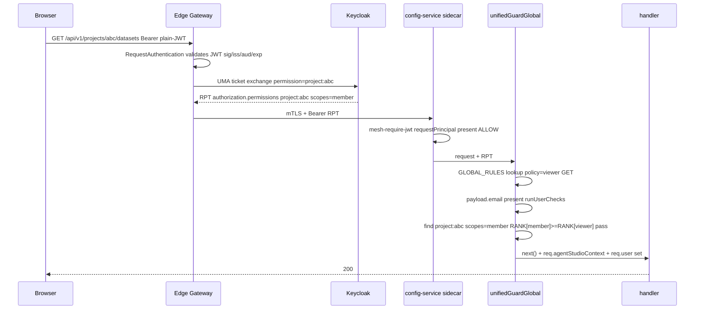
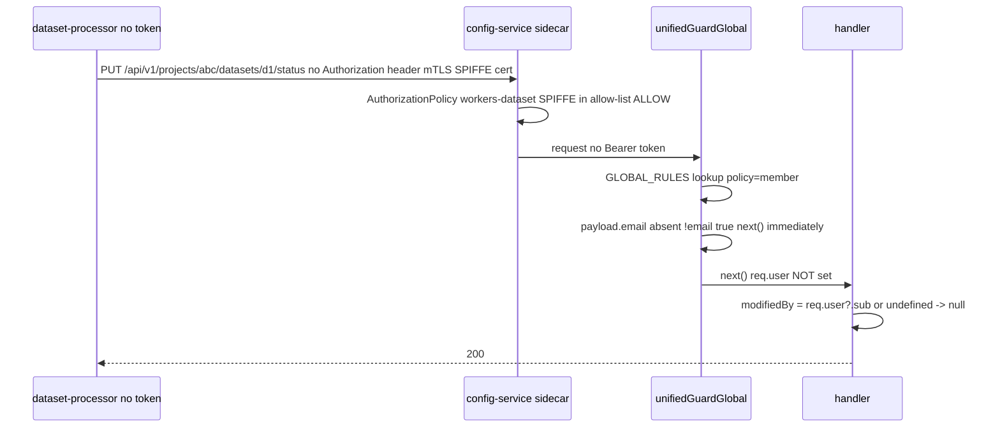
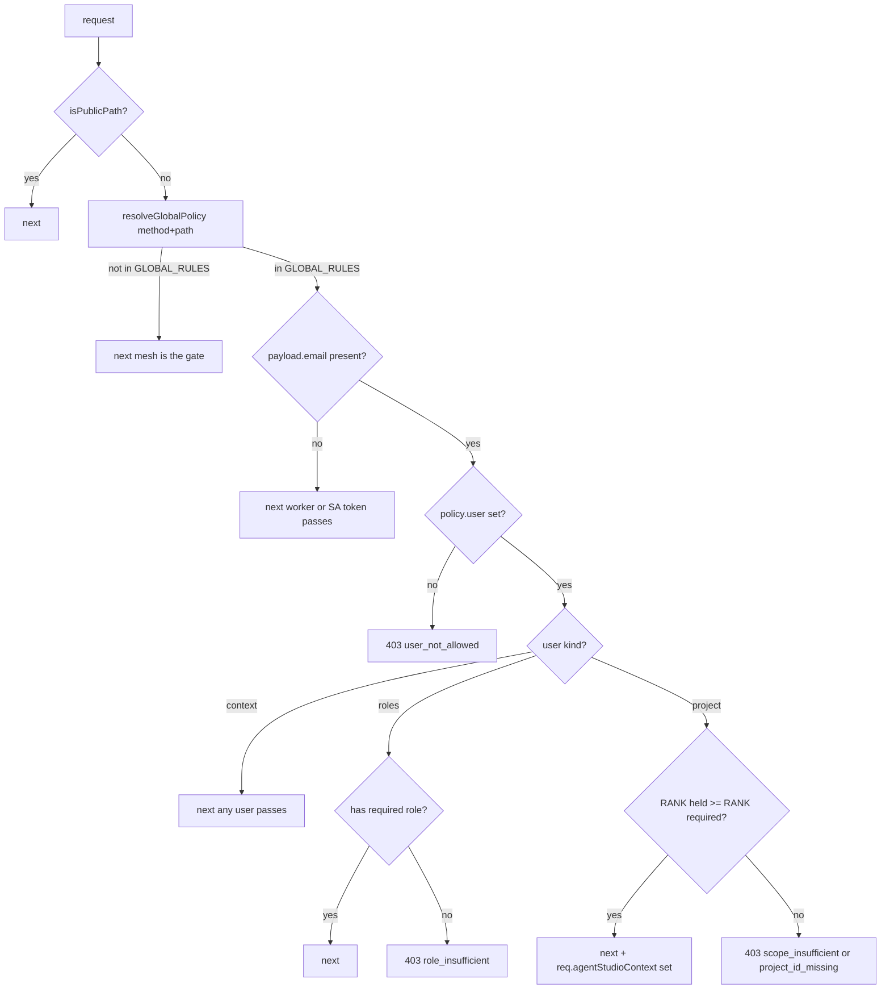
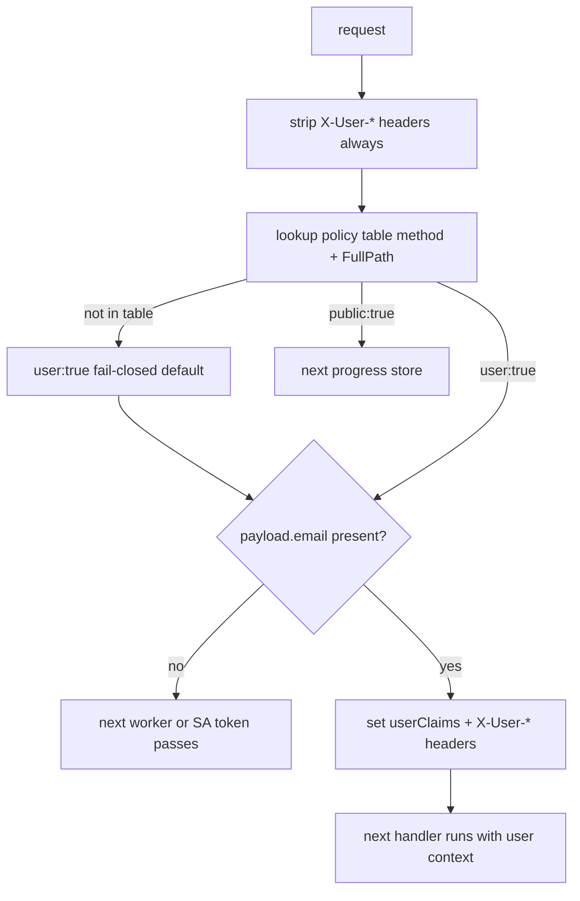

# AuthN + AuthZ Policy — AgentStudio (Simplified Guard)

> **Scope:** config-service + workflow-engine · **Context:** PR #274 (mesh
> AuthorizationPolicy, merged) + PR #318 (unified guard, simplified model).

---

## 1. The two-layer model

```
┌─────────────────────────────────────────────────────────────┐
│  LAYER 1 — MESH  (infrastructure, always on)                │
│                                                             │
│  AuthN:  mTLS between every pod (SPIFFE certs)              │
│  AuthN:  JWT signature/iss/aud/exp validated at sidecar     │
│  AuthZ:  AuthorizationPolicy (PR #274) — per-pair           │
│          allow-list. Only named workloads reach named        │
│          services.                                           │
└─────────────────────────────────────────────────────────────┘
                         │
                         ▼
┌─────────────────────────────────────────────────────────────┐
│  LAYER 2 — APP GUARD  (PR #318, UNIFIED_GUARD_SMOKE=true)   │
│                                                             │
│  ONE question: does this request carry a JWT with email?    │
│                                                             │
│  YES (user) → enforce per-route scope (viewer/member/admin) │
│  NO  (service/worker) → next(), mesh already decided        │
└─────────────────────────────────────────────────────────────┘
```

---

## 2. North-South flow (Browser → config-service)



---

## 3. East-West flow (Worker → config-service)



---

## 4. What each layer enforces

| Layer | What it checks | What it does NOT check |
| --- | --- | --- |
| **Mesh AuthN** (sidecar) | mTLS cert valid; JWT sig/iss/aud/exp; JWT present (north-south) | per-route verb restriction; project membership |
| **Mesh AuthZ** (PR #274) | caller workload in per-service allow-list | which route/verb called; user identity |
| **App Guard** (PR #318) | user has email claim; per-project scope (RPT); viewer/member/admin/roles | JWT signature (sidecar did it); service workload identity |

---

## 5. config-service guard flow



---

## 6. workflow-engine guard flow



---

## 7. Per-route AuthZ matrix

| Route group | AuthN gate | AuthZ gate |
| --- | --- | --- |
| `/api/v1/internal/**` | mTLS + allow-list (PR #274) | none at app — mesh only |
| `/api/v1/workspaces/**` | mTLS + allow-list | none at app |
| `/api/v1/buckets/**` (top-level) | mTLS + allow-list | none at app |
| `/api/v1/deployments/**` (writes) | mTLS + allow-list | none at app |
| `credentials/:id/secret-data` | mTLS + allow-list | none at app |
| `/api/v1/projects/:id/datasets/**` | mTLS + JWT sidecar | viewer (GET) / member (write) |
| `/api/v1/projects/:id/knowledgebases/**` | mTLS + JWT sidecar | viewer (GET) / member (write) |
| `/api/v1/projects/:id/agents/**` | mTLS + JWT sidecar | viewer (GET) / member (write) |
| `/api/v1/projects/:id/agent-teams/**` | mTLS + JWT sidecar | viewer (GET) / member (write) |
| `/api/v1/projects/:id/evaluation/**` | mTLS + JWT sidecar | viewer (GET) / member (write) |
| `/api/v1/projects/:id/datasources/**` | mTLS + JWT sidecar | member (all methods) |
| `/api/v1/projects/:id/credentials/**` | mTLS + JWT sidecar | member (all methods) |
| `/api/v1/projects/:id/models/**` | mTLS + JWT sidecar | member (all methods) |
| `/api/v1/projects/:id/pipelines/**` | mTLS + JWT sidecar | member (all methods) |
| `/api/v1/projects/:id` | mTLS + JWT sidecar | viewer (GET) / member (PATCH) / admin (PUT/DELETE) |
| `/api/v1/projects/:id/service-account` | mTLS + JWT sidecar | admin |
| `/api/v1/projects/:id/members/**` | mTLS + JWT sidecar | member |
| `/api/v1/projects/:id/buckets/**` | mTLS + JWT sidecar | member |
| `/api/v1/projects/:id/mcp-servers/**` | mTLS + JWT sidecar | member |
| `/api/v1/projects` (create/list) | mTLS + JWT sidecar | any valid user (context) |
| `/api/v1/deployments/**` (GET) | mTLS + JWT sidecar | any valid user (context) |
| `/api/v1/platform/**` | mTLS + JWT sidecar | platform-member role |
| `/api/v1/gateway/**` | mTLS + JWT sidecar | platform-member role |
| `/api/v1/governance/**` | mTLS + JWT sidecar | platform-member role |
| WE user routes (`/init`, `/members`, etc.) | mTLS + JWT sidecar | any valid user; handler self-checks |
| WE service routes (`/import`, `/process`, etc.) | mTLS + allow-list | none at app — !email → next() |
| WE `/workflows/:id/progress` | mTLS only | public — no JWT required |

---

## 8. Scope hierarchy

```
admin  ──┐
         ├── can do everything
member ──┤
         ├── can read + write resources
viewer ──┘
         └── can only read metadata (GET on content groups)

admin ⊇ member ⊇ viewer
(admin satisfies member requirement; member satisfies viewer requirement)
```

---

## 9. SA token transition (pre/post PR #249)

The guard uses `!payload?.email` — not `!payload` — to detect non-user callers:

| Caller | Token | `payload?.email` | Guard result |
| --- | --- | --- | --- |
| User (RPT) | JWT with email | present | scope-checked |
| Worker (post-PR#249) | no JWT | undefined | `next()` |
| SA token (pre-PR#249) | JWT, no email | undefined | `next()` |

Both tokenless workers and SA tokens reach the same `next()` path — no dual behaviour, no flag needed.

**After PR #249 merges** (SA tokens removed), one-line simplification per service:
```ts
// config-service: if (!payload?.email) → if (!payload)
// workflow-engine: if claims == nil || claims.Email == "" → if claims == nil
```

---

## 10. Security properties

| Property | Enforced by |
| --- | --- |
| Only allow-listed services reach config-service east-west | Mesh AuthorizationPolicy (PR #274) |
| JWTs are valid (sig/iss/aud/exp) | Istio RequestAuthentication (sidecar) |
| Users are scoped to their projects | App guard — RANK check on RPT |
| Viewers cannot write | App guard — `RANK[viewer](1) < RANK[member](2)` |
| Non-members blocked from projects | App guard — project not in RPT permissions |
| SA tokens pass pre-PR#249 | `!payload?.email` check |
| Forged X-User-* headers stripped | WE guard strip-then-set on every request |
| Workers carry no user identity | `req.user` not set on `!email` path |
