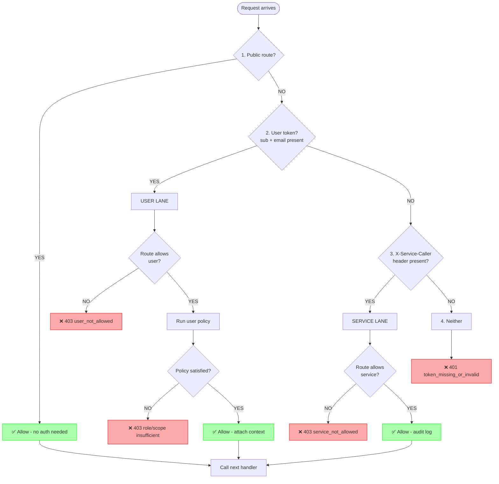

# Config-Service Unified Guard - Complete Flow Explanation

**File:** `src/nemo/config-service/middleware/unifiedGuard.ts`  
**Date:** 2026-07-01  
**Purpose:** Deep dive into all authorization flows in the unified guard

---

## Overview: What is the Unified Guard?

The unified guard is **ONE middleware that replaces THREE legacy guards**:
- ❌ OLD: `ContextGuard → RolesGuard → PermissionsGuard` (chained)
- ✅ NEW: `unifiedGuard` (single decision point)

**Key principle:** Route requests by **who the caller cryptographically is**, not by header parsing chains.

---

## Core Decision Flow (4 Steps)



---

## Lane 1: PUBLIC (No Auth Required)

### Routes:
```typescript
const PUBLIC_PATHS = [
  '/health',
  '/ready',
  '/swagger',
  '/swagger.json',
  '/docs',
  '/api/v1/setup'
];
```

### Flow:
```
1. Request → /health
2. Guard checks: isPublicPath('/health') → TRUE
3. ✅ Allow immediately, call next()
```

### Use Cases:
- **Kubernetes probes:** `/health`, `/ready`
- **API documentation:** `/swagger`, `/docs`
- **Initial setup:** `/api/v1/setup` (first-time installation)

**Security:** Intentionally public; no sensitive data exposed.

---

## Lane 2: USER (North-South, Browser/CLI)

### Identification:
```typescript
const payload = decodeJwtPayload(req); // Base64-decode Bearer token
const isUser = !!payload && !!str(payload.sub) && !!str(payload.email);
```

**User token MUST have:**
- ✅ `sub` (subject - user ID)
- ✅ `email` (proves human, not service account)

**Service account tokens have:**
- ✅ `sub`
- ❌ NO `email` → NOT treated as user

---

### User Policy Types

#### 1. **Context** - Any authenticated user

```typescript
{ user: { kind: 'context' } }
```

**Example routes:**
- `POST /api/v1/projects` (create project)
- `GET /api/v1/search` (global search)
- `GET /api/v1/evaluation` (list evaluations)

**Flow:**
```
1. User has valid JWT with sub + email
2. Policy: { kind: 'context' }
3. ✅ Allow - no role/scope check
4. Attach req.agentStudioContext with user_id, email, roles
```

---

#### 2. **Roles** - Specific realm/client roles

```typescript
{ user: { kind: 'roles', roles: ['platform-member'] } }
```

**Example routes:**
- `/api/v1/gateway/*` (Bifrost admin - requires platform-member)
- `/api/v1/governance/*` (Virtual keys - requires platform-member)
- `/api/v1/platform/mcp-servers/*` (Platform MCP admin)

**Flow:**
```
1. User presents JWT
2. Decode: realm_roles = ['user'], api_roles = ['platform-member']
3. Policy requires: ['platform-member']
4. Check: user has platform-member → ✅ Allow
5. Attach req.agentStudioContext
```

**Reject example:**
```
User roles: ['user', 'developer']
Policy requires: ['platform-member']
→ ❌ 403 role_insufficient
```

---

#### 3. **Project** - Per-project scope (viewer/member/admin)

```typescript
{ user: { kind: 'project', scope: 'member' } }
```

**Scope hierarchy:**
```
admin (rank 3) ⊇ member (rank 2) ⊇ viewer (rank 1)
```

**Example routes:**
- `GET /api/v1/projects/:projectId` → **viewer** (read-only)
- `POST /api/v1/projects/:projectId/datasets` → **member** (writes)
- `DELETE /api/v1/projects/:projectId` → **admin** (destructive)
- `GET /api/v1/projects/:projectId/service-account` → **admin** (secret access)

**Flow:**
```
1. User requests: GET /api/v1/projects/proj123/datasets
2. Policy: { kind: 'project', scope: 'viewer' }
3. Extract projectId from URL: 'proj123'
4. Decode JWT → authorization.permissions array:
   [
     { rsname: 'project:proj123', scopes: ['viewer', 'member'] },
     { rsname: 'project:proj456', scopes: ['admin'] }
   ]
5. Find permission for proj123 → scopes: ['viewer', 'member']
6. Highest rank: member (rank 2)
7. Required: viewer (rank 1)
8. 2 >= 1 → ✅ Allow
9. Attach req.agentStudioContext with:
   - project_id: 'proj123'
   - project_scopes: ['viewer', 'member']
```

**Reject example:**
```
User wants: DELETE /projects/proj123 (requires admin)
User's scopes for proj123: ['viewer', 'member']
Highest rank: member (2)
Required: admin (3)
→ ❌ 403 scope_insufficient
```

**Cross-project protection:**
```
User requests: GET /projects/proj999/datasets
User's permissions: [{ rsname: 'project:proj123', scopes: ['admin'] }]
No entry for proj999 found
→ ❌ 403 context_project_id_missing
```

---

### User Context Attachment

On successful user auth, guard attaches `req.agentStudioContext`:

```typescript
{
  user_id: 'uuid-from-sub',
  user_email: 'user@example.com',
  preferred_username: 'john.doe',
  realm_roles: ['user'],
  api_roles: ['developer'],
  project_id: 'proj123',           // Only for project-scoped routes
  project_scopes: ['viewer', 'member'] // Only for project-scoped routes
}
```

**Also populates legacy `req.user`:**
```typescript
{
  sub: 'uuid',
  email: 'user@example.com',
  preferred_username: 'john.doe',
  name: 'John Doe',
  'agentstudio.project_id': 'proj123'
}
```

**Why both?** Legacy handlers still read `req.user.sub` for audit trails.

---

## Lane 3: SERVICE (East-West, Service-to-Service)

### Identification:
```typescript
const peer = trustedServicePeer(req);
// Reads X-Service-Caller header (default)
// Returns SPIFFE if present: "spiffe://cluster.local/ns/services/sa/workflow-engine"
```

**Requirements:**
1. ✅ Header present: `X-Service-Caller`
2. ✅ Starts with `spiffe://`
3. ✅ Injected by EnvoyFilter (PR #274)

**CRITICAL SECURITY CONTRACT:**
- EnvoyFilter **STRIPS** any client-supplied `X-Service-Caller`
- EnvoyFilter **INJECTS** verified SPIFFE from mTLS certificate
- App **TRUSTS** header presence = mesh-authorized peer

---

### Service-Only Routes

```typescript
// Service-only (no user allowed)
{ internalAllowed: true }
```

**Example routes:**
- `/api/v1/internal/*` (all internal endpoints)
- `/api/v1/workspaces` (orchestrator poll)
- `/api/v1/buckets/*` (workflow-engine bucket routing)
- `POST /api/v1/deployments` (storage-manager registration)
- `GET /api/v1/projects/:id/credentials/:id/secret-data` (RAW secrets)

**Flow:**
```
1. workflow-engine calls: POST /api/v1/internal/projects/123/gateway-setup
2. No JWT present (tokenless mTLS)
3. Guard checks: X-Service-Caller = spiffe://.../sa/workflow-engine
4. Policy: { internalAllowed: true }
5. ✅ Allow
6. Audit log: svc_lane_access { peerSpiffe, method, path, decision: 'allow' }
7. Seed req.user = { sub: 'spiffe://...' } (for attribution)
8. Call next()
```

**Reject example:**
```
User tries: GET /internal/projects/123/gateway-setup
Token decoded: sub + email present → USER lane
Policy: { internalAllowed: true } (no user policy)
→ ❌ 403 user_not_allowed
```

---

### Dual-Lane Routes (User OR Service)

```typescript
// Dual-lane
{ user: { kind: 'project', scope: 'member' }, internalAllowed: true }
```

**Example routes:**
- `POST /api/v1/projects/:id/datasets` (GUI create OR worker callback)
- `POST /api/v1/projects/:id/knowledgebases` (GUI create OR schedule fanout)
- `PUT /api/v1/projects/:id` (ProjectInit callback - admin user OR workflow-engine)
- `GET /api/v1/projects/:id/service-account` (admin user OR worker fetch)

**User flow:**
```
1. Browser: POST /projects/123/datasets (Bearer token)
2. Guard detects: sub + email → USER lane
3. Policy: { user: { kind: 'project', scope: 'member' }, internalAllowed: true }
4. Run user check: member scope → ✅ Allow
5. Attach req.agentStudioContext
```

**Service flow:**
```
1. dataset-worker: POST /projects/123/datasets (no token, X-Service-Caller)
2. Guard detects: X-Service-Caller present → SERVICE lane
3. Policy: { internalAllowed: true }
4. ✅ Allow (no scope check on service lane)
5. Seed req.user = { sub: 'spiffe://...' }
```

**Why dual-lane?**
- Users create resources via GUI
- Workers callback with status updates
- Same endpoint, different callers, different auth paths

---

## Global Policy Table (Complete Coverage)

### How It Works

Instead of mounting guards per-router, **one app-level middleware** authorizes ALL routes:

```typescript
app.use(unifiedGuardGlobal());
```

**Ordered matching (first match wins):**
1. Check if path is public → allow
2. Match path against GLOBAL_RULES (77 rules)
3. If no match → fallback to `{ user: context }` (fail closed)
4. Run `guard(policy)` decision

---

### Policy Shortcuts

```typescript
const POL = {
  ctx: { user: { kind: 'context' } },
  ctxDual: { user: { kind: 'context' }, internalAllowed: true },
  viewerUser: { user: { kind: 'project', scope: 'viewer' } },
  viewerDual: { user: { kind: 'project', scope: 'viewer' }, internalAllowed: true },
  memberUser: { user: { kind: 'project', scope: 'member' } },
  memberDual: { user: { kind: 'project', scope: 'member' }, internalAllowed: true },
  adminUser: { user: { kind: 'project', scope: 'admin' } },
  adminDual: { user: { kind: 'project', scope: 'admin' }, internalAllowed: true },
  service: { internalAllowed: true },
  platform: { user: { kind: 'roles', roles: ['platform-member'] } },
};
```

---

### Service-Only Routes

```typescript
// Internal APIs
{ re: /^\/api\/v1\/internal\//, policy: POL.service }

// Orchestrator poll
{ re: /^\/api\/v1\/workspaces(\/|$)/, policy: POL.service }

// Workflow-engine bucket routing
{ re: /^\/api\/v1\/buckets\//, policy: POL.service }

// Deployments writes (storage-manager)
{ re: /^\/api\/v1\/deployments(\/|$)/, methods: ['POST','PUT','DELETE'], policy: POL.service }
```

---

### Project Content Groups (Viewer for reads, Member for writes)

```typescript
// Content groups: datasets, knowledgebases, agents, agent-teams, evaluation
// GETs return metadata only (no secrets) → viewer
{
  re: /^\/api\/v1\/projects\/[^/]+\/(datasets|knowledgebases|agents|agent-teams|evaluation)(\/|$)/,
  methods: ['GET'],
  policy: POL.viewerDual, // viewer user OR service
}

// POST/PUT/PATCH/DELETE → member
{
  re: /^\/api\/v1\/projects\/[^/]+\/(datasets|knowledgebases|agents|agent-teams|evaluation)(\/|$)/,
  policy: POL.memberDual, // member user OR service
}
```

**Why viewer for GETs?**
- GET returns metadata: `{ id, name, status, created_at }`
- Does NOT return secrets or credentials
- Viewers can read project content, but not modify

**Why dual-lane?**
- Users read/write via GUI
- Workers (dataset-processor, kb-processor) read/write via callbacks

---

### Secret-Adjacent Groups (Member floor, no viewer)

```typescript
// datasources, credentials, pipelines, models
// Reads can surface connection strings, key references → member floor
{
  re: /^\/api\/v1\/projects\/[^/]+\/(datasources|credentials|pipelines|models)(\/|$)/,
  policy: POL.memberDual,
}
```

**Why no viewer downgrade?**
- GET `/credentials` returns: `{ id, name, type, keyReference }`
- Key reference might leak info about credential structure
- Safer to require `member` for these reads

---

### Service Account Secret (Admin OR Service)

```typescript
// GET /projects/:id/service-account returns PROJECT CLIENT SECRET
{
  re: /^\/api\/v1\/projects\/[^/]+\/service-account(\/|$)/,
  policy: POL.adminDual, // admin user OR service (workflow-engine/workers)
}
```

**Why admin?**
- Returns literal OAuth2 client secret for Bifrost
- Only admins should see this on user lane
- Services fetch it for workflows (service lane exempt from scope)

---

### Credentials Secret Data (Service-Only, No User)

```typescript
// GET /credentials/:id/secret-data returns RAW decrypted secret
{
  re: /^\/api\/v1\/projects\/[^/]+\/credentials\/[^/]+\/secret-data$/,
  policy: POL.service, // service ONLY (connector-worker, explorer, acquire)
}
```

**Why service-only?**
- Returns plaintext API keys from Kubernetes secrets
- Extreme privilege - not even admin users allowed
- Only automated systems (connector-worker, explorer) need this

---

### Project Root (Method-Specific)

```typescript
// PUT /projects/:id → ProjectInit callback (admin user OR workflow-engine)
{ re: /^\/api\/v1\/projects\/[^/]+$/, methods: ['PUT'], policy: POL.adminDual }

// DELETE /projects/:id → destructive (admin user only)
{ re: /^\/api\/v1\/projects\/[^/]+$/, methods: ['DELETE'], policy: POL.adminUser }

// PATCH /projects/:id → update (member user only)
{ re: /^\/api\/v1\/projects\/[^/]+$/, methods: ['PATCH'], policy: POL.memberUser }

// GET /projects/:id → read (viewer user only)
{ re: /^\/api\/v1\/projects\/[^/]+$/, methods: ['GET'], policy: POL.viewerUser }
```

**Why method-specific?**
- Single resource, different operations, different privileges
- Prevents over-privileging (e.g., viewer can't delete)

---

### Platform Admin (Role-Based)

```typescript
// Bifrost provider/model admin, virtual keys, budgets
{
  re: /^\/api\/v1\/(gateway|governance)(\/|$)/,
  policy: POL.platform, // requires 'platform-member' role
}
```

**Why role-based?**
- Not project-scoped (affects all projects)
- Requires elevated platform privilege
- Separate from project admin

---

## Complete Example Flows

### Flow 1: User Creates Dataset

```
1. Request:
   POST /api/v1/projects/proj123/datasets
   Authorization: Bearer <JWT>
   Body: { name: "Sales Q1", ... }

2. Guard entry:
   - Not public path
   - Decode JWT → sub: uuid, email: user@example.com → USER lane

3. Match policy:
   Pattern: /^\/api\/v1\/projects\/[^/]+\/datasets/
   Method: POST
   Policy: POL.memberDual = { user: { kind: 'project', scope: 'member' }, internalAllowed: true }

4. Run user check:
   - Decode authorization.permissions: [{ rsname: 'project:proj123', scopes: ['member'] }]
   - Extract projectId: 'proj123'
   - Find permission: scopes = ['member']
   - Required: member (rank 2)
   - Granted: member (rank 2)
   - 2 >= 2 → ✅ PASS

5. Attach context:
   req.agentStudioContext = {
     user_id: 'uuid',
     user_email: 'user@example.com',
     project_id: 'proj123',
     project_scopes: ['member']
   }

6. Call next() → handler creates dataset

7. Response: 201 Created
```

---

### Flow 2: dataset-worker Updates Dataset Status

```
1. Request:
   PUT /api/v1/projects/proj123/datasets/ds456/status
   (no Authorization header)
   X-Service-Caller: spiffe://cluster.local/ns/workers/sa/dataset-worker

2. Guard entry:
   - Not public path
   - No JWT → not USER lane
   - X-Service-Caller present → SERVICE lane

3. Match policy:
   Pattern: /^\/api\/v1\/projects\/[^/]+\/datasets/
   Method: PUT
   Policy: POL.memberDual = { internalAllowed: true, ... }

4. Check service lane:
   - policy.internalAllowed = true → ✅ PASS

5. Audit log:
   svc_lane_access {
     audit: true,
     peerSpiffe: 'spiffe://.../sa/dataset-worker',
     method: 'PUT',
     path: '/api/v1/projects/proj123/datasets/ds456/status',
     projectId: 'proj123',
     decision: 'allow'
   }

6. Seed attribution:
   req.user = { sub: 'spiffe://.../sa/dataset-worker' }

7. Call next() → handler updates status

8. Response: 200 OK
```

---

### Flow 3: Viewer Tries to Delete Project (Rejected)

```
1. Request:
   DELETE /api/v1/projects/proj123
   Authorization: Bearer <JWT>

2. Guard entry:
   - Decode JWT → USER lane

3. Match policy:
   Pattern: /^\/api\/v1\/projects\/[^/]+$/
   Method: DELETE
   Policy: POL.adminUser = { user: { kind: 'project', scope: 'admin' } }

4. Run user check:
   - projectId: 'proj123'
   - User's permissions: [{ rsname: 'project:proj123', scopes: ['viewer'] }]
   - Granted: viewer (rank 1)
   - Required: admin (rank 3)
   - 1 < 3 → ❌ FAIL

5. Reject:
   HTTP 403 Forbidden
   {
     "error": "Forbidden",
     "code": "scope_insufficient",
     "message": "User does not have the required scope for this project"
   }

6. Request never reaches handler
```

---

### Flow 4: User Tries Service-Only Route (Rejected)

```
1. Request:
   POST /api/v1/internal/projects/proj123/gateway-setup
   Authorization: Bearer <JWT>

2. Guard entry:
   - Decode JWT → sub + email present → USER lane

3. Match policy:
   Pattern: /^\/api\/v1\/internal\//
   Policy: POL.service = { internalAllowed: true }
   (NO user policy!)

4. Check user lane:
   - policy.user is undefined
   - → ❌ FAIL

5. Reject:
   HTTP 403 Forbidden
   {
     "error": "Forbidden",
     "code": "user_not_allowed",
     "message": "User credentials are not permitted on this route"
   }
```

---

### Flow 5: Attacker Tries Header Injection (Blocked by EnvoyFilter)

```
1. Attacker sends:
   POST /api/v1/internal/projects/123/gateway-setup
   X-Service-Caller: spiffe://cluster.local/ns/services/sa/workflow-engine
   (forged header!)

2. Istio sidecar (BEFORE app):
   - EnvoyFilter strips client X-Service-Caller
   - Checks mTLS cert: SPIFFE = spiffe://.../sa/attacker-pod
   - Injects: X-Service-Caller: spiffe://.../sa/attacker-pod

3. Request reaches app:
   X-Service-Caller: spiffe://.../sa/attacker-pod (REAL identity)

4. Guard entry:
   - X-Service-Caller present → SERVICE lane
   - Value: spiffe://.../sa/attacker-pod

5. AuthorizationPolicy (mesh layer):
   - Check: attacker-pod → gateway-setup?
   - NOT in allow-list
   - → ❌ 403 RBAC (blocked at mesh, never reaches app)

6. If somehow bypassed mesh:
   - App guard would audit: peerSpiffe = attacker-pod
   - Would still allow if policy.internalAllowed (but mesh prevents this)

7. Result: Attack FAILED at mesh layer
```

---

## Fail-Closed Behavior

### Unmapped Route

```
1. Request: GET /api/v1/unknown-endpoint
2. Not public
3. No policy match in GLOBAL_RULES
4. Fallback: POL.ctx = { user: { kind: 'context' } }
5. User must have valid token
6. Warn log: unified_guard_unmapped_route { method: 'GET', path: '/api/v1/unknown-endpoint' }
7. If no token → ❌ 401 token_missing_or_invalid
```

**Why fail-closed?**
- New endpoints without explicit policy require auth by default
- Prevents accidental public exposure
- Logs alert developers to add policy

---

## Toggle: Smoke Mode

**Environment variable:** `UNIFIED_GUARD_SMOKE`

```typescript
if (process.env.UNIFIED_GUARD_SMOKE === 'true') {
  // Install unifiedGuardGlobal() instead of legacy createAuthMiddleware
} else {
  // Use legacy middleware (old guards)
}
```

**Current state (PR #268):**
- ✅ Code merged
- ❌ `UNIFIED_GUARD_SMOKE=false` (OFF by default)
- ⚠️ Activate with PR #274 mesh deployment

---

## Key Security Principles

### 1. Decode-Only (No Signature Verification)
```
Istio sidecar → validates JWT signature, issuer, audience, expiration
      ↓
App guard → decodes payload, routes by lane, checks scope
```

**Why?** Separation of concerns - crypto verification at mesh, authorization at app.

---

### 2. Crypto Identity Routing
```
User lane:   sub + email present in JWT (human)
Service lane: X-Service-Caller SPIFFE (machine)
```

**Not header parsing chains** - identity derived from verified tokens.

---

### 3. Zero Trust Headers
```
EnvoyFilter: ALWAYS strip client X-Service-Caller
             ALWAYS inject from verified mTLS
             
App: Trust header presence = mesh-authorized
```

**Client cannot forge service identity.**

---

### 4. Per-Project Data Plane
```
User has scopes for proj123: [admin]
User has scopes for proj456: [viewer]
User has NO entry for proj789

→ Can admin proj123
→ Can view proj456
→ Cannot access proj789 at all
```

**Cross-project enumeration blocked.**

---

### 5. Least Privilege Scoping
```
viewer:  Read metadata (safe content)
member:  Write operations, read secret-adjacent
admin:   Destructive ops, client secrets
service: No scope check (mesh-authorized)
```

**Granular per-endpoint scope assignment.**

---

## Testing Strategy

### Unit Tests Cover:
- ✅ Public paths allow without auth
- ✅ User tokens route to user lane
- ✅ Service tokens (no email) rejected on user lane
- ✅ X-Service-Caller routes to service lane
- ✅ Role checks enforce platform-member
- ✅ Scope checks enforce viewer/member/admin hierarchy
- ✅ Cross-project access denied
- ✅ Dual-lane routes work for both user and service
- ✅ Service-only routes reject user tokens
- ✅ User-only routes reject service callers

### Integration Tests Cover:
- ✅ End-to-end flows with real JWT
- ✅ Mesh-injected headers
- ✅ Multiple projects, different scopes
- ✅ Workflow callbacks (service lane)
- ✅ GUI operations (user lane)

---

## Summary Table: All Route Types

| Route Pattern | Policy | User Lane | Service Lane | Example |
|---------------|--------|-----------|--------------|---------|
| `/health` | Public | ✅ No auth | ✅ No auth | Health checks |
| `/internal/*` | service | ❌ Blocked | ✅ Allowed | Gateway setup |
| `/projects` | ctx | ✅ Any user | ❌ Blocked | Create project |
| `/projects/:id` (GET) | viewerUser | ✅ Viewer+ | ❌ Blocked | Read project |
| `/projects/:id` (DELETE) | adminUser | ✅ Admin | ❌ Blocked | Delete project |
| `/projects/:id` (PUT) | adminDual | ✅ Admin | ✅ Service | ProjectInit |
| `/projects/:id/datasets` (GET) | viewerDual | ✅ Viewer+ | ✅ Service | List datasets |
| `/projects/:id/datasets` (POST) | memberDual | ✅ Member+ | ✅ Service | Create dataset |
| `/projects/:id/credentials` | memberDual | ✅ Member+ | ✅ Service | Manage creds |
| `/credentials/:id/secret-data` | service | ❌ Blocked | ✅ Service | Raw secret |
| `/projects/:id/service-account` | adminDual | ✅ Admin | ✅ Service | Client secret |
| `/gateway/*` | platform | ✅ platform-member | ❌ Blocked | Bifrost admin |

---

## Related Documentation

- **Design spec:** `docs/design/single-guard-mesh-identity.md` (PR #152)
- **E2E flows:** `docs/design/guard-rollout-merge-approval-e2e.md` (PR #152)
- **Mesh hardening:** `docs/design/mesh-service-authz-hardening-pr274.md` (PR #152)
- **PR #268:** config-service guard implementation
- **PR #272:** workflow-engine guard implementation (Go equivalent)
- **PR #274:** Mesh service authz + X-Service-Caller injection

---

**Reviewed by:** GitHub Copilot CLI  
**Date:** 2026-07-01T14:24:00+05:30
