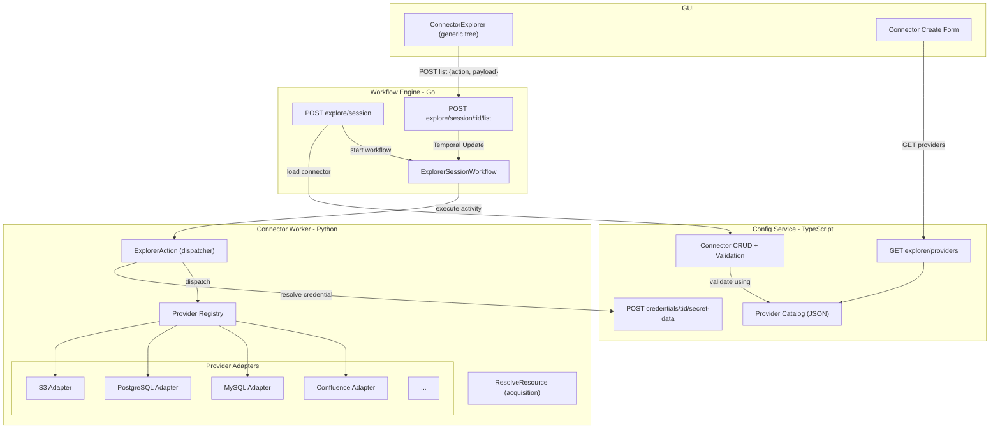
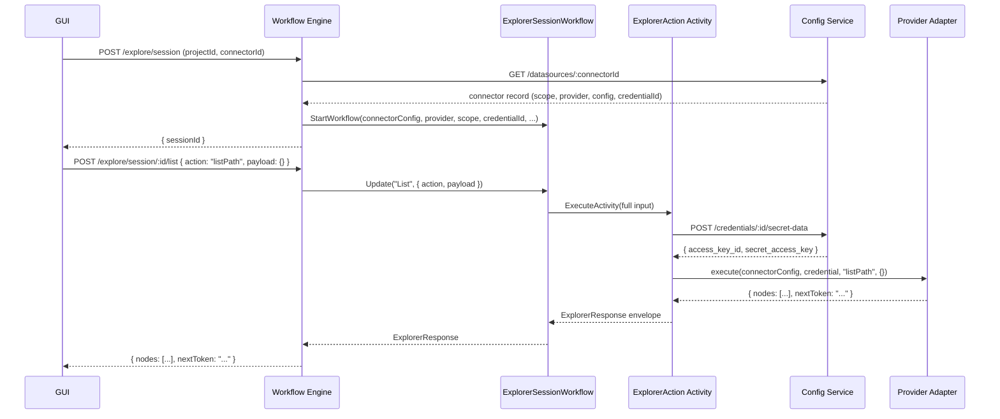
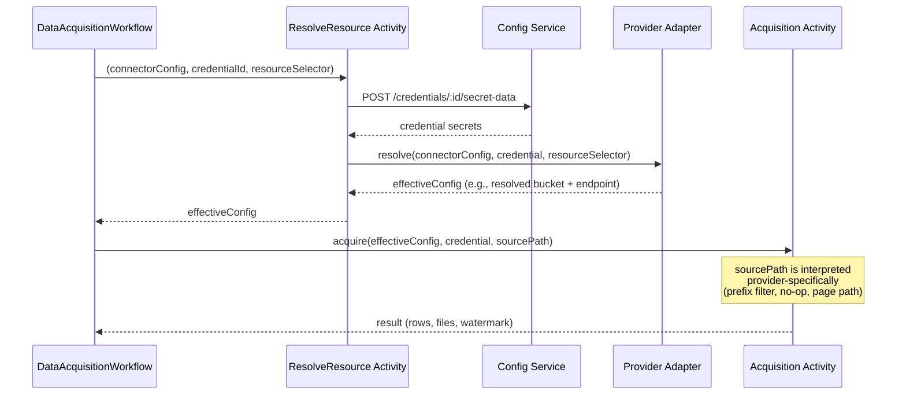

# Connector Explorer: Unified Model and Pluggable Provider Architecture

## Status

**Implemented** | Provider catalog, explorer routes, and GUI tree are in the codebase. Originally proposed March 2026.

Extends [connectors.md](connectors.md) (the current connector system design).

## Problem Statement

The current connector system supports two connector sub-types (`database` and `objectstore`) with flat, hardcoded configuration. Adding a new connector type (e.g., Confluence, Azure Blob, GCS) requires changes in every layer: the `ConnectorConfig` type, the validator, the credential adapter, the workflow-engine routes, individual Temporal activities, and the GUI wizard. There is no unified browsing experience: the only explorer is `S3Explorer`, which is S3-specific and doesn't work for databases or SaaS connectors.

Specific problems:

1. **Hardcoded connector types**: `ConnectorConfig` is a flat union discriminated by `connector_type`. Every new provider means adding fields to this interface, a new branch in the validator, a new credential adapter entry, and new Temporal activities. The cost of adding a provider is proportional to the number of layers, not to the complexity of the provider itself.

2. **No browsing for most connectors**: Database connectors have `discover` and `preview` stubs in the route handler (`connector.go` lines 25-27) but no real implementation. Users cannot browse schemas/tables before creating a dataset. Object-store connectors have `ListObjectStoreFiles` but no tree-structured browsing in the GUI.

3. **No account-scope connectors**: All connectors today are resource-scoped — the connector config contains the specific resource (bucket, database). There's no concept of an "AWS account" connector where the user browses and selects a bucket. This forces users to create one connector per bucket instead of one per account.

4. **Provider-specific GUI code**: `ConnectorWizard.tsx` and `ConnectorTemplates.tsx` hardcode provider-specific form fields. Adding a provider means editing GUI code even if the backend supports it.

5. **No unified explorer tree**: `S3Explorer.tsx` is a standalone page for browsing the internal MinIO store, not external connectors. There is no reusable tree component that works across providers.

## Goals

- **Unified model**: Every connector has `scope` (account | resource) and `provider`. One connector config shape per (scope, provider) combination, validated from a catalog — not hardcoded.
- **Pluggable explorer**: A single `ExplorerAction` Temporal activity dispatches to provider adapters. Adding a new provider = one adapter + one catalog entry. No workflow, route, or GUI changes.
- **Common response schema**: All explorer list operations return `ExplorerNode[]` in a common envelope. The GUI renders a single generic tree.
- **Provider discovery**: A `GET explorer/providers` API lets the GUI discover available providers, their capabilities, and their config schemas. No hardcoded provider lists in the frontend.

## Decision Log

### Rejected: One Activity per Provider

An earlier iteration defined separate Temporal activities per provider (e.g., `ListS3Buckets`, `ListPostgresSchemas`, `ListConfluenceSpaces`). This was rejected because:

- Every new provider adds a new activity registration in the worker, a new workflow branch, and a new route
- The workflow must know all activity names and dispatch accordingly
- The GUI must map provider names to backend activity names
- Testing requires mocking every activity individually

### Rejected: Separate Actions as Separate Activities

Instead of a single `ExplorerAction(action, payload)`, each action (listServices, listResources, listPath, etc.) could be a separate Temporal activity. Rejected because:

- The workflow would need an `if/switch` on action to dispatch the right activity
- Adding a new action type requires workflow changes
- The adapter interface would fragment into many small methods, one per action

### Rejected: Credential Passed as Workflow Input

An earlier design loaded the credential secret at session start and stored it in workflow state. Rejected because:

- Credential secrets in workflow state are persisted to Temporal's database — a security concern
- Long-lived sessions would hold stale credentials (no refresh on rotation)
- The current pattern (resolve at activity time via config-service API) is already proven in acquisition activities

### Rejected: DB-Backed Provider Catalog

Using a database table for the provider catalog was considered for runtime registration of providers. Rejected for the initial implementation because:

- Runtime registration adds deployment complexity (who inserts rows? when?)
- The catalog must match the deployed adapter code; a checked-in JSON file ensures they're deployed together
- A DB-backed catalog is a valid future option when/if plugin-style provider registration is needed

### Chosen: Single Dispatcher Activity + Provider Adapters + JSON Catalog

All explorer list operations go through one `ExplorerAction` activity that dispatches to the correct provider adapter by `(provider, action)`. The provider catalog is a checked-in JSON file loaded by config-service. This gives:

| Concern | Current System | New System |
|---------|---------------|------------|
| Adding a provider | Edit types, validator, credential adapter, activities, workflow, routes, GUI | Add adapter + catalog entry |
| Browsing | S3-only, flat file listing | Generic tree for all providers |
| Validation | Hardcoded `if/else` per connector_type | Schema from catalog |
| GUI forms | Hardcoded per provider | Generated from `connectorConfigSchema` |
| Account scope | Not supported | Supported via `scope: "account"` |

## Architecture

### System Context



### Explorer Session Data Flow



### Acquisition Flow with ResolveResource



## Unified Model

### Scope

Every connector has a **scope** that determines how resources are identified:

| Scope | Connector Config Contains | resourceSelector on Dataset | resolve() Behavior |
|-------|--------------------------|---------------------------|-------------------|
| `resource` | The specific resource (bucket, host+database, spaceKey) | Not required | Returns connectorConfig as-is |
| `account` | Only identity (region, endpoint, base URL) | **Required** | Merges identity + resourceSelector → effectiveConfig |

**Motivation**: Today all connectors are resource-scoped — the user specifies the bucket or database in the connector config. This is fine for a single resource, but AWS users managing 50 buckets must create 50 connectors. Account-scope connectors let one connector represent an AWS account; the user browses buckets in the explorer and the selected bucket becomes the `resourceSelector` on the dataset.

### Provider

The `provider` field replaces the current `connector_type` + `database_type` + `provider` combination. It is a single string that uniquely identifies the backend system:

| Current Fields | New `provider` Value |
|---------------|---------------------|
| `connector_type: "database", database_type: "postgresql"` | `postgresql` |
| `connector_type: "database", database_type: "mysql"` | `mysql` |
| `connector_type: "objectstore", provider: "s3"` | `s3` |
| `connector_type: "objectstore", provider: "gcs"` | `gcs` |
| (new) | `aws` (account-scope S3) |
| (new) | `minio` |
| (new) | `azure` |
| (new) | `confluence` |

### ConnectorConfig Shape

With the new model, `ConnectorConfig` is no longer a flat union. Instead, the shape is defined by `(scope, provider)` and validated against `connectorConfigSchema` from the provider catalog. Examples:

```jsonc
// scope=resource, provider=s3
{
  "scope": "resource",
  "provider": "s3",
  "endpoint": "https://s3.us-east-1.amazonaws.com",
  "bucket": "my-data-bucket",
  "region": "us-east-1"
}

// scope=account, provider=aws
{
  "scope": "account",
  "provider": "aws",
  "region": "us-east-1"
}

// scope=resource, provider=postgresql
{
  "scope": "resource",
  "provider": "postgresql",
  "host": "db.example.com",
  "port": 5432,
  "database": "analytics",
  "schema": "public",
  "ssl_mode": "require"
}

// scope=resource, provider=confluence
{
  "scope": "resource",
  "provider": "confluence",
  "base_url": "https://mycompany.atlassian.net/wiki",
  "space_key": "ENG"
}
```

## Provider Catalog

### Purpose and Format

The provider catalog is a **checked-in JSON file** (`provider-catalog.json`) that serves as the single source of truth for:

1. **Validation**: Config-service validates connector create/update requests against `connectorConfigSchema`
2. **Discovery**: `GET explorer/providers` returns catalog entries so the GUI can render provider dropdowns and config forms
3. **Contract**: Connector-worker adapters implement the actions listed in each catalog entry

The file is co-versioned with code and loaded by config-service at startup.

### Catalog Entry Schema

```typescript
interface ProviderCatalogEntry {
  id: string;                   // e.g., "s3", "postgresql", "confluence"
  label: string;                // e.g., "Amazon S3", "PostgreSQL", "Confluence"
  scopes: ("account" | "resource")[];
  supportedActions: string[];   // ordered; first entry is the initial action for scope=resource
  supportedNodeTypes: string[];
  connectorConfigSchema: Record<string, unknown>;  // JSON Schema per scope
  hasAcquisition: boolean;
  resourceSelectorSchema?: Record<string, unknown>;
}
```

### Example Catalog Entries

```json
[
  {
    "id": "s3",
    "label": "S3-Compatible Object Store",
    "scopes": ["resource"],
    "supportedActions": ["listPath"],
    "supportedNodeTypes": ["folder", "file"],
    "connectorConfigSchema": {
      "resource": {
        "required": ["endpoint", "bucket"],
        "optional": ["region", "prefix"]
      }
    },
    "hasAcquisition": true
  },
  {
    "id": "aws",
    "label": "Amazon Web Services",
    "scopes": ["account"],
    "supportedActions": ["listServices", "listResources", "listPath"],
    "supportedNodeTypes": ["service", "resource", "folder", "file"],
    "connectorConfigSchema": {
      "account": {
        "required": ["region"],
        "optional": ["endpoint"]
      }
    },
    "hasAcquisition": true,
    "resourceSelectorSchema": {
      "required": ["bucket"],
      "optional": ["region"]
    }
  },
  {
    "id": "postgresql",
    "label": "PostgreSQL",
    "scopes": ["resource"],
    "supportedActions": ["listSchemas", "listTables", "describeTable"],
    "supportedNodeTypes": ["schema", "table", "view", "column"],
    "connectorConfigSchema": {
      "resource": {
        "required": ["host", "port", "database"],
        "optional": ["schema", "ssl_mode"]
      }
    },
    "hasAcquisition": true
  },
  {
    "id": "confluence",
    "label": "Confluence",
    "scopes": ["resource"],
    "supportedActions": ["listSpaces", "listPages"],
    "supportedNodeTypes": ["space", "page", "attachment"],
    "connectorConfigSchema": {
      "resource": {
        "required": ["base_url", "space_key"],
        "optional": []
      }
    },
    "hasAcquisition": false
  }
]
```

### Catalog Ownership

The provider catalog is the **source of truth** for capabilities. Adapters must implement the contract defined by their catalog entry. When adding a provider, the catalog entry and adapter are updated together (same PR) so discovery and validation stay in sync.

A DB-backed catalog is a future option if runtime provider registration is needed, but is not required for the initial implementation.

## Pluggable Workflow and Activities

### ExplorerAction Activity

`ExplorerAction` is the **single Temporal activity** for all explorer list operations. It acts as a dispatcher: it resolves the credential, looks up the provider adapter in the registry, and calls `adapter.execute(connectorConfig, credential, action, payload)`.

**Input**:

```typescript
interface ExplorerActionInput {
  projectId: string;
  connectorId: string;          // for logging/tracing only; not re-fetched
  connectorConfig: Record<string, unknown>;
  credentialId: string;
  configServiceUrl: string;     // base URL for internal credential API
  provider: string;
  scope: "account" | "resource";
  action: string;
  payload: Record<string, unknown>;  // action-specific context
}
```

**Credential resolution**: The activity resolves the credential secret by calling config-service's internal credential API: `POST {configServiceUrl}/api/v1/projects/{projectId}/credentials/{credentialId}/secret-data`. This is the existing pattern used by acquisition activities (see `activities/credentials.py`). Credential secrets are resolved fresh on every invocation — never cached across activity calls.

**Error handling**: The activity never throws for business errors (permission denied, credential expired, provider timeout). It catches adapter exceptions and returns a structured error in the same envelope: `{ error: { code, message }, nodes: [] }`. Only programming errors (adapter not found, registry misconfiguration) may propagate as activity failures.

### ResolveResource Activity

`ResolveResource` is a **separate Temporal activity** used exclusively by the acquisition workflow. It is not part of the explorer session.

**Input**:

```typescript
interface ResolveResourceInput {
  projectId: string;
  configServiceUrl: string;
  credentialId: string;
  connectorConfig: Record<string, unknown>;
  resourceSelector: Record<string, unknown>;
}
```

**Behavior**: Resolves the credential, then calls `adapter.resolve(connectorConfig, credential, resourceSelector)` to produce an `effectiveConfig`. For scope=resource, resolve returns the connector config as-is (the config already contains the resource). For scope=account, resolve merges the identity config with the resource selector (e.g., AWS region + selected bucket → S3 endpoint + bucket).

### sourcePath Application

`sourcePath` is **not** a separate adapter method. The acquisition workflow calls `ResolveResource` first (returns effectiveConfig), then passes `sourcePath` as a parameter to the acquisition activity. The acquisition activity interprets sourcePath provider-specifically:

- Object store: prefix filter (e.g., `raw/2024/`)
- Database: no-op (SQL query is the filter)
- Confluence: page path

### Provider Registry and Adapter Interface

The connector-worker holds a **provider registry** — a map from provider ID to adapter instance. At startup, built-in adapters register themselves.

```python
# Pseudocode
class ProviderRegistry:
    _adapters: dict[str, ProviderAdapter] = {}

    def register(self, provider_id: str, adapter: ProviderAdapter):
        self._adapters[provider_id] = adapter

    def get(self, provider_id: str) -> ProviderAdapter:
        adapter = self._adapters.get(provider_id)
        if not adapter:
            raise AdapterNotFoundError(provider_id)
        return adapter

class ProviderAdapter(Protocol):
    def execute(
        self,
        connector_config: dict,
        credential: dict,
        action: str,
        payload: dict,
    ) -> ExplorerResponse:
        """Single method for all list operations."""
        ...

    def resolve(
        self,
        connector_config: dict,
        credential: dict,
        resource_selector: dict,
    ) -> dict:
        """Returns effective config for acquisition. Optional."""
        ...
```

**Scope=resource adapters** only need to implement content actions (listPath, listSchemas, listTables, etc.). They do not implement listServices or listResources. Account-scope adapters implement the full hierarchy.

### ExplorerSessionWorkflow

The workflow has a single Update handler (`List`) that accepts `{ action, payload }` and calls `ExplorerAction` with the full input. The workflow does not branch on action or provider.

```
Workflow input:
  projectId, connectorId, connectorConfig, credentialId,
  configServiceUrl, provider, scope

Update "List" input:
  { action: string, payload: object }

Update handler:
  1. Build ExplorerActionInput from workflow state + update input
  2. Call ExplorerAction activity
  3. Return ExplorerResponse to caller
```

**Concurrency**: Temporal Updates are serialized within a workflow execution. The GUI should serialize expand requests per session (queue client-side). For parallel exploration, the GUI can open multiple sessions for the same connector.

## Explorer Response Schema

### Common Response Envelope

All list operations return the same shape. The list API always returns HTTP 200 so the client has one code path.

```typescript
interface ExplorerResponse {
  nodes: ExplorerNode[];
  nextToken?: string;
  error?: {
    code: string;      // "UNAUTHORIZED", "CREDENTIAL_EXPIRED", "PROVIDER_ERROR", "TIMEOUT"
    message: string;
  };
}
```

- **Success**: `{ nodes: [...], nextToken?: "..." }`
- **Error**: `{ error: { code, message }, nodes: [] }`
- **Empty results**: `{ nodes: [] }`

### ExplorerNode

```typescript
interface ExplorerNode {
  id: string;          // stable ID for tree expand/collapse and selection
  label: string;       // display name
  type: string;        // "service" | "resource" | "folder" | "file" | "schema" | "table" | "view" | "column" | "page" | "attachment"
  kind?: string;       // optional sub-type hint (e.g., "bucket", "parquet")
  childrenHint?: "hasChildren" | "leaf" | "unknown";
  resource?: Record<string, unknown>;   // opaque selection payload
  metadata?: Record<string, unknown>;   // display-only (size, lastModified, engine, ...)
  actions?: string[];  // next actions for this node (e.g., ["listPath"], ["listTables"])
}
```

**Why these fields?**

- `id`: The GUI needs stable IDs for expand/collapse state and deduplication. Using node paths (e.g., `s3://bucket/prefix`) avoids ID collisions across providers.
- `type`: Primary discriminant for rendering. The GUI uses a type-to-icon map. New types get a default icon; the map is updated rarely.
- `kind`: Optional refinement. For example, a `file` node with `kind: "parquet"` can show a different icon than `kind: "csv"`. Adapters can omit `kind` entirely.
- `childrenHint`: Tells the GUI whether to show an expand arrow. Optional because the GUI can derive it from `actions` (any list action → hasChildren). Adapters that can cheaply detect leaf nodes should set it.
- `resource`: The selection payload the GUI stores when the user picks this node as a dataset source. Opaque to the tree; only the resolver and acquisition path interpret it.
- `actions`: Tells the GUI which action to call on expand. If absent, the GUI falls back to type-based inference (folder → listPath, schema → listTables) or provider discovery.
- `metadata`: Flexible key-value for display. The GUI can show a generic metadata panel or tooltip without knowing every key.

### node.resource by Scope

When the user selects a node for a dataset source, the GUI stores `node.resource` differently depending on scope:

| Scope | GUI Stores `node.resource` As | Example |
|-------|------------------------------|---------|
| `account` | `filterSpec.resourceSelector` | `{ bucket: "my-data-bucket" }` |
| `resource` | `filterSpec.sourcePath` | `{ prefix: "raw/2024/" }` |

### node.resource Examples by Provider

| Provider | Scope | Node Selected | node.resource Shape |
|----------|-------|--------------|-------------------|
| S3 | account | bucket | `{ bucket: "my-data-bucket" }` |
| S3 | resource | folder | `{ prefix: "raw/2024/invoices/" }` |
| PostgreSQL | resource | table | `{ schema: "public", table: "users" }` |
| Confluence | resource | page | `{ spaceKey: "ENG", pageId: "123456" }` |
| MinIO | account | bucket | `{ bucket: "ml-artifacts" }` |
| GCS | resource | folder | `{ prefix: "datasets/v2/" }` |

### Pagination

All list actions support `nextToken` in the request payload and the response. When present, the client sends it in the next request (same action) to get more nodes.

## Explorer Session API

### Start Session

`POST /api/v1/projects/:projectId/explore/session`

**Request body**: `{ connectorId: string }`

**Handler flow**:
1. Route handler calls config-service to load the connector record (scope, provider, config, credentialId)
2. Starts `ExplorerSessionWorkflow` with these as workflow input
3. Returns `{ sessionId: string }`
4. No credential secret is loaded at session start

**Workflow ID**: `explorer-{projectId}-{connectorId}-{sessionId}`

### List (Expand Node)

`POST /api/v1/projects/:projectId/explore/session/:sessionId/list`

**Request body**: `{ action: string, payload: object }`

**Handler flow**:
1. Validates session belongs to caller's project
2. Sends Temporal Update to `ExplorerSessionWorkflow`
3. Returns the `ExplorerResponse` from the activity

### Initial Action Convention

The GUI determines the first action to call based on scope and discovery metadata:

- **scope=account**: Call `listServices` (or `listResources` if the provider has no service layer) with empty payload
- **scope=resource**: Call the **first** entry in the provider's `supportedActions` list (e.g., `listPath` for S3, `listSchemas` for PostgreSQL) with empty/minimal payload

For scope=resource adapters: when the payload does not contain resource context (e.g., no bucket), the adapter uses `connectorConfig` as context (e.g., `connectorConfig.bucket` with `payload.prefix` or `""`).

## Provider Discovery API

### GET /api/v1/explorer/providers

Implemented in config-service. Returns provider catalog entries so the GUI can render provider dropdowns and config forms without hardcoding.

**Response**:

```json
{
  "providers": [
    {
      "id": "s3",
      "label": "S3-Compatible Object Store",
      "scopes": ["resource"],
      "supportedActions": ["listPath"],
      "supportedNodeTypes": ["folder", "file"],
      "connectorConfigSchema": { "resource": { "required": ["endpoint", "bucket"], "optional": ["region", "prefix"] } },
      "hasAcquisition": true
    }
  ]
}
```

**Scope**: The catalog is the same for all projects. The endpoint may be served under `/api/v1/projects/:projectId/explorer/providers` for auth purposes, but the response content is project-independent.

## Config-Service Validation

Validation changes from hardcoded `if/else` per connector_type to **schema-driven** validation from the provider catalog:

```
Current:
  if connector_type == "database":
    require host, port, database
    require database_type in [postgresql, mysql]
  if connector_type == "objectstore":
    require provider in [s3, gcs]
    require bucket

New:
  catalog_entry = catalog.get(provider)
  if not catalog_entry:
    reject("unknown provider")
  if scope not in catalog_entry.scopes:
    reject("provider does not support this scope")
  validate connector_config against catalog_entry.connectorConfigSchema[scope]
  validate credential.provider matches connector.provider
```

This means adding a provider requires only adding a catalog entry — no validator code changes.

## Security and Authorization

- **Project membership**: POST explore/session and POST explore/session/:sessionId/list require project membership via the existing auth middleware
- **Session ownership**: The sessionId encodes the projectId in the workflow ID (`explorer-{projectId}-{connectorId}-{sessionId}`). The list endpoint validates session ownership before forwarding
- **Rate limiting**: Max 5 concurrent sessions per (user, project). Enforced by the route handler
- **Credential scoping**: ExplorerAction resolves credentials via `POST /api/v1/projects/{projectId}/credentials/{credentialId}/secret-data` — the projectId in the path ensures cross-project access is impossible
- **No credential caching**: Secrets are resolved fresh on every ExplorerAction invocation. Never stored in workflow state

## Error Handling

- **List API always returns HTTP 200** with the common envelope. Business errors (permission denied, credential expired, provider timeout) are returned as `{ error: { code, message }, nodes: [] }`. Only programming errors (adapter not found) propagate as 5xx.
- **GUI error behavior**: On error envelope, the GUI shows an inline error message at the expanded node (not a global toast). The user can retry by clicking expand again. `UNAUTHORIZED` / `CREDENTIAL_EXPIRED` errors prompt credential update.
- **ResolveResource**: Fails fast with a clear error when `resourceSelector` is missing for scope=account connectors.

## Observability

- Log `connectorId`, `action`, `provider` on every ExplorerAction call (no sensitive payload)
- Log `connectorId`, `datasetId` on resolve/acquisition; redact `resourceSelector`
- Structured logging with correlation IDs from Temporal workflow/activity context

## Session Lifecycle

- TTL / idle timeout: 30 minutes (configurable)
- Optional explicit close signal
- Multiple sessions per (project, connector) allowed
- No persistent state beyond connector metadata — sessions are cheap to create and discard

## Providers Without Acquisition

If a provider's catalog entry has `hasAcquisition: false` (e.g., Confluence before acquisition is implemented), the explorer still works. The GUI disables dataset creation for that connector or shows "coming soon." The discovery API exposes `hasAcquisition` so the GUI can make this decision.

## Adding a New Provider (Checklist)

Adding a new provider (e.g., Azure Blob Storage) requires exactly two changes:

1. **Connector-worker**: Implement a `ProviderAdapter` (the `execute()` method for supported actions, optionally `resolve()` for account-scope). Register it in the provider registry.
2. **Provider catalog**: Add an entry to `provider-catalog.json` with id, label, scopes, supportedActions, connectorConfigSchema, hasAcquisition.

**No changes needed in**:
- Workflow code (ExplorerSessionWorkflow)
- Route handlers (connector.go)
- GUI tree component (ConnectorExplorer)
- Config-service validator (reads from catalog)
- GUI connector wizard (reads connectorConfigSchema from discovery)

Optional: add a type-to-icon mapping in the GUI for any new node types the provider introduces.

## Implementation Order

| Phase | Task |
|-------|------|
| 1a | **Data model + catalog + validation**: Add `scope` and `provider` to connector config. Create `provider-catalog.json` with initial entries (s3, postgresql, mysql). Update config-service validator to read from catalog. Enforce credential-provider match. |
| 1b | **Registry + activities + adapter interface**: Implement provider registry in connector-worker. Implement `ExplorerAction` activity (single dispatcher, full input, error envelope). Implement `ResolveResource` activity (separate, acquisition-only). Define adapter interface (`execute` + `resolve`). |
| 2 | **Explorer response schema**: Define `ExplorerNode` and `ExplorerResponse` types in all languages. Document in API specification. |
| 3 | **Provider discovery API**: Implement `GET explorer/providers` in config-service reading from catalog. Include `connectorConfigSchema` in response. Seed initial providers. |
| 4 | **Explorer session workflow**: Implement `ExplorerSessionWorkflow` with single Update handler. Implement list route (`POST explore/session/:id/list`). Wire to `ExplorerAction` with full input. |
| 5 | **Adapters (scope=resource)**: Implement S3 adapter (listPath) and PostgreSQL/MySQL adapters (listSchemas, listTables, describeTable). Only content actions; payload-only context. ResolveResource adapter-based. |
| 6 | **GUI**: Build generic `ConnectorExplorer` tree component. Render from `ExplorerNode[]`. On select, store `node.resource` as resourceSelector (account) or sourcePath (resource). Use provider discovery for connector create. |
| 7 | **Account scope (AWS)**: Implement AWS adapter with listServices, listResources (buckets), listPath. Account-scope resolve (merge region + bucket). |
| 8 | **Additional providers**: MinIO, Azure, GCS, Confluence. Each: adapter + catalog entry. Confluence: `hasAcquisition: false` until acquisition is implemented. |

## Files to Touch

- **Config-service**:
  - `provider-catalog.json` (new) — provider catalog
  - `types/dataSource.ts` — add `scope` and `provider` fields; update `ConnectorConfig` shape
  - `validators/dataSourceValidator.ts` — replace hardcoded validation with catalog-driven schema validation
  - `routes/` — add `GET explorer/providers` route
  - `providers/connector.ts` — update credential adapter to use catalog

- **Connector-worker**:
  - `registry.py` (new) — provider registry
  - `adapters/` (new directory) — one file per provider adapter
  - `activities/explorer.py` (new) — `ExplorerAction` activity (dispatcher)
  - `activities/resolve.py` (new) — `ResolveResource` activity
  - `temporal_worker.py` — register new activities

- **Workflow-engine**:
  - `internal/workflows/explorer_session.go` (new) — `ExplorerSessionWorkflow` with Update handler
  - `internal/server/routes/connector.go` — add explore/session routes
  - `pkg/types/explorer.go` (new) — Go type definitions for ExplorerNode, ExplorerResponse, ExplorerActionInput

- **GUI**:
  - `components/explorer/ConnectorExplorer.tsx` (new) — generic tree component
  - `components/wizard/ConnectorWizard.tsx` — use provider discovery for form generation
  - `services/api.ts` — add explorer API client methods

## Testing Strategy

- **Unit tests**: Test each adapter with mocked credentials. Verify `ExplorerNode` shape for each action. Test error envelope generation.
- **Registry tests**: Verify adapter lookup, missing adapter error.
- **Catalog validation tests**: Verify config-service rejects unknown providers and invalid configs per catalog schema.
- **Integration test**: Start a MinIO instance, create an S3 adapter, verify the full flow (session start → listPath → response) returns the common schema. Assert the GUI can render the nodes without provider-specific branches.
- **GUI tests**: Verify the tree renders `ExplorerNode[]` generically. Verify selection stores `node.resource` correctly per scope.
