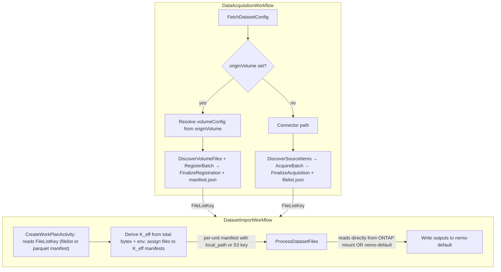
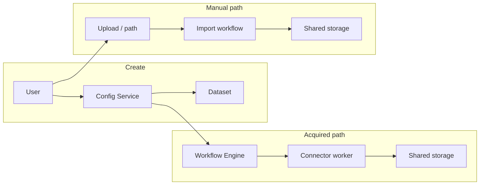

# Dataset design

Datasets use Config Service, Storage, and (for acquired data) the Workflow Engine and connectors as described in [Platform HLD](platform-hld.md). This doc covers dataset kinds, lifecycle, catalog and storage, and data acquisition.

## Doc map

- **Overview and role** — What datasets are and how they fit in the platform.
- **Kinds** — Structured (Iceberg/catalog) vs unstructured (file collection).
- **Lifecycle** — Create → catalog/setup → import/process → ready (or errored).
- **Catalog and storage** — How dataset (logical), catalog (metadata), and storage (bytes) relate.
- **Acquisition** — Connectors, DataAcquisitionWorkflow, DatasetImportWorkflow; manual datasets.
- **Manual upload resilience** — Create-then-upload, ghost rows, resume-on-retry, cleanup invariants.
- **Implementation notes** — Key code and related docs.
- **References** — Internal and external links.

## When to read what

- **Implementing dataset creation or import?** → §Lifecycle, §Acquisition, and Config Service / workflow-engine code.
- **Understanding where data lives?** → §Catalog and storage and [platform-hld.md](platform-hld.md).
- **Connecting acquired data to a connector?** → §Acquisition and [connectors.md](connectors.md).
- **Manual uploads, large file counts, or retry after failure?** → §Manual upload resilience.

---

## Part A — Overview and role

### What datasets are

A **dataset** is the logical representation of data in the platform: a named unit that can be **structured** (an [Apache Iceberg](https://iceberg.apache.org/) table registered in a catalog) or **unstructured** (a file collection under a path). Datasets are the input to pipelines and knowledge bases; they are created **manually** (user uploads or provides a path) or **acquired** from an external source via a [connector](connectors.md) on a schedule or on demand.

---

## Part B — Kinds and lifecycle

### Kinds

- **Structured** — A catalog table (warehouse, namespace, table name) with Parquet/Iceberg data. The Config Service and catalog (e.g. Lakekeeper) manage registration; the import workflow processes source data into table form. See [config-service DataSet model](../../src/nemo/config-service/models/DataSet.ts): `kind: 'structured'`, catalog fields (`warehouseName`, `namespace`, `catalogTableName`, `catalogTableRef`), status.
- **Unstructured** — Files under a prefix (e.g. in project storage); optional manifest. No catalog table; the KB pipeline or other consumers read files directly. DataSet: `kind: 'unstructured'`, `bucketName` (or storage path), optional `filterSpec`, `fileProcessors`.

### Source types

A dataset is sourced from one of three origins:

| Source | Entity field | Acquisition path |
|--------|-------------|-----------------|
| Connector (DB / objectstore) | `originConnector` → DataSource id | DataAcquisitionWorkflow → connector-worker copies data into project storage |
| Volume (ONTAP / NFS mount) | `originVolume` → volume DataSource id | DataAcquisitionWorkflow → `RegisterVolumeFiles` (zero-copy; records paths only) |
| Manual upload | neither | User uploads files; import triggered explicitly |

`originConnector` and `originVolume` are mutually exclusive; the validator rejects requests that set both. Volume-sourced datasets do not require a `credentialId` — access is via the mounted PVC.

### Lifecycle

1. **Create** — User creates dataset via GUI/API (type: acquired or manual, kind: structured or unstructured).
2. **Catalog/setup** — For structured datasets, Config Service creates warehouse/namespace/table in the catalog when applicable.
3. **Import/process** — For acquired: [DataAcquisitionWorkflow](connectors.md#acquisition-workflow) + DatasetImportWorkflow. For manual: user uploads or places files; import is triggered explicitly (e.g. DatasetImportWorkflow).
4. **Ready or errored** — Status: `in_progress`, `ready`, `errored`, `deprecated`. When ready, the dataset is available to pipelines, KBs, and workspaces.

### Catalog and storage

For structured data we use a **catalog** (e.g. Lakekeeper) to register tables (warehouse, namespace, table name). Data files live on the **shared filesystem** (S3 or NAS) under project/dataset paths. So: *dataset* = logical entity in Config Service; *catalog* = metadata for query/table APIs; *storage* = where bytes live. Storage is configured per project or deployment; we do not treat "buckets" as a first-class entity in this design (see [Platform HLD](platform-hld.md)).

---

## Part C — Acquisition

### Acquired datasets

Acquired datasets use a **connector** (`originConnector` → DataSource id) or a **volume** (`originVolume` → volume DataSource id). The [connectors](connectors.md) doc describes connector config, credentials, scheduling, and incremental (watermark) acquisition.

**Connector path:** user configures dataset with `originConnector`, optional `sqlQuery`, `acquisitionConfig`, `scheduleConfig` → on trigger or schedule, Workflow Engine runs DataAcquisitionWorkflow → connector-worker pulls from DB or object store → copied payloads land under `projects/<projectId>/datasets/<datasetId>/data_files/` → `FinalizeAcquisition` writes acquisition metadata (including `filelist.json`) under `projects/<projectId>/datasets/<datasetId>/_acquisition/` → `DatasetImportWorkflow` receives `FileListKey` → `CreateWorkPlanActivity` reads the pre-built list → scatter-gather processing.

**Volume path (zero-copy, streaming):** user configures dataset with `originVolume` → DataAcquisitionWorkflow runs concurrent `DiscoverVolumeFiles` + `RegisterBatch` workers (Redis-backed dir queue + item stream) → `FinalizeRegistration` writes parquet-partitioned `manifest.json` under `projects/<projectId>/datasets/<datasetId>/_acquisition/` → child `DatasetImportWorkflow` receives that key as `FileListKey` → `CreateWorkPlanActivity` loads file entries from the manifest (URIs / paths point at the ONTAP mount) → dataset-processor reads volume files in place without copying into nemo-default.

**FileListKey flow:** Acquisition metadata lives under **`projects/<projectId>/datasets/<datasetId>/_acquisition/`** (sibling of `data_files/`). Streaming object store finalize writes **`filelist.json`** there; volume streaming finalize writes **`manifest.json`** (parquet-partitioned index). The key is passed as `FileListKey` through `DatasetImportWorkflowInput` → `CreateWorkPlanInput`. When `FileListKey` is empty (e.g. retry import), `CreateWorkPlanActivity` first looks for `_acquisition/filelist.json` then `_acquisition/manifest.json` under that dataset prefix, then falls back to listing `data_files/`. KB workloads still list `data_files/` only when no key is set.

**Incremental volume acquisition:** Uses `mtime` watermark via `acquisitionConfig.lastWatermarkValue` (ISO 8601 timestamp). Discovery/register workers skip files with `st_mtime ≤` watermark; the workflow persists `maxMtime` via `UpdateDatasetWatermarkActivity` for the next run.

### Manual datasets

User creates a dataset without a connector; uploads or places files in the dataset’s data path. Import is triggered explicitly (e.g. GUI or API calls import); DatasetImportWorkflow processes files and updates catalog or metadata.

### Manual upload resilience (GUI)

The **Create Dataset** wizard in the GUI uses a **create-then-upload** sequence so the Config Service assigns a dataset **id** before any bytes are written. S3 object keys include that id (e.g. `…/datasets/<datasetId>/data_files/…`), so the record must exist first.

**Flow:** `POST /datasets` (metadata only, no `uploadedFiles`) → parallel S3 uploads → register files on the **draft manifest** → manifest commit / import.

**Large request bodies:** A single `PUT /datasets/:id` with tens of thousands of `uploadedFiles` entries can exceed Express’s default JSON body limit (~100kb) or stress proxies. Config Service sets **`EXPRESS_JSON_BODY_LIMIT`** (default **64mb** in Helm). The GUI also **chunks** registration: for more than **800** files it uses `PUT …/manifests/:id/source-uris` (first chunk) and `POST …/manifests/:id/append-source-uris` (remaining chunks), each carrying **URIs only**—smaller than full file objects and **without** triggering dataset-level auto-commit between chunks. The wizard still calls **commit** once at the end.

**Ghost datasets:** If the user uploads many files and a step fails (network, duplicate path validation, partial upload errors), some code paths **return** from the submit handler without throwing. The dataset row already exists in Config Service with the chosen name. A second `POST` with the same name hits `checkDuplicateName` and returns **409** (“DataSet with this name already exists in this project”), even though the failure was mid-upload, not a true duplicate intent.

**Resume-on-retry:** While the wizard stays open, the GUI keeps `createdDatasetId` for the row created on the first submit. On a later **Retry**, it **does not** call `POST` again. It **PUT**s the same id to sync metadata (user may have changed name or options), **GET**s the dataset, then continues uploads. Per-file progress is persisted in **localStorage** (`loadManualUploadResume` / `saveManualUploadResumeEntry`) so completed blobs are skipped on retry. If PUT/GET fails with **404** only, the client clears `createdDatasetId` and performs a fresh **POST**; transient or other HTTP errors rethrow so `createdDatasetId` is preserved (a broad catch that always fell back to POST caused a false **409 duplicate name** when the row still existed).

**Cleanup invariants:** Deleting the in-progress dataset happens only on **explicit wizard cancel** (`onClose`), not on every API error in `catch`—otherwise a transient failure would delete the row and all successfully uploaded objects, defeating resume. **Early returns** after create still leave a row until cancel or manual delete from the list; retry reuses that row.

**Name uniqueness (Step 1):** Before advancing past Basic Info, the GUI checks the in-memory project dataset list for a conflicting name. This is a **UX shortcut**; Config Service remains authoritative (`checkDuplicateName`). The check **excludes** the dataset id in `createdDatasetId` so the ghost row from the current session does not block the user from moving to the next step.

**Implementation:** [ProjectDatasets.tsx](../../src/nemo/gui/src/pages/ProjectDatasets.tsx), Config Service [DataSetValidator.checkDuplicateName](../../src/nemo/config-service/services/DataSetValidator.ts).

---

## Implementation notes

- **Config Service:** [DataSetService](../../src/nemo/config-service/services/DataSetService.ts), [DataSet model](../../src/nemo/config-service/models/DataSet.ts). The DataSet entity includes `originVolume` (varchar, nullable) for volume-sourced datasets.
- **GUI:** [ProjectDatasets](../../src/nemo/gui/src/pages/ProjectDatasets.tsx), dataset API (list, get, create, update, delete, import). Manual upload resilience: see §Manual upload resilience. Volume source selection in the dataset creation wizard is planned (Phase 1A-9).
- **Workflows:** workflow-engine [data_acquisition.go](../../src/nemo/workflow-engine/internal/workflows/data_acquisition.go) branches on `originVolume` for zero-copy volume acquisition (streaming discover/register + `FinalizeRegistration`); [dataset_import.go](../../src/nemo/workflow-engine/internal/workflows/dataset_import.go) passes `FileListKey` to `CreateWorkPlanActivity`. connector-worker [acquisition_pipeline.py](../../src/nemo/workers/connector-worker/activities/acquisition_pipeline.py) implements those activities plus connector `FinalizeAcquisition` (`filelist.json` under the dataset `_acquisition/` prefix). See [connectors.md](connectors.md), [knowledge-base.md](knowledge-base.md) for how datasets feed KB creation.
- **HLD:** [docs/HLD.md](../HLD.md) entities section for consistency with platform concepts.

---

## References

- **Internal:** [Platform HLD](platform-hld.md), [connectors.md](connectors.md), [knowledge-base.md](knowledge-base.md), [docs/HLD.md](../HLD.md), DataSetService, ProjectDatasets.
- **External:** [Apache Iceberg](https://iceberg.apache.org/). Lakekeeper is an internal catalog; S3/object storage as in platform-hld.
