# Express Mount and Guards Interactions Flow

Complete visual diagrams showing how Express.js routers are mounted and how the unified guard middleware processes requests.

---

## Diagram 1: Express App Bootstrap & Mount Structure

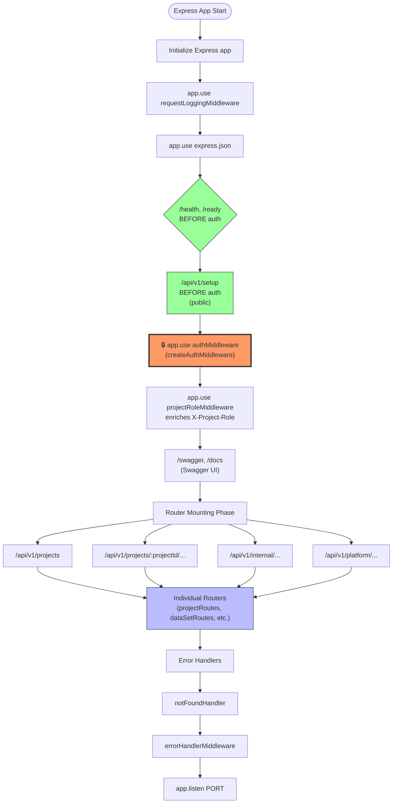

---

## Diagram 2: Router-Level Guard Application

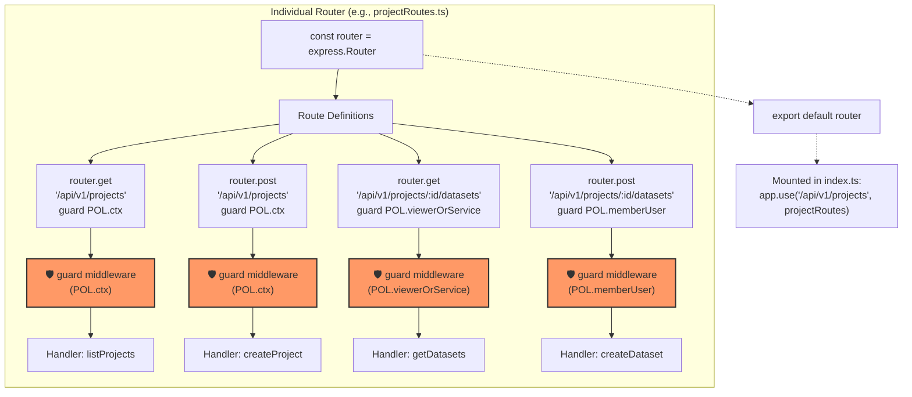

---

## Diagram 3: Unified Guard Decision Flow (Complete)

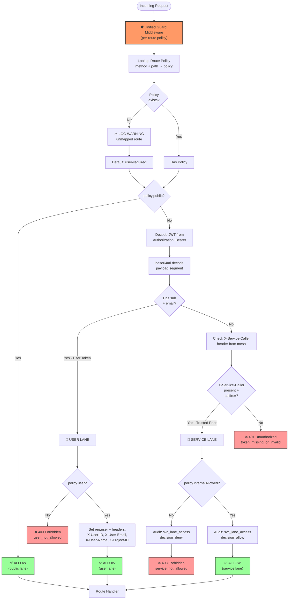

---

## Diagram 4: Policy Types & Route Examples

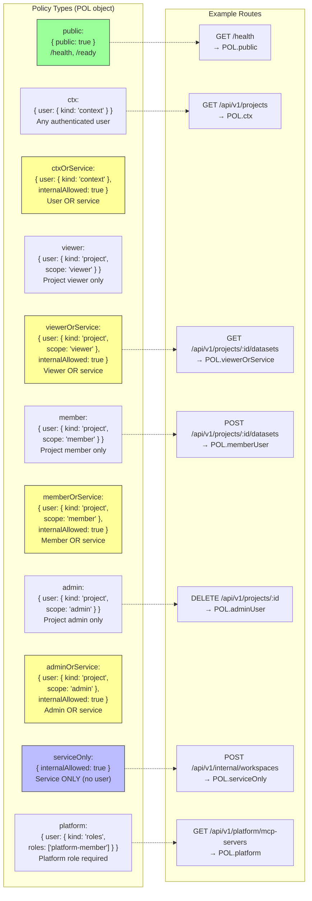

---

## Diagram 5: Complete Request Flow (North-South vs East-West)

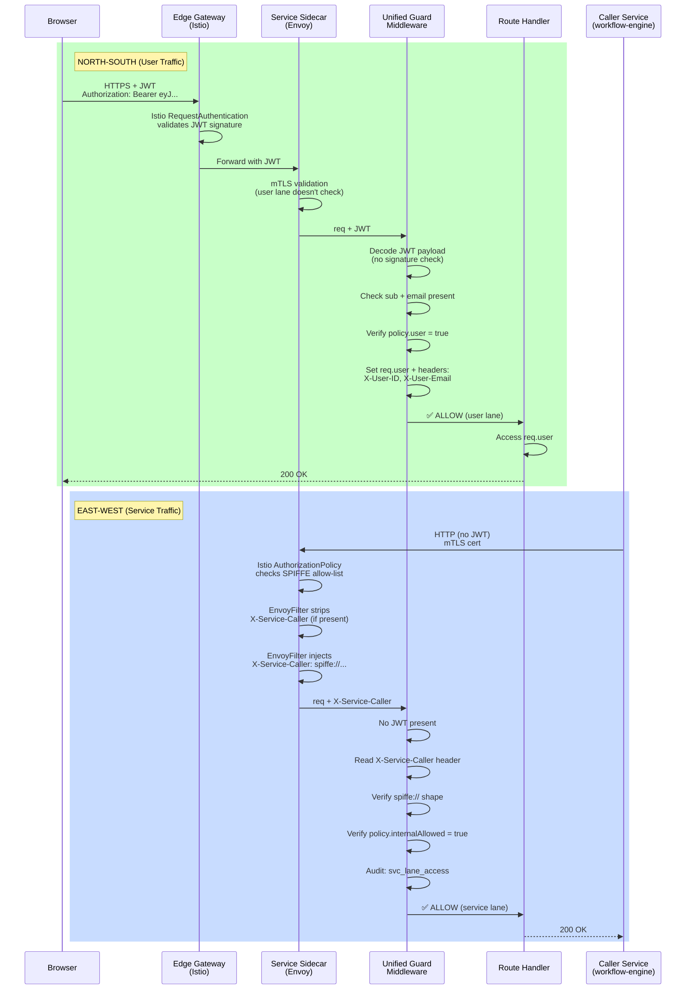

---

## Diagram 6: Middleware Stack Execution Order

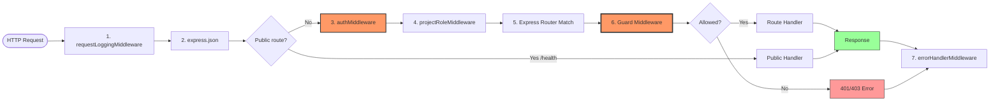

---

## Diagram 7: Guard Policy Evaluation Logic (Code Structure)

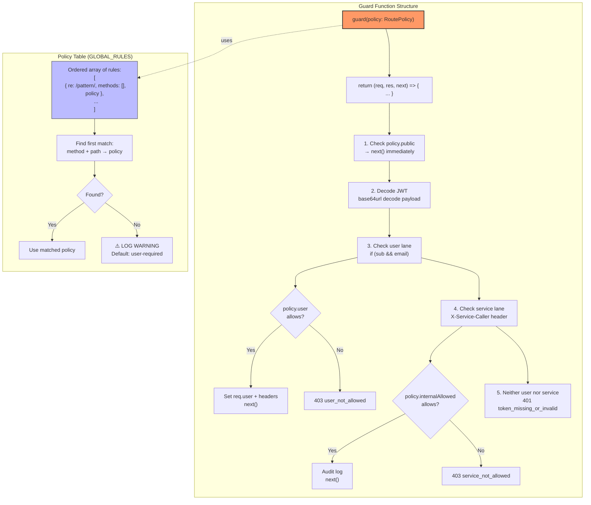

---

## Diagram 8: Multi-Route Guard Example (Workflow)

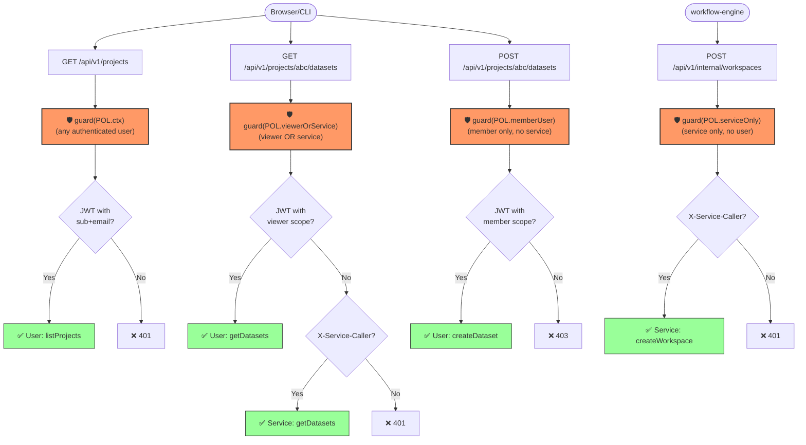

---

## Summary

### Key Concepts:

1. **Express Mount Hierarchy:**
   - Global middleware (logging, JSON parsing)
   - Public routes (health, setup) BEFORE auth
   - authMiddleware (JWT decode + validation)
   - projectRoleMiddleware (enrich role)
   - Router mounting with per-route guards

2. **Guard Middleware:**
   - Applied per-route (not globally)
   - Takes RoutePolicy as parameter
   - Returns Express middleware function
   - Evaluates public → user → service → deny

3. **Three Lanes:**
   - **Public:** No credentials required (/health, /ready)
   - **User:** JWT with sub + email (north-south)
   - **Service:** X-Service-Caller SPIFFE (east-west)

4. **Decode-Only:**
   - Guard never verifies JWT signature
   - Istio sidecar already validated at gateway/hop
   - Guard only base64url decodes payload
   - Trusts mesh-injected X-Service-Caller

5. **Policy Types:**
   - User-only: `{ user: { ... } }`
   - Service-only: `{ internalAllowed: true }`
   - Dual-lane: `{ user: { ... }, internalAllowed: true }`
   - Public: `{ public: true }`

6. **Execution Order:**
   - requestLoggingMiddleware
   - express.json
   - authMiddleware (if not health/setup)
   - projectRoleMiddleware
   - **Router matching**
   - **Per-route guard middleware** ← THIS IS THE KEY
   - Route handler
   - errorHandlerMiddleware

The guard is **not a global middleware** — it's applied individually to each route with the appropriate policy! 🎯

---
---

# Part 2: Complete Request Flows After PR #274

This section shows end-to-end flows through the entire stack (Istio mesh + application guards) AFTER PR #274 mesh hardening is merged.

Complete flow diagrams showing how requests are processed AFTER PR #274 mesh hardening is merged and enabled.

**Key Changes in PR #274:**
- ❌ Drops `agentstudio-workers` namespace exemption
- ✅ Adds per-pair service allow-list (explicit caller→target principals)
- ✅ Injects `X-Service-Caller` header via EnvoyFilter (verified SPIFFE)
- ✅ User JWT lane unchanged (still works)
- ✅ Path exemptions unchanged (health, setup, metrics)

---

## Scenario 1: Browser → API (North-South, User Lane)

**Status:** ✅ **NO CHANGE** - User traffic unaffected by PR #274

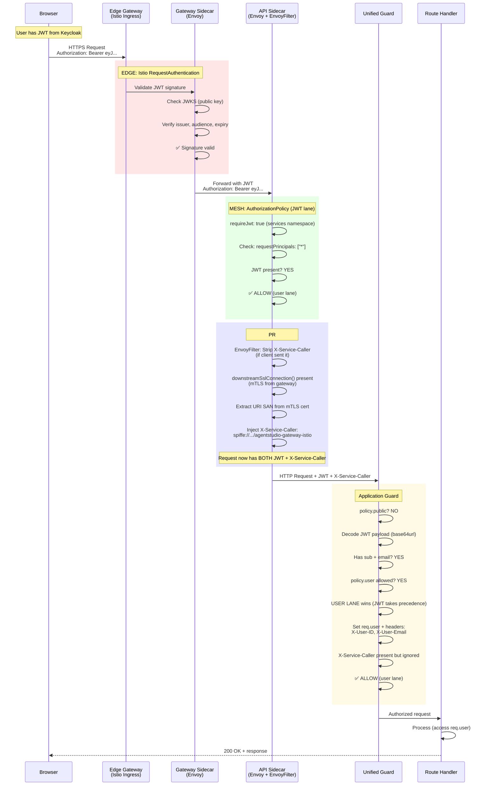

**IMPORTANT CLARIFICATION:**

Even on the **user lane** (browser traffic), the `X-Service-Caller` header **IS injected** because:
- Gateway → Service hop is **mTLS** (both are in the mesh)
- EnvoyFilter sees `downstreamSslConnection()` present
- Injects `X-Service-Caller: spiffe://.../agentstudio-gateway-istio`

**The request has BOTH headers:**
- `Authorization: Bearer <JWT>` - User identity (sub, email, roles)
- `X-Service-Caller: spiffe://.../agentstudio-gateway-istio` - Gateway identity

**Guard behavior:**
- Checks JWT first → Has sub + email → **User lane wins**
- Sets `req.user` from JWT
- **Ignores `X-Service-Caller`** (user lane takes precedence)
- Result: User authenticated, gateway identity logged but not used for authz

**Why this is correct:**
- `X-Service-Caller` shows which service made the hop (gateway forwarding user request)
- User identity (JWT) is what matters for authorization
- Service identity (X-Service-Caller) is useful for audit logs, observability

**Key Points:**
- ✅ User JWT lane **unchanged** by PR #274
- ✅ Matches `requestPrincipals: ["*"]` rule (JWT present)
- ✅ X-Service-Caller **IS injected** (gateway→service = mTLS hop)
- ✅ Application guard sees **BOTH** JWT + X-Service-Caller
- ✅ **User lane wins** - JWT takes precedence, X-Service-Caller ignored for authz
- 📊 X-Service-Caller useful for audit logs (which service forwarded the request)

---

## Scenario 2: Worker → API (East-West, Service Lane) - AFTER PR #274

**Status:** 🔄 **MAJOR CHANGE** - Namespace exemption removed, explicit allow-list required

### **2a. Allowed Worker (in allow-list) ✅**

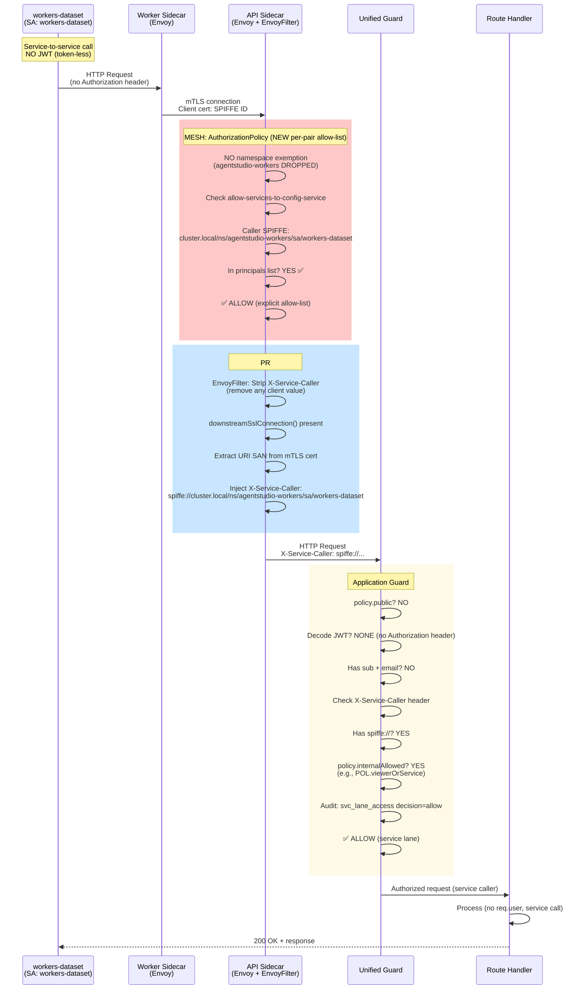

**Key Changes:**
- ❌ **NO namespace exemption** (workers namespace exemption DROPPED)
- ✅ **Explicit allow-list check** (worker SA must be in principals list)
- ✅ **X-Service-Caller injected** (verified SPIFFE from mTLS cert)
- ✅ **Application guard** reads X-Service-Caller, allows if `internalAllowed: true`

---

### **2b. Non-Allowed Worker (NOT in allow-list) ❌**

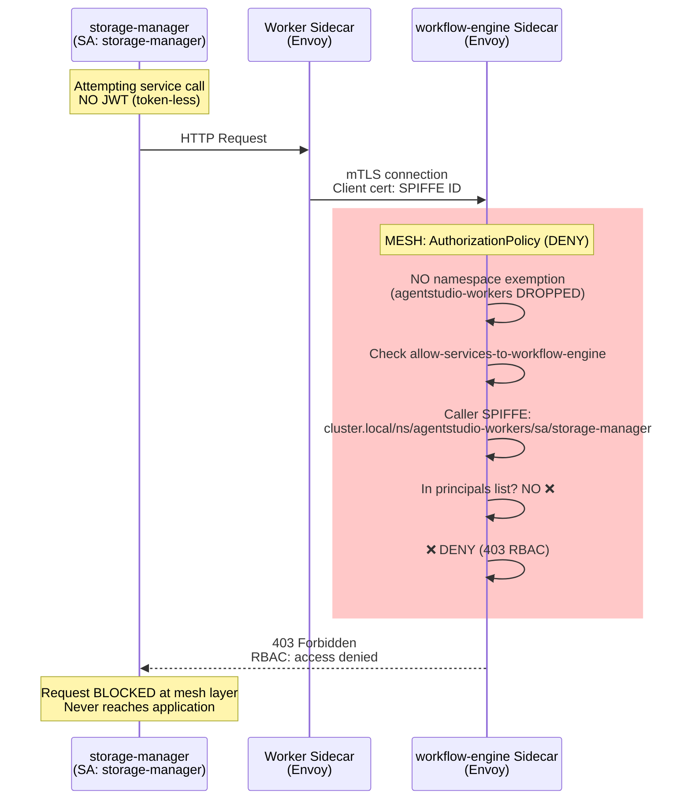

**Key Changes:**
- ❌ **Caller NOT in allow-list** → 403 RBAC at mesh layer
- ❌ **Request never reaches application** (blocked by Istio)
- ✅ **Zero-trust enforcement** (only known flows allowed)

---

## Scenario 3: Health Probe → API (Path Exemption)

**Status:** ✅ **NO CHANGE** - Path exemptions still work

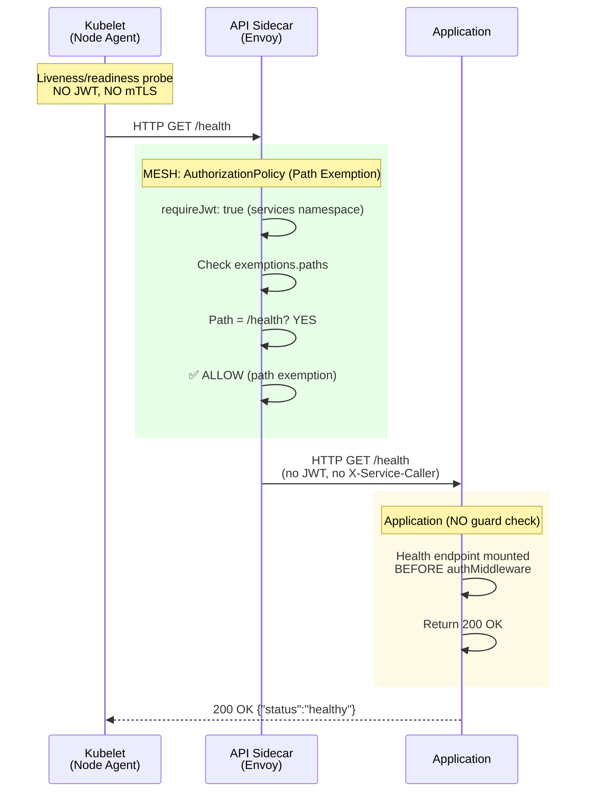

**Key Points:**
- ✅ Path exemption **unchanged** by PR #274
- ✅ `/health` always accessible (no JWT, no mTLS needed)
- ✅ Application handles health check before auth middleware

---

## Scenario 4: Edge Gateway → Service (Internal Hop)

**Status:** ✅ **WORKS** - Edge namespace still exempted

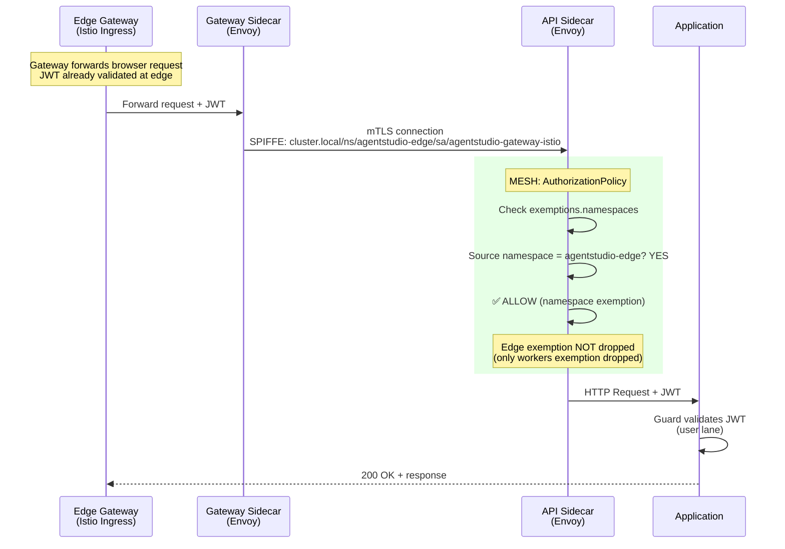

**Key Points:**
- ✅ `agentstudio-edge` namespace exemption **still exists**
- ✅ Gateway can forward requests without JWT on the gateway pod itself
- ✅ User JWT forwarded from browser, validated by application

---

## Comparison Table: Before vs After PR #274

| Scenario | Traffic Type | Before PR #274 | After PR #274 | Change |
|----------|--------------|----------------|---------------|--------|
| **Browser → API** | North-South (User) | ✅ JWT required | ✅ JWT required | ✅ No change |
| **Worker → API (in allow-list)** | East-West (Service) | ✅ Namespace exemption | ✅ Explicit allow-list | 🔄 Tightened (zero-trust) |
| **Worker → API (NOT in allow-list)** | East-West (Service) | ✅ Namespace exemption (ALL workers allowed) | ❌ 403 RBAC (DENIED) | 🔄 Major change (security hardening) |
| **Health Probe → API** | Infrastructure | ✅ Path exemption | ✅ Path exemption | ✅ No change |
| **Edge Gateway → API** | North-South (Proxy) | ✅ Namespace exemption | ✅ Namespace exemption | ✅ No change |
| **Monitoring → API** | Infrastructure | ✅ Namespace exemption | ✅ Namespace exemption | ✅ No change |

---

## Authorization Policy Flow: Before vs After

### **Before PR #274 (Permissive)**

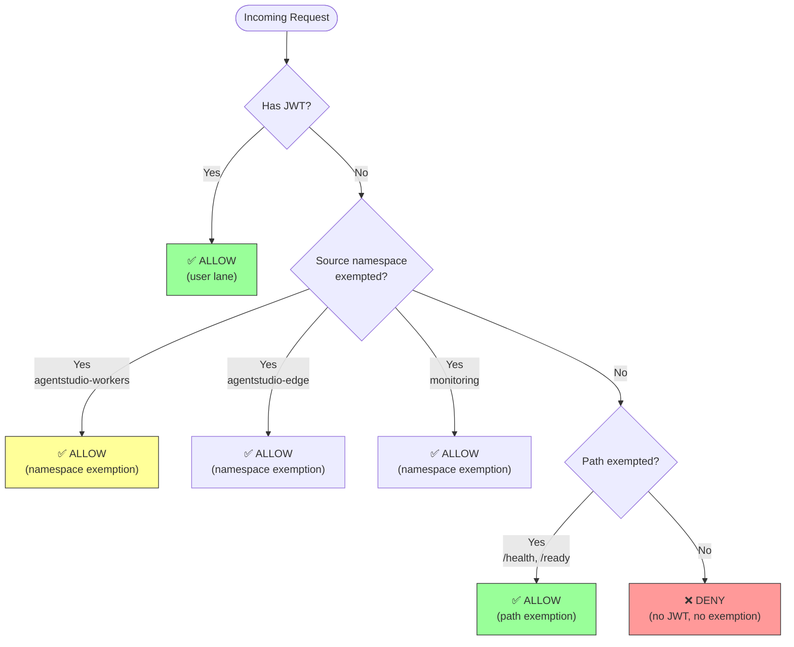

**Problem:** ANY worker pod can call ANY service (blanket trust)

---

### **After PR #274 (Zero-Trust)**

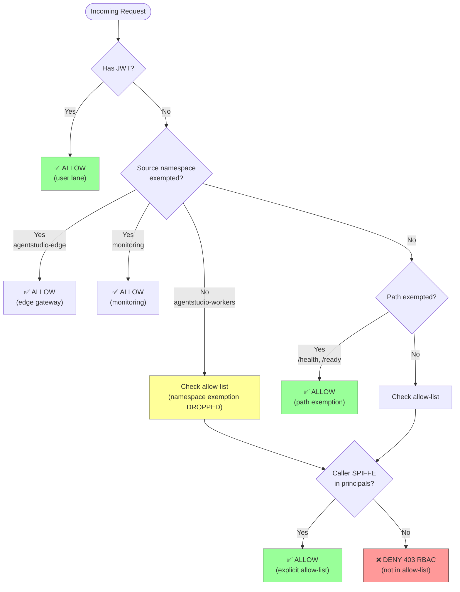

**Security:** Only explicitly allow-listed caller→target pairs succeed

---

## X-Service-Caller Injection Flow (PR #274)

```mermaid
flowchart LR
    Request([Service Request]) --> Filter[EnvoyFilter SIDECAR_INBOUND]
    
    Filter --> Strip[1. Strip X-Service-Caller]
    
    Strip --> CheckSSL{mTLS?}
    
    CheckSSL -->|No| NoInject[No injection]
    
    CheckSSL -->|Yes| Extract[2. Extract URI SAN]
    
    Extract --> Verify[3. Verify SPIFFE shape]
    
    Verify --> Inject[4. Inject X-Service-Caller]
    
    Inject --> App[To Application]
    NoInject --> App
    
    App --> Guard[Application Guard]
    
    Guard --> Check{internalAllowed?}
    
    Check -->|Yes + header| Allow[✅ ALLOW]
    Check -->|No| Deny[❌ 403]
    
    style Strip fill:#f96,stroke:#333,stroke-width:2px
    style Inject fill:#9f9,stroke:#333
    style Allow fill:#9f9,stroke:#333
    style Deny fill:#f99,stroke:#333
```

---

## Summary: What PR #274 Changes

### **✅ User Traffic (North-South):**
- **NO CHANGE** - JWT validation unchanged
- Users still authenticate with Keycloak tokens
- Application guard still decodes JWT and checks permissions

### **🔄 Service Traffic (East-West):**
- **MAJOR CHANGE** - Workers namespace exemption DROPPED
- Workers must be explicitly allow-listed per target service
- X-Service-Caller header injected with verified SPIFFE
- Application guard reads X-Service-Caller for service lane

### **✅ Infrastructure Traffic:**
- **NO CHANGE** - Path exemptions still work
- Health probes, metrics, setup endpoints unchanged
- Edge gateway, monitoring namespace exemptions unchanged

### **🔒 Security Improvement:**
- **Before:** ANY worker → ANY service (blanket trust)
- **After:** ONLY allow-listed caller→target pairs (zero-trust)
- **Result:** Smaller attack surface, clear service dependency graph

---

## Rollout Checklist

**Before enabling `meshServiceAuthz.enabled: true`:**

1. ✅ Verify all production flows in allow-list
2. ✅ Test in dev with `--set meshServiceAuthz.enabled=true`
3. ✅ Monitor for 403 RBAC errors (missing allow-list entries)
4. ✅ Validate X-Service-Caller injection working (check logs)
5. ✅ Confirm unified guards deployed (config-service, workflow-engine)
6. ✅ Verify no unexpected service-to-service calls failing

**Safe rollout:**
- Merge with `enabled: false` (no behavioral change)
- Enable in dev/staging first
- Validate all flows work
- Enable in production with monitoring
- Rollback: flip `enabled: false` if issues found

---

**The flows show PR #274 achieves zero-trust mesh security while preserving all legitimate user and infrastructure traffic patterns.** 🎯
