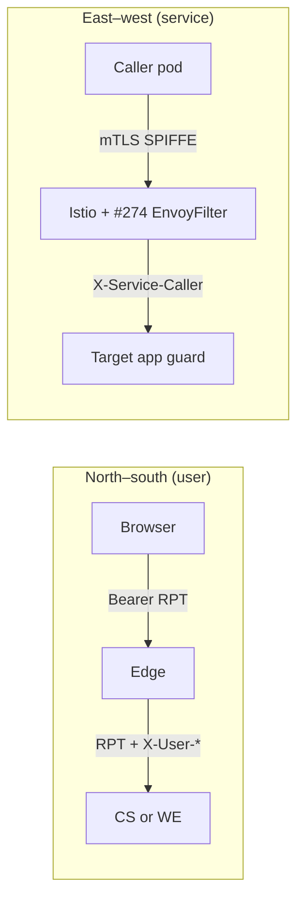
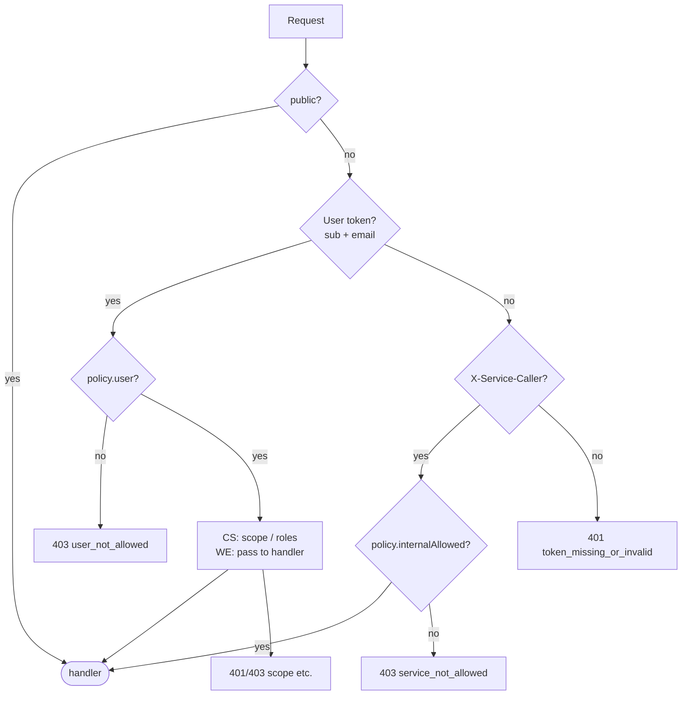
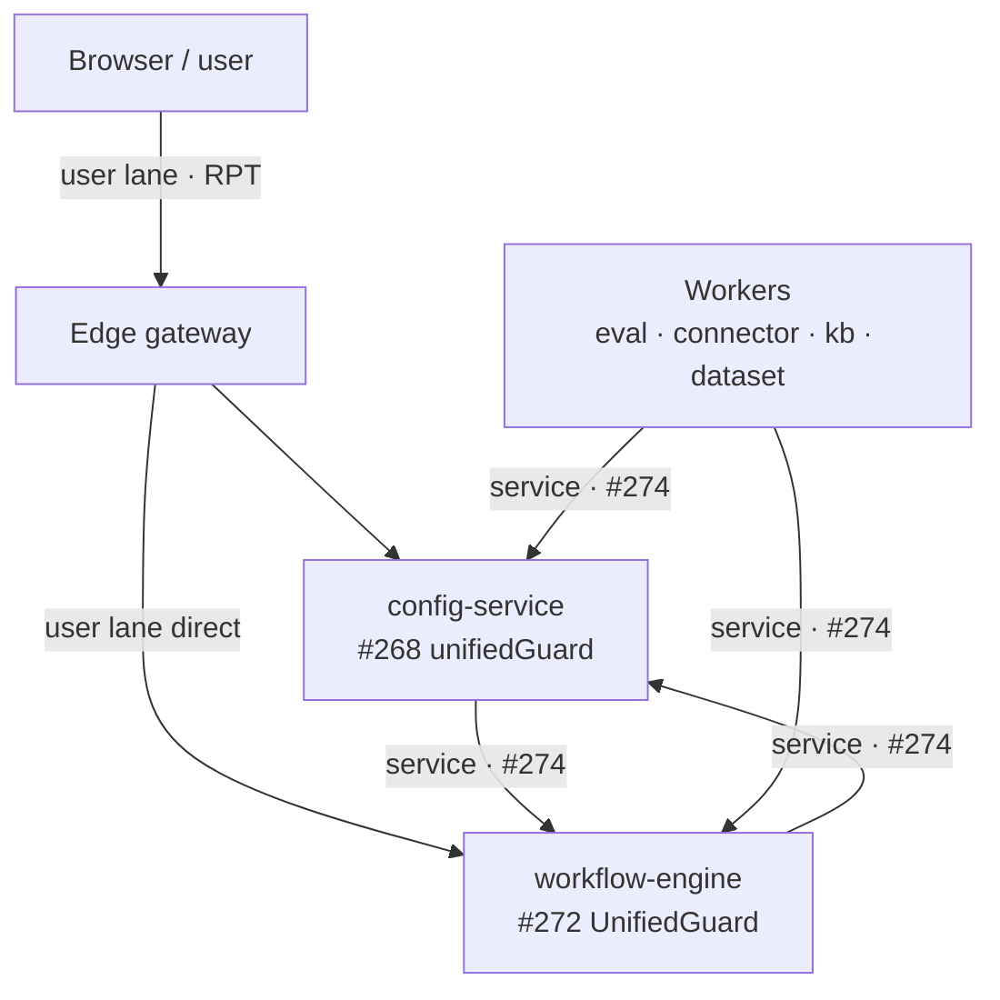
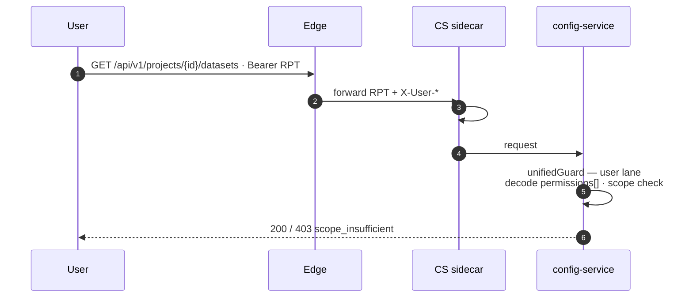
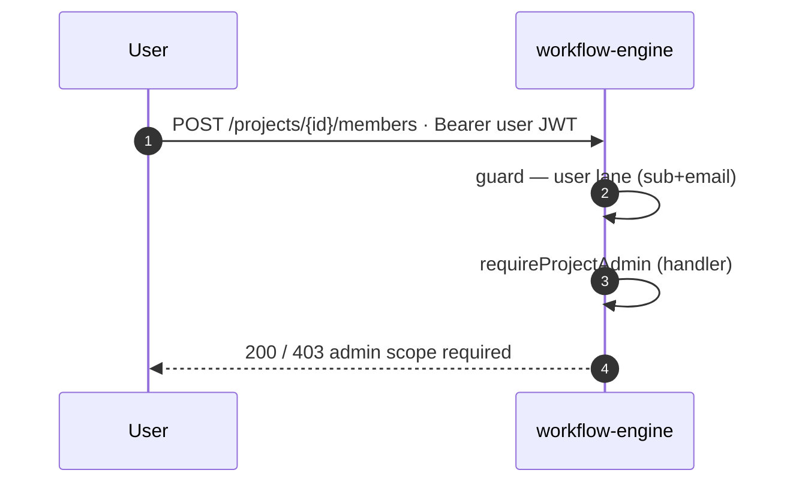
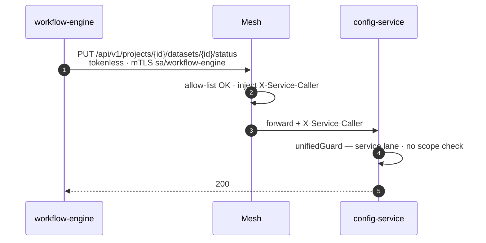
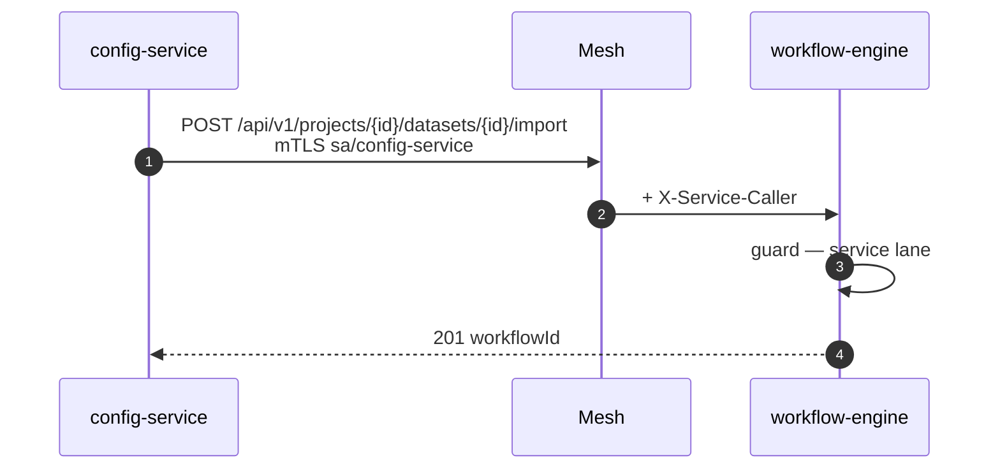
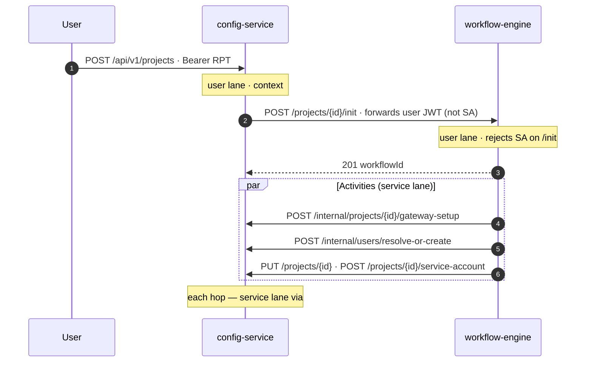
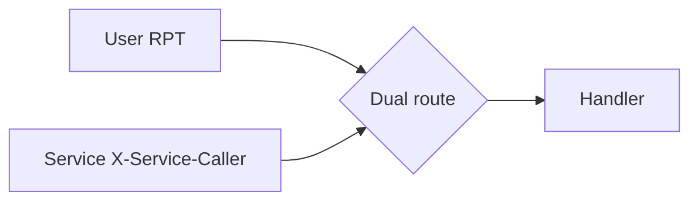

# Guard + mesh rollout — end-to-end flows (merge approval)

> **Audience:** reviewers approving the final merge of the unified-guard stack.  
> **PRs covered:** [#274](https://github.com/NetApp/AgentStudio/pull/274) (mesh),
> [#268](https://github.com/NetApp/AgentStudio/pull/268) (config-service guard),
> [#272](https://github.com/NetApp/AgentStudio/pull/272) (workflow-engine guard).  
> **Note:** if “#262” was intended, that PR is Bifrost provider-registration fixes
> (orthogonal to auth); it is **not** part of this stack. Project-init’s
> `gateway-setup` activity depends on Bifrost working, but the **auth model**
> below is entirely #274 + #268 + #272.

Companion design docs: [`single-guard-mesh-identity.md`](./single-guard-mesh-identity.md),
[`single-guard-e2e-flow.md`](./single-guard-e2e-flow.md),
[`single-guard-rollout-handoff.md`](./single-guard-rollout-handoff.md) (on PR #152 branch).

---

## 1. What each PR delivers

| PR | Component | Default at merge | What it does |
| --- | --- | --- | --- |
| **#274** | Istio mesh | **ON** (`meshServiceAuthz`) | Per-pair `AuthorizationPolicy` allow-list; EnvoyFilter strips client `X-Service-Caller` and injects verified mTLS SPIFFE for allow-listed east-west peers |
| **#268** | config-service `unifiedGuard.ts` | **OFF** (`UNIFIED_GUARD_SMOKE=false`) | Decode-only two-lane guard on all `/api/v1` routes; per-project scope on user lane |
| **#272** | workflow-engine `guard.go` | **OFF** (`UNIFIED_GUARD_SMOKE=false`) | Same two-lane model in Go; **no** per-project scope lane; handler checks (`requireProjectAdmin`) unchanged |

**Safe to merge all three with guards OFF.** Service-lane east-west only works end-to-end once **#274 is deployed** and **`UNIFIED_GUARD_SMOKE=true`** is set on both services in the **same release**.

---

## 2. Identity model (canonical — Scenario A)



| Lane | Who | Carrier | Scope check |
| --- | --- | --- | --- |
| **User** | Human via UI / forwarded RPT | `Authorization: Bearer <JWT/RPT>` (`sub` + `email`) | **config-service only:** decode `authorization.permissions[]` |
| **Service** | Allow-listed pod (CS, WE, workers, …) | Mesh-injected `X-Service-Caller: spiffe://…/sa/<name>` | None at app layer (mesh allow-list is the trust boundary) |
| **Public** | Workers / self / health | No credentials | N/A |

**Guards are decode-only.** Istio `RequestAuthentication` validates JWT signatures; guards base64-decode and route by lane. They do **not** re-verify signatures.

**Do not** enable `MESH_DELEGATED_AUTH` header-reading on services that run the unified guard — #268/#272 replace that path.

---

## 3. Merge and enablement order

### Merge to `main` (safe — guards gated OFF)

```
#274  →  #268 + #272   (either order; can ship together)
```

### Production enablement (same release window)

```
1. Deploy #274 (mesh policies + X-Service-Caller EnvoyFilter)
2. Set UNIFIED_GUARD_SMOKE=true on config-service (#268) and workflow-engine (#272)
3. (Later, optional) Drop SA tokens per hop via #249 SA-disable toggles
```

**Critical rule:** enabling guards on service-lane routes **before** #274 injects `X-Service-Caller` causes **401** on east-west hops. There is no SA-token fallback by design.

---

## 4. Guard decision (both services)



**WE-only:** membership routes add handler `requireProjectAdmin` after the guard (live Keycloak lookup).

---

## 5. Topology — all callers



---

## 6. End-to-end flows

### 6.1 North–south: user → config-service (scoped)



**Validated locally:** viewer/member/admin scope ladder on `GET /projects/:id`, datasets, credentials, `secret-data` → `user_not_allowed` for users.

---

### 6.2 North–south: user → workflow-engine (no app scope)



**Validated locally:** connector UI (`test`, `discover`, `preview`, `volume-browse`), workflow `status`/`result`/`logs` — user lane passes; service peer → `service_not_allowed`.

---

### 6.3 East–west: workflow-engine → config-service



**Validated locally (WE→CS matrix, 28 routes):** internal users, gateway-setup/teardown/rotate, scan-result, MCP health, pipeline/dataset/KB CRUD, bucket routing, service-account — all pass guard.

---

### 6.4 East–west: config-service → workflow-engine



**Validated locally (CS→WE matrix, 26 routes):** project delete, dataset import/process/terminate/acquire/schedule, pipeline execute/terminate/resume/cancel, volume-scan, eval workflows, KB schedule, etc.

---

### 6.5 Round-trip: ProjectInitWorkflow (both guards + both lanes)



---

### 6.6 Dual-lane routes (user **or** service)

| Route | User caller | Service caller |
| --- | --- | --- |
| `POST …/datasets/:id/acquire` | GUI direct | config-service proxy |
| `POST …/knowledgebases/:id/create` | KB routes forward RPT | schedule fan-out SA |
| `POST /explore/session` (+ `…/list`) | Explorer UI | config preflight SA |
| `POST /workflows/:id/cancel` | GUI | eval SA |



**Validated:** acquire, KB create (service), explore session (both), workflow cancel/signal lane split.

---

### 6.7 GUI-only workflow-engine routes (not via config-service)

| Flow | Routes | Lane | Guard test |
| --- | --- | --- | --- |
| Membership writes | `POST/DELETE /members`, `PUT /members/role` | user + handler admin | ✅ user passes guard; service `service_not_allowed` |
| Connector UI | `test`, `discover`, `preview`, `volume-browse` | user | ✅ |
| Workflow introspection | `GET …/status`, `result`, `logs` | user | ✅ |
| Explore session | `POST /explore/session` | dual | ✅ |

---

### 6.8 Internal WE cron (service-only)

| Scheduler | HTTP surface | Lane |
| --- | --- | --- |
| Reference-edge reconcile | `POST/GET/DELETE /reference-edges/schedule` | service |
| MCP health | `POST/GET/DELETE /mcp-health/schedule` | service |
| VK rotation | Temporal schedule only → WE→CS `gateway-rotate*` | service callbacks |

**Validated:** cron schedule routes — service ✅; user → `user_not_allowed`. VK outbound hops covered in WE→CS matrix.

---

### 6.9 Public / tokenless (must stay open)

| Route | Why |
| --- | --- |
| `GET/POST/DELETE /api/v1/workflows/:id/progress` | Workers, WE self, config-service poll — blocking breaks import/KB/acquire |
| `/health`, `/ready` | Probes (outside `/api/v1` group on WE) |

**Validated:** progress GET → 404 (handler), not 401/403.

---

## 7. Negative controls (lane separation)

| Test | Expected | Local result |
| --- | --- | --- |
| No creds on user route (CS) | 401 `token_missing_or_invalid` | ✅ |
| User RPT on CS service-only route (`secret-data`) | 403 `user_not_allowed` | ✅ |
| Service peer on CS user-only route (`/members`) | 403 `service_not_allowed` | ✅ |
| No user token on WE `/init` | 403 | ✅ |
| Service peer on WE user routes (members, connector UI, workflow status) | 403 `service_not_allowed` | ✅ |
| User token on WE service routes (import, volume-scan, pipeline schedule) | 403 `user_not_allowed` | ✅ |
| CS self-call without allow-list pair | Mesh RBAC 403 (not app) | ✅ |

---

## 8. Security properties

| Property | Enforced by |
| --- | --- |
| Service identity | STRICT mTLS / SPIFFE |
| Only allow-listed peers reach service lane | #274 `AuthorizationPolicy` + EnvoyFilter inject |
| Non-allow-listed peer admitted by mesh still blocked at app | Guard: no `X-Service-Caller` → 401 |
| User cannot forge service lane | User token checked first; mesh strips client `X-Service-Caller` |
| Per-project authorization (data plane) | config-service user lane only |
| Admin-only WE operations | `requireProjectAdmin` (handler) after guard |
| East-west header spoofing (`X-User-*`) | Strip-then-set at guard entry (#272) |

---

## 9. Local e2e evidence (OrbStack, Jul 2026)

| Suite | Coverage | Result |
| --- | --- | --- |
| CS user-lane RPT + scope | viewer / member / admin on project routes | ✅ |
| CS ↔ WE matrix | 56 guard checks (all coded cross-service hops) | ✅ 56/56 |
| WE non-CS routes | membership, connector UI, cron, introspection, pipeline schedule | ✅ 41/41 |
| Mesh allow-list | CS↔WE bidirectional; blocked CS self-call | ✅ |

Images: `nemo/config-service:guard274-e2e`, `nemo/workflow-engine:guard-test`, mesh overlay `values-local-guard-e2e.yaml`.

---

## 10. Rollback

| Action | Effect |
| --- | --- |
| Set `UNIFIED_GUARD_SMOKE=false` on CS / WE | Revert to legacy `createAuthMiddleware` / JWKS `AuthMiddleware` |
| Disable `meshServiceAuthz` on #274 chart | Remove allow-list + EnvoyFilter (restores prior mesh posture) |
| Guards OFF + mesh ON | SA tokens still work on legacy middleware (transition state) |

---

## 11. Approver checklist

- [ ] **#274** merged/deployed before enabling guards on east-west routes
- [ ] **#268** + **#272** merged with `UNIFIED_GUARD_SMOKE=false`; flip to `true` in same release as #274 deploy
- [ ] Edge continues forwarding `Authorization: Bearer <RPT>` for north-south (scope check needs `permissions[]`)
- [ ] Per-pair allow-list includes all production caller→target pairs (workers, agent tiers) before full rollout — local overlay is CS↔WE only
- [ ] `*/progress` remains public on workflow-engine
- [ ] Pipeline execution `PUT` callbacks to config-service authenticated (known follow-up if still unauth on main)
- [ ] Optional later: #249 SA-disable toggles per hop after soak period

---

## 12. PR links

| PR | Title |
| --- | --- |
| [#274](https://github.com/NetApp/AgentStudio/pull/274) | feat(mesh): Per-pair service authz + X-Service-Caller injection |
| [#268](https://github.com/NetApp/AgentStudio/pull/268) | feat(config-service): Unified mesh-identity guard (gated, additive) |
| [#272](https://github.com/NetApp/AgentStudio/pull/272) | feat(workflow-engine): unified mesh-identity guard (gated, additive) |
