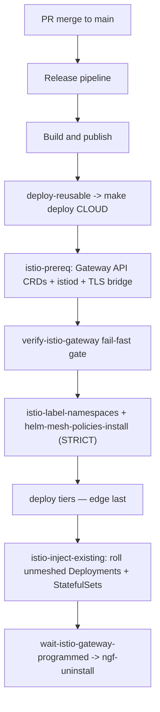

# Istio service mesh migration

This document defines the service-mesh migration plan for AgentStudio workloads.
Ingress/gateway migration is intentionally out of scope and tracked separately.

## Scope

This design covers:
- in-cluster Istio service mesh: sidecar injection across application namespaces
- STRICT mTLS for service-to-service traffic
- mesh policy enforcement (PeerAuthentication, AuthorizationPolicy, admission guardrails)
- sidecar convergence for in-place cluster migration

This design does **not** cover:
- Istio control-plane installation (`istio-base`, `istiod`) — owned by the gateway migration (`istio-prereq` target)
- edge gateway provider migration (`nginx` vs `istio`)
- cloud load balancer annotations and public ingress behavior
- DNS cutover strategy

## Problem statement

Cloud deploys run `make deploy CLOUD=<cloud>` via CI. The gateway migration introduced `istio-prereq` which installs istiod as a side effect of switching the gateway provider. However, service-to-service mTLS mesh policies (PeerAuthentication STRICT, AuthorizationPolicy allow-lists) and sidecar injection labelling were not wired into the CD flow. As a result, istiod ran purely as an ingress gateway controller with no service mesh active.

## Goals

- Make service-mesh enablement CD-driven and repeatable on every merge.
- Piggyback on the existing `GATEWAY_PROVIDER=istio` gate — no new flags.
- Apply STRICT mTLS with active sidecar convergence to bound the disruption window on in-place clusters.
- Keep rollback simple: PERMISSIVE patch without tearing down sidecars.

## Non-goals

- Replace or redesign ingress/gateway routing.
- Reinstall `istiod` — `istio-prereq` already handles control-plane bootstrap.

## Design decisions

### 1) Mesh layers on the gateway's istiod

`istio-prereq` (called by every cloud orchestrator when `GATEWAY_PROVIDER=istio`) already installs Gateway API CRDs, `istiod`, and bridges the TLS secret. Our mesh work **layers on top** of the control plane that the gateway migration provides. The service mesh is enabled by adding two steps to each cloud orchestrator's istio path.

### 2) Gating

Mesh enablement rides on `GATEWAY_PROVIDER=istio` — the same condition already used for the gateway migration. No separate opt-in flag is needed. AKS defaults to `istio`; GKE/EKS activate automatically when their overlays flip.

### 3) STRICT mTLS on install with active sidecar convergence

STRICT `PeerAuthentication` is applied **before** the tier upgrades in a given deploy run so freshly-deployed pods come up injected and STRICT-compatible. For in-place clusters whose pods predate the mesh, an active convergence step (`istio-inject-existing`) runs after the tier upgrades and restarts only workloads that lack an `istio-proxy` sidecar. The check inspects both `containers` and `initContainers` because Istio 1.30 injects the proxy as a native-sidecar `initContainer` (`restartPolicy: Always`), not a regular container. Already-meshed pods are skipped, making convergence idempotent on subsequent deploys.

Keycloak bootstrap jobs are shielded by the existing `keycloak-http-permissive` 8080/9000 port-level PERMISSIVE override in `istio-mesh-policies/values.yaml`.

### 4) Keep gateway-listener exception

Gateway listener inbound ports (80/443) remain port-level PERMISSIVE in mesh policy because traffic from external clients/LBs carries no SPIFFE client cert. This does not weaken internal service-to-service mTLS.

## CD flow integration

The following shows the full deployment sequence for a cloud with `GATEWAY_PROVIDER=istio`:

### Per-orchestrator wiring

| Target | File | Mesh blocks added |
|---|---|---|
| `deploy-all-tiers-aks` | `mk/cloud/aks.mk` | after `verify-istio-gateway`: label + policies; after edge upgrade: convergence |
| `deploy-all-tiers-gke` | `mk/cloud/gke.mk` | same (no-op while `GATEWAY_PROVIDER=nginx`) |
| `deploy-all-tiers-eks` | `mk/cloud/eks.mk` | same (no-op while `GATEWAY_PROVIDER=nginx`) |
| `deploy-local-bootstrap-fresh` | `mk/cloud/local.mk` | `helm-mesh-policies-install` already called; `helm-tier-namespaces` already labels |

## Mesh namespace scope

Target namespaces (defined in `ISTIO_APP_NAMESPACES`, `mk/common.mk`):
- `agentstudio-edge`
- `agentstudio-console`
- `agentstudio-workers`
- `agentstudio-llm-gateway`
- `agentstudio-services`
- `agentstudio-platform`
- `agentstudio-identity`
- `monitoring`
- `database`

The `database` namespace is fully meshed and runs STRICT mTLS on Postgres' wire port (`5432`) with no port-level exception. Every Postgres client carries an Istio sidecar: the long-running services (Keycloak, config-service, workflow-engine, Temporal, Lakekeeper) and the one-time DB bootstrap/migration jobs (`lakekeeper-db-init`, `lakekeeper-db-migration`). The bootstrap jobs are explicitly meshed (`sidecar.istio.io/inject: "true"`); Istio 1.30 injects the proxy as a native-sidecar `initContainer` (`restartPolicy: Always`) that terminates when the job's main container exits, so the Jobs still reach `Complete`. Postgres' `pg_isready` liveness/readiness probes run over `127.0.0.1`, which the sidecar does not intercept.

## Validation criteria

Per cluster:
- `istiod` healthy; required Gateway API CRDs present.
- Mesh namespaces labeled `istio-injection=enabled`.
- Workloads in mesh namespaces run 2/2 (app + istio-proxy).
- `PeerAuthentication` mode is STRICT in target namespaces (with only documented listener exceptions).
- Service-to-service calls succeed under mTLS (UI/API/auth flows intact).
- `istioctl analyze` reports no errors in mesh namespaces.

## Rollback strategy

- Fast mitigation: `helm upgrade istio-mesh-policies ... --set mtls.mode=PERMISSIVE` — no pod restarts needed.
- Keep sidecars in place; avoid control-plane teardown.
- Re-apply STRICT after remediation and validation (`make istio-promote-strict`).

## Risks and mitigations

- **Transient STRICT window on in-place clusters**: pods without sidecars will get 503s until `istio-inject-existing` rolls them. Mitigation: convergence step runs after every tier upgrade and is fast (skips already-meshed pods).
- **RBAC for CI identity**: cluster role must permit Istio resource creation. Mitigation: verify service principal/workload identity privileges before enabling automated bootstrap.
- **StatefulSet rolling window**: Keycloak STS is protected by the 8080/9000 PERMISSIVE override; other StatefulSets (Temporal, Postgres) are rolled by `istio-inject-existing`.

## References

- `mk/common.mk` — `ISTIO_APP_NAMESPACES` definition
- `mk/tier-helm.mk` — `istio-label-namespaces`, `helm-mesh-policies-install`, `istio-inject-existing`
- `mk/cloud/aks.mk`, `mk/cloud/gke.mk`, `mk/cloud/eks.mk` — orchestrator wiring
- `mk/cloud/local.mk` — local bootstrap
- `.github/workflows/deploy-reusable.yml` — CI verify + post-deploy smoke
- `deployments/helm/edge/istio-mesh-policies/values.yaml` — PeerAuth, AuthzPolicy, port overrides
- `deployments/helm/identity/templates/realm-bootstrap-job.yaml` — Keycloak bootstrap job
- `docs/design/agent-studio-security-stack.md`
- `docs/istio-mtls-strict-troubleshooting.md`
