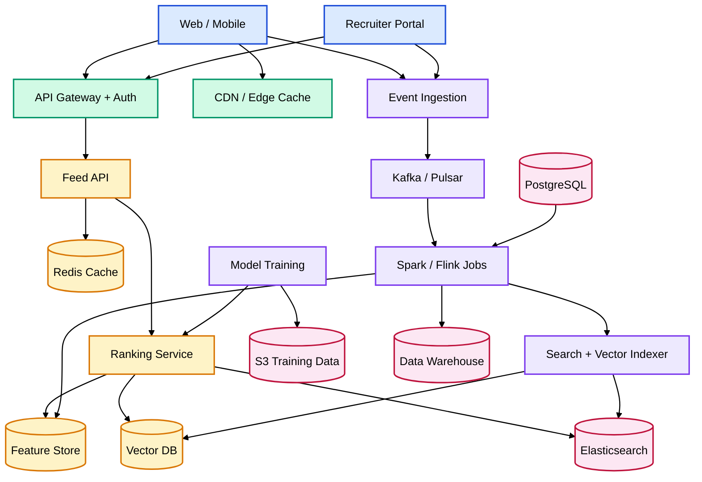
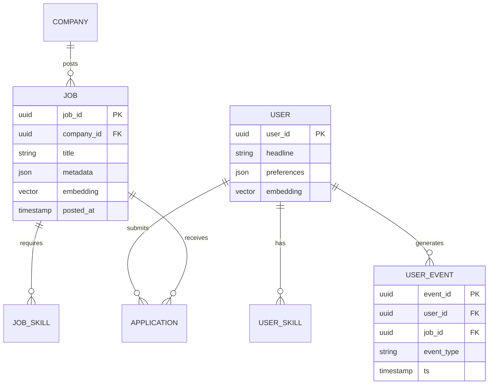
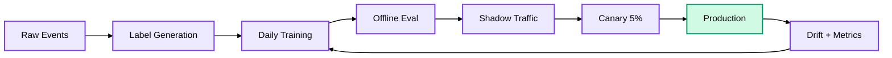

# Job Recommendation System — High-Level Design (HLD)

## 1. Problem statement

Build a system that recommends relevant jobs to candidates and relevant candidates to recruiters, optimizing for **relevance**, **diversity**, **freshness**, and **business goals** (applications, hires, revenue).

---

## 2. Goals & non-goals

### Goals

| Goal | Description |
|------|-------------|
| Personalized ranking | Surface jobs a user is likely to apply to / get hired for |
| Real-time freshness | New jobs appear in feeds within minutes |
| Explainability | "Why this job?" (skills match, location, salary band) |
| Multi-sided | Candidate feed + recruiter "candidate suggestions" |
| Scale | Millions of users, tens of millions of jobs, billions of events/day |

### Non-goals (v1)

- Full resume parsing / ATS replacement
- Automated interview scheduling
- Salary negotiation engine

---

## 3. Functional requirements

1. **Candidate job feed** — ranked list with filters (location, remote, salary, role)
2. **Similar jobs** — "Jobs like this one"
3. **Job alerts** — email/push when new matching jobs appear
4. **Recruiter recommendations** — top candidates for a job posting
5. **Cold start** — reasonable defaults for new users/jobs
6. **Feedback loop** — clicks, saves, applies, dismissals improve ranking

---

## 4. Non-functional requirements

| Attribute | Target |
|-----------|--------|
| Latency (feed API p99) | < 200 ms |
| Availability | 99.9% |
| Freshness | New job indexed in < 5 min |
| Consistency | Eventual (ranking can lag seconds) |
| Privacy | GDPR/CCPA; no PII in logs |
| Fairness | Reduce bias by role/location demographics |

---

## 5. Scale assumptions (example)

- **50M** registered candidates
- **20M** active job postings
- **500M** impressions/day
- **50M** clicks/day
- **5M** applications/day
- Peak **50K** feed requests/sec

---

## 6. High-level architecture



### Colour legend

| Layer | Colour | Components |
|-------|--------|------------|
| Clients | Light blue | Web / Mobile, Recruiter Portal |
| Edge | Light green | API Gateway, CDN |
| Online serving | Light amber | Feed API, Ranker, Feature Store, Vector DB, Redis |
| Offline / ML | Light purple | Ingestion, Kafka, ETL, Training, Indexer |
| Data stores | Light rose | PostgreSQL, Elasticsearch, S3, Warehouse |

---

## 7. Core components

### 7.1 Ingestion & events

- **Client events**: impression, click, save, apply, dismiss, time-on-page
- **Recruiter events**: view profile, contact, shortlist
- **Job lifecycle**: create, update, expire, boost

**Pipeline**: SDK → API → Kafka → Flink (real-time features) + batch Spark (daily aggregates)

### 7.2 Candidate & job profiles

**Candidate profile (structured + embeddings)**

```text
user_id, skills[], experience_years, titles[], locations[],
salary_expectation, remote_pref, education, embedding[768]
```

**Job profile**

```text
job_id, title, company_id, skills_required[], seniority,
location, remote_type, salary_range, description_embedding[768]
```

### 7.3 Retrieval (candidate → jobs)

Two-stage **retrieve then rank**:

| Stage | Purpose | Techniques |
|-------|---------|------------|
| **Retrieval** | Narrow 20M → ~500 candidates | ANN (vector similarity), inverted index (skills, location), collaborative filtering (similar users' jobs) |
| **Ranking** | Order ~500 → top 20 | GBDT / neural ranker with 100+ features |

**Retrieval channels (merged)**:

1. **Content-based** — embedding similarity (job ↔ user profile/resume)
2. **Collaborative** — "users like you applied to…"
3. **Graph** — co-apply / co-view job graph
4. **Rules** — hard filters (visa, location radius, blocked companies)
5. **Sponsored** — paid slots with relevance floor

### 7.4 Ranking model

**Features (examples)**

- User: skill match %, title similarity, apply history recency
- Job: freshness, application rate, company quality score
- Cross: embedding cosine, location distance, salary overlap
- Context: device, time of day, session depth

**Model**: LambdaMART or two-tower neural net trained on **apply** as primary label (with click as auxiliary).

**Re-ranking layer**:

- Diversity (don't show 10 identical roles)
- Exploration (ε-greedy / Thompson sampling for new jobs)
- Business rules (boost premium listings within caps)

### 7.5 Similar jobs

- Same job embedding + same company/team cluster
- Cached per `job_id` in Redis

### 7.6 Recruiter side (job → candidates)

- Inverted index on skills + vector search on resume embeddings
- Rank by fit score + response likelihood + diversity constraints

---

## 8. Data model (simplified)



---

## 9. API design

### `GET /v1/feed/jobs`

```text
Query: user_id, limit=20, cursor, filters{location, remote, salary_min}
Response: { jobs: [{job_id, score, reasons[]}], next_cursor }
```

### `GET /v1/jobs/{job_id}/similar`

### `POST /v1/events` — batch impression/click/apply

### `GET /v1/recruiter/jobs/{job_id}/candidates`

**Auth**: OAuth2 / JWT; rate limits per user tier.

---

## 10. Storage choices

| Store | Use case |
|-------|----------|
| **PostgreSQL** | Users, jobs, applications (source of truth) |
| **Elasticsearch** | Full-text search, structured filters |
| **Vector DB** (Pinecone / Milvus / pgvector) | Embedding ANN |
| **Redis** | Feed cache, feature cache, rate limits |
| **Feature store** (Feast / Tecton) | Online + offline feature consistency |
| **S3 + Parquet** | Training datasets, model artifacts |
| **Kafka** | Event stream backbone |

---

## 11. ML lifecycle



**Offline metrics**: NDCG@10, MAP, apply-rate lift vs baseline
**Online metrics**: CTR, apply rate, time-to-apply, hire rate (delayed)
**Guardrails**: diversity index, complaint rate, latency

---

## 12. Cold start

| Scenario | Strategy |
|----------|----------|
| New user | Onboarding skills + popular jobs in geo + content-based from headline |
| New job | Content similarity + boost in explore bucket + notify matching alert subscribers |
| Sparse data | Fall back to content + popularity by segment |

---

## 13. Caching strategy

1. **Precomputed feeds** — refresh every 15–30 min for active users
2. **Per-request** — merge real-time events (already seen jobs)
3. **CDN** — public job detail pages
4. **Invalidation** — on preference change or strong negative signal (dismiss)

---

## 14. Explainability

Return structured reasons:

```json
"reasons": [
  {"type": "skill_match", "detail": "Python, Kubernetes match 4/5 required"},
  {"type": "location", "detail": "Within 25 km"},
  {"type": "similar_applied", "detail": "Users with your background applied here"}
]
```

---

## 15. Security & compliance

- Encrypt PII at rest; tokenize user IDs in analytics
- Role-based access for recruiter candidate data
- Audit logs for profile views
- Right to deletion propagates to feature store and indexes

---

## 16. Failure modes & mitigations

| Failure | Mitigation |
|---------|------------|
| Ranker down | Retrieval-only + cached feed |
| Vector DB slow | Timeout → ES + skill match fallback |
| Feature store stale | Default feature values + degrade gracefully |
| Kafka lag | Serve with slightly stale features; alert SRE |

---

## 17. Deployment topology

- **Serving**: Kubernetes, multi-AZ, autoscale on QPS
- **GPU nodes**: Optional for embedding inference batch
- **Multi-region**: Read replicas + regional caches; write primary in one region

---

## 18. Phased rollout

| Phase | Scope |
|-------|--------|
| **MVP** | Rule + content match, ES filters, popularity sort |
| **v1** | Two-tower retrieval + GBDT ranker, events pipeline |
| **v2** | Real-time features, explore/exploit, recruiter recs |
| **v3** | Multi-objective optimization (apply + diversity + revenue) |

---

## 19. Open design decisions

1. **Single vs multi-objective** — optimize apply only vs hire (long feedback loop)
2. **Real-time training** — daily batch vs streaming updates
3. **Build vs buy** — managed vector DB vs self-hosted Milvus
4. **Fairness definition** — geographic vs demographic parity metrics

---

## 20. Summary

A production job recommendation system is typically a **multi-stage pipeline**: event-driven data collection → **hybrid retrieval** (vectors + CF + rules) → **learned ranking** → **business re-ranking**, backed by a **feature store** and **continuous experimentation**. The critical path for user experience is keeping retrieval + ranking under **~200 ms** via caching, precomputation, and graceful degradation.
