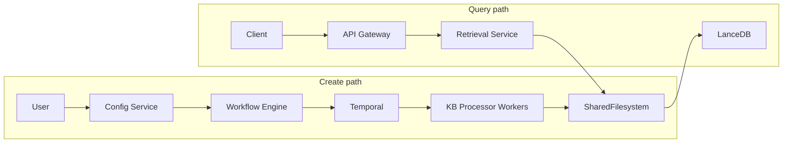
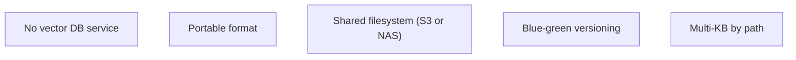
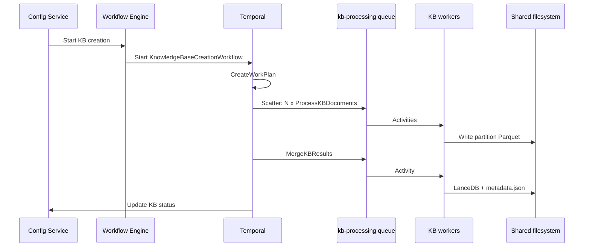
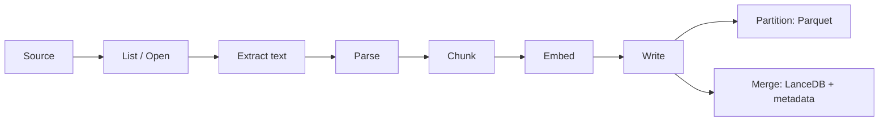
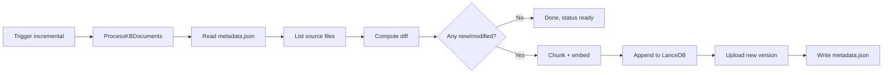
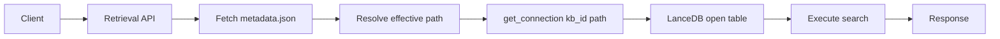

# Knowledge base design

Knowledge bases use the Workflow Engine, Temporal, shared filesystem, and kb-retrieval-service as described in [Platform HLD](platform-hld.md). This doc describes KB-specific behavior: creation, worker pool, activities, and retrieval.

## Doc map

- **Creation** — Workflow, worker pool, activity pipeline (extract → parse → chunk → embed → write to Lance).
- **Storage** — File convention on shared filesystem, versioning (blue-green).
- **Operations** — Incremental updates (full vs incremental mode).
- **Retrieval** — kb-retrieval-service: search modes, rerank, relevance score, multi-KB API.
- **Alternate backend** — vector-query-service (disabled by default).
- **Reference** — End-to-end flow, implementation notes.

## When to read what

- **Implementing retrieval?** → §Part D (Retrieval) and kb-retrieval-service code (routes, search engine, pool).
- **Implementing creation?** → §Part B (KB creation, Activity pipeline) and kb-processor code.
- **Understanding storage layout?** → §File convention on the shared filesystem.

---

## Part A — Overview and approach

### 1. Overview and role of knowledge bases

**Purpose:** A **knowledge base (KB)** is a collection of chunked, embedded documents stored as vector (and optional full-text search, FTS) indexes. KBs power **RAG** (retrieval-augmented generation): at inference time the agent (and the GUI) query the KB to retrieve relevant chunks and use them as context so answers are grounded in project data.

**Consumers:** API Gateway (`/kb`), agent-service (RAG context), config-service (metadata enrichment), GUI (search UI).

**High-level flow:** User creates KB in GUI → config-service persists KB and triggers creation → workflow-engine starts a Temporal workflow → kb-processor workers run activities and write LanceDB + metadata to a shared filesystem (e.g. S3 or NAS) → **kb-retrieval-service** reads from that shared filesystem and serves search. The shared filesystem can be S3, an NFS volume, or similar; the same path convention applies. Before diving into creation and retrieval, the sections below spell out how KBs fit in the platform and how they are built and queried.



### 2. Why file-based vectors (LanceDB)

**LanceDB in brief:** [LanceDB](https://lancedb.com/) is an open-source, embedded vector database that stores data in the **Lance** columnar format on disk. It runs as a library (no separate server): the kb-processor writes tables from Python, and kb-retrieval-service opens the same tables from Rust via the Lance format. Tables are plain directories of Lance files on a shared filesystem (S3 or NAS), which keeps the platform simple and portable.

**Capabilities:** LanceDB supports **semantic (vector) search** over embeddings — e.g. approximate nearest neighbour (ANN) via IVF or other indices — and **full-text search (FTS)** over text columns. The platform uses both: vector search for similarity and FTS for keyword matching; **hybrid search** combines them (e.g. with RRF or a reranker). Schema is flexible (vector column plus metadata and text), and the columnar layout allows efficient scans and index builds.

**Updates and lifecycle:** Tables can be created from Parquet, appended to, and updated (e.g. overwrite rows by key). The KB pipeline uses **versioned prefixes** (blue-green): each creation or incremental run writes to a new path; `metadata.json` points to the active version so retrieval and rollback are straightforward. No in-place mutation of the “live” path is required.

- **No dedicated vector DB service** — Indexes are files (Lance format) on a shared filesystem; no separate cluster or DB to operate.
- **Portable, open format** — Lance is columnar; the same dataset is readable by kb-retrieval-service (Rust) and the kb-processor (Python).
- **Shared-filesystem agnostic** — Write once from the processor; retrieval opens tables by path. Backing store can be **object storage (e.g. S3)** or **shared filesystem (e.g. NAS/NFS)**; only the root and access method differ.
- **Blue-green versioning** — Each run writes to a new prefix (e.g. `lancedb-20260310-215953`); `metadata.json` points to the active path; retrieval resolves path from metadata and caches connections per path.
- **Multi-tenancy and scale** — Many KBs = many path prefixes under one root; retrieval scales by replicas and connection pooling (`kb_id:path`), not by deploying per-KB services.



---

## Part B — Creation

### 3. KB creation: workflow and worker pool

**Workflow:** Config Service calls the Workflow Engine HTTP API to start KB creation. The executor starts the Temporal workflow `KnowledgeBaseCreationWorkflow` on the workflow-orchestration task queue (current code may use `pipeline-execution`; a rename to e.g. `platform-workflows` or `workflow-orchestration` is planned) with a deterministic ID (e.g. `facet-knowledge_base-{kbId}-embedding`) for deduplication.

**Full path (scatter-gather):** Step 0: clear stale progress; Step 1: fetch project credentials; Step 2: branch incremental vs full; Step 3: create work plan (`CreateWorkPlanActivity` derives `K_eff` shards from file sizes and env, same model as dataset import); Step 4: build work units; Step 5: **Scatter** — run `ProcessKBDocuments` on `kb-processing`; Step 6: **Gather** — `MergeKBResults`; Step 7: read result and update KB status. **Incremental mode** bypasses scatter-gather and runs a single `ProcessKBDocuments` activity.

**KB worker pool:** Workers run on task queue **kb-processing** and execute activities **ProcessKBDocuments** and **MergeKBResults** ([kb-processor](../../src/nemo/workers/kb-processor/) — Python, Temporal worker). The workflow worker runs on the workflow-orchestration queue (Go). Each activity runs the pipeline described in the next section.

**Key code:** [kb_creation.go](../../src/nemo/workflow-engine/internal/workflows/kb_creation.go), [executor.go](../../src/nemo/workflow-engine/internal/services/executor.go).



### 4. Activity pipeline: from source to LanceDB

**ProcessKBDocuments** (per partition or single-unit):

| Step | Description |
| ---- | ----------- |
| **List / open source** | Unstructured: list files under dataset prefix (or use partition manifest). Structured: connect to catalog/table. [UnstructuredDataSource](../../src/nemo/workers/kb-processor/data_sources/unstructured.py), [StructuredDataSource](../../src/nemo/workers/kb-processor/data_sources/structured.py). |
| **Text extraction** | Download file (unstructured) or read rows (structured). Extract text by type: `.txt`/`.md` read as UTF-8; `.csv`/`.tsv` → rows to lines; `.json`/`.jsonl` → parse and optionally pretty-print for chunking; `.html`/`.xml`/`.yaml` read as text. Unstructured KB creation also supports binary text extraction for `.pdf`, `.docx`, `.odt`, and `.rtf` before chunking. Additional text document formats (`.tex`, `.adoc`, `.asciidoc`, `.org`) are ingested via normalized text path. Legacy `.doc` remains unsupported in v1 (skip with explicit warning). Unsupported or unreadable binaries are skipped non-fatally. RTF extraction targets readable text and may flatten complex layout constructs (for example deeply nested tables/embedded objects). [unstructured._extract_text](../../src/nemo/workers/kb-processor/data_sources/unstructured.py). |
| **Parse** | JSON parsed for better chunking; structured data: select text columns. |
| **Chunk** | Chunker (strategy: fixed, sentence, recursive, token, markdown) with chunk_size, chunk_overlap, options. Input: Document (content, metadata); output: list of Chunk. [chunker](../../src/nemo/workers/kb-processor/processing/chunker.py). |
| **Embed** | `EmbeddingGenerator` POSTs `/v1/embeddings` to the Bifrost LLM gateway (per-project VK bearer; wire `model` is the `embeddingGatewayModelId` written into the workflow input). Local MiniLM and remote OpenAI / Cohere / Voyage etc. all go through the same code path — there is no in-process sentence-transformers anymore. Returns PyArrow RecordBatches (id, document_id, source, text, chunk_index, vector, metadata). See [unified-embedding-models.md](unified-embedding-models.md) for the gateway + TEI architecture, and [embedder.py](../../src/nemo/workers/kb-processor/processing/embedder.py) for the client. |
| **Write (partition)** | Write embeddings Parquet to job output prefix; partition_result.json. No LanceDB yet. |

**MergeKBResults:**

| Step | Description |
| ---- | ----------- |
| **Read partition outputs** | List partition prefixes, download each embeddings.parquet (and partition_result.json). |
| **Merge** | Combine Parquet tables, build one LanceDB table (LanceDBWriter), optionally create vector/FTS indices. |
| **Write unified metadata** | Write the LanceDB tree to the shared filesystem (versioned prefix), write the single `metadata.json` carrying workflow-result fields (status, counts, lanceTablePath, stats) + KB-shape fields (indexingMode, index capability flags) + embedding identity (provider, providerModelId, gatewayModelId, dimensions). Return the same dict to the Go workflow in-memory so the read-back-from-S3 step is skipped on the happy path. Call UpdateKBStatusWithStatsActivity to bump the KB row's counts. See [unified-embedding-models.md §7](unified-embedding-models.md#7-the-unified-metadatajson-schema) for the schema; [temporal_worker.py](../../src/nemo/workers/kb-processor/temporal_worker.py), [lancedb_writer.py](../../src/nemo/workers/kb-processor/processing/lancedb_writer.py) for the code. |



### 5. File convention on the shared filesystem

**Concept:** KB files live on a **shared filesystem** — any storage with a path-based namespace readable (and writable by the processor) by all relevant services. In practice: **S3** (or S3-compatible) or **NAS** (e.g. NFS). Same path convention; only root and access method differ (e.g. object-store prefix vs `/mnt/nfs/` or `file://`).

**Root and prefix:** One logical root (e.g. object-store root or NFS mount); path prefix from project (e.g. `projects/{projectId}`).

**Per-KB layout:**

- **Versioned (blue-green):** `{pathPrefix}/knowledgebases/{kbId}/lancedb-{YYYYMMDD-HHMMSS}/` — full Lance table (`kb_vectors.lance/`, indices). Written by [LanceDBWriter](../../src/nemo/workers/kb-processor/processing/lancedb_writer.py).
- **Metadata:** `{pathPrefix}/knowledgebases/{kbId}/metadata.json` — **the** single source of truth. Carries workflow-result fields (`status`, `lanceTablePath`, `documentCount`, `chunkCount`, `vectorCount`, nested `stats` for storage / file info), KB-shape fields (`indexingMode`, `hasVectorIndex`, `vectorIndexMetric`, `hasFtsIndex`), and embedding identity (`embeddingGatewayModelId`, `embeddingProvider`, `embeddingProviderModelId`, `embeddingEndpoint`, `vectorSize`, `embeddingModelId`). The Go workflow decodes the workflow-result subset via `types.KBMetadata` + `ReadKBMetadataActivity`; kb-retrieval-service reads the rest. **Pre-unification this was a pair of files** (`metadata.json` + `kb_processing_results.json`) with overlapping counts and inconsistent embedding identity — see [unified-embedding-models.md §6-7](unified-embedding-models.md#6-why-the-unification-was-needed) for the rationale and the full schema table.
- **Convention fallback:** If `metadata.json` is missing or `lanceTablePath` is empty, retrieval uses a convention path (e.g. `{root}/projects/{projectId}/knowledgebases/{kbId}/lancedb/`); path resolution is in kb-retrieval-service.

**What the processor writes:** Builds LanceDB locally, writes all files under the versioned prefix to the shared filesystem, then overwrites `metadata.json` with the unified payload (workflow-result + KB-shape + embedding identity, all in one file — see [unified-embedding-models.md §7](unified-embedding-models.md#7-the-unified-metadatajson-schema)). When `NEMO_DEFAULT_STORE_ROOT` is set (POSIX-first mode), writes go directly to the NFS mount — no S3 upload step is needed. The legacy `_upload_to_s3()` and `_download_existing_lancedb()` code paths are bypassed.

**Path resolution:** Request → read metadata.json from shared filesystem → if `lanceTablePath` set use it, else use convention path.

### POSIX-first LanceDB I/O

When the `nemo-default-bucket` PVC is mounted and `NEMO_DEFAULT_STORE_ROOT` is set, both the kb-processor (write) and kb-retrieval-service (read) use POSIX paths instead of S3 URIs. Since both mount the same PVC at the same path, a relative prefix like `projects/{pid}/knowledgebases/{kbId}/lancedb-run-{runId}` resolved against `NEMO_DEFAULT_STORE_ROOT` works for both.

**KB processor** ([lancedb_writer.py](../../src/nemo/workers/kb-processor/processing/lancedb_writer.py)):

- `_default_store_root()` reads `NEMO_DEFAULT_STORE_ROOT`; when set, `get_lance_table_path()` returns an absolute POSIX path instead of an S3 URI.
- LanceDB `connect()` opens the local directory directly — no S3 storage options needed.
- `_upload_to_s3()` is skipped (data is already on shared NFS).
- `_download_existing_lancedb()` for incremental mode copies from the current POSIX path instead of downloading from S3.
- Metadata read/write uses direct filesystem I/O.

**KB retrieval service** ([pool.rs](../../src/nemo/kb-retrieval-service/src/pool.rs), [config.rs](../../src/nemo/kb-retrieval-service/src/config.rs)):

- `config.data_root` reads `NEMO_DEFAULT_STORE_ROOT`; when set, `get_lancedb_path()` returns a POSIX path.
- `remap_default_bucket_s3_to_posix()` transparently maps legacy `s3://{default_bucket}/...` URIs in `metadata.json` to `{mount}/...`, ensuring backward compatibility with metadata written before the POSIX migration.
- LanceDB `connect()` opens the local path — no S3 storage options or credentials needed.

```text
root (object-store or NFS)
└── projects/{projectId}/knowledgebases/{kbId}/
    ├── metadata.json
    └── lancedb-20260310-215953/
        ├── kb_vectors.lance/
        └── _indices/
```

Same layout for S3 or NAS; root and access method vary.

---

## Part C — Operations

### 6. Incremental updates to a KB

**Purpose:** Update an existing KB with new or changed documents without reprocessing everything. Modes: **full** (overwrite; default) and **incremental** (append only new/modified data).

**Trigger:** Same as initial creation — config-service starts the KB creation workflow with `processingMode: "incremental"`. Workflow ID stays deterministic per KB for dedup.

**Workflow path:** Incremental **bypasses scatter-gather**. One `ProcessKBDocuments` activity: list source files, compute diff, process only new/modified files, append to existing LanceDB (or create if none), write results and metadata. See [kb_creation.go](../../src/nemo/workflow-engine/internal/workflows/kb_creation.go), [processor.py](../../src/nemo/workers/kb-processor/processor.py).

**What counts as incremental (unstructured):** Processor reads `metadata.json` for **processedFiles** (file key → `{ last_modified, chunk_count }`). **New** = key not in processedFiles. **Modified** = source `last_modified` > stored. Only new and modified are chunked/embedded. If none, run finishes early (status ready).

**When commits happen:** Every run that produces data writes a **new versioned prefix** and overwrites `metadata.json` (new `lanceTablePath`, counts, `processedFiles`). No in-place overwrite; retrieval follows the pointer.

**Versioning:** Same as full — each run that writes creates a new timestamped directory; `metadata.json` points at the active one. Incremental with nothing to do does not create a new version.

**LanceDB writer (incremental):** [lancedb_writer.py](../../src/nemo/workers/kb-processor/processing/lancedb_writer.py) — read current table from metadata path (POSIX copy when `NEMO_DEFAULT_STORE_ROOT` is set, S3 download otherwise), append rows (`lance_table.add(table)`), rebuild vector/FTS indices, write to a **new** versioned prefix (POSIX or S3), update metadata. Commit is atomic from retrieval’s view: new path + new metadata.



---

## Part D — Retrieval

### 7. kb-retrieval-service: serving multiple KBs and search behavior

**Single service, many KBs:** One deployment (kb-retrieval-service) serves all KBs. Each request has `projectId` and `kbId` (or multiple `knowledgeBaseIds`). The service resolves the path on the shared filesystem and opens the table(s). Path resolution: read `metadata.json`; effective path = `metadata.lanceTablePath` if set, else convention path. Connection pooling: cache key `kb_id:path`; TTL and eviction on errors. See [kb-retrieval-service](../../src/nemo/kb-retrieval-service/) (path resolution, pool, [routes/search.rs](../../src/nemo/kb-retrieval-service/src/routes/search.rs), [search/engine.rs](../../src/nemo/kb-retrieval-service/src/search/engine.rs)).

**Search modes:** **vector** — pure vector similarity; **fts** — BM25 full-text; **hybrid** — run both and merge (reranking). Mode can be set in the request or derived from KB `indexingMode`.

**Reranking:** **RRF** (default): merge two ranked lists with Σ 1/(k + rank), k=60. Set `rerankerType: none` to **disable reranking** — hybrid still runs vector + FTS but merges them with a plain score-based union (dedupe by chunk id, keep higher normalized score) instead of RRF; this is the baseline the KB playground's "Enable reranking" toggle switches off. RRF stays the default whenever `rerankerType` is absent, so agents and multi-KB search are unaffected. **Other rerankers:** cross_encoder, cohere, linear via `rerankerType` / `rerankerOptions` remain reserved for future support.

**Relevance score:** All results have **score** in **[0, 1]** (higher = more relevant). Vector: distance → similarity (cosine: `1 - distance/2`, L2: `1/(1+distance)`, dot: clamp). FTS: BM25 normalized as `score/(score+1)`. Hybrid (RRF): merged score normalized to [0,1]. **minScore** filters out lower scores before topK.

**Multi-KB API:** `POST /api/v1/projects/{projectId}/knowledgebases/search` — body: `query`, `knowledgeBaseIds`, `topK`, `minScore`, optional `searchMode`, `aggregationStrategy`, `distanceMetric`. One query embedding; each KB searched independently; results aggregated. **Aggregation:** **merge** — flat list by score, chunks tagged with `knowledgeBaseId`/`knowledgeBaseName`; **per_kb** — list of per-KB result sets; **rerank** — reserved for future cross-KB reranking. Limit: e.g. max 10 KBs per request. See kb-retrieval-service OpenAPI.

**APIs:** Single-KB search (`POST .../knowledgebases/{kbId}/search`), multi-KB search (`POST .../knowledgebases/search`), metadata (`GET .../knowledgebases/{kbId}/metadata`).



**Hybrid search flow:** Query → Embed → Vector search + FTS → RRF (or other reranker) → minScore filter → topK → Results.

---

## Part E — Alternate backend (vector-query-service)

The **vector-query-service** is a Python/Flask alternative to kb-retrieval-service for KB search. It provides the same API surface (vector, FTS, hybrid search; metadata; multi-KB) but uses boto3 for S3 access and sentence-transformers for query embedding, rather than the Rust-native Lance and embedding stack in kb-retrieval-service.

**Status:** Disabled by default. kb-retrieval-service is the primary backend. The vector-query-service Helm chart exists as a dependency but is not enabled.

**When to use it:** Rollback scenario if kb-retrieval-service has issues, or for environments where the Rust binary is not available. To switch:

1. Set `vector-query-service.enabled: true` in Helm values
2. Set `kb-retrieval-service.enabled: false`
3. Set `KB_RETRIEVAL_SERVICE_URL` to `http://vector-query-service:5000` in agent-service, apigateway-service, and parent values

**Architecture differences:**

| Aspect | kb-retrieval-service (default) | vector-query-service |
|--------|-------------------------------|---------------------|
| Language | Rust | Python (Flask) |
| Storage access | POSIX-first (shared NFS mount) | S3 via boto3 |
| Embedding | Not needed (pre-embedded by kb-processor) | sentence-transformers (query embedding at search time) |
| Connection pool | LRU cache keyed by `kb_id:path` with TTL | Same pattern, `ConnectionManager` with LRU and TTL |

Both services resolve KB paths from `metadata.json` (blue-green), support the same search modes and rerankers, and expose compatible REST APIs. The primary difference is I/O model: kb-retrieval-service reads from POSIX mounts, vector-query-service reads from S3.

---

## Part F — Reference

### 10. End-to-end data flow

**Create path:** GUI → Config → Workflow Engine → Temporal → KB workers → shared filesystem (write files + metadata.json).

**Query path:** Client → Gateway → kb-retrieval-service → shared filesystem (read metadata + LanceDB path) → search → response.

Store is labeled as shared filesystem (S3 or NAS) in both paths.

### 11. Implementation notes and references

**Stack:** Workflow Engine (Go, Temporal SDK); kb-processor (Python, task queue `kb-processing`); kb-retrieval-service (Rust); config-service (Node, triggers workflow).

**Key code paths:**

- Workflow start: [executor.go](../../src/nemo/workflow-engine/internal/services/executor.go) `StartKnowledgeBaseCreation`
- Workflow definition: [kb_creation.go](../../src/nemo/workflow-engine/internal/workflows/kb_creation.go)
- Activities: [temporal_worker.py](../../src/nemo/workers/kb-processor/temporal_worker.py) (`process_kb_documents`, `merge_kb_results`), [processor.py](../../src/nemo/workers/kb-processor/processor.py), [lancedb_writer.py](../../src/nemo/workers/kb-processor/processing/lancedb_writer.py)
- Data sources: [unstructured.py](../../src/nemo/workers/kb-processor/data_sources/unstructured.py), [structured.py](../../src/nemo/workers/kb-processor/data_sources/structured.py)
- Chunking: [chunker.py](../../src/nemo/workers/kb-processor/processing/chunker.py); Embedding: [embedder.py](../../src/nemo/workers/kb-processor/processing/embedder.py)
- Path resolution and retrieval: [kb-retrieval-service](../../src/nemo/kb-retrieval-service/) (pool, routes, search engine)

### References

- **Internal:** [Platform HLD](platform-hld.md), [Design doc index](README.md), [datasets.md](datasets.md). For retrieval API details see kb-retrieval-service OpenAPI. Optionally: deployment-design, observability.
- **Internal (embedding architecture):** [unified-embedding-models.md](unified-embedding-models.md) — how the gateway routes built-in MiniLM (via TEI) and registered third-party models, the dimensions catalog, and the `metadata.json` schema that ties indexing-time identity to retrieval-time routing.
- **External:** [LanceDB](https://lancedb.com/), [Parquet](https://parquet.apache.org/docs/), [Text Embeddings Inference (TEI)](https://github.com/huggingface/text-embeddings-inference) — the HuggingFace server we run in-cluster to host MiniLM and other open-source embedding models behind the gateway. FTS = full-text search (keyword search over text columns).
