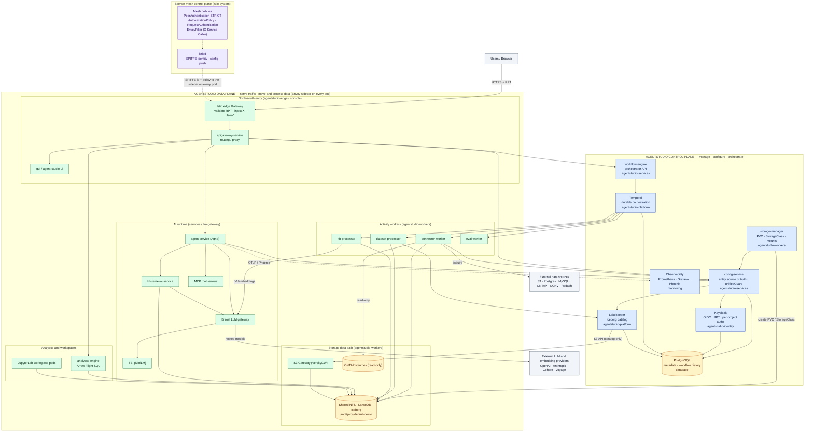
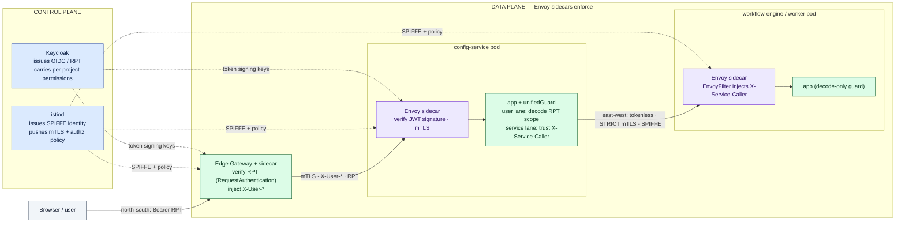

# AgentStudio architecture — control plane vs data plane

A whole-platform architecture view organized around a **control plane / data
plane** split, with the service mesh drawn as an explicit layer:

- **Keycloak sits in the control plane** — it issues identity (OIDC tokens / RPT
  with per-project `permissions[]`) but is not in the hot request path.
- **The service mesh is the data plane** — an Envoy sidecar on every pod carries
  the actual north–south and east–west traffic and enforces STRICT mTLS. The
  mesh's *own* control plane (`istiod`) lives in the control plane and just
  configures those sidecars.

Companion docs: [single-guard-mesh-identity.md](../single-guard-mesh-identity.md),
[authn-authz-e2e-flow.md](../authn-authz-e2e-flow.md),
[keycloak-per-project-authorization.md](../keycloak-per-project-authorization.md),
[platform-hld.md](../platform-hld.md).

> Plane assignment is by **role**, not by namespace: "control plane" = decides /
> configures / orchestrates; "data plane" = serves traffic and moves/processes
> data. `config-service` and `workflow-engine` expose request-path APIs but are
> placed in the control plane because they are the platform's source of truth and
> orchestrator. Each box is annotated with its deployment namespace/tier.

## Legend

| Color | Meaning |
| --- | --- |
| Blue | Control plane (manage / configure / orchestrate) |
| Green | Data plane (serve traffic / move + process data) |
| Purple | Service mesh (istiod + Envoy sidecars) |
| Orange | Data stores |
| Grey | External actors / systems |

## 1. Full system — control plane vs data plane

All workloads are sidecar-injected (`ISTIO_APP_NAMESPACES`) and run STRICT mTLS.
`istiod` issues SPIFFE identities and pushes policy to the sidecar on every pod
(shown once, from `istiod` to the edge gateway, to keep the graph readable).

### Control plane (blue)

| Component | Role | Namespace |
| --- | --- | --- |
| **Keycloak** | OIDC, RPT issuance, per-project authorization | `agentstudio-identity` |
| **config-service** | Entity source of truth; `unifiedGuard` two-lane authz | `agentstudio-services` |
| **workflow-engine** | Orchestrator API; starts Temporal workflows | `agentstudio-services` |
| **Temporal** | Durable workflow orchestration | `agentstudio-platform` |
| **Lakekeeper** | Apache Iceberg catalog | `agentstudio-platform` |
| **storage-manager** | PVC / StorageClass / volume-mount controller | `agentstudio-workers` |
| **PostgreSQL** | Metadata + workflow history | `database` |
| **Observability** | Prometheus, Grafana, Phoenix | `monitoring` |
| **istiod + mesh policies** | SPIFFE identity, mTLS + authz config push | `istio-system` |

### Data plane (green)

| Component | Role | Namespace |
| --- | --- | --- |
| **Istio edge Gateway** | North–south entry; validates RPT, injects `X-User-*` | `agentstudio-edge` |
| **apigateway-service / gui** | App routing/proxy and web UI | `agentstudio-services` / `agentstudio-console` |
| **agent-service** | Agno agents, RAG, MCP tool calls, guardrails | `agentstudio-services` |
| **kb-retrieval-service** | Vector / FTS / hybrid KB search | `agentstudio-services` |
| **Bifrost / TEI / MCP** | LLM + embedding gateway, in-cluster MiniLM, tool servers | `agentstudio-llm-gateway` / `agentstudio-services` |
| **connector / dataset / kb / eval workers** | Temporal activity executors | `agentstudio-workers` |
| **analytics-engine / JupyterLab** | Arrow Flight SQL + interactive workspaces | `agentstudio-services` / dynamic |
| **S3 Gateway + shared NFS + ONTAP** | POSIX-first data path; S3 API for catalog only | `agentstudio-workers` |

## 2. Service mesh & identity — north–south vs east–west

This makes the split concrete: **Keycloak (control plane)** issues the user
identity, **istiod (control plane)** issues workload identity, and the **Envoy
sidecars (data plane)** enforce both. Two lanes — the user lane (RPT, per-project
scope) and the service lane (tokenless mTLS + `X-Service-Caller`) — match
`unifiedGuard` in `config-service`.

### Two lanes (matches `unifiedGuard`)

| Lane | Carrier | Who enforces | App-side check |
| --- | --- | --- | --- |
| **North–south (user)** | Keycloak RPT on `Authorization: Bearer` (+ `X-User-*`) | edge gateway validates RPT; sidecar verifies signature | `unifiedGuard` user lane decodes RPT `permissions[]` for per-project scope |
| **East–west (service)** | Tokenless STRICT mTLS, SPIFFE identity | sidecar mTLS; EnvoyFilter injects `X-Service-Caller` | `unifiedGuard` service lane trusts `X-Service-Caller` when `internalAllowed` |

Decode-only guard: the app never verifies a JWT signature — the Istio sidecar's
`RequestAuthentication` does that at every hop, and `unifiedGuard` base64-decodes
the forwarded token only to read the per-project scope.

## Mesh namespaces

All sidecar-injected and STRICT-mTLS (`ISTIO_APP_NAMESPACES`, `mk/common.mk`):
`agentstudio-edge`, `agentstudio-console`, `agentstudio-services`,
`agentstudio-workers`, `agentstudio-llm-gateway`, `agentstudio-platform`,
`agentstudio-identity`, `monitoring`, `database`.
