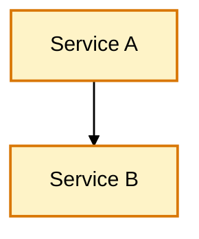
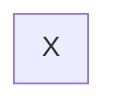
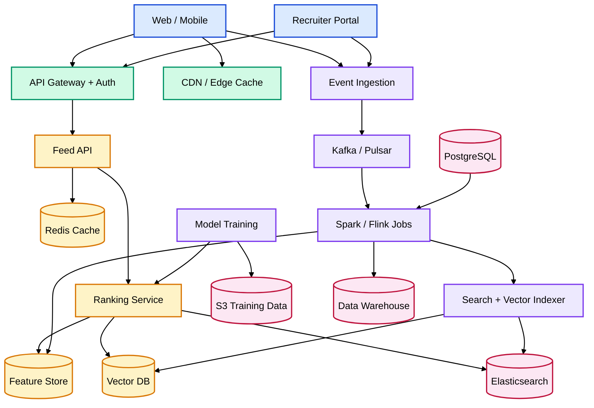
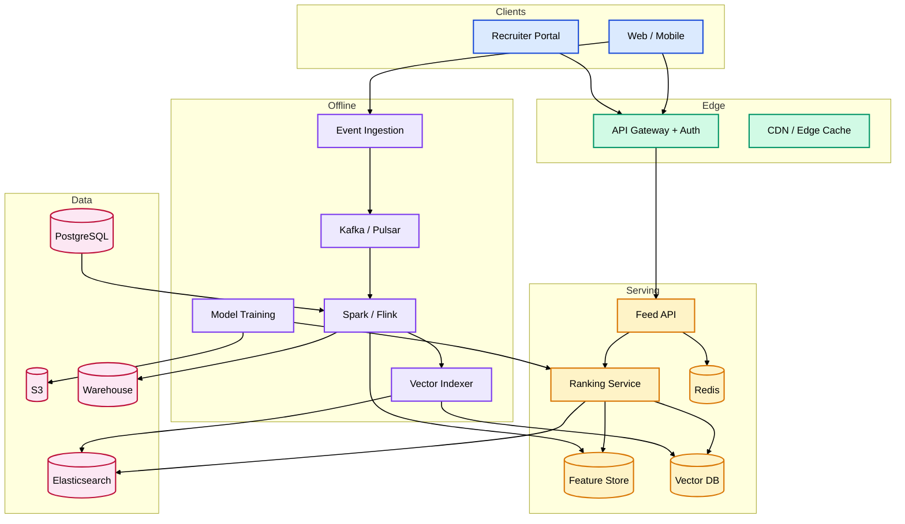

# Mermaid Diagram Guidelines

Reusable instructions for producing **coloured, readable, non-overlapping** Mermaid diagrams in HLDs, architecture docs, and AI-assisted design sessions.

Use this file when:

- Writing or reviewing architecture diagrams in `docs/`
- Asking an AI agent to generate HLD / system-design diagrams
- Debugging diagrams that render black-and-white or with overlapping nodes

---

## Quick prompt (copy-paste for AI)

Paste this at the start of any request that should produce a Mermaid diagram:

```text
When you produce architecture/HLD or any Mermaid diagram, ALWAYS follow these rules:

1. COLOR BY DEFAULT
   Never give plain black-and-white diagrams. Assign a distinct color per logical
   layer/group using `classDef` with fill + stroke + color:#000.
   Use a light fill + darker matching stroke (e.g. fill:#DBEAFE, stroke:#1D4ED8).

2. NO OVERLAP
   - Use ONE direction for the whole graph (`flowchart TB` or `flowchart LR`).
     Do NOT put `direction` statements inside subgraphs.
   - Do NOT use <br/> or multi-line text inside cylinder [( )] or database shapes.
   - Keep node labels short (2–4 words). Put detail in a separate legend table.
   - Prefer no subgraphs if the graph is dense; if grouping is needed, keep all
     subgraphs in the same direction as the parent.

3. STYLING METHOD
   - Apply colors via `classDef` + `class`, NOT via the `%%{init}%%` theme hack
     (that directive is fragile and often renders black-and-white).
   - Make arrows black: `linkStyle default stroke:#000,stroke-width:1.5px`.

4. ALWAYS include a small color legend table below the diagram mapping
   layer → color → components.

5. VALIDATE
   - Every node id referenced in a `class` line must be defined.
   - No duplicate ids; no trailing spaces after node definitions.

6. LARGE DIAGRAMS
   If the diagram is large, provide both:
   - a "clean / no-subgraph" version (best layout), and
   - a "grouped / subgraph" version (best readability).
```

Reference this file in a prompt:

```text
Follow docs/design/mermaid-diagram-guidelines.md when generating the diagram.
```

---

## Why diagrams break

| Symptom | Root cause | Fix |
| ------- | ---------- | --- |
| Black and white | No `classDef` styling; or reliance on `%%{init}%%` theme | Use `classDef` + `class` on every layer |
| Overlapping nodes | Mixed `direction` inside subgraphs; dense cross-edges | Single `flowchart TB` or `LR`; avoid nested directions |
| Broken cylinder shapes | `<br/>` inside `[( )]` nodes | Short single-line labels; details in legend |
| Layout fights itself | Too many subgraphs + long labels | Offer a flat (no-subgraph) version |

---

## Standard colour palette

Use one colour per logical layer. Text inside boxes should always be black (`color:#000`).

| Layer | Fill | Stroke | Example components |
| ----- | ---- | ------ | ------------------ |
| Clients / UI | `#DBEAFE` | `#1D4ED8` | Web, Mobile, Recruiter Portal |
| Edge / Gateway | `#D1FAE5` | `#059669` | API Gateway, CDN, Auth |
| Online serving | `#FEF3C7` | `#D97706` | Feed API, Ranker, Cache |
| Offline / ML | `#EDE9FE` | `#7C3AED` | Kafka, ETL, Training, Indexer |
| Data stores | `#FCE7F3` | `#BE123C` | PostgreSQL, Elasticsearch, S3, Redis |

### Minimal styling template



---

## Layout rules (detailed)

### 1. One direction only

```mermaid
flowchart TB   ✅ good — one direction for entire graph
flowchart LR   ✅ good
```

Avoid:



### 2. Short labels in nodes

Put long descriptions in prose or a legend table — not inside the node.

```text
✅ PG[("PostgreSQL")]
❌ PG[("PostgreSQL<br/>profiles, jobs")]
```

### 3. Prefer flat layout for dense graphs

If a diagram has more than ~12 nodes or many cross-layer edges, use the **flat version** (no subgraphs) as the primary diagram. Add a grouped subgraph version only if readability benefits outweigh layout risk.

### 4. Black arrows

Always end coloured diagrams with:

```text
linkStyle default stroke:#000,stroke-width:1.5px
```

---

## Example: Job recommendation system (flat — recommended)

Best layout when many cross-layer connections exist.



### Colour legend

| Layer | Colour | Components |
| ----- | ------ | ---------- |
| Clients | Light blue | Web / Mobile, Recruiter Portal |
| Edge | Light green | API Gateway, CDN |
| Online serving | Light amber | Feed API, Ranker, Feature Store, Vector DB, Redis |
| Offline / ML | Light purple | Ingestion, Kafka, ETL, Training, Indexer |
| Data stores | Light rose | PostgreSQL, Elasticsearch, S3, Warehouse |

---

## Example: Job recommendation system (grouped — use with care)

Use when layer grouping helps readability and the graph is not too dense.



---

## Checklist before publishing

- [ ] Every layer has a `classDef` colour
- [ ] Arrows are black (`linkStyle default`)
- [ ] No `direction` inside subgraphs
- [ ] No `<br/>` inside `[( )]` shapes
- [ ] Colour legend table included below diagram
- [ ] Flat version provided if graph has 12+ nodes
- [ ] Node ids are unique and match `class` assignments

---

## Related docs

- [architecture-diagrams.md](../architecture-diagrams.md) — AgentStudio platform Mermaid sources
- [platform-hld.md](platform-hld.md) — Platform high-level design
- [HLD.md](../HLD.md) — Long-form subsystem detail
