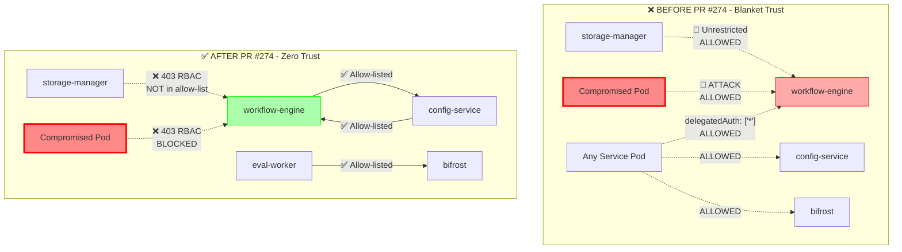
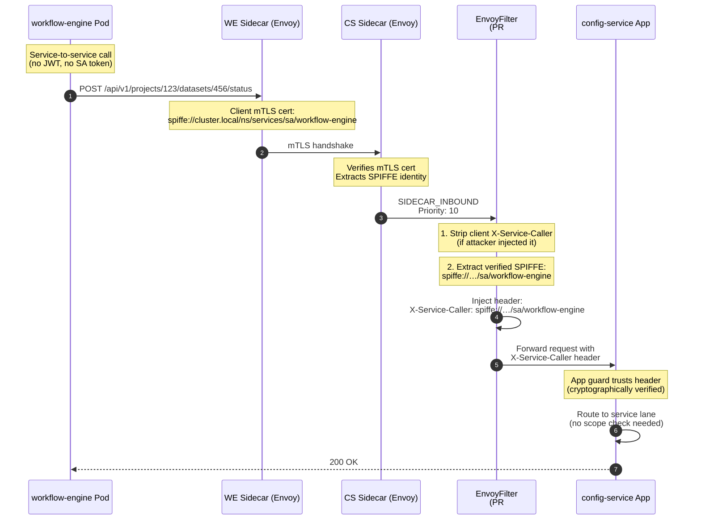
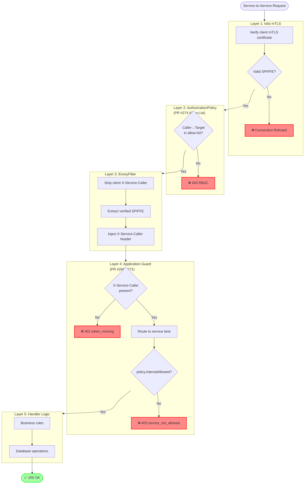
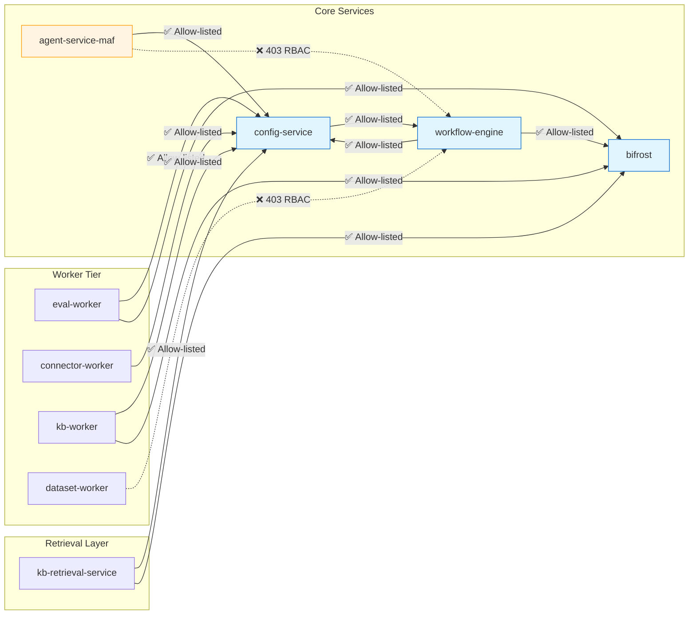
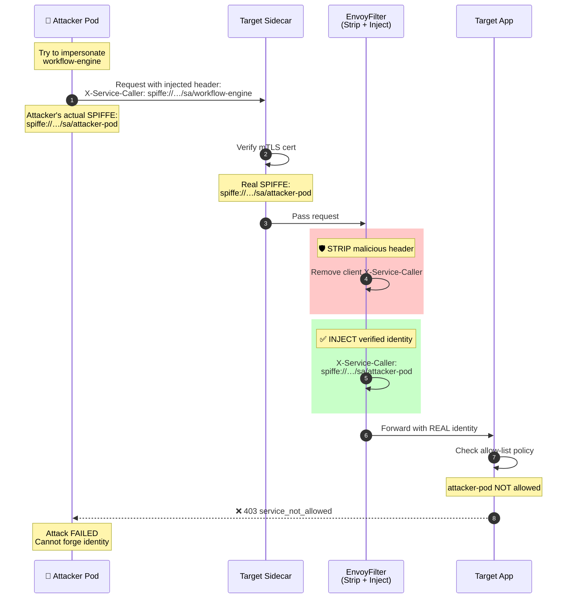
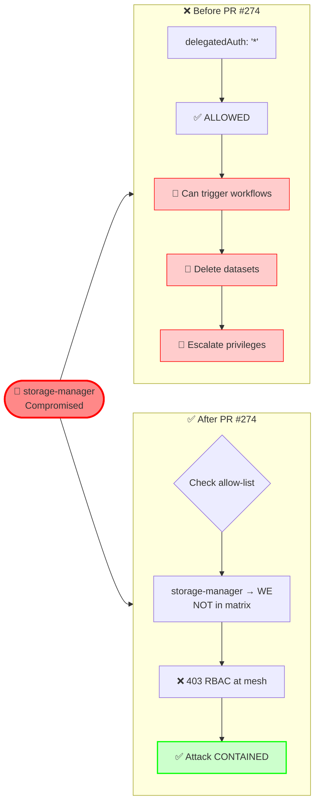
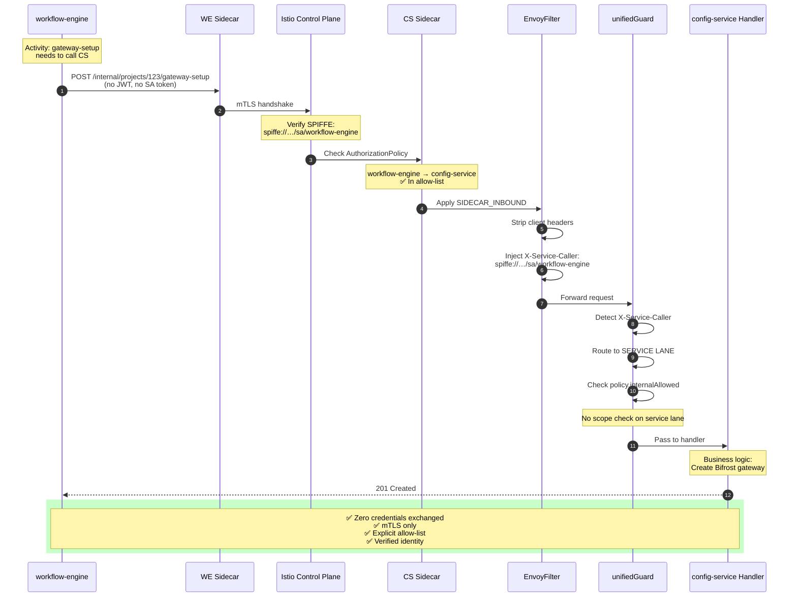
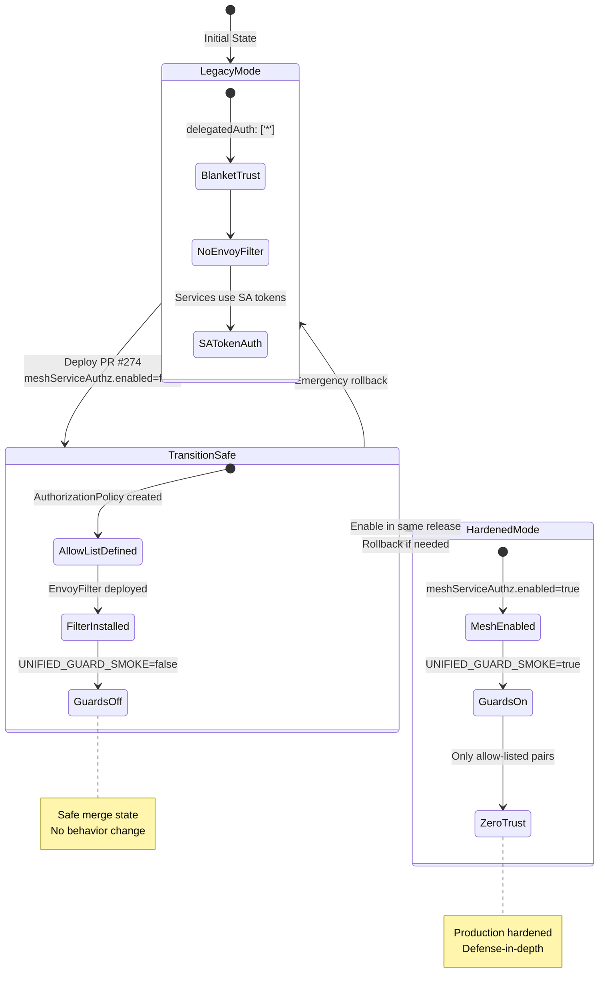

# PR #274: Mesh Service Authorization Hardening - Visual Diagrams

## 1. Before vs After: Security Posture



---

## 2. X-Service-Caller Injection Flow



---

## 3. Authorization Layers (Defense-in-Depth)



---

## 4. Allow-List Matrix (Service Graph)



---

## 5. Attack Prevention: Header Spoofing



---

## 6. Attack Prevention: Lateral Movement



---

## 7. Complete Service-to-Service Flow (PR #274 + #268)



---

## 8. Toggle States & Migration Path



---

## 9. Security Properties Summary

| Property | Without PR #274 | With PR #274 |
|----------|-----------------|--------------|
| **Service Identity** | ⚠️ SA tokens (forgeable) | ✅ mTLS SPIFFE (crypto-verified) |
| **Access Control** | 🚨 Any→Any (blanket trust) | ✅ Explicit allow-list matrix |
| **Lateral Movement** | 🚨 Full platform access | ✅ Limited to allowed pairs |
| **Header Spoofing** | 🚨 Client can inject | ✅ Stripped + mesh-injected |
| **Compromised Pod Blast Radius** | 🚨 Unrestricted | ✅ Contained by allow-list |
| **Defense Layers** | ⚠️ Single (app guard) | ✅ Multi-layer (mesh + app) |
| **Namespace Trust** | 🚨 Blanket worker exemption | ✅ Per-SA granular rules |
| **Attack Surface** | 🚨 N×N (all pairs) | ✅ ~15 explicit pairs |

---

## 10. Key Takeaways

### Before PR #274 (Insecure)
```
┌─────────────────────────────────────────┐
│  ANY POD → ANY SERVICE                  │
│  ══════════════════════                 │
│  • Blanket trust                        │
│  • No lateral movement protection       │
│  • Header spoofing possible             │
│  • Compromised pod = full access        │
└─────────────────────────────────────────┘
```

### After PR #274 (Hardened)
```
┌─────────────────────────────────────────┐
│  EXPLICIT ALLOW-LIST ONLY               │
│  ═══════════════════════                │
│  • Zero-trust model                     │
│  • Per-pair authorization               │
│  • Crypto-verified identity             │
│  • Attack containment                   │
│  • Multi-layer defense                  │
└─────────────────────────────────────────┘
```

### The Core Innovation
```
🔒 PR #274 = "Trust No One by Default"

   Mesh validates WHO you are (mTLS SPIFFE)
      ↓
   AuthorizationPolicy validates WHAT you can call
      ↓
   EnvoyFilter injects verified identity
      ↓
   App Guard validates WHY you're calling
      ↓
   Handler executes business logic
```

---

**Created:** 2026-07-01  
**Purpose:** Visual explanation of PR #274 mesh security hardening  
**Related PRs:** #268 (config-service guard), #272 (workflow-engine guard), #274 (mesh)
