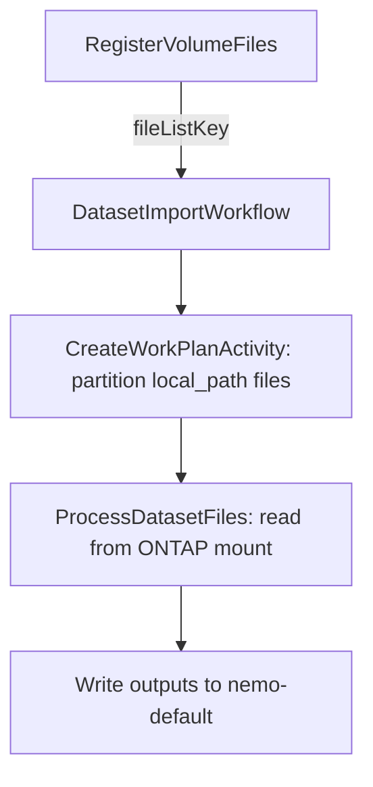

# NetApp ONTAP connector and managed MCP server

> Status: implemented (v1)
> Owners: Connectors / MCP Server platform
> Audience: developers extending the connector or MCP catalogs

This doc describes the **NetApp ONTAP** integration that ships in two
coordinated halves: a discovery-only **connector** (used by the project explorer
and dataset acquisition surfaces) and a **managed MCP server** that the agent
can call to read and (optionally) act on ONTAP storage. Both halves share the
same `ontap_common` REST client and the same K8s-Secret–backed credential. See
[connectors.md](connectors.md) for the broader connector subsystem and the
[platform HLD](platform-hld.md) for where these pieces sit.

## Doc map

- **What's new** — `connector_type='storage'`, ONTAP credential adapter, ONTAP
  provider catalog entry, ONTAP MCP catalog entry with `credentialMapping`.
- **Components** — `ontap_common` (Python client), `OntapAdapter`, in-tree
  `mcp-server-ontap` image, `MCPRuntimeManager` runtime-credential plumbing.
- **Credentials** — Basic auth OR mTLS, projected as env vars and/or mounted
  files into the MCP pod via per-server K8s Secrets with owner references.
- **Tool surface** — Read tools enabled by default; write tools opt-in via
  `allowedTools`; every write call emits a structured audit log line.
- **Operational** — Egress port derived from `cluster_url`; rotation triggers a
  rolling restart of the MCP Deployment; truncation marker on paginated lists.

## Why split into two halves?

- The **connector** lets the platform browse ONTAP from the explorer and (in a
  later phase) acquire snapshot/volume metadata into datasets — it doesn't need
  to expose ONTAP to the LLM. Discovery uses the same Temporal worker pool as
  every other connector adapter, so it inherits scheduling, retries, and
  credential isolation.
- The **MCP server** is the LLM-facing surface: it speaks the
  Model Context Protocol over streamable HTTP (via `supergateway`) and exposes
  ONTAP REST as tools. It runs as its own short-lived pod per project so the
  blast radius of a credential leak is one project, not the whole cluster.

Both halves resolve to the same set of K8s Secrets, so an admin only configures
one Credential per cluster.

## Architecture

```text
GUI
 ├─ Connector wizard (category=storage)
 │    -> POST /datasources type=connector subType=storage provider=ontap
 │       connectorConfig: { cluster_url, verify_tls, default_svm }
 │       credentialId    : <ONTAP credential>
 │
 └─ MCP server wizard (catalog=Ontap_mcp_logs)
      -> POST /mcp-servers
         envOverrides           : { ONTAP_CLUSTER_URL, ONTAP_VERIFY_TLS, ONTAP_DEFAULT_SVM }
         runtimeCredentialId    : <ONTAP credential>      (NEW)
         credentialId (gateway) : <bearer token cred>     (existing)

Config Service
 ├─ providers/connector.ts     OntapCredentialAdapter   (basic OR mTLS)
 ├─ provider-catalog.json      provider=ontap, scope=account, listSvms/...
 ├─ catalog/mcpServerCatalog   Ontap_mcp_logs + credentialMapping
 ├─ services/MCPRuntimeManager
 │    materializeRuntimeCredential -> per-server K8s Secret
 │    parseEgressPortsFromUrl      -> NetworkPolicy egress
 │    syncRuntimeSecret            -> rolling restart on rotation
 └─ services/CredentialService     fanOutToManagedMcps   (rotation)

Workflow Engine (Go)
 └─ executor.TestProviderConnection  routes ontap -> connector-worker

Connector Worker (Python)
 ├─ ontap_common/                   OntapClient (basic + mTLS, paginated)
 ├─ adapters/ontap_adapter.py       ProviderAdapter for explorer actions
 └─ activities/explorer.py          TestProviderConnection (generic)

mcp-server-ontap image (in-tree)
 ├─ ontap_common/                   vendored copy of the same client
 ├─ server.py                       MCP Python SDK tools
 └─ supergateway                    stdio -> streamable HTTP shim
```

## Components

### `ontap_common` (Python)

Single source of truth for talking to ONTAP REST. Lives at
`src/nemo/workers/connector-worker/ontap_common/` and is **vendored** into
`src/images/mcp-server-ontap/ontap_common/` at image build time. Keep the two
copies byte-identical.

Responsibilities:

- Pick **mTLS** when both `client_cert_pem` and `client_key_pem` are present;
  otherwise fall back to **basic auth** (`username`+`password`). Reject if
  neither is supplied.
- Write PEM material to per-call temp files with `0600` (cert/key) or `0444`
  (CA bundle) modes; unlink on `__exit__` regardless of outcome.
- Map `requests.exceptions.SSLError` → `OntapTLSVerifyError` so callers can
  surface a `TLS_VERIFY_FAILED` hint to the GUI; map `401/403` →
  `OntapAuthError`; map timeouts → `OntapTimeoutError`.
- Paginate via `_links.next.href` until either a hard cap (default 1000) or
  the server stops returning a `next` link. Surface `truncated=True` on the
  result so the explorer can render a "more results omitted" marker.
- Idempotent retries are limited to GET/HEAD on `502/503/504` only — never on
  auth failures.

### `OntapAdapter` (Python)

`src/nemo/workers/connector-worker/adapters/ontap_adapter.py`

`ProviderAdapter.execute(connector_config, credential, action, payload)`
dispatches to action-specific helpers. Every helper opens an `OntapClient`
context manager so temp files are cleaned up; every exception is converted into
an `ExplorerResponse` envelope rather than escaping. Supported actions:

| Action                  | ONTAP path                                         | Notes                                                  |
| ----------------------- | -------------------------------------------------- | ------------------------------------------------------ |
| `testConnection`        | `/api/cluster`                                     | Returns single `service` node with cluster name + OS    |
| `listServices`          | static                                             | Explorer root: one “Storage VMs (SVMs)” node, or a single SVM when `default_svm` is set (aggregates/LIFs omitted from the tree) |
| `listSvms`              | `/api/svm/svms`                                    | `name=` filter when `default_svm` is set                |
| `listVolumes`           | `/api/storage/volumes`                             | Requires `svm_uuid` or `svm_name`                       |
| `listLuns`              | `/api/storage/luns`                                | Requires `svm_uuid` or `svm_name`                       |
| `listSnapshots`         | `/api/storage/volumes/{uuid}/snapshots`            | Requires `volume_uuid`                                  |
| `listAggregates`        | `/api/storage/aggregates`                          | Cluster-wide                                            |
| `listNetworkInterfaces` | `/api/network/ip/interfaces`                       | Cluster-wide                                            |

When pagination caps a list, the **last** node in the response carries
`metadata.truncated=true`, which the explorer renders as a "more results"
marker. We do not invent synthetic "show more" nodes — the cap is informational
for v1.

### Generic `TestProviderConnection` activity

`src/nemo/workers/connector-worker/activities/explorer.py` exposes a single
provider-agnostic activity that runs `adapter.execute(..., 'testConnection')`
and returns `{success, message, code}`. The Go workflow engine (`executor.go`)
routes ONTAP via the connector's `provider` field without disturbing the
existing per-provider dispatch (S3, Postgres, MySQL).

### `MCPRuntimeManager` runtime credentials

When an MCP catalog entry declares `credentialMapping`, the MCPServer record
**must** carry `runtimeCredentialId` (separate from the existing `credentialId`
that gates the agent → MCP gateway auth). At provision time:

1. Read the credential's K8s Secret data via `CredentialService.readSecretData`.
2. Filter to the keys named in `envFromKeys` ∪ `fileFromKeys`; drop empties.
3. Create / replace the per-server Secret `mcp-runtime-cred-<serverId>`.
4. Patch an `ownerReference` to the Deployment so K8s GC handles cleanup.
5. Inject env vars (`envFromKeys`) and mount files (`fileFromKeys`) into the
   MCP container at the paths the catalog specifies.
6. Add an annotation containing a 16-char checksum of the projected data so
   that **rotating** the underlying credential re-rolls the Deployment via
   `syncRuntimeSecret`.

Egress ports for the NetworkPolicy are derived from `ONTAP_CLUSTER_URL` so
operators don't have to hand-edit policies for non-443 lab clusters.

### `mcp-server-ontap` image

Lives at `src/images/mcp-server-ontap/`. Built per-arch by the existing
multi-arch image builder. Layout:

- `ontap_common/` — vendored client (kept in sync with the worker copy).
- `server.py` — Python MCP SDK server. Read tools are always registered. Write
  tools are registered only when their name appears in `ONTAP_ALLOWED_TOOLS`
  (set by the runtime from MCPServer.allowedTools, which defaults to the
  catalog's read-only set).
- `Dockerfile` — Python 3.12 slim + Node.js + `supergateway` (latest). The
  entrypoint pipes `python server.py` (stdio MCP) through `supergateway` so
  the agent gateway sees a streamable HTTP MCP endpoint on port 8000.

Every write tool emits a JSON audit line on stdout *and* stderr before issuing
the REST call, so `kubectl logs` and the cluster log shipper both capture it
even if one is dropped.

## Credentials and rotation

A single Credential row (provider=`ontap`) is consumed by both halves. The
credential's K8s Secret may contain any of: `username`, `password`,
`client_cert_pem`, `client_key_pem`, `ca_bundle_pem`. The
`OntapCredentialAdapter.validate` enforces the basic-OR-mTLS rule before the
credential is persisted.

Rotation flow:

1. User updates the credential via the existing `POST .../credentials/:id/rotate`.
2. `CredentialService.rotateSecret` writes the new Secret values.
3. `CredentialService.fanOutToManagedMcps` (added) finds every MCPServer whose
   `runtimeCredentialId` matches and calls
   `MCPRuntimeManager.syncRuntimeSecret(server, catalogEntry)`.
4. `syncRuntimeSecret` re-projects the keys, recomputes the checksum, updates
   the Secret, and patches the Deployment annotation — which triggers a normal
   K8s rolling restart of the MCP pod.

The connector half doesn't need any rotation hook because it reads the
credential at activity-start time on every workflow run.

## GUI integration

- **Connector wizard** (`ConnectorWizard.tsx`) gains a `storage` category.
  Connector-type dropdown derives `provider=ontap`. Step 2 collects
  `cluster_url`, `verify_tls`, `default_svm`. The credential picker is filtered
  to provider=`ontap`.
- **MCP server wizard** (`MCPServerWizard.tsx`) — when `catalog.credentialMapping`
  is set, a *runtime credential* picker appears alongside the existing gateway
  credential picker, filtered to `expectedProvider`. The review step warns if
  the runtime credential is missing.
- The credential editor renders multiline `<Textarea>` inputs for PEM fields
  via `CredentialSecretFields.tsx` (the field metadata flags `multiline: true`
  for `client_cert_pem`, `client_key_pem`, `ca_bundle_pem`).

## Testing

The unit suites stay fast by avoiding K8s and Temporal entirely:

- **Python**: `src/nemo/workers/connector-worker/tests/test_ontap_client.py`
  (auth selection, pagination cap, SSL → TLS_VERIFY_FAILED mapping) and
  `tests/test_ontap_adapter.py` (action dispatch, validation, truncation
  marker, error envelope mapping). Run with
  `pytest src/nemo/workers/connector-worker/tests`.
- **TypeScript**: `src/nemo/config-service/tests/ontap.unit.test.ts` covers
  `OntapCredentialAdapter.validate`, `parseEgressPortsFromUrl`,
  `checksumSecretData` (rotation determinism), `runtimeCredSecretName`, and
 drift-checks the `Ontap_mcp_logs` catalog entry. Run with `npm run test:ontap`
  in `src/nemo/config-service`.

End-to-end provisioning tests (real K8s) live in the integration suite.

## Volume acquisition (zero-copy)

v1 was discovery-only. Volume acquisition is now implemented: users can create
datasets sourced from a registered ONTAP volume. The platform mounts the volume
read-only and reads files in-place — **no data is copied** to nemo-default
during acquisition.

### Flow

1. User registers an ONTAP volume as a DataSource (`type: 'volume'`).
   Storage-manager creates a `PersistentVolume` (NFS source from
   `volumeConfig.volume_info.endpoint` + junction path) and
   `PersistentVolumeClaim` (`vol-pvc-{projectId}-{volumeId}`).
2. Storage-manager creates a `VolumeMountSet` CR targeting data plane
   deployments. The `VolumeMountSetController` patches Deployments to mount
   the PVC at `/mnt/volumes/{volumeId}` (**read-only**).
3. User creates a dataset with `originVolume` set to the volume DataSource id
   (and optional `filterSpec.sourcePath` for a sub-path within the volume).
4. `DataAcquisitionWorkflow` detects `originVolume` and calls
   `runVolumeDataAcquisition` (streaming pipeline; see [stream-pipeline.md](stream-pipeline.md)):
   - Fetches volume DataSource config via `FetchDataSourceConfigActivity`
   - Resolves mount path: `/mnt/pvcs/{volumeName}` + `filterSpec.sourcePath` (volume DataSource `name` is used when id is empty)
   - Dispatches concurrent `DiscoverVolumeFiles` + `RegisterBatch` activities, then `FinalizeRegistration`, which writes `manifest.json` under `projects/<projectId>/datasets/<datasetId>/_acquisition/`

### `RegisterVolumeFiles` (legacy helper activity)

The worker still registers a `RegisterVolumeFiles` activity (single `os.walk` + `filelist.json`), but **`runVolumeDataAcquisition` in workflow-engine uses the streaming path above**, not this activity. For layout reference: a file list would live at `projects/<pid>/datasets/<id>/_acquisition/filelist.json` with `local_path` entries pointing at the volume mount.

### Downstream processing

`DatasetImportWorkflow` receives `FileListKey`. `CreateWorkPlanActivity`
builds `K_eff` non-empty manifests from total bytes and worker env, preserves
`local_path` in each manifest entry. Each `ProcessDatasetFiles` activity in the dataset-processor:
- Detects `local_path` in the file info and reads directly from the mount
- Skips download (no S3 `download_file` call)
- Never calls `unlink()` on volume files (only on downloaded temp files)
- Writes processed outputs (Parquet, stats, metadata) to nemo-default as usual

### Incremental acquisition (mtime watermark)

Uses the existing `acquisitionConfig.lastWatermarkValue` mechanism. For volumes,
the watermark is an ISO 8601 timestamp of the newest `st_mtime` seen. After
successful import, `runVolumeDataAcquisition` persists `maxMtime` via
`UpdateDatasetWatermarkActivity`. Next scheduled run picks up only
new/modified files.



## Future work

- **AutoSupport / EMS event ingestion** — would need a streaming connector,
  parked behind the same Kafka/streams design called out in `connectors.md`.
- **More write tools** — additional ONTAP operations can be added to
  `server.py`; expose them in `defaultAllowedTools` only after a security review.
- **GUI volume browser** — directory browser for volume source selection during
  dataset creation (Phase 1A-9).

## NFS mount preflight (registration guardrail)

Before a volume from the explorer can be registered as a project bucket, the
connector-worker evaluates **`mount_preflight`** on each volume node (and SVM
rows are enriched with the resolved **data NFS LIF**, NFS service state, and a
**TCP 2049 probe** from the worker pod).

### Hard-fail (`blocking[]`) — registration must not proceed

Typical codes include:

1. **`no_junction_path`** — volume has no NAS junction / export path.
2. **`no_data_nfs_lif`** — no SVM-scoped LIF advertising `data_nfs` was found.
3. **`svm_not_running`** — SVM state is not `running`.
4. **`nfs_service_disabled` / `nfs_service_offline`** — NFS service not usable.
5. **`no_nfs_protocol_enabled`** — no NFSv3/v4 protocol enabled on the SVM service.
6. **`tcp_2049_refused`** — TCP connect to the LIF on port 2049 failed (often
   “connection refused” when the IP is not actually serving NFS).
7. **`export_policy_blocks_node_cidr`** — optional: when the connector config
   lists **`client_cidrs`**, export-policy rules are checked; if node CIDRs are
   not covered, registration is blocked.

### Warnings (`warnings[]`)

- **`export_policy:<name>`** — operator must verify export rules allow worker
  node IPs (or matching CIDRs).
- **`nfs_service_unavailable`** — NFS service object could not be read; treated
  as a warning, not a hard block.

### TCP probe caveat

The probe runs from the **connector-worker pod** (`probe_origin: connector_worker_pod` in
metadata). It is a strong signal but **not identical** to kubelet network path;
firewall or node routing can still block mounts even when the worker probe succeeds.

### Troubleshooting: `mount.nfs: Connection refused`

1. In the explorer, confirm the **SVM row** shows the expected **NFS data LIF**
   and **TCP 2049** status (green vs yellow/red).
2. Expand the SVM and review **Network Interfaces** — ensure a LIF has
   `data_nfs` and an IP that answers on 2049.
3. Verify **export policy** allows your worker nodes; use connector
   **`client_cidrs`** to enforce a blocking check when appropriate.
4. After changing LIF or junction, use **Repair** / **preflight** on the volume
   list and update **`volume_info.endpoint`** if needed.

## References

- **Internal:** [connectors.md](connectors.md), [platform-hld.md](platform-hld.md),
  catalog at `src/nemo/config-service/catalog/mcpServerCatalog.ts`,
  client at `src/nemo/workers/connector-worker/ontap_common/`,
  runtime at `src/nemo/config-service/services/MCPRuntimeManager.ts`.
- **External:** [ONTAP REST API](https://docs.netapp.com/us-en/ontap-restapi/),
  [Model Context Protocol](https://modelcontextprotocol.io/),
  [supergateway](https://github.com/supercorp-ai/supergateway),
  [Kubernetes Secrets](https://kubernetes.io/docs/concepts/configuration/secret/).
