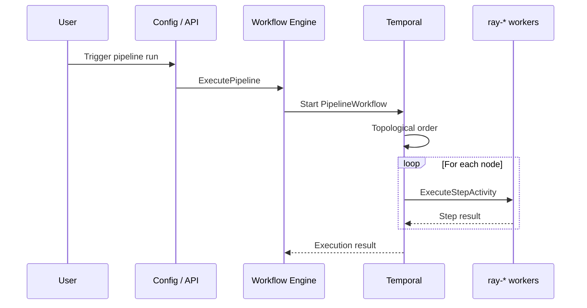

# Pipeline design

Pipelines use the Workflow Engine, [Temporal](https://docs.temporal.io/), and (for data) [datasets](datasets.md) and storage as described in [Platform HLD](platform-hld.md). This doc describes pipeline definition, execution, and task queues.

## Doc map

- **Overview and role** — What pipelines are and how they run.
- **Pipeline definition** — DAG (graph), nodes, edges, types.
- **Execution** — Workflow Engine, Temporal, task queue naming, topological order.
- **Activities and queues** — ExecuteStepActivity, deployment-specific queues (e.g. ray-*).
- **Agent block execution** — Async invoke+poll protocol for agent-service calls.
- **Data passing between steps** — `previousOutputs` schema and variable interpolation.
- **Human-in-the-Loop** — HIL signal/resume, approval payload, timeout.
- **Pipeline scheduling** — Temporal Schedule integration for cron-triggered runs.
- **Execution persistence** — Config-service routes for stepResults and run state.
- **Implementation notes** — Key code.
- **References** — Internal and external links.

## When to read what

- **Implementing pipeline execution?** → §Execution and §Activities and queues; workflow-engine and pipeline workflow code.
- **Defining or changing pipeline schema?** → §Pipeline definition and Config Service Pipeline model.
- **Understanding how pipelines use data?** → [datasets.md](datasets.md) and node config (dataset references).

---

## Part A — Overview and role

### What pipelines are

A **pipeline** is a **DAG** (directed acyclic graph) of processing steps: data transformation, ETL, or API workflow. Users define **nodes** (steps) and **edges** (dependencies); execution runs steps in topological order with retries and observability. Pipelines consume [datasets](datasets.md) and other inputs; results are written to storage or downstream systems.

---

## Part B — Pipeline definition

### Graph structure

- **Pipeline** — id, projectId, name, description, type (`Data` | `API`), graph, createdAt, updatedAt. See [Pipeline types](src/nemo/workflow-engine/pkg/types/execution.go), [Config Service Pipeline model](src/nemo/config-service/models/Pipeline.ts).
- **Graph** — nodes and edges. **Node:** id, type, config, optional metadata. **Edge:** from, to, optional config. The graph must be acyclic so execution order is well-defined (topological sort).

---

## Part C — Execution

### Flow

1. User triggers a run (GUI or API).
2. Config/API calls Workflow Engine (e.g. `ExecutePipeline`).
3. Workflow Engine fetches the pipeline definition from Config Service and starts **PipelineWorkflow** on the orchestration task queue.
4. PipelineWorkflow executes nodes in **topological order**: for each node, when all dependencies (edges from → to) are done, it dispatches an activity (ExecuteStepActivity) to the appropriate activity queue.
5. Activities run on deployment-specific workers (e.g. Ray clusters). Completion is recorded; on failure the workflow can retry or fail the run.
6. Execution metadata (executionId, status, steps) is stored; Config Service or history service may persist execution records.

### Task queue naming

**Orchestration queue:** Current code may use a queue named `pipeline-execution` for pipeline runs. The platform design prefers a **generic** name (e.g. `platform-workflows` or `workflow-orchestration`) so the same queue can run KB creation, pipeline runs, and other workflows. Activity queues (e.g. `ray-{clusterId}`) are **separate** and deployment-specific: the workflow schedules ExecuteStepActivity on a queue like `ray-<clusterId>` so the activity runs on the right cluster. See [pipeline.go](src/nemo/workflow-engine/internal/workflows/pipeline.go), [executor.go](src/nemo/workflow-engine/internal/services/executor.go).



---

## Part D — Activities and queues

- **ExecuteStepActivity** — Runs one pipeline step (node). Input: clusterId, nodeId, nodeType, config, pipelineId, executionId. The activity is scheduled on a task queue such as `ray-{clusterId}`.
- **Execution history** — executionId, pipelineId, projectId, workflowId, runId, status (running, completed, failed, cancelled), startedAt, endedAt, steps (nodeId, status, results, error). Stored in workflow-engine history and/or Config Service (e.g. [PipelineExecution](src/nemo/config-service/models/PipelineExecution.ts)).

---

## Part E — Agent block execution

`Status: Planned`

### Protocol: Async Invoke + Poll

The pipeline uses agent-service's async invoke API to avoid holding an HTTP connection for minutes of LLM reasoning.

```
POST /api/v1/projects/{projectId}/agents/{agentId}/invoke/async
  → { "taskId": "..." }

GET /api/v1/projects/{projectId}/tasks/{taskId}
  → { "status": "running"|"completed"|"failed", "response": "..." }
```

### Activity Implementation

In `step_execution.go`, the `agent` case dispatches to `executeAgentStep`:

```go
case "agent":
    return executeAgentStep(ctx, node, input)
```

The `executeAgentStep` function:

1. Reads `agentId` and `message` from `node.Config`
2. Interpolates variables in `message` using `input.PreviousOutputs`
3. Calls agent-service async invoke (POST)
4. Polls task status every 5 seconds with `activity.Heartbeat` calls
5. On completion, parses `response` as JSON into `StepResult.Output`
6. On failure, returns error with agent error details

### Timeout

- `StartToCloseTimeout`: 15 minutes (configurable per-node via `node.Config["timeoutSeconds"]`)
- `HeartbeatTimeout`: 30 seconds (ensures Temporal detects stuck activities)

### Configuration Schema

```json
{
  "type": "agent",
  "config": {
    "agentId": "agent-uuid-here",
    "message": "Analyze storage optimization opportunities for {{schedule_1.trigger}}",
    "projectId": "project-uuid",
    "timeoutSeconds": 900
  }
}
```

### Task Queue Routing

For pipeline steps that are NOT Ray/GPU workloads, execution routes to the workflow's own queue rather than a `ray-*` queue:

```go
func determineTargetCluster(node types.PipelineNode, pipeline *types.Pipeline) string {
    if queue, ok := node.Config["taskQueue"].(string); ok {
        return queue
    }
    switch node.Type {
    case "agent", "human_in_the_loop", "response", "schedule":
        return "" // empty = use workflow's own queue (pipeline-execution)
    default:
        return "us-east-1" // backward-compatible for pod/container types
    }
}
```

When `targetCluster` is empty, skip the `ray-` prefix and use the workflow's task queue directly.

### Authentication: Pipeline → Agent-Service

Internal service-to-service token passed as `Authorization: Bearer <token>` header.

- Environment variable: `AGENT_SERVICE_TOKEN` on workflow-engine deployment
- Agent-service accepts this token for internal calls (bypass user-context check when token matches)
- The request includes `X-Project-Id` and `X-User-Id` headers for audit attribution

Every agent invocation from a pipeline includes `projectId`, `userId` (who created/scheduled the pipeline), and `executionId` for audit tracing.

---

## Part F — Data passing between steps

`Status: Planned`

### Schema

The workflow maintains a `map[string]interface{}` called `outputs`, keyed by node ID:

```go
type PipelineWorkflowState struct {
    Outputs map[string]interface{} // nodeID → StepResult.Output
}
```

### Flow

1. After each step completes: `state.Outputs[node.ID] = stepResult.Output`
2. Before each step: build `previousOutputs` from inbound edges' source nodes:
   ```go
   previousOutputs := map[string]interface{}{}
   for _, edge := range inboundEdges(node.ID) {
       if output, ok := state.Outputs[edge.From]; ok {
           previousOutputs[edge.From] = output
       }
   }
   ```
3. Pass `previousOutputs` to `StepExecutionInput`

### Variable Interpolation

Template syntax: `{{nodeId.fieldPath}}`

Examples:
- `{{analysis_1.recommendations}}` → the `recommendations` field from node `analysis_1`'s output
- `{{hil_1.approvedItems}}` → the `approvedItems` field from the HIL node's output

Implementation: recursive JSON path resolution with `{{...}}` regex matching. Nested paths use dot notation. If a referenced field is an object/array, it is serialized to JSON string for inclusion in the message.

### Backward Compatibility

- Existing pipelines with no `previousOutputs` usage continue to work (field is simply empty)
- `StepExecutionInput` gains a new optional field; existing activities ignore it

---

## Part G — Human-in-the-Loop

`Status: Planned`

### Workflow-Level Wait (NOT an Activity)

HIL cannot be an activity because activities have bounded timeouts. Instead, the HIL logic lives directly in `PipelineWorkflow`:

```go
case "human_in_the_loop":
    // 1. Update execution status
    _ = workflow.ExecuteActivity(localCtx, "UpdateExecutionStatus",
        input.ProjectID, input.PipelineID, executionID, "waiting_for_approval", node.ID)

    // 2. Send notification
    notifPayload := buildHILNotification(node.Config, state.Outputs, executionID)
    _ = workflow.ExecuteActivity(localCtx, "SendHILNotification", notifPayload)

    // 3. Wait for signal (blocks until signal received or timeout)
    signalCh := workflow.GetSignalChannel(ctx, "hil_resume")
    var resumePayload HILResumePayload
    
    timeout := getHILTimeout(node.Config) // default 7 days
    timerCtx, cancelTimer := workflow.WithCancel(ctx)
    timerFuture := workflow.NewTimer(timerCtx, timeout)
    
    selector := workflow.NewSelector(ctx)
    selector.AddReceive(signalCh, func(ch workflow.ReceiveChannel, more bool) {
        ch.Receive(ctx, &resumePayload)
        cancelTimer()
    })
    selector.AddFuture(timerFuture, func(f workflow.Future) {
        resumePayload = HILResumePayload{TimedOut: true}
    })
    selector.Select(ctx)

    // 4. Filter analysis output by approved IDs
    if resumePayload.TimedOut {
        stepResult.Status = "timed_out"
        stepResult.Error = "HIL approval timed out after " + timeout.String()
    } else {
        inboundNodeID := getInboundSourceNode(node.ID, pipeline.Edges)
        analysisOutput := state.Outputs[inboundNodeID]
        approvedItems := filterRecommendationsByIds(analysisOutput, resumePayload.ApprovedIds)
        stepResult.Output = map[string]interface{}{
            "approvedItems": approvedItems,
            "approvedIds":   resumePayload.ApprovedIds,
            "rejectedIds":   resumePayload.RejectedIds,
        }
    }
```

### Resume Payload

```go
type HILResumePayload struct {
    ApprovedIds []string `json:"approvedIds"`
    RejectedIds []string `json:"rejectedIds"`
    TimedOut    bool     `json:"timedOut,omitempty"`
}
```

### Resume HTTP Endpoint

```
POST /api/v1/projects/:projectId/pipelines/:pipelineId/executions/:executionId/resume
Body: { "approvedIds": ["r1", "r3"], "rejectedIds": ["r2"] }
```

Implementation in `executor.go`:

```go
func (s *ExecutorService) ResumeExecution(executionId string, payload HILResumePayload) error {
    return s.temporalClient.SignalWorkflow(
        context.Background(), executionId, "", "hil_resume", payload,
    )
}
```

### Notification

The `SendHILNotification` activity is configurable (Slack webhook, email, etc.):

```go
type HILNotificationPayload struct {
    Channel      string                 // "slack", "email"
    WebhookURL   string                 // Slack webhook URL from node.Config
    Summary      string                 // e.g. "12 recommendations, $4250/mo savings"
    ResumeURL    string                 // Link to run detail page
    PendingData  map[string]interface{} // The analysis output to show
}
```

---

## Part H — Pipeline scheduling

`Status: Planned`

### API

```
POST /api/v1/projects/:projectId/pipelines/:pipelineId/schedule
Body: { "cron": "0 8 * * *", "timezone": "America/Los_Angeles", "paused": false }

DELETE /api/v1/projects/:projectId/pipelines/:pipelineId/schedule

GET /api/v1/projects/:projectId/pipelines/:pipelineId/schedule
```

### Implementation

```go
func (s *ExecutorService) CreatePipelineSchedule(projectId, pipelineId, cron, timezone string) (string, error) {
    scheduleID := fmt.Sprintf("pipeline-%s-%s", projectId, pipelineId)
    _, err := s.temporalClient.ScheduleClient().Create(context.Background(), client.ScheduleOptions{
        ID: scheduleID,
        Spec: client.ScheduleSpec{
            CronExpressions: []string{cron},
            TimezoneName:    timezone,
        },
        Action: &client.ScheduleWorkflowAction{
            ID:        fmt.Sprintf("pipeline-%s-scheduled-%d", pipelineId, time.Now().Unix()),
            Workflow:  "PipelineWorkflow",
            TaskQueue: "pipeline-execution",
            Args: []interface{}{types.PipelineWorkflowInput{
                ProjectID:  projectId,
                PipelineID: pipelineId,
                Parameters: map[string]interface{}{"trigger": "scheduled"},
            }},
        },
    })
    return scheduleID, err
}
```

### Schedule Block Behavior at Execution Time

When `PipelineWorkflow` encounters a `schedule` type node, it is a **no-op** (the entry point). The schedule was already created externally. The node simply passes through with no output.

---

## Part I — Execution persistence

`Status: Planned`

### Config-Service Routes

Add to `src/nemo/config-service/routes/pipelineRoutes.ts`:

```
POST /api/v1/projects/:projectId/pipelines/:pipelineId/executions
Body: { executionId, status, startedAt, workflowId, parameters, userId }

PUT /api/v1/projects/:projectId/pipelines/:pipelineId/executions/:executionId
Body: { status?, stepResults?, finalOutput?, completedAt?, error? }
```

### Step Results Schema

```typescript
interface StepResult {
  nodeId: string;
  nodeType: string;
  status: "running" | "completed" | "failed" | "waiting_for_approval" | "timed_out";
  startedAt: string;
  completedAt?: string;
  output?: Record<string, any>;
  error?: string;
}

interface PipelineExecution {
  executionId: string;
  pipelineId: string;
  projectId: string;
  status: "running" | "completed" | "failed" | "waiting_for_approval";
  startedAt: string;
  completedAt?: string;
  stepResults: StepResult[];
  finalOutput?: Record<string, any>;
  parameters?: Record<string, any>;
  userId?: string;
  workflowId?: string;
}
```

### Workflow Persistence Strategy

1. On workflow start: `POST /executions` with `status: "running"`
2. After each step completes: `PUT /executions/:id` with updated `stepResults` array
3. On HIL pause: `PUT /executions/:id` with `status: "waiting_for_approval"`
4. On completion: `PUT /executions/:id` with `status: "completed"`, `finalOutput`, `completedAt`
5. On failure: `PUT /executions/:id` with `status: "failed"`, `error`

Persistence is best-effort (logged warning on failure, does not block workflow).

### Error Handling

| Failure Mode | Handling |
|-------------|----------|
| Agent-service unreachable | Activity retries (3 attempts, exponential backoff). If all fail, step marked failed. |
| Agent task times out (15 min) | Activity returns timeout error. Step marked failed. Pipeline can be configured to continue or halt. |
| HIL timeout (7 days) | Timer fires, step marked `timed_out`. Pipeline halts (no executor runs). |
| Config-service persistence failure | Warning logged. Workflow continues (persistence is best-effort). |
| Invalid agent response (not JSON) | Step marked failed with parse error details. |
| Partial execution (some recommendations fail) | Executor agent reports per-item status. Response block assembles full picture. |

### Testing Strategy

**Unit Tests:**
- Variable interpolation: `{{nodeId.field}}` resolution with nested paths, arrays, missing fields
- HIL payload filtering: `filterRecommendationsByIds` with edge cases (empty list, unknown IDs)
- Response block assembly: merging outputs from multiple steps

**Integration Tests:**
- Agent-service async invoke round-trip (mock agent that returns in 5s)
- Temporal signal send/receive (start workflow, send signal, verify resume)
- Config-service persistence (create, update, get execution)

**E2E Tests:**
- Full pipeline with a mock agent (returns canned recommendations)
- HIL pause → manual resume → executor runs
- Schedule creation → verify Temporal Schedule exists → manual trigger → verify execution

---

## Implementation notes

- **Workflow Engine:** [pipeline.go](src/nemo/workflow-engine/internal/workflows/pipeline.go) (PipelineWorkflow), [executor.go](src/nemo/workflow-engine/internal/services/executor.go) (ExecutePipeline, start workflow).
- **Config Service:** [Pipeline](src/nemo/config-service/models/Pipeline.ts), [PipelineExecution](src/nemo/config-service/models/PipelineExecution.ts).
- **Types:** [execution.go](src/nemo/workflow-engine/pkg/types/execution.go). GUI pipeline UI for defining and triggering pipelines.

---

## References

- **Internal:** [Platform HLD](platform-hld.md), [datasets.md](datasets.md), workflow-engine (pipeline workflow, executor), config-service (Pipeline, PipelineExecution), [docs/HLD.md](../HLD.md).
- **External:** [Temporal](https://docs.temporal.io/). If activity runtimes use [Ray](https://docs.ray.io/), link Ray docs where ray-* queues are explained.
