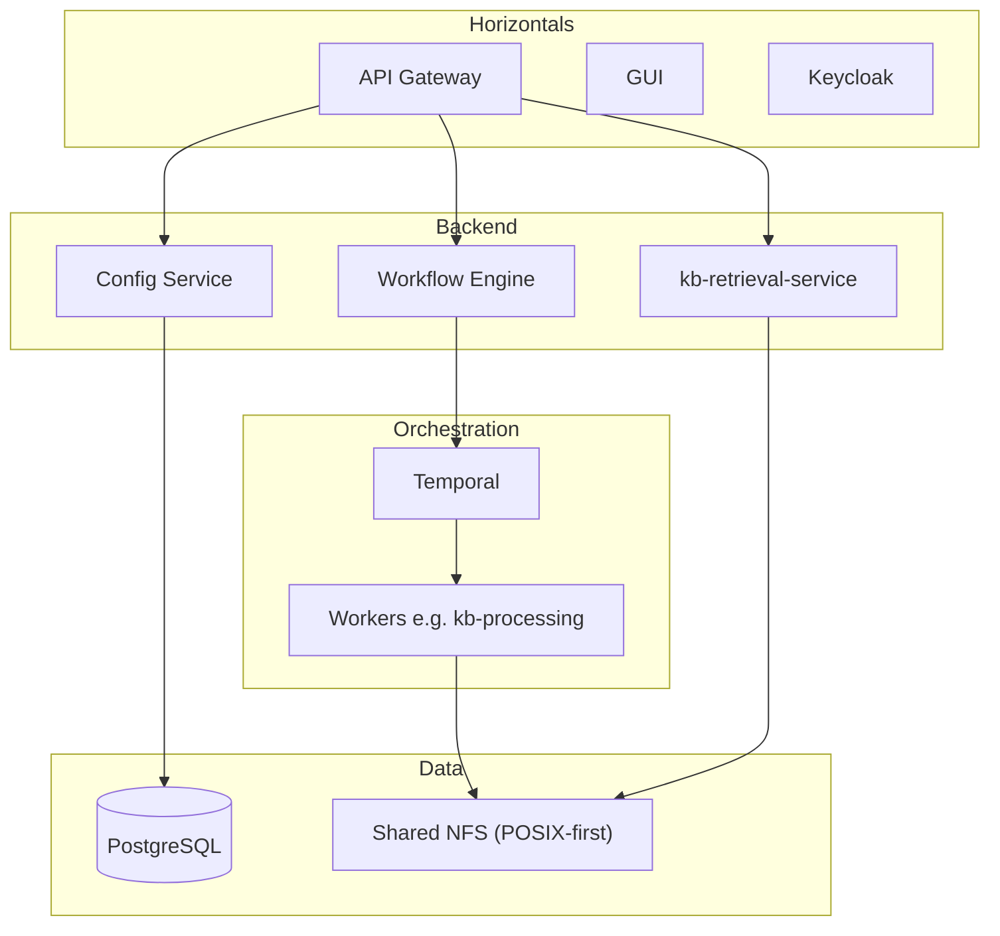
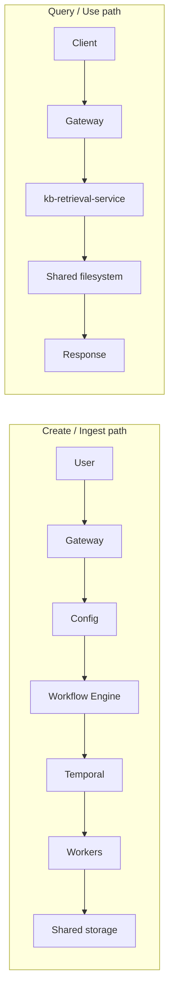

# Platform high-level design

Short design-focused view of the platform: building blocks, roles, interactions, core entities, and major user flows. For deeper subsystem detail see [docs/HLD.md](../HLD.md). Design summary: this doc.

## Overview

AgentStudio is a multi-region, distributed AI and data platform. In practice: users bring data in (via connectors or uploads), run pipelines and build knowledge bases for RAG, and work in isolated workspaces; the platform unifies storage (S3-compatible APIs over object store or shared filesystem), orchestrates long-running work with Temporal, and serves AI and retrieval through a single set of services.

**Key principles:** POSIX-first I/O (all data reads and writes go through the shared NFS mount; S3 gateway retained only for Iceberg/Lakekeeper catalog operations); Temporal-based workflow engine for reliable long-running jobs; catalog-driven structured data where applicable; Keycloak for auth; Kubernetes-native deployment.

## Related design docs

| Feature | Doc | Purpose |
| ------- | --- | ------- |
| Platform | This doc | Building blocks, entities, flows |
| Knowledge bases | [knowledge-base.md](knowledge-base.md) | KB creation, worker pool, retrieval |
| Connectors | [connectors.md](connectors.md) | Connector types, acquisition |
| Datasets | [datasets.md](datasets.md) | Dataset kinds, lifecycle |
| Pipelines | [pipelines.md](pipelines.md) | DAG execution, activities |
| Agents | [agents.md](agents.md) | Agent service, RAG |
| Workspaces | [workspaces.md](workspaces.md) | Templates, lifecycle |
| Workflows | [workflows.md](workflows.md) | Execution model, task queues, durability, scaling |

Full index: [docs/design/README.md](README.md).

## Building blocks (subsystems)

- **Horizontals**: API Gateway (routing, proxy, auth), GUI (web UI), [Keycloak](https://www.keycloak.org/documentation) (auth/authz).
- **Entities and metadata**: Config Service — projects, datasets, pipelines, workspaces, knowledge bases; state in [PostgreSQL](https://www.postgresql.org/docs/); catalog integration. Storage roots/volumes are configured per project or deployment (naming may evolve; avoid "buckets" in this doc).
- **Storage**: Where data lives — Storage Manager, S3 Gateway (VersityGW, retained as a compatibility layer for Iceberg/Lakekeeper only); shared filesystem (NFS mount of `s3gateway-default-bucket` PVC at `/mnt/pvcs/default-nemo`). All data plane pods mount this PVC for direct POSIX I/O. ONTAP volumes are mounted read-only at `/mnt/volumes/{volumeId}` for zero-copy dataset acquisition. We expose [S3-compatible APIs](https://docs.aws.amazon.com/AmazonS3/latest/API/Welcome.html) over NAS via VersityGW, but workers prefer POSIX I/O.
- **Workflows and jobs**: Workflow Engine (Go, HTTP API, stateless — no PVC or filesystem dependency), [Temporal](https://docs.temporal.io/) (orchestration), task queues and workers. The orchestration queue (e.g. `platform-workflows`; current code uses `pipeline-execution`) runs workflows for KB creation, pipelines, etc. Activity workers (Python) use dedicated queues (e.g. `dataset-processing`, `kb-processing`) and have the shared filesystem (PVC) mounted for data I/O. Detailed design: see [workflows.md](workflows.md).
- **AI**: **Bifrost** LLM gateway (sole gateway — all chat completions, embeddings, and MCP routing flow through it; see [bifrost-migration.md](bifrost-migration.md) and [unified-embedding-models.md](unified-embedding-models.md)); Agent Service; **kb-retrieval-service** (KB search: vector, FTS, hybrid, rerank; single service for all KBs).
- **Data layer**: PostgreSQL, shared filesystem (S3 or NAS), optional catalog (e.g. Lakekeeper); structured data may use [Apache Iceberg](https://iceberg.apache.org/).

## Roles and interactions

- **Gateway** routes requests to Config Service, Workflow Engine, kb-retrieval-service, and other backends; handles auth with Keycloak.
- **Config Service** persists entities (projects, datasets, KBs, etc.), triggers workflows (e.g. KB creation) via Workflow Engine, and enriches metadata (e.g. KB stats from shared storage).
- **Workflow Engine** starts Temporal workflows on the orchestration task queue; workflows dispatch activities to worker task queues (e.g. kb-processor on `kb-processing`). The workflow-engine is a stateless orchestrator with no filesystem mounts. Workers read/write the shared filesystem or storage.
- **kb-retrieval-service** reads KB metadata and LanceDB tables from the shared filesystem and serves search (vector, FTS, hybrid, multi-KB).

## Core entities

- **Projects** — Top-level container; groups datasets, pipelines, workspaces, KBs. Lifecycle: create → initialize (optional workflow) → use → delete (cleanup workflow). Detailed design: see docs/design/platform-hld.md (this doc).
- **Datasets** — Logical data with catalog integration; structured (Iceberg) or unstructured (file collection). Lifecycle: create → catalog/setup → process or use → delete. Detailed design: see [datasets.md](datasets.md).
- **Pipelines** — DAG of processing steps; executed by Workflow Engine and Temporal. Lifecycle: define → execute → completion. Detailed design: see [pipelines.md](pipelines.md).
- **Workspaces** — Isolated environments (e.g. JupyterLab, SQL Workbench). Lifecycle: create → orchestrate (Workspace Manager) → run → stop → delete. Detailed design: see [workspaces.md](workspaces.md).
- **Knowledge bases** — Documents and embeddings for RAG; created by workflow + kb-processor, served by kb-retrieval-service. Lifecycle: create → workflow runs (scatter/gather or single-unit) → write to shared filesystem → query via kb-retrieval-service. Embedding traffic (built-in MiniLM via in-cluster TEI, or registered hosted providers) flows through the Bifrost gateway at both index and query time; the KB's `metadata.json` carries the authoritative embedding identity (provider, gatewayModelId, dimensions) so retrieval picks the same model the indexer used. Detailed design: see [knowledge-base.md](knowledge-base.md); embedding architecture: see [unified-embedding-models.md](unified-embedding-models.md).

Storage is configured per project/deployment; we do not treat "Buckets" as a first-class entity in this design (naming may change).

## Storage and I/O model

### POSIX-first I/O

All data reads and writes go through the shared NFS mount (`s3gateway-default-bucket` PVC mounted at `/mnt/pvcs/default-nemo` on all data plane pods). VersityGW's POSIX backend maps S3 keys directly to filesystem paths, so files written by workers via POSIX are immediately visible through S3 `GetObject`/`ListObjects`. The S3 gateway is retained **only** for Iceberg/Lakekeeper catalog operations (PyIceberg has its own S3 I/O layer).

Workers use a `posix_path(key)` helper (resolves a storage key to `{NEMO_DEFAULT_STORE_ROOT}/{key}`) and `use_posix()` guard. When `NEMO_DEFAULT_STORE_ROOT` is set, all file operations use `shutil.copy2`, `Path.write_bytes`, `Path.read_bytes` instead of boto3 calls. Atomic write safety is maintained via write-to-temp-then-rename.

### Volume mounts

| Mount | Path | Access | Purpose |
|-------|------|--------|---------|
| `s3gateway-default-bucket` PVC | `/mnt/pvcs/default-nemo` | read-write | Project data: datasets, KBs, jobs |
| ONTAP volume PVCs | `/mnt/volumes/{volumeId}` | read-only | Zero-copy dataset acquisition source |

ONTAP volumes are provisioned by storage-manager (PV/PVC creation) and mounted via `VolumeMountSet` CRs that patch data plane Deployments. See [ontap-connector.md](ontap-connector.md) §Volume acquisition.

### Per-project data plane (target architecture)

Today all workers are shared across projects. The target architecture gives each project its own worker deployments with project-scoped Temporal task queues (`{queue}-{projectId}`), only that project's volumes mounted, and KEDA scale-to-zero for idle projects. The workflow-engine routes to per-project queues when `hasProjectDataPlane(projectId)` is true. Migration is incremental: shared workers continue serving projects without dedicated data planes. See the plan doc for full design.

## Major user flows

1. **Create project and dataset** — User → GUI → Config Service (create project/dataset) → optional workflow for setup (e.g. project init).
2. **Run pipeline / KB creation** — User triggers pipeline or KB creation → Config calls Workflow Engine → Temporal runs workflow → workers (e.g. kb-processor) execute activities and write results to shared storage; retrieval (e.g. kb-retrieval-service) reads from shared storage.
3. **Query KB / RAG** — Client → Gateway → kb-retrieval-service → read metadata and LanceDB from shared filesystem → return search results.

## Diagrams

### Platform building blocks

### Major flows (create vs query)

---

## References

- **Internal:** [Design doc index](README.md), [knowledge-base.md](knowledge-base.md), [connectors.md](connectors.md), [datasets.md](datasets.md), [pipelines.md](pipelines.md), [agents.md](agents.md), [workspaces.md](workspaces.md). For long-form subsystem detail see [docs/HLD.md](../HLD.md).
- **External:** [Temporal](https://docs.temporal.io/), [Keycloak](https://www.keycloak.org/documentation), [Kubernetes](https://kubernetes.io/docs/home/), [PostgreSQL](https://www.postgresql.org/docs/), [S3 API](https://docs.aws.amazon.com/AmazonS3/latest/API/Welcome.html), [Apache Iceberg](https://iceberg.apache.org/). See also [Terms used in design docs](README.md#terms-used-in-design-docs) in the design README.
