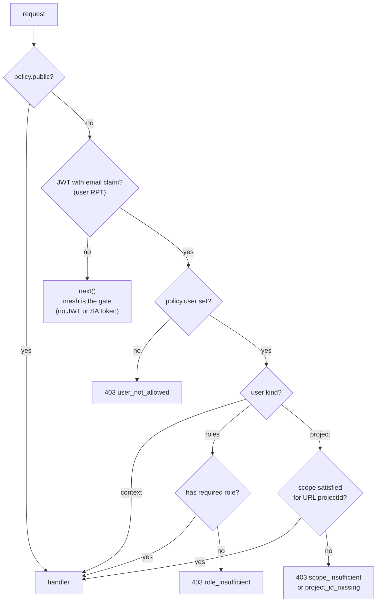
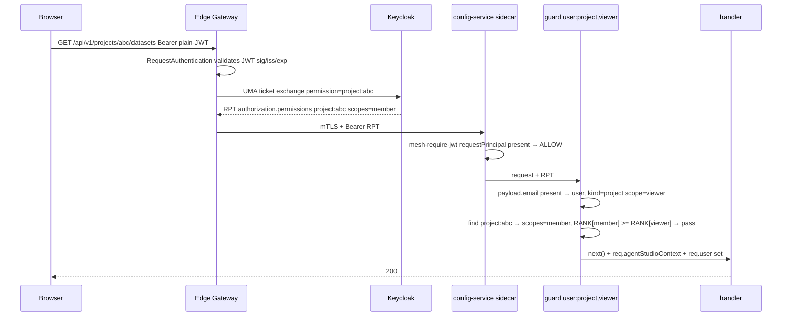
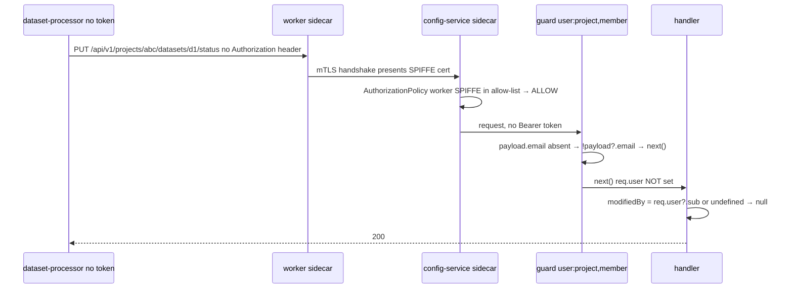
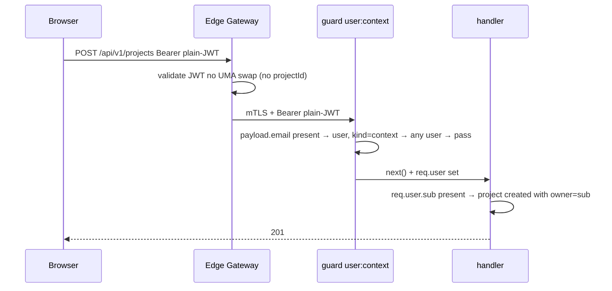
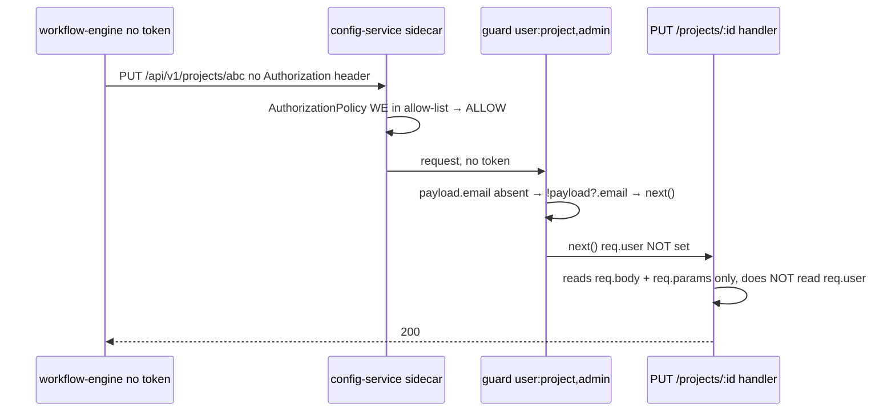
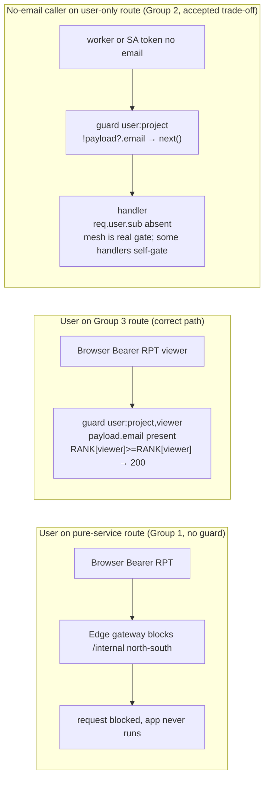
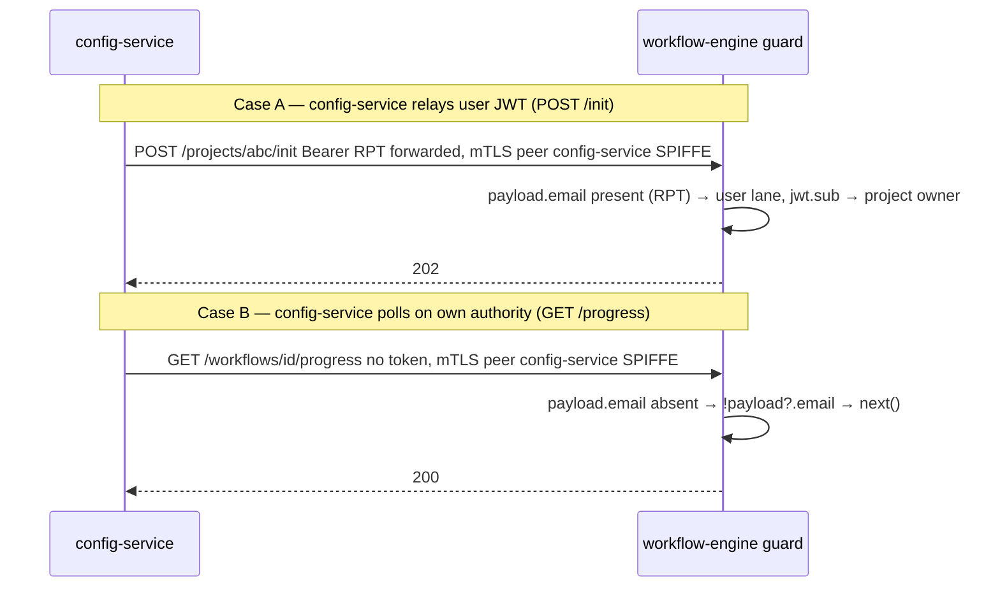
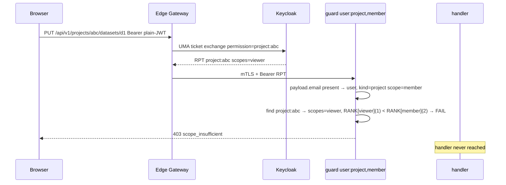
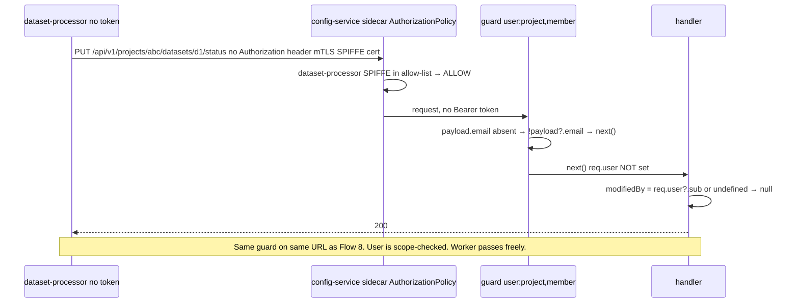

# Simplified Guard: Mesh-First, User-Aware

> **Status:** Proposal · **Scope:** config-service guard (extends
> `single-guard-mesh-identity.md`) · **Context:** PR #268 (unified guard) +
> PR #274 (mesh AuthorizationPolicy, ✅ merged).
>
> **Core insight:** once SA tokens are removed and the mesh `AuthorizationPolicy`
> is the complete gate for east-west traffic, the app guard has **no opinion on
> service calls at all**. It only asks one question: *is there a human on this
> request?* If yes, enforce scope. If no, step aside — the mesh already decided.
> The `service` / `internalAllowed` flag and all X-Service-Caller/XFCC logic are
> removed entirely.

> ⚠️ **SA token transition note (PR #249 not yet merged)**
>
> Until SA token injection is disabled (PR #249), workers still send SA tokens —
> valid JWTs that carry `sub` but **no `email` claim**. To handle this safely,
> the guard uses `!payload?.email` as its user-detection check rather than the
> simpler `!payload`:
>
> ```ts
> if (!payload?.email) return next(); // no JWT OR SA token → pass
> ```
>
> This means both tokenless workers (post-PR#249) and SA-token workers
> (pre-PR#249) reach the same `next()` path — no dual behaviour, no flag needed.
>
> **After PR #249 merges** — SA tokens are gone. The only check change needed:
> ```ts
> // Before (transitional):  if (!payload?.email) return next();
> // After  (simplified):    if (!payload) return next();
> ```
> That is a one-line diff. Everything else in this design stays identical.

---

## 1. The simplification

### What changes

| | PR #268 (current) | This design (simplified) |
| --- | --- | --- |
| Service-lane entry | `X-Service-Caller` header present | removed — no service lane concept in the app |
| `service` / `internalAllowed` flag | required per route | **removed entirely** |
| Allow-list check | app reads + validates SPIFFE header | removed — mesh is the sole gate |
| XFCC / X-Service-Caller parsing | `parsePeerSpiffe()`, `trustedServicePeer()` | removed |
| Audit log | `auditServiceLane()` | removed |
| `req.user` on service lane | `{ sub: <spiffe> }` | not set (guard steps aside) |
| Defence-in-depth 401 | `if (policy.user) return 401` | removed — `!payload?.email → next()` always |
| Shared user+worker routes (Group 3) | two separate URLs required | single URL + `guard({ user:{...} })` + `!payload?.email → next()` |
| Deployment dependency | mesh EnvoyFilter that strips X-Service-Caller | only mesh `AuthorizationPolicy` |

### What stays identical

- Per-project scope check for users — unchanged.
- Role check — unchanged.
- `req.user` and `req.agentStudioContext` set on the user lane — unchanged.
- `public` routes — unchanged.

### Why removing the `service` flag is safe

The mesh `AuthorizationPolicy` (PR #274) denies any non-allow-listed caller at
the sidecar **before** app code runs. When a no-token request reaches the guard,
the mesh has already verified the caller is allowed. The guard decodes the JWT —
finds no email claim — and calls `next()` immediately. No user checks run.
Only requests carrying a user JWT trigger scope enforcement.

---

## 2. The simplified guard

### Decision flow



### Implementation

```ts
interface RoutePolicy {
  public?: boolean;    // no auth at all (health / ready / swagger / setup)
  user?:   UserPolicy; // what a USER needs. absent = guard has no opinion
}

export function guard(policy: RoutePolicy): RequestHandler {
  return (req, res, next) => {
    if (policy.public) return next();

    const payload = decodeJwtPayload(req);
    // No email claim → not a user (no JWT at all, or SA token pre-PR#249).
    // Mesh AuthorizationPolicy is the gate for these callers.
    // After PR #249 merges, simplify to: if (!payload) return next()
    if (!payload?.email) return next();

    // User token confirmed. Enforce the route policy.
    if (!policy.user) return reject(res, 403, 'user_not_allowed'); // safety: guard({}) miscall
    return runUserChecks(policy.user, payload, req, res, next);
  };
}
```

### Policy table

| Route group | Routes | Guard mounted | User (has email) | No-email caller (no JWT or SA token) |
| --- | --- | --- | --- | --- |
| **Group 1** — pure service | `/api/v1/internal/**` `/api/v1/workspaces/**` `/api/v1/buckets/**` (top-level) `/api/v1/deployments/**` (POST/PUT/DELETE) `/api/v1/projects/:id/credentials/:id/secret-data` | **none** — mesh `AuthorizationPolicy` is sole gate | unreachable from edge (path-filtered) | passes via mesh |
| **Group 2** — user-only | `/api/v1/projects` (create/list) `/api/v1/projects/:id` (DELETE/PATCH) `/api/v1/projects/:id/members/**` `/api/v1/projects/:id/workspaces/**` `/api/v1/projects/:id/workspace-templates/**` `/api/v1/platform/**` `/api/v1/gateway/**` `/api/v1/governance/**` `/api/v1/search` `/api/v1/evaluation/**` (catalog) | `guard({ user: { kind:'context' \| 'project' \| 'roles', scope?:'viewer'\|'member'\|'admin' } })` | scope-checked → 200 or 403 | `!payload?.email → next()` — mesh `AuthorizationPolicy` is the real gate; no-email caller should never reach here in a correct cluster |
| **Group 3** — user + service (same URL) | `/api/v1/projects/:id/datasets/**` `/api/v1/projects/:id/knowledgebases/**` `/api/v1/projects/:id/agents/**` `/api/v1/projects/:id/agent-teams/**` `/api/v1/projects/:id/evaluation/**` `/api/v1/projects/:id/datasources/**` `/api/v1/projects/:id/credentials/**` `/api/v1/projects/:id/models/**` `/api/v1/projects/:id/pipelines/**` `/api/v1/projects/:id/mcp-servers/**` (GET) `/api/v1/projects/:id/buckets/**` `/api/v1/projects/:id/service-account` `/api/v1/projects/:id` (GET/PUT) `/api/v1/deployments/**` (GET) | GET content: `guard({ user: { kind:'project', scope:'viewer' } })` Write content: `guard({ user: { kind:'project', scope:'member' } })` Secret-adjacent all methods: `guard({ user: { kind:'project', scope:'member' } })` project PUT: `guard({ user: { kind:'project', scope:'admin' } })` deployments GET: `guard({ user: { kind:'context' } })` | scope-checked per method → 200 or 403 | `!payload?.email → next()` — worker/SA token passes, `req.user` not set, attribution → `null` |
| **Public** | `/health` `/ready` `/swagger` `/api/v1/setup` | `guard({ public: true })` | passes | passes |

There is no `dual` or `allowService` flag. The single rule — **`!payload?.email → next()`** — handles all no-email callers:

- **Group 1:** no guard mounted at all. Edge path-filter blocks users from `/internal/**`; mesh is the gate for services.
- **Group 2:** guard scope-checks users; no-email callers pass the guard — mesh `AuthorizationPolicy` is the real gate. Only a handful of handlers self-gate on `req.user?.sub` (create/list projects, members); most Group 2 routes have no app fallback.
- **Group 3:** guard scope-checks users per method (viewer/member/admin); no-email callers (workers, SA tokens pre-PR#249) pass immediately — `req.user` is not set; attribution becomes `null`.

### 2.3 Group 3 — Shared paths in detail

Routes in this group are called by **both users (north-south) and workers
(east-west) at the exact same URL**. The guard is mounted with a method-specific
policy — GET routes use `viewer` scope, writes use `member` scope. Workers always
pass via `!payload?.email → next()` regardless of method.

**Mount (content groups — datasets, kb, agents, evaluation):**
```ts
// GET — viewer scope sufficient for reads
guard({ user: { kind: 'project', scope: 'viewer' } })

// POST / PUT / PATCH / DELETE — member scope required for writes
guard({ user: { kind: 'project', scope: 'member' } })
```

**What happens per caller:**

| Verb | Caller | Token | Guard decision | Outcome |
| --- | --- | --- | --- | --- |
| GET | User — viewer scope | RPT | payload → RANK[viewer]≥RANK[viewer] | ✅ 200 |
| GET | User — member/admin scope | RPT | payload → RANK[member]≥RANK[viewer] | ✅ 200 |
| GET | Worker (e.g. WE reads project) | none | `!payload?.email` (no JWT) → `next()` | ✅ 200 |
| PUT `/:id/status` | Worker (dataset-processor, kb-processor) | none | `!payload?.email` (no JWT) → `next()` | ✅ 200 ← **original bug fixed** |
| PUT `/:id/status` | User — member scope | RPT | payload → RANK[member]≥RANK[member] | ✅ 200 |
| POST / PUT / DELETE | User — viewer scope | RPT | payload → RANK[viewer]<RANK[member] | ❌ 403 `scope_insufficient` |
| any | User — not a project member | RPT | payload → project absent in permissions | ❌ 403 `project_id_missing` |

**What this design adds vs today (`main`):**

1. **Fixes the worker 401** — tokenless workers pass via `!payload?.email → next()` instead of getting 401 from `createAuthMiddleware`.
2. **Adds scope enforcement for users** — viewers blocked from writes; non-members blocked entirely.
3. **Viewer reads work correctly** — GET routes use viewer scope so viewers can list their content.
4. **No new flag needed** — `!payload?.email → next()` is the universal rule in the guard.

---

## 3. Route audit — every route, every caller, every policy

### 3.1 Pure-service routes — no guard mounted

These routes are never called by users from the north — the edge or mesh blocks
north-south access. **No guard is applied.** The mesh `AuthorizationPolicy` is
the sole gate. Services pass with `req.user` unset.

| Route | Service caller |
| --- | --- |
| `/api/v1/internal/**` | workflow-engine, workers |
| `/api/v1/workspaces/**` (poll) | workflow-engine |
| `/api/v1/buckets/**` (top-level routing) | workflow-engine |
| `/api/v1/deployments/**` (POST/PUT/DELETE) | storage-manager |
| `/api/v1/projects/:id/credentials/:id/secret-data` | connector-worker |

### 3.2 User-only routes — `{ user: {...} }`

Only users (with JWT) call these routes from the north. Guard scope-checks
them. No-token callers pass via `!payload?.email → next()` — but the mesh
`AuthorizationPolicy` is the gate that prevents services from reaching here.

| Route | Method | Policy | Handler gates on `req.user`? | Safe? |
| --- | --- | --- | --- | --- |
| `/api/v1/projects` (create) | POST | `{ user:{ kind:'context' } }` | `if (!req.user?.sub) → 401` | ✅ guard sets `req.user` |
| `/api/v1/projects` (list) | GET | `{ user:{ kind:'context' } }` | `if (!callerSub) → 401` | ✅ guard sets `req.user` |
| `/api/v1/projects/:id/reinitialize` | POST | `{ user:{ kind:'project', scope:'admin' } }` | `if (!callerSub) → 401` | ✅ guard sets `req.user` |
| `/api/v1/projects/:id/members/**` | any | `{ user:{ kind:'project', scope:'member' } }` | `if (!req.user?.sub) → 401` | ✅ guard sets `req.user` |
| `/api/v1/projects/:id/{mcp-servers,workspaces,…}/**` (writes) | other | `{ user:{ kind:'project', scope:'member' } }` | attribution only | ✅ |
| `/api/v1/projects/:id` (DELETE) | DELETE | `{ user:{ kind:'project', scope:'admin' } }` | ❌ not read | ⚠️ handler has no `req.user` gate; mesh allow-list is sole protection (accepted trade-off) |
| `/api/v1/platform/**`, `/api/v1/gateway/**` | any | `{ user:{ kind:'roles', roles:['platform-member'] } }` | ❌ not read | ✅ |
| `/api/v1/{search,evaluation,…}/**` | any | `{ user:{ kind:'context' } }` | ❌ not read | ✅ |
| eval runs (UI writes) | any | `{ user:{ kind:'project', scope:'member' } }` | `actorOf()` attribution | ✅ `req.user` is set on user lane |

**No route fails.** `|| undefined` and `|| 'unknown'` fallbacks handle absent
`req.user` on service calls.

### 3.3 Group 3 — user + service routes — guard mounted, `!payload?.email → next()` for services

Every route a **user token may reach** has a guard. No-token callers (services)
pass immediately via `!payload?.email → next()`. `req.user` is not set on the service
path; attribution handlers use `req.user?.sub || undefined` → `null`.

**Content groups** — GET is `viewer` (metadata only), writes are `member`:

| Route | User GET scope | User write scope | Service caller |
| --- | --- | --- | --- |
| `/api/v1/projects/:id/datasets/**` | viewer | member | dataset-processor, WE |
| `/api/v1/projects/:id/knowledgebases/**` | viewer | member | kb-processor |
| `/api/v1/projects/:id/agents/**` | viewer | member | workflow-engine |
| `/api/v1/projects/:id/agent-teams/**` | viewer | member | workflow-engine |
| `/api/v1/projects/:id/evaluation/**` | viewer | member | eval-worker |

**Secret-adjacent groups** — `member` floor on all methods (no viewer downgrade):

| Route | User scope | Service caller |
| --- | --- | --- |
| `/api/v1/projects/:id/datasources/**` | member | connector-worker |
| `/api/v1/projects/:id/credentials/**` (list/read) | member | connector-worker |
| `/api/v1/projects/:id/models/**` | member | workflow-engine |
| `/api/v1/projects/:id/pipelines/**` | member | workflow-engine |

**Project + deployment routes** — also called by users AND services:

| Route | Method | User scope | Service caller |
| --- | --- | --- | --- |
| `/api/v1/projects/:id` | GET | viewer | WE (reads home_dir) |
| `/api/v1/projects/:id` | PUT | admin | WE (ProjectInit callback) |
| `/api/v1/projects/:id/service-account` | GET/POST | admin | WE |
| `/api/v1/projects/:id/mcp-servers/**` | GET | member | agent-service-maf |
| `/api/v1/projects/:id/buckets/**` | any | member | workflow-engine |
| `/api/v1/deployments/**` | GET | context (any user) | storage-manager |

---

## 4. End-to-end flows

### Flow 1 — User reads datasets (north-south)



### Flow 2 — Worker updates dataset status (east-west)



### Flow 3 — User creates project (north-south, no projectId)



### Flow 4 — workflow-engine ProjectInit callback (east-west, no token)



### Flows 5 + 6 — Cross-lane scenarios



### Flow 7 — config-service forwards user JWT to workflow-engine



### Flow 8 — User (viewer) blocked on Group 3 write route



### Flow 9 — Worker (no token) updates same Group 3 URL



---

## 5. Prerequisites

| Prerequisite | Status | Notes |
| --- | --- | --- |
| STRICT mTLS + `PeerAuthentication/default` | ✅ live | |
| Istio `RequestAuthentication` (JWT validation) | ✅ live | |
| `mesh-require-jwt` policy | ✅ live | |
| **`AuthorizationPolicy` per-service allow-list** (PR #274) | ✅ merged | mesh gate is live |
| SA token removal (`DISABLE_SA_TOKEN_INJECTION`) (PR #249) | 🔄 in review | after merge: simplify guard to `!payload` |
| This simplified guard | ⏳ pending | replaces X-Service-Caller in PR #268 |

**Only PR #274 is a hard prerequisite.** Without the mesh `AuthorizationPolicy`,
a tokenless service would pass the guard's `!payload?.email → next()` on any route,
with no gate at any layer.

---

## 6. Migration steps

1. **PR #274 already merged.** Mesh allow-list gate is live.
2. **Update `unifiedGuard.ts`** in PR #268:
   - Remove `trustedServicePeer()`, `parsePeerSpiffe()`, `serviceCallerHeader()`,
     `auditServiceLane()`, `MESH_SERVICE_CALLER_HEADER`.
   - Remove `service` / `internalAllowed` flag from `RoutePolicy`.
   - Replace user-detection check with `if (!payload?.email) return next()` —
     handles both no-token workers AND SA-token workers (pre-PR #249).
   - Remove `req.user = { sub: peer }`.
3. **Mount guards on Group 3 routes** in `index.ts` with method-specific scope:
   - GET: `guard({ user:{ kind:'project', scope:'viewer' } })` on content groups.
   - writes: `guard({ user:{ kind:'project', scope:'member' } })`.
   - Workers pass via `!payload?.email → next()` (no token or SA token).
4. **Enable `UNIFIED_GUARD_SMOKE=true`** and smoke test the nine flows above.
5. **Land PR #249** (SA token removal). Change `!payload?.email` → `!payload` (one line).
6. **Remove the flag** and `createAuthMiddleware` once all routes converted.

---

## 7. Comprehensive Testing Plan (Local — before merge approval)

> **Goal:** prove every route in PR #268's `GLOBAL_RULES` table behaves correctly
> under the simplified guard (no `internalAllowed`, no `X-Service-Caller`). Run
> this plan locally before flipping `UNIFIED_GUARD_SMOKE=true` in the cluster.

### 7.1 Environment setup

```bash
# 1. Start config-service locally (uses in-memory or local Postgres)
cd src/nemo/config-service
UNIFIED_GUARD_SMOKE=true npm run dev

# 2. Mint JWT helpers (guard is decode-only — no signature check)
b64url() { python3 -c "import base64,sys; d=sys.argv[1].encode(); print(base64.urlsafe_b64encode(d).rstrip(b'=').decode())" "$1"; }

# User token — any JWT with sub = user (scope-checked)
header=$(b64url '{"alg":"RS256","typ":"JWT","kid":"test"}')
user_payload() {
  b64url "{\"sub\":\"user-uuid-1\",\"email\":\"alice@test.com\",\"preferred_username\":\"alice\",\"authorization\":{\"permissions\":[{\"rsname\":\"project:$1\",\"scopes\":[\"$2\"]}]}}"
}
USER_MEMBER=$(echo "$header.$(user_payload proj1 member).sig")
USER_VIEWER=$(echo "$header.$(user_payload proj1 viewer).sig")
USER_ADMIN=$(echo "$header.$(user_payload proj1 admin).sig")

# User token with NO project scope (context-only)
ctx_payload=$(b64url '{"sub":"user-uuid-1","email":"alice@test.com","preferred_username":"alice"}')
USER_CTX="$header.$ctx_payload.sig"

# Service / no-token: just run curl with no Authorization header
BASE=http://localhost:3000
```

### 7.2 Unit tests — run and verify

```bash
cd src/nemo/config-service
# Run the full guard unit-test suite (includes GLOBAL_RULES coverage)
node --require ts-node/register --test tests/unifiedGuard.unit.test.ts
```

**Test cases that CHANGE under the simplified model** (update before running):

| Existing test name | PR #268 expected | Simplified expected | Action |
| --- | --- | --- | --- |
| `service-only, NO X-Service-Caller and no token → 401` | 401 | **200** | Update assertion |
| `X-Service-Caller with a non-spiffe value → not a trusted peer → 401` | 401 | **200** (header irrelevant) | Delete or update |
| `X-Service-Caller present on a USER-only route → 403 service_not_allowed` | 403 | **401 from handler** (guard passes) | Update to match handler behavior |
| `service lane: seeds req.user.sub from the trusted SPIFFE` | req.user.sub = spiffe | **req.user NOT set** | Update assertion |
| `dual route, no token and no mesh header → 401` | 401 | **200** (`!payload?.email → next()`) | Update assertion |
| `dual route, X-Service-Caller + no token → 200 (service lane)` | 200 (needs header) | **200 (no header needed)** | Update to remove header dependency |

**New test cases to add** for the simplified model:

```ts
// 1. Group 1: no-token, no X-Service-Caller → 200 (guard not mounted)
test('pure-service route, no token, no mesh header → 200', async () => {
  const app = guardedApp({ /* no user, no internalAllowed */ }, '/api/v1/internal/x');
  const res = await request(app, 'GET', '/api/v1/internal/x');
  assert.equal(res.status, 200); // guard steps aside unconditionally
});

// 2. Group 3 Option B: user (viewer) on write → 403
test('Group 3: user viewer on write → 403 scope_insufficient', async () => {
  const app = guardedApp({ user: { kind: 'project', scope: 'member' } });
  const token = userToken(rptWith('proj1', ['viewer']));
  const res = await request(app, 'PUT', '/api/v1/projects/proj1/datasets', {
    headers: { Authorization: `Bearer ${token}` },
  });
  assert.equal(res.status, 403);
  assert.equal(res.body.code, 'scope_insufficient');
});

// 3. Group 3 Option B: no-token worker on same URL → 200
test('Group 3: no-token worker → 200, req.user not set', async () => {
  const app = guardedApp({ user: { kind: 'project', scope: 'member' } });
  const res = await request(app, 'PUT', '/api/v1/projects/proj1/datasets');
  assert.equal(res.status, 200);
  assert.equal(res.body.user, null); // req.user NOT set
});

// 4. No token on Group 3 → passes
test('no token on Group 3 route → 200, req.user not set', async () => {
  const app = guardedApp({ user: { kind: 'project', scope: 'member' } });
  const res = await request(app, 'PUT', '/api/v1/projects/proj1/datasets', {
    headers: { Authorization: `Bearer ${saToken()}` },
  });
  assert.equal(res.status, 200);
  assert.equal(res.body.user, null);
});

// 5. Group 2: no-token on user-only route → guard passes → handler gate → 401
test('user-only route, no token → passes guard → handler 401', async () => {
  // Simulate handler that gates on req.user.sub (like POST /projects)
  const router = Router();
  router.post('/', guard({ user: { kind: 'context' } }), (req, res) => {
    if (!req.user?.sub) return res.status(401).json({ error: 'no user' });
    res.json({ ok: true });
  });
  const app = buildApp({ basePath: '/api/v1/projects', router });
  const res = await request(app, 'POST', '/api/v1/projects');
  assert.equal(res.status, 401);
});
```

### 7.3 Route-by-route local test table (curl)

Every route from `GLOBAL_RULES`. For each: **no-token**, **user token (correct scope)**, **user token (wrong scope)**.

#### Group 1 — Pure service (no guard in simplified model)

```bash
# All should return 200 with no token (mesh gate is the real guard)
curl -s -o /dev/null -w "%{http_code}" $BASE/api/v1/internal/projects/proj1          # 200
curl -s -o /dev/null -w "%{http_code}" $BASE/api/v1/workspaces                       # 200
curl -s -o /dev/null -w "%{http_code}" $BASE/api/v1/buckets/proj1/b1/routing         # 200
curl -s -o /dev/null -w "%{http_code}" -X POST $BASE/api/v1/deployments              # 200
curl -s -o /dev/null -w "%{http_code}" $BASE/api/v1/projects/proj1/credentials/c1/secret-data # 200
curl -s -o /dev/null -w "%{http_code}" $BASE/api/v1/projects/proj1                   # 200 (GET)
curl -s -o /dev/null -w "%{http_code}" -X PUT $BASE/api/v1/projects/proj1            # 200 (WE callback)
curl -s -o /dev/null -w "%{http_code}" $BASE/api/v1/projects/proj1/service-account   # 200 (WE east-west)
```

#### Group 2 — User-only

```bash
# No token → 401 (guard passes, handler gate fires)
curl -s -o /dev/null -w "%{http_code}" -X POST $BASE/api/v1/projects                 # 401
curl -s -o /dev/null -w "%{http_code}" $BASE/api/v1/projects                         # 401
curl -s -o /dev/null -w "%{http_code}" $BASE/api/v1/projects/proj1/members           # 401
curl -s -o /dev/null -w "%{http_code}" -X POST $BASE/api/v1/projects/proj1/mcp-servers # 401
curl -s -o /dev/null -w "%{http_code}" $BASE/api/v1/platform/mcp-servers             # 401
curl -s -o /dev/null -w "%{http_code}" $BASE/api/v1/gateway/providers                # 401
curl -s -o /dev/null -w "%{http_code}" -X DELETE $BASE/api/v1/projects/proj1         # 200 (no handler gate; mesh allow-list is sole protection)

# User token with correct scope → 200
curl -s -o /dev/null -w "%{http_code}" -H "Authorization: Bearer $USER_CTX" \
  -X POST $BASE/api/v1/projects                                                       # 200
curl -s -o /dev/null -w "%{http_code}" -H "Authorization: Bearer $USER_MEMBER" \
  $BASE/api/v1/projects/proj1/members                                                 # 200

# Viewer on member-required write → 403
curl -s -o /dev/null -w "%{http_code}" -H "Authorization: Bearer $USER_VIEWER" \
  -X PATCH $BASE/api/v1/projects/proj1                                                # 403 scope_insufficient
```

#### Group 3 — Shared paths (Option B, the critical dual-caller tests)

```bash
# --- datasets ---
# No token (worker sim): must be 200
curl -s -o /dev/null -w "%{http_code}" -X PUT \
  $BASE/api/v1/projects/proj1/datasets/d1/status                                      # 200 ← CRITICAL
# User member: 200
curl -s -o /dev/null -w "%{http_code}" -H "Authorization: Bearer $USER_MEMBER" \
  $BASE/api/v1/projects/proj1/datasets                                                # 200
# User viewer on GET: 200 (viewer floor on reads)
curl -s -o /dev/null -w "%{http_code}" -H "Authorization: Bearer $USER_VIEWER" \
  $BASE/api/v1/projects/proj1/datasets                                                # 200
# User viewer on write: 403
curl -s -o /dev/null -w "%{http_code}" -H "Authorization: Bearer $USER_VIEWER" \
  -X POST $BASE/api/v1/projects/proj1/datasets                                        # 403 scope_insufficient

# --- knowledgebases ---
curl -s -o /dev/null -w "%{http_code}" -X PUT \
  $BASE/api/v1/projects/proj1/knowledgebases/kb1/status                               # 200 (no token)
curl -s -o /dev/null -w "%{http_code}" -H "Authorization: Bearer $USER_MEMBER" \
  -X POST $BASE/api/v1/projects/proj1/knowledgebases                                  # 200

# --- agents ---
curl -s -o /dev/null -w "%{http_code}" \
  $BASE/api/v1/projects/proj1/agents                                                  # 200 (no token)
curl -s -o /dev/null -w "%{http_code}" -H "Authorization: Bearer $USER_MEMBER" \
  $BASE/api/v1/projects/proj1/agents                                                  # 200

# --- evaluation ---
curl -s -o /dev/null -w "%{http_code}" -X PATCH \
  $BASE/api/v1/projects/proj1/evaluation/runs/r1                                      # 200 (eval-worker, no token)
curl -s -o /dev/null -w "%{http_code}" -H "Authorization: Bearer $USER_MEMBER" \
  $BASE/api/v1/projects/proj1/evaluation/runs                                         # 200

# --- datasources ---
curl -s -o /dev/null -w "%{http_code}" \
  $BASE/api/v1/projects/proj1/datasources                                             # 200 (no token)
curl -s -o /dev/null -w "%{http_code}" -H "Authorization: Bearer $USER_MEMBER" \
  $BASE/api/v1/projects/proj1/datasources                                             # 200

# --- models, pipelines ---
curl -s -o /dev/null -w "%{http_code}" \
  $BASE/api/v1/projects/proj1/models                                                  # 200 (no token)
curl -s -o /dev/null -w "%{http_code}" \
  $BASE/api/v1/projects/proj1/pipelines                                               # 200 (no token)

# --- deployments GET (dual ctx: UI reads + storage-manager) ---
curl -s -o /dev/null -w "%{http_code}" \
  $BASE/api/v1/deployments                                                            # 200 (no token)
curl -s -o /dev/null -w "%{http_code}" -H "Authorization: Bearer $USER_CTX" \
  $BASE/api/v1/deployments                                                            # 200 (any user)
```

#### Security regression — user-token must not bypass scope on Group 3

```bash
# User NOT a member of proj1 tries to read
proj1_other=$(b64url '{"sub":"u2","email":"b@test.com","authorization":{"permissions":[{"rsname":"project:other","scopes":["admin"]}]}}')
USER_WRONG="$header.$proj1_other.sig"

curl -s $BASE/api/v1/projects/proj1/datasets -H "Authorization: Bearer $USER_WRONG" | jq .code
# → "context_project_id_missing"   (user has no perm on proj1)

# Spoofed X-Service-Caller header from a user (user JWT wins, header ignored)
curl -s -o /dev/null -w "%{http_code}" \
  -H "Authorization: Bearer $USER_VIEWER" \
  -H "X-Service-Caller: spiffe://cluster.local/ns/agentstudio-services/sa/workflow-engine" \
  -X POST $BASE/api/v1/projects/proj1/datasets
# → 403 scope_insufficient   (user lane, viewer < member; header is irrelevant)
```

### 7.4 GLOBAL_RULES coverage matrix

Every rule from `GLOBAL_RULES` in `unifiedGuard.ts`, verified result under the simplified model:

| Route | Method | Policy | No-token | User (correct scope) | User (wrong scope) |
| --- | --- | --- | --- | --- | --- |
| `/api/v1/internal/**` | any | no guard | **200** ✅ | 403 `user_not_allowed`* | — |
| `/api/v1/workspaces/**` | any | no guard | **200** ✅ | 403 `user_not_allowed`* | — |
| `/api/v1/buckets/**` | any | no guard | **200** ✅ | 403 `user_not_allowed`* | — |
| `/api/v1/deployments` | GET | `ctxDual` | **200** ✅ | 200 (any user) | — |
| `/api/v1/deployments` | POST/PUT/DELETE | no guard | **200** ✅ | 403 `user_not_allowed`* | — |
| `/api/v1/projects/:id/service-account` | GET/POST | `adminDual` | **200** ✅ | 200 (admin) | 403 |
| `/api/v1/projects/:id/{datasets,kb,agents,…}` | GET | `viewerDual` | **200** ✅ | 200 (viewer+) | 403 |
| `/api/v1/projects/:id/{datasets,kb,agents,…}` | write | `memberDual` | **200** ✅ | 200 (member+) | 403 |
| `/api/v1/projects/:id/credentials/:id/secret-data` | any | no guard | **200** ✅ | 403 `user_not_allowed`* | — |
| `/api/v1/projects/:id/{datasources,credentials,models,pipelines}` | any | `memberDual` | **200** ✅ | 200 (member+) | 403 |
| `/api/v1/projects/:id/members` | any | `memberUser` | **401** — `projectMembershipRoutes` self-gates on `req.user?.sub` (line 51) ✅ | 200 (member+) | 403 |
| `/api/v1/projects/:id/buckets` | any | `memberDual` | **200** ✅ | 200 (member+) | 403 |
| `/api/v1/projects/:id/mcp-servers` | GET | `memberDual` | **200** ✅ | 200 (member+) | 403 |
| `/api/v1/projects/:id/mcp-servers` | write | `memberUser` | **200** — mesh is gate | 200 (member+) | 403 |
| `/api/v1/projects/:id/workspace-templates` | GET | `viewerUser` | **200** — mesh is gate | 200 (viewer+) | — |
| `/api/v1/projects/:id/workspace-templates` | write | `memberUser` | **200** — mesh is gate | 200 (member+) | 403 |
| `/api/v1/projects/:id/workspaces` | any | `memberUser` | **200** — mesh is gate | 200 (member+) | 403 |
| `/api/v1/projects/:id` | GET | `viewerDual` | **200** ✅ | 200 (viewer+) | — |
| `/api/v1/projects/:id` | PUT | `adminDual` | **200** ✅ | 200 (admin) | 403 |
| `/api/v1/projects/:id` | PATCH | `memberUser` | **200** — no PATCH handler exists in projectRoutes | n/a | n/a |
| `/api/v1/projects/:id` | DELETE | `adminUser` | **200** — ⚠️ handler has no `req.user` gate; mesh allow-list is sole protection | 200 (admin) | 403 |
| `/api/v1/projects` | POST/GET | `ctx` | **401** — `projectRoutes` self-gates: `if (!req.user?.sub) → 401` ✅ | 200 (any user) | — |
| `/api/v1/platform/mcp-servers` | any | `platform` | **200** — mesh is gate | 200 (platform-member role) | 403 `role_insufficient` |
| `/api/v1/gateway/**` | any | `platform` | **200** — mesh is gate | 200 (platform-member role) | 403 |
| `/api/v1/search`, `/api/v1/explorer`, etc. | any | `ctx` | **200** — mesh is gate | 200 (any user) | — |

> `*` — user hits a Group 1 route (no guard). The edge path-filter blocks north-south access to `/internal/**` etc. The 403 column is N/A.

> **`handler self-gates ✅`** — handler explicitly checks `req.user?.sub` and returns 401 if absent. Verified: `POST /projects` (line 54), `GET /projects` (line 385), `GET /projects/:id/members` (projectMembershipRoutes line 51). Note: DELETE members lives in workflow-engine, not config-service.

> **`⚠️ DELETE /projects/:id`** — handler reads only `req.params`, no `req.user` check. A no-email caller (tokenless mesh service) that reaches this route will delete the project. Protection is entirely the mesh `AuthorizationPolicy` allow-list. This is the **accepted trade-off**: the guard is a user scope-check layer only; per-route verb restriction for destructive operations is delegated to the mesh.

### 7.5 Dual-path regression — the original bug must not return

The original bug was: **worker using SA token → 401 on dataset status update**.
Under the simplified model the fix is structural (not flag-dependent).

```bash
# Simulate the original broken scenario:
# dataset-processor calls PUT /projects/:id/datasets/:id/status with no token.
# Must return 200 (not 401).
curl -s -w "\nHTTP %{http_code}\n" -X PUT \
  $BASE/api/v1/projects/proj1/datasets/d1/status \
  -H "Content-Type: application/json" \
  -d '{"status":"ready"}'
# Expected: HTTP 200
# If you see HTTP 401 → guard is still checking policy.user on no-token requests.
# If you see HTTP 403 → guard is returning user_not_allowed (old service lane logic).
```

---

## 8. Workflow-engine Guard Testing (PR #272 / PR #318)

> workflow-engine uses the same simplified model in Go. Run with
> `UNIFIED_GUARD_SMOKE=true`. WE guard file: `internal/middleware/guard.go`.

### 8.1 Run unit tests

```bash
cd src/nemo/workflow-engine
go test ./internal/middleware/... -v
# Expected: all 14 tests PASS
```

### 8.2 WE route policy table — all 40 routes, expected behaviour

#### Public routes (tokenless — any caller)

| Route | Verbs | No-token | User token | SA token |
| --- | --- | --- | --- | --- |
| `/api/v1/workflows/:id/progress` | GET POST DELETE | **200** ✅ | 200 | 200 |

These MUST stay open — workers, WE-self, and config-service poll `/progress` without credentials. A regression on any verb stalls dataset import, KB creation, and acquire workflows.

```bash
WE=http://localhost:8080
for method in GET POST DELETE; do
  curl -s -o /dev/null -w "$method /progress: %{http_code}\n" -X $method \
    $WE/api/v1/workflows/wf1/progress
done
# Expected: all 200
```

#### User-only routes (email required)

| Route | Caller | No-token | User token | SA token |
| --- | --- | --- | --- | --- |
| `POST /projects/:id/init` | UI → config-service (forwards RPT) | **200** ✅ mesh gate | 200 (sets userClaims) | **200** ✅ (pre-PR#249) |
| `POST/DELETE/PUT /projects/:id/members` | UI admin | **200** mesh gate | 200 | **200** |
| `POST /projects/:id/knowledgebases/:kbId/terminate` | UI | **200** mesh gate | 200 | **200** |
| `DELETE /projects/:id/knowledgebases/:kbId` | UI | **200** mesh gate | 200 | **200** |
| `GET /projects/:id/knowledgebases/:kbId/versions` | UI | **200** mesh gate | 200 | **200** |
| `POST .../rollback` | UI | **200** mesh gate | 200 | **200** |
| `POST /connectors/volume-browse` | UI | **200** mesh gate | 200 | **200** |
| `POST/GET /projects/:id/connectors/:id/test\|discover\|preview` | UI | **200** mesh gate | 200 | **200** |
| `GET /workflows/:id/status\|result\|logs` | UI | **200** mesh gate | 200 | **200** |

```bash
# User token must set userClaims
WE_USER=$(echo "$header.$(b64url '{"sub":"u1","email":"alice@test.com"}').sig")
curl -s $WE/api/v1/workflows/wf1/status \
  -H "Authorization: Bearer $WE_USER" | jq .hasUser
# → true

# No token → guard exits via !email → handler runs (mesh is the gate)
curl -s -o /dev/null -w "%{http_code}" \
  $WE/api/v1/workflows/wf1/status
# → 200
```

#### Dual routes (user OR service — same URL)

| Route | User token | No-token (service) | SA token |
| --- | --- | --- | --- |
| `POST /projects/:id/datasets/:datasetId/acquire` | 200 (userClaims set) | **200** ✅ | **200** ✅ |
| `POST /projects/:id/knowledgebases/:kbId/create` | 200 | **200** ✅ | **200** ✅ |
| `POST /workflows/:id/cancel` | 200 | **200** ✅ | **200** ✅ |
| `POST /explore/session` | 200 | **200** ✅ | **200** ✅ |
| `POST /explore/session/:sessionId/list` | 200 | **200** ✅ | **200** ✅ |

```bash
# Critical: config-service calls /acquire tokenless (or with SA token pre-PR#249)
curl -s -o /dev/null -w "%{http_code}" -X POST \
  $WE/api/v1/projects/proj1/datasets/d1/acquire
# → 200 (must not be 401/403 — this was the original broken path)
```

#### Service routes (config-service / workers — tokenless mTLS)

All 25 service routes must return 200 with no token (mesh allows the caller):

```bash
# Dataset workflows
for path in \
  "projects/proj1/datasets/d1/import" \
  "projects/proj1/datasets/d1/process" \
  "projects/proj1/datasets/d1/terminate" \
  "projects/proj1/datasets/d1/schedule" \
  "projects/proj1/knowledgebases/kb1/schedule" \
  "projects/proj1/pipelines/pl1/terminate" \
  "projects/proj1/pipelines/pl1/schedule" \
  "projects/proj1/connectors/c1/terminate" \
  "connectors/volume-scan" \
  "explore/cache/invalidate" \
  "workflows" \
  "reference-edges/schedule" \
  "mcp-health/schedule"
do
  code=$(curl -s -o /dev/null -w "%{http_code}" -X POST $WE/api/v1/$path)
  echo "$code $path"
done
# Expected: all 200

# GET service routes
for path in \
  "projects/proj1/datasets/d1/schedule" \
  "projects/proj1/pipelines/pl1/schedule" \
  "projects/proj1/pipelines/pl1/executions" \
  "reference-edges/schedule" \
  "mcp-health/schedule"
do
  code=$(curl -s -o /dev/null -w "%{http_code}" $WE/api/v1/$path)
  echo "$code $path"
done
# Expected: all 200

# DELETE service routes
for path in \
  "projects/proj1/delete" \
  "projects/proj1/datasets/d1" \
  "projects/proj1/datasets/d1/schedule" \
  "projects/proj1/pipelines/pl1/schedule" \
  "reference-edges/schedule" \
  "mcp-health/schedule"
do
  code=$(curl -s -o /dev/null -w "%{http_code}" -X DELETE $WE/api/v1/$path)
  echo "$code $path"
done
# Expected: all 200
```

#### Security: user token on service route → 403

```bash
curl -s $WE/api/v1/projects/proj1/datasets/d1/import \
  -X POST \
  -H "Authorization: Bearer $WE_USER" | jq .code
# → "user_not_allowed"
```

#### Security: forged X-User-* headers stripped on all paths

```bash
# Service path with forged identity headers
curl -s $WE/api/v1/projects/proj1/datasets/d1/import \
  -X POST \
  -H "X-User-ID: attacker" \
  -H "X-User-Name: evil-admin" | jq '{xUserID,xUserName}'
# → {"xUserID": "", "xUserName": ""}

# Public path (progress store)
curl -s $WE/api/v1/workflows/wf1/progress \
  -H "X-User-Name: evil-admin" | jq .xUserName
# → ""
```

### 8.3 Go / no-go checklist for WE before merge

| Check | Command | Pass condition |
| --- | --- | --- |
| Unit tests | `go test ./internal/middleware/... -v` | 14 tests PASS |
| Progress store tokenless (all verbs) | §8.2 public curl | All 200 |
| No-token on service routes → 200 | §8.2 service curl block | All 200 |
| `/acquire` no-token → 200 (original bug) | §8.2 dual curl | 200 (not 401/403) |
| User token on service route → 403 | §8.2 security | `user_not_allowed` |
| Forged X-User-* headers stripped | §8.2 security | Empty strings |
| `UNIFIED_GUARD_SMOKE=true` smoke | Start WE with flag | No unexpected errors |
| No `unmapped route` warnings | Browse all WE paths | Zero unmapped log lines |

### 7.6 Go / no-go checklist before merge

| Check | How to verify | Pass condition |
| --- | --- | --- |
| All unit tests pass | `node --require ts-node/register --test tests/unifiedGuard.unit.test.ts` | 0 failures |
| No-token on Group 3 routes → 200 | §7.3 Group 3 curl block | All return 200 |
| User viewer on Group 3 write → 403 | §7.3 security regression | `scope_insufficient` |
| `POST /projects` no token → 401 (handler self-gates) | `curl -X POST $BASE/api/v1/projects` | 401 (handler gate confirmed) |
| `DELETE /projects/:id` no token → 200 (mesh is sole gate) | `curl -X DELETE $BASE/api/v1/projects/proj1` | 200 — accepted, mesh allow-list controls this |
| GLOBAL_RULES matrix | §7.4 table | All rows match expected |
| Original bug not regressed | §7.5 | HTTP 200 on no-token PUT /datasets/:id/status |
| `UNIFIED_GUARD_SMOKE=true` smoke | Start service with flag, hit each group | No unexpected 401/403 in logs |
| No `unified_guard_unmapped_route` warnings in logs | Start service, browse all known paths | Log has zero unmapped warnings |
