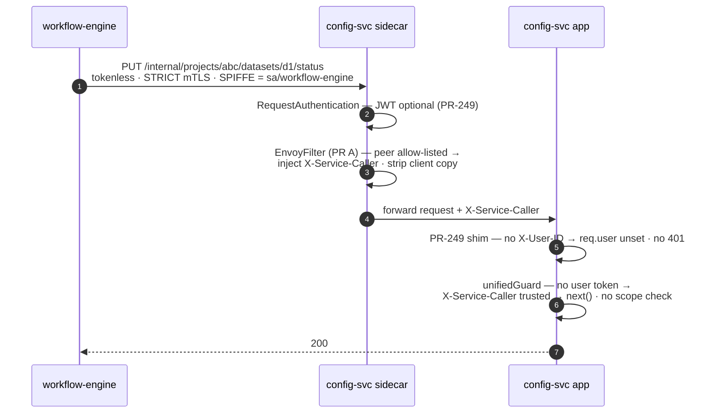
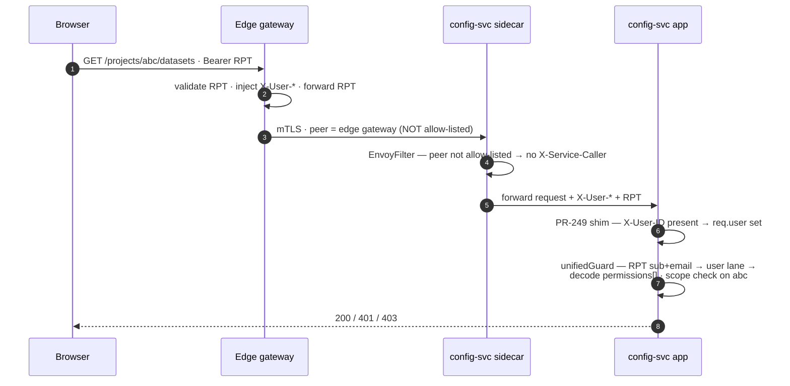
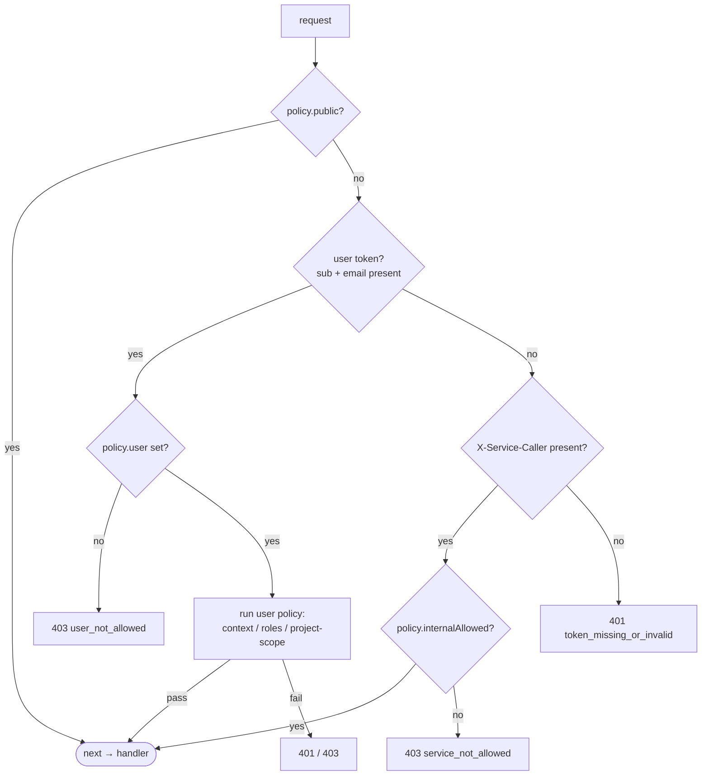
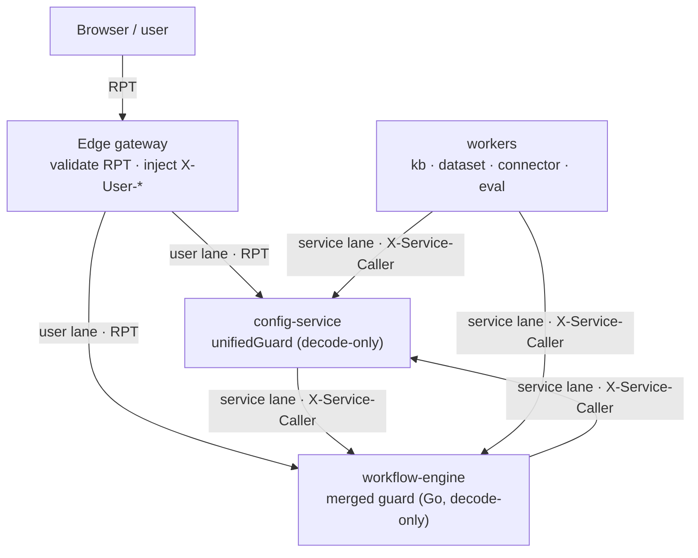
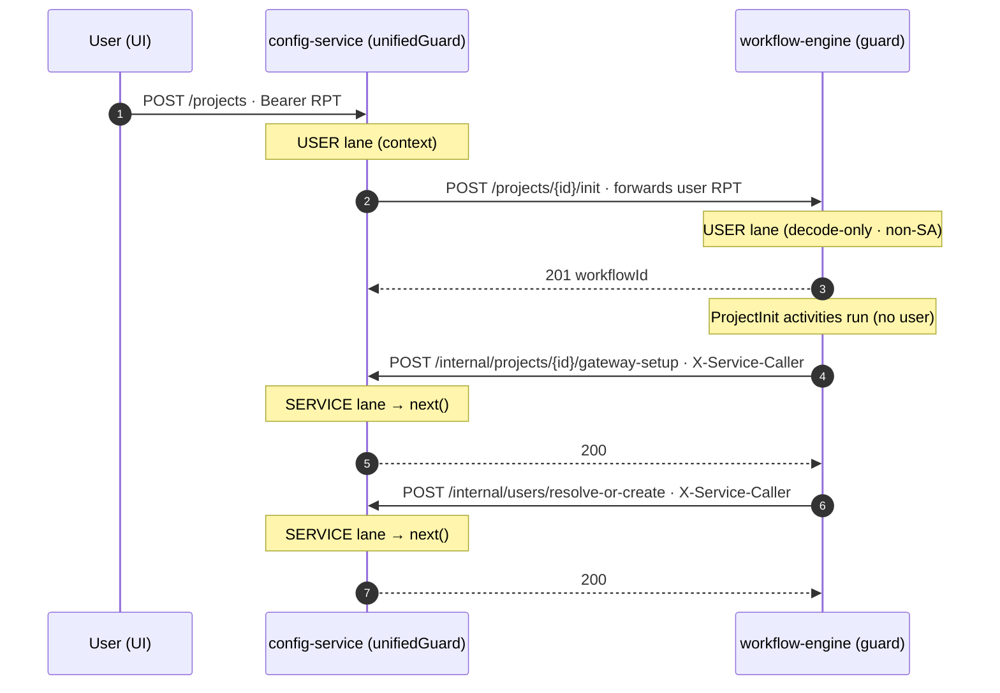

# config-service ↔ workflow-engine — end-to-end auth flow (post-merge)

> Companion to [`single-guard-mesh-identity.md`](./single-guard-mesh-identity.md).
> Shows the request flow once **three** changes are merged:
>
> - **PR #249** — mesh-delegated auth (`MESH_DELEGATED_AUTH`: identity from
>   `X-User-*` headers → `req.user`, no in-app JWT verify) + SA-token disable
>   (`DISABLE_SA_TOKEN_INJECTION`: east-west becomes tokenless mTLS) + edge
>   `mesh-require-jwt` relaxed to `principals: ["*"]`.
> - **This PR** — `unifiedGuard` on config-service: the user lane decodes the
>   RPT for per-project scope; the service lane reads `X-Service-Caller`.
> - **PR A** — Istio EnvoyFilter that injects `X-Service-Caller: <spiffe>` for
>   allow-listed principals only (stripping any client-supplied value).

## Lane summary

| | North–south (user) | East–west (service) |
| --- | --- | --- |
| Caller | browser → edge gateway | pod → pod |
| Identity carrier | Keycloak RPT (+ `X-User-*` headers) | mTLS SPIFFE → `X-Service-Caller` |
| config-service lane | user lane | service lane |
| Per-project scope | enforced (RPT `permissions[]`) | skipped (mesh allow-list authz'd) |

---

## 1. East–west: workflow-engine → config-service

The original `401 token_shape_invalid` case — background workflow, no user.

---

## 2. North–south: user → config-service

For contrast — the per-project scope path the service lane skips.

---

## 3. The guard decision (config-service, one route)

---

## Reverse direction: config-service → workflow-engine

Mirror image, with one asymmetry: **workflow-engine does not run `unifiedGuard`**
(it is config-service-only). It uses PR #249's Go delegated middleware
(`internal/middleware/auth.go`):

- **User-initiated** (e.g. `POST /projects/:id/init`): config-service forwards
  the user context; workflow-engine resolves identity from `X-User-*` headers
  (e.g. `requireProjectAdmin`).
- **Background**: tokenless mTLS; the delegated middleware never 401s. If PR A
  also injects `X-Service-Caller` on workflow-engine's inbound, acting on it
  would be a separate Go-side change.

---

## Guarantees

| Property | Enforced by |
| --- | --- |
| Service is who it claims | STRICT mTLS / SPIFFE |
| Only allow-listed services reach the service lane | PR A EnvoyFilter injects `X-Service-Caller` for allow-listed principals only |
| #249's `principals:["*"]` re-tightened app-side | `unifiedGuard`: no `X-Service-Caller` ⇒ `401` (a non-allow-listed peer the mesh admitted still can't pass) |
| User cannot forge the service lane | user token → user lane first; mesh strips client `X-Service-Caller`; gateway SPIFFE not allow-listed |
| Per-project scope (the irreducible check) | `unifiedGuard` user lane decoding the RPT `permissions[]` |

## Assumptions

1. The edge keeps forwarding `Authorization: Bearer <RPT>` to config-service in
   delegated mode — the guard needs `permissions[]` for the scope check (#249's
   headers carry identity, not scopes/roles).
2. PR A injects **and strips** `X-Service-Caller`. Until it lands, the service
   lane has no producer in real traffic (works only where the header is set
   manually, e.g. tests / local).

---

## After both PRs merge: config-service **and** workflow-engine

Once the workflow-engine guard lands too — the **same merged guard** as
config-service (decode-only; the Istio sidecar validates signatures), with **no
per-project scope lane** (workflow-engine has no `permissions[]` in its claims) —
both services run the same two-lane model. workflow-engine is overwhelmingly a
*service-called* API; config-service is mixed.

### Topology — who calls whom, and which lane

### Round-trip — project init touches both guards and both lanes

### Lane per direction

| Caller → target | Lane | Carrier |
| --- | --- | --- |
| user → config-service | user | RPT (per-project scope enforced) |
| user → workflow-engine (`/init`, `/members`) | user | decoded user token (non-SA) |
| config-service → workflow-engine | service | `X-Service-Caller` |
| workflow-engine → config-service | service | `X-Service-Caller` |
| workers → either | service | `X-Service-Caller` |

**Symmetric now:** both run the **same decode-only merged guard** — the Istio
sidecar validates JWT signatures at every hop and the guard base64-decodes. Both
share the same `X-Service-Caller` service lane (from the separate mesh
EnvoyFilter PR). The **only** difference: workflow-engine adds **no** per-project
scope lane (it has no `permissions[]` and never enforced one); per-project
authorization stays a config-service concern.
