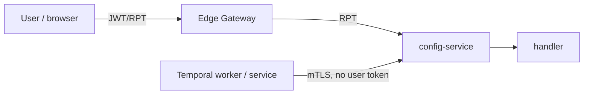
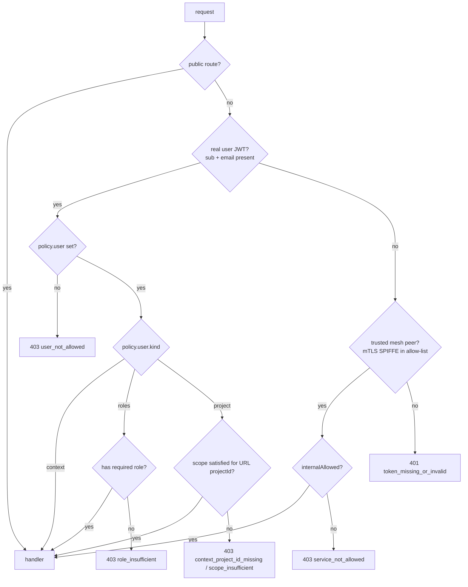

# Single-guard design: the mTLS certificate is the service lane

> **Status:** Proposal · **Scope:** the application authorization layer in
> `config-service` (and every backend running the shared `agentstudio-auth`
> guards) · **Audience:** anyone touching the guard chain, adding an API, or
> reasoning about service-to-service auth.

This document specifies a single design: collapse the three-middleware guard
chain (`ContextGuard → RolesGuard → PermissionsGuard`) into **one decision +
one merged guard**, and authorize service-to-service traffic by the caller's
**mTLS / SPIFFE workload identity** instead of a service-account JWT.

The governing principle is one sentence:

> **The user's identity is a JWT (north-south); the service's identity is its
> mTLS certificate (east-west). The guard routes each request by *who the
> caller cryptographically is* — not by the URL it chose.**

It is the design write-up of an investigation that began at a live
`401 token_shape_invalid` on dataset import: a Temporal worker called a
user-context-guarded `config-service` route with a Keycloak
`client_credentials` token, which the guards reject.

---

## 1. The problem

Every request to `config-service` is one of two fundamentally different things:

| Axis | Caller | Identity carrier | Trust root |
| --- | --- | --- | --- |
| **North-south** | a logged-in **user** (browser → edge gateway) | Keycloak **JWT/RPT** | Keycloak realm signing key |
| **East-west** | a backend **service / worker** (pod → pod) | the pod's **SPIFFE cert** in mTLS | Istio CA (istiod) |

The current guards were written for the **north-south** shape only. They
require a *user* token shape:

- `ContextGuard` requires `sub` + `email` + `preferred_username` — a
  service-account token has **no `email`** → `401 token_shape_invalid`.
- `PermissionsGuard` requires the URL `:projectId` to appear in the RPT's
  `authorization.permissions[]` — a service-account token carries **no
  `authorization` claim** → `403`.

A background worker has **no user**: the originating request — and its token —
ended minutes/hours/days before Temporal runs the activity. So it authenticates
as a **machine** (`client_credentials`). That machine token is the wrong shape
for the user-context guards, by construction.

Crucially, the `:projectId` axis only matters for the **user** path — it is the
only place per-project authorization is enforced. For the **service** path,
projectId-vs-no-projectId is irrelevant: the caller is authorized by **who it
is** (workload identity), not by what scopes a user holds.



---

## 2. Rejected alternatives

| Idea | Why it fails |
| --- | --- |
| Flip the user routes to a service-only guard | Most are **dual-purpose** (UI **and** worker). Flipping removes per-project authz for real users → cross-tenant access. |
| Remove the `email` check from `ContextGuard` | Clears gate 1 only; the token still has no `authorization.permissions[]` → `403` at the scope check. And it weakens validation for *every* caller. |
| Forward the user's token from the worker | The user token is **expired** by the time the async activity runs; persisting a live bearer in Temporal history is a secret-management anti-pattern; many workflows have **no** originating user at all. |
| Push per-project authz to the mesh | Istio `AuthorizationPolicy` can match **flat** JWT claims (e.g. a realm role) but **cannot correlate the URL `:projectId` with the nested `authorization.permissions[].rsname/scopes` array**. Per-project scope enforcement is **irreducibly app-side**. |
| `/internal/*` route twins (the URL is the lane) | Duplicates every dual route; requires worker URL repoints; the `/internal` namespace is reachable from the edge by any user token, so it needs a hard edge `DENY` + allow-list to be safe. The URL becomes a security boundary — fragile (a misrouted user reaches it). **This design makes the *certificate* the boundary instead**, which a caller cannot forge. |

The correct fix: **authenticate east-west by mTLS/SPIFFE** and let the
application guard **defer** to that for service callers, while enforcing the
full user-context checks for users — on **one** route per operation.

---

## 3. The design in one picture



- **One route per operation.** No `/internal` twins.
- **The lane is chosen by what the caller presents.** A **real user JWT**
  (`sub` + `email`) takes the **user lane**; a caller with **only** an
  allow-listed mTLS cert and no user token takes the **service lane**. A user
  always carries a JWT, so they always take the user lane; the **certificate
  gates the service lane**, and a caller cannot forge it.
- **Why "user JWT first," not "cert first."** A forwarding proxy
  (`config-service` relaying a user's JWT to `workflow-engine`) is *itself* an
  allow-listed peer, yet that call must run the **user** checks. Keying on the
  token first makes one caller serve both modes — relay a user token (user lane)
  or call on its own identity (service lane) — with no allow-list gymnastics.
- **Per-project authorization** for users is the one irreducible app check; a
  trusted service skips it (the mesh allow-list already authorized it).
- **Public routes** (health / ready / first-run setup) short-circuit before any
  check.

---

## 4. How the mesh peer identity reaches the app (and why it is trustworthy)

When `config-service` runs in the mesh, its **own inbound Istio sidecar**
terminates mTLS and injects the verified caller identity as the
`X-Forwarded-Client-Cert` (XFCC) header before app code runs:

```
X-Forwarded-Client-Cert: By=spiffe://cluster.local/ns/agentstudio-services/sa/config-service;
                         Hash=...;URI=spiffe://cluster.local/ns/agentstudio-services/sa/workflow-engine
                                          └──────────────── the CALLER's SPIFFE identity ───────────────┘
```

Trust properties (all must hold):

1. **XFCC reflects the immediate hop, not the original client.** A user
   arriving via the edge gateway presents the **gateway's** SPIFFE id — never
   `workflow-engine`'s. A user cannot impersonate a service.
2. **The receiving sidecar overwrites XFCC** (`forwardClientCertDetails:
   SANITIZE_SET`), discarding anything the caller's app tried to set. A client
   cannot forge it.
3. **STRICT mTLS** (live: `PeerAuthentication/default` in
   `agentstudio-services`) means there is no plaintext path to inject a fake
   XFCC.
4. **The pod is unreachable bypassing its sidecar** (mesh interception +
   NetworkPolicy as defense-in-depth).

The allow-list contains the **backend service** principals and **not** the edge
gateway — so user traffic always falls through to the user lane.

> **Hardening variant:** instead of the app parsing XFCC, an Istio
> `AuthorizationPolicy`/`EnvoyFilter` can inject a trusted header (e.g.
> `X-Service-Caller: <spiffe>`) **only** when the source principal is in the
> allow-list, stripping any client value. The app then checks that header — the
> decision lives entirely in the mesh. More mesh machinery, simpler app code.

---

## 5. The merged guard

One middleware replaces `ContextGuard → RolesGuard → PermissionsGuard`. It runs a
single ordered decision — **public**, then **user** (when a real user token is
present), then **trusted service** — and either short-circuits, defers to the
mesh, or runs the merged user checks.

```ts
const RANK = { viewer: 1, member: 2, admin: 3 } as const;   // admin ⊇ member ⊇ viewer
type Scope = keyof typeof RANK;

type UserPolicy =
  | { kind: 'context' }                                   // any logged-in user
  | { kind: 'roles'; roles: string[] }                    // platform-admin / platform-member
  | { kind: 'project'; scope: Scope; paramName?: string };

interface RoutePolicy {
  public?: boolean;           // no authn at all (health / ready / swagger / first-run setup)
  user?: UserPolicy;          // what a USER needs (omit ⇒ no user may call)
  internalAllowed?: boolean;  // may a trusted mesh peer call it? (omit ⇒ no service may call)
}

export function guard(policy: RoutePolicy): RequestHandler {
  return (req, res, next) => {
    // 0) PUBLIC — no authentication at all.
    if (policy.public) return next();

    // 1) USER — a real user token (sub + email) ⇒ user lane, regardless of the
    //    mTLS peer. This lets a forwarding proxy (config-service relaying the
    //    user's JWT to workflow-engine) reach the user checks even though it is
    //    itself an allow-listed peer. A service-account token (no email) is NOT
    //    a user and falls through to the service decision below.
    const payload = decodeJwtPayload(req);    // sidecar already validated the signature
    const isUser = !!payload?.sub && !!payload?.email;
    if (isUser) {
      if (!policy.user) return forbid(res, 403, 'user_not_allowed');   // service-only route
      return runUserChecks(req, res, next, policy.user, payload!);
    }

    // 2) SERVICE — no user token ⇒ must be a trusted, allow-listed mTLS peer.
    const peer = trustedServicePeer(req);     // parse XFCC → SPIFFE → in allow-list?
    if (peer) {
      if (!policy.internalAllowed) return forbid(res, 403, 'service_not_allowed');
      return next();                          // SERVICE lane — projectId is IRRELEVANT
    }

    // 3) Neither a real user nor an allow-listed peer.
    return policy.user
      ? reject(res, 401, 'token_missing_or_invalid')
      : forbid(res, 403, 'service_not_allowed');
  };
}

// The USER lane: the merged role / project-scope checks — substance unchanged
// from ContextGuard → RolesGuard → PermissionsGuard, decoded once.
function runUserChecks(
  req: Request, res: Response, next: NextFunction,
  user: UserPolicy, payload: JwtPayload,
): void {
  const ctx: AgentStudioContext = {
    user_id: payload.sub,
    user_email: str(payload.email),
    preferred_username: str(payload.preferred_username),
    realm_roles: payload.realm_access?.roles ?? [],
    api_roles: payload.resource_access?.['agent-studio-api']?.roles ?? [],
  };

  // ── ROLE check (platform-wide, no-projectId routes) ────────────────────────
  if (user.kind === 'roles') {
    const have = new Set([...ctx.realm_roles, ...ctx.api_roles]);
    if (!user.roles.some(r => have.has(r)))
      return void forbid(res, 403, 'role_insufficient');
  }

  // ── PROJECT-SCOPE check (per-project authz) ────────────────────────────────
  if (user.kind === 'project') {
    // 1. The URL :projectId is the authoritative scope of THIS request.
    const urlProjectId = req.params[user.paramName ?? 'projectId'];
    if (!urlProjectId) return void forbid(res, 403, 'project_id_missing');

    // 2. Find THIS project's permission entry in the RPT and read its scopes.
    const perms = payload.authorization?.permissions ?? [];
    const match = perms.find((p: any) => p?.rsname === `project:${urlProjectId}`);
    if (!match) return void forbid(res, 403, 'context_project_id_missing');

    const projectScopes: Scope[] = (match.scopes ?? []).filter(isScope);

    // 3. Hierarchy compare: highest scope held ≥ required?
    const required = RANK[user.scope];
    const granted  = projectScopes.reduce((m, s) => Math.max(m, RANK[s]), 0);
    if (granted < required) return void forbid(res, 403, 'scope_insufficient');

    ctx.project_id = urlProjectId;
    ctx.project_scopes = projectScopes;
  }

  req.agentStudioContext = ctx;   // attribution for handlers
  next();
}
```

The merged guard preserves the **exact** checks and `401/403` reason codes of
the three current guards — it decodes once and compares inline instead of
across three middlewares sharing `req.agentStudioContext`.

**Lane precedence (the order matters):** `public` → `user` (real token) →
`service` (allow-listed peer) → reject. The user lane is tried *before* the peer
lane so a forwarding proxy relaying a user's JWT is handled as a user even when
the proxy is itself an allow-listed service. The **certificate still gates the
service lane** — a request reaches it only with no user token *and* an
allow-listed peer cert — so a user can never enter the service lane (they always
carry a JWT; drop it and they are not an allow-listed peer → `401`).

### 5.1 Project-scope check, step by step

```
URL: PUT /api/v1/projects/abc/datasets/d1     route requires scope = 'member'
  1. urlProjectId = req.params.projectId = "abc"        ← scope source is the URL, not a claim
  2. find RPT permission where rsname == "project:abc"  → { scopes: ["member"] }
  3. no match → 403 context_project_id_missing          (user holds nothing on abc)
  4. granted = max(RANK of held scopes); required = RANK['member'] = 2
     granted >= required ? pass : 403 scope_insufficient (e.g. viewer(1) < member(2))
```

Two invariants carried over from the existing `permissionsGuard`:

- **The URL is authoritative.** We always look up `project:<urlProjectId>`, so a
  token scoped to `abc` cannot act on `xyz` by changing the URL — the lookup for
  `project:xyz` finds nothing → `403`.
- **Hierarchy `admin ⊇ member ⊇ viewer`.** `admin` satisfies a `member`
  requirement; `viewer` does not.

---

## 6. Applying it to routes — one line each

There are **no `/internal` route twins** in this design. Every operation is a
single route; the guard policy (not the URL prefix) decides who may call it.

```ts
// 1) projectId · dual (UI + worker) — BOTH flags
app.use('/api/v1/projects/:projectId/datasets',
        guard({ user: { kind: 'project', scope: 'member' }, internalAllowed: true }), dataSetRoutes);

// 2) projectId · UI only — `user`, no `internalAllowed`
app.use('/api/v1/projects/:projectId/workspaces',
        guard({ user: { kind: 'project', scope: 'member' } }), workspaceRoutes);

// 3) projectId · service only — `internalAllowed`, no `user`
//    A worker-driven project lifecycle op; a user (real JWT) → 403 user_not_allowed.
app.use('/api/v1/internal/projects/:projectId/gateway-setup',
        guard({ internalAllowed: true }), projectGatewaySetupRoutes);

// 4) no projectId · UI (identity only)
app.use('/api/v1/search',
        guard({ user: { kind: 'context' } }), searchRouter);

// 5) no projectId · UI (platform role)
app.use('/api/v1/platform/mcp-servers',
        guard({ user: { kind: 'roles', roles: ['platform-member'] } }), platformMcpRoutes);

// 6) no projectId · service only
app.use('/api/v1/internal/users',
        guard({ internalAllowed: true }), userResolutionRoutes);

// 7) public · no authentication at all (first-run setup, health, swagger)
app.use('/api/v1/setup', guard({ public: true }), setupRoutes);
app.get('/health', guard({ public: true }), healthHandler);
```

**The flag semantics:**

| `public` | `user` | `internalAllowed` | Meaning | Non-matching caller |
| --- | --- | --- | --- | --- |
| `true` | — | — | **public** — no authn | — (anyone) |
| — | set | `true` | **dual** (UI + worker) | — |
| — | set | omitted | **UI only** | service → `403 service_not_allowed` |
| — | omitted | `true` | **service only** | user → `403 user_not_allowed` |
| — | omitted | omitted | (nothing may call — misconfiguration) | everyone `403` |

> Examples 3 and 6 are the **real** `config-service` routes
> (`/api/v1/internal/projects/:projectId/gateway-setup`, `/api/v1/internal/users`)
> and happen to live under `/api/v1/internal/...`. That prefix is a
> **human-readable convention** to signal "service-to-service" — it is **not** a
> security boundary; the `guard()` policy is. The same route is equally safe with
> or without the prefix; the certificate-gated service lane, not the URL, is what
> stops a user.

### 6.1 config-service coverage — every route shape has a policy

| Route family (examples) | Callers | Policy |
| --- | --- | --- |
| `/health`, `/ready`, `/swagger`, `/api/v1/setup` | kubelet, anyone (pre-login) | `{ public: true }` |
| `/api/v1/projects/:projectId/{datasets,knowledgebases,models,agents,…}` | UI **and** workers | `{ user: { kind:'project', scope:'member' }, internalAllowed: true }` |
| `/api/v1/projects/:projectId/{workspaces,…}` (UI-only) | UI | `{ user: { kind:'project', scope:'member' } }` |
| `PUT/DELETE /api/v1/projects/:projectId` (admin ops) | UI | `{ user: { kind:'project', scope:'admin' } }` |
| `POST/GET /api/v1/projects` (create / list) | UI | `{ user: { kind:'context' } }` |
| `/api/v1/search` | UI | `{ user: { kind:'context' } }` |
| `/api/v1/platform/*`, `/api/v1/gateway` | UI (platform role) | `{ user: { kind:'roles', roles:['platform-member'] } }` |
| `/api/v1/internal/users` (resolve-or-create) | workflow-engine | `{ internalAllowed: true }` |
| `/api/v1/internal/projects/:projectId/{service-account,gateway-setup,…}` | workflow-engine | `{ internalAllowed: true }` |

The only judgement call per route is **who calls it** (§16 playbook); the four
states above cover every shape config-service exposes.

---

## 7. The full matrix — projectId × north-south / east-west

```
                 │ NORTH–SOUTH (USER: real JWT sub+email)   │ EAST–WEST (SERVICE: cert, no user token)
 ─────────────────┼─────────────────────────────────────────┼──────────────────────────────────
                 │ guard runs USER checks:                  │ guard sees allow-listed peer:
  WITH :projectId │  • map JWT → context                     │  • mesh allow-list already authz'd
  (e.g. datasets) │  • per-project scope:                    │  • next() — NO scope check
                  │    URL projectId == permission entry?    │  • projectId IGNORED
                  │    held scope ⊇ required?                │
                  │  → 200 / 401 / 403                        │  → 200
 ─────────────────┼─────────────────────────────────────────┼──────────────────────────────────
                 │ guard runs USER checks:                  │ guard sees allow-listed peer:
  NO :projectId   │  • map JWT → context                     │  • mesh allow-list already authz'd
  (search,        │  • contextOnly: valid user? OR           │  • next() — NO checks
  user resolve)  │    roles: platform-member?               │
                  │  → 200 / 401 / 403                        │  → 200
 ─────────────────┴─────────────────────────────────────────┴──────────────────────────────────
 PUBLIC (health, setup): guard({ public:true }) → next() before either column.
```

**Key insight:** the **right column is identical in both rows** — the service
path is **projectId-agnostic** (authorized purely by the mesh allow-list). Only
the **left column** changes with projectId. So `:projectId` is a *user-path*
concept; the cases collapse into three behaviors — "short-circuit" (public),
"run the user guard" (north-south), or "defer to the mesh" (east-west). Which
column a request takes is decided by **the token it presents**, not the URL: a
real user JWT → left; only a cert → right.

---

## 8. Dual-purpose (UI + mesh) routes — the case that drove this

One route, one guard, both callers — the lane is chosen by **what the caller
presents** (a real user JWT vs. only a cert), and the certificate gates the
service lane:

```
       PUT /api/v1/projects/abc/datasets/d1
         guard({ user:{ kind:'project', scope:'member' }, internalAllowed:true })
                         │
             real user JWT (sub+email) present?
       ┌─────────────────┴───────────────────────┐
       ▼ YES (UI user, or a relayed user JWT)     ▼ NO (worker: cert only, no token)
  USER lane                                   SERVICE lane (requires allow-listed peer)
  map RPT → scope check on "abc"              next() (mesh allow-list authz'd)
  200 / 401 / 403                             200
       └───────────────────────┬───────────────────┘
                               ▼
                 DataSetService.updateDataSet(...)   (same handler)
```

A user **cannot** reach the service lane: they always carry a JWT → user lane;
strip it and they are not an allow-listed peer → `401`. The worker reaches the
service lane because it presents only its own SPIFFE cert (no user token) and is
allow-listed. Going forward the worker sends **no** token at all — its
certificate is its credential.

This is the property the `/internal`-twin approach lacked: there, the caller
selected the lane by **choosing a URL**, so a misrouted/edge-exposed user could
reach the service route — which is why that approach needed an edge `DENY`. Here
the lane is the **certificate**, which the caller cannot choose, so no `/internal`
namespace and no edge `DENY` are needed.

---

## 9. Applying the design to workflow-engine (rollout #2)

The same model ports to `workflow-engine` (Go). It is the most interesting second
service because it is **both** an API server (the gateway and `config-service`
call it) **and** a worker (it calls `config-service` and others). The two roles
are different request **directions** and never collide: its worker role is
*outbound* (authorized by **config-service's** allow-list, where workflow-engine's
SPIFFE is listed); its API role is *inbound* (workflow-engine runs its **own**
`guard`, with its **own** allow-list).

**workflow-engine's inbound allow-list = { `config-service`, `workflow-engine`
(self, for activity self-calls) }** — and **not** the edge gateway.

**Why user-first precedence is essential here.** `config-service` calls
workflow-engine in two modes, and the *same* SPIFFE id covers both:

| config-service → workflow-engine call | Carries | Lane (by user-first rule) |
| --- | --- | --- |
| `POST /projects/:id/init` (relays the **user's** JWT) | user JWT | **user** — scope checked, `claims.sub` → project-owner policy |
| `GET /workflows/:id/progress` (polls, **own** authority) | no user token | **service** — allow-listed peer |

With "cert selects lane" this is impossible (config-service is one principal); with
**user-first**, the *presence of a user JWT* decides, so one caller does both with
no allow-list contortion.

### 9.1 workflow-engine coverage — every route shape has a policy

| Route family | Callers | Policy |
| --- | --- | --- |
| `/health`, `/ready`, `/metrics` | kubelet / Prometheus | `{ public: true }` (bypass the guard; infra probes) |
| `/api/v1/workflows/:id/progress` (GET/POST/DELETE) | workflow-engine activities + config-service polling | `{ internalAllowed: true }` |
| `/api/v1/projects/:projectId/{init,delete,members,datasets/:id/import,datasets/:id,…}` | gateway (user) **or** config-service (relayed user JWT) | `{ user: { kind:'project', scope:'member'|'admin' } }` |
| `/api/v1/workflows/:id/{status,result,logs,query}` | UI (poll) | `{ user: { kind:'context' } }` |
| `/api/v1/workflows/:id/{cancel,signal/:name}` | UI **and** config-service (`EvaluationWorkflowClient`) | `{ user: { kind:'context' }, internalAllowed: true }` |
| `/api/v1/explore/*`, `/api/v1/connectors/volume-*` | config-service (datasource test/scan) | `{ user: { kind:'context' }, internalAllowed: true }` |
| `/api/v1/reference-edges/*`, `/api/v1/mcp-health/*` | config-service reconciler/scheduler (own authority) | `{ internalAllowed: true }` |

> **Per-route caller audit is the one required step.** Where a route is reached by
> *both* a relayed user JWT and a service on its own authority, declare it **dual**
> (`user` + `internalAllowed`); the guard then routes each request by token
> presence. The table above is the starting inventory — confirm each caller's mode
> (relays JWT vs. own identity) when converting.

### 9.2 `/progress` gets *more* secure, not less

Today `workflow-engine` exempts `/api/v1/workflows/:id/progress` via
`shouldSkipAuth` — **any** in-mesh caller can hit it unauthenticated. Under this
design it becomes `{ internalAllowed: true }`: only the allow-listed peers
(config-service, workflow-engine itself) may call it. The blanket
`shouldSkipAuth` exemption and the old `AuthMiddleware` are both replaced by the
single `guard`.

---

## 10. Per-project scope on the service lane — the deliberate trade-off

This is the one real semantic change, and it must be explicit. **The service lane
does not enforce per-project scope.** A worker's SPIFFE id
(`…/sa/dataset-processor`) is **per-service-account**, the same for every project
it processes — it cannot carry a project. So when the per-project SA token is
dropped, the per-project check that `PermissionsGuard` does today for those
workers goes with it.

Concretely: `dataset-processor` today calls
`PUT /api/v1/projects/{projectId}/datasets/{id}/status` with a **per-project**
token, and config-service verifies that token against the URL `:projectId`. Under
this design it presents only its cert → service lane → `next()`, projectId
ignored. (This is **not** unique to Option B — the `/internal` ServiceOnly twins
drop the projectId check too; it is inherent to authenticating services by
identity rather than a per-project token.)

**Decision for the rollout: accept service-granular trust**, with three
compensations that keep blast radius bounded:

1. **Per-(principal, path) allow-list — never blanket.** The mesh
   `AuthorizationPolicy` lists *which* SPIFFE may reach *which* path. The most
   sensitive routes are reachable by the **fewest** principals — e.g. only
   `workflow-engine` may call `…/projects/:id/service-account` (clientSecret
   disclosure); `kb-processor` cannot. A worker can only reach the routes it is
   explicitly granted, across any project.
2. **Audit every service-lane request** with `{ peerSpiffe, method, path,
   projectId }`. Cross-project access by a service is then observable even though
   it is not blocked — the control moves from *prevent* to *detect*.
3. **Keep genuinely user-owned operations off the service lane.** If an operation
   must be constrained to a *user's* projects, do not set `internalAllowed`; route
   it through the user lane (relayed JWT) so the per-project check still runs.

> **Escape hatch (only if hard per-project isolation is ever required east-west):**
> have the orchestrator (`workflow-engine`) mint a short-lived capability scoped to
> `{ project, action, ttl }` that the worker forwards, and check it on the service
> lane. This reintroduces a (workflow-scoped, not Keycloak-SA) token, so reserve it
> for specific high-sensitivity routes rather than the default.

### 10.1 Worked example — `agent-service-maf` (metadata vs. secret reads)

> **Out of scope for this document — MAF auth migration will be discussed separately.**

---

## 11. Removing the service-account token

Because the guard authenticates east-west by mTLS/SPIFFE, the service-account
JWT is no longer the authorizer for service-to-service AgentStudio calls and is
dropped from those paths.

**Precision — what is removed vs kept:**

| SA-token use | Verdict | Why |
| --- | --- | --- |
| service → **config-service** / other in-mesh AgentStudio services | **REMOVE** | mTLS/SPIFFE proves the caller; the token is redundant and caused the guard bug |
| service → **Lakekeeper** (OIDC) | **REMOVE** | separate migration; tracked outside this doc |
| service → **Keycloak Admin API** (UMA, user resolve) | **KEEP** | Keycloak validates the `client_credentials` grant — no in-mesh replacement |
| service → **Bifrost** (virtual keys `sk-bf-*`) | **REMOVE** | separate migration; tracked outside this doc |


So `ServiceAccountClient` stays in the codebase; it is just **not attached** on
the AgentStudio-internal HTTP clients (`ConfigClient`, etc.).

**Mesh changes required to go tokenless:**

- `PeerAuthentication: STRICT` — already live.
- An `AuthorizationPolicy` **allow-list** on `config-service`:
  `ALLOW source.principals=[…/workflow-engine, …/kb-processor, …/connector-worker,
  …/agent-service, …/storage-manager] to.paths=[…]`. **This replaces the SA
  token** as the authorizer.
- **`mesh-require-jwt` restructure:** today it requires *a* JWT for
  `agentstudio-services`-source traffic, so a tokenless services→services call
  would be rejected by the mesh. Exempt the allow-listed service principals (or
  switch to "require JWT **OR** be an allow-listed service principal"). User
  traffic (peer = edge gateway) still requires a JWT. (`agentstudio-workers` is
  already an exempt source namespace.)

---

## 12. What is irreducible, and what is offloaded

| Concern | Where it lives under this design |
| --- | --- |
| JWT signature / iss / aud / exp | Istio `RequestAuthentication` (edge + mesh) |
| Service authentication (who is the workload) | STRICT mTLS / SPIFFE |
| Service authorization (which workload → which path) | Istio `AuthorizationPolicy` allow-list |
| User authentication (which user) | the merged `guard()` decode step |
| Platform-role authorization | the merged `guard()` role check (could also move to the mesh as a flat-claim match) |
| **Per-project scope authorization** | **the merged `guard()` — irreducibly app-side (user lane only)** |

The one piece of app authorization that **cannot** move to the mesh is the
per-project scope check, because Istio cannot express "URL path segment == an
entry inside a nested claim array." Everything else is offloaded to the mesh or
collapsed into the single `guard()`.

The simplest correct shape:

```
PUBLIC:                guard({public:true}) → handler.                (no checks)
EAST–WEST (services):  mTLS + mesh allow-list → handler.              (NO app guards)
NORTH–SOUTH (users):   sidecar validates JWT → ONE guard             (role + scope) → handler
ROUTER decision:       public? → pass · real user JWT? → user guard · else allow-listed peer? → pass
```

---

## 13. Security model

- **Authentication.** Users: Keycloak JWT signature/iss/aud/exp validated by the
  Istio `RequestAuthentication` (edge **and** mesh). Services: STRICT mTLS
  (SPIFFE cert).
- **Authorization.** Users: per-project scope / platform role in the merged
  `guard()` (the irreducible app logic). Services: the mesh `AuthorizationPolicy`
  allow-list (SPIFFE principal → path).
- **Lane precedence is safe.** The user lane is tried before the service lane, but
  a user still **cannot** reach the service lane: it requires *no* user token
  **and** an allow-listed peer cert. A user always carries a JWT (→ user lane);
  drop it and they are not allow-listed (→ `401`). A service-account token (no
  `email`) is not treated as a user, so it cannot satisfy user checks either.
- **Forwarding is bounded.** An allow-listed service may relay a **real user's**
  JWT (intended proxy behavior) — it acts with *that user's* scope, never more,
  and cannot forge a token (signatures are validated by the mesh). The only
  residual is ordinary bearer-token replay within the token's TTL, unchanged from
  today.
- **Per-project scope on the service lane is by-design dropped** (§10); compensated
  by a per-(principal, path) allow-list and audit logging, not by the guard.
- **Non-impersonation.** XFCC is set by the receiving sidecar from the verified
  mTLS peer, not the client; a service-only route `403`s a user (`policy.user`
  absent).
- **Defense in depth.** STRICT mTLS, sidecar-set XFCC (`SANITIZE_SET`),
  NetworkPolicy so the pod is unreachable bypassing the sidecar, and a scoped
  allow-list (specific principals + paths, never `principals: ["*"]`).

**Hardening checklist (must verify before enabling):**

1. `config-service` inbound sidecar emits XFCC with `SANITIZE_SET` (strips
   client-supplied values) — verify against the live Envoy config.
2. The allow-list lists **specific** SPIFFE principals and paths, not wildcards.
3. The edge gateway principal is **absent** from the allow-list.
4. The pod is not reachable bypassing the sidecar (mesh interception +
   NetworkPolicy).
5. Service-lane requests are **audit-logged** with `{ peerSpiffe, method, path,
   projectId }` (§10).

`trustedServicePeer()` parses the verified XFCC header directly — the mesh is
present in every environment, so there is no non-mesh code path:

```ts
function trustedServicePeer(req: Request): string | null {
  const spiffe = parsePeerSpiffe(req.headers['x-forwarded-client-cert']);
  return spiffe && ALLOW_LIST.has(spiffe) ? spiffe : null;
}
```

---

## 14. Prerequisites

The following must be in place **before** the merged guard can be rolled out. Some
are already live; others are tracked in open PRs.

| Prerequisite | Status | Tracked in |
| --- | --- | --- |
| STRICT mTLS + `PeerAuthentication/default` in `agentstudio-services` | ✅ **live** | — |
| Istio `RequestAuthentication` (JWT authn at edge + mesh) | ✅ **live** | — |
| `mesh-require-jwt` policy active | ✅ **live** | — |
| **SA token disable toggles** (`DISABLE_SA_TOKEN_INJECTION`) per service | 🔄 **in review** | [PR #249](https://github.com/NetApp-Nemo/AgentStudio/pull/249) |
| **Mesh-delegated JWT validation** (`MESH_DELEGATED_AUTH`) — sidecar validates, app reads `X-User-*` headers | 🔄 **in review** | [PR #249](https://github.com/NetApp-Nemo/AgentStudio/pull/249) |
| `AuthorizationPolicy` allow-list on `config-service` (SPIFFE principals → paths) | ⏳ **pending** | needs this design merged |
| `mesh-require-jwt` restructure — admit allow-listed principals tokenless | ⏳ **pending** | needs this design merged |
| Merged `guard()` implementation (`trustedServicePeer` + XFCC parsing) | ⏳ **pending** | needs this design merged |

**Dependency order:** PR #249 (SA toggles + mesh-delegated auth) ships first as a
no-op (all flags `false`). This design's mesh authorizer + guard implementation
ships next. Flags are flipped service-by-service once both are in place — per the
migration path in §15 below.

---

## 15. Migration path — config-service first, then workflow-engine

Two rollouts, same recipe. Within each service, **the per-route order is the rule
that prevents breakage: make the service lane accept the cert *before* removing
the token.**

**Rollout #1 — config-service:**

1. **Mesh authorizer (PERMISSIVE first).** Add the `AuthorizationPolicy`
   allow-list (SPIFFE principals → paths) on `config-service`; restructure
   `mesh-require-jwt` to permit the allow-listed service principals tokenless.
   Verify the §13 hardening checklist on the live mesh.
2. **Implement the merged `guard()`** (public → user → service) and
   `trustedServicePeer()`, running **alongside** the existing chain.
3. **Convert routes to `guard(policy)`** — replace
   `projectMember()/projectAdmin()/contextOnly()/ServiceOnly()/Public()` with the
   single `guard({...})`, setting `public` / `user` / `internalAllowed` per the
   §6.1 inventory. Behaviour is unchanged for users; SA-token callers still pass
   because they fall to the service lane (no `email`) once allow-listed.
4. **Go tokenless, per caller.** For each service→config-service call, confirm the
   cert reaches the service lane (allow-listed + `internalAllowed`), **then** drop
   the SA token from that client. Never drop the token first.

**Rollout #2 — workflow-engine:** repeat steps 1–4 with workflow-engine's own
allow-list ({ config-service, self }, **not** the gateway) and the §9.1 inventory.
Because `config-service` relays user JWTs to workflow-engine, user-first precedence
means those routes keep working as user routes throughout; only the genuinely
service-authority calls (`/progress`, reconcilers) move to the service lane.

Then repeat for the remaining services. Each step is independently shippable and
reversible.

---

## 16. Adding a new API — the playbook

1. **Ask who calls it** (user / service / both / nobody-authenticated) — the step
   the original guard rollout skipped, and the root cause of the bug.
2. Declare **one** route with `guard(policy)`:
   - public (no auth) → `{ public: true }`
   - user-only, project-scoped → `{ user: { kind: 'project', scope } }`
   - user-only, platform → `{ user: { kind: 'roles', roles } }` or `{ user: { kind: 'context' } }`
   - service-only → `{ internalAllowed: true }`
   - dual → `{ user: {...}, internalAllowed: true }`
3. If service-reachable, add the caller's SPIFFE principal to the allow-list for
   **that path** (config, not code) — narrowest grant that works.
4. Test **per caller-shape**: a user RPT (200/401/403) **and**, where
   service-reachable, a trusted-peer call (mocked XFCC → 200) plus an
   untrusted/SA call (→ 401/403).

> A new API is not "done" when the route is added — it is done when the guard
> matches the **callers**, and there is a test per caller-shape. There is no
> separate `/internal` route to remember to add.

---

## 17. Before / after

| | Today (3 guards) | This design (1 guard, mesh identity) |
| --- | --- | --- |
| Middlewares per route | 4 (`applyGuards` + 3 guards) | **1** (`guard`) |
| Dual-API routes | 2 (user route + `/internal` twin) | **1** |
| Worker URL changes | yes (call `/internal`) | **none** (same `/projects/...` URL) |
| `/internal` namespace | a security boundary (needs edge `DENY`) | **not needed** (a naming convention at most) |
| Service authz lives in | app (`ServiceOnly`) + mesh | **mesh only** (single source) |
| Lane selected by | the **URL** the caller chose | the **token presented** (user JWT vs. cert); cert gates the service lane |
| Public routes | mounted before the chain (ad hoc) | `{ public: true }` — a first-class state |
| SA token | required, mis-validated (the bug) | **removed** (mTLS identity) |
| Per-project authz (users) | app-side (`PermissionsGuard`) | app-side (merged `guard`) — irreducible |
| Per-project authz (services) | per-project SA token | **service-granular** + per-path allow-list + audit (§10) |

---

## 18. References

- `src/common/src/middleware/contextGuard.ts`, `permissionsGuard.ts`,
  `rolesGuard.ts`, `decorators.ts` — the current three-guard chain this replaces.
- `src/common/src/auth/rpt-mapper.ts`, `AgentStudioContext.ts` — claim → context
  mapping and the `admin ⊇ member ⊇ viewer` hierarchy.
- `src/nemo/config-service/middleware/guards.ts`, `index.ts` — the per-route
  guard wiring and `CONFIG_GUARD_POLICIES` audit table; public mounts
  (`/health`, `/ready`, `/swagger`, `/api/v1/setup`).
- `src/nemo/workflow-engine/internal/server/server.go`,
  `internal/middleware/auth.go` (`shouldSkipAuth`, the `/progress` exemption),
  `internal/clients/config.go` (`ServiceAccountClient` attach point) — the
  rollout-#2 inbound API and outbound client.
- `src/nemo/workers/dataset-processor/processing/config.py` (per-project
  `client_credentials`), `files.py` — a per-project worker that motivates §10.
- `deployments/helm/edge/templates/request-authn-mesh-istio.yaml`,
  `istio-mesh-policies/` — `RequestAuthentication`, `PeerAuthentication`
  (STRICT mTLS), `mesh-require-jwt`, and the SPIFFE allow-list pattern.
- `docs/design/agent-studio-security-stack.md` §8 (Background workers) — the
  design intent that workers authenticate by SPIFFE and skip user-context.
