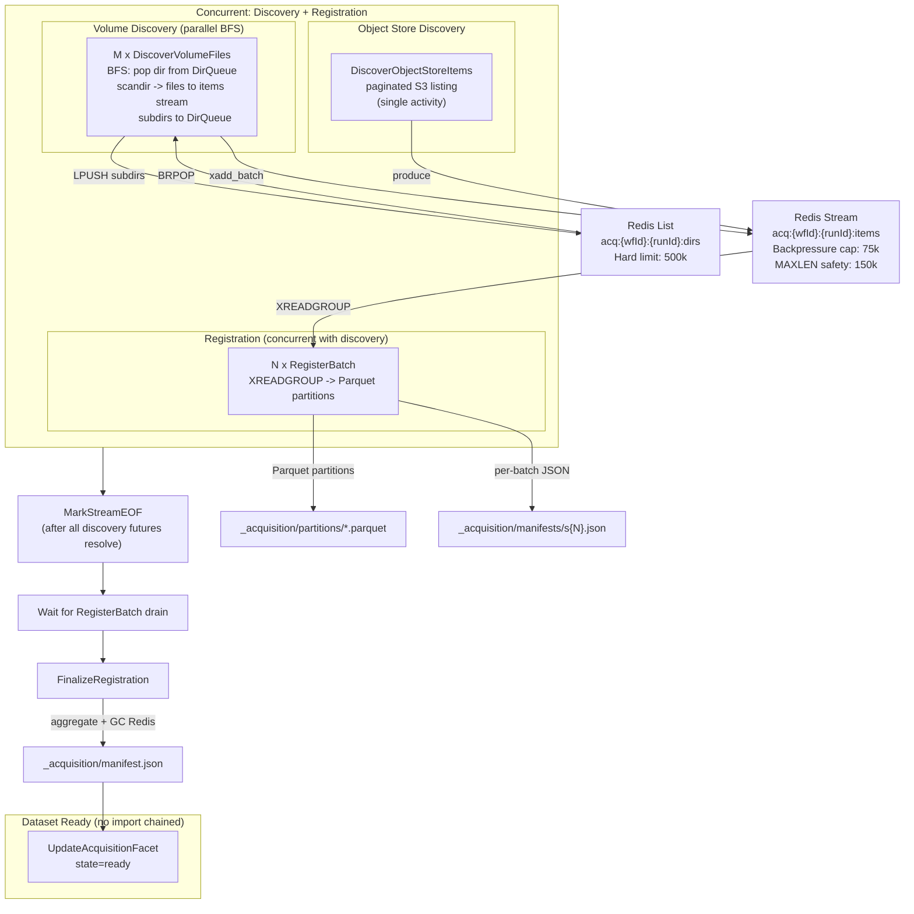

# Streaming Acquisition Pipeline

Unified zero-copy streaming acquisition pipeline for both Volume and S3
sources. Discovery catalogs file metadata (URIs, sizes, timestamps) without
reading or copying data content. Data is read only when consumed downstream
(KB creation, processing workflow, etc.).

## Design Tenet: Zero-Copy, URI-Only Dataset Creation

**Principle:** Dataset creation (acquisition) never reads or copies data
content. It discovers file metadata and stores URIs. Data is read only when
a dataset is consumed downstream.

- Acquisition = discover file URIs + write Parquet catalog. No data read, no
  data copy. Works the same for volume mounts, same-cluster S3, and external S3.
- `DatasetImportWorkflow` is decoupled from acquisition. Dataset becomes
  "ready" once the URI catalog (manifest + Parquet partitions) is written.
  Import/processing runs only when a downstream workflow needs it, reading data
  from the original URIs.

## Architecture

Discovery and registration run **concurrently** so backpressure works correctly
(consumers drain the stream before MAXLEN can trim unread entries).



## Components

| Component | File | Notes |
|-----------|------|-------|
| `JobStream` | [streaming/redis_stream.py](../../src/nemo/workers/connector-worker/streaming/redis_stream.py) | Wraps XADD / XREADGROUP / XACK / XAUTOCLAIM, EOF sentinel, state hash, EXPIRE GC. |
| `DirQueue` | same file | Redis List-backed BFS directory queue with active-worker counter, hard safety limit, idle detection. |
| `DiscoverVolumeFiles` | [acquisition_pipeline.py](../../src/nemo/workers/connector-worker/activities/acquisition_pipeline.py) | M parallel BFS workers via DirQueue -> xadd_batch to items stream. |
| `DiscoverObjectStoreItems` | same file | S3 paginated listing producer (renamed from `DiscoverSourceItems`). |
| `RegisterBatch` | same file | Source-agnostic consumer: XREADGROUP -> Parquet partition writer. Zero-copy. |
| `MarkStreamEOF` | same file | Marks EOF on items stream after all discovery futures resolve. |
| `FinalizeRegistration` | same file | Aggregates manifests + errors, writes manifest.json, GC Redis, updates facet. |
| `CleanupAcquisitionStream` | same file | Cancel/timeout safety net (also cleans DirQueue key). |
| Workflow | [data_acquisition.go](../../src/nemo/workflow-engine/internal/workflows/data_acquisition.go) | Concurrent discovery + registration, EOF goroutine, FinalizeRegistration. |

## Unified Discovery Record Schema

Both `DiscoverVolumeFiles` and `DiscoverObjectStoreItems` emit records to
the items Redis stream with the same field schema:

```
uri:            string   -- file:///mnt/pvcs/vol/path or s3://bucket/key
relative_path:  string   -- mount-relative path or prefix-stripped S3 key
size:           string   -- int as string (Redis field constraint)
last_modified:  string   -- ISO 8601 timestamp
metadata:       string   -- JSON blob (optional, may be empty string)
```

## Parquet Catalog Format

Output layout on the shared PVC under **`projects/<projectId>/datasets/<datasetId>/_acquisition/`** (sibling of `data_files/`; payload copies for object store remain under `.../data_files/`).

```
_acquisition/
  partitions/
    part-reg-s0.parquet
    part-reg-s1.parquet
  manifests/
    reg-s0.json
    reg-s1.json
  errors/
    discover-0.json       # per-worker error logs (NDJSON)
    discover-1.json
  manifest.json           # aggregate manifest
  errors.json             # aggregate errors
```

**Parquet schema:**

```
uri:            string
relative_path:  string
size:           int64
last_modified:  timestamp[us, tz=UTC]
metadata:       string (JSON blob)
```

**manifest.json** carries source context so consumers know how to resolve URIs:

```json
{
  "format": "parquet-partitioned",
  "sourceType": "volume",
  "source": {"mountPath": "/mnt/pvcs/vol-name"},
  "partitions": ["partitions/part-reg-s0.parquet", "..."],
  "totalFiles": 1234567,
  "totalSize": 98765432100,
  "maxMtime": "2026-05-03T...",
  "totalErrors": 42,
  "errorsFile": "errors.json"
}
```

## Data Layout (Redis)

Per-job keys (`workflowId` is `data-acquire-<project>-<dataset>`, deterministic;
`runId` is the Temporal run ID, fresh per execution):

- Stream: `acq:{workflowId}:{runId}:items`
- State: `acq:{workflowId}:{runId}:state` (hash of produced/dirs_scanned/errors/eofSeen/...)
- DirQueue: `acq:{workflowId}:{runId}:dirs` (Redis List for BFS directory queue)
- Group: `acq` (single consumer group)

All keys carry `EXPIRE 86400` as a GC safety net.

## Redis Memory Safety

### MAXLEN decouple

| Parameter | produce() (S3, unchanged) | xadd_batch() (volume, new) |
|-----------|--------------------------|---------------------------|
| Backpressure cap | 1.5 x stream_maxlen = 75k | 1.5 x stream_maxlen = 75k |
| XADD MAXLEN | stream_maxlen = 50k | stream_maxlen x 3 = 150k |

### DirQueue hard safety limit

The BFS directory queue uses a **non-blocking hard safety limit** (500k entries).
Blocking backpressure is impossible on a self-consuming queue (deadlocks).
Workers check LLEN and raise `RuntimeError` if the limit is exceeded. Normal
filesystems never hit this -- the BFS frontier is typically a few thousand entries.

### Redis pod resources

| Overlay | Requests | Limits |
|---------|----------|--------|
| Default (values.yaml) | 512Mi | 2Gi |
| Resource-constrained | 128Mi | 512Mi |

## Volume Discovery: Parallel BFS

M parallel `DiscoverVolumeFiles` workers share a `DirQueue` (Redis List).

1. First worker self-seeds the queue via `HSETNX` + `LPUSH`.
2. Each worker: `pop(BRPOP)` -> `scandir` -> push subdirs -> `xadd_batch` files.
3. Idle detection: increment active counter before BRPOP, decrement after.
4. Exit when queue empty and all workers idle.
5. Go workflow marks EOF via `MarkStreamEOF` after all discover futures resolve.

**Heartbeat:** every 5000 files within large directories to prevent timeout.

**Symlinks:** `follow_symlinks=False` -- symlinks to files are skipped, symlinks
to directories are not traversed (prevents BFS cycles).

**Error handling:** `PermissionError` / `OSError` on individual entries are
non-fatal. Each worker writes errors to `_acquisition/errors/discover-{workerId}.json`.

## Workflow Orchestration (Volume Path)

```
1. Launch concurrently:
     a. M parallel DiscoverVolumeFiles (via ExecuteActivity futures)
     b. N parallel RegisterBatch (via ExecuteActivity futures)
2. workflow.Go goroutine:
     -- wait for all M discovery futures (ignore individual errors)
     -- ALWAYS call MarkStreamEOF (even if all discoverers failed)
3. Wait for all N registration futures
4. FinalizeRegistration (manifest.json + errors.json + GC Redis)
5. Update dataset status to "ready"
6. NO DatasetImportWorkflow chained
```

## Idempotency and Recovery

- **Stream key includes runId**: retries get a clean stream.
- **Discovery self-seeding is idempotent**: `HSETNX` ensures only one worker seeds.
- **RegisterBatch crash recovery**: `XAUTOCLAIM` reclaims idle entries from dead consumers.
- **DirQueue BRPOP is destructive**: a popped directory is lost on crash (accepted tradeoff;
  Phase 3 upgrades to Redis Stream-based DirQueue for crash-safe reclaim).
- **Cancel/timeout cleanup**: `workflow.Go` goroutine runs `CleanupAcquisitionStream`
  which cleans up items stream, state hash, and DirQueue key.

## Configuration

Workflow-engine envs:

| Env | Default | Notes |
|-----|---------|-------|
| `ACQ_USE_PIPELINE` | `true` | Set to `false` to fall back to legacy path. |
| `ACQ_MAX_DISCOVER_WORKERS` | `2` | Parallel BFS discovery workers (M). |
| `ACQ_MAX_REGISTER_CONSUMERS` | `2` | Parallel RegisterBatch consumers (N). |
| `ACQ_MAX_CONSUMERS` | `8` | Upper bound for S3 AcquireBatch (legacy). |
| `ACQ_MAX_FAILURE_RATE` | `0.05` | Scatter-gather aborts above this. |

Connector-worker envs:

| Env | Default | Notes |
|-----|---------|-------|
| `MAX_CONCURRENT_ACTIVITIES` | `8` | Activity executor pool. |
| `ACQ_REDIS_URL` | `redis://redis-master:6379/3` | Standalone fallback. |
| `ACQ_REDIS_SENTINEL_URL` | *(empty)* | Preferred (HA). |
| `ACQ_STREAM_MAXLEN` | `50000` | Approximate cap (XADD MAXLEN ~). |
| `ACQ_BATCH_SIZE` | `64` | Items per XREADGROUP. |
| `ACQ_BLOCK_MS` | `2000` | XREADGROUP block timeout. |
| `ACQ_RECLAIM_IDLE_MS` | `300000` | XAUTOCLAIM idle threshold. |
| `ACQ_EMPTY_READS_AFTER_EOF` | `3` | Empty reads before exit post-EOF. |
| `ACQ_DIRQUEUE_BRPOP_TIMEOUT_SEC` | `1.0` | Base seconds for `DirQueue` `BRPOP` (±30% jitter). Lower = faster tail coalescence, higher Redis QPS while idle. |

## Redis errors and strict I/O

- **`DirQueue.pop` / `JobStream.consume`:** Redis transport failures retry a few
  times then **raise** the activity (Temporal retry). A `BRPOP` **timeout**
  (empty list) is not an error and returns `None` / `[]` respectively.
- **`DirQueue.is_idle`:** `LLEN` / `HGET` failures return **not idle** (never
  exit discovery early due to a mis-read).
- **`get_eof_seen()`:** Returns `True` / `False` / `None` (`None` = Redis read
  failed). `RegisterBatch` / `AcquireBatch` fail after several consecutive `None`
  values so they do not spin forever with a broken state hash.
- **`MarkStreamEOF` / `JobStream.mark_eof`:** **Idempotent** — skips `XADD` if
  `eofSeen` is already set; if the stream already contains an EOF sentinel but
  state is missing, **repairs** state only (no duplicate sentinel in the common
  case). Consumers tolerate duplicate EOF if it ever occurs.
- **`JobStream.produce`:** Fails if `update_state` after a flush cannot persist
  (no silent progress).
- **Per-batch manifests:** `AcquireBatch` / `RegisterBatch` **raise** if the
  manifest JSON cannot be written (no silent success).
- **`AcquireBatch` budget:** `ACQ_MAX_BATCHES_PER_ACTIVITY` caps how many read
  rounds **this consumer** runs; exiting on budget **without** confirmed EOF
  is possible when other consumers still drain the stream — not a Redis error.

## Progress and Metrics

Three tiers of observability:

1. **Real-time (in-memory ProgressStore)**: discovery workers post phase/counts;
   workflow posts aggregated percentage after discovery and registration completion.
2. **Durable (acquisition facet)**: `FinalizeRegistration` updates to
   `ready`/`errored`/`failed` with full metrics.
3. **POSIX audit trail**: per-batch manifests, Parquet partitions, aggregated
   `manifest.json` and `errors.json`.

## Failure Handling

- **Discovery worker crash**: Temporal retries. New instance joins the same
  BFS via DirQueue. One directory's files may be lost (BRPOP is destructive).
- **RegisterBatch crash**: Temporal retries. XAUTOCLAIM reclaims pending items.
  Partial Parquet files are orphaned (not in any manifest).
- **All discovery workers fail**: workflow still marks EOF, RegisterBatch drains,
  FinalizeRegistration writes manifest with 0 files, facet set to "failed".
- **FinalizeRegistration fails**: Temporal retries. Idempotent (re-reads manifests).
  EXPIRE GCs Redis keys if all retries fail.
- **Redis unavailable**: `js.ping()` check fails, activity raises. `ACQ_USE_PIPELINE=false`
  falls back to legacy path.
- **Redis partial failures during stream/dir coordination**: see
  [Redis errors and strict I/O](#redis-errors-and-strict-io) above.
- **Workflow cancelled/timed out**: cleanup goroutine GCs Redis keys + DirQueue.

## Phased Rollout

| Phase | What | Status |
|-------|------|--------|
| 1 | Unified zero-copy pipeline (volume path), Parquet catalog, BFS discovery, DirQueue, Redis safety | This change |
| 2 | Wire S3 path to concurrent RegisterBatch + FinalizeRegistration, decouple S3 DatasetImportWorkflow | Follow-up |
| 3 | Upgrade DirQueue to Redis Stream for crash-safe directory reclaim; populate metadata column | Follow-up |
| 4 | Dedicated Redis instance or Redis Cluster for horizontal write scaling | If needed |

## See also

- [pipelines.md](pipelines.md) -- broader workflow design
- [connectors.md](connectors.md) -- connector taxonomy
- [datasets.md](datasets.md) -- dataset model + facet taxonomy
- [temporal-python-workers.md](temporal-python-workers.md) -- worker architecture
