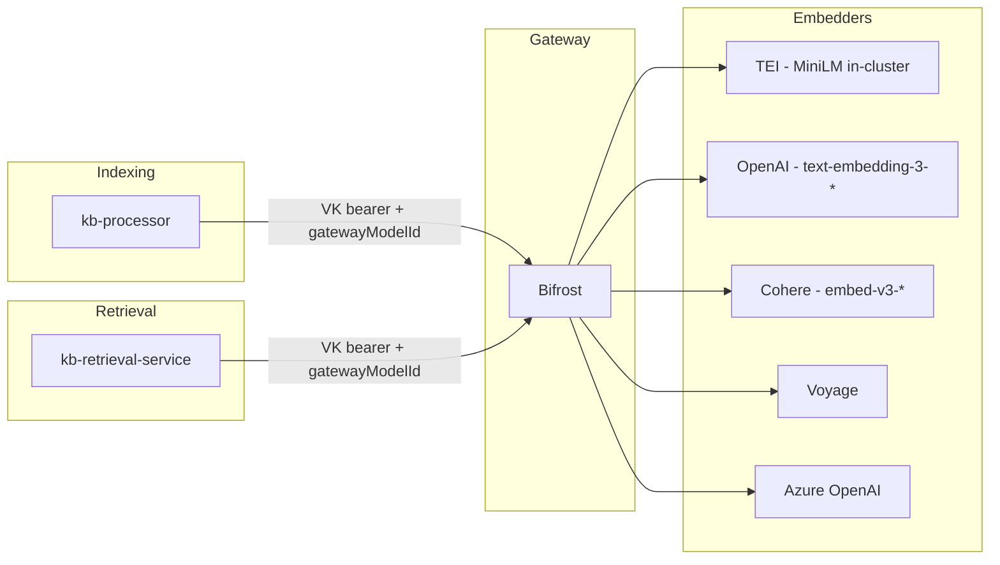
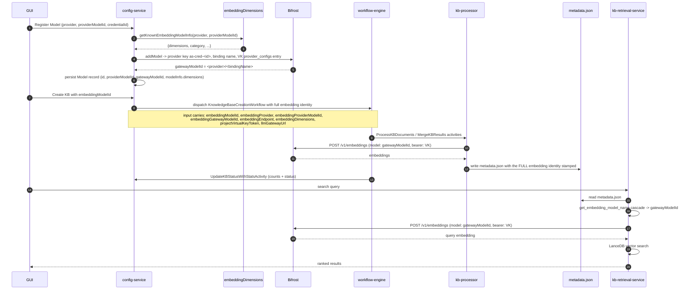

# Unified embedding models

How embedding traffic (both built-in MiniLM and registered third-party models) is
routed, governed, and tracked across AgentStudio. Pre-unification the platform
ran sentence-transformers in-process inside `kb-processor`, used a different
identifier for "the model" at every layer, and let `metadata.json` lose the
embedding identity between writes — leading to KBs that retrieved against the
wrong model. This doc describes the end-state.

## Doc map

- **Principle** — every embedding call goes through the Bifrost LLM gateway.
- **Local models** — `sentence-transformers/all-MiniLM-L6-v2` served by an
  in-cluster TEI deployment, fronted by Bifrost.
- **Remote models** — registered OpenAI / Cohere / Voyage / Azure / Bedrock
  models flowing through Bifrost with per-credential provider keys.
- **Catalog** — `embeddingDimensions.ts`: single source of truth for
  dimensions, recommended chunk size, and known-model metadata.
- **Identity flow** — registration → KB creation → indexing → retrieval; the
  fields that travel and where each layer reads from.
- **Unified metadata** — the new `metadata.json` schema, what each field
  carries, and how it eliminated the "wrong embedding model at query time" bug.
- **Migration** — what happens to KBs created before unification.

## When to read what

- **Adding a new embedding provider?** → §Catalog and §Remote models.
- **Debugging a "wrong vector size" or "model_blocked 403"?** → §Identity flow
  and §Unified metadata.
- **Tuning TEI replicas / autoscaling for MiniLM?** → §Local models.

---

## Part A — Architecture

### 1. Principle: one gateway, one model identity

Every embedding call in AgentStudio — at KB-index time and at KB-query time,
for every model, built-in or registered — goes through the **Bifrost LLM
gateway**. There is no in-process sentence-transformers, no direct OpenAI
SDK, no separate embedding service. The gateway is the single hop between
the platform and any embedder.

Why a single gateway:

- **Per-project governance.** Bifrost's virtual keys + teams give us
  per-project rate limits, allowed-model lists, and spend tracking for
  embeddings the same way we already have it for chat completions. See
  [bifrost-migration.md](bifrost-migration.md) for the team / VK model.
- **One credential surface.** kb-processor and kb-retrieval-service both
  use the per-project VK bearer (`as-proj-{projectId}-vk` K8s Secret).
  No model-specific API keys plumbed through the workers.
- **One wire shape.** All embedders speak the OpenAI-compatible
  `POST /v1/embeddings` endpoint. Built-ins, hosted, and self-hosted
  alike. No special case in the client.
- **One identifier on the wire.** Bifrost's virtual-key
  `allowed_models[]` checks against the `model` field as a string.
  AgentStudio sends the **Bifrost wire identifier** (a.k.a.
  `embeddingGatewayModelId`, of the form `<provider>/<gatewayBindingName>`),
  not the raw provider model id. The two diverge when the provider model
  name needs aliasing (per-credential namespacing, multi-tenant routing) —
  the gateway identifier always wins.

### 2. Local models: TEI + MiniLM behind Bifrost

The built-in embedding model is `sentence-transformers/all-MiniLM-L6-v2`
(384-dimensional, English) served by a **Text Embeddings Inference (TEI)**
deployment inside the services namespace. TEI is the Hugging Face
production-grade inference server for embedding models — it loads the
sentence-transformers checkpoint once, exposes an OpenAI-compatible
`POST /v1/embeddings` endpoint, batches request bodies internally, and
runs on CPU or GPU. Same chart, same wire shape, regardless of which
checkpoint is loaded.

**Why TEI rather than in-process sentence-transformers in kb-processor:**

| Concern | In-process (pre-unification) | TEI + Bifrost (now) |
|---------|------------------------------|---------------------|
| Cold-start time | ~30s loading the model into every kb-processor pod, image bloat from PyTorch + the checkpoint | TEI pod loads once; kb-processor stays a thin Python image |
| Memory footprint | ~700 MB / pod (PyTorch + tokenizer + weights) | kb-processor pod is back to a few hundred MB |
| Embedding parity with retrieval | Two different embedders in two different runtimes (Python + Rust); easy to drift on tokenizer / pooling | Both call the same TEI endpoint via Bifrost; bit-identical vectors |
| Governance | Bypassed the gateway entirely — no rate limits, no per-project attribution | Built-in goes through the same VK + provider plumbing as third-party models |
| Replacing the checkpoint | Code change + image rebuild + redeploy every kb-processor worker | Helm value change on the TEI chart; no worker churn |

**Wiring** (chart at
[`deployments/helm/services/charts/text-embeddings-inference/`](../../deployments/helm/services/charts/text-embeddings-inference/)):

- `image.repository: ghcr.io/huggingface/text-embeddings-inference`,
  `tag: cpu-1.5` by default.
- `models.minilm.hfModelId: sentence-transformers/all-MiniLM-L6-v2`,
  `dimensions: 384`.
- Exposed as K8s Service `tei-minilm:80` in the services namespace.
- Replica count + HPA (CPU-based scale-out) configurable per cluster.
- `cache.type: emptyDir` by default — model weights re-fetch on pod
  restart (a few seconds for MiniLM). Set to a PVC if you want to avoid
  the hit.

**Registration with Bifrost** (lives in
[`BuiltinModelsService.ts`](../../src/nemo/config-service/services/BuiltinModelsService.ts)):
config-service registers a dedicated Bifrost provider named
`as-tei-minilm` (general pattern: `as-{teiServiceName}`, single `as-`
prefix; see `builtinGatewayProviderName` in BuiltinModelsService) with
type `openai-compatible` and base URL pointing at the in-cluster TEI
Service. Each project's VK gets a `provider_configs` entry binding the
allowed model name. At KB-create time, `kb-processor` sends
`model: "as-tei-minilm/sentence-transformers/all-MiniLM-L6-v2"` on its
embedding call; Bifrost matches the VK's `allowed_models[]`, dispatches
to TEI, gets back 384-d float32 vectors, returns them upstream.

**Adding another local model** (e.g. multilingual MiniLM, BGE-large):
add an entry under `models:` in the TEI chart values, redeploy the
chart, and a `BuiltinModelsService` startup pass picks it up and
registers it with Bifrost. No code change.

### 3. Remote models: registered providers behind Bifrost

User-registered embedding models (OpenAI, Cohere, Voyage, Azure OpenAI,
AWS Bedrock, self-hosted OpenAI-compatible endpoints) flow through
Bifrost the same way local models do — the only difference is the
provider key, the upstream URL, and where the credential comes from.

**Per-credential provider keys.** AgentStudio creates a dedicated
Bifrost provider per stored credential, named
`as-openai-compat-{credentialShortId}` (12 hex chars of the credential
UUID). The `openai-compat` segment matches the AgentStudio credential
schema field (`credentials.provider = 'openai_compatible'`), so a
reader looking at a provider name in the Bifrost UI or inside a stored
`gatewayModelId` can trace it straight back to the credential row that
produced it. It also distinguishes from the `as-tei-*` family
(in-cluster TEI deployments) and from Bifrost's native `openai` /
`azure` / `bedrock` / `gemini` providers. The per-credential scoping is intentional: it
isolates one tenant's API key from another's, and lets a credential's
permissions / cost flow stay independent. The provider's `api_base`
and `api_key` come from the credential record at registration time.
The provider type is `openai` for first-party OpenAI, `openai-compatible`
for everything else that speaks the OpenAI spec. See
[`bifrostProviderOps.ts`](../../src/nemo/config-service/services/bifrost/bifrostProviderOps.ts) and
[`BifrostGatewayClient.ts`](../../src/nemo/config-service/services/BifrostGatewayClient.ts)
for the `addModel` flow.

**Per-credential binding name.** When the same model id needs to be
served by different upstream keys (e.g. two different OpenAI
organisations), each registration gets a fresh `gatewayBindingName`
under its provider — so `model` on the wire is
`as-openai-compat-c1a07315a8d2/text-embedding-3-small` rather than the bare
`text-embedding-3-small`. This is what fixed the "openai vs
openai_compatible" routing bug: callers always send the wire
identifier; Bifrost looks up the binding under the credential-scoped
provider; there is no global namespace where two keys collide.

**Allowed-model enforcement.** The project's virtual key carries the
list of allowed `(provider, gatewayBindingName)` pairs in its
`provider_configs`. A KB indexed under one project cannot be queried
under another, and a model removed from a project disappears from both
KB-create and KB-query simultaneously.

### 4. Embedding-dimensions catalog

There is one place in the codebase that knows the dimension count and
recommended chunk size for a known embedding model:
[`config-service/providers/embeddingDimensions.ts`](../../src/nemo/config-service/providers/embeddingDimensions.ts).
It exposes:

- `getKnownEmbeddingModelInfo(provider, providerModelId)` — returns
  `KnownEmbeddingModel` (dimensions, category, description,
  recommendedChunkSize) or undefined.
- `getKnownEmbeddingDimensions(provider, providerModelId)` —
  thin wrapper that returns just the integer dimension.
- `enrichModelInfoFromCatalog(existingInfo, provider, providerModelId)`
  — merges catalog metadata into a Model record's `model_info` JSONB
  blob at create / update time, for GUI display.

What the catalog currently covers (non-exhaustive):

- **OpenAI** — ada-002 (1536), text-embedding-3-small (1536),
  text-embedding-3-large (3072).
- **Cohere** — embed-v3 English / multilingual (1024), light variants
  (384), v2 (4096 / 768).
- **AWS Bedrock Titan** — v1 (1536), v2 (1024), image (1024).
- **Voyage** — voyage-3 (1024) and a few others.
- **Local** — MiniLM L6 v2 (384).

This catalog is consulted at three points:

1. **Model registration** (`modelRoutes.ts`): when the user registers
   a new embedding Model, `enrichModelInfoFromCatalog` stamps the
   `dimensions` on the Model record so the GUI can show "1536-d
   OpenAI" without a runtime probe.
2. **KB creation** (`knowledgeBaseRoutes.ts` →
   `kbWorkflowKickoff.ts`): the dimension goes into the dispatched
   workflow input as `embeddingDimensions`, which `kb-processor` uses
   to size the LanceDB schema's vector column.
3. **Search-time consistency** (kb-retrieval-service does not call the
   catalog directly — the dimension lives on the KB's `metadata.json`,
   stamped at index time; see §Unified metadata).

**Adding a new known model.** One file edit:
`embeddingDimensions.ts` const table. No changes to kb-processor,
kb-retrieval, or workflow-engine; the catalog is queried by name.

### 5. Identity flow: registration to retrieval

Notable invariants:

- **What the caller sends on the embeddings wire is always
  `embeddingGatewayModelId`** — at indexing and at retrieval. Never the
  raw `providerModelId`, never the AgentStudio UUID. The VK's
  `allowed_models[]` matches against this string; sending anything else
  is a guaranteed `model_blocked` 403.
- **The dimension on disk wins.** At LanceDB-write time the schema is
  sized from the actual response shape of TEI / OpenAI / Cohere, not
  the catalog's number. The catalog's value is used for pre-flight
  display + workflow-input plumbing; the persisted `vectorSize` is the
  authoritative one.
- **Per-project isolation.** The VK bearer kb-processor uses at index
  time is the same one kb-retrieval-service uses at query time — for
  the same project. A project's KB is unsearchable without its VK
  (kb-retrieval reads the K8s Secret on every request).

---

## Part B — Metadata unification

### 6. Why the unification was needed

Pre-unification, kb-processor wrote two files at the end of every
successful run:

- `kb_processing_results.json` — the workflow-result file the Go side
  read via `ReadKBProcessingResultActivity`. Carried `documentCount` /
  `chunkCount` / `vectorCount` / `lanceTablePath` / `stats`.
- `metadata.json` — the KB-shape file kb-retrieval-service read on
  every search. Carried `lanceTablePath` / `indexingMode` / index
  capability booleans. **Frequently missing the embedding identity.**

Three problems with that:

1. **The counts duplicated.** Both files carried `documentCount` etc.,
   sometimes at the top level, sometimes nested in `stats`. One write
   path would update one file's copy but not the other's; the GUI
   would show the wrong number depending on which service it asked.
2. **The embedding identity lived in neither.** Or rather, it lived in
   `metadata.json` on some code paths (the in-process `processor.py
   main()`) and **was completely absent** on others (the partitioned
   path that ran in `temporal_worker.merge_kb_results`). A KB indexed
   via the partition path had a `metadata.json` with no
   `embeddingModel` field; kb-retrieval's read cascade fell through to
   the service default (MiniLM); queries went to TEI even when the KB
   was indexed against `text-embedding-3-small`. **This is the
   "wrong embedding model at retrieval" bug.**
3. **The dual-file pattern made the schema implicit.** Neither file
   had a Go struct describing it — `KBProcessingResult` decoded a
   subset, `metadata.json` was read as a free-form `serde_json::Value`
   in Rust. Adding a field meant remembering to write it in two Python
   call sites and read it in two language runtimes; field-name drift
   was inevitable.

### 7. The unified `metadata.json` schema

After unification, kb-processor writes exactly one file:
`{pathPrefix}/knowledgebases/{kbId}/metadata.json`. It carries three
groups of fields:

**Workflow-result fields** — the Go workflow decodes these into the
typed `types.KBMetadata` struct via `ReadKBMetadataActivity`.

| Field | Type | Notes |
|-------|------|-------|
| `status` | string | `"success"` or `"error"`. |
| `knowledgeBaseId` | string | Echoes the input id. |
| `projectId` | string | Echoes the input id. |
| `lanceTablePath` | string | Absolute path to the active LanceDB table; the blue-green pointer. |
| `documentCount` | int | Source documents processed. **Top-level only** post-unification. |
| `chunkCount` | int | Chunks written to LanceDB. |
| `vectorCount` | int | Embeddings written. Equal to `chunkCount` today. |
| `sourceType` | string | `"structured"` or `"unstructured"`. |
| `error` | string | Populated when `status == "error"`. |
| `stats` | object | Storage-only block — see next table. |

**KBStats nested object.** Holds storage / file info ONLY (counts
intentionally **not** here — they used to be, and the duplication
caused drift):

| Field | Type | Notes |
|-------|------|-------|
| `stats.storageBytes` | int64 | Total bytes of the Lance directory + indices. |
| `stats.storageMB` | float | Same in MB, for GUI display. |
| `stats.fileCount` | int | Number of files under the Lance directory. |
| `stats.lastProcessedAt` | string | ISO-8601 UTC timestamp of the run that produced this metadata. |

**KB-shape + embedding-identity fields** — kb-retrieval-service reads
these directly from the raw JSON (the Go struct doesn't decode them
because the Go workflow doesn't need them):

| Field | Type | Notes |
|-------|------|-------|
| `indexingMode` | string | `"hybrid"` / `"semantic"` / `"fts"`. Drives the default search-mode resolution. |
| `hasVectorIndex` | bool | Whether the vector ANN index was built (some quantization modes skip it). |
| `vectorIndexMetric` | string | `"cosine"` / `"l2"` / `"dot"`; null when no vector index. |
| `hasFtsIndex` | bool | Whether the BM25 FTS index was built. |
| `embeddingModel` | string | Legacy field; readable by older clients. |
| `embeddingProvider` | string | `"local"` / `"openai"` / `"openai_compatible"` / etc. |
| `embeddingModelId` | string (UUID) | FK to the config-service `models` row that owned the indexing run. |
| `embeddingProviderModelId` | string | The provider's own model name (`text-embedding-3-small`, `sentence-transformers/all-MiniLM-L6-v2`, ...). |
| `providerModelId` | string | Alias of the above; kept for the read cascade's older positions. |
| `embeddingGatewayModelId` | string | **The Bifrost wire identifier** (`<provider>/<bindingName>`). The retrieval cascade reads this first. |
| `embeddingEndpoint` | string \| null | Override endpoint when the model isn't on the default Bifrost. |
| `vectorSize` | int | Authoritative dimension — written from the actual embedding response, not the catalog. |
| `tableName` | string | LanceDB table name (`kb_vectors` today). |
| `chunkSize` / `chunkOverlap` / `chunkStrategy` / `quantizationType` | various | Reprocessing parameters; the GUI shows them on the KB detail page. |
| `lastProcessingMode` | string | `"full"` / `"incremental"`. |
| `processedFiles` | object | Per-file last-modified + chunk-count tracking; used by incremental-mode diffing. |

**Where the fields come from in code:**

- Go struct: [`types.KBMetadata`](../../src/nemo/workflow-engine/pkg/types/kb_creation.go).
- Python writer (Temporal merge): [`temporal_worker.merge_kb_results`](../../src/nemo/workers/kb-processor/temporal_worker.py).
- Python writer (in-process): [`processor.py main()`](../../src/nemo/workers/kb-processor/processor.py) — keeps the same shape.
- Rust reader (cascade): [`store_metadata.rs::get_embedding_model_name`](../../src/nemo/kb-retrieval-service/src/store_metadata.rs).

### 8. The retrieval-side embedding-model cascade

`kb-retrieval-service` resolves the embedding model identity by reading
the metadata in this order, returning the first non-empty value:

1. `embeddingGatewayModelId` — the Bifrost wire identifier. **Preferred**
   because this is exactly what Bifrost's `allowed_models[]` matches
   against; sending it is the only way to avoid the `model_blocked` 403.
2. `providerModelId` — same value as `embeddingProviderModelId`, kept as
   an earlier position in the cascade for KBs written between the two
   field names.
3. `embeddingProviderModelId` — the provider's own model name. Works
   for built-ins and pre-Bifrost remote registrations.
4. `embeddingModel` — legacy single-string field.
5. Service default (`DEFAULT_MODEL_NAME`, MiniLM) — only hit when the
   KB pre-dates this stamping entirely.

The cascade is intentionally generous: legacy KBs without
`embeddingGatewayModelId` still work, falling through to a value the
gateway can route. The fallback to MiniLM is the genuine edge case —
"this KB was indexed before the unification and we have no record of
what model it used"; the answer at that point is "reprocess it".

### 9. Vector size tracking

Pre-unification `vectorSize` was carried on the `KnowledgeBase` DB row
in config-service, populated from the UI's selected dimension (often
wrong — defaulted to 1536 even for MiniLM). At KB-create time the
workflow passed it to kb-processor which built the LanceDB schema
around it; the actual embedding response could be a different
dimension; LanceDB threw at write time or silently truncated.

Post-unification:

- **At workflow-dispatch time**, `embeddingDimensions` comes from the
  catalog (`getKnownEmbeddingDimensions`) — the catalog is now the
  source of truth, not the UI form.
- **At index-write time**, the actual embedding response dimension
  wins. `kb-processor`'s `EmbeddingGenerator` learns the dimension from
  the first response, and the LanceDB schema is sized from that.
- **In `metadata.json`**, `vectorSize` is the on-disk dimension —
  what's actually in the Lance table. The KB record's `vectorSize`
  column is updated by `UpdateKBStatusWithStatsActivity` at the end
  of the workflow to match.
- **At query-time**, `kb-retrieval-service` doesn't need to know the
  dimension explicitly — the LanceDB table carries the schema, and
  the embedding call to Bifrost produces whatever the model returns.
  If the dimensions don't match it's a configuration error, and
  LanceDB raises at search time with a clear message.

The net effect: the dimension recorded in three places (catalog, KB
row, metadata.json) now converge, with `metadata.json` authoritative
for retrieval and the KB row authoritative for display.

---

## Part C — Migration and operations

### 10. What happens to KBs created before unification

Pre-unification KBs have a `metadata.json` that may be missing all
embedding identity fields (the partition-path failure mode described
in §6). Two things happen at next access:

- **At query time**: the retrieval cascade falls through to
  `DEFAULT_MODEL_NAME` (MiniLM). If the KB was actually indexed against
  MiniLM, queries work correctly. If not, queries either return
  irrelevant results (semantic mismatch) or fail with `model_blocked`
  when the VK's `allowed_models[]` doesn't include MiniLM.
- **At next reprocess**: the new kb-processor writes the unified
  shape with full embedding identity. From that point on the KB is
  self-describing and queries route correctly.

**Operator guidance:** if a KB is searching against the wrong
embedding model and you can't reprocess immediately, the cheapest fix
is a one-shot patch of `metadata.json` adding the
`embeddingGatewayModelId` your config-service Model record records.
The Rust reader picks it up on the next request — no service restart
needed.

### 11. Operating the TEI deployment

TEI is the single embedding stack consumed by every KB indexed against
the built-in model. Treat it as production data-path.

- **Scale up before bulk-import.** A KB-create workflow can issue tens
  of thousands of embedding requests in a few minutes; one TEI replica
  on `cpu-1.5` saturates around ~200 req/s for MiniLM. The HPA scales
  on CPU; if you're about to backfill many KBs, bump
  `models.minilm.replicaCount` (or the HPA min) explicitly to avoid
  the cold-start lag.
- **Don't share the chart instance across clusters.** TEI runs per
  cluster; the in-cluster K8s Service name (`tei-minilm`) is what
  Bifrost is registered to dial. If you point Bifrost at a TEI in a
  different cluster, you pay the latency twice (Bifrost → external
  TEI → response) and lose the per-project VK governance.
- **Cache PV vs emptyDir.** Default `cache.type: emptyDir` re-fetches
  the checkpoint from Hugging Face on every pod restart. MiniLM is
  small (~85 MB); it's fast. For larger checkpoints (BGE-large,
  E5-large) consider a PVC so a node failure doesn't cost minutes of
  download.
- **Image tag.** `cpu-1.5` runs CPU-only. Use `1.5` (GPU) or a
  GPU-specific tag and add the right nodeSelector / resources if
  you've got NVIDIA nodes available; throughput goes up roughly 5-10×
  for MiniLM-sized models.

### 12. Failure modes and what they look like

| Symptom | Likely cause | Where to look |
|---------|--------------|---------------|
| `model_blocked` 403 on every search of a KB | `metadata.json` lacks `embeddingGatewayModelId`; cascade fell through to `embeddingProviderModelId`; that value isn't in the VK's `allowed_models[]`. | Inspect the KB's `metadata.json`; reprocess or patch the file. |
| `model_blocked` 403 only on KBs indexed before a certain date | Pre-unification KBs; partition-path metadata missing the embedding fields. | Same — reprocess. |
| Search returns garbage / very low scores on a KB | Wrong embedder used for the query (different model than the one used to index). Now that the cascade is right, this only happens when `metadata.json` was hand-patched with the wrong gatewayModelId. | Compare `embeddingGatewayModelId` in `metadata.json` against the KB's `embeddingModelId` row in config-service. |
| `dimension mismatch` LanceDB error at search | KB's Lance table was built at one dimension; current embedding response is a different dimension. Should be impossible post-unification (TEI / OpenAI / etc. all return a stable dim per model). | Check whether the model was re-registered with a different `providerModelId` between KB-create and KB-query. |
| Embedding call hangs at search time | Bifrost NetworkPolicy doesn't allow kb-retrieval-service. | Confirm `kb-retrieval-service` is in the Bifrost ingress `from` allowlist. |
| TEI pod `OOMKilled` under bulk-import | Concurrent batch sizes exceed pod memory. | Reduce kb-processor `MAX_CONCURRENT_ACTIVITIES`, or scale TEI up, or raise its memory limit. |

---

## References

- [bifrost-migration.md](bifrost-migration.md) — Bifrost gateway architecture, team / VK governance, MCP routing.
- [knowledge-base.md](knowledge-base.md) — KB creation workflow, LanceDB layout, retrieval search modes.
- [TEI upstream docs](https://github.com/huggingface/text-embeddings-inference) — supported models, performance tuning, GPU configuration.
- [`embeddingDimensions.ts`](../../src/nemo/config-service/providers/embeddingDimensions.ts) — known-model catalog.
- [`BuiltinModelsService.ts`](../../src/nemo/config-service/services/BuiltinModelsService.ts) — registers TEI-backed models with Bifrost on startup.
- [`bifrostProviderOps.ts`](../../src/nemo/config-service/services/bifrost/bifrostProviderOps.ts) — per-credential provider / binding management.
- [`store_metadata.rs`](../../src/nemo/kb-retrieval-service/src/store_metadata.rs) — retrieval-side metadata reader + embedding-model cascade.
- [`types/kb_creation.go`](../../src/nemo/workflow-engine/pkg/types/kb_creation.go) — `KBMetadata` Go struct.
