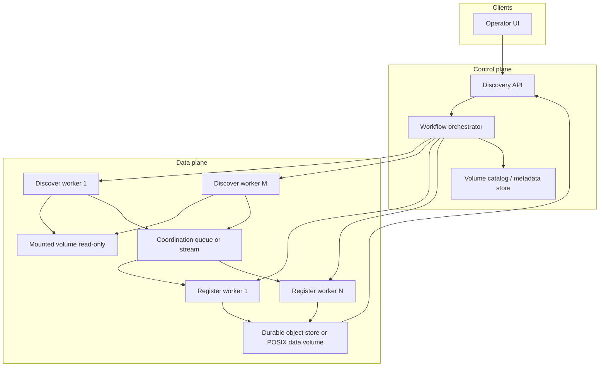
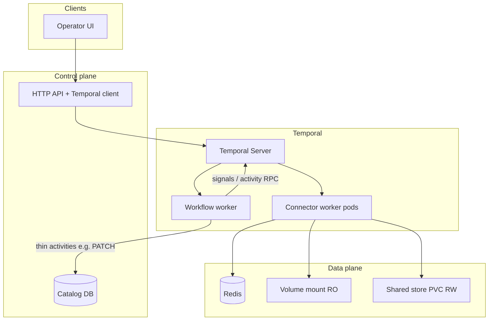
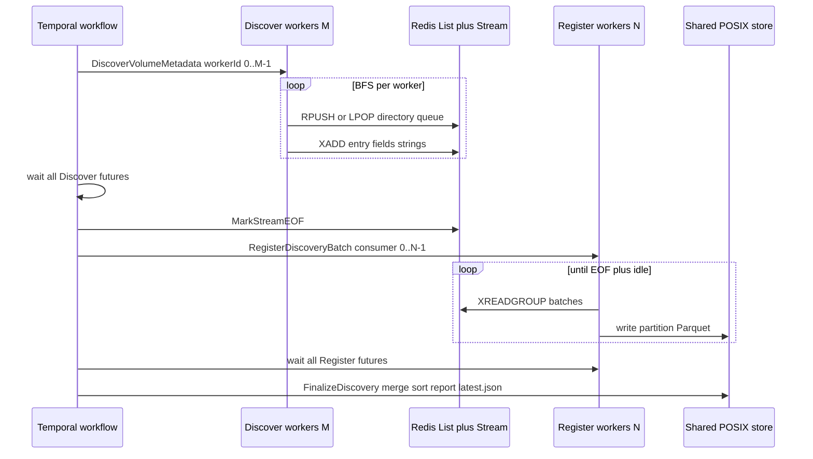
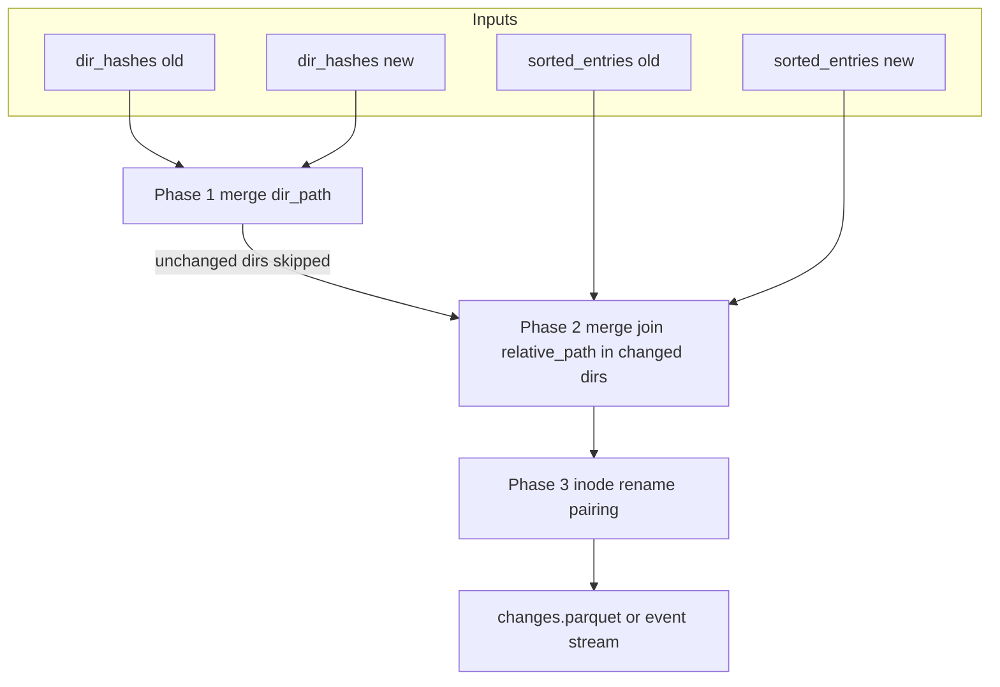

# Volume discovery — architecture and workflow design

This document describes **volume discovery**: a scalable, durable workflow that crawls a mounted filesystem volume, records rich metadata for every file and directory, materializes the result as columnar **Parquet** artifacts and a human-readable **report**, and prepares the ground for **dataset refresh hints** and future **change detection (CDC)**.

It is written to stand alone: you do not need to read project-specific code to understand the design. Implementation may attach these concepts to a particular orchestrator (e.g. Temporal), worker runtime (e.g. Python activities), and API surface; the ideas transfer.

---

## Doc map — where to start

| If you want to… | Read… |
| ---------------- | ----- |
| Understand *why* discovery exists | [Motivation](#1-motivation-why-volume-discovery) |
| See the big picture | [Conceptual architecture](#3-conceptual-architecture) |
| Follow the timeline of a single run | [Orchestrated workflow](#4-orchestrated-workflow-narrative) |
| Understand each unit of work | [Activities in depth](#5-activities-in-depth) |
| Know what gets stored and where | [Storage layout and versioning](#6-storage-layout-and-versioning) |
| Reason about cost at scale | [Scale, memory, and disk](#8-scale-memory-and-disk-budgets) |
| Connect discovery to downstream products | [Dataset refresh evaluation](#9-dataset-refresh-evaluation) and [CDC foundations](#10-change-detection-cdc-foundations) |
| Map abstractions to Temporal + Redis + POSIX | [Reference implementation](#reference-implementation) |
| See how to diff two discovery runs in code | [CDC: diffing two runs](#cdc-diff-between-runs) |

**Audience:** engineers new to the problem domain who will implement, operate, or extend discovery.

**Prerequisites:** familiarity with POSIX directories (`readdir`, `stat`), basic idea of **message streams** or **queues** for fan-out work, and optionally **workflow engines** that replay deterministic logic and delegate heavy I/O to activities.

---

## 1. Motivation — why volume discovery?

Many data platforms treat **datasets** as the primary abstraction: users configure filters, schedules, and pipelines against named datasets backed by object storage or NAS paths. That model works well once boundaries are clear.

**Mounted volumes** (for example NFS exports from enterprise storage) are different:

- The **same physical tree** may feed **many datasets** with different glob patterns, path prefixes, and watermarks.
- Operators need **inventory and governance** views: file types, sizes, ages, ownership, permission modes, and optionally ACLs — without copying petabytes of bytes.
- **Incremental** and **refresh** decisions should depend on a **single authoritative inventory** of what exists on the volume, not on ad‑hoc rescans per dataset.

**Volume discovery** answers: *“What is on this volume right now, in metadata form, in a form we can query efficiently?”*

It is intentionally **volume-scoped**, not dataset-scoped:

- One discovery run produces a **complete** catalog of entries under configurable exclusions (e.g. snapshot directories, vendor temp dirs).
- **Dataset-level filters** (globs, excludes, watermarks) are applied **later**, when evaluating whether a given dataset’s logical file set changed — not during discovery. If discovery applied dataset filters, every new dataset definition would require a full rescan.

---

## 2. Context — constraints and goals

Before choosing a shape for the solution, it helps to list forces that dominate the design.

### 2.1 Scale

Enterprise volumes may contain **tens of millions** of files. A design that forks a subprocess or performs extra syscalls **per file** for metadata will not finish in acceptable wall-clock time. The baseline must be **one metadata syscall per directory entry** where possible (`stat` bundled with directory enumeration).

### 2.2 Network filesystem behavior

On NFS and similar systems:

- **`ctime`** in POSIX `stat` is typically **metadata change time**, not “birth” or creation time. Naming and UI copy must avoid misleading labels.
- **`atime`** may update on every read unless mounts use `noatime`. It is useful for **cold-data analytics** but is a poor signal for **equality / change detection** because it is noisy.

### 2.3 Rich metadata vs cost

**Ownership and mode** (`uid`, `gid`, `mode`) support security and compliance summaries. **Optional ACLs** (`getfacl`, NFSv4 ACL tools) are valuable but **expensive** (process spawn per invocation). A practical compromise is **ACL collection on directories only**, since many environments inherit ACLs from parent directories — keeping subprocess count closer to **directory count** than **file count**.

### 2.4 Durability and operations

Discovery runs may last **hours** on large trees with deliberate throttling. The orchestration layer must:

- Survive worker restarts where possible (idempotent stages, persistent checkpoints).
- Offer **progress** to operators.
- Avoid **duplicate concurrent runs** on the same volume (deterministic workflow identity or locking).
- **Clean up** coordination state (e.g. in-memory streams) when the workflow is cancelled or times out.

### 2.5 Downstream use cases

The artifacts should support:

- **Interactive reports** (aggregates, histograms).
- **Efficient filtering** for “which paths match dataset D’s rules?”
- **Future CDC**: comparing two discovery runs to find adds, deletes, metadata changes, and renames.

These goals influence **schema**, **sort order**, **auxiliary indexes** (e.g. per-directory content hashes), and **retention of multiple runs**.

---

## 3. Conceptual architecture

Discovery is implemented as a **coordinated pipeline** with three logical roles:

1. **Orchestrator** — A durable workflow (conceptually: state machine with retries) that starts workers, waits for phases to complete, records success/failure in a **catalog or config store**, and drives **progress** signals.
2. **Discover workers** — Parallel tasks that perform **breadth-first traversal** (or similar) of the volume, enqueue **metadata records** for each file and directory, and respect **exclude paths**, **depth limits**, and **rate limits**.
3. **Register workers** — Parallel consumers that drain the shared **work queue** (often implemented as a stream), batch rows, and append **Parquet partition** files.

A **finalize** step runs after all discovery and registration completes: it **sorts** and **merges** partitions into a canonical sorted dataset, builds **derived artifacts** (directory hashes, JSON report), updates a **latest** pointer, prunes old runs, and persists a **small summary** next to the volume record for fast UI badges.



**Pattern:** This is the same **scatter → gather** intuition as many ingestion pipelines: producers publish items to a shared channel; consumers persist idempotent, append-only shards; a final stage produces one **canonical** artifact for reads.

---

## 4. Orchestrated workflow — narrative

Imagine an operator clicks **Discover** on a registered volume. Here is what happens, in order, as a story.

### 4.1 Admission

The API accepts the request and starts a **workflow instance** keyed so that **only one discovery** runs per volume at a time (for example a deterministic id `volume-discovery-{project}-{volume}`). If a run is already active, the platform rejects or no-ops with a clear message.

### 4.2 Run identity

The orchestrator chooses a **run id** (typically timestamp-based in UTC, stable under workflow replay rules). Every artifact path for this execution includes that run id so outputs never collide.

### 4.3 Cleanup safety net

A background branch of the workflow watches for **cancellation or timeout**. If triggered, it tears down **ephemeral coordination state** (stream consumer groups, pending messages) so retries do not inherit garbage. Persistent Parquet under the run directory may remain for forensic inspection or be cleaned by policy.

### 4.4 Resolve volume

The orchestrator loads **volume configuration**: logical id, display name, **mount path** visible to workers, and any platform-specific fields. If the mount is missing, discovery fails fast with an actionable error.

### 4.5 Mark in progress

The catalog stores **`discovery_state = in_progress`**, optionally the workflow id for progress correlation, and clears stale error fields. This lets the UI show a spinner without polling heavy storage.

### 4.6 Launch discovery workers

**M** parallel **Discover** activities start. Each claims work from a **shared directory queue**: classic parallel BFS. Workers:

- Skip configured **path prefixes** entirely (not per-dataset globs — those come later).
- Emit **both files and directories** as records.
- Optionally throttle directory scan rate to protect the storage backend.

When all discover workers finish scanning their share, the orchestrator marks **end-of-stream** so register workers know no further items will arrive.

### 4.7 Launch register workers

**N** parallel **Register** activities consume the stream until EOF, flushing **Parquet partitions** periodically. They convert string fields from the transport layer into typed columns.

### 4.8 Progress ticks

The orchestrator posts coarse milestones (for example: directories scanned, entries registered, finalization started) so the UI can poll lightweight **workflow progress** APIs or catalog fields.

### 4.9 Finalize

A single **Finalize** activity:

- Merge-sorts partition files into **`sorted_entries.parquet`** sorted by **relative path** (critical for prefix searches and merge-style CDC).
- Builds **`dir_hashes.parquet`** for subtree fingerprints.
- Computes **aggregate statistics** for charts and tables.
- Writes **`discovery_report.json`** (one consolidated document for the GET-report API).
- Updates **`latest.json`** to point at this run.
- **Prunes** older runs beyond retention (default: keep two for pairwise compare).
- PATCHes **`discovery_summary`** and **`discovery_state = ready`** on the volume record.

### 4.10 Failure paths

Any uncaught failure transitions **`discovery_state = failed`**, stores a concise **`discovery_error`**, and leaves operators able to retry after fixing mounts or permissions.

---

## 5. Activities — in depth

This section generalizes the **units of work** the orchestrator schedules. Names here are descriptive; implementations may map them to language-specific activity handlers.

### 5.1 DiscoverVolumeMetadata

**Purpose:** Walk the volume and **publish** one record per filesystem entry (file or directory) to the coordination channel.

**Inputs (conceptual):**

- Mount root path (absolute path workers can read).
- Worker id (for logging and queue partitioning).
- Run id (for correlating outputs).
- **excludePaths** — comma-separated **directory-name or relative prefix** rules to skip entire subtrees (e.g. `.snapshots`, vendor temp dirs).
- **maxDepth** — optional limit for shallow scans.
- **scanRateLimit** — optional maximum directories scanned per second **per worker** (implemented with sleeps between `scandir` steps).
- **collectACLs** — if true, run ACL tools **for directories only**, with timeouts and graceful degradation if binaries are missing.

**Behavior:**

- Use **directory iteration** APIs that yield entries; for each entry call **`stat`** without following symlinks when policy requires preserving symlink semantics.
- Build a **flat record** per entry. Prefer **numeric or string-serialized numeric** fields suitable for your queue implementation (many streams only support string maps).
- **Do not** embed a full `file://…` URI for every row if it duplicates `relative_path` and bloats memory at scale; consumers can derive URIs from volume config plus relative path.

**Important fields (conceptual):**

| Field | Role |
| ----- | ---- |
| `relative_path` | Stable key within the volume; sorting enables prefix scans |
| `name`, `extension` | Fast filtering; dictionary-encode extensions in Parquet |
| `is_dir`, `is_symlink`, `symlink_target` | Structure + safety |
| `size`, `mtime`, `ctime`, `atime` | Size/age governance; see §2.2 for semantics |
| `uid`, `gid`, `mode`, `nlink` | Permissions narrative |
| `inode`, `dev` | Uniqueness across devices; rename detection in CDC |
| `posix_acl`, `nfs4_acl` | Optional; directory-only if enabled |

**Heartbeats:** Emit periodically during long scans so the orchestrator knows the worker is alive.

### 5.2 RegisterDiscoveryBatch

**Purpose:** Consume batched entries from the channel and write **typed Parquet** shards.

**Inputs:**

- Run id, project/volume ids for provenance metadata embedded in the Parquet footer.
- Output prefix root under durable storage.

**Behavior:**

- Deserialize records; cast to Arrow / Parquet types (`int64` sizes, timestamps with timezone, booleans, dictionary-encoded extension).
- Flush row groups sized for **predicate pushdown** (for example ~100k rows — a tradeoff between metadata overhead and statistic usefulness).
- Append **partition files** named by consumer id for debugging.

**Output:** Partition files plus optional **per-consumer manifests** (counts, max mtime) useful for finalize and observability.

### 5.3 FinalizeDiscovery

**Purpose:** Turn raw partitions into **canonical** artifacts and **human summaries**.

**Phases:**

1. **External merge sort** — Sort each partition by `relative_path`, then **k-way merge** streams into `sorted_entries.parquet`. This avoids loading the entire volume listing into RAM (see §8).
2. **Directory hashes** — Single pass over sorted rows: for each directory, hash a canonical encoding of **immediate children** (name, size, mtime, mode). Emit `dir_hashes.parquet` for fast subtree equality checks.
3. **Aggregates** — Compute extension histograms, size buckets, age buckets, permission flags (world-writable, setuid), largest directories, etc.
4. **Report JSON** — Serialize one object suitable for charts and tables.
5. **Pointer + retention** — Write `latest.json`; delete runs older than policy.

**Side effect:** PATCH volume metadata with a **small summary** (totals, timestamps) suitable for list views.

### 5.4 Orchestration-side activities (thin)

These are usually trivial HTTP or DB calls:

- **UpdateVolumeDiscoveryState** — Merge JSON metadata keys (`discovery_state`, `discovery_summary`, `discovery_error`, `discovery_workflow_id`) without replacing unrelated metadata (shallow JSON merge).
- **PostWorkflowProgress** — Optional percentage/message for UX.

---

## 6. Storage layout and versioning

A portable layout:

```
{storage_root}/projects/{project_id}/volumes/{volume_id}/discovery/
  latest.json                     # {"runId": "run-...", "completedAt": "..."}
  runs/
    run-{UTC-timestamp}/
      partitions/                  # Raw shards from register workers
      sorted_entries.parquet       # Canonical sorted listing
      dir_hashes.parquet           # Per-directory fingerprints
      discovery_report.json        # Aggregates for API/UI
```

**Retention:** Keeping **two** runs supports **offline compare** (today vs yesterday) without special databases. Finalize enforces the cap.

**API behavior:** `GET …/discovery` resolves `latest.json`, reads `discovery_report.json`, and falls back to catalog summary if files are absent (e.g. partial failure).

---

## 7. Configuration surface (conceptual)

Operators and APIs may expose:

| Parameter | Meaning |
| --------- | ------- |
| `maxDiscoverWorkers` (M) | Parallelism of traversal |
| `maxRegisterWorkers` (N) | Parallelism of Parquet writers |
| `maxDepth` | Optional depth limit |
| `excludePaths` | Hard subtree exclusions at discovery time |
| `scanRateLimit` | Directories per second per discover worker (0 = unlimited) |
| `collectACLs` | Enable expensive ACL capture on directories |
| `retainRuns` | How many historical runs to keep on disk |

Future hooks might include finer IOPS caps or content hashing; metadata-only discovery typically does not need throughput limits.

---

## 8. Scale, memory, and disk budgets

### 8.1 Why omit redundant strings

At **10 million** rows, repeating a long **URI** column can cost hundreds of megabytes of RAM and disk. If URI is purely `mount + relative_path`, **drop URI** from the canonical table.

### 8.2 Why external merge sort

Naively sorting 10M rows in memory duplicates the table during sorting — often **multiple gigabytes** peak. The two-phase approach bounds peak memory by **largest partition size**, which shrinks as **N** grows.

Rule of thumb: size worker memory for **peak partition sort**, not **whole volume**.

### 8.3 Disk

Snappy-compressed Parquet typically yields **roughly 3–5×** reduction versus naive wide-column memory estimates. Expect **hundreds of MB to ~1 GB per run** for very large trees; retaining two runs doubles that footprint until pruning.

---

## 9. Dataset refresh evaluation

Discovery is **complete**; datasets are **filtered views**. Evaluation answers: *“Given dataset D’s rules, did the matching file set change since we last recorded a fingerprint?”*

**Two-level strategy:**

1. **I/O pruning** using Parquet statistics on sorted path and timestamps — skip row groups that cannot contain matches.
2. **Vectorized filter** on names/extensions/globs on the candidate subset.

**Fingerprint:** Stream a hash over sorted `(relative_path, size, mtime_epoch)` for matching **files** only. Compare to last stored fingerprint on the dataset record.

**Note:** Exclude **`atime`** from equality fingerprints — too noisy on many mounts.

Where this runs is a product choice: on-demand API, post-discovery hook, or scheduled job. The important separation is **discovery produces truth**; **evaluation consumes truth**.

---

## 10. Change detection (CDC) — foundations

Version **v1** intentionally enables **v2** CDC without redesign:

| Artifact / choice | Enables |
| ----------------- | ------- |
| `sorted_entries.parquet` by path | Merge joins; prefix-range reads |
| `dir_hashes.parquet` | Compare ~O(directories)) instead of ~O(files)) |
| Two retained runs | Old/new snapshot without restore |
| `(dev, inode)` | Rename detection pairing deletes with adds |
| Exclude `atime` from compare | Fewer false deltas |

**Sketch:** Compare directory hashes first; drill into only directories whose hashes differ; diff entries within those ranges; optionally classify renames via inode reuse.

For **executable-shaped** pseudocode (PyArrow-oriented) that wires these phases together, see [§16 — CDC: diffing two discovery runs](#cdc-diff-between-runs).

---

## 11. Error handling — behavior operators expect

| Situation | Behavior |
| --------- | -------- |
| Missing mount | Fail fast at discover start |
| Permission denied on subtree | Log, increment error count, continue elsewhere |
| Partial discover worker failure | Policy-dependent: fail workflow if **all** producers fail; otherwise EOF and proceed with partial data |
| Redis/stream unavailable | Fail fast (coordination impossible) |
| Duplicate start request | Reject via deterministic workflow id |

---

## 12. Operator experience (conceptual)

- **Discover** action on a volume row.
- While **in_progress**, show activity indicator; poll catalog or progress API every few seconds.
- When **ready**, enable **View report** — charts for types, sizes, ages, permission summaries, directory highlights.
- When **failed**, surface **`discovery_error`** succinctly.

---

## 13. Glossary

| Term | Meaning |
| ---- | ------- |
| **Volume** | Registered storage attachment (e.g. NFS) exposed as a mount path to workers |
| **Discovery run** | One end-to-end execution producing a versioned output folder |
| **Relative path** | Path of an entry relative to the volume mount root |
| **Predicate pushdown** | Using file statistics to skip reading irrelevant byte ranges |
| **CDC** | Change data capture — systematic diff between two snapshots |

---

## 14. References

- **Related platform concepts:** streaming scatter-gather ingestion, durable workflows, JSONB metadata merge patterns for non-destructive updates.
- **External:** POSIX directory semantics; Parquet row groups and statistics; NFS client behavior for `atime`/`ctime`.

---

## 15. Reference implementation — Temporal, Redis, shared POSIX

<a id="reference-implementation"></a>

This section pins the abstract design to a **common production stack**: **Temporal** for orchestration, **Redis** (streams + lists) for coordination between parallel crawlers and writers, and a **shared POSIX filesystem** (PVC or NFS) visible to all worker pods. If your deployment differs, treat this as one workable reference, not the only option.

### 15.0 Diagrams — components and data flow

**Where components live** (logical deployment):



**Single discovery run — coordination path** (Redis stream pattern):



### 15.1 Runtime roles

| Component | Technology | Responsibility |
| --------- | ---------- | -------------- |
| API / control service | HTTP + Temporal client | Start workflow with deterministic id; serve discovery report by reading POSIX artifacts |
| Workflow worker | Temporal worker (often Go or Java) | Implement **workflow code**: fan-out activities, wait for completion, EOF signaling, progress posts, metadata updates — **no** direct volume I/O here |
| Connector worker | Temporal worker (often Python) | Run **activities**: `DiscoverVolumeMetadata`, `RegisterDiscoveryBatch`, `FinalizeDiscovery`; mount volume + store root |
| Coordination store | Redis | **Stream** of file/dir entries; optional **list** for BFS directory queue; **hash** for producer state / EOF |
| Durable blob store | Shared POSIX tree | Parquet + JSON under `…/volumes/{volumeId}/discovery/` |
| Catalog | REST + DB (e.g. PostgreSQL JSONB) | Volume record fields e.g. `metadata.discovery_state`, `discovery_summary`; shallow **PATCH** merge |

### 15.2 Filesystem layout on workers

Two mounts matter:

1. **Volume mount (read-only)** — The ONTAP/NFS (or other) export is attached at a stable path (e.g. `/mnt/pvcs/{volumeName}` or `/mnt/volumes/{volumeId}`). Discover activities run **`os.scandir`** / **`stat`** only here; they do not copy file bytes to the data plane store.

2. **Shared store root (read-write)** — A project-wide PVC (or equivalent) mounted at an environment variable such as `NEMO_DEFAULT_STORE_ROOT`. All Parquet and report paths are **relative keys** under this root (e.g. `projects/{projectId}/volumes/{volumeId}/discovery/…`). The HTTP layer resolves `GET …/discovery` by reading these files from the same tree (or via an object gateway backed by that tree).

**Invariant:** Register and Finalize activities must run on nodes that see the **same** store root so partitions and merged outputs land in one namespace.

### 15.3 Redis: directory queue + item stream

A practical pattern (mirroring streaming acquisition pipelines) uses **two** Redis structures keyed by **workflow id + run id** so concurrent workflows never collide:

1. **Directory queue (Redis List)** — Multiple discover workers pop parent directories, scan children, push subdirectories back, and **XADD** each file/dir entry to the stream. A small amount of **process-wide coordination** (e.g. seeding the queue with the mount root, tracking active worker count) lives in Redis keys managed by a thin helper library.

2. **Item stream (Redis Stream)** — Producers **`XADD`** one message per entry with **string fields** (streams require string values). Consumers use **`XREADGROUP`** with a named consumer group (one group per discovery job) and several consumer names (`register-0`, `register-1`, …). **`XAUTOCLAIM`** or idle reclaim recovers messages from crashed consumers.

3. **EOF flag** — After **all** discover activities finish, the workflow runs a dedicated activity (e.g. `MarkStreamEOF`) that sets a Redis key so register workers know no new entries will arrive and can drain until idle + EOF.

**Failure modes:** If Redis is unreachable at startup, discover activities fail fast. On workflow **cancel** or timeout, a **`workflow.Go`** side branch invokes a small **cleanup activity** that deletes the stream key, consumer group, and directory-queue keys for that `(workflowId, runId)` so retries do not attach to stale buffers.

### 15.4 Temporal workflow shape

**Workflow id:** Deterministic, e.g. `vol-discover-{projectId}-{volumeId}`. Temporal rejects a second `StartWorkflowExecution` with the same id while the first is open — this implements “no concurrent discovery per volume.”

**Deterministic run id:** Use `workflow.Now(ctx)` (UTC) formatted as `run-YYYYMMDDTHHMMSSZ` so replay stays deterministic.

**Typical sequence:**

1. Register cleanup goroutine (`workflow.Go`) → on cancel, call cleanup activity.
2. `FetchDataSourceConfig` (or equivalent) → mount path, volume name.
3. `UpdateVolumeDiscoveryActivity` → PATCH catalog `discovery_state=in_progress`, `discovery_workflow_id`.
4. Fan-out **M** × `DiscoverVolumeMetadata` with distinct `workerId`, shared `mountPath`, `runId`, config (excludes, rate limit, max depth, ACL flag).
5. Fan-out **N** × `RegisterDiscoveryBatch` with distinct consumer id and `outputPrefix` including `runId`.
6. Wait all discover futures → aggregate optional counters → **`MarkStreamEOF`**.
7. `PostWorkflowProgressActivity` (phase discovered).
8. Wait all register futures.
9. `PostWorkflowProgressActivity` (phase finalizing).
10. `FinalizeDiscovery` with inputs pointing at `runs/{runId}/partitions/`, project/volume ids, paths for `latest.json`.
11. `UpdateVolumeDiscoveryActivity` → `discovery_state=ready` + summary; on any activity failure → `failed` + error string.

**Task queues:** Heavy I/O activities run on a **connector-operations** (or similarly named) queue processed only by pods that mount volumes and the store. Thin activities (HTTP to catalog, progress POSTs) may share a **local** or **default** queue on the workflow worker.

**Timeouts:** Workflow execution timeout **hours to a day** for huge trees; discover/register activities need generous **start-to-close** and **heartbeat** timeouts so long NFS stalls do not kill the run prematurely.

### 15.5 Temporal activities (mapping)

| Activity | Language typical | Queue | Notes |
| -------- | ----------------- | ----- | ----- |
| `DiscoverVolumeMetadata` | Python | connector-ops | Heartbeat every N directories; stringify fields for `XADD` |
| `RegisterDiscoveryBatch` | Python | connector-ops | `XREADGROUP` loop until EOF + idle ceiling; write Parquet under store root |
| `MarkStreamEOF` | Python | connector-ops | Single quick Redis write |
| `FinalizeDiscovery` | Python | connector-ops | Merge-sort, hashes, report JSON, prune runs, update `latest.json` |
| `CleanupDiscoveryStream` (or reuse generic cleanup) | Python | connector-ops | Idempotent Redis + stream teardown |
| `UpdateVolumeDiscoveryActivity` | Go or Python | workflow-adjacent | REST PATCH shallow merge on volume metadata |
| `PostWorkflowProgressActivity` | Go | default | Workflow-engine progress store for UI polling |

Activity **names** in Temporal must match worker registrations exactly.

### 15.6 Catalog and API

- **Start:** `POST /projects/{projectId}/volumes/{volumeId}/discover` with optional JSON body for `VolumeDiscoveryConfig`. Handler calls Temporal `ExecuteWorkflow` with the deterministic workflow id.

- **Report:** `GET …/volumes/{volumeId}/discovery` reads `{storeRoot}/projects/…/volumes/…/discovery/latest.json`, resolves `runId`, returns `discovery_report.json` body (or merges with summary from DB if files missing).

- **Metadata PATCH:** Implement `PATCH …/data-sources/{id}/metadata` (or volume-specific route) as PostgreSQL `metadata = metadata || $1::jsonb` so discovery keys merge without wiping unrelated JSON.

### 15.7 Progress and UI polling

Store **`discovery_workflow_id`** in volume metadata during `in_progress`. The UI may:

- Poll catalog list endpoints for state transitions (`in_progress` → `ready` / `failed`), or  
- Call a workflow-progress API keyed by that workflow id for finer-grained percentages if the workflow posts structured progress after discovery and after registration.

### 15.8 Deployment checklist

- Volume PVC mounted **read-only** on connector-worker pods; store PVC **read-write**.
- Redis reachable from connector workers; ACLs/network policies allow stream/list keys used by the job-stream library.
- Temporal namespace and task queues wired for both workflow worker and connector worker.
- Pod memory sized for **FinalizeDiscovery** peak (external merge sort still needs headroom per §8).

---

## 16. CDC: diffing two discovery runs (reference code)

<a id="cdc-diff-between-runs"></a>

This section describes **how implementation code can look** when comparing two completed discovery runs — `run_old` and `run_new` — each with `sorted_entries.parquet` and `dir_hashes.parquet` under `…/discovery/runs/{runId}/`. The style is **Python + PyArrow**: close to what a `CompareDiscoveryRuns` activity or offline CLI would do.

**Inputs:**

- `store_root`: POSIX mount root (same as worker `NEMO_DEFAULT_STORE_ROOT`).
- `run_old_id`, `run_new_id`: directory names under `projects/{pid}/volumes/{vid}/discovery/runs/`.
- Optional `only_under_prefix`: restrict diff to a subtree (dataset `sourcePath`).

**Fingerprint tuple for equality** (files only; directories participate via `dir_hashes` phase):

Use `(relative_path, size, mtime_ns, ctime_ns, uid, gid, mode, nlink)` — **omit `atime`** from equality checks.

### 16.1 Phase 1 — directory hash merge (fast path)

Load both `dir_hashes.parquet` tables (small). Outer-merge on `dir_path`. Classification:

| Condition | Meaning |
| --------- | ------- |
| Same path, same `content_hash` | Entire subtree unchanged → **skip** Phase 2 for it |
| Same path, different hash | **Changed subtree** → Phase 2 drill-down |
| Path only in `new` | Mark subtree as **added** (or recurse once to emit file-level adds) |
| Path only in `old` | Mark subtree as **deleted** |

```python
# Pseudocode — Phase 1 (directory-level)
import pyarrow.parquet as pq

def load_dir_hashes(store_root: str, project_id: str, volume_id: str, run_id: str):
    path = f"{store_root}/projects/{project_id}/volumes/{volume_id}/discovery/runs/{run_id}/dir_hashes.parquet"
    return pq.read_table(path)

def phase1_changed_directories(tbl_old, tbl_new) -> list[str]:
    """Assume both tables sorted by dir_path. Streaming merge-join (no wide materialized join)."""
    out = []
    i = j = 0
    rows_old = tbl_old.sort_by("dir_path").to_pylist()
    rows_new = tbl_new.sort_by("dir_path").to_pylist()
    while i < len(rows_old) or j < len(rows_new):
        o = rows_old[i] if i < len(rows_old) else None
        n = rows_new[j] if j < len(rows_new) else None
        if o and n and o["dir_path"] == n["dir_path"]:
            if o["content_hash"] != n["content_hash"]:
                out.append(o["dir_path"])
            i += 1
            j += 1
        elif n is None or (o and o["dir_path"] < n["dir_path"]):
            out.append(o["dir_path"])  # deleted subtree root
            i += 1
        else:
            out.append(n["dir_path"])  # added subtree root
            j += 1
    return out
```

For large `dir_hashes` tables, avoid `to_pylist()` — keep batches and merge **row batches** the same way.

### 16.2 Phase 2 — entry-level diff inside changed directories

For each directory `d` from Phase 1, read **only** rows under that subtree using **`pyarrow.dataset`** predicate pushdown. A portable filter is **prefix match** on `relative_path` (children of `foo/bar` begin with `foo/bar/`):

```python
import pyarrow.dataset as ds
import pyarrow.compute as pc

def iter_file_batches_for_dir(sorted_parquet_path: str, dir_rel: str):
    prefix = dir_rel.rstrip("/") + "/"
    dataset = ds.dataset(sorted_parquet_path, format="parquet")
    filt = pc.and_(
        pc.equal(pc.field("is_dir"), False),
        pc.starts_with(pc.field("relative_path"), prefix),
    )
    yield from dataset.to_batches(filter=filt, batch_size=65_536)
```

(`pc.starts_with` availability depends on PyArrow version; equivalent: combine `>= prefix` with a generated **next-prefix upper bound**, or filter batches in Python if needed.)

**Alternative when both runs share sort order:** **streaming merge-join** on `relative_path` across two **full-file** batch iterators (like `heapq.merge` keyed by path) — then Phase 1 can shrink work by skipping unchanged prefixes, but a first implementation often diffs **globally** merge-joining the two sorted tables once (still heavy for 10M rows; Phase 1 exists to avoid that). For each path:

- Present in both with same fingerprint → **unchanged**
- Present in both, fingerprint differs → **modified** (split metadata vs content if you include size/mtime in fingerprint)
- Only in old → **deleted**
- Only in new → **added**

```python
def entry_fingerprint(row) -> bytes:
    # row: dict-like from columns; use nanosecond timestamps for stability
    parts = (
        row["relative_path"],
        row["size"],
        row["mtime"],  # as int64 ns
        row["ctime"],
        row["uid"],
        row["gid"],
        row["mode"],
        row["nlink"],
    )
    return stable_sha256_encode(parts)  # not shown

def merge_join_diff(batches_old, batches_new):
    it_old = batch_iter(batches_old)
    it_new = batch_iter(batches_new)
    while it_old.has_next() or it_new.has_next():
        key_old, row_old = it_old.peek()
        key_new, row_new = it_new.peek()
        if key_old == key_new:
            if entry_fingerprint(row_old) != entry_fingerprint(row_new):
                yield {"path": key_old, "change": "modified", "before": row_old, "after": row_new}
            it_old.advance(); it_new.advance()
        elif key_old < key_new:
            yield {"path": key_old, "change": "deleted", "before": row_old}
            it_old.advance()
        else:
            yield {"path": key_new, "change": "added", "after": row_new}
            it_new.advance()
```

Filter **`is_dir == False`** if file-level CDC only; include directories if policy needs dir metadata changes.

### 16.3 Phase 3 — rename detection (optional)

After Phase 2, collect **deleted** and **added** file rows (not dirs). Build a map **`(dev, inode) → deleted_row`** for deletes. For each add, if `(dev, inode)` exists in that map, emit **`rename`** from old path to new path instead of delete+add.

```python
def phase3_rename_hints(deletes, adds):
    by_inode = {(r["dev"], r["inode"]): r for r in deletes if not r["is_dir"]}
    for a in adds:
        if a["is_dir"]:
            continue
        key = (a["dev"], a["inode"])
        if key in by_inode:
            old = by_inode.pop(key)
            yield {"change": "renamed", "from": old["relative_path"], "to": a["relative_path"]}
```

**Note:** `(dev, inode)` is only meaningful **within** one filesystem; discovery already stores `dev` for this reason.

### 16.4 Packaging as an activity or job

Typical shapes:

1. **Temporal activity** `CompareDiscoveryRuns` — inputs: `projectId`, `volumeId`, `runOldId`, `runNewId`; output: summary counts + URI to `changes.parquet` written under a job prefix, or streaming rows to object storage.
2. **CLI / notebook** — same functions for one-off audits.

**Output artifact (optional v2):** `changes.parquet` with columns such as `relative_path`, `change_type`, `old_size`, `new_size`, `old_mtime`, `new_mtime`, `from_path` (for renames).

### 16.5 Diagram — CDC phases



---

## Appendix — alignment with implementation plans

Section **[15](#reference-implementation)** sketches the expected Temporal + Redis + POSIX wiring. [§16](#cdc-diff-between-runs) sketches CDC diff logic consuming two runs’ Parquet outputs. In a given repository, engineers add workflow modules, activity modules, routes, OpenAPI, and UI actions; this document states **what** those pieces must satisfy. Repo-specific file paths and service names live next to the code.
