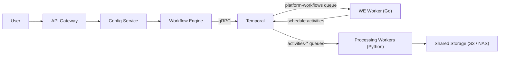
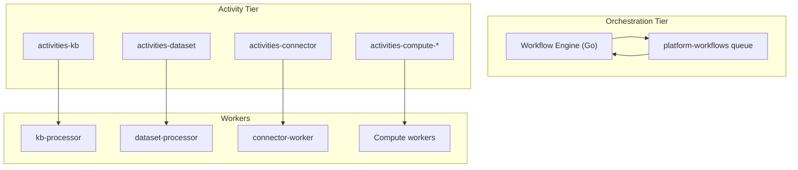
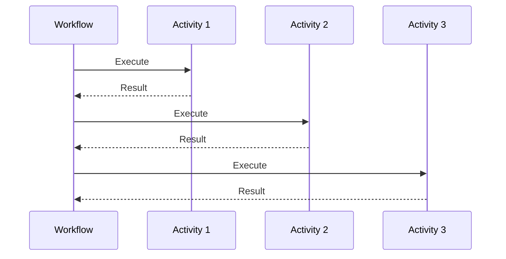
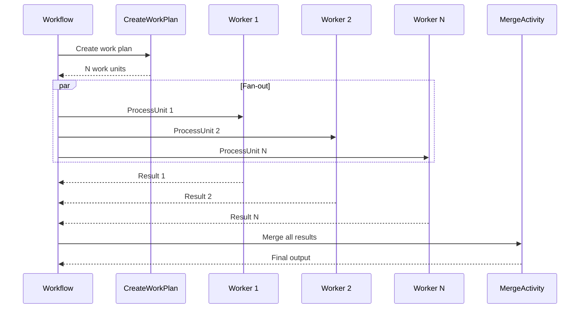
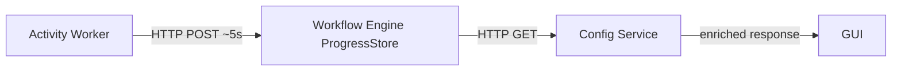
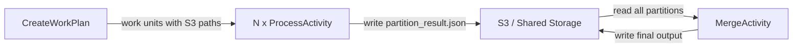
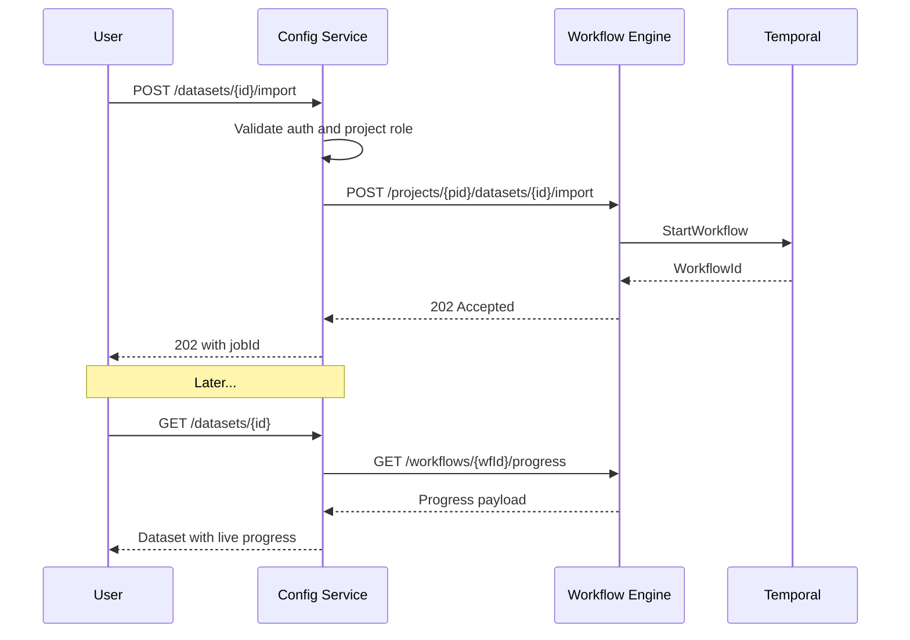
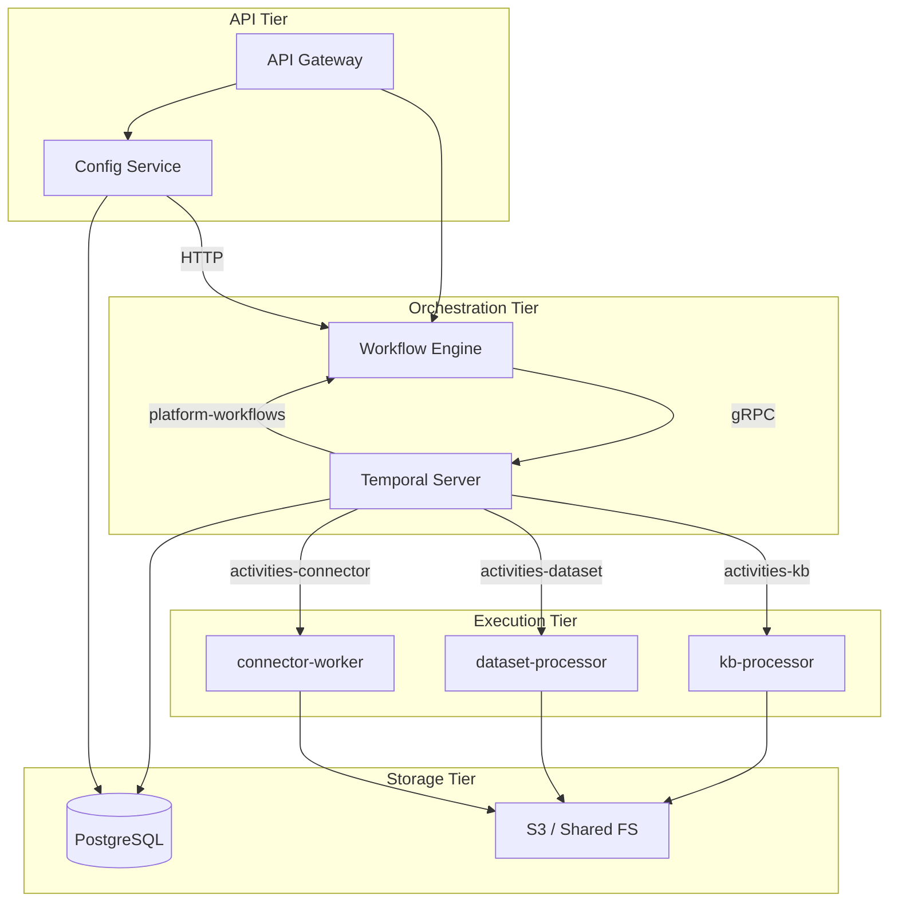
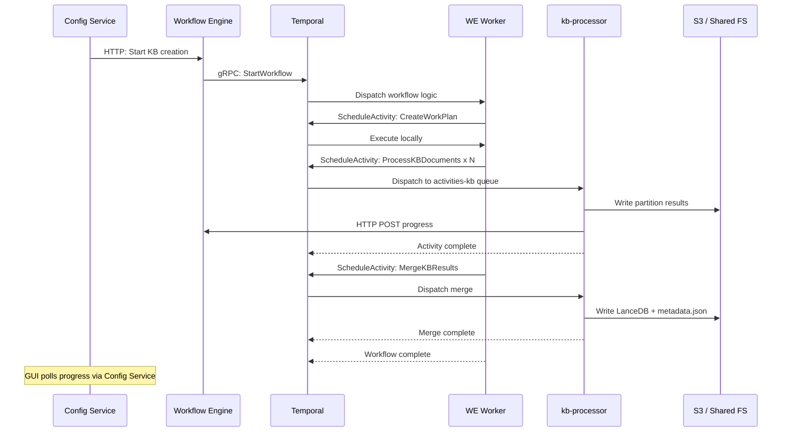

# Workflow design

Workflows use the Workflow Engine, [Temporal](https://docs.temporal.io/), workers, and shared storage as described in [Platform HLD](platform-hld.md). This doc describes the workflow subsystem end-to-end: execution model, task queues, patterns, durability, health and progress reporting, retry, continuation, permissions, the Workflow API service, worker architecture, and scaling.

## Doc map

- **Overview and role** — What workflows are and the use-case spectrum.
- **Execution model** — Temporal, task queues, workflow patterns.
- **Long-running vs short-running** — Timeout profiles per workflow.
- **Isolation** — Queue, pod, concurrency, and project-level boundaries.
- **Retry mechanisms** — Activity retries, partial failure tolerance, non-retryable errors.
- **Health, liveness, and progress** — Heartbeats, Kubernetes probes, progress tracking.
- **Durable execution** — Temporal guarantees, inter-activity data flow, idempotency.
- **Continuation from failure** — How the system resumes after crashes or activity errors.
- **Permissions and auth** — JWT, service accounts, credential isolation.
- **Workflow API service** — REST API for launching, monitoring, and controlling workflows.
- **Services architecture** — How services compose into the workflow system.
- **Worker scaling** — Deployment model, HPA, resource profiles.
- **Observability** — Metrics, logging, alerting.

## When to read what

- **Understanding the big picture?** — Section 1 (Overview) and Section 2 (Execution Model).
- **Launching or monitoring workflows?** — Section 10 (Workflow API Service).
- **Debugging a stuck or failed workflow?** — Section 3 (Long vs Short Running), Section 6 (Health and Liveness), Section 8 (Continuation from Failure).
- **Designing a new workflow type?** — Section 2.3 (Patterns), Section 5 (Retry), Section 7 (Durable Execution).
- **Scaling or operating workers?** — Section 12 (Worker Scaling), Section 6.2 (Pod Health), Section 13 (Observability).

---

## Part A — Overview

### 1. Overview and big picture

A **workflow** is any user- or system-initiated operation that spans multiple steps, may run for seconds to hours, and must survive infrastructure failures. The platform uses [Temporal](https://docs.temporal.io/) as its workflow orchestration engine and exposes a REST API (the Workflow Engine) for launching, monitoring, and controlling workflows.

| Category | Examples | Duration | Pattern |
|----------|----------|----------|---------|
| Interactive / exploratory | Connector test, explorer list | seconds | Single activity |
| Medium ingest | Dataset import (small), connector acquisition | minutes | Sequential + child workflow |
| Heavy processing | KB creation (large), dataset import (large) | hours | Scatter-gather |
| DAG orchestration | Pipeline execution | minutes-hours | Topological DAG |
| Lifecycle management | Project init/delete, dataset delete, KB delete | seconds-minutes | Sequential |
| Scheduled | Connector acquisition schedules, MCP health | periodic | Temporal Schedule |

---

## Part B — Execution model

### 2. Execution model

#### 2.1 Temporal as the core orchestrator

All workflows run as Temporal workflows started by the Workflow Engine (Go service). Workflows are deterministic replay-safe functions; all side effects are encapsulated in activities. The Workflow Engine hosts both a Temporal **client** (starts workflows) and an embedded Temporal **worker** (executes workflow logic). Python workers execute activities on dedicated task queues.

Key code: [executor.go](src/nemo/workflow-engine/internal/services/executor.go) starts workflows; [workflow_worker.go](src/nemo/workflow-engine/internal/workers/workflow_worker.go) registers them.

#### 2.2 Task queue architecture

| Purpose | Current name | Recommended name | Polled by |
|---------|-------------|-----------------|-----------|
| Orchestration (workflow logic) | `pipeline-execution` | `platform-workflows` | Workflow Engine (Go) |
| KB activities | `kb-processing` | `activities-kb` | kb-processor (Python) |
| Dataset activities | `dataset-processing` | `activities-dataset` | dataset-processor (Python) |
| Connector activities | `connector-operations` | `activities-connector` | connector-worker (Python) |
| Pipeline step execution | deployment-specific | `activities-compute-{clusterId}` | Compute cluster workers |

The recommended naming convention is `platform-workflows` for the single orchestration queue and `activities-{domain}` for activity queues. This makes the role clear from the name and groups them naturally in the Temporal UI.

#### 2.3 Workflow patterns

**Sequential** — Activities run one after another. Used by `ProjectInitWorkflow`, `ProjectDeleteWorkflow`, `DatasetDeleteWorkflow`, `KnowledgeBaseDeleteWorkflow`. See [project_init.go](src/nemo/workflow-engine/internal/workflows/project_init.go), [project_delete.go](src/nemo/workflow-engine/internal/workflows/project_delete.go).

**Scatter-Gather** — Fan-out N activities in parallel, gather results via a selector, then run an optional merge activity. Used by `DatasetImportWorkflow` and `KnowledgeBaseCreationWorkflow`. See [scatter_gather.go](src/nemo/workflow-engine/internal/workflows/scatter_gather.go).

**DAG (topological)** — Steps run in topological order; each node executes when all predecessors complete. Used by `PipelineWorkflow`. Steps are dispatched to deployment-specific compute queues. See [pipeline.go](src/nemo/workflow-engine/internal/workflows/pipeline.go).

**Child Workflow** — A workflow spawns another workflow as a child with its own execution history. `DataAcquisitionWorkflow` spawns `DatasetImportWorkflow` as a child. See [data_acquisition.go](src/nemo/workflow-engine/internal/workflows/data_acquisition.go).

**Single Activity** — One-shot workflows that execute a single activity and return. Used by `ConnectorInteractiveWorkflow`, `ExplorerListWorkflow`, `MCPHealthCheckWorkflow`.

**Long-lived + Update Handler** — `ExplorerSessionWorkflow` uses `workflow.SetUpdateHandler` to accept interactive list requests during a 30-minute idle window. See [explorer_session.go](src/nemo/workflow-engine/internal/workflows/explorer_session.go).

**Scheduled** — Temporal Schedule API for recurring executions: connector acquisition schedules and MCP health checks.

---

### 3. Long-running vs short-running workflows

Every workflow and its activities have explicit timeout configurations set in Go workflow code. The table below summarizes them by duration tier:

**Short-running** (seconds to minutes):

| Workflow | STC | Heartbeat | STS | Max Attempts |
|----------|-----|-----------|-----|--------------|
| ConnectorInteractiveWorkflow | 60s | — | — | 1 |
| ExplorerListWorkflow | 2m | 45s | — | 2 |
| MCPHealthCheckWorkflow | 3m | 30s | — | 2 |

**Medium** (minutes):

| Workflow | STC | Heartbeat | STS | Max Attempts |
|----------|-----|-----------|-----|--------------|
| ProjectInitWorkflow | 10m | — | — | 3 |
| ProjectDeleteWorkflow | 10m | — | — | 3 |
| DatasetDeleteWorkflow | 10m | — | — | 3 |
| DataAcquisitionWorkflow (connector) | 30m | 5m | — | 2 |

**Long-running** (hours):

| Workflow | STC | Heartbeat | STS | Workflow Run | Max Attempts |
|----------|-----|-----------|-----|-------------|--------------|
| DatasetImportWorkflow (scatter) | 6h | 5m | 15m | — | 3 |
| DatasetImportWorkflow (merge) | 2h | — | — | — | 2 |
| KBCreationWorkflow (scatter) | 6h | 5m | — | 13h | 3 |
| KBCreationWorkflow (merge) | 2h | — | — | — | 2 |
| KBCreationWorkflow (single-unit) | 12h | 5m | — | 13h | 3 |
| ReprocessDatasetPii | 6h | — | — | — | 2 |

**STC** = StartToCloseTimeout; **STS** = ScheduleToStartTimeout.

**Timeout selection rationale**: `StartToCloseTimeout` should be the pessimistic upper bound for the largest expected input. `HeartbeatTimeout` should be short enough to detect failures promptly but long enough to tolerate brief I/O stalls. `ScheduleToStartTimeout` guards against insufficient worker capacity — if an activity waits in queue longer than this, it fails, surfacing a scaling problem.

For how heartbeats and liveness work in practice, see Section 6.1. For how long-running activities handle continuation after failure, see Section 8.

---

### 3.5 Graceful shutdown (three-layer defense)

Volume mount changes (via `VolumeMountSet` CRs) trigger rolling restarts of worker Deployments. Without graceful shutdown, in-flight activities are killed, losing progress. Three coordinated layers ensure safe rollouts:

**Layer 1 — Deployment rolling update strategy (Helm)**

All worker deployment templates set `maxUnavailable: 0`, `maxSurge: 1`. This ensures at least the full replica count is always running during a rollout. A new pod must pass readiness before an old pod is terminated.

**Layer 2 — Temporal graceful shutdown (Python workers)**

All three Python workers (`connector-worker`, `dataset-processor`, `kb-processor`) pass `graceful_shutdown_timeout` to the Temporal `Worker` constructor, configurable via `TEMPORAL_GRACEFUL_SHUTDOWN_TIMEOUT` env var (default 90s). On SIGTERM, the Temporal SDK stops polling for new tasks and waits for in-flight activities to complete (up to the timeout). Activities that exceed the timeout are cancelled and will be retried by Temporal per the `RetryPolicy`.

The workflow-engine (Go) has its own 120-second shutdown timeout for HTTP and Temporal worker (see `cmd/server/main.go`).

**Layer 3 — Kubernetes `terminationGracePeriodSeconds`**

All worker pods set `terminationGracePeriodSeconds: 120` (configurable via `values.yaml`). This is longer than the 90-second Temporal shutdown timeout, giving the SDK time to drain before the kubelet sends SIGKILL.

| Layer | Component | Value | Purpose |
|-------|-----------|-------|---------|
| 1 | Helm `maxUnavailable` | 0 | No capacity drop during rollout |
| 2 | Temporal `graceful_shutdown_timeout` | 90s | Drain in-flight activities |
| 3 | K8s `terminationGracePeriodSeconds` | 120s | Wait for drain before SIGKILL |

**Deployment order**: Graceful shutdown must be deployed **before** any `VolumeMountSet` usage, otherwise volume registration triggers restarts that kill activities without draining.

### 3.6 Worker restart and activity takeover

When a worker pod restarts (e.g. during a rolling update), the new pod has a different identity. Temporal does not pin activity tasks to a specific worker — any worker polling the same task queue can receive any task.

However, activities already delivered to the old worker are not immediately available to the new one. The Temporal server detects the loss via heartbeat timeout. After `HeartbeatTimeout` elapses with no heartbeats, the activity attempt fails and is retried per the workflow's `RetryPolicy`. The retry is a new task dispatched to the queue, which the new worker picks up on its next poll.

This means there can be a delay of up to `HeartbeatTimeout` (e.g. 5 minutes for KB/dataset activities) before a restarted worker picks up retried work. Activities with `MaximumAttempts: 1` will not retry on worker death — the workflow fails permanently. This is why processing activities use `MaximumAttempts: 3` (Section 5.1).

Tasks that were never dispatched (sitting in the queue) are picked up immediately when a new worker polls. If **no** worker is polling (e.g. all pods are down), tasks remain queued until a worker appears, subject to `ScheduleToStartTimeout` (Section 12.5).

---

### 4. Isolation

- **Queue-level isolation**: Each worker type has its own task queue; a misbehaving KB worker cannot starve connector operations.
- **Pod-level isolation**: Workers are separate Kubernetes Deployments (`workers-dataset`, `workers-kb`, `workers-connector`) with independent resource limits and scaling policies.
- **Concurrency control**: `MAX_CONCURRENT_ACTIVITIES` per pod (default 2) caps parallel work within a single worker pod.
- **Workflow ID uniqueness**: Deterministic IDs (e.g. `dataset-import-{projectId}-{datasetId}`) prevent duplicate concurrent workflows for the same entity. `WorkflowExecutionErrorWhenAlreadyStarted` is set for KB creation and PII reprocess.
- **Project context**: Credentials and S3 paths are scoped per project; workers resolve credentials at activity time from config-service. Secrets never flow through Temporal payloads.

---

### 5. Retry mechanisms

#### 5.1 Activity-level retries (Temporal)

All retry policies are configured in Go workflow code, not in Python workers. The workflow defines timeout, heartbeat, and retry parameters; the worker simply executes the activity logic.

Default scatter-gather retry policy (from [scatter_gather.go](src/nemo/workflow-engine/internal/workflows/scatter_gather.go)):

| Parameter | Value |
|-----------|-------|
| InitialInterval | 10s |
| BackoffCoefficient | 2.0 |
| MaximumInterval | 5m |
| MaximumAttempts | 3 |

Per-workflow overrides:

| Context | Max Attempts | Notes |
|---------|-------------|-------|
| Connector acquisition | 2 | Short retry for external systems |
| KB merge | 2 | Merge is expensive; limit retries |
| Dataset merge | 2 | Same rationale |
| Connector test | 1 | Fail fast; user re-triggers |
| Explorer action | 2 | Interactive, short-lived |

`WaitForCancellation: true` on process activities ensures workers can clean up resources before Temporal forcefully terminates.

#### 5.2 Partial failure tolerance (scatter-gather)

`ScatterGatherConfig.MaxFailureRate` (default 0.1 from `MAX_FAILURE_RATE` env) allows up to 10% of work units to fail before the entire workflow fails. Failed units are recorded in `ScatterGatherResult` with error details. The merge activity runs only if the failure rate is acceptable.

#### 5.3 Workflow-level retry

No automatic workflow-level retry by default; users can re-trigger via the API. `WorkflowExecutionErrorWhenAlreadyStarted: true` on KB creation and PII reprocess prevents accidental double-starts.

#### 5.4 Non-retryable failures

Errors that indicate permanent failure should be wrapped as `temporal.NewNonRetryableApplicationError` so Temporal does not retry them:

| Category | Examples |
|----------|---------|
| Non-retryable | Invalid input, permanent auth failure, unsupported format, missing required config |
| Retryable (default) | Network timeout, S3 throttle, transient DB error, Temporal connection drop |

---

## Part C — Health, liveness, and progress

### 6. Health, liveness, and progress reporting

This section covers two distinct but related concerns: **worker/activity health** (is the work still alive?) and **progress** (how far along is the work?).

#### 6.1 Activity heartbeats (liveness)

Temporal heartbeats are the primary mechanism for detecting whether a long-running activity is still alive or has become stuck.

**How it works**: Each activity has a `HeartbeatTimeout` configured in the workflow definition. The worker must call `activity.heartbeat()` at intervals shorter than this timeout. If the heartbeat is missed, Temporal considers the activity failed and schedules a retry (per the retry policy).

**Current heartbeat timeouts**: 5m for dataset/KB processing, 5m for connector acquisition, 45s for explorer actions, 30s for MCP health checks.

**What workers heartbeat on**:

| Worker | Heartbeat trigger |
|--------|------------------|
| kb-processor | Per-file in document processing loop, per-batch during embedding |
| dataset-processor | Per-file in processing loop, per-batch during analysis |
| connector-worker | Per-page during DB query or object-store listing |

**Known limitation**: During KB merge, the LanceDB writer consumes a generator on a separate thread. Heartbeats cannot be issued inside that generator; they are sent before and after the merge phase only. This is a risk area for very large merges where the merge itself exceeds the heartbeat timeout.

**Cancellation detection**: Workers check `activity.is_cancelled()` during heartbeat calls. `WaitForCancellation: true` on activity options gives workers time to clean up (e.g. flush partial results to S3) before Temporal forcefully terminates.

#### 6.2 Worker pod health (Kubernetes)

- **Liveness probes**: Each worker pod should expose a health endpoint (or rely on the Temporal SDK's built-in health) so Kubernetes can restart hung pods.
- **Readiness probes**: Workers should only become ready after model warm-up completes (embedding model for KB processor, PII models for dataset processor). Warm-up currently runs at startup before the Temporal worker loop begins; Kubernetes should not route heartbeat or activity traffic until warm-up is done.
- **Temporal connection health**: Init containers wait for Temporal availability (`nc -z temporal 7233`). If the connection drops at runtime, the Temporal SDK reconnects automatically.
- **Gaps**: Worker Dockerfiles do not currently define explicit liveness or readiness probes. Recommended: add HTTP or exec probes tied to warm-up status and Temporal SDK health.

#### 6.3 Progress tracking architecture

Progress tracking is a **best-effort, non-blocking** reporting channel distinct from heartbeats. Heartbeats tell Temporal "I am alive"; progress tells users "I am 60% done."

#### 6.4 ProgressStore (in-memory)

The ProgressStore is an in-memory, thread-safe map keyed by workflow ID with a 1-hour TTL and 60-minute cleanup sweep. See [progress_store.go](src/nemo/workflow-engine/internal/services/progress_store.go).

**Supported fields**: phase, percentage, message, current/total, elapsed/ETA, and an `Extra` map for domain-specific counters (e.g. `chunksCreated`, `vectorsCreated`).

**Per-unit tracking**: Supports up to 200 units (capped by recency) for scatter-gather workflows. Each unit has `unitId`, `status` (pending | running | completed | failed), and `metrics`.

**Merge semantics**: Job-level updates merge `Extra` numeric counters by max (so progress never decreases when multiple activities post for the same workflow). Unit-scoped updates upsert a unit and recompute job-level aggregates by summing completed-unit counters.

#### 6.5 Worker-side progress reporting

- Python workers POST to `/api/v1/workflows/{workflowId}/progress` with approximately 5-second throttle.
- The progress endpoint bypasses auth middleware (internal-only path, not exposed outside the cluster).
- Failures are logged at debug level and ignored (best-effort, non-blocking).
- Separate from heartbeats: a worker can heartbeat successfully (proving liveness) while progress reporting fails — the workflow continues.

#### 6.6 Config-service enrichment

Config-service enriches entity responses (datasets, KBs) by calling the workflow-engine progress API. The `fetchLiveProgress` pattern in [dataSetRoutes.ts](src/nemo/config-service/routes/dataSetRoutes.ts) and [knowledgeBaseRoutes.ts](src/nemo/config-service/routes/knowledgeBaseRoutes.ts) fetches live progress and merges it into the entity response so the GUI shows real-time status.

#### 6.7 Limitations and future work

- **In-memory store**: ProgressStore is lost on workflow-engine restart. Consider a Redis-backed store for HA deployments.
- **No persistent progress history**: After workflow completion, progress is only available via Temporal history (event-level, not percentage-level).
- **No worker pool health dashboard**: Temporal UI shows queue depth but not per-worker health. A dedicated dashboard aggregating worker status across all queues would improve operational visibility.

---

## Part D — Durability and failure handling

### 7. Durable execution

#### 7.1 Temporal durability guarantees

Workflow state is durably persisted in PostgreSQL (`temporal` and `temporal_visibility` databases). If the workflow-engine process crashes, Temporal replays the workflow from its event history — no user data is lost. Completed activities are not re-executed; their results are replayed from history.

#### 7.2 Inter-activity data flow

Activities do not pass large payloads through Temporal. Instead, upstream activities write results to deterministic S3 paths (e.g. `partition_result.json`, processed files), and downstream activities read from those paths. Temporal payloads carry only small metadata: file lists, paths, and configuration.

The scatter-gather pattern uses `CreateWorkPlanActivity` (Python on dataset-processing and kb-processing queues) to produce a plan: it computes `K_eff` non-empty shards from total file bytes (`WORK_UNIT_MAX_MB`, `MAX_WORK_UNITS` as a floor, `SCATTER_MAX_UNITS_CEILING` default **2000** as a hard cap), assigns every file into those shards (spread-largest-first, then shuffled round-robin), and writes one manifest per shard. **Per-shard byte/file caps are not applied** after `K_eff` is chosen. Each unit writes its result to a known prefix; the merge activity reads all of them. This keeps Temporal history small and avoids payload size limits.

**FileListKey optimization**: Acquisition workflows (`DataAcquisitionWorkflow`) pass a pre-built handoff key as `FileListKey` — streaming object store uses `FinalizeAcquisition` → `filelist.json` under `projects/<pid>/datasets/<id>/_acquisition/`; volume streaming uses `FinalizeRegistration` → `manifest.json` (parquet-partitioned) under the same `_acquisition/` prefix. When `FileListKey` is empty (e.g. retry import), `CreateWorkPlanActivity` probes `_acquisition/filelist.json` then `_acquisition/manifest.json`, then lists `data_files/`. KB / manual flows still rely on directory listing when no acquisition artifacts exist. See [connectors.md](connectors.md) §FileListKey and [datasets.md](datasets.md) §Acquired datasets.

#### 7.3 Idempotency

- Activities that write to S3 use deterministic paths; re-execution overwrites the same keys safely.
- `WorkflowExecutionErrorWhenAlreadyStarted` prevents accidental duplicate workflow starts for the same entity.
- Deterministic workflow IDs (e.g. `dataset-import-{projectId}-{datasetId}`) ensure that re-triggering the same operation resolves to the same workflow.

#### 7.4 Blue-green writes (KB)

KB creation writes embeddings and LanceDB tables to a new S3 prefix (e.g. `lancedb-{YYYYMMDD-HHMMSS}/`) and atomically updates `metadata.json` to point at the new path. Partial writes never corrupt the live KB; retrieval follows the pointer in `metadata.json`. See [knowledge-base.md](knowledge-base.md) for full file convention details.

#### 7.5 Child workflow durability

`DataAcquisitionWorkflow` spawns `DatasetImportWorkflow` as a child with its own execution history and deterministic ID (`import-{projectId}-{datasetId}`). Parent and child survive independently: if the parent crashes, the child continues; if the child fails, the parent observes the failure and can respond.

---

### 8. Continuation from point of failure

- **Activity retry = continuation**: When an activity fails and Temporal retries it, the workflow resumes from exactly that activity. Previously completed activities are not re-executed; their results are replayed from Temporal history.

- **Scatter-gather partial completion**: If 80 out of 100 units complete and 20 fail, only the 20 are marked as failed. The merge activity sees results from all 80 successful units. Currently there is no automatic re-scatter of just the failed units (potential future enhancement).

- **Workflow re-trigger**: For KB creation and dataset import, re-triggering via the API starts a fresh workflow. The `jobId` on the entity is updated; the old workflow (if any) should be cancelled first.

- **No checkpoint/resume within a single activity**: If a 6-hour `ProcessKBDocuments` activity fails at 90%, it restarts from scratch on retry. This is a known limitation. A potential improvement is checkpointing processed file offsets to S3 so retries can resume from the last checkpoint.

- **Continue-As-New**: For workflows that run indefinitely or accumulate very large event histories (e.g. `ExplorerSessionWorkflow` with many interactive updates, or future long-lived scheduled workflows), Temporal's `ContinueAsNew` pattern should be used to start a fresh execution with carried-over state, preventing unbounded history growth. Explorer sessions should adopt this pattern when the event count approaches Temporal's recommended limit (~10K events).

---

### 9. Permissions and auth

- **User-facing APIs**: Keycloak JWT (Bearer token) validated by config-service and workflow-engine auth middleware.
- **Workflow triggers**: Users must have project-level access; config-service enforces project role before calling the workflow-engine.
- **Service-to-service**: `ServiceAccountClient` (Node, [ServiceAccountClient.ts](src/common/src/auth/ServiceAccountClient.ts)) and the Go `ConfigClient` ([config.go](src/nemo/workflow-engine/internal/clients/config.go)) use Keycloak client-credentials grants for backend calls.
- **Progress endpoint**: Auth bypass for internal activity progress reporting (only exposed within the cluster network; not reachable from outside).
- **Credential isolation**: Workers resolve connector credentials at activity time via config-service (`POST .../credentials/{id}/secret-data`); secrets never flow through Temporal payloads or workflow state.
- **Temporal namespace**: Single `default` namespace; all workflows share it. Multi-tenant namespace isolation is a potential future enhancement for stricter separation.

---

## Part E — API and services

### 10. Workflow API service

The Workflow Engine is the single API surface through which all workflow types are launched, monitored, and controlled. Config Service and GUI never talk to Temporal directly.

#### 10.1 Role

The Workflow Engine exposes a REST API (Go/Gin, under `/api/v1`) that abstracts Temporal internals and provides a uniform interface for all workflow types. It is deployed as a single service that hosts both the HTTP server and the embedded Temporal workflow worker.

#### 10.2 Workflow lifecycle operations

**Launch (start a workflow)**

| Endpoint | Workflow | Notes |
|----------|---------|-------|
| `POST /projects/{projectId}/pipelines/{pipelineId}/executions` | PipelineWorkflow | Fetches pipeline def from config-service |
| `POST /projects/{projectId}/init` | ProjectInitWorkflow | |
| `POST /projects/{projectId}/delete` | ProjectDeleteWorkflow | |
| `POST /projects/{projectId}/datasets/{datasetId}/import` | DatasetImportWorkflow | |
| `POST /projects/{projectId}/datasets/{datasetId}/delete` | DatasetDeleteWorkflow | |
| `POST /projects/{projectId}/knowledgebases/{kbId}/create` | KBCreationWorkflow | Rejects if already running |
| `POST /projects/{projectId}/knowledgebases/{kbId}/delete` | KBDeleteWorkflow | |
| `POST /connectors/test` | ConnectorInteractiveWorkflow | Synchronous: blocks until result |
| `POST /connectors/acquire` | DataAcquisitionWorkflow | |
| `POST /connectors/schedule` | Temporal Schedule | CRUD for recurring acquisitions |
| `POST /connectors/explorer/session` | ExplorerSessionWorkflow | Long-lived interactive |
| `POST /connectors/explorer/list` | ExplorerListWorkflow or Update | Uses Update on existing session |

**Monitor (check status and progress)**

| Endpoint | Purpose |
|----------|---------|
| `GET /workflows/{workflowId}/status` | Workflow type, task queue, status (running / completed / failed / cancelled), duration, history length, failure message |
| `GET /workflows/{workflowId}/result` | Workflow output; returns 409 if still running |
| `GET /workflows/{workflowId}/logs` | Full Temporal history as structured log entries; supports `search`, `tail`, `since` query parameters |
| `GET /workflows/{workflowId}/progress` | Live progress from in-memory ProgressStore (phase, percentage, per-unit breakdown) |

**Control (cancel, cleanup)**

| Endpoint | Purpose |
|----------|---------|
| `POST /workflows/{workflowId}/cancel` | Cancels via Temporal; idempotent (already-completed returns 200) |
| `POST /pipelines/{pipelineId}/executions/{executionId}/cancel` | Pipeline-specific cancel that also updates execution history in config-service |
| `DELETE /workflows/{workflowId}/progress` | Clears progress entry from ProgressStore |

**Internal (worker-to-engine)**

| Endpoint | Purpose |
|----------|---------|
| `POST /workflows/{workflowId}/progress` | Workers post progress updates; auth-exempt, cluster-internal only |

See [server.go](src/nemo/workflow-engine/internal/server/server.go) for route registration and [workflow_status.go](src/nemo/workflow-engine/internal/server/routes/workflow_status.go) for status/logs/result handlers.

#### 10.3 Workflow ID conventions

Deterministic IDs prevent duplicate workflows and enable status lookups without storing workflow IDs separately:

| Pattern | Workflow |
|---------|---------|
| `pipeline-{pipelineId}-{executionId}` | PipelineWorkflow |
| `project-init-{projectId}` | ProjectInitWorkflow |
| `project-delete-{projectId}` | ProjectDeleteWorkflow |
| `dataset-import-{projectId}-{datasetId}` | DatasetImportWorkflow |
| `dataset-delete-{projectId}-{datasetId}` | DatasetDeleteWorkflow |
| `facet-knowledge_base-{kbId}-embedding` | KBCreationWorkflow |
| `data-acquisition-{projectId}-{datasetId}` | DataAcquisitionWorkflow |
| `import-{projectId}-{datasetId}` | DatasetImportWorkflow (child) |

The `deriveCategory` function in [workflow_status.go](src/nemo/workflow-engine/internal/server/routes/workflow_status.go) maps workflow ID prefixes to human-readable categories (e.g. `"kb-creation"`, `"dataset-import"`) for the status API's `workflowCategory` field.

#### 10.4 Config-service as proxy

Config-service acts as a **domain-aware proxy** for workflow operations: it enforces auth and project permissions, enriches responses with entity metadata (e.g. dataset name, KB status), and calls the workflow-engine API internally. Users interact with config-service endpoints; they never call the workflow-engine directly.

---

### 11. Services architecture

This section describes the physical services and how they compose into the workflow system. For the API contract see Section 10.

#### 11.1 Component diagram

#### 11.2 Service roles

- **Config Service** (Node/Express/TypeORM): Domain entity CRUD, auth enforcement, workflow trigger proxy (Section 10.4), progress enrichment, credential vault. Stores entity metadata and `jobId` references in PostgreSQL.
- **Workflow Engine** (Go/Gin): Hosts both the Temporal client (starts workflows) and an embedded Temporal worker (executes workflow logic on the `platform-workflows` queue). Also serves the HTTP API (Section 10) and the in-memory ProgressStore.
- **Temporal Server** (in-cluster, PostgreSQL-backed): Durable workflow state, task queue dispatch, retry scheduling, visibility/search. Deployed via the `temporal` Helm subchart with `temporal` and `temporal_visibility` databases.

#### 11.3 Processing workers

Each worker is a standalone Python process that connects to Temporal and polls a single activity queue. Workers have no HTTP API — they are pure Temporal activity executors.

| Worker | Queue (recommended) | Responsibilities | Key dependencies |
|--------|-------------------|-----------------|-----------------|
| `kb-processor` | `activities-kb` | Document extraction, chunking, embedding, LanceDB write/merge | Embedding model, S3, config-service |
| `dataset-processor` | `activities-dataset` | File analysis, PII detection, Iceberg write, merge | PII models (Presidio/GLiNER), S3, Lakekeeper |
| `connector-worker` | `activities-connector` | DB/object-store/cloud connectivity tests, data acquisition, explorer actions | Source system drivers, S3, config-service |

Key code: [kb-processor/temporal_worker.py](src/nemo/workers/kb-processor/temporal_worker.py), [dataset-processor/temporal_worker.py](src/nemo/workers/dataset-processor/temporal_worker.py), [connector-worker/temporal_worker.py](src/nemo/workers/connector-worker/temporal_worker.py).

#### 11.4 Communication patterns

---

## Part F — Scaling and observability

### 12. Worker scaling design

#### 12.1 Deployment model

Each worker type is a separate Kubernetes Deployment under the workers tier chart (`deployments/helm/workers/`). All three deployments share the same chart but have independent replicas, resources, and scaling configs.

- Init container waits for Temporal availability (`nc -z temporal 7233`) before starting the worker process.
- `MAX_CONCURRENT_ACTIVITIES` (env, default 2) controls per-pod parallelism via `ThreadPoolExecutor` and Temporal's `max_concurrent_activities`.
- **Effective concurrency** = `replicas × MAX_CONCURRENT_ACTIVITIES`. The default (1 × 2 = 2) is conservative; see Section 12.6 for tuning guidance.

#### 12.2 Horizontal Pod Autoscaling

HPA templates exist for all three worker types:

| Worker | HPA Template | Custom Metric |
|--------|-------------|---------------|
| KB | [kb-worker/templates/hpa.yaml](deployments/helm/workers/charts/kb-worker/templates/hpa.yaml) | `temporal_queue_backlog_kb` |
| Dataset | [dataset-worker/templates/hpa.yaml](deployments/helm/workers/charts/dataset-worker/templates/hpa.yaml) | `temporal_queue_backlog_dataset` |
| Connector | [connector-worker/templates/hpa.yaml](deployments/helm/workers/charts/connector-worker/templates/hpa.yaml) | — |

- **CPU-based scaling**: Standard `targetCPUUtilizationPercentage`.
- **Custom metrics (optional)**: Backlog-based metrics (e.g. `temporal_queue_backlog_kb`) require a Prometheus adapter exporting Temporal queue depth metrics.
- Currently only KB worker HPA is enabled by default in the umbrella values.

#### 12.3 Resource profiles

| Worker | CPU Request | CPU Limit | Memory Request | Memory Limit | Rationale |
|--------|-----------|---------|--------------|------------|-----------|
| kb-processor | 2 | 4 | 3Gi | 4Gi | Embedding model inference is CPU/memory intensive |
| dataset-processor | 1 | 2 | 2Gi | 4Gi | PII model inference is moderate |
| connector-worker | 500m | 1 | 512Mi | 1Gi | I/O-bound, lightweight compute |

#### 12.4 Warm-up

- Dataset processor pre-loads PII models (Presidio, GLiNER, OCR, CLIP) at startup before starting the Temporal worker loop.
- KB processor pre-loads the embedding model at startup.
- Cold start penalty is amortized over the pod's lifetime. Readiness probes should gate traffic until warm-up completes.

#### 12.5 Scaling considerations

- `ScheduleToStartTimeout` (15m for dataset import) acts as a backpressure signal — if activities wait in queue longer than this, they fail with a timeout error, surfacing a scaling problem to operators.
- **Temporal-native scaling**: The `temporal_worker_task_slots_available` metric tracks how many activity slots are free across worker pods. When this drops to zero, all workers are saturated and new activities queue. This metric, combined with `schedule_to_start_latency`, provides the best signal for autoscaling decisions.
- **Scale-to-zero**: Workers can scale to zero replicas when no activities are queued. Activities dispatched while no workers are running will queue in Temporal until workers scale up (subject to `ScheduleToStartTimeout`).
- **Workflow Engine HPA**: Currently blocked by the in-memory ProgressStore — multiple replicas would have inconsistent progress state. Prerequisite: migrate to a shared backend (Redis), then add HPA for the workflow-engine Deployment.

#### 12.6 Performance tuning (scatter-gather parallelism)

Scatter-gather workflows dispatch N work units to the activity queue, but units execute only as fast as worker capacity allows. With `replicas: 1` and `MAX_CONCURRENT_ACTIVITIES: 2`, a 7-unit KB scatter runs in waves of 2, taking roughly 4× the single-unit duration rather than running all 7 in parallel.

**Single-unit vs scatter trade-off**: `KB_FILE_THRESHOLD` (default 25) and `DATASET_FILE_THRESHOLD` (default 20) control when scatter engages. For clusters with limited worker capacity, raising these thresholds avoids scatter overhead and runs more jobs as a single activity. Lower thresholds increase parallelism potential but only help when worker capacity is sufficient to run units concurrently.

**Extra I/O overhead**: The scatter path adds steps that a monolithic run avoids — `CreateWorkPlanActivity` lists files and writes per-unit manifests, each `Process*` activity reads its manifest from S3, and `Merge*` runs as a separate activity after all processing completes. This overhead is small for large jobs but noticeable for medium-sized ones (30–80 files).

| Tuning lever | Default | Effect |
|-------------|---------|--------|
| `replicas` | 1 | More pods = more parallel activity slots |
| `MAX_CONCURRENT_ACTIVITIES` | 2 | More slots per pod (needs more CPU/memory) |
| `KB_FILE_THRESHOLD` | 25 | Higher = fewer scatters, less overhead for small KBs |
| `DATASET_FILE_THRESHOLD` | 20 | Higher = fewer scatters, less overhead for small datasets |
| `MAX_WORK_UNITS` | 10 | Minimum shard count when sizing `K` from bytes |
| `SCATTER_MAX_UNITS_CEILING` | 2000 | Hard maximum shard count for `CreateWorkPlanActivity` |
| `WORK_UNIT_MAX_MB` | 5 | Target MiB per shard for **K sizing only** |
| `MAX_FILES_PER_UNIT` | 100 | Divisor for `K` when all manifest sizes are zero |
| `MIN_FILES_PER_UNIT` | 10 | Used for `K` only when `WORK_UNIT_MAX_MB=0` |

---

### 13. Observability

This section focuses on operational observability — how operators and SREs monitor the workflow system — as distinct from the user-facing API in Section 10.

#### 13.1 Temporal UI

Temporal UI is deployed alongside the Temporal server and provides workflow search, execution detail, event history, and queue depth visibility. It is accessible via subdomain routing through the API gateway.

#### 13.2 Metrics

- **Temporal server metrics**: Workflow start rate, activity schedule-to-start latency, task queue backlog depth, workflow failure rate. Exported to Prometheus via the kube-prometheus-stack (observability Helm chart).
- **Worker metrics**: `temporal_worker_task_slots_available`, activity execution duration, heartbeat failure rate. These are key inputs for HPA custom-metric scaling (Section 12.2).
- **Application metrics**: Workflow Engine and Config Service export HTTP request metrics (latency, error rate) for the workflow API surface.

#### 13.3 Logging

- Workers log to stdout (structured JSON recommended); aggregated by cluster-level log collection.
- Workflow Engine logs workflow start/complete/fail events with workflow ID, type, and duration.
- The workflow logs endpoint (`GET /workflows/{id}/logs`) exposes Temporal event history as structured log entries with search and filter capabilities.

#### 13.4 Alerting recommendations

| Alert | Signal | Indicates |
|-------|--------|-----------|
| High schedule-to-start latency | `schedule_to_start_latency` above threshold | Worker capacity insufficient |
| Elevated workflow failure rate | Failure rate by workflow type | Code bug, infrastructure issue, or bad input |
| ProgressStore memory growth | Memory metrics on workflow-engine pod | Potential leak if cleanup loop fails |
| Temporal server unhealthy | Frontend availability, persistence latency | Platform-wide workflow outage risk |
| Heartbeat timeout rate | Activity failure with heartbeat timeout cause | Worker pod hung or overloaded |

---

## References

- **Internal:** [Platform HLD](platform-hld.md), [knowledge-base.md](knowledge-base.md), [connectors.md](connectors.md), [datasets.md](datasets.md), [pipelines.md](pipelines.md), [agents.md](agents.md), [workspaces.md](workspaces.md), [temporal-python-workers.md](temporal-python-workers.md) (historical migration record). For long-form subsystem detail see [docs/HLD.md](../HLD.md).
- **External:** [Temporal](https://docs.temporal.io/), [Temporal retry policies](https://docs.temporal.io/retry-policies), [Temporal heartbeats](https://docs.temporal.io/activity-heartbeat), [Temporal Continue-As-New](https://docs.temporal.io/workflow-continue-as-new), [Kubernetes HPA](https://kubernetes.io/docs/tasks/run-application/horizontal-pod-autoscale/), [Kubernetes probes](https://kubernetes.io/docs/tasks/configure-pod-container/configure-liveness-readiness-startup-probes/), [Keycloak](https://www.keycloak.org/documentation).
