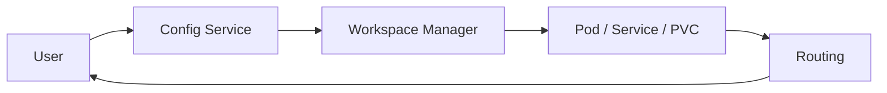

# Workspace design

Workspaces use Config Service, Storage, and the Workspace Manager (orchestration) as described in [Platform HLD](platform-hld.md). This doc describes workspace types, lifecycle, and routing.

## Doc map

- **Overview and role** — What workspaces are and how they are used.
- **Workspace entity and templates** — id, name, template, status, endpoint, resources.
- **Lifecycle** — Create → orchestrate → run → stop → delete.
- **Workspace Manager and routing** — K8s resources (Pod, Service, PVC), access (subdomain or path), proxy.
- **Implementation and routing** — Pointers to existing workspace design docs (CRD, proxy, subdomain).
- **References** — Internal and external links.

## When to read what

- **Implementing workspace orchestration?** → §Lifecycle, §Workspace Manager and routing, and [workspace-crd-design.md](../workspaces/workspace-crd-design.md).
- **Configuring access or proxy?** → §Workspace Manager and routing and the proxy/subdomain docs below.
- **Understanding templates or resources?** → §Workspace entity and templates and [docs/HLD.md](../HLD.md).

---

## Part A — Overview and role

### What workspaces are

A **workspace** is an isolated environment for analytics or development: for example [JupyterLab](https://jupyterlab.readthedocs.io/) or SQL Workbench. Each workspace has a **template** (which defines type and default image/resources), allocated resources (CPU, memory, storage), and an **endpoint** (URL for user access). The platform orchestrates [Kubernetes](https://kubernetes.io/docs/concepts/) resources (Pod, Service, PVC) via the Workspace Manager and routes traffic to the running pod so users can work in a dedicated environment tied to their project.

---

## Part B — Workspace entity and templates

- **Workspace:** id, name, projectId, templateId, status, endpoint, bucket name (or storage path), PVC name, resources (CPU, memory, storage limits). Status values: `new`, `creating`, `running`, `stopping`, `stopped`, `error`.
- **Templates** define the workspace type (e.g. JupyterLab, SQL Workbench) and default image/resources. The user selects a template when creating a workspace. See [docs/HLD.md](../HLD.md) Workspaces section for full characteristics.

---

## Part C — Lifecycle

1. **Create** — User creates workspace via GUI/API (specifies template, optional resources).
2. **Orchestrate** — Workspace Manager creates Kubernetes resources (Pod, Service, PVC).
3. **Initialization** — Workspace pod starts and initializes the environment.
4. **Running** — Status is `running`; endpoint is available; user accesses workspace via the URL.
5. **Stopping** — User stops workspace; resources are cleaned up; status moves to `stopped`.
6. **Deletion** — User deletes workspace; Workspace Manager deletes Kubernetes resources.

---

## Part D — Workspace Manager and routing

The **Workspace Manager** creates, updates, and deletes Kubernetes resources (Pod, Service, PVC) for each workspace. User access is via **routing**: subdomain-based (e.g. workspace-id.domain) or path-based, with an optional **workspace proxy** that forwards requests to the correct pod. Details (including cookie domain, local dev setup, implementation status) are in the docs linked below.

### Implementation and routing (existing docs)

The following docs cover implementation details; use them when working on workspace orchestration or access:

| Doc | Covers |
| --- | ------ |
| [workspace-crd-design.md](../workspaces/workspace-crd-design.md) | CRD and resource model for workspaces. |
| [JUPYTER_WORKSPACE_PROXY_DESIGN.md](../workspaces/JUPYTER_WORKSPACE_PROXY_DESIGN.md) | Proxy design for workspace access (e.g. Jupyter). |
| [WORKSPACE_SUBDOMAIN_ROUTING_DESIGN.md](../workspaces/WORKSPACE_SUBDOMAIN_ROUTING_DESIGN.md) | Subdomain-based routing for workspace URLs. |

Other related docs: [WORKSPACE_ID_FORMAT_DESIGN.md](../workspaces/WORKSPACE_ID_FORMAT_DESIGN.md), [WORKSPACE_SUBDOMAIN_ROUTING_DESIGN.md](../workspaces/WORKSPACE_SUBDOMAIN_ROUTING_DESIGN.md) (includes cookie handling), [JUPYTER_WORKSPACE_PROXY_DESIGN.md](../workspaces/JUPYTER_WORKSPACE_PROXY_DESIGN.md).

---

## Implementation notes

- **Config Service** — Workspace entity (create, read, update, delete).
- **Workspace Manager** — Kubernetes controller or service that provisions Pod, Service, PVC from workspace spec.
- **GUI** — Workspace list, create, start, stop, delete; endpoint link.
- **Gateway** — Routing and (if used) proxy to workspace pods.

---

## References

- **Internal:** [Platform HLD](platform-hld.md), [workspace-crd-design.md](../workspaces/workspace-crd-design.md), [JUPYTER_WORKSPACE_PROXY_DESIGN.md](../workspaces/JUPYTER_WORKSPACE_PROXY_DESIGN.md), [WORKSPACE_SUBDOMAIN_ROUTING_DESIGN.md](../workspaces/WORKSPACE_SUBDOMAIN_ROUTING_DESIGN.md), [docs/HLD.md](../HLD.md).
- **External:** [Kubernetes concepts](https://kubernetes.io/docs/concepts/) (Pod, PVC, Service), [JupyterLab](https://jupyterlab.readthedocs.io/).
