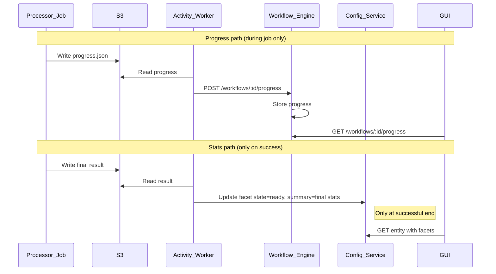

# Progress from workflow-engine, stats in config-service (facets)

## Two categories of info

| Category | Meaning | Source | Consumer |
|----------|---------|--------|----------|
| **Progress** | Job execution progress: phase, stage, percentage, ETA, current/total, message | **Workflow-engine** only (live, not persisted long-term) | GUI (and workflow logic for polling/timeouts) |
| **Stats** | Resulting counts/summaries: e.g. documentCount, chunkCount, filesWithPii, totalFiles | **Config-service** only (entity or facet) | GUI, APIs |

Progress is transient and job-scoped; stats are durable and entity/facet-scoped.

---

## Stats: only on successful job completion

**Intent**: In-progress stats must never be committed to config-service. Only **finalized, successful** results are written to facets (or entity).

- **When to write stats to a facet**: Only when the workflow/job has **completed successfully**. At that point the workflow (or processor) writes the facet with `state: "ready"` and `summary: { ... }` containing the final stats.
- **During the job**: Do **not** update facet.summary (or entity stats) with partial/in-progress counts. Progress (percentage, phase, current/total) is vended only by workflow-engine and is not persisted to config-service.
- **On failure**: Update the facet (or entity) with `state: "errored"` and `errorMessage` only. Do **not** write partial stats to summary; leave the previous successful summary unchanged if any, or leave summary empty.

This keeps config-service as the source of truth for **final** results only; all in-progress state lives in workflow-engine (progress store).

---

## 1. Workflow-engine: progress store and API

### 1.1 Progress store

- Add a **progress store** in the workflow-engine, keyed by **workflowId**.
- Store the latest progress payload per workflowId (in-memory or Redis for multi-replica).
- **TTL**: Clear or expire when workflow completes or after short retention.

### 1.2 Progress API

- **GET /api/v1/workflows/:workflowId/progress** — Returns latest progress (phase, percentage, message, current/total, elapsed, eta, extra). Used by GUI.
- **POST /api/v1/workflows/:workflowId/progress** — Called by activities to update the store. Activities get workflowId from activity context.

### 1.3 Who writes progress

- Activities that read progress (e.g. from S3) **post** it to workflow-engine; they do **not** write progress or in-progress stats to config-service. Only on **success** does the workflow write facet/entity stats to config-service.

---

## 2. Config-service: stats only on success

### 2.1 KB: stats in a facet (only at success)

- **Facet(kb, indexing)**: Create or update with `state: "ready"` and `summary: { documentCount, chunkCount, ... }` **only** in the workflow step that runs after the job has **succeeded** (e.g. after ReadProcessingResult and before returning). Do not update this facet during the polling loop; do not write partial counts to config-service at any time.
- **UpdateKBStatusWithStatsActivity**: Called once at successful completion. It should create/update the facet with final stats only. No other code path should write stats to this facet while the job is in progress.

### 2.2 Dataset and facet jobs

- **PII facet**: Write Facet(dataset, pii) with `state: "ready"` and `summary: { ... }` **only** when the PII job completes successfully (processor or workflow completion handler). Never push in-progress PII counts to config-service.
- **Entity lifecycle**: Same rule: any stats (e.g. row count, file count) are written to the entity or to a facet only when the import/workflow completes successfully.

### 2.3 Summary

- **Progress**: Workflow-engine only; never stored in config-service.
- **Stats (facet.summary or entity)**: Written to config-service **only at the successful end** of the workflow/job. In-progress stats are never committed.

---

## 3. KB refactor (concrete steps)

### 3.1 Workflow-engine

1. Add progress store and GET/POST `/api/v1/workflows/:workflowId/progress`.
2. **UpdateKBProgressActivity**: POST progress to workflow-engine only (no config-service progress write). Used during the polling loop; no stats written here.
3. **UpdateKBStatusWithStatsActivity**: Called **only once** at successful completion (Step 4). Creates/updates Facet(kb, indexing) with `state: "ready"` and `summary: stats`. This is the only place KB indexing stats are written to config-service.

### 3.2 Config-service

1. Facet model and API; allow updating facet only with state and (on success) summary.
2. Do not accept or persist partial/in-progress stats; facet summary is updated only when the caller sets state to ready and provides final summary.

### 3.3 GUI

- Progress while running: from workflow-engine GET progress only.
- Stats: from config-service entity/facets after job is complete (facet.state is ready).

---

## 4. Data flow (mermaid)

---

## 5. Summary table

| Item | When written | Where |
|------|--------------|--------|
| **Progress** | Continuously during job | Workflow-engine only (never config-service) |
| **Stats (facet.summary)** | **Only at successful end** of workflow/job | Config-service (facet or entity) |
| **In-progress counts** | Never committed to config-service | Shown only via workflow-engine progress API |

This ensures config-service holds only finalized, successful info; in-progress state is never committed there.
