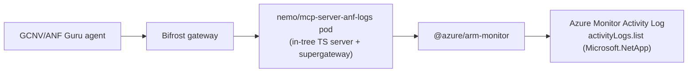

# ANF Logs / Errors / Events MCP Server — Design Document

## Executive Summary

This document describes a new **self-contained, in-tree MCP server** (`nemo/mcp-server-anf-logs`) that gives AgentStudio agents read-only access to Azure NetApp Files (ANF) **logs, errors, and events**. GCNV Guru agents — in particular the **Storage Optimization & Cost Governance agent** — need to read historical failures, issues, alerts, and lifecycle events for NetApp resources across clouds (a P0 data source: *"ANF, FSxN, GCNV Events / Logs / Errors → detected failures, historical events, issues, alerts"*).

It is the Azure counterpart of the existing [`mcp-server-gcnv-logs`](../../src/images/mcp-server-gcnv-logs) server, and realizes Future Work #1 of the [GCNV logs design](gcnv-logs-mcp-server-design.md): *"extend the same agent-facing pattern to Azure Monitor (ANF)."*

ANF exposes no dedicated log API. Logs, errors, and events are surfaced through the **Azure Monitor Activity Log** — control-plane operations, Resource Health, Service Health, and alerts — scoped to the NetApp resource provider (`Microsoft.NetApp`). The server is a small TypeScript MCP server built from source in this repository (the same in-tree pattern as `mcp-server-gcnv-logs`, `mcp-server-duckdb`, `mcp-server-analytics`, and `mcp-server-ontap`) and wrapped with supergateway for the managed MCP runtime. It exposes four tools that build the Activity Log `$filter` internally, so the agent never has to learn the OData filter DSL.

Metrics (Azure Monitor metrics) are intentionally **out of scope** — they are owned by the metric-ingestion workstream (`connector-worker`'s `anf_metrics_adapter`). Diagnostic / file-access logs (`ANFFileAccess` via a Log Analytics workspace) are also out of scope; they require customer-configured diagnostic settings and are a clean future extension.

---

## Table of Contents

1. [Background](#background)
2. [Why a Self-Contained In-Tree Server](#why-a-self-contained-in-tree-server)
3. [Data Source: Azure Monitor Activity Log](#data-source-azure-monitor-activity-log)
4. [MCP Tool Interface](#mcp-tool-interface)
5. [Filter Construction](#filter-construction)
6. [Authentication & Permissions](#authentication--permissions)
7. [Server Implementation](#server-implementation)
8. [Container Image](#container-image)
9. [AgentStudio Integration](#agentstudio-integration)
10. [Pagination & Limits](#pagination--limits)
11. [Security](#security)
12. [Testing](#testing)
13. [Alternatives Considered](#alternatives-considered)
14. [Future Work](#future-work)

---

## Background

AgentStudio integrates managed MCP servers as `nemo/mcp-server-*` pods (Streamable HTTP on `:8000`), declared as catalog entries in [`mcpServerCatalog.ts`](../../src/nemo/config-service/catalog/mcpServerCatalog.ts), provisioned by `MCPRuntimeManager`, and registered with the Bifrost LLM gateway. Some entries wrap an upstream package; others are **custom servers built from in-tree source** (`mcp-server-gcnv-logs`, `mcp-server-duckdb`, `mcp-server-analytics`, `mcp-server-ontap`).

The GCNV Guru use cases require a unified, multi-cloud event/error view for NetApp resources. The GCNV side is served by `gcnv_logs_mcp`; this server provides the equivalent surface for ANF on Azure.



---

## Why a Self-Contained In-Tree Server

| Option | Verdict |
|---|---|
| **Self-contained in-tree server (chosen)** | AgentStudio owns the code; small surface (4 read-only tools); matches the existing custom-server pattern; control-plane vs observability cleanly separated; one Azure auth surface shared with the metrics workstream. |
| Wrap a generic Azure Monitor MCP | Not ANF-scoped, pushes the filter DSL onto the agent, and broadens the credential scope. |
| Add to a future ANF control-plane server | Couples observability delivery to a control-plane server that does not yet exist. |

The logs server reuses the existing Azure service-principal credential mapping (`expectedProvider: 'azure_cloud'`) — the same `tenant_id` / `client_id` / `client_secret` the ANF metrics workstream uses.

---

## Data Source: Azure Monitor Activity Log

ANF has no dedicated log API. The Activity Log is the control-plane analog of GCNV's Cloud Logging audit logs: it is always-on, retains ~90 days, and requires no customer setup. The three concepts map onto the Activity Log as follows:

- **Logs** — any `EventData` entry scoped to the `Microsoft.NetApp` resource provider.
- **Errors** — entries with `level` in {`Error`, `Critical`} and/or `status == "Failed"`.
- **Events** — lifecycle / admin-activity entries identified by `operationName` (e.g. `Microsoft.NetApp/netAppAccounts/capacityPools/volumes/write|delete`).

Reference: [Ways to monitor Azure NetApp Files](https://learn.microsoft.com/azure/azure-netapp-files/monitor-azure-netapp-files).

---

## MCP Tool Interface

Four read-only tools (prefixed `anf_`). Each builds the Activity Log `$filter` **internally** from high-level arguments, so the agent never writes the filter DSL.

**Common arguments**: `subscriptionId` (defaults to `AZURE_SUBSCRIPTION_ID`), `resourceGroup?`, `resourceUri?` (full ARM id), `resourceType?` (`netAppAccount` | `capacityPool` | `volume` | `snapshot` | `backup` | `backupVault` | `backupPolicy` | `volumeQuotaRule` | `snapshotPolicy`), `startTime?` / `endTime?` (RFC3339; default last 24h), `pageSize?` (default 50, max 200), `pageToken?` (Azure continuation token), `orderBy?` (`timestamp desc` default | `timestamp asc`).

### `anf_logs_list`

Generic Activity Log fetch. Adds `level?` (minimum, inclusive) and `category?` (`Administrative` | `ServiceHealth` | `ResourceHealth` | `Alert` | `Autoscale` | `Security` | `Recommendation` | `Policy`).

### `anf_errors_list`

Failure triage. Keeps only `status == "Failed"` or `level >= Error`. Adds `minLevel?` to override the Error floor (failures are always included).

### `anf_events_list`

Lifecycle / change tracking. Adds `eventType?` (`create` | `update` | `delete` | `write` | `action` | `read`, mapped to an Azure operation verb — note create/update both map to `write`) and `operationName?` (supports `*` wildcards, e.g. `*/volumes/delete`).

### `anf_log_summary`

Pattern detection for the optimization agent. Scans up to `maxEntries?` (default 500, max 1000) entries across pages and returns aggregated counts — `byLevel`, `byOperation`, `byResource`, `byCategory` — plus `totalEntries`, `failureCount`, `timeRange`, and `truncated`.

### Response shape (list tools)

Each entry is projected to a compact, agent-friendly object:

```json
{
  "timestamp": "2026-06-10T12:00:00Z",
  "level": "Error",
  "operationName": "Microsoft.NetApp/netAppAccounts/capacityPools/volumes/delete",
  "status": "Failed",
  "subStatus": "Conflict",
  "resourceId": "/subscriptions/s/resourceGroups/rg/providers/Microsoft.NetApp/netAppAccounts/a/capacityPools/p/volumes/v1",
  "resourceType": "Microsoft.NetApp/netAppAccounts/capacityPools/volumes",
  "resourceGroup": "rg",
  "caller": "user@example.com",
  "category": "Administrative",
  "correlationId": "corr-123",
  "eventName": "EndRequest",
  "description": "delete failed",
  "summary": "volumes/delete v1 (FAILED: Failed)"
}
```

List tools return `{ entries, count, filter, nextPageToken }`. `filter` is echoed back for transparency/debugging.

---

## Filter Construction

The Activity Log `$filter` is intentionally very restricted: it allows only `eventTimestamp ge/le` plus exactly ONE of `resourceUri eq`, `resourceGroupName eq`, `resourceProvider eq`, or `correlationId eq`. So a pure helper (`src/activity-log-filter.ts`) splits the work into two parts:

**Server-side `$filter`** — always a time range plus exactly one scope clause:

| Argument | Clause |
|---|---|
| `startTime` / `endTime` | `eventTimestamp ge '...'` / `eventTimestamp le '...'` |
| `resourceUri` | `resourceUri eq '<arm-id>'` |
| `resourceGroup` (no `resourceUri`) | `resourceGroupName eq '<rg>'` |
| (default) | `resourceProvider eq 'Microsoft.NetApp'` |

**Client-side predicate** — everything the `$filter` cannot express, applied after fetching:

| Argument | Predicate |
|---|---|
| (NetApp scope) | `resourceId` contains `/providers/microsoft.netapp/` when scope is not the provider clause |
| `resourceType` | `resourceId` contains `/<segment>/` (e.g. `/volumes/`) |
| `level` (min) | `levelRank(level) >= levelRank(min)` |
| `category` | `category == <value>` |
| failures (errors tool) | `status == "Failed"` or `levelRank(level) >= levelRank(minLevel ?? Error)` |
| `eventType` | `operationName` ends with `/<verb>` |
| `operationName` | glob (`*`) / substring match on `operationName` |

Validation safeguards:

- `level` / `category` / `resourceType` / `eventType` are validated against allow-lists.
- `operationName` allows only `[A-Za-z0-9_./*-]`; `.` is escaped and `*` expanded for the match.
- `resourceUri` must be a full ARM id (`/subscriptions/...`); `resourceGroup` is charset-validated.
- All string values are emitted as escaped, single-quoted OData literals (`'` → `''`), so a value can never break out of its clause; the NetApp scope is always enforced (server-side or client-side).

---

## Authentication & Permissions

The server authenticates with an Azure **service principal** via `ClientSecretCredential`, materialized from the `azure_cloud` runtime credential as `AZURE_TENANT_ID` / `AZURE_CLIENT_ID` / `AZURE_CLIENT_SECRET` (a `MonitorClientFactory` caches one `MonitorClient` per subscription). These are the same SP keys the ANF metrics workstream uses.

In AgentStudio the `anf_logs_mcp` catalog entry maps the `azure_cloud` runtime credential's `tenant_id` / `client_id` / `client_secret` keys onto those env vars via `credentialMapping.envFromKeys` — the same mechanism `gcnv_logs_mcp` uses for GCP (it mounts a service-account JSON via `fileFromKeys` instead). `AZURE_SUBSCRIPTION_ID` (and optional `AZURE_DEFAULT_REGION` / `AZURE_RESOURCE_GROUP`) are non-secret env vars.

Required RBAC: **Reader** (or **Monitoring Reader**) on the subscription/scope (`Microsoft.Insights/eventtypes/values/read`). The Activity Log is always collected; no diagnostic setting is required.

---

## Server Implementation

A small TypeScript MCP server under [`src/images/mcp-server-anf-logs/`](../../src/images/mcp-server-anf-logs):

```
src/images/mcp-server-anf-logs/
  Dockerfile                 # multi-stage build + supergateway wrapper
  Makefile                   # nemo/mcp-server-anf-logs build/push
  package.json               # @azure/arm-monitor, @azure/identity, @modelcontextprotocol/sdk, zod, pino
  tsconfig.json
  vitest.config.ts
  src/
    index.ts                 # MCP server; registers the 4 tools; stdio transport
    logger.ts                # pino → stderr (keeps stdout clean for stdio)
    types.ts                 # ToolConfig / ToolHandler interfaces
    activity-log-filter.ts   # pure $filter builder + client-side predicate + validation
    monitor-client-factory.ts# cached @azure/arm-monitor MonitorClient (ClientSecretCredential)
    logs-tools.ts            # Zod schemas for the 4 tools
    logs-handler.ts          # handlers (activityLogs.list → byPage → project → filter; summary aggregation)
    *.test.ts                # unit tests (filter builder, client factory, handlers)
```

Handlers call `client.activityLogs.list(filter).byPage({ maxPageSize, continuationToken })`, project each `EventData` to the compact shape, apply the client-side predicate, and return the page's `continuationToken` as `nextPageToken`. `anf_log_summary` loops pages up to `maxEntries`.

---

## Container Image

Multi-stage Docker build:

1. **build stage** — `npm ci`, compile TypeScript (`tsc`), `npm prune --omit=dev`.
2. **runtime stage** — `node:20-bookworm-slim` + `supergateway`; copies `build/`, prod `node_modules`, and `package.json`.

The entrypoint wraps the stdio server with supergateway so the managed runtime gets Streamable HTTP on `:8000` with a `/healthz` health endpoint (same convention as `nemo/mcp-server-gcnv-logs`):

```
ENTRYPOINT ["supergateway",
  "--stdio", "node /app/build/index.js --transport stdio",
  "--outputTransport", "streamableHttp",
  "--port", "8000",
  "--healthEndpoint", "/healthz"]
```

Runs as UID 1000 with `/tmp` writable (compatible with `readOnlyRootFilesystem: true`). The image is registered in `ALL_IMAGES` in [`mk/build.mk`](../../mk/build.mk).

---

## AgentStudio Integration

- **New image** — [`src/images/mcp-server-anf-logs/`](../../src/images/mcp-server-anf-logs) (above).
- **New catalog entry** — `anf_logs_mcp` in [`mcpServerCatalog.ts`](../../src/nemo/config-service/catalog/mcpServerCatalog.ts): `category: 'monitoring'`, `image: nemo/mcp-server-anf-logs`, Azure `credentialMapping` (`expectedProvider: 'azure_cloud'`, `envFromKeys` → `AZURE_TENANT_ID` / `AZURE_CLIENT_ID` / `AZURE_CLIENT_SECRET`), `envSchema` = `AZURE_SUBSCRIPTION_ID` (required) + optional `AZURE_DEFAULT_REGION` / `AZURE_RESOURCE_GROUP`, `egressPorts: [443]`, `healthProbe: 'http'`, `defaultAllowedTools` = the four tools, and a `promptFragment` guiding usage.
- **New UI tile** — `azure_netapp_files_logs` in [`catalog.consts.ts`](../../src/nemo/agent-studio-ui/src/components/toolset/add-tool/catalog/catalog.consts.ts) with `runtimeCredential.type: 'azure_cloud'` and the same env vars.

---

## Pagination & Limits

- List tools: `pageSize` clamped to `[1, 200]` (default 50); one server page is fetched per call and its Azure `continuationToken` is returned as `nextPageToken`. Because filters beyond time + scope are applied client-side, a returned page may contain fewer than `pageSize` entries; follow `nextPageToken` to continue.
- Summary: scans up to `maxEntries` (default 500, max 1000), fetching pages of up to 200 until the budget is reached or the Activity Log is exhausted; `truncated: true` signals more data existed.
- Default time window is the last 24h when neither `startTime` nor `endTime` is given. Explicit windows are passed through unchanged; the Activity Log retains ~90 days, so older windows return nothing.

---

## Security

- **Read-only** — only `Microsoft.Insights/eventtypes/values/read`; no write or destructive capability.
- **Least privilege** — Reader / Monitoring Reader is sufficient; reuses the existing scoped service principal.
- **Injection-safe filters** — all user input is validated and emitted as escaped single-quoted literals; the NetApp scope is always enforced (server-side via `resourceProvider eq 'Microsoft.NetApp'`, or client-side via the `Microsoft.NetApp` resource-id check), so queries cannot be widened beyond NetApp resources.
- **Sensitive data** — Activity Log entries include caller identities (`caller`); user-facing clients should treat output as potentially sensitive. The compact projection avoids dumping full raw payloads by default.

---

## Testing

- **Unit** — filter builder (every scope/time combination, validation failures, quote escaping), client factory (caching, missing-credential error), and handlers (mocked `@azure/arm-monitor` paged iterator: projection, default window, client-side level/category/type/operation/failures filtering, ordering, pagination/clamping, error mapping, summary aggregation and truncation). 47 tests pass; `npm run build` and `tsc --noEmit` are clean.
- **Smoke** — the built server starts and exposes all four tools over the MCP stdio protocol; the container build serves `/healthz` (200) and the MCP endpoint via supergateway.
- **Manual** — deploy via the catalog, attach to a test agent, and validate `anf_errors_list` and `anf_log_summary` against a real subscription with ANF resources.

---

## Alternatives Considered

1. **Log Analytics (KQL) as the primary source** — richer (`ANFFileAccess` file-access logs, `AzureActivity`), but requires the customer to configure diagnostic settings and a workspace, and adds a `workspaceId` input. Rejected for P0; the Activity Log needs zero setup and covers control-plane events, errors, and health. Log Analytics is a clean future extension.
2. **A generic Azure Monitor MCP** — not ANF-scoped, pushes filter-DSL knowledge onto the agent, and broadens the credential scope.
3. **Bundling logs into a future ANF control-plane server** — couples observability delivery to a server that does not yet exist.

---

## Future Work

1. **Log Analytics / `ANFFileAccess`** — add an optional KQL-backed source (via `@azure/monitor-query-logs`) for diagnostic and file-access logs when a workspace is configured.
2. **Resource Health detail** — surface richer Resource Health / Service Health incident context for "issues/alerts" coverage.
3. **Unified multi-cloud view** — with `gcnv_logs_mcp` (GCNV) and this server (ANF), add an FSxN/CloudWatch equivalent so the optimization agent has one event/error pattern across clouds.
