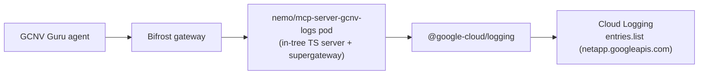

# GCNV Logs / Errors / Events MCP Server — Design Document

## Executive Summary

This document describes a new **self-contained, in-tree MCP server** (`nemo/mcp-server-gcnv-logs`) that gives AgentStudio agents read-only access to Google Cloud NetApp Volumes (GCNV) **logs, errors, and events**. GCNV Guru agents — in particular the **Storage Optimization & Cost Governance agent** — need to read historical failures, issues, alerts, and lifecycle events for NetApp Volumes resources (a P0 data source: *"ANF, FSxN, GCNV Events / Logs / Errors → detected failures, historical events, issues, alerts"*).

GCNV exposes no dedicated log API. Logs, errors, and events are all surfaced through **Google Cloud Logging**, scoped to the NetApp service (`protoPayload.serviceName="netapp.googleapis.com"`). The server is a small TypeScript MCP server built from source in this repository (following the same in-tree pattern as `mcp-server-duckdb`, `mcp-server-analytics`, and `mcp-server-ontap`) and wrapped with supergateway for the managed MCP runtime. It exposes four tools that build the Cloud Logging filter internally, so the agent never has to learn the filter DSL.

It is deliberately **separate** from the existing `gcnv_mcp` control-plane server (which wraps the upstream NetApp `gcnv-mcp-server` npm package for resource management). Keeping logs in their own self-contained server means AgentStudio owns the code, has no dependency on an upstream package release, and keeps the control-plane and observability concerns cleanly decoupled.

Metrics (Cloud Monitoring) are intentionally **out of scope** — they are owned by the metric-ingestion workstream, and the platform already ships a `prometheus_mcp` entry for platform metrics.

---

## Table of Contents

1. [Background](#background)
2. [Why a Self-Contained In-Tree Server](#why-a-self-contained-in-tree-server)
3. [Data Source: Cloud Logging](#data-source-cloud-logging)
4. [MCP Tool Interface](#mcp-tool-interface)
5. [Filter Construction](#filter-construction)
6. [Authentication & Permissions](#authentication--permissions)
7. [Server Implementation](#server-implementation)
8. [Container Image](#container-image)
9. [AgentStudio Integration](#agentstudio-integration)
10. [Pagination & Limits](#pagination--limits)
11. [Security](#security)
12. [Testing](#testing)
13. [Alternatives Considered](#alternatives-considered)
14. [Future Work](#future-work)

---

## Background

AgentStudio integrates managed MCP servers as `nemo/mcp-server-*` pods (Streamable HTTP on `:8000`), declared as catalog entries in [`mcpServerCatalog.ts`](../../src/nemo/config-service/catalog/mcpServerCatalog.ts), provisioned by `MCPRuntimeManager`, and registered with the Bifrost LLM gateway. Some entries wrap an upstream package (e.g. `gcnv_mcp` wraps NetApp's `gcnv-mcp-server`), while others are **custom servers built from in-tree source** (`mcp-server-duckdb`, `mcp-server-analytics`, `mcp-server-ontap`).

The existing `gcnv_mcp` server is **control-plane only**: storage pools, volumes, snapshots, backups, replications, KMS, quotas, host groups, operations, and ONTAP Expert Mode. It has **no** tools for logs, errors, or events. The GCNV Guru use cases require exactly that missing surface, which this server provides.



---

## Why a Self-Contained In-Tree Server

| Option | Verdict |
|---|---|
| **Self-contained in-tree server (chosen)** | AgentStudio owns the code; no dependency on an upstream package release; small surface (4 read-only tools); matches the existing custom-server pattern; control-plane vs observability cleanly separated. |
| Extend the upstream `gcnv-mcp-server` package | Couples delivery to an upstream PR + npm publish; pulls in the entire control-plane + ONTAP surface; AgentStudio cannot ship the feature independently. |
| Wrap Google's `@google-cloud/observability-mcp` | Generic, not GCNV-scoped; pushes the Logging filter DSL onto the agent; adds a second GCP auth surface for the same project. |

The logs server reuses the existing GCP service-account credential mapping (`expectedProvider: 'gcp'`) — the same one `gcnv_mcp` uses — so there is no new auth wiring.

---

## Data Source: Cloud Logging

All GCNV log data is in Cloud Logging, keyed off the audit-log service name:

```
protoPayload.serviceName="netapp.googleapis.com"
```

The three concepts map onto Logging as follows:

- **Logs** — any entry for the service. Admin Activity audit logs are always on; Data Access audit logs (read-type methods) require explicit opt-in.
- **Errors** — entries with `severity>=ERROR` and/or failed operations (`protoPayload.status.code!=0`).
- **Events** — lifecycle / admin-activity entries identified by `protoPayload.methodName` (e.g. `...NetApp.CreateVolume`, `...DeleteVolume`, `...CreateReplication`), including LRO start/end pairs.

Reference: [Google Cloud NetApp Volumes audit logging](https://docs.cloud.google.com/netapp/volumes/docs/monitor/cloud-logging).

---

## MCP Tool Interface

Four read-only tools (prefixed `gcnv_`). Each builds the Cloud Logging filter **internally** from high-level arguments, so the agent never writes the filter DSL.

**Common arguments**: `projectId` (required), `location?`, `resourceType?` (`storagePool` | `volume` | `snapshot` | `backup` | `backupVault` | `backupPolicy` | `replication` | `activeDirectory` | `kmsConfig` | `quotaRule` | `hostGroup`), `resourceName?`, `startTime?` / `endTime?` (RFC3339; default last 24h), `pageSize?` (default 50, max 200), `pageToken?`, `orderBy?` (`timestamp desc` default | `timestamp asc`).

### `gcnv_logs_list`

Generic log fetch. Adds `severity?` (minimum, inclusive) and `freeTextFilter?` (a raw Logging clause appended with `AND`, validated for balanced quotes/parentheses and control characters).

### `gcnv_errors_list`

Failure triage. Forces `(severity>=ERROR OR protoPayload.status.code!=0)`. Adds `minSeverity?` to override the ERROR floor (failures are always included).

### `gcnv_events_list`

Lifecycle / change tracking. Adds `eventType?` (`create` | `update` | `delete` | `replication` | `backup` | `snapshot` | `encrypt` | `revert`, mapped to a method-name token) and `methodName?` (supports `*` wildcards, e.g. `*.DeleteVolume`).

### `gcnv_log_summary`

Pattern detection for the optimization agent. Scans up to `maxEntries?` (default 500, max 1000) entries across pages and returns aggregated counts — `bySeverity`, `byMethod`, `byResource` — plus `totalEntries`, `failureCount`, `timeRange`, and `truncated`.

### Response shape (list tools)

Each entry is projected to a compact, agent-friendly object:

```json
{
  "timestamp": "2026-06-10T12:00:00Z",
  "severity": "ERROR",
  "methodName": "google.cloud.netapp.v1.NetApp.DeleteVolume",
  "resourceName": "projects/p/locations/us-central1/volumes/vol-1",
  "principal": "user@example.com",
  "statusCode": 7,
  "statusMessage": "permission denied",
  "operationId": "operations/op-123",
  "logName": "projects/p/logs/cloudaudit.googleapis.com%2Factivity",
  "summary": "DeleteVolume projects/p/.../volumes/vol-1 (FAILED: permission denied)"
}
```

List tools return `{ entries, count, filter, nextPageToken }`. `filter` is echoed back for transparency/debugging.

---

## Filter Construction

A pure helper (`src/logging-filter.ts`) composes clauses joined with `AND`, always starting with the NetApp base clause:

| Argument | Clause |
|---|---|
| (base) | `protoPayload.serviceName="netapp.googleapis.com"` |
| `startTime` / `endTime` | `timestamp>="..."` / `timestamp<="..."` |
| `location` | `protoPayload.resourceName:"/locations/<loc>/"` |
| `resourceType` | `protoPayload.resourceName:"/<plural>/"` (e.g. `/volumes/`) |
| `resourceName` | `protoPayload.resourceName:"<value>"` |
| `eventType` | `protoPayload.methodName=~"<token>"` (e.g. `Delete`) |
| `methodName` | `protoPayload.methodName=~"<regex>"` (`*` → `.*`) |
| `severity` (min) | `severity>=<SEVERITY>` |
| failures (errors tool) | `(severity>=ERROR OR protoPayload.status.code!=0)` |
| `freeTextFilter` | `(<validated text>)` |

Validation safeguards:

- `severity` is checked against the Cloud Logging severity enum.
- `resourceType` / `eventType` are validated against allow-lists.
- `methodName` allows only `[A-Za-z0-9_.*]`; `.` is escaped and `*` expanded for the `=~` regex.
- `location` allows only `[A-Za-z0-9-]`.
- `freeTextFilter` rejects control characters, unbalanced quotes/parentheses, and over-long input.

All string values are emitted as escaped, double-quoted literals, so a value can never break out of its clause.

---

## Authentication & Permissions

The server uses Google Cloud Application Default Credentials (`GOOGLE_APPLICATION_CREDENTIALS` / ADC) via a `LoggingClientFactory` (per-project client caching). In AgentStudio, the `gcnv_logs_mcp` catalog entry mounts a GCP service-account JSON via `credentialMapping.expectedProvider: 'gcp'` → `GOOGLE_APPLICATION_CREDENTIALS` — the same mapping used by `gcnv_mcp`.

Required IAM: `roles/logging.viewer` (`logging.logEntries.list`) on the target project. Notes for operators:

- **Admin Activity** audit logs are always available.
- **Data Access** audit logs (read-type methods like `GetVolume`, `ListVolumes`) must be [explicitly enabled](https://cloud.google.com/logging/docs/audit/configure-data-access); otherwise read events won't appear.

---

## Server Implementation

A small TypeScript MCP server under [`src/images/mcp-server-gcnv-logs/`](../../src/images/mcp-server-gcnv-logs):

```
src/images/mcp-server-gcnv-logs/
  Dockerfile               # multi-stage build + supergateway wrapper
  Makefile                 # nemo/mcp-server-gcnv-logs build/push
  package.json             # @google-cloud/logging, @modelcontextprotocol/sdk, zod, pino
  tsconfig.json
  vitest.config.ts
  src/
    index.ts               # MCP server; registers the 4 tools; stdio transport
    logger.ts              # pino → stderr (keeps stdout clean for stdio)
    types.ts               # ToolConfig / ToolHandler interfaces
    logging-filter.ts      # pure Cloud Logging filter builder + validation
    logging-client-factory.ts  # cached @google-cloud/logging client (ADC)
    logs-tools.ts          # Zod schemas for the 4 tools
    logs-handler.ts        # handlers (getEntries → project → paginate; summary aggregation)
    *.test.ts              # unit tests (filter builder, client factory, handlers)
```

Handlers call `logging.getEntries({ resourceNames, filter, orderBy, pageSize, autoPaginate: false, pageToken })`, project each entry to the compact shape, and return the API response's `nextPageToken`. `gcnv_log_summary` loops pages up to `maxEntries`.

---

## Container Image

Multi-stage Docker build:

1. **build stage** — `npm ci`, compile TypeScript (`tsc`), `npm prune --omit=dev`.
2. **runtime stage** — `node:20-bookworm-slim` + `supergateway`; copies `build/`, prod `node_modules`, and `package.json`.

The entrypoint wraps the stdio server with supergateway so the managed runtime gets Streamable HTTP on `:8000` with a `/healthz` health endpoint (same convention as `nemo/mcp-server-gcnv`):

```
ENTRYPOINT ["supergateway",
  "--stdio", "node /app/build/index.js --transport stdio",
  "--outputTransport", "streamableHttp",
  "--port", "8000",
  "--healthEndpoint", "/healthz"]
```

Runs as UID 1000 with `/tmp` writable (compatible with `readOnlyRootFilesystem: true`).

---

## AgentStudio Integration

- **New image** — [`src/images/mcp-server-gcnv-logs/`](../../src/images/mcp-server-gcnv-logs) (above).
- **New catalog entry** — `gcnv_logs_mcp` in [`mcpServerCatalog.ts`](../../src/nemo/config-service/catalog/mcpServerCatalog.ts): `category: 'monitoring'`, `image: nemo/mcp-server-gcnv-logs`, GCP `credentialMapping`, `egressPorts: [443]`, `healthProbe: 'http'`, `defaultAllowedTools` = the four tools, and a `promptFragment` guiding usage (default last-24h window; prefer `gcnv_errors_list` for triage and `gcnv_log_summary` for historical/optimization analysis; note Data Access audit logs may need enabling).
- **No changes** to the existing `gcnv_mcp` entry, `MCPRuntimeManager`, or NetworkPolicy — the GCP service account is already mapped, and these tools are read-only HTTPS callers (egress 443 covers `logging.googleapis.com`).

---

## Pagination & Limits

- List tools: `pageSize` clamped to `[1, 200]` (default 50); `nextPageToken` returned for continuation.
- Summary: scans up to `maxEntries` (default 500, max 1000), fetching pages of up to 200 until the budget is reached or logs are exhausted; `truncated: true` signals more data existed.
- Default time window is the last 24h when neither `startTime` nor `endTime` is given, keeping result sets bounded and queries cheap.

---

## Security

- **Read-only** — only `logging.logEntries.list`; no write or destructive capability.
- **Least privilege** — `roles/logging.viewer` is sufficient; reuses the existing scoped service account.
- **Injection-safe filters** — all user input is validated and emitted as escaped quoted literals; the base NetApp scope clause is always present, so queries cannot be widened beyond the NetApp service.
- **Sensitive data** — audit logs include caller identities (`principalEmail`); user-facing clients should treat output as potentially sensitive. The compact projection avoids dumping full raw payloads by default.

---

## Testing

- **Unit** — filter builder (every argument combination, validation failures), client factory (caching), and handlers (mocked `@google-cloud/logging`: projection, default window, pagination/clamping, error mapping, summary aggregation and truncation). 60 tests pass; `npm run build` and `tsc --noEmit` clean.
- **Smoke** — the built server starts and exposes all four tools over the MCP stdio protocol; the container build serves `/healthz` (200) and the `/mcp` endpoint via supergateway.
- **Manual** — deploy via the catalog, attach to a test agent, and validate `gcnv_errors_list` and `gcnv_log_summary` against a real GCNV project (with Data Access audit logs enabled).

---

## Alternatives Considered

1. **Extend the upstream `gcnv-mcp-server` package** — add the tools to NetApp's package and bump the version the `gcnv_mcp` image installs. Rejected: couples delivery to an upstream PR + npm publish, and pulls the entire control-plane/ONTAP surface along for what is a small, independent observability feature.
2. **Wrap `@google-cloud/observability-mcp`** — generic Logging/Monitoring/Trace tools. Rejected: not GCNV-scoped, pushes filter-DSL knowledge onto the agent, and adds a second GCP auth surface for the same project.
3. **Cloud Error Reporting** (`list_group_stats`) — useful for grouped application errors, but GCNV failures surface as audit-log entries with status codes, which `gcnv_errors_list` already captures without a second API. Could be added later if grouping is needed.

---

## Future Work

1. **ANF & FSxN log sources** — extend the same agent-facing pattern to Azure Monitor (ANF) and CloudWatch (FSxN) so the optimization agent has a unified multi-cloud event/error view.
2. **Alert-policy awareness** — optionally surface Cloud Monitoring alert policies/incidents for richer "issues/alerts" coverage (coordinated with the metric-ingestion workstream).
3. **Server-side aggregation** — if summary windows grow large, consider Log Analytics (BigQuery-backed) queries instead of client-side bucketing.
