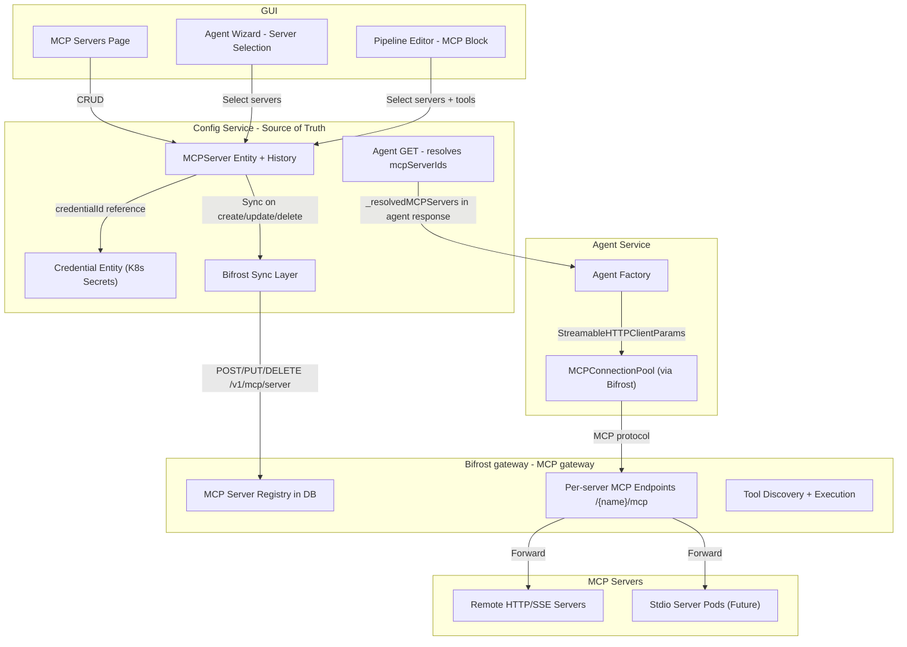
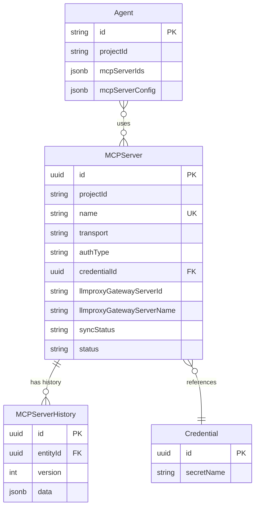

# MCP Server and Tools Support via the Bifrost Gateway

> **Note (gateway migration):** Earlier revisions of this document described
> the design with LiteLLM as the centralized gateway. AgentStudio has since
> migrated entirely to the **Bifrost** LLM gateway. Bifrost provides the same
> integration surface (per-server MCP endpoints, project-namespaced names,
> `extra_headers` allowlisting, OAuth, per-call timeouts) plus team-scoped
> virtual-key governance. The substance of the design below is unchanged —
> read every reference to "LiteLLM" / "the LiteLLM gateway" / "the LiteLLM
> proxy" in any older diff or PR as "Bifrost" / "the Bifrost gateway".

## Executive Summary

This document describes the design and implementation of **MCP (Model Context Protocol) server and tool support** for AgentStudio agents, using **the Bifrost gateway as a centralized MCP Gateway**. Instead of agent-service connecting directly to MCP servers, all connections are proxied through Bifrost's MCP client registry, which handles authentication, reconnection, health checks, and tool discovery. Config-service is the sole management interface for MCP servers, syncing registrations to the Bifrost gateway on every CRUD operation. This architecture simplifies the connection model, provides a single point for auth and permission management, and enables future support for both remote and local (stdio) MCP servers.

### Key Design Decisions

1. **Bifrost as MCP proxy**: All MCP connections from agent-service route through Bifrost's per-server MCP endpoints (`/{server_name}/mcp`) instead of connecting directly to MCP servers.
2. **Config-service as sole write path**: Config-service manages all MCP server registrations. Bifrost's own UI for MCP management is restricted to prevent dual-source-of-truth drift.
3. **Project-namespaced server names**: Bifrost has a flat global MCP-client namespace, so all server names are registered as `{projectId}_{name}` to prevent cross-project collisions.
4. **Clean entity replacement**: The `Tool` entity was replaced by `MCPServer` with no data migration needed (zero existing Tool records). Agent columns were renamed (`toolIds` → `mcpServerIds`).
5. **Gateway-first write order with rollback**: On create/update, config-service registers in Bifrost first, then saves to DB. If the DB write fails, the gateway registration is rolled back.
6. **Credential security**: Auth credentials are stored via the existing Credential entity (K8s Secrets), never as plaintext in PostgreSQL.

---

## Table of Contents

1. [Architecture Overview](#architecture-overview)
2. [Entity Model](#entity-model)
3. [Bifrost Sync Layer](#bifrost-sync-layer)
4. [Config-Service Routes](#config-service-routes)
5. [Agent-Service Integration](#agent-service-integration)
6. [GUI Changes](#gui-changes)
7. [Security](#security)
8. [Deployment](#deployment)
9. [Observability](#observability)
10. [Future: Stdio MCP Server Containerization](#future-stdio-mcp-server-containerization)

---

## Architecture Overview



### Data Flow

1. **GUI** creates/updates an MCP server via config-service REST API
2. **Config-service** registers the server in the Bifrost gateway (project-namespaced), then saves to its own PostgreSQL database
3. When an agent is invoked, **agent-service** fetches the agent config (which includes `_resolvedMCPServers` with gateway server names)
4. **MCPConnectionPool** creates `MCPTools` connections via Bifrost's per-server MCP endpoint using Agno's `StreamableHTTPClientParams`
5. **Bifrost** proxies the MCP protocol to the actual remote MCP server, handling auth and reconnection

---

## Entity Model

### MCPServer Entity

**File**: `src/nemo/config-service/models/MCPServer.ts`

Replaces the old `Tool` entity with a comprehensive MCP server configuration:

| Field | Type | Description |
|-------|------|-------------|
| `id` | UUID | Primary key |
| `projectId` | string | Project scope |
| `name` | string | Unique within project, alphanumeric + underscores (SEP-986) |
| `description` | text | Optional description |
| `transport` | enum | `http`, `sse`, or `stdio` |
| `url` | text | Endpoint URL for HTTP/SSE transports |
| `command` | text | Process command for stdio transport |
| `args` | text[] | Command arguments for stdio |
| `env` | jsonb | Environment variables for stdio |
| `authType` | enum | `none`, `api_key`, `bearer_token`, `basic`, `oauth2` |
| `credentialId` | UUID | FK to Credential entity (K8s Secret reference) |
| `authorizationUrl` | text | OAuth2 authorization URL |
| `tokenUrl` | text | OAuth2 token URL |
| `staticHeaders` | jsonb | Additional HTTP headers |
| `extraHeaders` | text[] | Headers to forward from requests |
| `allowedTools` | text[] | Tool whitelist |
| `disallowedTools` | text[] | Tool blacklist |
| `specPath` | text | OpenAPI spec path for OpenAPI-to-MCP conversion |
| `llmproxyGatewayServerId` | text | Server ID returned by the Bifrost gateway |
| `llmproxyGatewayServerName` | text | Project-namespaced name: `{projectId}_{name}` |
| `syncStatus` | enum | `synced`, `pending`, `error` |
| `status` | enum | `connected`, `disconnected`, `error`, `unknown` |
| `timeout` | int | Connection timeout in ms (default: 600000) |
| `trust` | boolean | Auto-approve tool calls without confirmation |

### MCPServerHistory Entity

**File**: `src/nemo/config-service/models/history/MCPServerHistory.ts`

Tracks version history for audit trail, following the same pattern as other history entities (DataSourceHistory, AgentHistory, etc.).

### Agent Entity Changes

**File**: `src/nemo/config-service/models/Agent.ts`

- `toolIds` → `mcpServerIds` (string[])
- `toolConfig` → `mcpServerConfig` (Record with `permissions`, `rateLimit`, `allowedTools`)

### ER Diagram



---

## Bifrost Sync Layer

### BifrostGatewayClient

**File**: `src/nemo/config-service/services/BifrostGatewayClient.ts` (implements the shared `ILLMGatewayClient` interface in `LLMGatewayClient.ts`)

New MCP-specific methods added alongside existing model management methods:

| Method | Bifrost Endpoint | Description |
|--------|------------------|-------------|
| `addMCPServer()` | `POST /v1/mcp/server` | Register server with project-namespaced name |
| `editMCPServer()` | `PUT /v1/mcp/server` | Update server configuration |
| `removeMCPServer()` | `DELETE /v1/mcp/server/{id}` | Remove server (404 treated as success) |
| `listMCPServers()` | `GET /v1/mcp/server` | List all registered servers |
| `testMCPConnection()` | `POST /mcp-rest/test/connection` | Test server connectivity |
| `listMCPTools()` | `GET /mcp-rest/tools/list` | Discover available tools |

### Project Namespacing

All server names are registered as `{projectId}_{name}` in Bifrost to prevent cross-project collisions. The `alias` field stores the user-facing name.

### Write Order and Rollback

**Create**: Bifrost first → DB save with `syncStatus: 'synced'` → if DB fails, rollback the Bifrost registration

**Update**: Bifrost first → DB update → if DB fails, rollback Bifrost changes

**Delete**: Bifrost first → DB delete (if Bifrost returns 404, proceed with DB delete anyway)

---

## Config-Service Routes

**File**: `src/nemo/config-service/routes/mcpServerRoutes.ts`

Mounted at `/api/v1/projects/:projectId/mcp-servers`

All routes use `mergeParams: true` and filter by `projectId` (fixing the bug in the old toolRoutes).

| Method | Path | Description |
|--------|------|-------------|
| GET | `/` | List MCP servers for project |
| GET | `/:id` | Get MCP server by ID |
| POST | `/` | Create MCP server (syncs to Bifrost) |
| PUT | `/:id` | Update MCP server (syncs to Bifrost) |
| DELETE | `/:id` | Delete MCP server (removes from Bifrost) |
| POST | `/:id/test-connection` | Test connection via Bifrost |
| GET | `/:id/tools` | List discovered tools via Bifrost |
| GET | `/:id/history` | Get version history |
| POST | `/:id/restore-version` | Restore to a previous version |

### Agent Route Enrichment

In `agentRoutes.ts GET /:id`, the response is enriched with `_resolvedMCPServers` — a map from server ID to `{ name, llmproxyGatewayServerName, llmproxyGatewayServerId, transport, syncStatus, timeout }`. This allows agent-service to construct Bifrost MCP URLs without additional lookups.

---

## Agent-Service Integration

### MCPConnectionPool

**File**: `src/nemo/agent-service/src/mcp_pool.py`

Rewritten to route all connections through the Bifrost gateway:

- URL pattern: `{LLM_GATEWAY_URL}/{llmproxyGatewayServerName}/mcp`
- Authentication: `Authorization: Bearer {LLM_GATEWAY_API_KEY}` header
- Transport: Agno `StreamableHTTPClientParams` with `transport="streamable-http"`
- Config hash: Based on `llmproxyGatewayServerName` and `timeout` (not raw connection details)
- Connection reuse: Long-lived connections shared across agent invocations, evicted on config change

### Agent Factory

**File**: `src/nemo/agent-service/src/agent_factory.py`

Tool resolution loop updated to:
1. Iterate over `config.mcpServerIds`
2. Look up each server in `config._resolvedMCPServers`
3. Skip servers with `syncStatus != 'synced'` (with warning log)
4. Create `MCPTools` instance via the pool for synced servers

### Cache Invalidation

The `AgentConfigCache` has a 60-second TTL (`CONFIG_CACHE_TTL`), ensuring MCP server config changes propagate within an acceptable window.

---

## GUI Changes

### MCP Servers Page

**File**: `src/nemo/gui/src/pages/ProjectMCPServers.tsx` (replaces ProjectTools.tsx)

- Lists all MCP servers for the project with sync status and connection status badges
- Transport type displayed as a badge (HTTP/SSE/STDIO)
- Create/edit via a 5-step wizard modal

### MCP Server Wizard

**File**: `src/nemo/gui/src/components/wizard/MCPServerWizard.tsx` (replaces ToolWizard.tsx)

| Step | Content |
|------|---------|
| 1. Basic Info | Name (SEP-986 validated), Description |
| 2. Connection | Transport selector, URL/Command fields, Timeout |
| 3. Authentication | Auth type selector, Credential reference, OAuth URLs, Static headers |
| 4. Tools & Security | Allowed/disallowed tools, Trust toggle |
| 5. Review | Summary of all settings |

### Agent Wizard

**File**: `src/nemo/gui/src/components/agent-wizard/AgentWizard.tsx`

Step 3 updated to show MCP servers (instead of tools) with sync status badges. Agents select servers by ID.

### Routing Updates

| File | Change |
|------|--------|
| `App.tsx` | Route `/projects/:projectId/tools` → `/projects/:projectId/mcp-servers` |
| `ProjectSidePanel.tsx` | Nav link label "Tools" → "MCP Servers" |
| `breadcrumb.tsx` | Breadcrumb label "Tools" → "MCP Servers" |
| `api.ts` | `Tool` types → `MCPServer`, `toolApi` → `mcpServerApi` |

### Pipeline Editor

**File**: `src/nemo/gui/src/blocks/blocks/mcp.ts`

MCP block sub-blocks updated to reference "MCP Server" instead of "Tool" in titles and descriptions.

---

## Security

- **Credential storage**: Auth credentials (API keys, OAuth secrets) are stored via the Credential entity which keeps secrets in K8s Secrets (referenced by `secretName`), never as plaintext in PostgreSQL. At sync time, the route handler reads the K8s Secret and passes values to the Bifrost gateway.
- **OAuth token lifecycle**: Bifrost handles OAuth token refresh automatically for `oauth2` auth type.
- **Dual source of truth mitigation**: Config-service is the sole write path. A startup reconciliation loop detects drift and re-syncs servers with `syncStatus != 'synced'`.
- **Trust / approval mapping**: The `trust` boolean maps to `require_approval: "never"` in Bifrost tool invocations. When `trust` is false, tool calls require explicit approval in the agent loop.
- **Audit trail**: Bifrost logs all MCP tool calls. The `MCPServerHistory` entity tracks all configuration changes.
- **Network isolation**: Agent-service can only reach the Bifrost gateway (not MCP servers directly). Bifrost is the only service with egress to external MCP servers, enforced by NetworkPolicy.

---

## Deployment

### Bifrost Gateway

- Gateway: **Bifrost** (Go-native, `bifrost-proxy:8080`)
- Helm chart: `deployments/helm/llm-gateway/charts/bifrost`
- Backed by PostgreSQL for config / governance / logs stores

### Helm Chart Changes

| File | Change |
|------|--------|
| `charts/bifrost/Chart.yaml` | New subchart |
| `charts/bifrost/values.yaml` | Image, persistence, Postgres wiring |
| `charts/bifrost/templates/configmap.yaml` | Renders Bifrost `config.json` |
| `charts/bifrost/templates/deployment.yaml` | Deployment with create-db init container |
| `charts/bifrost/templates/networkpolicy.yaml` | NetworkPolicy for the Bifrost pod |

### NetworkPolicy for the Bifrost gateway

```yaml
ingress:
  - from: [agent-service, config-service] on port 8080
egress:
  - PostgreSQL (5432)
  - External LLM providers (443, 80)
  - External MCP servers (443, 80)
  - DNS (53)
  - Managed MCP runner pods (by label)
```

### Deployment Steps

1. Deploy the Bifrost subchart + Helm chart changes (ConfigMap, NetworkPolicy)
2. Deploy config-service with MCPServer entity (pre-sync SQL migration runs automatically)
3. Deploy agent-service with rewritten MCPConnectionPool
4. Deploy GUI with MCP Servers page

### Pre-sync Migration

Runs automatically on startup (on a temp non-sync DataSource):

1. Renames Agent columns (`toolIds` → `mcpServerIds`, `toolConfig` → `mcpServerConfig`)
2. Drops empty `tools`/`tool_history` tables
3. Creates `mcp_servers`/`mcp_server_history` tables via `CREATE TABLE IF NOT EXISTS`

---

## Observability

- **Observability**: MCP tool calls can be surfaced via application metrics and tracing (e.g. OpenTelemetry) at the agent-service and Bifrost layers; tool latency, success/failure, and token usage depend on how those layers are instrumented.
- **syncStatus tracking**: Each MCP server has a `syncStatus` field (`synced`/`pending`/`error`) that surfaces sync health in the GUI.
- **Health monitoring**: The `status` field tracks connection health (`connected`/`disconnected`/`error`/`unknown`), updated via the test-connection endpoint.

---

## Future: Stdio MCP Server Containerization

This is a follow-on phase that will be designed and implemented separately.

### High-Level Approach

- **MCP Server Runner Pod**: A Docker image with common runtimes (Node.js, Python) that runs an arbitrary MCP server process, exposes it as HTTP via an adapter, and reports health.
- **Lifecycle via Temporal Workflow**: Config-service triggers a provisioning workflow that creates K8s Deployment, Service, and NetworkPolicy per stdio server.
- **Per-pod security**: Dedicated ServiceAccount, read-only root filesystem, non-root user, resource limits, egress-restricted NetworkPolicy.
- **Scale-to-zero**: If no tool calls for N minutes, scale Deployment to 0 replicas. Scale back on next health check failure.
- **Alternative**: For simpler deployments with trusted tools, Bifrost itself supports stdio if binaries are in its container.
