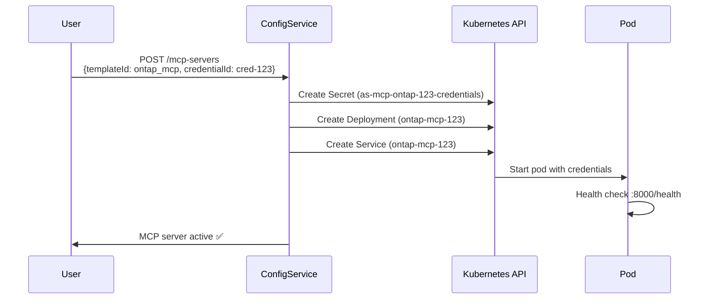

# Kubernetes Knowledge Guide - AgentStudio Project

This document summarizes the Kubernetes knowledge and hands-on experience gained from working on the AgentStudio project, a multi-tenant AI agent platform running on Azure Kubernetes Service (AKS).

---

## Table of Contents

1. [Overview](#overview)
2. [Core Kubernetes Concepts](#core-kubernetes-concepts)
3. [Advanced Patterns](#advanced-patterns)
4. [AgentStudio Architecture](#agentstudio-architecture)
5. [Operational Skills](#operational-skills)
6. [Interview Talking Points](#interview-talking-points)

---

## Overview

**AgentStudio** is a production-grade AI agent platform deployed on AKS that demonstrates:
- Multi-namespace architecture for security isolation
- Dynamic pod provisioning (MCP servers)
- Service mesh integration (Istio)
- Persistent storage with Azure NetApp Files
- Secret management for multi-tenant credentials
- Helm-based GitOps deployments

**Production URL:** `https://agentstudio-dev-eus2.eastus2.cloudapp.azure.com:8443/console`

**Key Stats:**
- 4 namespaces (agentstudio-edge, nemo, identity, database)
- 20+ microservices
- Dynamic MCP server pods (created on-demand)
- StatefulSet for PostgreSQL
- Istio Gateway with HTTPRoutes

---

## Core Kubernetes Concepts

### 1. Deployments

**What:** Manages stateless application replicas with rolling updates.

**AgentStudio Examples:**
- **config-service**: Main API server (Deployment with 2+ replicas)
- **agent-service-maf**: Python-based agent orchestrator
- **Bifrost**: LLM gateway service
- **agent-studio-ui**: React frontend

**Key Learning:**
```yaml
apiVersion: apps/v1
kind: Deployment
metadata:
  name: config-service
  namespace: nemo
spec:
  replicas: 2
  selector:
    matchLabels:
      app: config-service
  template:
    spec:
      containers:
      - name: config-service
        image: cragentstudiodeveus2001.azurecr.io/config-service:747346b6
        ports:
        - containerPort: 3000
        env:
        - name: DATABASE_URL
          valueFrom:
            secretKeyRef:
              name: postgres-credentials
              key: connection_string
```

**Why Deployments:**
- Horizontal scaling (increase replicas)
- Rolling updates (zero-downtime deployments)
- Self-healing (restarts failed pods)

---

### 2. StatefulSets

**What:** Manages stateful applications with stable network identities and persistent storage.

**AgentStudio Example:**
- **PostgreSQL**: Database with persistent volume

**Key Differences from Deployment:**

| Feature | Deployment | StatefulSet |
|---------|-----------|-------------|
| Pod names | Random suffix (config-7f8d-xyz) | Ordered index (postgres-0, postgres-1) |
| Storage | Ephemeral or shared PVC | Per-pod PVC |
| Network identity | Changes on restart | Stable DNS (postgres-0.postgres.nemo.svc) |
| Ordering | Parallel create/delete | Sequential (0→1→2) |

**Why StatefulSet for PostgreSQL:**
```yaml
apiVersion: apps/v1
kind: StatefulSet
metadata:
  name: shared-postgresql
  namespace: database
spec:
  serviceName: shared-postgresql
  replicas: 1
  volumeClaimTemplates:
  - metadata:
      name: data
    spec:
      accessModes: ["ReadWriteOnce"]
      storageClassName: anf-nfs
      resources:
        requests:
          storage: 50Gi
```

---

### 3. Services

**What:** Exposes pods via stable DNS name and load balancing.

**AgentStudio Service Types:**

#### **ClusterIP (Internal Communication)**
```yaml
apiVersion: v1
kind: Service
metadata:
  name: config-service
  namespace: nemo
spec:
  type: ClusterIP
  selector:
    app: config-service
  ports:
  - port: 3000
    targetPort: 3000
```

**Used by:** Internal service-to-service calls
**DNS:** `config-service.nemo.svc.cluster.local:3000`

#### **LoadBalancer (External Access)**
```yaml
apiVersion: v1
kind: Service
metadata:
  name: istio-gateway
  namespace: agentstudio-edge
  annotations:
    service.beta.kubernetes.io/azure-load-balancer-resource-group: "MC_rg-agentstudio-dev-eus2-001_..."
    service.beta.kubernetes.io/azure-pip-name: "pip-agentstudio-gw-dev-eus2-001"
spec:
  type: LoadBalancer
  loadBalancerIP: 20.7.45.234
  ports:
  - port: 8443
    targetPort: 8443
    protocol: TCP
```

**External IP:** `20.7.45.234`
**DNS:** `agentstudio-dev-eus2.eastus2.cloudapp.azure.com`

---

### 4. ConfigMaps & Secrets

**What:** Configuration data injection into pods.

**AgentStudio Secret Patterns:**

#### **Credential Storage**
```yaml
apiVersion: v1
kind: Secret
metadata:
  name: as-cred-abc123
  namespace: nemo
type: Opaque
data:
  api_key: c2stYXp1cmUtWFhYWFhY  # base64 encoded
  username: YWRtaW4=
  password: c2VjcmV0MTIz
```

**Used for:** Azure API keys, GitHub tokens, ONTAP credentials

#### **VK Token Storage**
```yaml
apiVersion: v1
kind: Secret
metadata:
  name: as-proj-projmf8jf5qs-vk
  namespace: nemo
data:
  virtual_key_token: YmstcHJvai1wcm9qbWY4amY1cXMtWFhY  # bk-proj-projmf8jf5qs-xxx
```

**Used for:** Per-project Bifrost virtual key tokens

#### **MCP Server Credentials**
```yaml
apiVersion: v1
kind: Secret
metadata:
  name: as-mcp-ontap-123-credentials
  namespace: nemo
data:
  ONTAP_USERNAME: YWRtaW4=
  ONTAP_PASSWORD: c2VjcmV0MTIz
  client_cert_pem: LS0tLS1CRUdJTi...
  client_key_pem: LS0tLS1CRUdJTi...
```

**Injected into MCP pod as:**
- Environment variables: `ONTAP_USERNAME`, `ONTAP_PASSWORD`
- Files: `/etc/ontap/client.crt`, `/etc/ontap/client.key` (mounted with mode 0400)

---

### 5. Persistent Volumes (PV/PVC)

**What:** Durable storage that survives pod restarts.

**AgentStudio Storage Architecture:**

#### **Challenge: Multi-Pod Access**
Multiple pods need simultaneous read/write access to the same data:
- `s3gateway` (writes uploaded files)
- `dataset-worker` (reads files for processing)
- `kb-worker` (indexes documents)
- `kb-retrieval-service` (queries vectorized data)

#### **Access Modes:**

| Mode | Abbreviation | Description | Limitation |
|------|--------------|-------------|------------|
| ReadWriteOnce | RWO | Single node mount | Fails if pods on different nodes |
| ReadWriteMany | RWX | Multi-node mount | Requires shared filesystem (NFS/SMB) |
| ReadOnlyMany | ROX | Multi-node read-only | Not suitable for write workloads |

#### **Solution: Azure NetApp Files (ANF)**

**StorageClass:**
```yaml
apiVersion: storage.k8s.io/v1
kind: StorageClass
metadata:
  name: anf-nfs
provisioner: csi.trident.netapp.io
parameters:
  backendType: "azure-netapp-files"
  fsType: "nfs"
```

**PVC Example:**
```yaml
apiVersion: v1
kind: PersistentVolumeClaim
metadata:
  name: s3gateway-default-bucket
  namespace: nemo
spec:
  accessModes:
    - ReadWriteMany  # Critical: Multiple pods, multiple nodes
  storageClassName: anf-nfs
  resources:
    requests:
      storage: 100Gi
```

**Why ANF over Azure Files:**
- ✅ Native NFS (POSIX semantics, no SMB translation layer)
- ✅ Sub-millisecond latency
- ✅ True RWX from any node
- ✅ Snapshots, clones, replication (NetApp features)
- ❌ Azure Files has SMB overhead, latency issues, POSIX incompatibility

---

### 6. Namespaces

**What:** Virtual clusters for resource isolation and RBAC boundaries.

**AgentStudio Namespace Strategy:**

```
┌─────────────────────────────────────────────────────────────┐
│                    AKS Cluster                              │
├─────────────────────────────────────────────────────────────┤
│  Namespace: agentstudio-edge                                │
│  - Istio Gateway (LoadBalancer)                             │
│  - HTTPRoutes (traffic routing)                             │
├─────────────────────────────────────────────────────────────┤
│  Namespace: nemo (core application services)                │
│  - config-service (API)                                     │
│  - agent-service-maf (Python orchestrator)                  │
│  - agent-studio-ui (React frontend)                         │
│  - Bifrost (LLM gateway)                                    │
│  - MCP server pods (dynamic, created per user)              │
│  - s3gateway, workers                                       │
├─────────────────────────────────────────────────────────────┤
│  Namespace: identity                                        │
│  - Keycloak (authentication server)                         │
├─────────────────────────────────────────────────────────────┤
│  Namespace: database                                        │
│  - PostgreSQL StatefulSet                                   │
├─────────────────────────────────────────────────────────────┤
│  Namespace: observability                                   │
│  - Prometheus, Phoenix (monitoring)                         │
└─────────────────────────────────────────────────────────────┘
```

**Benefits:**
- **Security:** Network policies, RBAC per namespace
- **Resource quotas:** CPU/memory limits per namespace
- **DNS isolation:** Service discovery scoped to namespace
- **Blast radius:** Issues in one namespace don't affect others

---

## Advanced Patterns

### 1. Dynamic Pod Provisioning (MCP Servers)

**Challenge:** Users create MCP servers (GitHub, ONTAP, DuckDB) on-demand. Each needs its own pod with credentials.

**Solution:** `MCPRuntimeManager` in config-service programmatically creates Kubernetes resources.

#### **Flow:**



#### **Generated Deployment:**
```yaml
apiVersion: apps/v1
kind: Deployment
metadata:
  name: ontap-mcp-123
  namespace: nemo
spec:
  replicas: 1
  template:
    spec:
      containers:
      - name: mcp-server
        image: nemo/mcp-server-ontap:latest
        env:
        - name: ONTAP_CLUSTER_URL
          value: "https://ontap-prod.example.com"
        - name: ONTAP_USERNAME
          valueFrom:
            secretKeyRef:
              name: as-mcp-ontap-123-credentials
              key: ONTAP_USERNAME
        - name: ONTAP_CLIENT_CERT_PATH
          value: "/etc/ontap/client.crt"
        volumeMounts:
        - name: credentials
          mountPath: /etc/ontap
          readOnly: true
      volumes:
      - name: credentials
        secret:
          secretName: as-mcp-ontap-123-credentials
          items:
          - key: client_cert_pem
            path: client.crt
            mode: 0400  # Read-only by owner
          - key: client_key_pem
            path: client.key
            mode: 0400
```

**Key Learning:** Programmatic Kubernetes resource creation via client libraries (TypeScript `@kubernetes/client-node`).

---

### 2. Credential Materialization Pattern

**Problem:** One credential (Azure API key) used by multiple MCP servers, but each pod needs scoped secrets.

**Solution:** Two-secret design:

#### **Source Credential (Reusable):**
```yaml
apiVersion: v1
kind: Secret
metadata:
  name: as-cred-abc123  # Original credential
data:
  api_key: c2stYXp1cmU=
  username: YWRtaW4=
  password: c2VjcmV0=
  client_cert_pem: LS0tLS0=
  client_key_pem: LS0tLS0=
```

#### **Per-Server Secret (Materialized):**
```yaml
apiVersion: v1
kind: Secret
metadata:
  name: as-mcp-ontap-123-credentials  # Pod-specific secret
data:
  ONTAP_USERNAME: YWRtaW4=  # Mapped from 'username'
  ONTAP_PASSWORD: c2VjcmV0=  # Mapped from 'password'
  client_cert_pem: LS0tLS0=  # For file mount
```

**credentialMapping Schema:**
```typescript
credentialMapping: {
  expectedProvider: 'ontap',
  envFromKeys: {
    username: 'ONTAP_USERNAME',    // Secret key → Env var name
    password: 'ONTAP_PASSWORD',
  },
  fileFromKeys: {
    client_cert_pem: {
      mountPath: '/etc/ontap/client.crt',
      envForPath: 'ONTAP_CLIENT_CERT_PATH',  // Env var pointing to file
      mode: 0o400
    },
  },
}
```

**Benefits:**
- ✅ One credential, many MCP servers
- ✅ Scoped secrets (principle of least privilege)
- ✅ Easy credential rotation (update source, recreate per-server secrets)

---

### 3. Service Mesh (Istio)

**What:** Traffic management, observability, and security without changing application code.

**AgentStudio Istio Setup:**

#### **Gateway Resource:**
```yaml
apiVersion: gateway.networking.k8s.io/v1
kind: Gateway
metadata:
  name: agentstudio-gateway
  namespace: agentstudio-edge
spec:
  gatewayClassName: istio
  listeners:
  - name: https
    port: 8443
    protocol: HTTPS
    hostname: "*.agentstudio.local"
    tls:
      mode: Terminate
      certificateRefs:
      - name: agentstudio-tls-cert
```

#### **HTTPRoute (Path-Based Routing):**
```yaml
apiVersion: gateway.networking.k8s.io/v1
kind: HTTPRoute
metadata:
  name: agentstudio-app-console
  namespace: agentstudio-edge
spec:
  parentRefs:
  - name: agentstudio-gateway
  hostnames:
  - "app.agentstudio.local"
  rules:
  - matches:
    - path:
        type: PathPrefix
        value: /console
    backendRefs:
    - name: agent-studio-ui
      namespace: nemo
      port: 3000
  - matches:
    - path:
        type: PathPrefix
        value: /config
    backendRefs:
    - name: config-service
      namespace: nemo
      port: 3000
```

**Traffic Flow:**
```
External Request: https://app.agentstudio.local:8443/config/api/v1/projects
    ↓
LoadBalancer (20.7.45.234:8443)
    ↓
Istio Gateway (TLS termination)
    ↓
HTTPRoute (matches /config path)
    ↓
config-service.nemo.svc.cluster.local:3000
    ↓
config-service Pod
```

**Benefits:**
- ✅ Centralized TLS termination
- ✅ Path-based routing without application changes
- ✅ Traffic splitting (A/B testing)
- ✅ Observability (automatic metrics, tracing)

---

### 4. Health Probes

**What:** Kubernetes checks to determine if a pod is ready to serve traffic.

**Types:**

| Probe | Purpose | Failure Action |
|-------|---------|----------------|
| Liveness | Is the app alive? | Restart container |
| Readiness | Can the app handle traffic? | Remove from Service endpoints |
| Startup | Has the app finished starting? | Wait before liveness checks |

**AgentStudio Example (MCP Server):**
```yaml
apiVersion: apps/v1
kind: Deployment
spec:
  template:
    spec:
      containers:
      - name: mcp-server
        image: nemo/mcp-server-ontap:latest
        ports:
        - containerPort: 8000
        livenessProbe:
          httpGet:
            path: /health
            port: 8000
          initialDelaySeconds: 10
          periodSeconds: 30
        readinessProbe:
          httpGet:
            path: /health
            port: 8000
          initialDelaySeconds: 5
          periodSeconds: 10
```

**How config-service uses this:**
1. MCP pod starts
2. Readiness probe fails (initialDelay)
3. Pod NOT added to Service endpoints yet
4. After 5s, readiness probe succeeds
5. Pod added to Service → config-service marks as "active"
6. If liveness probe fails, K8s restarts container

---

### 5. RBAC (ServiceAccounts)

**What:** Fine-grained permissions for pods to interact with Kubernetes API.

**AgentStudio Example:**
```yaml
apiVersion: v1
kind: ServiceAccount
metadata:
  name: config-service
  namespace: nemo
---
apiVersion: rbac.authorization.k8s.io/v1
kind: Role
metadata:
  namespace: nemo
  name: config-service-role
rules:
- apiGroups: [""]
  resources: ["secrets"]
  verbs: ["get", "list", "create", "update", "delete"]
- apiGroups: ["apps"]
  resources: ["deployments"]
  verbs: ["get", "list", "create", "update", "delete"]
- apiGroups: [""]
  resources: ["services"]
  verbs: ["get", "list", "create", "delete"]
---
apiVersion: rbac.authorization.k8s.io/v1
kind: RoleBinding
metadata:
  name: config-service-binding
  namespace: nemo
subjects:
- kind: ServiceAccount
  name: config-service
  namespace: nemo
roleRef:
  kind: Role
  name: config-service-role
  apiGroup: rbac.authorization.k8s.io
```

**Why this matters:**
- config-service needs to create MCP server Deployments/Secrets
- Without RBAC, would get "forbidden" errors
- Scoped to `nemo` namespace only (can't modify other namespaces)

---

## AgentStudio Architecture

### Complete Request Flow

```
┌─────────────────────────────────────────────────────────────────┐
│                         User Browser                            │
│           https://agentstudio-dev-eus2.eastus2.cloudapp.azure.com:8443│
└────────────────────────────┬────────────────────────────────────┘
                             │
                             ▼
┌─────────────────────────────────────────────────────────────────┐
│              Azure Public IP: 20.7.45.234:8443                  │
│            (pip-agentstudio-gw-dev-eus2-001)                    │
└────────────────────────────┬────────────────────────────────────┘
                             │
                             ▼
┌─────────────────────────────────────────────────────────────────┐
│          LoadBalancer Service (agentstudio-edge ns)             │
│                   Istio Gateway Pod                             │
└────────────────────────────┬────────────────────────────────────┘
                             │
         ┌───────────────────┼───────────────────┐
         │                   │                   │
         ▼                   ▼                   ▼
    /console              /config             /auth
         │                   │                   │
         ▼                   ▼                   ▼
┌──────────────────┐  ┌──────────────────┐  ┌──────────────────┐
│ agent-studio-ui  │  │ config-service   │  │ Keycloak         │
│ (nemo ns)        │  │ (nemo ns)        │  │ (identity ns)    │
└──────────────────┘  └────────┬─────────┘  └──────────────────┘
                               │
                   ┌───────────┼───────────┐
                   │           │           │
                   ▼           ▼           ▼
            ┌──────────┐ ┌──────────┐ ┌──────────┐
            │PostgreSQL│ │ Bifrost  │ │K8s API   │
            │(database)│ │ (nemo)   │ │(Secrets, │
            │          │ │          │ │ Deploys) │
            └──────────┘ └──────────┘ └──────────┘
```

---

## Operational Skills

### Troubleshooting Commands

```bash
# Check pod status
kubectl get pods -n nemo
kubectl get pods -n nemo -l app=config-service

# Describe pod (events, conditions, volumes)
kubectl describe pod config-service-7f8d9c-xyz -n nemo

# View logs
kubectl logs -f config-service-7f8d9c-xyz -n nemo
kubectl logs --previous config-service-7f8d9c-xyz -n nemo  # Previous crash

# Execute into pod
kubectl exec -it config-service-7f8d9c-xyz -n nemo -- /bin/bash

# Check events
kubectl get events -n nemo --sort-by='.lastTimestamp' | tail -20

# Check PVC status
kubectl get pvc -n nemo
kubectl describe pvc s3gateway-default-bucket -n nemo

# Check Service endpoints
kubectl get endpoints config-service -n nemo

# Check HTTPRoutes
kubectl get httproute -n agentstudio-edge
kubectl describe httproute agentstudio-app-config -n agentstudio-edge

# Check Gateway
kubectl get gateway agentstudio-gateway -n agentstudio-edge -o yaml

# Port-forward for local testing
kubectl port-forward svc/config-service 3000:3000 -n nemo
```

### Common Issues & Solutions

#### 1. **ImagePullBackOff**
**Symptom:** Pod stuck in `ImagePullBackOff`
**Cause:** Image doesn't exist or no pull secret
**Solution:**
```bash
kubectl describe pod <pod-name> -n nemo | grep -A5 "Events:"
# Check image name is correct
# Verify image pull secret exists:
kubectl get secrets -n nemo | grep regcred
```

#### 2. **CrashLoopBackOff**
**Symptom:** Pod restarts repeatedly
**Cause:** Application crashes on startup
**Solution:**
```bash
kubectl logs <pod-name> -n nemo --previous  # View crash logs
# Common causes: missing env vars, DB connection failure
```

#### 3. **PVC Pending**
**Symptom:** PVC stuck in `Pending` state
**Cause:** StorageClass doesn't exist or no available PV
**Solution:**
```bash
kubectl get storageclass
kubectl describe pvc <pvc-name> -n nemo
# Check if provisioner is running (Trident for ANF)
kubectl get pods -n trident
```

#### 4. **Service Unreachable**
**Symptom:** Cannot reach service from another pod
**Cause:** No healthy endpoints, selector mismatch
**Solution:**
```bash
kubectl get endpoints <service-name> -n nemo
# If empty, check pod selector matches service selector
kubectl get svc <service-name> -n nemo -o yaml | grep selector
kubectl get pods -n nemo -l <selector-label>
```

---

## Interview Talking Points

### 1. **Opening Statement**
> "I've worked on AgentStudio, a production AI agent platform on AKS with 4 namespaces, 20+ microservices, and dynamic pod provisioning. I have hands-on experience with Deployments, StatefulSets, Services, PersistentVolumes, Secrets, RBAC, Istio service mesh, and Helm deployments."

### 2. **Dynamic Resource Creation**
> "One interesting challenge was implementing dynamic MCP server provisioning. When users add an MCP server through the UI, config-service programmatically creates a Kubernetes Deployment, Secret with credentials, and Service - all via the K8s API. This involved designing a credential materialization pattern where source credentials are transformed into per-pod Secrets with specific environment variables and mounted files."

### 3. **Storage Architecture**
> "We faced a multi-pod access challenge where s3gateway, dataset-worker, and kb-worker all need simultaneous read/write to the same bucket data. I learned the difference between RWO and RWX access modes and why Azure NetApp Files was chosen over Azure Files - native NFS gives us true POSIX semantics, sub-millisecond latency, and proper multi-node access without the SMB translation overhead."

### 4. **Service Mesh**
> "The platform uses Istio for traffic management. We have a LoadBalancer Service on a static Azure public IP (20.7.45.234) with an Istio Gateway, routing traffic via HTTPRoutes based on hostname and path - like /console → UI, /config → API, /auth → Keycloak. This gives us centralized TLS termination and path-based routing without changing application code."

### 5. **Security & Isolation**
> "We use multiple namespaces for security boundaries - agentstudio-edge for ingress, nemo for core services, identity for Keycloak, database for PostgreSQL. config-service runs with a ServiceAccount that has RBAC permissions scoped to the nemo namespace only, allowing it to create Secrets and Deployments for MCP servers but nothing else."

### 6. **Operational Experience**
> "I'm comfortable troubleshooting - using kubectl logs, describe pod, get events to debug issues like PVC binding failures, pod security violations, and image pull errors. I've worked with Helm for deployments and understand values overlays for environment-specific config."

### 7. **StatefulSets vs Deployments**
> "PostgreSQL runs as a StatefulSet because it needs stable network identity and persistent storage that survives pod restarts. Stateless services like config-service and agent-service-maf use Deployments for horizontal scaling and rolling updates."

### 8. **Specific Technical Win**
> "We solved the multi-node storage issue by switching from local-path (RWO) to Azure NetApp Files (RWX), allowing workers and s3gateway to run on different nodes without multi-attach errors. This was critical for horizontal scaling."

---

## Conclusion

This guide captures the practical Kubernetes knowledge gained from the AgentStudio project, covering everything from basic concepts to production-grade patterns like dynamic pod provisioning, credential materialization, and service mesh integration. Each concept is backed by real code examples and architectural decisions from a production AKS deployment.

**Key Takeaways:**
- ✅ Multi-namespace architecture for security isolation
- ✅ Dynamic Kubernetes resource creation via API
- ✅ Persistent storage with Azure NetApp Files (RWX)
- ✅ Service mesh (Istio) for traffic management
- ✅ RBAC for least-privilege access
- ✅ Helm-based GitOps deployments
- ✅ Production troubleshooting skills

**Production URL:** https://agentstudio-dev-eus2.eastus2.cloudapp.azure.com:8443/console
