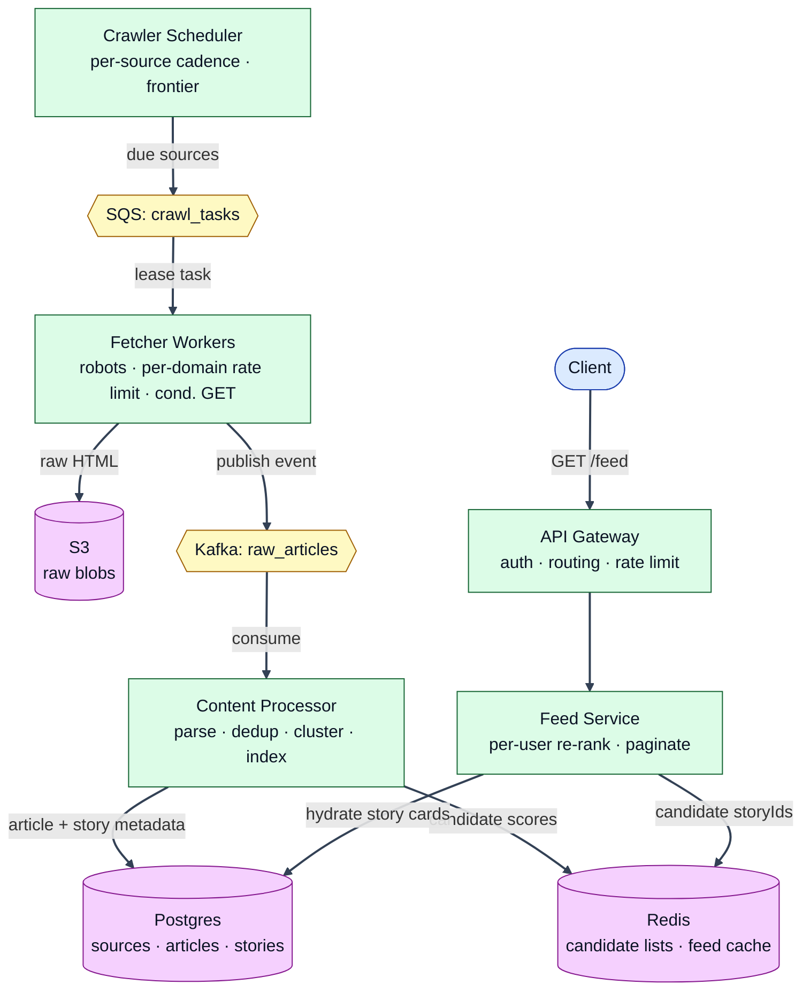

# HLD — News Aggregator (Google News–style)

> **Core insight (say this first):** This is a **read-dominated** system (~1000:1). News is fundamentally about **freshness + dedup**. So we do all the expensive work **once on the write path** — crawl, dedup, cluster 50 outlets' takes into **one story**, and precompute **ranked candidate lists per topic** — then serve 500M daily feed reads from **Redis** with only a **lightweight per-user re-rank**. Postgres is the source of truth but stays **off the hot read path**.

---

## §1 — Requirements (0:00–0:08)

**Functional**
1. **Crawl & ingest** articles from ~100k sources (RSS + HTML), each on its **own cadence**; detect **updates** to already-seen articles.
2. **Deduplicate & cluster** near-identical articles into a single **story** (one event, many outlets).
3. **Generate a ranked, personalized feed** per user (freshness + popularity + source authority + user interests).
4. Browse by **topic/category** (Tech, Sports…) and **locale/language**; **paginate** the feed.
5. Open a **story detail** with all contributing sources + attribution.

**Out of scope:** comments/social graph, full-text search engine, video transcoding, ML model *training* internals.

**Non-Functional**
- **Read latency:** feed **p99 < 200 ms**.
- **Freshness:** breaking news in feed **< 2 min** of publication.
- **Availability:** **99.9%** read path; crawling tolerates short outages (async, catch-up).
- **Scale:** 100M DAU, **~500M feed reads/day** (~6k/s avg, ~30–50k/s peak); **~1M new articles/day**.
- **Consistency:** eventual is fine for the feed; **dedup/clustering must be robust**.

**Core insight:** *Reads dominate and news = freshness + dedup → precompute (crawl, dedup, cluster, rank candidates) on the write path; serve pre-ranked cached candidates on the read path.*

---

## §2 — Capacity Estimation (0:08–0:13)

| Metric | Number | Implication |
|---|---|---|
| New articles/day | ~1M (~12/s avg, ~50/s peak) | Write volume tiny → **can afford heavy per-article work** (parse, embed, cluster) |
| Feed reads/day | ~500M (~6k/s avg, **~30–50k/s peak**) | Must be **cache-served**; cannot hit Postgres per request |
| Read : write ratio | **~1000 : 1** | **Precompute on write, serve from cache on read** |
| Sources | ~100k, cadence 1 min–24 h | Scheduler must **prioritize by source velocity/importance** |
| Raw storage | ~50 GB/day raw HTML, ~5 GB/day extracted | Raw → **S3** (cheap blob), not Postgres |
| Candidate cache | ~1 GB global topic lists + ~16 GB active per-user pages | **Fits a Redis cluster** comfortably |
| Hot serving set | last ~48–72 h of stories | Postgres **time-partitioned**; old data archived |

**Key implication:** the read path is served **entirely from Redis-cached ranked candidates**; Postgres is source of truth for metadata but is kept off the 30–50k/s hot path.

---

## §3 — HLD Diagram (0:13–0:25)



**Component table**

| Box | Does | Why it exists |
|---|---|---|
| **Crawler Scheduler** | Tracks each source's `next_crawl_at`; emits due sources as fetch tasks; adaptive cadence + backoff | Decouples *"when to crawl"* from *"how to crawl"*; owns freshness policy |
| **SQS `crawl_tasks`** | Work queue of fetch tasks; visibility timeout = free lease; DLQ for poison URLs | Load-levels bursts; gives at-least-once fetch with retries |
| **Fetcher Workers** | Politely download pages (robots, per-domain rate limit, conditional GET), store raw → S3, emit event | Isolates the messy, failure-prone network I/O; owns **politeness** |
| **Kafka `raw_articles`** | Ordered, replayable stream of fetched articles | Multi-consumer + **replay** for reprocessing (re-cluster, re-embed) |
| **Content Processor** | Parse/extract → simhash + embedding → **dedup & cluster** → write metadata → update candidate lists | The brain: turns raw pages into ranked **stories**; the hardest box |
| **Postgres** | Source of truth: sources, articles, stories (clusters) | Relational joins for hydration; moderate writes; time-partitioned |
| **S3** | Raw HTML/extracted text blobs (lifecycle → cold/delete) | Big, unstructured, cheap — wrong fit for Postgres |
| **Redis** | Global ranked **candidate lists** + per-user **feed pages** + LSH/dedup indexes | Sub-ms reads for the 30–50k/s hot path |
| **Feed Service** | Read candidates → per-user re-rank → paginate → hydrate → return | Keeps personalization cheap and stateless; owns the read SLA |
| **API Gateway** | AuthN/Z, routing, rate limiting | Single edge; keeps services stateless |

**Most important decision:** precompute **story clusters + global ranked candidate lists on the write path**, and serve reads from Redis with only a lightweight per-user re-rank — so 500M reads/day never rank from scratch or hit Postgres.

**Storage choice:** **Postgres** for article/story/source metadata (relational, joinable, ~1M writes/day — well within a partitioned primary). **Deviations (justified):** **S3** for raw HTML (large unstructured blobs), **Redis** for hot ranked candidate lists + feed pages + LSH indexes (latency), **Kafka/SQS** for async transport.

---

## §3A — Key Flows (0:25–0:28)

**Write path (ingestion).** The **Scheduler** finds sources whose `next_crawl_at ≤ now` and enqueues fetch tasks to **SQS**. **Fetchers** lease a task, check `robots.txt` and a per-domain rate limiter, issue a **conditional GET** (ETag/Last-Modified), store raw HTML → **S3**, and publish a `raw_articles` event → **Kafka**. The **Content Processor** consumes it: parses/extracts the article, computes a **SimHash** + **embedding**, checks for **near-duplicates / same-event stories**, assigns the article to an existing **story cluster** or creates a new one, writes metadata → **Postgres**, and updates the story's score in the relevant **Redis candidate lists**.

**Read path (feed).** `Client → Gateway → Feed Service`. Feed Service first checks the **per-user feed cache** in Redis (for pagination continuity). On miss, it reads **global candidate lists** for the user's topics/locale from Redis, applies a **lightweight per-user re-rank** (interest affinity, freshness decay, **seen-filter**), **hydrates** story cards (from a Redis `story:{id}` cache, else Postgres), freezes the ordered list into the per-user cache, and returns page 1 + a cursor.

**Critical business flow (dedup + clustering).** When a new article arrives we must, within seconds, answer *"is this the same story we already have?"* — so 50 outlets on one event collapse into a single card, and that story's freshness/popularity bump it up the feed. This is what makes it **Google News** rather than a firehose.

---

## §3B — Diagrams (0:28–0:36)

### Part 1 — North-to-south flows

**Write path (ingestion)**

```
Crawler Scheduler
      │
      │ sources where next_crawl_at ≤ now  (ZRANGEBYSCORE crawl:due 0 now)
      ▼
SQS: crawl_tasks
      │
      │ lease task (visibility timeout = lease)
      ▼
Fetcher Worker
      ├─── robots/ratelimit blocked ──► requeue with delay / skip
      └─── allowed ──► conditional GET
                          ├─── 304 Not Modified ──► drop (no change) + reschedule source
                          └─── 200 OK ──► store raw → S3, publish → Kafka: raw_articles
      │
      ▼
Content Processor  (parse → simhash+embedding → dedup/cluster)
      ├─── url_hash exists & content unchanged ──► skip (idempotent re-crawl)
      ├─── matches existing story ──► attach article; bump story score/freshness
      └─── no match ──► create new story
      │
      │ write metadata
      ▼
Postgres (articles, stories)  ──►  ZADD candidate lists in Redis: feed:{topic}:{locale}
```

**Read path (feed)**

```
Client
   │  GET /v1/feed?topics=&locale=&cursor=
   ▼
API Gateway (auth, rate limit)
   │
   ▼
Feed Service
   ├─── per-user cache HIT (userfeed:{uid}) ──► slice by cursor ──► return page + nextCursor
   └─── MISS
          │ read global candidates  (ZREVRANGE feed:{topic}:{locale})
          ▼
        merge topics → per-user re-rank (affinity + freshness decay − seen penalty)
          │
          │ filter seen:{uid}
          ▼
        hydrate cards (Redis story:{id} → fallback Postgres)
          │
          │ freeze ordered list → userfeed:{uid} (TTL 5m)
          ▼
        return page 1 + nextCursor
```

### Part 2 — Sequence diagram (critical flow: dedup + clustering)

```mermaid
sequenceDiagram
    participant F as Fetcher
    participant K as Kafka(raw_articles)
    participant P as Content Processor
    participant R as Redis (LSH/ANN + candidates)
    participant DB as Postgres

    F->>K: publish {url, s3Key, contentHash}
    K->>P: consume event
    P->>P: parse + extract (title, text, publishedAt, lang)
    P->>P: normalize url → urlHash; compute simHash + embedding
    P->>DB: INSERT article ON CONFLICT(url_hash) DO NOTHING
    alt duplicate re-crawl (conflict) & content unchanged
        DB-->>P: conflict → ack & stop (idempotent)
    else new / changed article
        P->>R: LSH(simHash bands) + ANN(embedding) over last 48h
        Note over P,R: ★ Clustering decision — collapse 50 outlets into 1 story
        alt similarity ≥ threshold
            P->>DB: UPDATE article.story_id = existing;<br/>UPDATE story SET count++, last_updated, score
        else no match
            P->>DB: INSERT story; article.story_id = new
        end
        P->>R: index simHash bands + embedding (for future matches)
        P->>R: ZADD feed:{topic}:{locale} = new story score
        opt breaking (velocity spike)
            P->>K: publish story_updates (push/notify fan-out)
        end
    end
    P->>K: commit offset
```

**★ Why step matters:** the LSH+ANN lookup is the single decision that defines the product — get it wrong and you either fragment one event into 50 cards (fragmentation) or merge unrelated events (false collapse).

---

## §4 — Core Data Model (0:36–0:40)

```sql
-- Serves the WRITE path (scheduler + fetcher). One row per source.
CREATE TABLE sources (
    source_id      BIGINT PRIMARY KEY,
    domain         TEXT NOT NULL,
    feed_url       TEXT,                 -- RSS/Atom endpoint if any
    type           TEXT,                 -- 'RSS' | 'HTML'
    crawl_cadence  INTERVAL NOT NULL,    -- adaptive base interval
    next_crawl_at  TIMESTAMPTZ NOT NULL, -- mirrored into Redis ZSET crawl:due
    etag           TEXT,                 -- for conditional GET at feed level
    authority      REAL DEFAULT 0.5,     -- source trust → ranking signal
    error_streak   INT  DEFAULT 0        -- drives backoff / circuit breaker
);
CREATE INDEX idx_sources_due ON sources (next_crawl_at);   -- scheduler: "what's due?"

-- Serves ingestion + hydration. Time-partitioned by published_at (monthly).
CREATE TABLE articles (
    article_id    BIGINT,
    url_hash      BYTEA NOT NULL,        -- normalized-URL hash (dedup idempotency)
    content_hash  BYTEA NOT NULL,        -- detects real UPDATES vs re-crawl
    story_id      BIGINT,                -- cluster membership (FK stories)
    source_id     BIGINT NOT NULL,
    title         TEXT,
    s3_key        TEXT,                  -- raw HTML in S3
    lang          TEXT,
    published_at  TIMESTAMPTZ NOT NULL,
    simhash       BIGINT,                -- 64-bit near-dup fingerprint
    PRIMARY KEY (article_id, published_at)
) PARTITION BY RANGE (published_at);
CREATE UNIQUE INDEX idx_articles_urlhash ON articles (url_hash, published_at); -- dedup
CREATE INDEX idx_articles_story ON articles (story_id);                        -- story detail: all outlets

-- Serves the READ path hydration. One row per clustered event.
CREATE TABLE stories (
    story_id      BIGINT PRIMARY KEY,
    rep_title     TEXT,                  -- representative headline
    topic         TEXT,                  -- Tech / Sports / ...
    locale        TEXT,
    article_count INT DEFAULT 1,         -- popularity signal
    first_seen    TIMESTAMPTZ,
    last_updated  TIMESTAMPTZ,           -- freshness signal
    score         REAL                   -- precomputed base rank (freshness+authority+popularity)
);
CREATE INDEX idx_stories_topic_score ON stories (topic, locale, score DESC); -- rebuild candidate lists
CREATE INDEX idx_stories_updated ON stories (last_updated DESC);             -- "latest" + cache warmup
```

- `sources` → **write path** (scheduler reads `idx_sources_due`; fetcher updates etag/error_streak).
- `articles` → **ingestion** (unique `url_hash` = dedup) + **story detail** read (`idx_articles_story`).
- `stories` → **read path** hydration + candidate-list rebuild (`idx_stories_topic_score`).
- *User interests* live in a small `user_prefs(user_id, topics[], locale, blocked_sources[])` table (read at feed time, cached).

---

## §4B — Key Structures (0:40–0:44)

### REDIS

| Key pattern | Type | Value | TTL | Written by | Read by |
|---|---|---|---|---|---|
| `feed:{topic}:{locale}` | **sorted set** | member=`storyId`, score=`baseRank` | 72 h (rolling) | Content Processor | Feed Service |
| `story:{storyId}` | **hash** | `{rep_title, topic, count, last_updated, top_sources}` | 1 h | Content Processor | Feed Service (hydrate) |
| `userfeed:{userId}` | **list** | frozen ordered `storyId[]` for the session | 5 min | Feed Service | Feed Service (pagination) |
| `seen:{userId}` | **set** (or HLL) | `storyId`s already shown | 24 h | Feed Service | Feed Service (seen-filter) |
| `lsh:{band}:{hash}` | **set** | `storyId`s sharing a SimHash band | 48 h | Content Processor | Content Processor (dedup) |
| `crawl:due` | **sorted set** | member=`sourceId`, score=`nextCrawlEpoch` | none | Scheduler | Scheduler |
| `ratelimit:{domain}` | **string** (token bucket) | tokens + refill ts | rolling | Fetcher | Fetcher (politeness) |

**Memory footprint:** ~1 GB global candidate lists (topics×locales × ~500 ids) + ~16 GB active `userfeed`/`seen` + a few GB LSH — comfortably one Redis cluster (~32–64 GB).

### KAFKA

**Topic `raw_articles`**
| Field | Value |
|---|---|
| Partition key | **`domain`** — keeps a domain's pages on one partition (dedup locality + ordered updates) |
| Retention | 7 days (replay for re-parse/re-cluster) |
| Producers | Fetcher Workers |
| Consumers | Content Processor |

```json
{
  "url": "string",          // canonical fetched URL
  "domain": "string",       // partition key
  "sourceId": "long",
  "s3RawKey": "string",     // pointer to raw HTML in S3 (not inline)
  "contentHash": "bytes",   // detect real change vs re-crawl
  "httpStatus": "int",      // 200 / 304 / etc.
  "fetchedAt": "long"       // epoch ms
}
```

**Topic `story_updates`** (fan-out for push/notify + downstream)
| Field | Value |
|---|---|
| Partition key | **`storyId`** — ordered updates per story |
| Retention | 24 h |
| Producers | Content Processor |
| Consumers | Notification service, analytics |

```json
{
  "storyId": "long",
  "topic": "string",
  "changeType": "string",   // NEW | GREW | BREAKING
  "articleCount": "int",
  "updatedAt": "long"
}
```

### SQS

**Queue `crawl_tasks`**
| Attribute | Value |
|---|---|
| Type | **Standard** (fetch order per source doesn't matter; throughput > ordering) |
| Visibility timeout | **60 s** (≈ p99 fetch+store; = free lease so two fetchers don't hit same URL) |
| DLQ | **yes, after 5 attempts** (poison URLs / permanently 5xx domains) |

```json
{
  "sourceId": "long",
  "fetchUrl": "string",
  "domain": "string",       // used for per-domain rate limiting
  "priority": "int",        // major outlet vs long-tail
  "scheduledAt": "long"
}
```

---

## §5 — Deep Dives (0:44–0:55)

### PRIMARY 1 — Near-duplicate detection & story clustering
- **Problem:** one event is covered by dozens of outlets, plus wire-service reprints (syndication). Show them as separate cards and the feed is unusable; over-merge and you fuse unrelated events.
- **Naive fix:** exact URL/text hash. Catches literal reprints only — misses reworded coverage and different headlines; fragments every event.
- **Real fix:** **two-stage, time-bounded** clustering. (1) **SimHash (64-bit)** over token shingles + **LSH banding** in Redis (`lsh:{band}:{hash}`) to cheaply find near-identical text (syndication) within Hamming distance ≤ k. (2) **Embedding + ANN** (cosine) over a **rolling 48 h window** to catch *same-event, different-wording*. Assign to the best matching story above threshold, else open a new story; then index this article's bands+embedding for future matches. Time-bounding keeps the ANN index small and reflects that news clusters are short-lived.
- **Tradeoff:** thresholds trade **fragmentation vs false-merge**; embeddings add compute — affordable because writes are only ~12/s. Batch embeddings for throughput.

### PRIMARY 2 — Feed generation, ranking, personalization & caching at 30–50k/s
- **Problem:** 500M reads/day with per-user personalization and p99 < 200 ms. Per-user precompute for 100M users is too much storage; full on-the-fly ranking is too slow.
- **Naive fix:** rank all recent stories per request from Postgres. Blows the latency budget and melts the DB at peak.
- **Real fix:** **hybrid**. On the **write path**, maintain **global ranked candidate lists** per `topic×locale` in Redis sorted sets (`score = freshness_decay·w1 + authority·w2 + popularity·w3`). On the **read path**, Feed Service pulls the few relevant lists (shared across users → very high cache hit rate), does a **cheap per-user re-rank** (`+ topic_affinity − seen_penalty`), filters `seen:{uid}`, hydrates from `story:{id}`, and **freezes** the ordered list into `userfeed:{uid}` so pagination is stable. Top topic lists can also be **cached CDN/edge** for anonymous/default feeds.
- **Tradeoff:** personalization is "light" (re-rank of a shared candidate pool, not a per-user model) → less tailored than full per-user ML, but 10–100× cheaper and meets the SLA. Freshness lag = candidate-list update latency (seconds).

### SECONDARY 3 — Polite multi-domain crawl scheduling
- **Problem:** 100k sources at different cadences, without hammering any single domain or violating `robots.txt`.
- **Naive fix:** one global cron loop crawling everything every N minutes — either too slow for CNN or DDoSes small blogs.
- **Real fix:** **adaptive per-source cadence** in a Redis ZSET (`crawl:due`, score = `nextCrawlEpoch`). Scheduler pops due sources, enqueues to SQS, reschedules `next = now + cadence`. Cadence adapts to **observed publish velocity** (fast for major outlets, slow for long-tail) and **backs off on error_streak**. Fetchers enforce a **per-domain token bucket** (`ratelimit:{domain}`) and cache `robots.txt` — this is exactly the "durable due-time index → claim → queue → idempotent worker" pattern from the job scheduler.
- **Tradeoff:** adaptive cadence risks missing bursts on "slow" sources; mitigated by velocity-triggered cadence bumps via `story_updates` signals.

### SECONDARY 4 — Article updates, re-crawls & failure handling
- **Problem:** articles get edited (corrections, live blogs); fetches fail; some domains rot. Must detect real changes, avoid reprocessing unchanged pages, and isolate bad domains.
- **Naive fix:** re-download and re-insert everything each crawl → wasted bandwidth, duplicate rows, churny clusters.
- **Real fix:** **conditional GET** (store ETag/Last-Modified → `304` = skip). On `200`, compare `content_hash`: unchanged → drop; changed → re-parse, `UPDATE` article (`version++`), possibly **re-cluster**, bump `story.last_updated`, refresh `story:{id}` + candidate score. Idempotency from `UNIQUE(url_hash)`. Failures: SQS retries + **DLQ after 5**; **per-domain circuit breaker** on `error_streak` backs off *all* that domain's sources; Kafka poison messages → dead-letter topic.
- **Tradeoff:** trusting ETag/`content_hash` can miss cosmetically-identical-but-semantically-changed edits; acceptable vs. the cost of always re-embedding.

---

## §5B — Scalability & Fault Tolerance (0:55–0:58)

**SCALABILITY**
- **Stateless scaling:** Gateway, Feed Service, Fetchers, Content Processor, Scheduler are all stateless → autoscale on CPU / queue depth / consumer lag. All state lives in Postgres / Redis / Kafka / S3.
- **Partitioning:** Kafka by `domain` (raw) and `storyId` (updates); Postgres `articles` **partitioned by `published_at`** (drop old partitions = cheap retention); Redis cluster sharded by key; crawl work partitioned by domain across fetchers.
- **Read/write split:** hot reads served from **Redis**; Postgres **read replicas** handle hydration misses, story-detail, and candidate-list rebuilds; primary takes only the ~12/s ingest writes.
- **Bottleneck at 10× load:** 10× **reads** (~300–500k/s) → **Redis** is the limit → add cluster shards + **local/edge cache** of shared topic lists (huge hit rate) + CDN for default feeds. 10× **writes** (~10M articles/day) → **Content Processor + ANN dedup** is the limit → scale consumers per partition, **shard the ANN index by time-window/topic**, batch embeddings.

**FAULT TOLERANCE**
- **SPOF:** Postgres **primary** = the one true SPOF for writes → managed **multi-AZ HA failover** (Patroni/RDS). Redis → cluster + replicas (loss only degrades latency; **rebuildable from Postgres**). Scheduler → run N replicas claiming from `crawl:due` idempotently (no leader needed).
- **Data loss:** Postgres **PITR + replicas**; Kafka **RF=3, acks=all**; S3 (11 9s); Redis is a cache, so it's rebuildable.
- **Cascading failure:** per-domain **circuit breakers**; **queue-based load leveling** (SQS/Kafka absorb spikes); the **read path is bulkheaded from the write path** — a crawl storm or processor outage never touches feed serving (served from cache).
- **Graceful degradation:** Redis down → serve **global feed from a Postgres replica** (or last-good cache); clustering lagging → show **ungrouped recent articles**; personalization down → **popularity-only** ranking. Users always get *a* feed.

---

## §6 — Tradeoffs Table (0:58–1:00)

| Decision | Chosen | Alternative | Why chosen wins here |
|---|---|---|---|
| Feed computation | **Hybrid: global candidates + per-user re-rank** | Full per-user precompute / full on-the-fly | 100M users too many to precompute; on-the-fly too slow at 30–50k/s |
| Dedup/cluster | **SimHash+LSH *and* embedding+ANN** | Exact hash only / embeddings only | Exact misses reworded syndication; embeddings-only is costly & fuzzy — combo balances recall/cost |
| Storage | **Postgres (meta) + S3 (raw) + Redis (hot)** | One store for everything | Right tool per shape: joins in PG, cheap blobs in S3, sub-ms lists in Redis |
| Ingestion transport | **SQS (fetch tasks) + Kafka (article stream)** | One Kafka / one SQS for all | Fetch = work queue (lease+DLQ); article stream needs multi-consumer **replay** |
| Pagination | **Frozen per-session list + keyset cursor** | Live offset over changing rank | Stable pages while ranking constantly shifts → no dup/skip |

**WHAT TO SAY IF YOU RUN OUT OF TIME:** *It's a read-dominated system, so the whole architecture is about doing expensive work once on the write path — crawl, dedup, cluster one event from many outlets into a single story, and precompute ranked candidate lists per topic — then serving 500M daily reads from Redis with a lightweight per-user re-rank. Postgres is the source of truth but off the hot path; S3 holds raw HTML. The single hardest problem is near-duplicate detection + clustering (SimHash/LSH + embeddings in a bounded time window) — collapsing 50 takes into one fresh, correctly-ranked card is what makes it Google News.*

---

## §7 — API Design (appendix)

### READ path — `GET /v1/feed`
```
GET /v1/feed?topics=tech,sports&locale=en-US&cursor=<opaque>&limit=20
─────────────────────────────────────────────────────────────────────
Auth:     Bearer JWT (user identity → personalization + seen-filter)
Params:   cursor (opaque keyset), topics/locale (override user_prefs), limit
Response: {
            "stories": [
              { "storyId": long, "title": string, "topic": string,
                "sourceCount": int, "topSources": [string],
                "publishedAt": long, "imageUrl": string }
            ],
            "nextCursor": string        // null when exhausted
          }
Why:      Cursor is keyset over the FROZEN per-session candidate list
          (userfeed:{uid}) → stable pagination even as ranking changes;
          200 served from cache, personalization applied post-candidate.
```

### WRITE path — `POST /v1/sources`
```
POST /v1/sources
─────────────────────────────────────────────────────────────────────
Auth:     API key (publisher/admin)
Headers:  Idempotency-Key: <uuid>       // dedupe double-registration
Body:     { "feedUrl": string, "type": "RSS"|"HTML",
            "cadenceHint": "5m", "topicHint": string }
Response: 202 { "sourceId": long, "status": "SCHEDULED" }
Why:      Article ingestion has NO synchronous API — it's event-driven
          (Scheduler→SQS→Fetcher→Kafka→Processor). The external write is
          registering a *source*; 202 because first crawl is async.
```

- **Pagination:** **keyset** cursor over a frozen list — stable under a constantly-changing ranking.
- **Error shape:** `{ "error": { "code": "RATE_LIMITED", "message": "…", "requestId": "…" } }`
- **Rate limiting:** 120 req/min per user + 6000 req/min per client key; headers `X-RateLimit-Limit`, `X-RateLimit-Remaining`, `Retry-After`.
