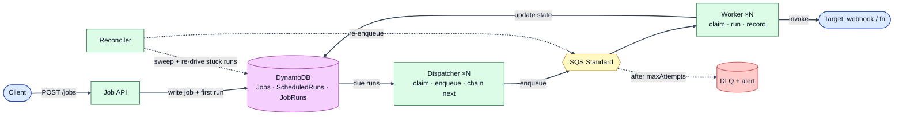
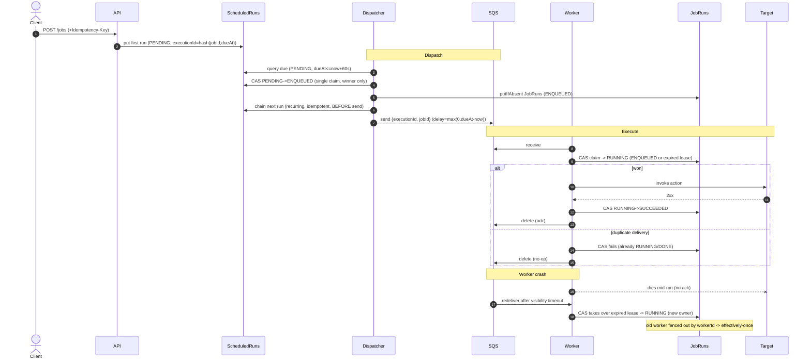

# Distributed Job Scheduler — Simple (but Scalable & Fault-Tolerant) Design

> Companion to `distributed-job-scheduler-hld.md`. This version answers one question:
> **"What is the *smallest* design that still schedules jobs reliably at 100M executions/day with no single point of failure — without the heavy machinery (no ZooKeeper, no lease table, no separate planner, no outbox)?"**
>
> **Answer: 3 tables + stateless dispatchers + SQS + idempotent workers.** All correctness comes from **two ideas** — a **deterministic execution id** and **conditional writes** — not from distributed locks or a coordination service.

---

## 1. The Core Idea (in plain English)

A job scheduler is really just three moving parts:

1. **A durable "what's due soon?" index** — a table you can cheaply ask: *"give me everything that should fire in the next minute."*
2. **A handoff** — move each due item onto a **work queue** so it gets executed exactly by one worker.
3. **Idempotent execution** — workers run the job; if the same job is delivered twice, running it twice is a no-op.

That's the whole system. Everything else (leases, planners, outboxes, ZooKeeper) is an **optimization** you add only when a specific bottleneck forces you to. This doc deliberately stops at the simple core.

> **Mental model:** *durable due-time index → claim → queue → idempotent worker.*

---

## 2. What We Keep vs Drop (vs the full HLD)

| Component (full design) | Keep? | Why |
|---|:---:|---|
| **Jobs table** (source of truth) | ✅ Keep | Must store the job definition + schedule. |
| **ScheduledRuns table** (sharded time-bucket) | ✅ Keep | The durable "due-soon" index — the heart of the system. |
| **JobRuns table** (execution state/history) | ✅ Keep | Needed for retries, dedup, and status queries. |
| **SQS Standard + DLQ** | ✅ Keep | Per-message visibility timeout = free "lease" on a work item; DLQ for poison jobs. |
| **Stateless Dispatchers** | ✅ Keep | Move due rows → SQS. Cheap, horizontally scalable. |
| **Stateless Workers** | ✅ Keep | Execute the target; idempotent. |
| **Reconciler** (tiny sweeper) | ✅ Keep | Backstop for rows stuck mid-flight. One cron loop. |
| **ZooKeeper / etcd** | ❌ Drop | We don't elect leaders or assign partitions. Correctness comes from conditional writes instead. |
| **Lease table + shard ownership** | ❌ Drop | Not needed for correctness — overlapping scans are deduped by the claim CAS. (Add later only to cut wasted scans.) |
| **Separate Planner service** | ❌ Drop | Recurring jobs **chain themselves forward** (dispatch of run N writes run N+1). No horizon pre-expansion. |
| **Transactional Outbox + Streams + Publisher** | ❌ Drop | Reconciler re-enqueues any gap. Add outbox only under explicit "atomic DB+publish" pressure. |
| **Redis distributed lock** | ❌ Drop | Redundant with SQS visibility timeout + conditional writes; adds a failure mode (lock TTL vs job runtime). |

**Net effect:** no coordination service, no leases, no planner, no outbox, no Redis — yet still scalable and fault-tolerant. Fewer boxes, fewer failure modes.

---

## 3. Requirements (brief)

**Functional**
- Schedule a **one-time** job at time `T`, or a **recurring** job (cron + timezone).
- Execute an action (webhook / enqueue / function) with **retries + backoff**, then **DLQ**.
- Query job status & history.

**Non-functional**
- **No lost jobs**; **effectively-once** execution (at-least-once delivery + idempotent workers).
- Dispatch within **~a few seconds** of the due time.
- **100M executions/day** (~1.2k/s avg, ~5k/s peak); **no single point of failure**.

---

## 4. Architecture (6 boxes)



**Data plane in one line:** API writes the job + its first due row → dispatchers move due rows into SQS → workers execute idempotently → reconciler cleans up stragglers.

> *This is the high-level view. The **DynamoDB** box holds the 3 tables (§5); the exact per-table reads/writes (dispatcher claims `ScheduledRuns`, writes `JobRuns`, reads `Jobs`; worker reads `Jobs`, updates `JobRuns`) are shown in the §7 flows.*

---

## 5. Data Model (3 tables, DynamoDB)

### 5.1 `Jobs` — the definition (source of truth)
| Field | Example | Notes |
|---|---|---|
| `jobId` (PK) | `job_abc` | |
| `tenantId` | `t_42` | multi-tenancy |
| `type` | `RECURRING` \| `ONCE` | |
| `cronExpr` | `*/5 * * * *` | recurring only |
| `timezone` | `America/New_York` | IANA tz → correct DST |
| `target` | `{type: WEBHOOK, url, payload}` | what to run |
| `retryPolicy` | `{maxAttempts: 5, backoff: EXP}` | |
| `status` | `ACTIVE` | lifecycle; `PAUSED`/`CANCELLED` arrive with cancel/pause → §12 |
| `version` | `7` | optimistic concurrency |

### 5.2 `ScheduledRuns` — the durable "due-soon" index (the heart)
| Field | Example | Notes |
|---|---|---|
| `pk` (PK) | `2026-07-20T10:05#7` | **`timeBucket#shardId`** — see §10 |
| `dueAt` (SK) | `2026-07-20T10:05:30Z` | range-queried |
| `executionId` | `hash(jobId, dueAt)` | **deterministic** — see §6 |
| `jobId` | `job_abc` | |
| `status` | `PENDING` → `ENQUEUED` | claim state (single CAS; optional `SCHEDULING` step → §12) |
| `ttl` | `dueAt + 1h` | auto-clean after dispatch |

> Query for "what's due soon" = `pk in {bucket#shard}` over the recent + upcoming buckets AND `dueAt <= now+60s` (covers upcoming **and** overdue). A **sort-key range scan** per partition — fast and cheap. (Full look-ahead + catch-up query in §7.2.)

### 5.3 `JobRuns` — execution state & history
| Field | Example | Notes |
|---|---|---|
| `executionId` (PK) | `hash(jobId, dueAt)` | same id everywhere |
| `jobId` / `dueAt` | | |
| `status` | `ENQUEUED` → `RUNNING` → `SUCCEEDED` \| `FAILED` \| `DEAD` | |
| `attempt` | `2` | retry count |
| `workerId`, `startedAt`, `endedAt` | | who/when; `workerId` acts as the **fencing token** |
| `leaseExpiry` | `startedAt + visibilityTimeout` | mirrors the SQS lease → lets a new worker take over a dead one |
| `error` / `result` | | debugging + audit |

---

## 6. The Two Ideas That Give Correctness

This is the part to *really* understand — it replaces all the locks and coordination.

### Idea 1 — Deterministic `executionId`
```
executionId = hash(jobId, dueAt)
```
Every concrete firing of a job has **one stable id**, computed the same way by everyone. If the same occurrence gets created or delivered twice, it collides on the same id → the second attempt is a **no-op**, not a duplicate.

### Idea 2 — Conditional writes (compare-and-set) as the only "lock"
Every state transition is a DynamoDB **conditional update**: it only succeeds if the row is in the expected prior state. Only one actor can win each transition.

> **"CAS vs optimistic concurrency control?"** — same thing. A conditional write **is** how you do optimistic concurrency control; "CAS" is just the name of the primitive. And here the **`status` itself is the compare value** (`WHERE status='PENDING'`), so we **don't need a separate `version` counter** on `ScheduledRuns`/`JobRuns` — the state transition is its own guard. (A `version` column only earns its keep for *generic* multi-field edits, e.g. updating a job's schedule or target on the `Jobs` row.)

```text
Claim a due run (dispatcher) — a single conditional write IS the claim:
  UPDATE ScheduledRuns SET status=ENQUEUED
  WHERE pk=? AND dueAt=? AND status='PENDING'          -- the status IS the guard
  → success = "I own it → now send to SQS"; failure = "already claimed, skip"

Claim execution (worker) — claim if free, or steal a dead worker's expired lease:
  UPDATE JobRuns SET status=RUNNING, workerId=?, leaseExpiry=now+visTimeout, attempt=attempt+1
  WHERE executionId=? AND (status='ENQUEUED'
                          OR (status='RUNNING' AND leaseExpiry < now))   -- condition
  → success = "I run it"; failure = "a LIVE worker owns it, drop message"
```

**Why this is enough:** two dispatchers (or two workers) can race on the same item; the database picks exactly one winner. No ZooKeeper, no Redis lock, no leader election. The DB *is* the lock, and it can't disagree with itself.

> **Worked example.** A network hiccup makes SQS deliver `execution_555` to Worker A **and** Worker B.
> - Worker A: `CAS ENQUEUED→RUNNING` ✅ → runs the job.
> - Worker B: claim ❌ (already `RUNNING`, lease still valid) → silently drops the message.
> Result: **executed once**, with zero coordination between the workers.

---

## 7. How It Works (the four flows)

### 7.1 Create a job
1. `POST /jobs` with an **Idempotency-Key** (dedupes client retries of the *creation*).
2. Write the `Jobs` row.
3. Compute the **first** `dueAt`; write one `ScheduledRuns` row (`status=PENDING`, `executionId=hash(jobId, dueAt)`).

> **Where's the Idempotency-Key stored?** Enforced with a **conditional put keyed by the key** (with a ~24h TTL) — cheaply an attribute + GSI on `Jobs`, so it doesn't add a table. A retried `POST` finds the key and returns the original `jobId`. (Same CAS idea, at the API edge.)

### 7.2 Dispatch (stateless dispatchers, N replicas)
```text
every scan (LOOKAHEAD = 60s; LOOKBACK covers max tolerable lag):
  buckets = timeBuckets overlapping [now - LOOKBACK, now + LOOKAHEAD]   # cover overdue + upcoming
  due = query ScheduledRuns
        WHERE pk in { b#shard : b in buckets, shard in 0..N-1 }
          AND dueAt <= now + LOOKAHEAD           # upcoming AND overdue (dueAt < now) in ONE query
          AND status = 'PENDING'
  for run in due:
      if not CAS(run, PENDING -> ENQUEUED):     # one conditional write = the claim
          continue                               # lost race, skip
      putIfAbsent JobRuns(executionId, status=ENQUEUED)
      job = getJob(run.jobId)                     # need target, type, timezone, status
      if job.type == RECURRING:                   # CHAIN FORWARD *before* send (status-gating → §12)
          next = cron.next(dueAt, job.timezone)            # from dueAt, not now (no drift)
          putIfAbsent ScheduledRuns(next, hash(jobId,next), PENDING)
      SQS.send({executionId, jobId}, DelaySeconds = max(0, dueAt - now))
      #  overdue -> 0 (fire now);  future -> SQS holds the msg until dueAt
```
> **Look-ahead + catch-up in one query.** `dueAt <= now + LOOKAHEAD` fetches both **upcoming** runs and any **overdue** ones (`dueAt < now`, e.g. after a dispatcher outage), and each is sent with **`DelaySeconds = max(0, dueAt - now)`** — future runs are held by SQS until their exact time (sub-second firing without scanning right *at* `dueAt`); overdue runs get delay `0` and fire immediately. Crucially, scan the **buckets across `[now - LOOKBACK, now + LOOKAHEAD]`**, not just the current one — a run that slipped a bucket boundary or piled up during downtime sits in a *past* bucket, so a current-bucket-only scan would silently drop it. Keep `LOOKAHEAD ≤ 900s` (SQS's delay cap).

The **chain-forward** line is why we need no Planner: dispatching occurrence N plants occurrence N+1. Because the next row's id is deterministic, planting it twice is harmless. We plant N+1 **before** `SQS.send` on purpose: if the dispatcher crashes in between, the worst case is *this* occurrence is delayed (reconciler re-sends it) — **not the whole recurring series dying**, which is what chaining *after* the send would risk.

> **Why one CAS (not two)?** The claim `PENDING→ENQUEUED` is the *only* transition the dispatcher needs — it's what stops two dispatchers enqueuing the same run, and one atomic claim is unavoidable. Do **CAS-then-send**, so on a normal race only the winner reaches `SQS.send` → **zero duplicate messages**. The one risk is a crash **after the CAS, before the send**, which strands the row as `ENQUEUED` with no message — the **Reconciler** backstops exactly that (§9). An intermediate `SCHEDULING` state would make the reconciler's decisions more *precise* (it could tell "crashed mid-dispatch" from "queued, not yet picked up"), but that's an **optimization, not a correctness requirement** — so we defer it to §12.

### 7.3 Execute (stateless workers, autoscaled on queue depth)
```text
on SQS message {executionId, jobId}:
  # claim: take it if free, OR steal it from a worker whose lease expired
  claimed = CAS(JobRuns[executionId]):
              SET status=RUNNING, workerId=me, leaseExpiry=now+visTimeout, attempt=attempt+1
              WHERE status='ENQUEUED'
                 OR (status='RUNNING' AND leaseExpiry < now)   # dead-worker takeover
  if not claimed:
      delete message; return                 # a LIVE worker owns it -> true duplicate, no-op
  heartbeat: extend SQS visibility AND leaseExpiry while running
  try:
      call target(job)                                        # the actual work
      CAS(SET status=SUCCEEDED WHERE workerId=me AND status='RUNNING')  # fencing: only current owner
      delete message
  catch:
      record error
      if attempt < maxAttempts:
          re-enqueue with exponential backoff (SQS delay; see note for backoff > 15 min)
      else:
          send to DLQ + alert; CAS(-> DEAD); delete message
```

> **Retries longer than 15 min:** SQS's delay caps at 900s, so for a longer backoff we don't hold the message — we write a `ScheduledRuns` row at `now+backoff` (same `executionId`) and delete the SQS message; the **normal due-scan re-enqueues it** when it comes due. This reuses the scheduling path instead of hacking around the SQS limit.

> **Worker-crash recovery (the key subtlety):** worker A claims `RUNNING` then dies. SQS redelivers after the visibility timeout, but the row is still `RUNNING` — so the claim must be able to **take over an expired lease** (`status=RUNNING AND leaseExpiry<now`), not just `ENQUEUED`. The final `SUCCEEDED` write is **fenced by `workerId`**, so if zombie A wakes up it *cannot* complete over the new owner. Set `leaseExpiry` = the SQS visibility timeout so the two expire together.

### 7.4 Sequence (happy path + duplicate + crash)



---

## 8. Why It's Scalable

| Axis | How it scales |
|---|---|
| **Writes / storage** | DynamoDB with **sharded time-bucket key** spreads the hot "current minute" across N partitions (§10). Chain-forward means we store only *near-future* rows, not a huge pre-expanded horizon → small table. |
| **Dispatch** | Dispatchers are **stateless** — add replicas freely. The claim CAS makes overlapping scans safe, so no rebalancing/coordination is required to add capacity. |
| **Execution** | Workers are **stateless competing consumers** on SQS — autoscale on queue depth. Parallelism is unbounded (unlike Kafka, which caps at partition count). |
| **Reads** | "Due-soon" queries are bounded sort-key range scans on a single partition each, spread across shards. |

---

## 9. Why It's Fault-Tolerant (no SPOF)

| Failure | What saves you |
|---|---|
| **A dispatcher dies** | Others keep scanning; there's no owner to lose. Nothing to fail over. |
| **Two dispatchers grab the same run** | `CAS PENDING→ENQUEUED` — exactly one wins; only the winner sends to SQS. |
| **A worker dies mid-execution** | Message isn't deleted → SQS **redelivers** after the visibility timeout; the new worker **takes over the expired lease** (`status=RUNNING AND leaseExpiry<now`); the dead worker is fenced out by `workerId`. |
| **Duplicate delivery (SQS at-least-once)** | Deterministic `executionId` + `CAS ENQUEUED→RUNNING` → second copy is a no-op. |
| **Crash after claim, before send** (row `ENQUEUED`, no SQS msg) | **Reconciler** re-sends runs stuck in `ENQUEUED` past `dueAt + margin` with no `RUNNING`/`SUCCEEDED` (a legitimately delayed message would have fired by then). Safe — deterministic id + worker CAS dedupe. |
| **Worker dead *and* message lost** (row stuck `RUNNING`) | **Reconciler** finds `RUNNING` with `leaseExpiry` long past → resets to `ENQUEUED` and re-enqueues. |
| **Poison job (always fails)** | Retry w/ exponential backoff → **DLQ + alert** after `maxAttempts`. |
| **Backlog after an outage** | Overdue rows are picked up by the **lookback scan** (`dueAt < now`) and fire immediately (delay 0); **rate-limit + jitter** to avoid a thundering herd. |
| **Clock differences** | Use the **DB's time** for "is it due?"; run NTP on hosts. |

> There is **no single point of failure**: every processing role (dispatcher, worker, reconciler) runs as many stateless replicas, and the only shared state is DynamoDB + SQS, both managed & replicated.

---

## 10. Why the Sharded Time-Bucket Key (the one non-obvious bit)

If the partition key were just `timeBucket`, **every** write and read for the current minute would hit **one** DynamoDB partition → throttling (a partition caps ~1,000 WCU / 3,000 RCU) exactly at peak. This is the classic time-series hot-partition trap.

**Fix:** `pk = timeBucket#shardId`, where `shardId = hash(executionId) % N`.
- Writes for the active minute spread across **N partitions**.
- A dispatcher fans its due-scan across `bucket#0 … bucket#(N-1)`.
- Pick `N` so peak WCU on the hot bucket ÷ 1,000 fits with headroom → **N = 64–256** is typical.

```
timeBucket = 2026-07-20T10:05      (1-minute buckets)
shardId    = hash(executionId) % 128
pk         = "2026-07-20T10:05#37"
```

---

## 11. Capacity Estimation

**Throughput**
- 100M/day ÷ 86,400 ≈ **~1,157 exec/s average**; peak 3–5× ≈ **~5,000 exec/s**.

**Writes → why DynamoDB (write-heavy)**
- Per execution ≈ **~4 writes** (claim `PENDING→ENQUEUED`, create next run, then `RUNNING` + `SUCCEEDED` in `JobRuns`).
- Avg ≈ 1,157 × 4 ≈ **~4,600 WCU**; peak ≈ **~20,000 WCU**.
- One partition caps ~1,000 WCU → shard the hot bucket across **≥ ~20** partitions → choose **N = 64–256** for headroom + even spread. (Concrete reason §10's sharding isn't optional.)

**Storage** (small, thanks to chain-forward)
- `ScheduledRuns` holds only **pending one-offs + the *next* occurrence per active recurring job**, not a big horizon → roughly `(activeRecurringJobs + pendingOnce) × ~1KB`.
- `JobRuns` grows with history → keep 7–30 days via **TTL**, archive older to **S3**.

**Queue & workers**
- SQS at ~5k msg/s is trivial (batch up to 10/msg to cut cost ~10×).
- Worker concurrency = rate × avg duration → e.g., 5,000/s × 200ms ≈ **~1,000 concurrent**; at 2s/job ≈ **~10,000**. Autoscale on queue depth.

---

## 12. What We Deliberately Left Out (and when to add it)

| Deferred piece | Add it **only when** |
|---|---|
| **Intermediate `SCHEDULING` state** (3-state claim) | Reconciler re-sends during heavy backlog become wasteful. `SCHEDULING` lets it distinguish "crashed mid-dispatch" (re-drive) from "queued, not yet picked up" (leave to SQS). Costs one extra CAS per dispatch. |
| **Lease table / shard ownership** | Redundant dispatcher scans measurably waste RCUs → assign shards to dispatchers to stop overlap. |
| **Separate Planner (horizon pre-expansion)** | You need future visibility ("show my next 100 runs"), backfill, or very-high-frequency jobs you'd rather batch-expand. |
| **Transactional Outbox + DynamoDB Streams** | The interviewer pushes hard on *atomic* "DB write + SQS publish" (the dual-write gap). Until then, the reconciler covers it. |
| **Overlap control — `concurrencyPolicy` (ALLOW / FORBID / REPLACE)** | Long recurring jobs can overlap themselves. **FORBID**: at *dispatch*, if a **prior** run for this `jobId` (different `executionId`) is still `ENQUEUED`/`RUNNING`, mark this occurrence `SKIPPED` and skip the send — **but still chain-forward** so the series survives. Needs an "active run for `jobId`?" lookup (GSI on `(jobId,status)` or an atomic flag on `Jobs`). |
| **Cancel / pause / resume** | You need to stop or suspend a job (incl. ending a recurring series). Add a `status != ACTIVE → skip/expire the run` check in the dispatch loop, **re-checked at the worker** before invoke — cancel is **best-effort** (you can't un-fire a job already executing). Resume re-seeds one `ScheduledRuns` row. |
| **Priority / fairness queues** | One noisy tenant starves others → per-tenant queues or weighted dispatch. |
| **Job dependencies (DAG)** | Requirements call for workflows, not just independent jobs. |

> **Interview tip:** lead with this simple core, state the two correctness ideas, then name these extensions *by trigger*. Showing you know **when not to add** a component is a stronger signal than adding all of them.

---

## 13. Build vs Buy — Could We Just Use Temporal?

Worth raising proactively: *"Would you build this, or use **Temporal / AWS Step Functions / EventBridge Scheduler**?"* Honest answer: **yes, Temporal can solve most of this** — and in the real world you'd seriously consider it.

### What Temporal gives you for free
Temporal is a **durable-execution engine**: you write workflows as code, and it persists every state transition to an event history, so workflows survive crashes and resume exactly where they left off. It provides out of the box the very things we hand-built:

| Our component | Temporal equivalent |
|---|---|
| `ScheduledRuns` + dispatcher + due-scan | **Durable timers** / **Temporal Schedules** (native cron, pause, backfill, overlap policy) |
| SQS + worker fleet | **Task queues** + **activity workers** (competing consumers) |
| `JobRuns` state machine + CAS + reconciler | **Event-sourced workflow state** + automatic crash recovery (no manual reconciler) |
| Retry policy + backoff + DLQ | **Activity `RetryPolicy`** (backoff, max attempts) |
| `executionId` / Idempotency-Key dedup | **`workflowId` + `WorkflowIdReusePolicy`**; activities still must be idempotent |

So "call this webhook every 5 min" is a few lines: a Schedule that starts a workflow whose one activity is the HTTP call, with a retry policy. Temporal handles the timer, durability, retries, and recovery.

### The catch — it relocates the problem, it doesn't remove it
The scheduling problem is still solved *somewhere* — **inside Temporal's own architecture.** Temporal's server is itself a distributed system backed by a DB (Cassandra/MySQL/Postgres), with **sharded timer queues**, a **matching service** (task queues), and a **history service** (durable state). In other words, **Temporal's internals *are* essentially this design** (sharded due-time storage + durable work queue + idempotent workers). You're choosing to **operate/pay for that platform** instead of building the primitive.

### When Temporal is the *wrong* tool
- **Extreme volume of trivial jobs.** At 100M/day of tiny fire-and-forget timers, Temporal persists a **full event history per workflow** → many DB writes per execution. A lean **SQS + DynamoDB** pipeline has far less per-job overhead and cost for simple "run action at T" work. Temporal shines for **complex, long-running, multi-step, stateful** workflows — not billions of one-shot timers.
- **Tight cost/storage control**, bespoke multi-tenancy, priority, or custom semantics.
- **You're literally building a scheduling product** (then you *are* building the primitive).
- **Operational cost / constraints:** self-hosting Temporal is a real burden; Temporal Cloud removes that but adds spend + a vendor dependency, and workflow code has **determinism constraints**.

### When Temporal (or a managed service) is the *right* tool
- Complex workflows, sagas, human-in-the-loop, durable multi-step state, moderate volume, and you want to **move fast without operating scheduling infra**.
- For a **pure scheduler**, the closest managed product is actually **AWS EventBridge Scheduler** (millions of one-time/cron schedules that invoke a target) — often the real "don't build it" answer. **Step Functions** covers orchestration; **Quartz/Airflow** sit elsewhere on the spectrum.

### The interview-ready position
> *"In production I'd strongly consider **EventBridge Scheduler** for pure scheduling, or **Temporal** for anything workflow-like, rather than build this. But Temporal doesn't eliminate the problem — its own internals are a sharded durable-timer + task-queue system, i.e. exactly this design. So if we're at a volume/cost profile where per-workflow overhead is too high, or we're building the scheduling primitive itself, the lean SQS + DynamoDB design here is the right call. Knowing **when to buy vs build** is the real answer."*

---

## 14. Does This Design Handle the Classic Critiques?

A quick self-audit against the standard critiques and follow-up questions for a job scheduler:

| Critique / follow-up | Handled? | How this design covers it |
|---|:---:|---|
| **Missing execution dedup** (double-scheduled; watcher restart → duplicate side effects) | ✅ | Deterministic `executionId = hash(jobId,dueAt)` (§6) collapses any duplicate of the same occurrence; `putIfAbsent JobRuns` + worker **CAS** claim (§6, §7.3) → one executor; **Idempotency-Key** dedupes *creation* (§7.1). Watcher restart just re-scans. |
| **Unclear recurring handling** | ✅ | **Chain-forward** (§7.2): dispatching occurrence N plants N+1, computed from `dueAt` (no drift), idempotent via deterministic id; reconciler re-derives if lost (§9). |
| **Sub-15-min frequency** (e.g., every minute) | ✅ | Frequency is governed by **`ScheduledRuns` rows** (one per occurrence), not SQS delay — so SQS's 15-min cap never limits how often a job runs. The dispatcher looks ahead ~60s and uses `DelaySeconds = max(0, dueAt-now)` only for sub-window firing precision (§7.2). |
| **Worker fails mid-execution → retry without duplicates** | ✅ | SQS redelivery + **lease takeover** (`status=RUNNING AND leaseExpiry<now`) + **fencing by `workerId`** (§7.3, §9); reconciler backstop; deterministic id keeps it one logical execution. |
| **Scale the dispatcher without double-scheduling** | ✅ | Stateless dispatchers + **optimistic lock** `CAS PENDING→ENQUEUED`, **CAS-then-send** so only the winner sends (§7.2, §9). No leader/lease; leases only to cut scan waste (§12). |
| **Timezone / DST for cron** | ⚠️ | Present: IANA tz per job (§5.1) + `cron.next(dueAt, tz)` → UTC `dueAt` (§7.2). **To add:** policy for spring-forward (nonexistent) / fall-back (ambiguous) local times + misfire/catch-up. |
| **Monitor/alert on failing or slow jobs** | ⚠️ | Present: DLQ + alert (§4, §9), error logs in `JobRuns` (§5.3), stuck detection via `leaseExpiry` + reconciler. **To add:** metrics — dispatch lag (due-but-`PENDING`), delay p50/p99, failure rate, DLQ depth, stuck-`RUNNING` count. |

> The five ✅ rows are core to the design (a couple are *better* than the common SQS-delay approach — e.g., sub-minute frequency, since *scheduling* is anchored in `ScheduledRuns`, with SQS delay used only for ≤60s firing precision). The two ⚠️ rows — **DST edge-case policy** and **observability metrics** — are the known thin spots worth calling out verbally.

---

## 15. Interview Talking Track (say this)

> *"Three tables: **Jobs** (definitions), **ScheduledRuns** (a durable due-soon index keyed by a **sharded time-bucket** so the hot minute doesn't throttle), and **JobRuns** (execution state). Stateless **dispatchers** scan `dueAt ≤ now+60s` (upcoming **and** overdue), **claim each row with a conditional write**, send `{executionId, jobId}` to **SQS** with `DelaySeconds = max(0, dueAt−now)` so it fires at the right time, and **chain the next occurrence** so recurring jobs perpetuate themselves — no planner needed. Stateless **workers** claim `ENQUEUED→RUNNING` with another conditional write, execute, and ack; failures retry with backoff then go to a **DLQ**. Correctness is just two ideas — a **deterministic executionId** and **conditional writes** — which give effectively-once with **no ZooKeeper, no leases, no Redis lock**. Crashes are covered by SQS redelivery plus a small **reconciler**. It scales by adding stateless replicas and sharding the DynamoDB key; at 100M/day that's ~5k/s peak, ~20k WCU peak across ~64–256 shards."*

---

## 16. Failure Scenarios & Recovery

### 1. Dispatcher Failures

**1a. Dispatcher dies before CAS**
```text
Dispatcher scans due rows
CRASHES before CAS(PENDING → ENQUEUED)

ScheduledRuns: status = PENDING   ← untouched
SQS:           no message

Recovery:
  Other dispatchers scan same shard
  One wins CAS → normal dispatch
  Zero impact — stateless dispatchers self-heal
```

**1b. Dispatcher dies after CAS, before SQS.send**
```text
CAS(PENDING → ENQUEUED) succeeds
CRASHES before SQS.send

ScheduledRuns: status = ENQUEUED  ← stuck
JobRuns:       status = ENQUEUED  ← created via putIfAbsent
SQS:           no message         ← never sent

Workers: blind, nothing in SQS to receive
leaseExpiry: cannot help, no RUNNING row

Recovery:
  Reconciler sweeps JobRuns
  WHERE status = ENQUEUED
  AND dueAt + margin < now
  AND no RUNNING/SUCCEEDED exists
  → re-enqueues to SQS → Worker picks up ✅

Lag: Reconciler sweep interval (30-60s)
```

**1c. Dispatcher dies after SQS.send, before chain-forward**
```text
CAS succeeds
SQS.send succeeds
CRASHES before putIfAbsent next ScheduledRun

SQS:           message exists → Worker will execute run N ✅
ScheduledRuns: run N+1 NEVER planted → recurring job silently stops ❌

Recovery:
  Reconciler checks: SUCCEEDED runs for RECURRING jobs
  with no successor PENDING row
  → computes next = cron.next(dueAt, timezone)
  → putIfAbsent ScheduledRuns(next, hash(jobId,next), PENDING)

Note: this is why chain-forward is placed BEFORE SQS.send
in the dispatch flow — reduces this window to zero on
happy path. Reconciler is the backstop only.
```

**1d. Two dispatchers scan same run simultaneously**
```text
Dispatcher-1 and Dispatcher-2 both see run_555 (PENDING)

Dispatcher-1: CAS(PENDING → ENQUEUED) ✅ → proceeds
Dispatcher-2: CAS(PENDING → ENQUEUED) ❌ → status no longer PENDING
              → continue (skip)

Only Dispatcher-1 sends to SQS.
Zero duplicate messages on happy path.
```

---

### 2. Worker Failures

**2a. Worker crashes before CAS (status = ENQUEUED)**
```text
SQS delivers msg to Worker-A
Worker-A CRASHES before CAS(ENQUEUED → RUNNING)

JobRuns: status = ENQUEUED  ← untouched
SQS:     msg not deleted    ← redelivered after visibility timeout

Recovery:
  SQS redelivers to Worker-B
  Worker-B: CAS(ENQUEUED → RUNNING) ✅ → normal claim
  Executes → SUCCEEDED ✅

Lag: SQS visibility timeout (e.g. 30s)
Reconciler: not needed
```

**2b. Worker crashes mid-execution (status = RUNNING)**
```text
Worker-A claimed job → status = RUNNING, leaseExpiry = T+30s
Worker-A CRASHES mid-execution

JobRuns: status = RUNNING    ← stuck
SQS:     msg not deleted     ← redelivered after visibility timeout

Recovery path 1 — lease takeover (primary):
  SQS redelivers to Worker-B at T+30s
  Worker-B: CAS WHERE status='RUNNING' AND leaseExpiry < now ✅
  → steals job, workerId = Worker-B, leaseExpiry = T+60s
  → executes → SUCCEEDED ✅
  Lag: SQS visibility timeout (30s)

Recovery path 2 — Reconciler (backstop):
  If SQS message also lost:
  Reconciler finds RUNNING with leaseExpiry long past
  → resets to ENQUEUED → re-enqueues to SQS
  → Worker-C picks up → executes ✅
  Lag: Reconciler sweep interval (30-60s)
```

**2c. Zombie worker (slow, not crashed)**
```text
Worker-A claims → leaseExpiry = T+30s
Worker-A is slow (GC pause), misses heartbeat
T+30s: lease expires
Worker-B steals → workerId = Worker-B

T+45s: Worker-A wakes up, finishes job
       tries CAS(RUNNING → SUCCEEDED WHERE workerId='Worker-A')
       workerId is now 'Worker-B' → CAS FAILS
       Worker-A fenced out ✅

Worker-B continues → SUCCEEDED normally ✅
Result: executed exactly once
```

**2d. Duplicate SQS delivery (at-least-once)**
```text
SQS delivers execution_555 to Worker-A AND Worker-B
(network hiccup, SQS standard behaviour)

Worker-A: CAS(ENQUEUED → RUNNING) ✅ → executes
Worker-B: CAS(ENQUEUED → RUNNING) ❌ (already RUNNING, lease valid)
          → deletes msg → returns

Result: executed once ✅
```

**2e. Worker fails after SUCCESS, before DeleteMessage**
```text
Worker-A executes → marks SUCCEEDED
CRASHES before SQS.DeleteMessage

SQS redelivers msg to Worker-B
Worker-B: CAS(ENQUEUED → RUNNING) ❌ (status = SUCCEEDED)
          → deletes msg → returns (no-op) ✅

Result: no re-execution ✅
```

---

### 3. SQS Failures

**3a. SQS message lost after send**
```text
Dispatcher sends to SQS
SQS loses the message (extremely rare but possible)

JobRuns: status = ENQUEUED  ← stuck
SQS:     no message

Recovery:
  Reconciler finds ENQUEUED past dueAt + margin
  → re-enqueues to SQS
  Worker picks up → executes ✅
```

**3b. Backoff exceeds SQS 15-min delay limit**
```text
Job fails, attempt N, backoff = 2^N × base = e.g. 30 min
SQS DelaySeconds max = 900s (15 min) → cannot use SQS delay

Recovery:
  Worker writes ScheduledRuns row:
    dueAt = now + backoff (e.g. now + 30min)
    executionId = original (unchanged)  ← same logical execution; attempt continues
    status = PENDING
  Deletes SQS msg
  Normal dispatcher due-scan picks it up when dueAt arrives
  → re-enqueues at correct time ✅
```

**3c. Poison job (always fails)**
```text
Job fails on every attempt
Retries with exponential backoff after each failure
After maxAttempts exhausted:
  Worker: CAS(→ DEAD)
  Sends to DLQ + alert
  Deletes SQS msg
  No further retries ✅
```

---

### 4. Database Failures

**4a. DynamoDB partition throttling**
```text
Hot time-bucket partition exceeds 1,000 WCU cap
Dispatcher writes/reads throttled

Recovery:
  shardId spreads load across N=128 partitions
  Peak 20,000 WCU / 128 = ~156 WCU per partition → safe
  Add shards if throttling observed
```

**4b. DynamoDB unavailable briefly**
```text
Dispatcher cannot write → CAS fails → skips run
Worker cannot update JobRuns → retries with backoff

Recovery:
  Once DynamoDB recovers:
  Dispatcher scans pick up overdue runs (dueAt < now)
  → delay=0 → fire immediately
  Backlog drains automatically
```

---

### 5. Reconciler Failures

**5a. Reconciler crashes**
```text
With leaseExpiry design:
  Worker crashes → Worker-B steals via expired lease → self-healing
  Reconciler not needed for primary crash recovery

  Only affected:
  → ENQUEUED rows with no SQS message (dispatcher crash mid-send)
  → RUNNING rows where SQS message also lost (rare)

  These jobs stuck until Reconciler restarts
  Acceptable lag: Reconciler restart time (seconds with k8s)

Without leaseExpiry (lastUpdatedAt only):
  Reconciler is primary recovery path
  Crash = jobs stuck in RUNNING until restart
  → make Reconciler HA (2 instances, partition by jobId)
```

**5b. Reconciler false positive (re-enqueues live job)**
```text
Reconciler detects ENQUEUED row
Re-enqueues to SQS
But Worker already has the original message and is RUNNING

Two SQS messages for same executionId
Worker-A (original): RUNNING, lease valid
Worker-B (reconciler msg): CAS fails (RUNNING, lease valid) → drops

Result: no duplicate execution ✅
Worker CAS is the safety net for Reconciler false positives
```

---

### Summary Table

| Failure                                  | Detected by       | Recovery                      | Lag                |
| ---------------------------------------- | ----------------- | ----------------------------- | ------------------ |
| Dispatcher dies before CAS               | Other dispatchers | Re-scan naturally             | ~poll interval     |
| Dispatcher dies after CAS, before send   | Reconciler        | Re-enqueue stuck ENQUEUED     | 30-60s             |
| Dispatcher dies after send, before chain | Reconciler        | Re-plant next run             | 30-60s             |
| Worker dies before CAS                   | SQS redeliver     | Next worker claims ENQUEUED   | visibility timeout |
| Worker dies mid-execution                | SQS + leaseExpiry | Next worker steals lease      | visibility timeout |
| Zombie worker wakes up                   | workerId fencing  | CAS blocks stale write        | instant            |
| Duplicate SQS delivery                   | Worker CAS        | Second worker drops msg       | instant            |
| SQS message lost                         | Reconciler        | Re-enqueue stuck ENQUEUED     | 30-60s             |
| Backoff > 15min                          | Worker            | Write new ScheduledRuns row   | at backoff time    |
| Poison job                               | DLQ               | Alert after maxAttempts       | —                  |
| DynamoDB throttling                      | Sharding          | Spread across N partitions    | —                  |
| Reconciler crashes                       | leaseExpiry       | Workers self-heal for RUNNING | restart time       |

---

### TL;DR
**Durable due-time index → conditional-write claim → SQS → idempotent worker → chain next run.** Scalable (stateless replicas + sharded key), fault-tolerant (SQS redelivery + reconciler + CAS), and simple (no coordination service, no leases, no planner, no outbox).
