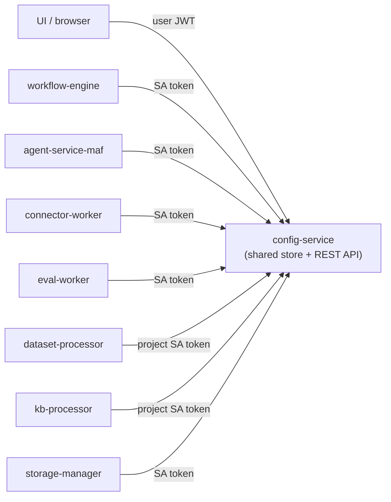
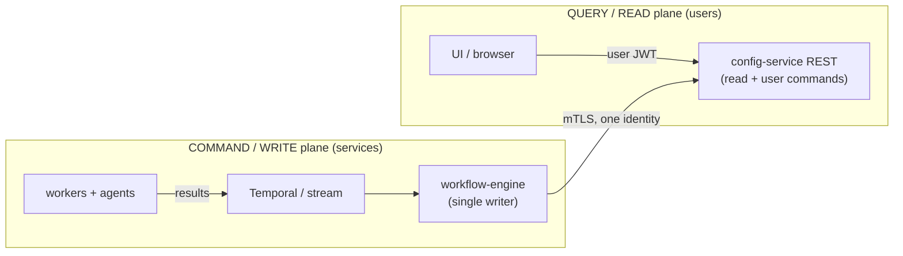
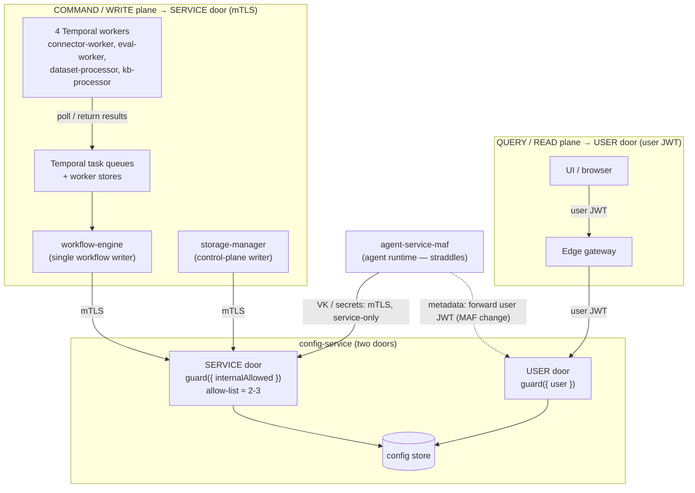

# Proposal: Simplifying Service-to-Service Authorization in AgentStudio

> **Status:** Proposal for leadership review · **Author:** Platform / Security ·
> **Decision sought:** approve a phased program to (1) ship a single caller-aware
> authorization guard, and (2) separate AgentStudio's **command (write)** and
> **query (read)** planes so service-to-service traffic stops being a source of
> outages and authorization complexity.
>
> **Companion design doc:** `docs/design/single-guard-mesh-identity.md` (the
> concrete Phase-1 engineering design). This document is the **why** and the
> **roadmap**; that one is the **how** for Phase 1.

---

## 1. Executive summary

AgentStudio's internal services (workers, the orchestrator, agent runtimes) talk
to **config-service** — our central configuration and state store — over the
**same** project-scoped REST API that the user interface uses. Seven distinct
backend identities write into that surface, authenticating with Keycloak
service-account tokens that were never shaped for it. This co-mingling has three
costs:

1. **Outages.** A live example: dataset import failed in production with
   `401 token_shape_invalid` because a background worker presented a
   service-account token to a route guarded for *user* tokens. The same class of
   bug recurs whenever a new API forgets to ask "who calls this?"
2. **Authorization complexity.** Authorization decisions have to be made
   **per-route**, sometimes **per-HTTP-method**, because one URL group is used by
   users *and* services with different trust. This is error-prone and hard to
   audit.
3. **Maintenance surface.** A **7-principal** allow-list to keep correct, plus a
   per-route (sometimes per-HTTP-method) policy that is easy to get wrong. *Note:
   with the mesh's tight per-(principal, path) allow-list, a compromised worker is
   already bounded to its own granted paths — so this is mainly a maintainability /
   clarity cost, not an unbounded blast-radius risk.*

We propose a **two-part program**:

- **Phase 1 (approved-and-go):** replace three stacked auth middlewares with **one
  caller-aware guard**, and authenticate services by their **mTLS workload
  identity** (the service mesh) instead of a Keycloak token. This fixes the bug
  class and is already designed and partially de-risked (the mesh is live).
- **Phase 2 (recommended next):** **collapse the seven east-west callers to ~two**
  by routing all *workflow* writes through the orchestrator we already run
  (Temporal). The four Temporal workers fold into workflow-engine; an agent runtime
  moves to the user door; only workflow-engine plus a control-plane writer such as
  `storage-manager` remain — shrinking the service allow-list **7 → ~2–3** and
  collapsing per-route guards to **per-door**. This is a **maintainability** win
  (fewer callers/paths to keep correct), *not* a blast-radius fix — see the
  honest-scoping note below.
- **Phase 3 (optional, later):** fully **separate the write plane from the read
  plane** (an event-driven ingestion path), so config-service's API becomes
  read-and-user-command only. This is the cleanest end-state but the largest lift.

**The ask:** approve Phase 1 to ship now; fund a short spike for Phase 2; note
Phase 3 as directional. Phases 2–3 are **optimizations, not prerequisites** —
Phase 1 stands on its own.

> **Honest scoping (given the mesh).** Phase 1 already authenticates every service
> by mTLS and authorizes it with a tight per-(principal, path) allow-list, so a
> compromised worker is **bounded to its own granted paths** — **blast radius is not
> the motivation** for Phase 2. Per-project (tenant) isolation is likewise handled
> **within Phase 1** by the single guard's §10 (audit by default; an
> orchestrator-minted capability token for hard isolation). Network isolation of the
> service surface is reachable via a mesh `AuthorizationPolicy` path-deny. Therefore
> **Phases 2–3 are maintainability and architecture improvements** — per-door instead
> of per-route guards, a smaller allow-list, a single writer — **not** security
> necessities. Pursue them for long-term simplicity, not to close an open gap.

---

## 2. Background — why this hurts today

### 2.1 The incident
A Temporal worker called config-service to update a dataset's status. config-service
guards that route for **users** (it expects a user's email and per-project
permission claims). The worker, being a machine, presented a `client_credentials`
token with neither — so the request was rejected `401`, and dataset import failed.
The originating user's request had ended long before the background work ran, so
"just forward the user's token" was not available.

### 2.2 The systemic shape
The incident is a symptom. config-service is a **shared store** with two very
different kinds of caller hitting one REST surface:

Because users and **seven** services share the same `/api/v1/projects/:id/...`
routes, every route needs a per-caller answer to "user, service, or both?" — and
some route groups are **mixed at the method level** (e.g. a user may *read* an
evaluation run, but only a worker may *write* its results). That is irreducible
complexity **as long as the surface is shared**.

### 2.3 What it costs, concretely
- **Per-route / per-method authorization policy** that is easy to get wrong (the
  bug) and hard to audit.
- A **7-principal allow-list** to maintain on config-service.
- **Per-project worker tokens** (`dataset-processor`, `kb-processor`) whose presence
  complicates auth and credential management. (Their *isolation* posture — and the
  sensitive `POST …/credentials/:id/secret-data` route — is bounded at Phase 1 by the
  mesh allow-list + §10; the cost here is the **management/clarity** overhead of the
  extra credentials, not an unbounded risk.)

---

## 3. Phase 1 — one caller-aware guard (already designed)

The first step does **not** change the topology; it makes the existing surface
safe and simple to reason about. Full design: `single-guard-mesh-identity.md`.

**Principle:** *the user's identity is a JWT (north-south); the service's identity
is its mTLS certificate (east-west). One guard routes each request by who the
caller cryptographically is.*

- Replace `ContextGuard → RolesGuard → PermissionsGuard` (three middlewares) with
  **one** `guard(policy)`.
- Authenticate services by **mTLS / SPIFFE** workload identity, verified by the
  service mesh (Istio) that is **already live** in `agentstudio-services`. The
  service mesh certificate, which a caller cannot forge, selects the service lane.
- **Drop the service-account token** from AgentStudio-internal calls (kept only
  for external systems that validate it themselves — Lakekeeper, Keycloak,
  Bifrost).
- Per-project authorization for **users** stays in the app (it is the one check a
  mesh cannot do); everything else is offloaded to the mesh.

**Why it's low-risk:** the mesh (STRICT mTLS, request authentication, the
allow-list mechanism) is already running in production; the change is additive and
route-by-route reversible; it has a test per caller-shape.

**What it leaves on the table:** the *topology* is unchanged, so genuinely mixed
route groups still need policy declared at the route (or method) level. That is
what Phases 2–3 remove.

---

## 4. The deeper opportunity — separate the planes

The single guard makes the shared surface **safe**. The architecture program makes
it **simple**, by attacking the root cause: the shared surface itself.

> **North star:** separate the **command/write plane** (services, one uniform
> service identity) from the **query/read plane** (users, one uniform user
> identity). When every route has exactly **one** audience, authorization becomes
> a per-door decision and the allow-list shrinks — a **maintainability** win (the
> isolation posture is already bounded at Phase 1 by the mesh + §10).

Target topology:

We can reach this in **graduated steps**, each independently valuable.

---

## 5. The simplification ladder

Each level is a self-contained increment. The columns that matter to leadership
are **guard complexity**, **allow-list size**, **tenant-isolation risk**, and
**effort/risk**.

### Level 0 — today's direction: the single guard (Phase 1)
- **Guard:** one middleware; mixed route groups need per-route/method policy.
- **Allow-list:** 7 principals on config-service.
- **Tenant isolation:** per-project worker tokens dropped; service-lane trust is
  service-granular (compensated by per-path allow-list + audit).
- **Effort:** in progress. **Risk:** low (mesh already live).

### Level 1 — two doors (split by direction)
Put all east-west writes behind a **service router/listener** and all UI traffic
behind the **user router**. Each door carries exactly **one** policy.
- **Guard:** per-**door**, never per-route. *"Mixed" route groups disappear.*
- **Allow-list:** still 7, but confined to the service door.
- **Tenant isolation:** unchanged from Level 0.
- **Effort:** medium. **Risk:** low. **Payoff:** removes per-route auth reasoning.
- *Wrinkle:* a few endpoints are read by both (e.g. listing evaluation runs);
  expose those on the user door and give workers a narrow service-read endpoint.

### Level 2 — one east-west principal (orchestrator-mediated writes) — **recommended**
The four **Temporal** workers stop calling config-service directly. They return
results to Temporal (activity results / signals), and **workflow-engine** persists
them as the **single workflow writer**; it also *fetches inputs* (e.g. secrets) and
passes them to the workers as activity inputs. Those workers then talk only to task
queues and their own stores.
- **Guard:** config-service's service lane is dominated by **one** caller
  (workflow-engine) — trivial to reason about and audit.
- **Allow-list:** **7 → ~2–3** — the four Temporal workers fold into
  workflow-engine; `storage-manager` (standalone control-plane writer) and
  `agent-service-maf` (for its **VK / secret** reads) remain on the service door,
  while MAF's **metadata** reads can move to the **user** door if it forwards the
  user JWT. (See **Appendix C** for the per-caller verification, including MAF's
  metadata-vs-secret split.)
- **Tenant isolation:** removing these callers also removes the §10 service-lane
  projectId gap *for them* — but the mesh + §10 already **bound** this at Phase 1
  (audit by default; capability token for hard isolation). So treat this as a
  *simplification* of §10, **not** a new security control.
- **Effort:** medium-high. **Risk:** medium — concentrates writes through
  workflow-engine (already the orchestrator; mitigated by its existing retry /
  durability guarantees).
- **Leverages what we already run:** Temporal is the backbone; workflow-engine
  already owns these workflows.

### Level 3 — invert writes entirely (event-driven / CQRS)
config-service's HTTP API becomes **read + user-command only**; all
service-produced state flows in through an **ingestion plane** (a stream + a
projector). We already have the **precedent in production**: workflow-engine keeps
a *progress store* that config-service **polls**, and connector-worker already uses
**Redis Streams**. Generalize that pattern.
- **Guard:** essentially **user-only** (plus a tiny read-only service surface).
- **Allow-list (writes):** **→ 0**.
- **Tenant isolation:** fully sidestepped; mixed routers and dual-write policies
  cease to exist.
- **Effort:** high (eventual consistency, a projector, event-schema design; no
  general event bus today — only Redis Streams + Temporal). **Risk:** medium-high.
- **When it's worth it:** only if/when we are independently moving to an
  event-driven model.

### Recommended target — Level 1 + Level 2 combined

The recommended end-state (everything except the optional Level 3 inversion)
separates read/write at **both** the caller level (one writer) **and** the surface
level (two doors):

**How to read it:**
- **Level 1 (two doors):** config-service is split into a **USER door** (uniform
  user guard) and a **SERVICE door** (uniform service guard, reachable in-mesh only).
- **Level 2 (fold the workers):** the **four Temporal workers never touch
  config-service** — note there is *no arrow* from them to it. They poll Temporal
  and return results; **workflow-engine** is the single *workflow* writer that
  persists through the service door (and fetches inputs such as secrets for them).
- **The ones that don't fold:** `storage-manager` is a standalone control-plane
  writer that keeps its own **SERVICE door** identity. `agent-service-maf`
  **straddles**: its **metadata** reads (agents, mcp-servers, model metadata — also
  used by the UI) can move to the **USER door** *if MAF forwards the user JWT* (a
  change — today it uses its own SA token), which gives **central** per-project
  enforcement; but its **VK / provider-secret** reads must stay on the **SERVICE
  door** (service-only — a secret can't be handed to a user), so per-project there
  stays service-granular (gated at MAF's edge, or removed by gateway-side VK
  injection). Service-door allow-list ≈ **2–3** (workflow-engine, storage-manager,
  and MAF's VK reads unless injected).
- **Net:** a small (~2–3) service allow-list, no per-project worker tokens, no mixed
  routers, and the sensitive `secret-data` route reachable **only** by
  workflow-engine. The remaining synchronous service writes are what Level 3 would
  later replace with an event/ingestion path (service write surface → 0).

---

## 6. Side-by-side

| | L0 single guard | L1 two doors | L2 one writer | L3 event-driven |
| --- | --- | --- | --- | --- |
| Auth decision granularity | per-route/method | per-**door** | per-**door** (1 caller) | per-door (read-only svc) |
| config-service service callers | 7 | 7 (one door) | **~2–3** (WE, storage-manager, MAF-secrets) | **0** (writes) |
| "Mixed" route groups | exist | gone | gone | gone |
| Per-project worker-token risk | mitigated | mitigated | **eliminated** | **eliminated** |
| Cross-tenant secret-route exposure | scoped allow-list | scoped allow-list | one trusted writer | no service write path |
| New infra required | none (mesh live) | router/listener split | none (Temporal) | stream + projector |
| Effort | in progress | medium | medium-high | high |
| Risk | low | low | medium | medium-high |

> **Read these rows correctly.** The security-flavored rows (per-project risk,
> cross-tenant secret exposure) are **already bounded at L0** by the mesh allow-list
> + §10 — the L1/L2/L3 entries are *simplifications* (fewer callers/paths to keep
> correct), not closures of an open security gap. The columns that actually justify
> L1/L2 are **auth decision granularity**, **allow-list size**, and **"mixed" route
> groups** — i.e. **maintainability**.

---

## 7. Recommended roadmap

1. **Phase 1 — ship the single guard (now).** Roll out on **config-service** first,
   then **workflow-engine**, route-by-route, behind the live mesh. Outcome: the bug
   class is closed; service-account tokens are dropped from internal calls; auth is
   one middleware. *No architecture change.*
2. **Phase 2 — collapse 7 → ~2 (next quarter).** Move worker → config-service writes
   behind workflow-engine via Temporal. Outcome: a ~two-principal service allow-list
   (workflow-engine + control-plane writers) and **per-door instead of per-route
   guards** — i.e. dramatically simpler east-west auth **maintenance**. (Not a
   blast-radius/isolation fix — those are bounded at Phase 1; see §1 honest scoping.)
   *Best maintainability return for the architectural risk, and it reuses Temporal.*
3. **Phase 3 — plane inversion (directional).** Adopt an ingestion plane for
   service-produced state if/when we move event-driven. Outcome: config-service's
   write surface for services goes to zero. *Optional; revisit when the eventing
   investment is justified on its own.*

Phases are **independently shippable and reversible**. We recommend committing to
**Phase 1 + Phase 2** and treating **Phase 3** as a north-star to design toward,
not a near-term commitment.

---

## 8. Risks and mitigations

| Risk | Mitigation |
| --- | --- |
| Mesh-dependent auth (Phase 1) | Mesh is already live in `agentstudio-services`; roll out in PERMISSIVE first; per-route reversible. |
| Concentrating writes through workflow-engine (Phase 2) | It already orchestrates these flows; Temporal gives durability/retry; add backpressure + monitoring. |
| Eventual consistency (Phase 3) | Scope to entities that tolerate it; keep synchronous read-after-write where users expect it. |
| Migration regressions | Convert one service / one route at a time; a test per caller-shape; dual-run new guard beside the old chain. |
| Per-project isolation loss (L0/L1) | Per-(principal, path) allow-list + audit logging; eliminated outright at L2. |

---

## 9. Decision asks

1. **Approve Phase 1** (single guard + drop internal SA tokens) for immediate
   rollout on config-service then workflow-engine.
2. **Fund a 1–2 week spike for Phase 2** to validate orchestrator-mediated writes
   (7 → ~2 east-west principals) and size the migration.
3. **Endorse the north star** (command/query plane separation) as the design
   direction so new services are built read/write-plane-aware from day one — the
   single most effective way to stop this bug class from recurring.

---

## Appendix A — concrete illustrations

- **The bug (Phase-1 motivation).** Worker → `PUT /projects/:id/datasets/:id/status`
  with a service-account token → `401 token_shape_invalid` on a user-guarded route.
- **A "mixed" route group (topology motivation).** Under
  `/projects/:id/evaluation/agents/runs`: a user may *start*, *list*, *read*,
  *cancel* a run and *read* its audit trail; only the **eval-worker** may *write*
  run results (`PATCH …/runs/:id`) or *append* audit events
  (`POST …/runs/:id/audit-events`). One URL group, three different trust levels —
  exactly the co-mingling the plane split removes.
- **The cross-tenant-secret route (attack-surface motivation).**
  `POST …/credentials/:id/secret-data` returns a client secret; it must be reachable
  by *only* one service for *only* that path. At Level 2 there is a single trusted
  writer; the broad worker-credential risk is gone.

## Appendix B — glossary

| Term | Meaning |
| --- | --- |
| **North-south** | Traffic from a human user (browser → gateway → service). |
| **East-west** | Traffic between backend services (pod → pod). |
| **mTLS / SPIFFE** | Mutual TLS where each workload has a cryptographic identity (SPIFFE id) issued by the mesh. The basis for authenticating services without tokens. |
| **Service mesh (Istio)** | The infrastructure layer that gives every pod an identity, encrypts pod-to-pod traffic, and can authorize "which service may call which path." Already live. |
| **Service-account (SA) token** | A Keycloak machine token (`client_credentials`). Today used for service auth; the source of the bug; dropped internally in Phase 1. |
| **Allow-list** | The mesh policy listing which service identities may call which paths. |
| **Command/Query plane split (CQRS)** | An architecture where writes (commands) and reads (queries) flow through separate paths, so each path has one audience and one trust model. |
| **Temporal** | The durable workflow/orchestration engine AgentStudio already runs; the natural single writer for Phase 2. |

## Appendix C — per-caller verification under Level 1 + Level 2

Each of config-service's nine caller/endpoint interactions, checked against the
codebase, resolves to a clean lane under the combined target:

| # | Caller today | Endpoint | Under L1 + L2 | Outcome | Pass |
|---|---|---|---|---|---|
| 1 | edge gateway | `/projects/:id/*` CRUD | unchanged | **USER door** — user JWT, per-project scope | ✅ |
| 2 | workflow-engine | `/internal/*` + buckets/datasets/facets/gateway-* | single workflow writer | **SERVICE door** — mTLS, allow-listed | ✅ |
| 3a | agent-service-maf | agents, agent-teams, mcp-servers, model **metadata** (UI also reads) | **dual** — *today uses MAF's own SA token*; target: forward the user JWT | **USER door** (if JWT forwarded) → per-project enforced centrally | ⚠️ needs MAF change |
| 3b | agent-service-maf | model **VK / provider secret** (`readSecretData` → `api_key`) | **service-only** — secret, no user may call | **SERVICE door** — per-project **not** central; gate at MAF edge or inject VK at gateway | ⚠️ service-granular |
| 4 | connector-worker | `POST credentials/:id/secret-data` | **folds** → workflow-engine fetches the secret and injects it | not a caller; secret route reachable only by WE | ✅ |
| 5 | connector-worker | `PUT datasets/:id/facets/acquisition` | **folds** → WE persists result | SERVICE door (via WE) | ✅ |
| 6 | eval-worker | `GET/PATCH runs/:id`, `POST audit-events` | **folds** → WE injects run context, persists results/audit | SERVICE door (via WE) | ✅ |
| 7 | dataset-processor | `PUT datasets/:id/status`, `facets/:type` | **folds** → WE persists | SERVICE door (via WE); per-project token removed | ✅ |
| 8 | kb-processor | `PUT knowledgebases/:id` (status) | **folds** → WE persists | SERVICE door (via WE); per-project token removed | ✅ |
| 9 | storage-manager | `POST/PUT /deployments`, `GET buckets`, routing | standalone control-plane (Express, not Temporal) | **SERVICE door** — own mTLS identity | ✅ |

**Summary.** Four Temporal workers (rows 4–8) fold into workflow-engine and stop
calling config-service entirely. `agent-service-maf` **straddles** (row 3): its
metadata reads can move to the user door (central per-project) *if* it forwards the
user JWT — which it does **not** do today (`remote_loader` attaches MAF's own SA
token), so that requires a MAF change; its **VK/secret** reads must stay
service-only and so remain service-granular. `storage-manager` stays a service-door
writer. Service-door allow-list ≈ **2–3** (workflow-engine, storage-manager, MAF's
VK reads unless injected).

**Caveats.**
- **MAF metadata (3a):** central per-project enforcement requires MAF to forward the
  user JWT (it already receives `IdentityContext.user_token` inbound but attaches the
  SA token to config reads). Only works while a live user token exists — background
  agent runs fall back to the service lane.
- **MAF VK/secret (3b):** a user JWT **cannot** be used here — the single guard
  `403`s a user on a service-only route, and the route is service-only precisely
  because it returns a secret. So config-service cannot enforce per-project for the
  VK read; it stays service-granular (per-(principal, path) allow-list + MAF edge
  gate + audit), or is removed entirely by binding the VK at the LLM gateway
  (Bifrost) from the authenticated caller instead of MAF reading a raw per-project VK.
- **storage-manager (9):** does **not** fold (Express, not Temporal) — accept as a
  second service-door principal, or route its writes through workflow-engine for a
  strict single-writer end-state.

> **Takeaway:** the single guard makes per-project enforcement *uniform and explicit*
> — but it can only enforce it on routes a user is allowed to call. Service-only
> secret routes (the MAF VK, the connector `secret-data`) are irreducibly
> service-lane; their per-project safety comes from a narrow allow-list and/or moving
> the secret out of the read path, not from the guard.
