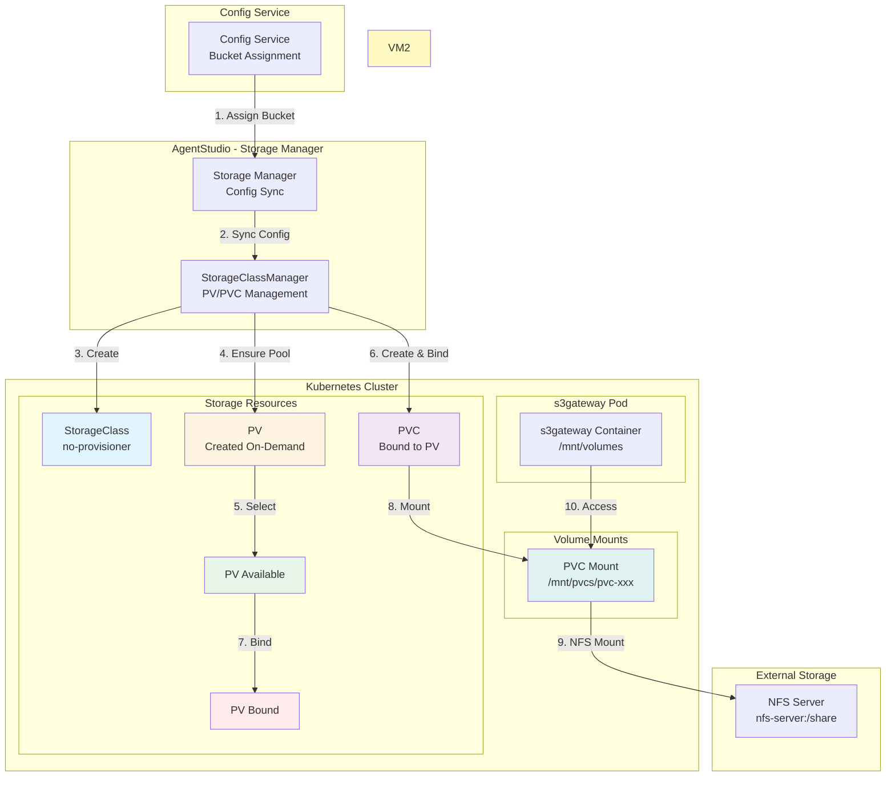
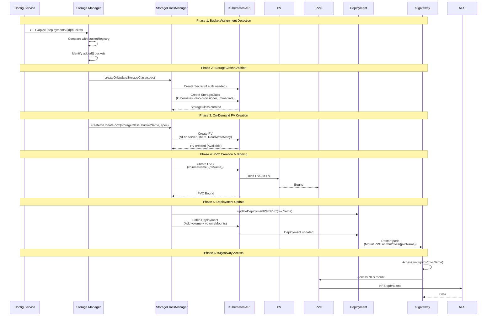

# Static PV Provisioning Design Document

## Overview

This document describes the static PersistentVolume (PV) provisioning architecture for mounting NFS shares (and other network storage) as buckets in the AgentStudio deployment. The Storage Manager creates PVs on-demand that are bound to PVCs when buckets are assigned, eliminating the need for dynamic CSI provisioning.

## Architecture Goals

1. **Static Provisioning**: Create PVs on-demand pointing to existing volume endpoints
2. **Mountability**: Ensure PVs are mountable by s3gateway pods on any node
3. **Resource Efficiency**: Reuse or reclaim PVs when buckets are reassigned
4. **No Dynamic Provisioning**: Eliminate dependency on CSI dynamic provisioners
5. **Automatic Lifecycle**: Handle PV/PVC creation, binding, and cleanup automatically

## System Architecture



## Sequence Diagram: Bucket Assignment Flow



## Component Details

### 1. Storage Manager (Config Sync)

**Location**: `src/nemo/storage-manager/src/server/Server.ts`

**Responsibilities**:
- Periodically syncs bucket assignments from config service
- Detects bucket changes (added, removed, changed)
- Triggers StorageClass/PVC creation/deletion

**Key Methods**:
- `syncConfig()`: Fetches bucket list and detects changes
- `syncStorageClasses()`: Orchestrates StorageClass/PVC lifecycle

**Configuration**:
- `configSyncInterval`: How often to sync (default: configurable)
- `configServiceUrl`: URL of config service

### 2. StorageClassManager

**Location**: `src/nemo/storage-manager/src/server/StorageClassManager.ts`

**Responsibilities**:
- Creates/updates/deletes StorageClasses
- Creates PVs on-demand for each bucket assignment
- Creates and binds PVCs to PVs
- Updates deployment to mount PVCs

**Key Methods**:
- `createOrUpdateStorageClass()`: Creates static StorageClass
- `createOrUpdatePVC()`: Creates PVC bound to PV (on-demand)
- `updateDeploymentWithPVC()`: Patches deployment to mount PVC

**Configuration**:
- `defaultStorageSize`: Default PV size (default: 10Gi, env: `DEFAULT_STORAGE_SIZE`)

### 3. StorageClass Specification

**Static Provisioning Configuration**:
```yaml
apiVersion: storage.k8s.io/v1
kind: StorageClass
metadata:
  name: sc-{namespace-id}-{bucket-name}
  labels:
    app: versitygw
    agentstudio.io/bucket-name: {bucket-name}
    agentstudio.io/namespace-id: {namespace-id}
  annotations:
    agentstudio.io/volume-endpoint: {nfs-server:/share}
    agentstudio.io/mount-options: noac
provisioner: kubernetes.io/no-provisioner
volumeBindingMode: Immediate
reclaimPolicy: Retain
allowVolumeExpansion: false
```

**Key Characteristics**:
- `provisioner: kubernetes.io/no-provisioner`: No dynamic provisioning
- `volumeBindingMode: Immediate`: PVC binds as soon as the PV exists
- `reclaimPolicy: Retain`: PVs are retained when PVCs are deleted

### 4. PersistentVolume (PV) Specification

**NFS PV Example**:
```yaml
apiVersion: v1
kind: PersistentVolume
metadata:
  name: pv-sc-{namespace-id}-{bucket-name}-{index}
  labels:
    agentstudio.io/storage-class: sc-{namespace-id}-{bucket-name}
    agentstudio.io/bucket-name: {bucket-name}
    app: versitygw
spec:
  capacity:
    storage: 10Gi
  accessModes:
    - ReadWriteMany
  persistentVolumeReclaimPolicy: Retain
  storageClassName: sc-{namespace-id}-{bucket-name}
  nfs:
    server: nfs-server-ip
    path: /export/share
  mountOptions:
    - noac
  # No nodeAffinity - mountable on any node
```

**Mountability Requirements**:
- ✅ `accessModes: [ReadWriteMany]`: Shared access across pods
- ✅ No `nodeAffinity`: Can mount on any node
- ✅ `storageClassName`: Matches StorageClass for binding
- ✅ `reclaimPolicy: Retain`: Returns to pool when released

### 5. PersistentVolumeClaim (PVC) Specification

**PVC Example**:
```yaml
apiVersion: v1
kind: PersistentVolumeClaim
metadata:
  name: pvc-{hash}-{bucket-name}
  namespace: {namespace}
  labels:
    app: versitygw
    agentstudio.io/bucket-name: {bucket-name}
  annotations:
    nfs.csi.k8s.io/mountOptions: noac
    nfs.csi.k8s.io/server: nfs-server-ip
    nfs.csi.k8s.io/share: /export/share
spec:
  accessModes:
    - ReadWriteMany
  storageClassName: sc-{namespace-id}-{bucket-name}
  volumeName: pv-sc-{namespace-id}-{bucket-name}-{index}  # Explicit binding
  resources:
    requests:
      storage: 10Gi
```

**Key Characteristics**:
- `volumeName`: Explicitly binds to the on-demand PV
- `storageClassName`: Matches StorageClass
- Annotations: Mount options and NFS endpoint info

### 6. Deployment Update

**Volume Addition**:
```yaml
volumes:
  - name: pvc-{pvcName}
    persistentVolumeClaim:
      claimName: {pvcName}

volumeMounts:
  - name: pvc-{pvcName}
    mountPath: /mnt/pvcs/{pvcName}
```

**Applied to s3gateway Container**:
- `s3gateway`: Accesses PVCs directly at `/mnt/pvcs/{pvcName}`

### 7. s3gateway Access

**Backend Configuration**:
- Root path: `/mnt/pvcs`
- Each bucket: `/mnt/pvcs/{pvcName}` (direct PVC mount)
- PVCs are mounted directly by Kubernetes at pod startup

## Control Flow Summary

### Step-by-Step Flow

1. **Bucket Assignment**: Config service assigns bucket to deployment
2. **Config Sync**: Storage Manager detects new bucket in periodic sync
3. **StorageClass Creation**: Creates static StorageClass (`kubernetes.io/no-provisioner`, `Immediate` binding)
4. **PV Creation**: Creates a PV on-demand pointing to the existing volume endpoint (NFS/SMB)
5. **PVC Creation**: Creates PVC with `volumeName` pointing to the new PV
6. **Binding**: Kubernetes immediately binds PVC to PV (status: Bound)
7. **Deployment Update**: Storage Manager patches deployment to add volume and volumeMounts
8. **Pod Restart**: Kubernetes restarts pods to mount new PVC
9. **s3gateway Access**: s3gateway accesses bucket directly via PVC mount → NFS mount

## Configuration

### Environment Variables

| Variable | Default | Description |
|----------|---------|-------------|
| `DEFAULT_STORAGE_SIZE` | `10Gi` | Default size for PVs |
| `PVCS_MOUNT_PATH` | `/mnt/pvcs` | Base path where PVCs are mounted |

### StorageClass Configuration

**Static Provisioning**:
- Provisioner: `kubernetes.io/no-provisioner`
- Volume Binding Mode: `Immediate`
- Reclaim Policy: `Retain`
- Volume Expansion: `false`

## RBAC Requirements

Storage Manager requires a **ClusterRole** (not Role) because PVs and StorageClasses are cluster-scoped resources. Key permissions include:

- **StorageClasses** (`storage.k8s.io`): full CRUD
- **PersistentVolumes** (core): full CRUD — required for static provisioning
- **PersistentVolumeClaims** (core): full CRUD
- **Secrets** (core): full CRUD (for mount credentials)
- **Deployments** (`apps`): get, list, watch, patch, update
- **Pods** (core): get, list, watch (for checking active mounts)
- **Events** (core): create, patch (for recording status)
- **VolumeMountSets** (`agentstudio.io`): CRD management

The RBAC template is managed by Helm at `deployments/helm/workers/charts/storage-manager/templates/rbac-pvc.yaml`. Resource names are rendered dynamically from chart helpers.

For detailed verification commands and troubleshooting, see [RBAC Permissions Verification](./rbac-permissions-verification.md).

## PV Lifecycle Management

### On-Demand PV Creation

- **Trigger**: When a bucket is assigned and a PVC is needed
- **Naming**: `pv-{storageClassName}-{bucketName}` (with generation suffix on endpoint changes)
- **State**: PV starts in `Available` state, immediately bound to the PVC

### PV Reuse

- When a PVC is deleted, the PV transitions based on reclaim policy (`Retain`)
- Admin or automation must manually release or clean up retained PVs

### PV Cleanup

- When StorageClass is deleted, associated unbound PVs are cleaned up
- Bound PVs are retained (will be cleaned up when PVCs are deleted)

## Error Handling

### Common Scenarios

1. **PV Creation Failure**: Logged, retried on next sync cycle
2. **PVC Binding Failure**: Retried on next sync cycle
3. **Deployment Update Failure**: Non-critical, PVC still created (will mount on next Helm upgrade)
4. **Endpoint Drift**: PV replacement deferred if pods are actively using the PVC

### Recovery Mechanisms

- **Binding Failures**: Check PV mountability criteria (access modes, nodeAffinity)
- **Deployment Issues**: Manual Helm upgrade or deployment restart
- **Endpoint Drift Stuck**: Drain workloads to allow PV replacement

## Benefits

1. **On-Demand Provisioning**: PVs created exactly when needed, no wasted resources
2. **Endpoint Drift Handling**: Automatic PV replacement when volume endpoints change
3. **Mountability Guaranteed**: PVs created with explicit mountability requirements
4. **No CSI Dependency**: Uses standard Kubernetes static provisioning
5. **Automatic Lifecycle**: End-to-end automation from bucket assignment to s3gateway access

## Limitations

1. **Pod Restart Required**: New PVC mounts require pod restart (handled automatically)
2. **Endpoint Drift Requires Drain**: Cannot replace PV while pods are using the PVC
3. **SMB Static PVs**: May have limitations depending on CSI driver support
4. **Storage Size**: All PVs use same default size (`DEFAULT_STORAGE_SIZE`)

## Future Enhancements

1. **PV Size Customization**: Per-bucket PV size configuration
2. **Health Monitoring**: Track PV utilization and availability
3. **Automatic Cleanup**: Clean up retained PVs after configurable TTL
4. **Multi-StorageClass Support**: Support for different StorageClasses per bucket type

## Per-bucket StorageClass binding mode (`Immediate`)

Auto-generated static StorageClasses use `kubernetes.io/no-provisioner`. Those
PVCs are satisfied by storage-manager–created PVs. Binding mode is **`Immediate`**
so the PVC can bind as soon as the PV exists; **`WaitForFirstConsumer`** can leave
operators thinking the PVC is “stuck” even though the PV is already correct.

## Endpoint drift (NFS/SMB)

When bucket config changes **`volume_info.endpoint`** (or equivalent SMB source),
storage-manager compares the **bound PV** to the new spec. If the NFS
`server`/`path` (or SMB CSI `source`) differs and **no pod is using the PVC**,
the old PV is removed and a **new PV** is created with a **generation suffix** on
the name so kubelet does not reuse stale mount state. If pods still reference the
PVC, replacement is skipped (`repair_pending_pod_restart`); workloads must be
drained or restarted before the PV can be replaced safely.

## Related Documentation

- [Storage Manager](../src/nemo/storage-manager/) — PVC lifecycle and volume management
