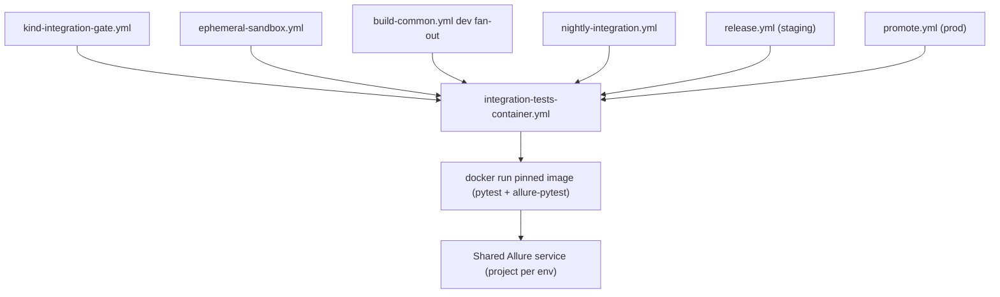
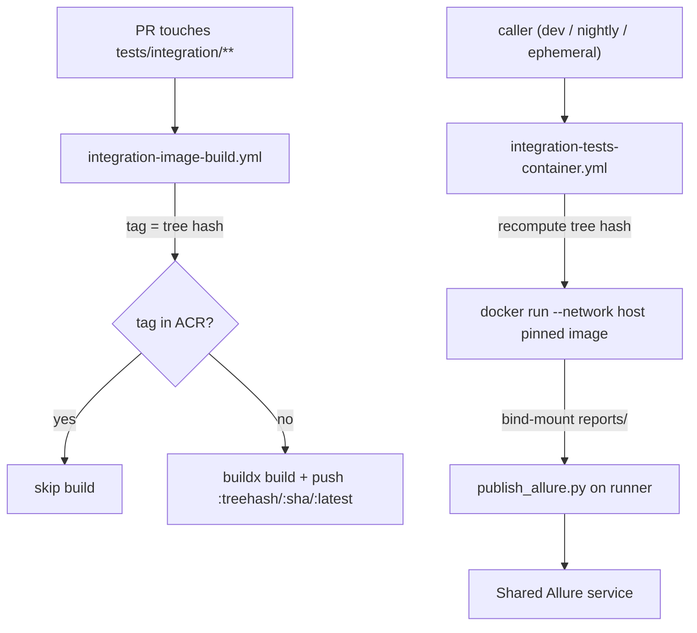

# Integration tests in CI/CD

How the [pytest + allure integration harness](../../tests/integration/README.md) is
wired into the pipeline, what each environment must provide, and how to point
new execution contexts (ephemeral KIND, vCluster, staging, prod) at it.

## Components

| Piece | Path | Role |
| ----- | ---- | ---- |
| Test workflow | [`.github/workflows/integration-tests-container.yml`](../../.github/workflows/integration-tests-container.yml) | Single `workflow_call` entry point: runs the suite against one environment by `docker run`-ing the pinned ACR image, then publishes to Allure. |
| Image build workflow | [`.github/workflows/integration-image-build.yml`](../../.github/workflows/integration-image-build.yml) | Builds + pushes the harness image to ACR, path-filtered on `tests/integration/**`. Content-hash tagged so it rebuilds only when the harness changes. |
| Harness image + tag | [`tests/integration/Dockerfile`](../../tests/integration/Dockerfile) / [`scripts/integration-image-tag.sh`](../../scripts/integration-image-tag.sh) | The container image and the shared git-tree-hash tag script both the build and test workflows use. |
| Allure publisher | [`tests/integration/scripts/publish_allure.py`](../../tests/integration/scripts/publish_allure.py) | Uploads `allure-results` to the shared Allure service under one project per environment. Runs on the runner after the container writes its results. |
| Allure service (VM) | [`tests/deployment/`](../../tests/deployment) | Azure IaC (`azure-cloud-init.yaml` + `azure-provision.sh`) for the single shared `allure-docker-service` instance (one project per env) + its dashboard UI, running as Docker containers behind a catch-all caddy on one **public-IP** Azure VM (self-signed TLS). |
| Dev gate + fan-out | [`.github/workflows/build-common.yml`](../../.github/workflows/build-common.yml) | dev-AKS hard gate; GKE/EKS fan out only after it passes. |
| Nightly | [`.github/workflows/nightly-integration.yml`](../../.github/workflows/nightly-integration.yml) | Scheduled full-suite run per shared environment. |
| Staging / prod hooks | [`release.yml`](../../.github/workflows/release.yml) / [`promote.yml`](../../.github/workflows/promote.yml) | RC-on-staging and post-deploy-prod suites (flag-gated). |

The harness targets the platform purely over HTTP + Keycloak (no kubeconfig),
so the same workflow validates every context — only the GitHub
Environment and the Allure project label differ.



## Per-environment configuration contract

The test workflow reads everything from the named GitHub Environment
(`inputs.cloud_environment`). Mirrors [`tests/integration/.env.example`](../../tests/integration/.env.example).

### Required

| Kind | Name | Notes |
| ---- | ---- | ----- |
| var | `AGENTSTUDIO_ENDPOINT` | Public DNS root. `app.`/`auth.` URLs derive from it (already set for deploys). |
| secret | `INTEGRATION_KEYCLOAK_USERNAME` | Test user (Keycloak password grant). |
| secret | `INTEGRATION_KEYCLOAK_PASSWORD` | Test user password. |
| var | `ACR_REGISTRY` | ACR login server hosting the harness image (e.g. `<name>.azurecr.io`). |
| var | `AZURE_CLIENT_ID` / `AZURE_TENANT_ID` / `AZURE_SUBSCRIPTION_ID` | Azure OIDC identity used to `az acr login` and pull the image. |

> **ACR auth in every environment.** The test workflow pulls the harness image
> from ACR via Azure OIDC, so **every** targeted GitHub Environment (`dev`,
> `dev-gke`, `dev-eks`, `azure`, `gcp`, `aws`, `stage`, `prod`, `ephemeral`)
> must expose the four
> Azure/ACR variables above. Set them at the repository/org level so they apply
> to all environments, and grant the shared managed identity `AcrPull` (plus
> `AcrPush` for build-on-miss) with a federated credential that trusts each
> environment subject (`repo:NetApp-Nemo/AgentStudio:environment:<env>`). Caller
> jobs must also grant `permissions: id-token: write` (see the calling
> convention below).

If an environment exposes the platform on non-standard URLs, set the explicit
override `INTEGRATION_API_BASE_URL` (and/or `INTEGRATION_KEYCLOAK_TOKEN_URL`)
instead of (or in addition to) `AGENTSTUDIO_ENDPOINT`. These two power the
**password-grant suites** (`smoke` + `knowledge_base`), which are the scope of
the dev-AKS gate and nightly today.

> **agent-service suites are opt-in.** The `agent_service` suites authenticate
> to config-/agent-service with a Keycloak **client-credentials service
> account** (see *Keycloak test identity* below), not the password grant. The
> reusable workflow does **not** derive their URLs, so they **self-skip** unless
> you set BOTH `INTEGRATION_CONFIG_SERVICE_URL` and
> `INTEGRATION_AGENT_SERVICE_URL` **and** provide the service-account config
> (`INTEGRATION_ENABLE_AUTH_CONFIG_SERVICE=true` + `INTEGRATION_KEYCLOAK_INTERNAL_ISSUER` /
> `INTEGRATION_KEYCLOAK_SERVICE_CLIENT_ID` / `INTEGRATION_KEYCLOAK_SERVICE_CLIENT_SECRET`, per
> [`.env.example`](../../tests/integration/.env.example)). Enabling these is a
> follow-up; leave them unset to keep the gate scoped to the password-grant
> suites.

### Optional

| Kind | Name | Default / effect |
| ---- | ---- | ---------------- |
| var | `INTEGRATION_KEYCLOAK_PASSWORD_GRANT_CLIENT_ID` | `agent-studio-ui` — public client for the password-grant suites (legacy `INTEGRATION_KEYCLOAK_CLIENT_ID` honored as a fallback) |
| var | `INTEGRATION_KEYCLOAK_INTERNAL_ISSUER` | realm issuer URL for the agent-service service-account token |
| var | `INTEGRATION_KEYCLOAK_SERVICE_CLIENT_ID` | confidential service-account client id (agent-service suites) |
| secret | `INTEGRATION_KEYCLOAK_SERVICE_CLIENT_SECRET` | service-account client secret (agent-service suites) |
| var | `INTEGRATION_ENABLE_AUTH_CONFIG_SERVICE` | `true` |
| var | `INTEGRATION_ENABLE_AUTH_AGENT_SERVICE` | `false` |
| var | `INTEGRATION_CURL_INSECURE` | `0` — set `1` for self-signed certs |
| var | `INTEGRATION_CLEANUP` | `1` — delete resources created by each test |

### Optional connector config (matching KB suites self-skip when absent)

S3: `INTEGRATION_S3_ENDPOINT`, `INTEGRATION_S3_BUCKET`, `INTEGRATION_S3_PREFIX` (vars),
`INTEGRATION_AWS_ACCESS_KEY_ID`, `INTEGRATION_AWS_SECRET_ACCESS_KEY` (secrets),
`INTEGRATION_AWS_REGION` (var).
Postgres: `INTEGRATION_POSTGRES_HOST/PORT/DATABASE/USERNAME/SOURCE_TABLE` (vars),
`INTEGRATION_POSTGRES_PASSWORD` (secret).
MySQL: `INTEGRATION_MYSQL_HOST/PORT/DATABASE/USERNAME/SOURCE_TABLE` (vars),
`INTEGRATION_MYSQL_PASSWORD` (secret).

### Keycloak test identity

Each environment needs a dedicated test principal in the `nemo` realm:

- A test **user** with Direct Access Grants enabled on the `agent-studio-ui`
  client (password grant), or
- A **service account** client (`client_credentials`) — set
  `INTEGRATION_ENABLE_AUTH_AGENT_SERVICE`/`...CONFIG_SERVICE` and the client
  id/secret per [`.env.example`](../../tests/integration/.env.example).

Use a non-privileged account scoped to a throwaway project; `INTEGRATION_CLEANUP=1`
deletes resources the suite creates.

## Allure service (shared, one project per environment)

Deploy **one** instance (it serves every cloud). It backs the repo-wide
`ALLURE_ENDPOINT`, hosting every env's projects, and must be **runner-reachable**
and **stable**.

It runs as Docker containers on a single small **public-IP** Azure VM — **not**
on Kubernetes: `allure-docker-service` (upload API + per-project reports), its
dashboard UI (`allure-docker-service-ui`), and `caddy` for TLS. The setup is
codified as Azure IaC in [`tests/deployment/`](../../tests/deployment)
(`azure-cloud-init.yaml` + `azure-provision.sh`); see that README for
prerequisites, verification, the NSG allowlist, updating the stack, TLS notes,
old-VM decommission, and teardown.

The VM is addressed by its **public IP** with **no DNS name**, so TLS is
**self-signed** (`ALLURE_VERIFY_TLS=0`). A trusted (Let's Encrypt) cert is not
available without a DNS name. caddy is a **catch-all** on `:443` (matches the raw
IP Host): `/allure-docker-service*` → the API, everything else → the dashboard
UI. Access is restricted by an **NSG source allowlist** (your Mac egress + the
self-hosted runner egress IP) on `22` and `443`.

`azure-provision.sh` has no baked defaults — pass every input in one command
(creates the RG, a static public IP, an NSG with the allowlist rules, and the VM
via cloud-init):

```bash
cd tests/deployment
SUBSCRIPTION_ID=<sub-id> LOCATION=<region> ALLURE_RG=<rg> \
VM_NAME=<vm> VM_SIZE=<size> VM_IMAGE=<image> DATA_DISK_GB=<gb> \
ADMIN_USERNAME=<user> ALLURE_ADMIN_PASSWORD=<strong-pass> \
ALLOWED_SSH_SOURCE=<mac-egress-ip>/32 \
ALLOWED_HTTPS_SOURCES="<mac-egress-ip>/32 <runner-egress-ip>/32" \
./azure-provision.sh
```

Current deployment: `agentstudio-allure-instance` in `rg-agentstudio-allure`
(`eastus2`); the endpoint is the VM's public IP, kept in the `ALLURE_ENDPOINT`
GitHub variable (not committed here). It
replaces the earlier isolated private-only VM (`vm-agentstudio-allure-dev-eus2-001`
+ its private DNS zone `allure.agentstudio.dev.openeng.netapp.com`), which is
slated for decommission (steps in the deployment README).

Then set repo/org variables so every run publishes:

| Kind | Name | Value |
| ---- | ---- | ----- |
| var | `ALLURE_ENDPOINT` | `https://<public-ip>` (the VM's public IP) |
| var | `ALLURE_VERIFY_TLS` | `0` (self-signed; no trusted cert without a DNS name) |
| secret | `ALLURE_USERNAME` / `ALLURE_PASSWORD` | `admin` / the `ALLURE_ADMIN_PASSWORD` you passed |

Dashboard (all projects): `https://<public-ip>/`. Per-environment API view:
`https://<public-ip>/allure-docker-service/projects/<project>`.

### Project naming convention

| Context | GitHub Environment | `allure_project` |
| ------- | ------------------ | ---------------- |
| dev AKS / GKE / EKS | `dev` / `dev-gke` / `dev-eks` | `dev-aks` / `dev-gke` / `dev-eks` |
| preprod AKS / GKE / EKS | `azure` / `gcp` / `aws` | `preprod-aks` / `preprod-gke` / `preprod-eks` |
| staging / prod | `stage` / `prod` | `stage` / `prod` |
| per-PR ephemeral KIND | `ephemeral` | `pr-<number>` |
| on-demand vCluster | `ephemeral` | `vcluster-<id>` |

## Calling convention (any environment)

Any provisioning workflow — dev/stage/prod deploys, a per-PR ephemeral KIND
gate, or an on-demand vCluster — deploys the stack, then calls the test
workflow the same way; only the GitHub Environment and Allure project label
differ. The example below shows an ephemeral KIND PR gate as one illustration:

```yaml
jobs:
  integration-tests:
    needs: provision-and-deploy
    permissions:
      contents: read
      id-token: write                     # container workflow pulls the image from ACR via OIDC
    uses: ./.github/workflows/integration-tests-container.yml
    with:
      cloud_environment: ephemeral        # GitHub Environment carrying the test config
      allure_project: pr-${{ github.event.number }}
      pytest_selector: "-m smoke"         # PR gate: fast scope; omit for full suite
    secrets: inherit
```

Notes:
- The test job always runs on the self-hosted `["self-hosted", "netapp"]` pool
  (reaches private gateways / Keycloak / ACR and publishes to Allure). Callers
  cannot override the runner.
- For a **private** ephemeral/vCluster, expose the URLs the harness needs by
  setting `INTEGRATION_API_BASE_URL` / `INTEGRATION_AGENT_SERVICE_URL` /
  `INTEGRATION_CONFIG_SERVICE_URL` / `INTEGRATION_KEYCLOAK_TOKEN_URL` (e.g. to
  in-cluster `*.svc.cluster.local` names) on that environment, instead of
  relying on `AGENT_STUDIO_ENDPOINT` derivation.
- The PR-time gate should pass a narrow `pytest_selector` (e.g. `-m smoke`) for
  speed; nightly and the dev-AKS gate run the full suite.
- Use a unique `allure_project` per ephemeral env so results don't collide;
  prune stale projects periodically via the Allure API.

## Containerized execution (ACR image)

The harness runs as a container image (rather than `make setup` + pytest on the
runner). The image bakes the `tests/integration/` tree + `requirements.txt`;
`docker run <image> [selector]` maps straight to `pytest` (same
`pytest.ini testpaths=suites`). Configuration is passed entirely as runtime env
vars — the per-environment contract documented above.

Two workflows implement it:

- [`integration-image-build.yml`](../../.github/workflows/integration-image-build.yml)
  builds + pushes the image to the dev ACR (`vars.ACR_REGISTRY`) using
  the same Azure OIDC managed identity as [`build-common.yml`](../../.github/workflows/build-common.yml)
  (AcrPush, federated to the `dev` GitHub Environment). It is **path-filtered** on
  `tests/integration/**` (plus the Dockerfile and tag script), so it only runs
  when the harness changes.
- [`integration-tests-container.yml`](../../.github/workflows/integration-tests-container.yml)
  is the single test entry point. It takes the inputs
  (`cloud_environment`, `allure_project`, `pytest_selector`, `image_tag`, plus
  the optional notification inputs `notify_on_failure` / `notify_always` /
  `notify_github_login` / `severity`), reads the per-environment vars/secrets, authenticates to ACR
  via Azure OIDC, `docker run`s the pinned image, and publishes to Allure on the
  runner via `publish_allure.py`.

### Content-hash tagging (rebuild only when necessary; always run the correct image)

The image tag is the **git tree hash of `tests/integration/`**
([`scripts/integration-image-tag.sh`](../../scripts/integration-image-tag.sh) →
`git rev-parse HEAD:tests/integration`, truncated). Because the tag is a pure
function of the tracked content in that directory:

- **Build only when necessary:** the build workflow computes the tag and **skips**
  if it already exists in ACR. An unchanged harness ⇒ identical tag ⇒ no rebuild.
- **Every run uses the correct image:** the container workflow recomputes the
  **same** tag at the ref under test and runs exactly that tag — the image is
  guaranteed to match the checked-out harness code (no `:latest` drift/races).
- **Self-healing:** if the exact tag is not yet in ACR (e.g. a branch whose harness
  change has not been built), the container workflow builds + pushes it on the
  runner (**build-on-miss**) so the run is never blocked.

`:<git-sha>` and `:latest` are also pushed, for human traceability only — never
used to select the image.



### Runtime details

- **Networking:** the container runs with `--network host` so it inherits the
  self-hosted runner's DNS/routes and can reach the private platform
  `app.`/`auth.<endpoint>` hosts and the Allure service.
- **Secrets:** passed via `docker run --env-file` where each line is a bare
  variable **name** — Docker resolves the value from the job environment at run
  time, so no secret value is written to disk or baked into an image layer.
- **Reports:** the container writes `allure-results` to a **bind-mounted**
  `tests/integration/reports/`; the runner then publishes with `publish_allure.py`
  and uploads the reports artifact.

### Calling the workflow

Callers point at `integration-tests-container.yml` and grant `id-token: write`
(needed for the ACR OIDC login):

```yaml
jobs:
  integration-tests:
    needs: provision-and-deploy
    permissions:
      contents: read
      id-token: write
    uses: ./.github/workflows/integration-tests-container.yml
    with:
      cloud_environment: dev
      allure_project: dev-aks
      pytest_selector: "-m smoke"
    secrets: inherit
```

For local parity: `make integration-image-tag` prints the tag and
`make integration-image-build` builds the image from `tests/integration/`.

## Pipeline behaviour summary

- **Dev (merge to main):** the integration harness image builds (self-skips when
  unchanged) → AKS deploys → `integration-tests-dev-aks` (hard gate) → GKE + EKS
  fan out → advisory GKE/EKS suites. Controlled by `run_integration_tests`
  (default `true`) in `build-common.yml`; `release.yml` and `promote.yml` pass `true`.
- **Nightly:** 00:00 IST (18:30 UTC), full suite per shared environment, no redeploy.
- **Staging:** on `release/**`, gated by repo var `RUN_STAGING_INTEGRATION_TESTS=true`.
- **Prod:** post-deploy in `promote.yml`, gated by repo var `RUN_PROD_INTEGRATION_TESTS=true`.

Staging/prod stay inert until those GitHub Environments + clusters exist
(release-management / IaC workstream).

## Result notifications (Microsoft Teams)

The container workflow posts an Adaptive Card to a Teams channel via a **Teams
Workflows** (Power Automate) inbound webhook ("Post to a channel when a webhook
request is received" template). Gate/advisory legs post **only on failure**
(`notify_on_failure`); nightly legs post on **every run**, pass or fail
(`notify_always`), so a green nightly is an explicit signal rather than silence.
The card title and colour reflect the outcome (pass vs. fail). It carries the
environment, Allure project, image tag, trigger, branch, and commit, plus
buttons linking to the **Actions run** and the **Allure report**.

The card is enriched from the run's `reports/junit.xml`:

- **Status badge** — a shields.io image summarising failed / passed / skipped
  (Teams fetches the image URL server-side, so it renders independent of the
  self-hosted runner's egress).
- **Test Suite Results** — a per-suite table (`Test Suite | Total | Passed |
  Failed | Skipped | Status`) grouped by test module (e.g.
  `test_datasource_volume`). Status is `PASS` (no failures), `FAIL` (nothing
  passed), `PARTIAL` (mixed) or `SKIP` (only skipped). Rows are sorted and
  coloured by status — green (PASS) / red (FAIL) / yellow (PARTIAL, SKIP).
- **Overall Statistics** — a totals table (Total / Passed / Failed / Skipped /
  Pass Rate), where Pass Rate = `passed / total` rounded to a percent.
- **Failed-test list** — the top N failing node ids by name only
  (`NOTIFY_MAX_FAILED_LISTED`, default 10; truncated with "…and X more" to stay
  under the ~28 KB Adaptive Card limit). Error text is intentionally omitted; use
  the Allure report for details.
- **Report bundle** — the full HTML report can't ride inside a Teams message, so
  the card names the uploaded `integration-reports-<project>-<run_id>` artifact
  and adds a **Download report bundle** button pointing at the run's artifacts.

In Teams these are rendered as compact monospace `TextBlock`s (card version 1.4,
set to full width so the wide suite table isn't truncated), one coloured block
per status group. This text layout is deliberate: a native Adaptive Card `Table`
(or per-cell `ColumnSet`) would need one element per cell and blow past the
Adaptive Card ~28 KB size limit on a full ~70-suite run (~60 KB), which the Teams
Workflows/Power Automate action rejects; the monospace layout is a few KB. The
consequence is that colouring is per row (by status), not per cell. The table
*data* comes from channel-agnostic helpers in `notify_common.py`
(`SuiteResult` / `NotificationContext.suite_rows()` / `overall_rows()`, plus
`column_widths()` / `format_row()`), and a reusable `format_ascii_table()`
box-drawing helper is also provided for future plain-text channels (e.g. an email
renderer wrapping it in a `<pre>` block).

If `junit.xml` is missing (e.g. an infra failure before pytest ran), these
sections are omitted and the base card still posts. On a passing run the
failed-test list is empty and the badge is green.

Wiring (single hook, all callers):

| Piece | Role |
| ----- | ---- |
| [`scripts/notify_common.py`](../../tests/integration/scripts/notify_common.py) | **Channel-agnostic core.** Parses JUnit and reads the `NOTIFY_*` env into a `NotificationContext` (severity, outcome, totals, per-suite results, failed tests, links, mention target), plus the reusable `format_ascii_table()` table helper. The outcome (`NOTIFY_STATUS`) picks the pass vs. fail title/level. Reused by every channel. |
| [`scripts/teams_notify.py`](../../tests/integration/scripts/teams_notify.py) | **Teams channel.** Renders the context as an Adaptive Card and POSTs it (stdlib only). Skips silently if the webhook secret is unset; never fails the job. @-mentions the PR author when a resolvable email is available. |
| [`integration-tests-container.yml`](../../.github/workflows/integration-tests-container.yml) | `Notify` step, gated `if: !cancelled() && (inputs.notify_always || (failure() && inputs.notify_on_failure))`. Inputs: `notify_on_failure`, `notify_always`, `notify_github_login`, `severity`. Passes `NOTIFY_STATUS: ${{ job.status }}`. Active channels are determined by configured secrets. |
| [`build-common.yml`](../../.github/workflows/build-common.yml) | Forwards `notify_on_failure` / `notify_github_login` to the dev-AKS (`severity: gate`) and dev-GKE/dev-EKS (`severity: advisory`) legs. |
| [`release.yml`](../../.github/workflows/release.yml) | Opts in (`notify_on_failure: true`) and passes the merged PR author (`pr_user`) for the @-mention. Also on the staging leg. |
| [`nightly-integration.yml`](../../.github/workflows/nightly-integration.yml) | Opts in with `notify_always: true` + `severity: nightly` (posts on pass and fail); no PR author, so no @-mention. |

### Adding another channel (e.g. email)

The data plumbing is channel-agnostic: the workflow step exports `NOTIFY_*`
(shared) + a per-channel transport secret. To add email later:

1. Add `scripts/email_notify.py` that calls `notify_common.build_context()` and
   renders the same context as HTML, sending via Graph/SMTP.
2. Add the transport secret(s) to the step env (e.g. `EMAIL_*`) alongside
   `TEAMS_WEBHOOK_URL`, and a `run:` line calling the new script.

No change to `notify_common.py`, JUnit parsing, or the `NOTIFY_*` env is needed —
only a new renderer/sender module.

### Configuration

| Kind | Name | Notes |
| ---- | ---- | ----- |
| secret | `TEAMS_INTEGRATION_WEBHOOK_URL` | Repo secret. The channel's Teams Workflows webhook URL. Unset ⇒ Teams notification self-skips. |

### Behaviour

| Trigger | Posts? | Severity label | @-mentions author? |
| ------- | ------ | -------------- | ------------------ |
| Merge to `main`, dev-AKS gate fails | yes | blocking gate | yes |
| Merge to `main`, dev-AKS gate passes | no | — | — |
| Merge to `main`, GKE/EKS advisory fails | yes | advisory | yes |
| Nightly leg (pass or fail) | yes | nightly | no (no author) |
| Promote (GA) fails | no | — | — |

One failing merge can post up to three messages (AKS gate + two advisory
legs) — one per failing leg, matching the job structure. A nightly run posts one
message per environment leg regardless of outcome.

### @-mention identity

A Teams mention only resolves when the Adaptive Card `msteams.entities`
`mentioned.id` is the person's **email / UPN** — the GitHub login is just a
display label and cannot be mapped to a Teams user on its own.

So the mention id is the **author's email**, resolved on the release path
(`release.yml`, `obtain-pr-details`) and threaded through as `notify_email`
(`NOTIFY_EMAIL`). Resolution order (best-effort, never blocks the release):

1. **Public profile email** — the email the author has marked **public** on
   their GitHub profile, read via `GET /users/{login}` → `.email` (works with
   the default `GITHUB_TOKEN`). GitHub only includes this field when the user
   has explicitly set a primary email to be publicly visible; private profile
   emails are not returned. Used whenever it is present and not a `noreply`
   address.
2. **Merge commit author email** (`.commit.author.email`) — used only as a
   fallback when step 1 returns nothing. GitHub `noreply` addresses
   (`<id>+<login>@users.noreply.github.com`) are the GitHub user id, not a
   mailbox, so they are rejected here too.

Behaviour of the resulting id:

- **Valid email** → real @-mention that pings the author.
- **No usable email** (no public profile email *and* commit email missing or a
  `noreply` address) → the card names the author in plain text (no ping), so
  ownership is still clear.

> **Why both sources often fail.** With email privacy on (GitHub's default) the
> commit author email is the `…@users.noreply.github.com` form — effectively
> the GitHub user id — which Teams can't resolve. The profile lookup only helps
> when the author has set a **public** email on their GitHub account; otherwise
> `.email` is `null` and the notifier falls back to plain-text attribution. For
> reliable @-mentions across the org, add a login→UPN mapping or directory lookup
> in `release.yml` — no change to `notify_common.py` (which just consumes
> `NOTIFY_EMAIL`) or the other workflows is needed.

> Real @-mention rendering also depends on the channel's Workflows template
> passing the card JSON through unchanged. If mentions don't ping, verify the
> flow uses the raw request body as the posted card.
