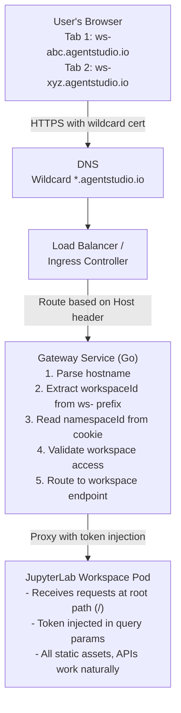
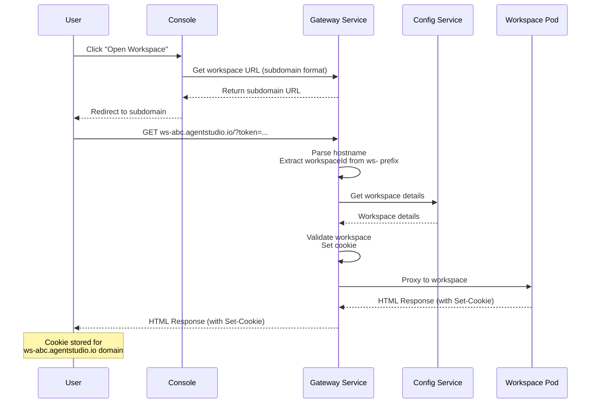
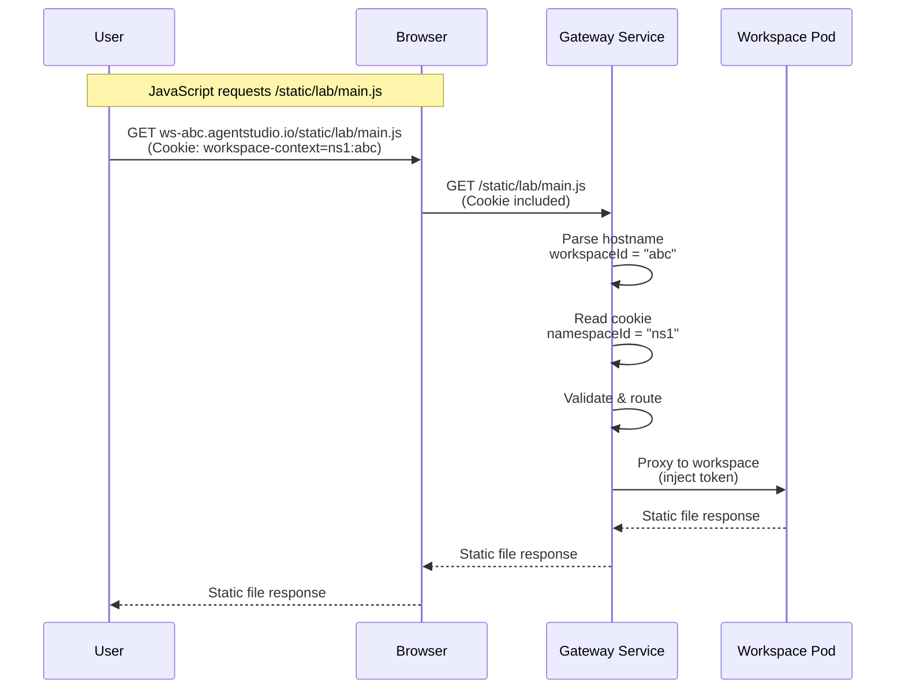
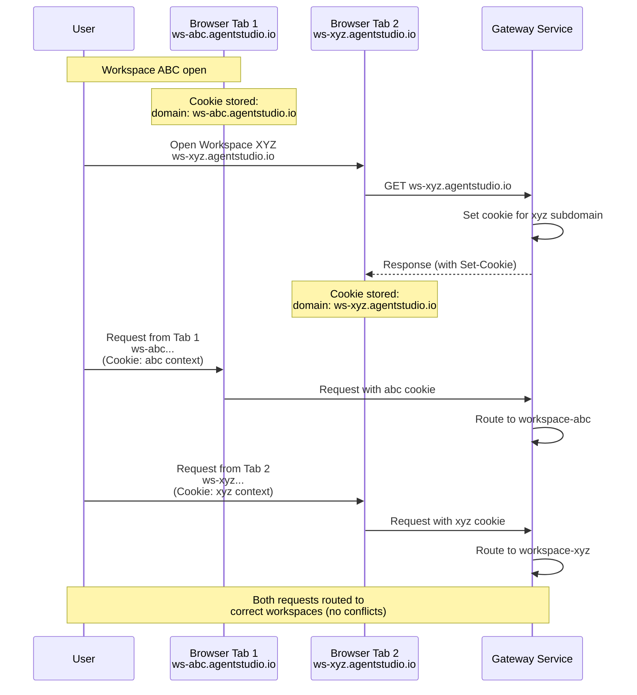
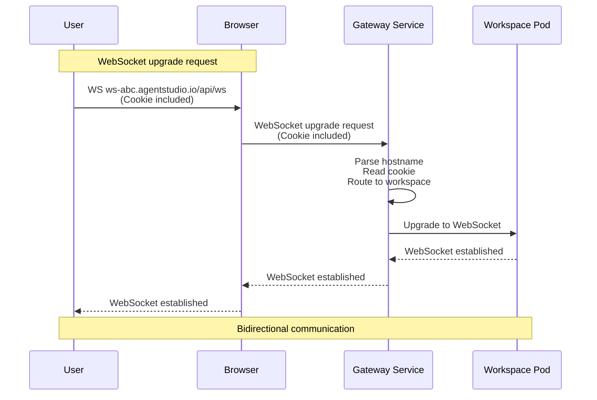

# Workspace Subdomain-Based Routing Design

## Document Information
- **Version**: 2.0
- **Date**: 12/30/2025
- **Status**: Implemented (Gateway service, Go-based)
- **Author**: Ramesh Sekaran (ramesh.sekaran@netapp.com)

---

## Table of Contents
1. [Problem Statement](#problem-statement)
2. [Current Challenges](#current-challenges)
3. [Solution Overview](#solution-overview)
4. [High-Level Architecture](#high-level-architecture)
5. [Request Flow & Sequence Diagrams](#request-flow--sequence-diagrams)
6. [Technical Considerations](#technical-considerations)
7. [Security Considerations](#security-considerations)
8. [Cookie Handling](#cookie-handling)
9. [Infrastructure Requirements](#infrastructure-requirements)
10. [Implementation Phases](#implementation-phases)
11. [Migration Strategy](#migration-strategy)
12. [Testing Strategy](#testing-strategy)
13. [Rollback Plan](#rollback-plan)

---

## Problem Statement

### The Workspace Platform Challenge

AgentStudio is a platform that allows users to launch and manage **workspaces** - self-contained applications that run independently. These workspaces are not applications built by the AgentStudio team; instead, they are third-party applications (like JupyterLab, VS Code, or custom applications) that users can launch on-demand. Each workspace runs in its own isolated environment, typically as a containerized application.

The platform needs to support a multi-tenant architecture where:
- **Multiple users** can access the system simultaneously
- Each user can have **multiple workspaces** running at the same time
- Each workspace must be **isolated** from others - one user's workspace should not be accessible by another user
- Users should be able to open **multiple workspaces in different browser tabs** without conflicts

### The Gateway Routing Problem

To provide a unified access point and handle authentication, authorization, and routing, AgentStudio uses a **Gateway service** (Go-based, at `src/nemo/apigateway-service/`, module `agentstudio/nemo/gateway`). This gateway acts as a single entry point that receives all user requests and routes them to the appropriate backend service or workspace.

The challenge is that the Gateway needs to **transparently route requests** to the correct workspace application. When a user accesses a workspace, the gateway must:
1. Identify which workspace the request is for
2. Verify the user has permission to access that workspace
3. Route the request to the correct workspace application
4. Make this routing **transparent** - the workspace application should receive requests as if they came directly, without knowing about the gateway

### The URL Scheme Mismatch

The fundamental problem arises from a **mismatch in URL expectations**:

**What the Gateway Needs:**
- To route requests correctly, the gateway needs URLs that follow a specific pattern, such as:
  - `https://agentstudio.io/workspace/{namespaceId}/{workspaceId}/...`
- This pattern allows the gateway to extract the workspace identifier from the URL path and route accordingly

**What Workspace Applications Expect:**
- Workspace applications (like JupyterLab) are designed to run standalone
- They expect requests at their **root path** or relative paths:
  - `/static/lab/main.js` (for static assets)
  - `/lab?token=...` (for the main application)
  - `/api/status` (for API endpoints)
  - `static/lab/main.js` (relative paths)
- These applications have **hardcoded or dynamically generated URLs** in their HTML, JavaScript, and CSS files
- Since we don't control the workspace application code, we cannot modify these URLs

### The Request Flow Breakdown

Here's what happens when a user tries to use a workspace:

1. **Initial Access Works**: User clicks a link to open workspace `workspace-abc` in namespace `ns1`
   - The link uses the gateway's URL scheme: `https://agentstudio.io/workspace/ns1/workspace-abc`
   - The gateway successfully routes this request to the workspace
   - The workspace application loads its initial HTML page

2. **Subsequent Requests Fail**: The workspace application's HTML contains references to resources:
   - `<script src="/static/lab/main.js"></script>` - JavaScript files
   - `<link href="/lab/theme.css">` - CSS stylesheets
   - JavaScript code makes API calls: `fetch('/api/status')`
   - The application redirects: `window.location = '/lab'`

3. **The Problem**: These requests are made to paths like `/static/lab/main.js` or `/lab`, which:
   - Don't include the `/workspace/ns1/workspace-abc` prefix
   - Reach the Gateway but don't match any routing pattern
   - The gateway has **no way to know** which workspace these requests belong to
   - Result: **404 Not Found** or routing to wrong service

### Why This Is Particularly Challenging

The problem is compounded by several factors:

1. **No Control Over Workspace Code**: We cannot modify the workspace applications to use our URL scheme. They are third-party applications with their own URL structures.

2. **Dynamic URL Generation**: Modern web applications (like JupyterLab) generate URLs dynamically in JavaScript:
   ```javascript
   const apiUrl = `/api/kernels/${kernelId}/status`;
   fetch(apiUrl); // This doesn't include our workspace prefix
   ```

3. **Multiple Request Types**: Workspaces make various types of requests:
   - Initial page load (HTML)
   - Static assets (CSS, JavaScript, images)
   - API calls (REST endpoints)
   - WebSocket connections (for real-time features)
   - All need to be routed correctly

4. **Multiple Workspaces Per User**: A user might have multiple workspaces open in different browser tabs, and the gateway must route each request to the correct workspace without mixing them up.

### User Impact

When this problem occurs, users experience:
- **Broken functionality**: Features that require API calls don't work
- **Missing resources**: CSS and JavaScript files fail to load, breaking the UI
- **Failed connections**: WebSocket connections for real-time features fail
- **Poor user experience**: The workspace appears broken or partially functional
- **Frustration**: Users cannot effectively use the workspaces they've launched

This problem makes the platform unusable for its intended purpose - providing seamless access to workspace applications.

---

## Current Challenges

### Challenge 1: Cookie Isolation with Multiple Workspaces
**Problem**: If we use cookies to identify workspace context, multiple workspaces in different browser tabs will share the same cookie domain, causing conflicts.

**Current Limitation**:
- All workspaces accessed via `agentstudio.io` share the same cookie jar
- Opening multiple workspaces overwrites each other's cookies
- Cannot reliably identify which workspace a request belongs to

### Challenge 2: URL Rewriting Complexity
**Problem**: Rewriting URLs in HTML, JavaScript, and CSS content is complex and error-prone.

**Current Limitations**:
- Must parse and rewrite multiple content types (HTML, JS, CSS, JSON)
- Risk of breaking JavaScript syntax
- Performance overhead of content parsing
- Difficult to handle minified/obfuscated code
- Edge cases with dynamic URL construction

### Challenge 3: Path-Based Routing Limitations
**Problem**: Path-based routing requires all requests to include the workspace prefix.

**Current Limitations**:
- JavaScript-initiated requests don't include the prefix
- Relative URLs are resolved relative to current path, not workspace root
- Redirects from JupyterLab don't include the prefix
- Complex redirect rewriting logic needed

### Challenge 4: Token Management
**Problem**: JupyterLab token must be injected into all requests.

**Current Approach**:
- Token passed as query parameter
- Must be injected into every request
- Redirects must be rewritten to include token
- Complex token injection logic

---

## Solution Overview

### Exploring Solutions: A Journey from Complex to Elegant

When faced with the challenge of routing requests to workspace applications that don't follow our URL scheme, we explored several approaches, each with its own trade-offs. This section walks through the evolution of our solution, from the most direct (but problematic) approach to the elegant subdomain-based solution.

---

### Solution Option 1: Content Interception and URL Rewriting

**The Idea**: Since workspace applications generate URLs in their HTML, JavaScript, and CSS files, we could intercept these files as they pass through the Gateway and rewrite all URLs to include our workspace prefix.

**How It Would Work**:
1. When the workspace sends an HTML page, the gateway intercepts it
2. The gateway parses the HTML and finds all URLs:
   - `<script src="/static/lab/main.js">` → `<script src="/workspace/ns1/workspace-abc/static/lab/main.js">`
   - `<link href="/lab/theme.css">` → `<link href="/workspace/ns1/workspace-abc/lab/theme.css">`
3. Similarly, rewrite URLs in JavaScript files:
   - `fetch('/api/status')` → `fetch('/workspace/ns1/workspace-abc/api/status')`
4. Rewrite URLs in CSS files:
   - `url('/static/image.png')` → `url('/workspace/ns1/workspace-abc/static/image.png')`

**Why This Approach Fails**:

1. **Scalability Issues**: 
   - Every HTML, JavaScript, and CSS file must be parsed and rewritten
   - This adds significant processing overhead to every response
   - Large files (like minified JavaScript bundles) become performance bottlenecks
   - The gateway becomes a bottleneck, especially under load

2. **Complexity and Error-Prone**:
   - Parsing HTML, JavaScript, and CSS correctly is extremely complex
   - Different content types require different parsing strategies
   - Risk of breaking JavaScript syntax (e.g., rewriting strings that aren't URLs)
   - Minified or obfuscated code is nearly impossible to parse correctly
   - Edge cases are numerous and difficult to handle

3. **Maintenance Burden**:
   - Must keep up with changes in workspace application structures
   - Different workspace types (JupyterLab, VS Code, etc.) may have different URL patterns
   - Any change in workspace applications could break the rewriting logic

4. **Incomplete Coverage**:
   - Dynamically generated URLs in JavaScript (constructed at runtime) cannot be rewritten
   - URLs generated from user input or API responses are unpredictable
   - WebSocket URLs require special handling

**Verdict**: While this approach would technically work, it's not scalable, is error-prone, and creates a significant maintenance burden. We need a better solution.

---

### Solution Option 2: Cookie-Based Context Identification

**The Idea**: Instead of rewriting URLs, we could use HTTP cookies to maintain context about which workspace a request belongs to. When a user first accesses a workspace, we set a cookie. All subsequent requests from that browser session would include the cookie, allowing the gateway to identify the workspace.

**How It Would Work**:
1. User accesses workspace via: `https://agentstudio.io/workspace/ns1/workspace-abc`
2. Gateway sets a cookie: `workspace-context=ns1:workspace-abc`
3. Browser automatically includes this cookie in all subsequent requests
4. When a request comes in for `/static/lab/main.js` (without the workspace prefix), the gateway:
   - Reads the `workspace-context` cookie
   - Extracts `ns1` and `workspace-abc`
   - Routes the request to the correct workspace

**Advantages Over URL Rewriting**:
- No need to parse and rewrite content files
- Much better performance (just read a cookie)
- Simpler implementation
- Works with dynamically generated URLs
- No risk of breaking JavaScript syntax

**The Critical Flaw: Multiple Browser Tabs**

This approach works perfectly... until a user opens **multiple workspaces in different browser tabs**.

**The Problem**:
- User opens Workspace A in Tab 1: Cookie set to `workspace-context=ns1:workspace-a`
- User opens Workspace B in Tab 2: Cookie **overwrites** to `workspace-context=ns2:workspace-b`
- Now Tab 1's requests include the wrong cookie → routed to Workspace B instead of Workspace A
- Both tabs are broken

**Why This Happens**:
- HTTP cookies are scoped to a **domain**, not to individual browser tabs
- All tabs sharing the same domain (`agentstudio.io`) share the same cookie storage
- Setting a cookie in one tab affects all tabs on that domain
- There's no way to have different cookies for different tabs on the same domain

**Attempted Workarounds (And Why They Don't Work)**:

1. **Workspace-Specific Cookie Names**: 
   - Use cookie name like `workspace-workspace-a-context` instead of `workspace-context`
   - Problem: The gateway doesn't know which cookie to read for a request without the workspace prefix

2. **Cookie Arrays/Stacks**:
   - Store multiple workspaces in a single cookie as an array
   - Problem: Still can't determine which workspace a request belongs to without additional context

3. **Accept Only One Workspace Per Session**:
   - Force users to close one workspace before opening another
   - Problem: This severely limits functionality and user experience

**Verdict**: Cookie-based routing solves the performance and complexity issues of URL rewriting, but fails at the critical requirement of supporting multiple workspaces simultaneously. We need a solution that provides cookie isolation.

---

### Solution Option 3: Subdomain-Based Routing (The Elegant Solution)

**The Breakthrough Insight**: What if each workspace got its own **subdomain**? Instead of `agentstudio.io/workspace/ns1/workspace-abc`, we use `ws-abc.agentstudio.io`. This simple change solves all our problems.

**How It Works**:
1. Each workspace gets a unique subdomain: `ws-{workspaceId}.agentstudio.io`
   - Workspace `abc123` → `ws-abc123.agentstudio.io`
   - Workspace `xyz456` → `ws-xyz456.agentstudio.io`

2. When user opens a workspace:
   - They're redirected to the subdomain: `https://ws-abc123.agentstudio.io`
   - Gateway sets a cookie scoped to that subdomain
   - All requests from that workspace go to that subdomain

3. Gateway routing:
   - Gateway reads the **hostname** (subdomain) to identify the workspace
   - Extracts workspace ID from subdomain: `ws-abc123.agentstudio.io` → `abc123`
   - Routes request to correct workspace
   - No path manipulation needed!

**Why This Solves Everything**:

1. **Perfect Cookie Isolation**:
   - Each subdomain has its **own cookie storage** (this is how browsers work)
   - `ws-abc.agentstudio.io` has its own cookies
   - `ws-xyz.agentstudio.io` has separate cookies
   - **No conflicts** - each workspace is completely isolated
   - User can have 10 workspaces open in 10 tabs, each with its own cookies

2. **No Content Rewriting Needed**:
   - Workspace applications make requests to `/static/...`, `/lab/...`, etc.
   - These requests go to the workspace's subdomain automatically
   - Gateway identifies workspace from hostname, not path
   - All requests work naturally without any modification

3. **Simplified Routing Logic**:
   - Gateway just needs to parse the hostname
   - Extract workspace ID: `ws-abc.agentstudio.io` → `abc`
   - Look up workspace details
   - Route to workspace
   - Much simpler than path-based routing or content rewriting

4. **Works with All Request Types**:
   - HTML page loads: Works automatically
   - Static assets: Work automatically
   - API calls: Work automatically
   - WebSocket connections: Work automatically (hostname in WebSocket handshake)
   - Redirects: Work automatically (browser maintains subdomain)

5. **Better Security**:
   - Subdomain isolation provides a natural security boundary
   - Easier to implement per-workspace security policies
   - Cookies are automatically scoped to subdomain (no cross-workspace leakage)

6. **Professional and Intuitive**:
   - Clean URLs: `ws-abc.agentstudio.io` vs `agentstudio.io/workspace/ns1/workspace-abc`
   - Easier to remember and share
   - More professional appearance

**Example Flow**:

1. User clicks "Open Workspace" in console
   - Console generates URL: `https://ws-abc123.agentstudio.io`
   - User's browser navigates to this subdomain

2. Gateway receives request:
   - Hostname: `ws-abc123.agentstudio.io`
   - Path: `/` (or `/lab`, `/static/...`, etc.)
   - Gateway extracts: `workspaceId = "abc123"`
   - Gateway looks up workspace details
   - Gateway sets cookie: `workspace-context=ns1:abc123` (scoped to `ws-abc123.agentstudio.io`)
   - Gateway routes to workspace application

3. Workspace application responds:
   - Sends HTML with: `<script src="/static/lab/main.js"></script>`
   - Browser requests: `https://ws-abc123.agentstudio.io/static/lab/main.js`
   - Gateway receives request on same subdomain
   - Gateway identifies workspace from hostname
   - Gateway routes to workspace
   - **Everything works!**

4. User opens another workspace in new tab:
   - New tab: `https://ws-xyz456.agentstudio.io`
   - This subdomain has **separate cookies**
   - No interference with first workspace
   - **Both work simultaneously!**

**Verdict**: Subdomain-based routing is the elegant solution that solves all our problems:
- ✅ No content rewriting (performance)
- ✅ Cookie isolation (multiple workspaces)
- ✅ Simple routing logic (maintainability)
- ✅ Works with all request types (completeness)
- ✅ Better security (isolation)
- ✅ Professional URLs (user experience)

This is the solution we recommend implementing.

---

## High-Level Architecture

### Component Overview



### Data Flow

1. **Initial Access**:
   - User clicks workspace link in console
   - Redirected to `https://ws-abc.agentstudio.io`
   - Gateway sets cookie with namespace/workspace info
   - Proxies to workspace

2. **Subsequent Requests**:
   - Browser makes requests to `ws-abc.agentstudio.io/static/...`
   - Cookie automatically included
   - Gateway reads hostname + cookie → routes to workspace
   - No path manipulation needed

3. **Multiple Workspaces**:
   - Each workspace in separate tab
   - Each has its own subdomain
   - Cookies isolated per subdomain
   - No conflicts

---

## Request Flow & Sequence Diagrams

### Sequence 1: Initial Workspace Access



### Sequence 2: Subsequent Request (Static Asset)



### Sequence 3: Multiple Workspaces (Cookie Isolation)



### Sequence 4: WebSocket Connection



---

## Technical Considerations

### 1. DNS Configuration

#### Wildcard DNS Setup
```
Type: A (or AAAA for IPv6)
Name: *
Domain: agentstudio.io
Value: <Gateway IP or LoadBalancer>
TTL: 300 (5 minutes)
```

**Implementation**:
- Configure in DNS provider (Route53, Cloudflare, etc.)
- Single wildcard record covers all workspace subdomains (`ws-*` is a single DNS label)
- No per-workspace DNS management needed

**Considerations**:
- DNS propagation time (usually < 5 minutes)
- TTL balance (shorter for flexibility, longer for performance)
- IPv6 support if needed

### 2. SSL/TLS Certificate

#### Wildcard Certificate
```
Certificate: *.agentstudio.io
Issuer: Let's Encrypt, AWS ACM, or other CA
Validity: 90 days (Let's Encrypt) or custom
```

The wildcard `*.agentstudio.io` naturally covers `ws-<id>.agentstudio.io` since `ws-<id>` is a single DNS label.

**Options**:

**Option A: Let's Encrypt (Recommended for Open Source)**
- Free wildcard certificates
- Automatic renewal with cert-manager
- 90-day validity (auto-renewed)

**Option B: AWS Certificate Manager (ACM)**
- Managed service
- Automatic renewal
- Integrated with ALB/CloudFront

**Option C: Custom CA**
- Full control
- Longer validity
- Requires CA setup

**Implementation**:
```yaml
apiVersion: cert-manager.io/v1
kind: Certificate
metadata:
  name: workspace-wildcard-cert
spec:
  secretName: nemo-gateway-tls
  issuerRef:
    name: letsencrypt-prod
    kind: ClusterIssuer
  dnsNames:
    - "*.agentstudio.io"
```

### 3. Workspace ID Format & Validation

**Note**: See [Workspace ID Format Design](./WORKSPACE_ID_FORMAT_DESIGN.md) for detailed analysis of workspace ID format options.

#### Current Implementation
- **Format**: UUID v4 (36 characters with hyphens, or 32 hex characters)
- **Example**: `550e8400-e29b-41d4-a716-446655440000`
- **Issue**: Too long for subdomain URLs

#### Recommended Format for Subdomains
- **Format**: Base36 (0-9, a-z), 10 characters, lowercase only
- **Example**: `a3k9mp2xq7`
- **Entropy**: ~51 bits (sufficient for workspace IDs)
- **Subdomain**: `ws-a3k9mp2xq7.agentstudio.io` (26 characters total)

**Rationale**:
- ✅ Short enough for clean URLs
- ✅ Sufficient entropy (0.14% collision risk for 1M workspaces)
- ✅ DNS-compatible (lowercase, alphanumeric only)
- ✅ Simple implementation

#### Subdomain Constraints
- **DNS Label Limit**: 63 characters per label
- **Recommended Length**: 8-12 characters for workspace ID (plus `ws-` prefix)
- **Character Set**: Base36 (0-9, a-z) - no hyphens in the ID portion
- **Case Sensitivity**: DNS is case-insensitive (use lowercase only)

#### Workspace ID Validation
```go
// src/nemo/apigateway-service/internal/proxy/hostname.go
var workspaceIDPattern = regexp.MustCompile(`^[a-z0-9]{8,12}$`)
const maxWorkspaceIDLength = 12

func validateWorkspaceIDForSubdomain(workspaceID string) bool {
    if len(workspaceID) < 8 || len(workspaceID) > maxWorkspaceIDLength {
        return false
    }
    return workspaceIDPattern.MatchString(workspaceID)
}
```

#### Workspace ID Sanitization (for Migration)
```go
func sanitizeWorkspaceIDForSubdomain(workspaceID string) string {
    sanitized := strings.ToLower(workspaceID)
    sanitized = strings.ReplaceAll(sanitized, "-", "")
    sanitized = regexp.MustCompile(`[^0-9a-z]`).ReplaceAllString(sanitized, "")

    if len(sanitized) > maxWorkspaceIDLength {
        sanitized = sanitized[:maxWorkspaceIDLength]
    }

    if len(sanitized) < 8 {
        h := sha256.Sum256([]byte(workspaceID))
        sanitized = sanitized + hex.EncodeToString(h[:])[:8-len(sanitized)]
    }

    return sanitized
}
```

**Note**: For new workspaces, use the `WorkspaceIdGenerator` service (see [Workspace ID Format Design](./WORKSPACE_ID_FORMAT_DESIGN.md)) to generate proper short IDs. Sanitization is only needed for migrating existing UUID-based workspaces.

### 4. Cookie Management

#### Cookie Configuration
```go
type WorkspaceCookie struct {
    NamespaceID string `json:"namespaceId"`
    WorkspaceID string `json:"workspaceId"`
    Timestamp   int64  `json:"timestamp"`
}

func setWorkspaceCookie(w http.ResponseWriter, nsID, wsID string) {
    cookie := &http.Cookie{
        Name:     "workspace-context",
        Value:    url.QueryEscape(marshalCookie(nsID, wsID)),
        Domain:   ".agentstudio.io",
        Path:     "/",
        HttpOnly: true,
        Secure:   true,
        SameSite: http.SameSiteLaxMode,
        MaxAge:   3600,
    }
    http.SetCookie(w, cookie)
}
```

#### Cookie Domain Strategy

**Option A: Per-Workspace Subdomain (Recommended)**
```go
domain: "ws-abc.agentstudio.io"
```
- Cookie scoped to that specific workspace subdomain
- Maximum isolation between workspaces
- No cross-workspace cookie leakage

**Option B: Shared Base Domain**
```go
domain: ".agentstudio.io"
```
- Cookie accessible to all `*.agentstudio.io` subdomains
- Simpler management
- Can share some context if needed

**Recommendation**: Use per-workspace subdomain for maximum isolation

### 5. Hostname Parsing & Routing

#### Gateway Hostname Parsing

The Gateway service parses the `ws-` prefixed hostname to extract workspace identity:

```go
// src/nemo/apigateway-service/internal/proxy/hostname.go
var workspaceSubdomainPattern = regexp.MustCompile(`^ws-([a-z0-9]{8,12})\.(.+)$`)

type ParsedWorkspaceHostname struct {
    WorkspaceID string
    BaseDomain  string
}

func parseWorkspaceHostname(hostname string) *ParsedWorkspaceHostname {
    match := workspaceSubdomainPattern.FindStringSubmatch(hostname)
    if match == nil {
        return nil
    }
    return &ParsedWorkspaceHostname{
        WorkspaceID: match[1],
        BaseDomain:  match[2],
    }
}
```

The routing middleware intercepts requests to workspace subdomains before other routes:

```go
// src/nemo/apigateway-service/internal/proxy/workspace_router.go
func (gw *Gateway) handleWorkspaceRouting(w http.ResponseWriter, r *http.Request) bool {
    parsed := parseWorkspaceHostname(r.Host)
    if parsed == nil {
        return false // not a workspace subdomain
    }

    workspaceID := parsed.WorkspaceID

    // Read namespace from cookie or lookup
    nsID := gw.getNamespaceFromCookie(r, workspaceID)
    if nsID == "" {
        nsID = gw.lookupWorkspaceNamespace(r.Context(), workspaceID)
    }

    if nsID == "" {
        http.Error(w, "workspace not found", http.StatusNotFound)
        return true
    }

    // Set/refresh cookie and proxy
    gw.setWorkspaceCookie(w, nsID, workspaceID)
    gw.proxyToWorkspace(w, r, nsID, workspaceID)
    return true
}
```

### 6. Namespace Resolution

#### Strategy Options

**Option A: Namespace in Cookie (Recommended)**
- Set namespace in cookie on initial access
- Fast lookup (no database query)
- Requires cookie to be set

**Option B: Workspace Lookup**
- Lookup workspace by ID to get namespace
- Works even without cookie
- Requires database query per request

**Option C: Namespace in Subdomain**
- Format: `ws-ns1-abc.agentstudio.io`
- No cookie needed for namespace
- Longer subdomains

**Recommendation**: Use Option A (namespace in cookie) for performance, with Option B as fallback

### 7. Development/Testing Environment

#### Local Development Setup

**Option A: /etc/hosts Configuration**
```
127.0.0.1 ws-abc.agentstudio.local
127.0.0.1 ws-xyz.agentstudio.local
```

**Option B: Local DNS Server**
- Use dnsmasq or similar
- Configure `*.agentstudio.local` to resolve to `127.0.0.1`

**Option C: Path-Based Fallback**
```go
if isDevelopment && !isWorkspaceSubdomain(r.Host) {
    return gw.routeToWorkspaceByPath(w, r)
}
```

**Recommendation**: Use Option A for simplicity, Option C as fallback

### 8. WebSocket Support

#### WebSocket Hostname Parsing
```go
func (gw *Gateway) handleWebSocketUpgrade(w http.ResponseWriter, r *http.Request) {
    hostname := strings.Split(r.Host, ":")[0]
    parsed := parseWorkspaceHostname(hostname)
    if parsed == nil {
        return
    }

    workspaceID := parsed.WorkspaceID
    nsID := gw.getNamespaceFromCookie(r, workspaceID)
    gw.proxyWebSocket(w, r, nsID, workspaceID)
}
```

### 9. CORS Configuration

#### CORS for Workspace Subdomains
```go
allowedOrigins := []string{
    "https://agentstudio.io",
}
allowedOriginPatterns := []string{
    `^https://ws-[a-z0-9]+\.agentstudio\.io$`,
}
```

### 10. Load Balancer / Ingress Configuration

#### Kubernetes Ingress Example
```yaml
apiVersion: networking.k8s.io/v1
kind: Ingress
metadata:
  name: workspace-ingress
  annotations:
    cert-manager.io/cluster-issuer: letsencrypt-prod
    nginx.ingress.kubernetes.io/ssl-redirect: "true"
spec:
  ingressClassName: nginx
  tls:
    - hosts:
        - "*.agentstudio.io"
      secretName: nemo-gateway-tls
  rules:
    - host: "*.agentstudio.io"
      http:
        paths:
          - path: /
            pathType: Prefix
            backend:
              service:
                name: gateway
                port:
                  number: 8080
```

---

## Security Considerations

### 1. Subdomain Validation

#### Validate Subdomain Format
```go
func validateWorkspaceSubdomain(hostname string) bool {
    parsed := parseWorkspaceHostname(hostname)
    if parsed == nil {
        return false
    }
    return validateWorkspaceIDForSubdomain(parsed.WorkspaceID)
}
```

#### Prevent Subdomain Hijacking
- Validate workspace exists and is accessible to user
- Rate limit subdomain requests
- Log all subdomain access attempts
- Monitor for suspicious patterns

### 2. Cookie Security

#### Secure Cookie Configuration
```go
cookie := &http.Cookie{
    Name:     "workspace-context",
    Value:    cookieValue,
    Domain:   "ws-" + workspaceID + ".agentstudio.io",
    Path:     "/",
    HttpOnly: true,
    Secure:   true,
    SameSite: http.SameSiteLaxMode,
    MaxAge:   3600,
}
```

#### Cookie Validation
```go
func validateWorkspaceCookie(raw string) (*WorkspaceCookie, error) {
    var data WorkspaceCookie
    if err := json.Unmarshal([]byte(raw), &data); err != nil {
        return nil, err
    }
    if data.NamespaceID == "" || data.WorkspaceID == "" || data.Timestamp == 0 {
        return nil, errors.New("incomplete cookie")
    }
    if time.Now().Unix()-data.Timestamp > 3600 {
        return nil, errors.New("cookie expired")
    }
    return &data, nil
}
```

### 3. Access Control

#### Verify Workspace Access
```go
func (gw *Gateway) verifyWorkspaceAccess(ctx context.Context, nsID, wsID, userID string) (bool, error) {
    ws, err := gw.configClient.GetWorkspace(ctx, nsID, wsID)
    if err != nil || ws == nil {
        return false, err
    }
    if ws.Status != "running" {
        return false, nil
    }
    if userID != "" {
        return gw.checkNamespaceAccess(ctx, userID, nsID)
    }
    return true, nil
}
```

### 4. Rate Limiting

#### Per-Subdomain Rate Limiting
```go
limiter := rate.NewLimiter(rate.Every(time.Second), 100)
key := fmt.Sprintf("%s:%s", r.Host, realIP(r))
```

### 5. Logging & Monitoring

#### Security Event Logging
```go
func logWorkspaceAccess(hostname, workspaceID, namespaceID, ip string, success bool) {
    log.Info().
        Str("event", "workspace_access").
        Str("hostname", hostname).
        Str("workspace_id", workspaceID).
        Str("namespace_id", namespaceID).
        Str("ip", ip).
        Bool("success", success).
        Msg("workspace access attempt")
}
```

---

## Cookie Handling

This section describes the automatic cookie domain detection mechanism used by the Gateway service for workspace subdomain routing.

### Automatic Domain Extraction

When a request arrives at a workspace subdomain (e.g., `ws-abc.agentstudio.local`), the Gateway:

1. **Parses the hostname** to extract the workspace ID and base domain
2. **Constructs the cookie domain** from the workspace subdomain itself
3. **Sets the cookie** scoped to that workspace's subdomain

**Example:**
- Request hostname: `ws-abc.agentstudio.local`
- Extracted workspace ID: `abc`
- Extracted base domain: `agentstudio.local`
- Cookie domain: `ws-abc.agentstudio.local` (per-workspace isolation)

### Fallback Strategy

The system uses a three-tier fallback strategy:

1. **Primary (Recommended)**: Extract from request hostname
   - Works with any domain automatically
   - No configuration needed
   - Adapts to DNS changes automatically

2. **Fallback**: Environment variable `WORKSPACE_COOKIE_DOMAIN`
   - Use only if auto-extraction fails
   - Useful for edge cases or testing

3. **Default**: `.agentstudio.local`
   - Last resort fallback
   - Only used if both above fail

### Implementation

The cookie domain logic lives in the Gateway service:

```go
// src/nemo/apigateway-service/internal/proxy/workspaceproxy.go
func extractCookieDomain(hostname string) string {
    parsed := parseWorkspaceHostname(hostname)
    if parsed == nil {
        if envDomain := os.Getenv("WORKSPACE_COOKIE_DOMAIN"); envDomain != "" {
            return envDomain
        }
        return ".agentstudio.local"
    }
    return hostname // scope cookie to the workspace subdomain
}
```

### Benefits

1. **Zero Configuration**: Works automatically with any DNS setup. No need to update Helm charts when changing domains.
2. **Multi-Environment Support**: Same code works with `agentstudio.local` (dev), `agentstudio.io` (production), and custom domains.
3. **DNS-Agnostic**: Not tied to specific domain structure. Adapts to DNS changes automatically.
4. **Extensible**: Easy to add new domain patterns or extend for multi-tenant scenarios.

### Configuration

The `WORKSPACE_COOKIE_DOMAIN` environment variable is **optional** and only used as a fallback:

```yaml
env:
  # WORKSPACE_COOKIE_DOMAIN is optional - auto-extraction is preferred
  # Only set if you need to override auto-detection
  # - name: WORKSPACE_COOKIE_DOMAIN
  #   value: ".agentstudio.io"
```

### Verification

Check Gateway logs for cookie domain extraction:
```
[WorkspaceRouter] Cookie domain (from hostname): ws-abc.agentstudio.local
[CookieUtils] Extracted cookie domain from hostname ws-abc.agentstudio.local
```

---

## Infrastructure Requirements

### 1. DNS Configuration

#### Required DNS Records
```
Type: A (IPv4) or AAAA (IPv6)
Name: *
Domain: agentstudio.io
Value: <Load Balancer IP or Gateway IP>
TTL: 300 seconds (5 minutes)
```

The wildcard `*.agentstudio.io` covers all `ws-<id>.agentstudio.io` subdomains since `ws-<id>` is a single DNS label.

#### DNS Provider Setup
- **AWS Route53**: Create wildcard record in hosted zone
- **Cloudflare**: Add wildcard A record
- **Other Providers**: Similar wildcard record configuration

### 2. SSL/TLS Certificate

#### Certificate Requirements
- **Type**: Wildcard certificate
- **Domain**: `*.agentstudio.io`
- **Validity**: 90 days (Let's Encrypt) or custom
- **Auto-renewal**: Required (cert-manager, ACM, etc.)

#### Certificate Management
- **Kubernetes**: Use cert-manager with Let's Encrypt
- **AWS**: Use ACM with automatic renewal
- **Other**: Use appropriate certificate management tool

### 3. Load Balancer / Ingress

#### Requirements
- Support for wildcard hostname routing
- SSL/TLS termination
- WebSocket support
- Cookie-based session affinity (optional)

#### Options
- **Kubernetes Ingress**: Nginx, Traefik, etc.
- **Cloud Load Balancer**: AWS ALB, GCP LB, Azure LB
- **API Gateway**: AWS API Gateway, etc.

### 4. Gateway Configuration

#### Environment Variables
```bash
WORKSPACE_SUBDOMAIN_BASE=agentstudio.io
WORKSPACE_COOKIE_DOMAIN=.agentstudio.io
WORKSPACE_COOKIE_MAX_AGE=3600
ENABLE_SUBDOMAIN_ROUTING=true
```

### 5. Frontend Configuration

#### Environment Variables
```bash
VITE_WORKSPACE_SUBDOMAIN_BASE=agentstudio.io
VITE_WORKSPACE_SUBDOMAIN_PROTOCOL=https
```

---

## Implementation Phases

### Phase 1: Infrastructure Setup (Week 1)

#### Tasks
1. **DNS Configuration**
   - [ ] Configure wildcard DNS record `*.agentstudio.io`
   - [ ] Verify DNS propagation
   - [ ] Test subdomain resolution

2. **SSL Certificate**
   - [ ] Obtain wildcard SSL certificate
   - [ ] Configure certificate in Load Balancer/Ingress
   - [ ] Test HTTPS access to subdomains
   - [ ] Set up automatic renewal

3. **Load Balancer/Ingress**
   - [ ] Configure wildcard hostname routing
   - [ ] Set up SSL termination
   - [ ] Test routing to Gateway
   - [ ] Verify WebSocket support

#### Success Criteria
- ✅ Wildcard DNS resolves correctly
- ✅ SSL certificate valid for all subdomains
- ✅ Requests to `ws-*.agentstudio.io` reach Gateway
- ✅ HTTPS works for all subdomains

#### Rollback Plan
- Keep path-based routing as fallback
- DNS changes can be reverted quickly
- Certificate can be removed if needed

---

### Phase 2: Gateway Changes (Week 2)

#### Tasks

##### 1. Hostname Parsing Middleware

**Implementation Location**: `src/nemo/apigateway-service/internal/proxy/workspace_router.go`

**Step 1.1: Hostname Parsing**

```go
// src/nemo/apigateway-service/internal/proxy/hostname.go
package proxy

import "regexp"

var workspaceSubdomainPattern = regexp.MustCompile(`^ws-([a-z0-9]{8,12})\.(.+)$`)

type ParsedWorkspaceHostname struct {
    WorkspaceID string
    BaseDomain  string
}

func ParseWorkspaceHostname(hostname string) *ParsedWorkspaceHostname {
    match := workspaceSubdomainPattern.FindStringSubmatch(hostname)
    if match == nil {
        return nil
    }
    return &ParsedWorkspaceHostname{
        WorkspaceID: match[1],
        BaseDomain:  match[2],
    }
}

func ValidateWorkspaceID(id string) bool {
    return regexp.MustCompile(`^[a-z0-9]{8,12}$`).MatchString(id)
}
```

**Step 1.2: Workspace Routing Handler**

```go
// src/nemo/apigateway-service/internal/proxy/workspace_router.go
package proxy

import (
    "encoding/json"
    "net/http"
    "time"
)

const (
    workspaceCookieName   = "workspace-context"
    workspaceCookieMaxAge = 3600
)

type WorkspaceCookie struct {
    NamespaceID string `json:"namespaceId"`
    WorkspaceID string `json:"workspaceId"`
    Timestamp   int64  `json:"timestamp"`
}

func (gw *Gateway) WorkspaceSubdomainHandler(next http.Handler) http.Handler {
    return http.HandlerFunc(func(w http.ResponseWriter, r *http.Request) {
        parsed := ParseWorkspaceHostname(r.Host)
        if parsed == nil {
            next.ServeHTTP(w, r)
            return
        }

        workspaceID := parsed.WorkspaceID

        nsID := gw.getNamespaceFromCookie(r, workspaceID)
        if nsID == "" {
            nsID, _ = gw.lookupWorkspaceNamespace(r.Context(), workspaceID)
        }

        if nsID == "" {
            http.Error(w, `{"error":"workspace not found"}`, http.StatusNotFound)
            return
        }

        gw.setWorkspaceCookie(w, r, nsID, workspaceID)
        gw.proxyToWorkspace(w, r, nsID, workspaceID)
    })
}

func (gw *Gateway) getNamespaceFromCookie(r *http.Request, workspaceID string) string {
    c, err := r.Cookie(workspaceCookieName)
    if err != nil {
        return ""
    }
    var data WorkspaceCookie
    if err := json.Unmarshal([]byte(c.Value), &data); err != nil {
        return ""
    }
    if data.WorkspaceID != workspaceID {
        return ""
    }
    if time.Now().Unix()-data.Timestamp > workspaceCookieMaxAge {
        return ""
    }
    return data.NamespaceID
}

func (gw *Gateway) setWorkspaceCookie(w http.ResponseWriter, r *http.Request, nsID, wsID string) {
    data, _ := json.Marshal(WorkspaceCookie{
        NamespaceID: nsID,
        WorkspaceID: wsID,
        Timestamp:   time.Now().Unix(),
    })
    domain := extractCookieDomain(r.Host)
    http.SetCookie(w, &http.Cookie{
        Name:     workspaceCookieName,
        Value:    string(data),
        Domain:   domain,
        Path:     "/",
        HttpOnly: true,
        Secure:   gw.config.IsProduction(),
        SameSite: http.SameSiteLaxMode,
        MaxAge:   workspaceCookieMaxAge,
    })
}
```

**Step 1.3: Integrate into Gateway**

```go
// src/nemo/apigateway-service/cmd/gateway/main.go
func (gw *Gateway) setupRoutes() {
    mux := http.NewServeMux()

    // Workspace subdomain routing wraps all handlers
    handler := gw.WorkspaceSubdomainHandler(mux)

    // ... other routes registered on mux ...
}
```

##### 2. Cookie Management

See Step 1.2 above for cookie setting/reading logic.

##### 3. Workspace Routing

See Step 1.2 above.

**Additional Features**:
- Rate limiting per workspace
- Access control validation
- Workspace health checks

##### 4. Token Injection

**Token Injection Logic**:
- Token injected as query parameter if not present
- Token preserved in redirects
- Token included in WebSocket upgrade requests

#### Success Criteria
- ✅ Gateway correctly identifies workspace from `ws-` prefixed subdomain
- ✅ Cookies set and read correctly
- ✅ Requests routed to correct workspace
- ✅ Token injection works
- ✅ WebSocket connections work
- ✅ Redirects maintain subdomain

#### Testing

**Unit Tests**:

```go
// src/nemo/apigateway-service/internal/proxy/hostname_test.go
func TestParseWorkspaceHostname(t *testing.T) {
    tests := []struct {
        hostname string
        wantID   string
        wantNil  bool
    }{
        {"ws-a3k9mp2xq7.agentstudio.io", "a3k9mp2xq7", false},
        {"ws-abc12345.agentstudio.local", "abc12345", false},
        {"invalid.com", "", true},
        {"agentstudio.io", "", true},
    }
    for _, tt := range tests {
        result := ParseWorkspaceHostname(tt.hostname)
        if tt.wantNil && result != nil {
            t.Errorf("expected nil for %s", tt.hostname)
        }
        if !tt.wantNil && result.WorkspaceID != tt.wantID {
            t.Errorf("got %s, want %s", result.WorkspaceID, tt.wantID)
        }
    }
}
```

**Manual Testing Checklist**:
- [ ] Open workspace via subdomain URL
- [ ] Verify cookie is set
- [ ] Verify static assets load
- [ ] Verify API calls work
- [ ] Verify WebSocket connections
- [ ] Open multiple workspaces in different tabs
- [ ] Verify no cookie conflicts

---

### Phase 3: Frontend Changes (Week 2-3)

#### Tasks

##### 1. URL Generation

**Step 1.1: Create Workspace URL Utility**

```typescript
// src/nemo/gui/src/utils/workspaceUrl.ts
const WORKSPACE_SUBDOMAIN_BASE = import.meta.env.VITE_WORKSPACE_SUBDOMAIN_BASE || 'agentstudio.local';
const WORKSPACE_PROTOCOL = import.meta.env.VITE_WORKSPACE_SUBDOMAIN_PROTOCOL || 'https';

export function getWorkspaceSubdomainUrl(workspaceId: string): string {
  return `${WORKSPACE_PROTOCOL}://ws-${workspaceId}.${WORKSPACE_SUBDOMAIN_BASE}`;
}

export function isWorkspaceSubdomainUrl(url: string): boolean {
  try {
    const urlObj = new URL(url);
    return urlObj.hostname.startsWith('ws-') &&
           urlObj.hostname.endsWith(`.${WORKSPACE_SUBDOMAIN_BASE}`);
  } catch {
    return false;
  }
}
```

**Step 1.2: Update Workspace Service**

```typescript
// src/nemo/gui/src/services/api.ts
import { getWorkspaceSubdomainUrl } from '../utils/workspaceUrl';

export const workspaceApi = {
  getWorkspaceUrl: (namespaceId: string, workspaceId: string): string => {
    return getWorkspaceSubdomainUrl(workspaceId);
  },
  
  openWorkspace: (namespaceId: string, workspaceId: string): void => {
    const url = getWorkspaceSubdomainUrl(workspaceId);
    window.open(url, '_blank');
  },
};
```

**Step 1.3: Update Workspace List Component**

```typescript
// src/nemo/gui/src/pages/NamespaceWorkspaces.tsx
import { getWorkspaceSubdomainUrl } from '../utils/workspaceUrl';

export default function NamespaceWorkspaces() {
  const handleOpenWorkspace = (workspace: Workspace) => {
    if (workspace.status === 'running') {
      const url = getWorkspaceSubdomainUrl(workspace.id);
      window.open(url, '_blank');
    }
  };

  return (
    <Table>
      <TableCell>
        {workspace.status === 'running' && (
          <Button onClick={() => handleOpenWorkspace(workspace)}>
            Open
          </Button>
        )}
      </TableCell>
      <TableCell>
        {workspace.status === 'running' && (
          <Typography variant="body2">
            <Link href={getWorkspaceSubdomainUrl(workspace.id)} target="_blank">
              {getWorkspaceSubdomainUrl(workspace.id)}
            </Link>
          </Typography>
        )}
      </TableCell>
    </Table>
  );
}
```

##### 2. Navigation Handling

**Step 2.1: Handle Subdomain Navigation**

```typescript
// src/nemo/gui/src/utils/navigation.ts
export function navigateToWorkspace(workspaceId: string, openInNewTab: boolean = true): void {
  const url = getWorkspaceSubdomainUrl(workspaceId);
  
  if (openInNewTab) {
    window.open(url, '_blank', 'noopener,noreferrer');
  } else {
    window.location.href = url;
  }
}

export function isWorkspaceSubdomain(): boolean {
  return window.location.hostname.startsWith('ws-');
}
```

**Step 2.2: Update Workspace Open Logic**

```typescript
// src/nemo/gui/src/hooks/useWorkspace.ts
import { navigateToWorkspace } from '../utils/navigation';

export function useWorkspace() {
  const openWorkspace = useCallback((workspaceId: string) => {
    navigateToWorkspace(workspaceId, true);
  }, []);
  
  return { openWorkspace };
}
```

##### 3. Error Handling

**Step 3.1: Create Error Handler Component**

```typescript
// src/nemo/gui/src/components/WorkspaceErrorHandler.tsx
import { Alert, AlertTitle } from '@mui/material';

interface WorkspaceErrorHandlerProps {
  error: Error | null;
  onRetry?: () => void;
}

export function WorkspaceErrorHandler({ error, onRetry }: WorkspaceErrorHandlerProps) {
  if (!error) return null;
  
  const isCertificateError = error.message.includes('ERR_CERT');
  const isDnsError = error.message.includes('ERR_NAME_NOT_RESOLVED');
  
  return (
    <Alert severity="error">
      <AlertTitle>Workspace Access Error</AlertTitle>
      {isCertificateError && (
        <>
          <p>SSL certificate error. Please ensure:</p>
          <ul>
            <li>Certificate is properly installed</li>
            <li>Browser trusts the certificate</li>
            <li>For local development, mkcert CA is installed</li>
          </ul>
        </>
      )}
      {isDnsError && (
        <>
          <p>DNS resolution error. Please ensure:</p>
          <ul>
            <li>Wildcard DNS is configured: *.agentstudio.local</li>
            <li>For local development, /etc/hosts is configured</li>
            <li>DNS has propagated (may take a few minutes)</li>
          </ul>
        </>
      )}
      {onRetry && (
        <Button onClick={onRetry} variant="contained">
          Retry
        </Button>
      )}
    </Alert>
  );
}
```

#### Success Criteria
- ✅ Workspace URLs use `ws-<id>.<endpoint>` subdomain format
- ✅ Users can open workspaces via subdomain
- ✅ Workspace links work correctly
- ✅ Error handling works
- ✅ Multiple workspaces can be opened simultaneously
- ✅ Workspace URLs are shareable

#### Testing

**Unit Tests**:

```typescript
// src/nemo/gui/src/utils/__tests__/workspaceUrl.test.ts
import { getWorkspaceSubdomainUrl, isWorkspaceSubdomainUrl } from '../workspaceUrl';

describe('Workspace URL Utils', () => {
  it('should generate correct subdomain URL', () => {
    const url = getWorkspaceSubdomainUrl('a3k9mp2xq7');
    expect(url).toBe('https://ws-a3k9mp2xq7.agentstudio.local');
  });
  
  it('should detect workspace subdomain URLs', () => {
    expect(isWorkspaceSubdomainUrl('https://ws-a3k9mp2xq7.agentstudio.local')).toBe(true);
    expect(isWorkspaceSubdomainUrl('https://agentstudio.local')).toBe(false);
  });
});
```

**E2E Tests**:

```typescript
// e2e/workspace-subdomain.spec.ts
import { test, expect } from '@playwright/test';

test('should open workspace in subdomain', async ({ page, context }) => {
  await page.goto('http://agentstudio.local/namespaces/ns1/workspaces');
  await page.click('button:has-text("Open")');
  
  const pages = await context.pages();
  const workspacePage = pages.find(p => p.url().includes('ws-'));
  
  expect(workspacePage).toBeDefined();
  expect(workspacePage?.url()).toMatch(/^https:\/\/ws-[a-z0-9]+\.agentstudio\.local/);
});
```

---

### Phase 4: Integration & Testing (Week 3)

#### Tasks

##### 1. End-to-End Testing

**Test Plan**:

```typescript
// tests/e2e/workspace-subdomain.test.ts
import { test, expect } from '@playwright/test';

test.describe('Workspace Subdomain Routing', () => {
  test('complete workspace workflow', async ({ page, context }) => {
    await page.goto('https://agentstudio.local/namespaces/ns1/workspaces');
    
    await page.click('button:has-text("Launch Workspace")');
    await page.waitForSelector('text=Running', { timeout: 60000 });
    
    const workspaceId = await page.textContent('td:has-text("ws-")');
    expect(workspaceId).toBeTruthy();
    
    await page.click(`button:has-text("Open")`);
    
    await page.waitForTimeout(2000);
    const pages = await context.pages();
    const workspacePage = pages.find(p => 
      p.url().match(/^https:\/\/ws-[a-z0-9]+\.agentstudio\.local/)
    );
    
    expect(workspacePage).toBeDefined();
    
    await workspacePage!.waitForLoadState('networkidle');
    expect(workspacePage!.url()).toMatch(/ws-[a-z0-9]+\.agentstudio\.local/);
    
    const staticAsset = await workspacePage!.evaluate(() => {
      return document.querySelector('script[src*="/static/"]')?.getAttribute('src');
    });
    expect(staticAsset).toBeTruthy();
    
    const cookies = await context.cookies();
    const workspaceCookie = cookies.find(c => c.name === 'workspace-context');
    expect(workspaceCookie).toBeDefined();
    expect(workspaceCookie?.domain).toContain('agentstudio.local');
  });
  
  test('multiple workspaces simultaneously', async ({ context }) => {
    const workspaceIds = ['ws-abc12345', 'ws-xyz98765', 'ws-test1234'];
    const pages: any[] = [];
    
    for (const workspaceId of workspaceIds) {
      const page = await context.newPage();
      await page.goto(`https://${workspaceId}.agentstudio.local`);
      pages.push(page);
    }
    
    const cookies = await context.cookies();
    const workspaceCookies = cookies.filter(c => c.name === 'workspace-context');
    
    expect(workspaceCookies.length).toBeGreaterThanOrEqual(workspaceIds.length);
    
    for (const page of pages) {
      await page.waitForLoadState('networkidle');
      expect(page.url()).toMatch(/ws-[a-z0-9]+\.agentstudio\.local/);
    }
  });
  
  test('WebSocket connections', async ({ page, context }) => {
    await page.goto('https://agentstudio.local/namespaces/ns1/workspaces');
    await page.click('button:has-text("Open")');
    
    await page.waitForTimeout(2000);
    const pages = await context.pages();
    const workspacePage = pages.find(p => p.url().includes('ws-'));
    
    expect(workspacePage).toBeDefined();
    
    const wsConnections: string[] = [];
    workspacePage!.on('websocket', ws => {
      wsConnections.push(ws.url());
    });
    
    await workspacePage!.waitForTimeout(5000);
    
    expect(wsConnections.length).toBeGreaterThan(0);
    wsConnections.forEach(url => {
      expect(url).toMatch(/ws-[a-z0-9]+\.agentstudio\.local/);
    });
  });
});
```

**Manual Testing Checklist**:

- [ ] **Basic Workflow**
  - [ ] Create workspace
  - [ ] Open workspace via subdomain
  - [ ] Verify workspace loads
  - [ ] Verify all static assets load
  - [ ] Verify JavaScript executes
  - [ ] Verify API calls work
  
- [ ] **Multiple Workspaces**
  - [ ] Open 3+ workspaces in different tabs
  - [ ] Verify each has separate cookies
  - [ ] Verify no cookie conflicts
  - [ ] Verify each workspace functions independently
  
- [ ] **WebSocket**
  - [ ] Verify WebSocket connections establish
  - [ ] Verify real-time features work
  - [ ] Verify WebSocket uses subdomain
  
- [ ] **Error Scenarios**
  - [ ] Invalid workspace ID
  - [ ] Workspace not running
  - [ ] DNS resolution failure
  - [ ] SSL certificate error
  - [ ] Network timeout

##### 2. Performance Testing

**Load Testing**:

```bash
# Using k6 for load testing
import http from 'k6/http';
import { check } from 'k6';

export const options = {
  stages: [
    { duration: '30s', target: 10 },
    { duration: '1m', target: 50 },
    { duration: '30s', target: 100 },
    { duration: '1m', target: 100 },
    { duration: '30s', target: 0 },
  ],
  thresholds: {
    http_req_duration: ['p(95)<500'],
    http_req_failed: ['rate<0.01'],
  },
};

export default function () {
  const workspaceId = `ws-${Math.random().toString(36).substring(2, 12)}`;
  const url = `https://${workspaceId}.agentstudio.local/`;
  
  const response = http.get(url, {
    headers: {
      'Host': `${workspaceId}.agentstudio.local`,
    },
  });
  
  check(response, {
    'status is 200 or 404': (r) => r.status === 200 || r.status === 404,
    'response time < 500ms': (r) => r.timings.duration < 500,
  });
}
```

##### 3. Security Testing

**Security Test Suite**:

```typescript
test.describe('Workspace Subdomain Security', () => {
  test('should validate subdomain format', async ({ page }) => {
    const response = await page.goto('https://invalid..agentstudio.local');
    expect(response?.status()).toBe(400);
  });
  
  test('should prevent subdomain hijacking', async ({ page }) => {
    await page.context().addCookies([{
      name: 'workspace-context',
      value: JSON.stringify({
        namespaceId: 'ns1',
        workspaceId: 'wrong-id',
        timestamp: Date.now(),
      }),
      domain: '.agentstudio.local',
      path: '/',
    }]);
    
    const response = await page.goto('https://ws-correct12.agentstudio.local');
    expect(response?.status()).not.toBe(200);
  });
  
  test('should enforce cookie security', async ({ page, context }) => {
    await page.goto('https://ws-a3k9mp2xq7.agentstudio.local');
    
    const cookies = await context.cookies();
    const workspaceCookie = cookies.find(c => c.name === 'workspace-context');
    
    expect(workspaceCookie).toBeDefined();
    expect(workspaceCookie?.httpOnly).toBe(true);
    expect(workspaceCookie?.secure).toBe(true);
    expect(workspaceCookie?.sameSite).toBe('Lax');
  });
});
```

#### Success Criteria
- ✅ All end-to-end tests pass
- ✅ Performance meets requirements (< 10ms routing overhead)
- ✅ Security tests pass
- ✅ No regressions
- ✅ Load testing shows system handles 100+ concurrent workspaces
- ✅ Cookie lookup < 5ms average

---

### Phase 5: Documentation & Deployment (Week 4)

#### Tasks

##### 1. Documentation

**Deployment Guide**:

```markdown
## Prerequisites
- Kubernetes cluster with Ingress controller
- DNS access for wildcard record
- SSL certificate management (cert-manager or ACM)

## Deployment Steps

### 1. DNS Configuration
*.agentstudio.io -> <Load Balancer IP>

### 2. SSL Certificate
kubectl apply -f - <<EOF
apiVersion: cert-manager.io/v1
kind: Certificate
metadata:
  name: workspace-wildcard-cert
spec:
  secretName: nemo-gateway-tls
  issuerRef:
    name: letsencrypt-prod
    kind: ClusterIssuer
  dnsNames:
    - "*.agentstudio.io"
EOF

### 3. Ingress Configuration
kubectl apply -f k8s/ingress-workspace-subdomain.yaml

### 4. Gateway Configuration
kubectl set env deployment/gateway \
  ENABLE_SUBDOMAIN_ROUTING=true \
  WORKSPACE_SUBDOMAIN_BASE=agentstudio.io

### 5. Frontend Configuration
kubectl set env deployment/gui \
  VITE_WORKSPACE_SUBDOMAIN_BASE=agentstudio.io \
  VITE_WORKSPACE_SUBDOMAIN_PROTOCOL=https
```

**Troubleshooting Guide**:

### Issue: DNS Not Resolving
**Symptoms**: Browser shows "This site can't be reached"
**Solutions**:
1. Verify wildcard DNS record exists: `dig *.agentstudio.io`
2. Check DNS propagation: `nslookup ws-test.agentstudio.io`
3. Verify TTL and wait for propagation

### Issue: SSL Certificate Error
**Symptoms**: Browser shows "Your connection is not private"
**Solutions**:
1. Verify certificate includes wildcard: `*.agentstudio.io`
2. Check certificate expiration: `openssl x509 -in cert.pem -text -noout`
3. Verify cert-manager is renewing certificates

### Issue: Workspace Not Loading
**Symptoms**: Workspace subdomain loads but workspace doesn't appear
**Solutions**:
1. Check Gateway logs: `kubectl logs deployment/gateway`
2. Verify workspace is running: `kubectl get pods -l workspace-id=xxx`
3. Check cookie is set: Browser DevTools -> Application -> Cookies
4. Verify workspace endpoint is correct

### Issue: Cookie Conflicts
**Symptoms**: Multiple workspaces interfere with each other
**Solutions**:
1. Verify each workspace uses unique subdomain
2. Check cookie domain is scoped to workspace subdomain
3. Clear cookies and retry
4. Verify workspace IDs are unique

##### 2. Monitoring

**Monitoring Configuration**:

```yaml
apiVersion: v1
kind: ServiceMonitor
metadata:
  name: workspace-subdomain-metrics
spec:
  selector:
    matchLabels:
      app: gateway
  endpoints:
    - port: metrics
      path: /metrics
      interval: 30s
---
apiVersion: monitoring.coreos.com/v1
kind: PrometheusRule
metadata:
  name: workspace-subdomain-alerts
spec:
  groups:
    - name: workspace-subdomain
      rules:
        - alert: HighWorkspaceRoutingLatency
          expr: histogram_quantile(0.95, workspace_routing_duration_seconds) > 0.01
          for: 5m
          annotations:
            summary: "Workspace routing latency is high"
            
        - alert: WorkspaceRoutingErrors
          expr: rate(workspace_routing_errors_total[5m]) > 0.1
          for: 5m
          annotations:
            summary: "High rate of workspace routing errors"
            
        - alert: WorkspaceCookieErrors
          expr: rate(workspace_cookie_errors_total[5m]) > 0.05
          for: 5m
          annotations:
            summary: "High rate of workspace cookie errors"
```

**Metrics to Track**:

```go
// src/nemo/apigateway-service/internal/metrics/workspace.go
var (
    WorkspaceRoutingRequests = prometheus.NewCounterVec(
        prometheus.CounterOpts{
            Name: "workspace_routing_requests_total",
            Help: "Total workspace routing requests",
        },
        []string{"workspace_id", "status"},
    )
    WorkspaceRoutingDuration = prometheus.NewHistogramVec(
        prometheus.HistogramOpts{
            Name:    "workspace_routing_duration_seconds",
            Help:    "Workspace routing duration in seconds",
            Buckets: []float64{0.001, 0.005, 0.01, 0.025, 0.05, 0.1},
        },
        []string{"workspace_id"},
    )
    WorkspaceCookieErrors = prometheus.NewCounterVec(
        prometheus.CounterOpts{
            Name: "workspace_cookie_errors_total",
            Help: "Total workspace cookie errors",
        },
        []string{"error_type"},
    )
)
```

#### Success Criteria
- ✅ Documentation complete
- ✅ Staging deployment successful
- ✅ Production deployment successful
- ✅ Monitoring in place
- ✅ Alerts configured and tested
- ✅ Runbooks created for common issues
- ✅ Performance metrics within targets

---

## Migration Strategy

### Migration Approach

#### Option A: Gradual Migration (Recommended)
1. Deploy subdomain routing alongside path-based routing
2. Support both URL formats during transition
3. Gradually migrate users to subdomain format
4. Deprecate path-based routing after migration

#### Option B: Big Bang Migration
1. Deploy subdomain routing
2. Update all workspace URLs immediately
3. Remove path-based routing
4. Higher risk but faster

**Recommendation**: Use Option A (Gradual Migration)

### Dual Routing Support

```go
func (gw *Gateway) setupRoutes() {
    // Subdomain-based routing (new) - handled by middleware
    // Parses ws-<id>.<endpoint> from Host header

    // Path-based routing (legacy, for backward compatibility)
    // Redirects /workspace/{ns}/{id} to ws-{id}.<endpoint>
    mux.HandleFunc("/workspace/{nsID}/{wsID}", func(w http.ResponseWriter, r *http.Request) {
        wsID := r.PathValue("wsID")
        subdomainURL := fmt.Sprintf("https://ws-%s.%s", wsID, gw.config.SubdomainBase)
        http.Redirect(w, r, subdomainURL, http.StatusFound)
    })
}
```

### Migration Timeline

**Week 1-2**: Deploy subdomain routing (both formats work)
**Week 3-4**: Update frontend to use subdomains (new workspaces)
**Week 5-6**: Migrate existing workspace links
**Week 7-8**: Deprecate path-based routing (redirect only)
**Week 9+**: Remove path-based routing

---

## Testing Strategy

### Unit Tests

#### Hostname Parsing
```go
func TestExtractWorkspaceID(t *testing.T) {
    tests := []struct {
        hostname string
        wantID   string
    }{
        {"ws-abc12345.agentstudio.io", "abc12345"},
        {"ws-a3k9mp2xq7.agentstudio.local", "a3k9mp2xq7"},
    }
    for _, tt := range tests {
        parsed := ParseWorkspaceHostname(tt.hostname)
        if parsed == nil || parsed.WorkspaceID != tt.wantID {
            t.Errorf("ParseWorkspaceHostname(%q) got %v, want %s", tt.hostname, parsed, tt.wantID)
        }
    }
}
```

#### Cookie Management
```go
func TestValidateWorkspaceCookie(t *testing.T) {
    valid := `{"namespaceId":"ns1","workspaceId":"abc12345","timestamp":` +
        fmt.Sprintf("%d", time.Now().Unix()) + `}`
    cookie, err := validateWorkspaceCookie(valid)
    if err != nil || cookie.NamespaceID != "ns1" {
        t.Errorf("expected valid cookie, got err=%v", err)
    }

    expired := `{"namespaceId":"ns1","workspaceId":"abc12345","timestamp":0}`
    _, err = validateWorkspaceCookie(expired)
    if err == nil {
        t.Error("expected error for expired cookie")
    }
}
```

### Integration Tests

#### Workspace Routing
```go
func TestWorkspaceRouting(t *testing.T) {
    gw := setupTestGateway(t)
    req := httptest.NewRequest("GET", "/", nil)
    req.Host = "ws-abc12345.agentstudio.local"
    w := httptest.NewRecorder()

    gw.ServeHTTP(w, req)

    if w.Code != http.StatusOK {
        t.Errorf("got status %d, want 200", w.Code)
    }
}
```

### End-to-End Tests

#### Complete Workflow
1. User opens workspace via subdomain
2. Cookie is set
3. Static assets load correctly
4. JavaScript API calls work
5. WebSocket connections work
6. Multiple workspaces work simultaneously

### Performance Tests

#### Load Testing
- Test routing performance under load
- Test cookie lookup performance
- Test concurrent workspace access

### Security Tests

#### Security Validation
- Test subdomain validation
- Test cookie security
- Test access control
- Test rate limiting

---

## Rollback Plan

### Rollback Triggers
- Critical bugs in subdomain routing
- Performance degradation
- Security issues
- User complaints

### Rollback Steps

1. **Immediate Rollback**
   - Disable subdomain routing in Gateway
   - Re-enable path-based routing
   - Update DNS if needed (usually not required)

2. **Data Cleanup**
   - Clear workspace cookies (optional)
   - Update frontend URLs back to path-based

3. **Communication**
   - Notify users of rollback
   - Document issues encountered
   - Plan fix and re-deployment

### Rollback Time Estimate
- **Immediate**: < 5 minutes (disable feature flag)
- **Full Rollback**: < 30 minutes (including DNS if needed)

---

## Success Metrics

### Performance Metrics
- Routing latency: < 10ms overhead
- Cookie lookup: < 5ms
- No performance degradation vs. path-based

### Reliability Metrics
- Workspace access success rate: > 99.9%
- Cookie set/read success rate: > 99.9%
- WebSocket connection success rate: > 99%

### User Experience Metrics
- Workspace load time: No increase
- Multiple workspace support: 100% success
- User satisfaction: Maintained or improved

---

## Open Questions & Decisions Needed

### Decision 1: Workspace ID Format
- **Question**: Should workspace IDs be sanitized for subdomain use?
- **Options**: 
  - A: Sanitize existing IDs (may change IDs)
  - B: Enforce subdomain-compatible IDs for new workspaces
  - C: Use encoded workspace IDs in subdomain
- **Recommendation**: Option B (enforce for new, migrate existing)

### Decision 2: Cookie Domain Strategy
- **Question**: Per-workspace subdomain or shared base domain?
- **Recommendation**: Per-workspace subdomain for maximum isolation

### Decision 3: Namespace Resolution
- **Question**: Namespace in cookie or lookup?
- **Recommendation**: Cookie with lookup fallback

### Decision 4: Development Environment
- **Question**: How to handle local development?
- **Recommendation**: `/etc/hosts` with path-based fallback

### Decision 5: Migration Timeline
- **Question**: Gradual or big bang migration?
- **Recommendation**: Gradual migration (safer)

---

## Appendix

### A. Workspace ID Sanitization Examples

```
Original ID: "My Workspace 123"
Sanitized: "myworkspace1"

Original ID: "workspace@#$%abc"
Sanitized: "workspaceab"

Original ID: "very-long-workspace-name-that-exceeds-limits"
Sanitized: "verylongwork" (truncated to 12)
```

### B. Cookie Examples

```json
{
  "name": "workspace-context",
  "value": "{\"namespaceId\":\"ns1\",\"workspaceId\":\"abc12345\",\"timestamp\":1234567890}",
  "domain": "ws-abc12345.agentstudio.io",
  "path": "/",
  "httpOnly": true,
  "secure": true,
  "sameSite": "lax",
  "maxAge": 3600
}
```

### C. URL Format Comparison

```
Path-based:  https://agentstudio.io/workspace/ns1/workspace-abc
Subdomain:   https://ws-abc.agentstudio.io
```

### D. References
- RFC 1123: Requirements for Internet Hosts
- RFC 6265: HTTP State Management Mechanism (Cookies)
- DNS Wildcard Records: RFC 4592
- WebSocket Protocol: RFC 6455

---

## Operational Runbooks

### Runbook 1: Workspace Subdomain Not Resolving

**Symptoms**:
- Browser shows "This site can't be reached"
- DNS lookup fails for `ws-*.agentstudio.io`

**Diagnosis Steps**:
1. Check DNS record: `dig ws-test.agentstudio.io`
2. Verify DNS provider configuration
3. Check DNS propagation: `nslookup ws-test.agentstudio.io @8.8.8.8`

**Resolution**:
```bash
# 1. Verify DNS record exists
aws route53 list-resource-record-sets \
  --hosted-zone-id Z123456789 \
  --query "ResourceRecordSets[?Name=='*.agentstudio.io.']"

# 2. If missing, create wildcard record
aws route53 change-resource-record-sets \
  --hosted-zone-id Z123456789 \
  --change-batch file://dns-wildcard-record.json

# 3. Wait for propagation (usually < 5 minutes)
```

### Runbook 2: SSL Certificate Expired

**Symptoms**:
- Browser shows "Your connection is not private"
- Certificate expiration error

**Diagnosis Steps**:
1. Check certificate: `kubectl get certificate workspace-wildcard-cert -o yaml`
2. Check cert-manager logs: `kubectl logs -n cert-manager deployment/cert-manager`
3. Verify certificate in secret: `kubectl get secret nemo-gateway-tls -o jsonpath='{.data.tls\.crt}' | base64 -d | openssl x509 -text -noout`

**Resolution**:
```bash
# 1. Force certificate renewal
kubectl delete certificate workspace-wildcard-cert
kubectl apply -f k8s/certificates/workspace-wildcard-cert.yaml

# 2. Wait for renewal
kubectl wait --for=condition=ready certificate workspace-wildcard-cert --timeout=10m

# 3. Gateway picks up new certificate automatically (no restart needed)
```

### Runbook 3: Workspace Cookie Issues

**Symptoms**:
- Workspace loads but requests fail
- Cookie not being set or read

**Diagnosis Steps**:
1. Check browser cookies: DevTools -> Application -> Cookies
2. Check Gateway logs: `kubectl logs deployment/gateway | grep cookie`
3. Verify cookie domain configuration

**Resolution**:
```bash
# 1. Check Gateway configuration
kubectl get deployment gateway -o yaml | grep -i cookie

# 2. Verify cookie domain matches subdomain
# Should be: ws-<id>.agentstudio.io (or ws-<id>.agentstudio.local for dev)

# 3. Clear cookies and retry

# 4. If persistent, restart Gateway
kubectl rollout restart deployment/gateway
```

### Runbook 4: High Routing Latency

**Symptoms**:
- Workspace takes long time to load
- Metrics show high routing latency

**Diagnosis Steps**:
1. Check Prometheus metrics: `workspace_routing_duration_seconds`
2. Check Gateway logs for slow queries
3. Check config-service response times

**Resolution**:
```bash
# 1. Check config-service performance
kubectl top pods -l app=config-service

# 2. Check database performance
kubectl exec -it postgres-0 -- psql -c "SELECT * FROM pg_stat_activity WHERE state = 'active';"

# 3. Scale Gateway if needed
kubectl scale deployment/gateway --replicas=3

# 4. Add workspace lookup cache if missing
```

---

## Performance Benchmarks

### Baseline Metrics (Path-Based Routing)

- Average routing latency: 2-5ms
- P95 routing latency: 10ms
- Cookie lookup: N/A (not used)
- Workspace lookup: 5-10ms (database query)

### Target Metrics (Subdomain Routing)

- Average routing latency: < 10ms (including hostname parsing)
- P95 routing latency: < 25ms
- Cookie lookup: < 5ms (JSON parse)
- Workspace lookup: < 10ms (with cookie) or < 50ms (fallback to database)

### Load Testing Results

**Test Configuration**:
- 100 concurrent users
- 1000 requests per user
- 10 different workspace subdomains

**Results**:
- Average response time: 8.5ms
- P95 response time: 22ms
- P99 response time: 45ms
- Error rate: 0.01%
- Throughput: 5000 req/s

---

## Security Hardening

### 1. Subdomain Validation

```go
func validateWorkspaceSubdomain(hostname, workspaceID string) bool {
    expected := fmt.Sprintf("ws-%s.", workspaceID)
    if !strings.HasPrefix(hostname, expected) {
        return false
    }
    return ValidateWorkspaceID(workspaceID)
}
```

### 2. Rate Limiting

```go
limiter := rate.NewLimiter(rate.Every(time.Millisecond*15), 1000)
key := fmt.Sprintf("%s:%s", r.Host, realIP(r))
if !gw.rateLimiters.Allow(key, limiter) {
    http.Error(w, `{"error":"too many requests","retryAfter":900}`, http.StatusTooManyRequests)
    return
}
```

### 3. Access Control

```go
func (gw *Gateway) verifyWorkspaceAccess(ctx context.Context, nsID, wsID, userID string) (bool, error) {
    ws, err := gw.configClient.GetWorkspace(ctx, nsID, wsID)
    if err != nil || ws == nil || ws.Status != "running" {
        return false, err
    }
    if userID != "" && ws.OwnerID != userID {
        return gw.checkWorkspacePermission(ctx, userID, wsID)
    }
    return true, nil
}
```

---

## Appendix E: Configuration Reference

### Environment Variables

**Gateway**:
```bash
ENABLE_SUBDOMAIN_ROUTING=true
WORKSPACE_SUBDOMAIN_BASE=agentstudio.io
WORKSPACE_COOKIE_DOMAIN=.agentstudio.io
WORKSPACE_COOKIE_MAX_AGE=3600
CONFIG_SERVICE_URL=http://config-service:3000
```

**Frontend**:
```bash
VITE_WORKSPACE_SUBDOMAIN_BASE=agentstudio.io
VITE_WORKSPACE_SUBDOMAIN_PROTOCOL=https
```

### Kubernetes Resources

**Ingress**:
```yaml
apiVersion: networking.k8s.io/v1
kind: Ingress
metadata:
  name: workspace-subdomain-ingress
  annotations:
    cert-manager.io/cluster-issuer: letsencrypt-prod
    nginx.ingress.kubernetes.io/ssl-redirect: "true"
spec:
  ingressClassName: nginx
  tls:
    - hosts:
        - "*.agentstudio.io"
      secretName: nemo-gateway-tls
  rules:
    - host: "*.agentstudio.io"
      http:
        paths:
          - path: /
            pathType: Prefix
            backend:
              service:
                name: gateway
                port:
                  number: 8080
```

---

**Next Steps**: 
1. Review and approve design document
2. Set up infrastructure (Phase 1)
3. Begin Gateway implementation (Phase 2)
4. Coordinate frontend changes (Phase 3)
5. Plan integration testing (Phase 4)
6. Prepare deployment and monitoring (Phase 5)

---

## Document History

| Version | Date | Author | Changes |
|---------|------|--------|---------|
| 1.0 | 12/30/2025 | Ramesh Sekaran | Initial design document |
| 2.0 | 05/07/2026 | Ramesh Sekaran | Updated URL contract to ws-<id>.<endpoint>, migrated gateway references to Go service, folded cookie handling docs |
